# Being Adaptive

Bu bölümde, kare bir çiviyi yuvarlak bir deliğe sokmak gibi imkansız bir işe kalkışacağız. Kulağa imkansız mı geliyor?
Tasarım Kalıplarımız varken değil. Decorator Desenini hatırlıyor musunuz? Nesnelere yeni sorumluluklar vermek için
onları wrap ettik. Şimdi bazı nesneleri farklı bir amaçla wrap edeceğiz: interface'lerini olmadıkları bir şey gibi
göstermek için. Bunu neden yapacağız? Böylece bir interface bekleyen bir tasarımı farklı bir interface implement eden
bir sınıfa adapt edebiliriz. Hepsi bu kadar değil; hazır başlamışken, interface'lerini basitleştirmek için nesneleri
wrap eden başka bir kalıba bakacağız.

# Adapters all around us (Etrafımızdaki adaptörler)

Bir OO adaptörünün ne olduğunu anlamakta zorlanmayacaksınız çünkü gerçek dünya bunlarla doludur. Şöyle bir örnek
verelim: Hiç ABD yapımı bir dizüstü bilgisayarı bir Avrupa ülkesinde kullanmanız gerekti mi? O zaman muhtemelen bir AC
güç adaptörüne ihtiyacınız olmuştur...

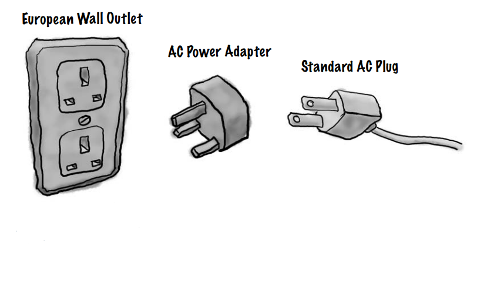

**European Wall Outlet** : güç almak için bir interface sunar

**AC Power Adapter** : bir interface'i başka bir interface'e dönüştürür.

**Standart AC Plug** : ABD dizüstü bilgisayarı başka bir interface bekliyor.

Adaptörün ne işe yaradığını biliyorsunuz: dizüstü bilgisayarınızın fişi ile Avrupa AC prizi arasında yer alır; görevi,
dizüstü bilgisayarınızı prize takıp güç alabilmeniz için Avrupa prizini uyarlamaktır. Ya da şöyle düşünün: adaptör
prizin interface'ini dizüstü bilgisayarınızın beklediği interface'e dönüştürür. Bazı AC adaptörleri basittir - sadece
prizin şeklini fişinize uyacak şekilde değiştirirler ve AC akımını doğrudan geçirirler - ancak diğer adaptörler dahili
olarak daha karmaşıktır ve cihazlarınızın ihtiyaçlarını karşılamak için gücü artırıp azaltmaları gerekebilir. Tamam, bu
gerçek dünya, peki ya nesne yönelimli adaptörler? OO adaptörlerimiz gerçek dünyadaki benzerleriyle aynı rolü oynarlar:
bir interface'i alırlar ve onu bir client'in beklediği interface'e adapte ederler.

# Object oriented adapters

Diyelim ki yeni bir Vendor sınıf kütüphanesini çalıştırmanız gereken mevcut bir yazılım sisteminiz var, ancak yeni
Vendor interface'leri bir önceki Vendor'dan farklı tasarladı:

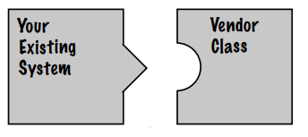

Interface'leri, kodunuzu yazdığınız interface ile eşleşmiyor. Bu işe yaramayacak!

Tamam, mevcut kodunuzu değiştirerek sorunu çözmek istemiyorsunuz (ve Vendor'un kodunu değiştiremezsiniz). Peki ne
yapacaksınız? Yeni vendor interface'ini beklediğiniz interface'e adapt eden bir sınıf yazabilirsiniz.

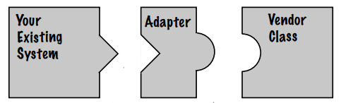

Adapter, sınıflarınızın beklediği interface'i implement eder. Ve talebinize hizmet vermek için Vendor interface'i ile
konuşur

Adapter, client'dan gelen istekleri alarak ve bunları Vendor sınıflarında anlamlı olan isteklere dönüştürerek arabulucu
görevi görür.

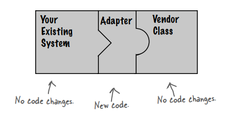

Yeni Vendor sınıflarını entegre etmek için HERHANGİ bir ek kod yazmanızı gerektirmeyen bir çözüm düşünebiliyor musunuz?
Vendor'un adapter sınıfını tedarik etmesine ne dersiniz?

# If it walks like a duck and quacks like a duck,then it must might be a duck turkey wrapped with a duck adapter...

Bir adapter'i iş başında görmenin zamanı geldi. Bölüm 1'deki Duck'ları hatırlıyor musunuz? Duck interface'lerinin ve
sınıflarının biraz basitleştirilmiş bir versiyonunu gözden geçirelim:

```
public interface Duck {
    void quack();
    void fly();
}
```

Bu sefer duck'larımız, duck'ların quack (vakvaklamasına) ve fly (uçmasına) izin veren bir Duck interface'ini implement
ediyorlar

İşte Duck sınıfının bir subclass'ı olan MallardDuck

```
public class MallardDuck implements Duck{
    @Override
    public void quack() {
        System.out.println("Quack");
    }

    @Override
    public void fly() {
        System.out.println("I'm flying");
    }
}
```

Şimdi bloktaki en yeni kümes hayvanıyla tanışma zamanı (hindi):

```
public interface Turkey {

    // Hindiler quack (vakvaklamaz) glu glu sesi çıkartır
    void gobble();

    //Hindi kuşları uçabilirler, ancak sadece kısa mesafeler için uçabilirler
    void fly();
}
```

WildTurkey class;

```
/* İşte Turkey'in concrete bir implementasyonu */
public class WildTurkey implements Turkey{
    @Override
    public void gobble() {
        System.out.println("Gobble gobble");
    }

    @Override
    public void fly() {
        System.out.println("I'm flying a short distance");
    }
}
```

Şimdi, diyelim ki Duck nesneleriniz yetersiz ve onların yerine bazı Turkey nesneleri kullanmak istiyorsunuz. Açıkçası
Turkey'leri doğrudan kullanamayız çünkü farklı bir interface'leri vardır. Öyleyse, bir Adapter yazalım:

```
/* İlk olarak, uyarladığınız türün interface'ini implemente etmeniz gerekir. Bu, client'in görmeyi beklediği 
interface'dir */
public class TurkeyAdapter implements Duck{

    Turkey turkey;

    public TurkeyAdapter(Turkey turkey) {
        /* Daha sonra, adapting nesneye bir referans almamız gerekir; burada bunu constructor aracılığıyla yaparız */
        this.turkey = turkey;
    }

    /* Şimdi interface'de ki tüm methodları implement etmemiz gerekiyor; sınıflar arasında quack() çevirisi kolaydır: 
    sadece gobble() methodunu çağırın */
    @Override
    public void quack() {
        turkey.gobble();
    }

    /* Her iki interface'in de bir fly() methodu olmasına rağmen, Turkey kısa aralıklarla uçar - Duck gibi uzun mesafeli 
    uçuş yapamazlar. Duck'ların fly() methodu ile Turkey'lerin fly() methodu arasında eşleme yapmak için Turkey'lerin 
    fly() methodunu beş kez çağırmamız gerekir */
    @Override
    public void fly() {
        for (int i = 0; i < 5; i++) {
            turkey.fly();
        }
    }
}
```

# Test drive the adapter

```
public class DuckTestDrive {
    public static void main(String[] args) {
        
        /* Bir Duck ve Turkey create edelim*/
        Duck mallardDuck = new MallardDuck();
        Turkey wildTurkey = new WildTurkey();

        /* Ve ardından Turkey'i bir TurkeyAdapter ile wrap edin, böylece onu bir Duck gibi görünmesini sağlar.*/
        Duck turkeyAdapter = new TurkeyAdapter(wildTurkey);

        /* Ardından, Turkey'i test edelim: gooble ve fly'i deneyelim */
        System.out.println("The turkey says...");
        wildTurkey.gobble();
        wildTurkey.fly();

        /* Şimdi aşağıdaki static testDuck() methodunu çağırarak Duck'ı test edelim. Bu method bir Duck nesnesi 
        bekler */
        System.out.println("\nThe Duck says");
        testDuck(mallardDuck);

        /* Şimdi büyük bir test: Turkey'i bir Duck gibi geçirmeye çalışıyoruz...*/
        System.out.println("\nThe, TurkeyAdapter says");
        testDuck(turkeyAdapter);
    }

    static void testDuck(Duck duck){
        duck.quack();
        duck.fly();
    }
}
```

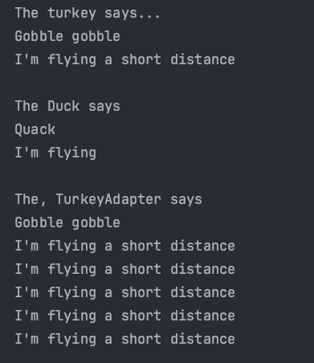

# The Adapter Pattern explained (Adapter Kalıbı Açıklaması)

Artık Adapter'in ne olduğu hakkında bir fikrimiz olduğuna göre, bir adım geri çekilip tüm parçalara tekrar bakalım.

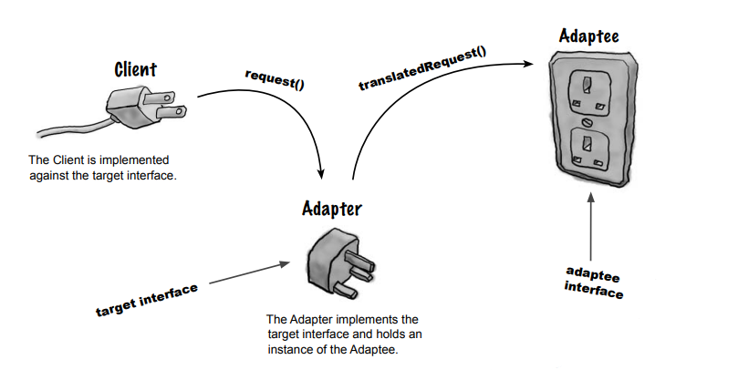

**Client** : target interface'e karşı implemente edilmektedir

**Adapter** : target interface'i implemet eder ve Adaptee'nin bir instance'ini tutar.

**TurkeyAdapter** : target interface'i (Duck) implemente etmiştir

**Turkey** : adaptee edilen interface'dir

### Here’s how the Client uses the Adapter (Client'in Adapter'i nasıl kullandığı aşağıda açıklanmıştır)

1 - Client, target interface'i kullanarak adapter'a bir method çağrısı yaparak istekte bulunur.

2 - Adapter, adaptee interface'ini kullanarak talebi adaptee üzerinde bir veya daha fazla çağrıya dönüştürür.

3 - Client çağrının sonuçlarını alır ve çeviriyi yapan bir adapter olduğunu asla bilmez.

Not : Client ve Adaptee'nin (uyarlanan) birbirinden ayrıldığına dikkat edin - ikisi de diğeri hakkında bilgi sahibi
değildir.

# Diyelim ki Duck'ı Turkey'ye dönüştüren bir Adapter'a da ihtiyacımız var. Buna DuckAdapter adını verelim */

```
/* Şimdi Turkey'leri Duck'lara uyarlıyoruz, bu yüzden Turkey interface'ini implement ediyoruz */
public class DuckAdapter implements Turkey {
    Duck duck;
    Random rand;
    
    public DuckAdapter(Duck duck) {
        /* Adapting ettiğimiz Duck'a bir referans saklıyoruz */
        this.duck = duck;
        /* Ayrıca random bir nesneyi yeniden yaratıyoruz; nasıl kullanıldığını görmek için fly() methoduna bakın */
        rand = new Random();
    }

  public void gobble() {
      /* Bir gobble sadece bir quack (vakvak) olur.
      duck.quack();
  }

  public void fly() {
      /* Duck'lar Turkey'lerden çok daha uzun süre uçtukları için, Duck'ı ortalama beş seferden birinde uçurmaya karar 
      verdik */
      if (rand.nextInt(5) == 0) {
          duck.fly();
      }
  }
}
```

--**DIALOGS**--

Q : Bir adapter'in ne kadar "adapting" yapması gerekir? Büyük bir target interface'i implemente etmem gerekirse, elimde
ÇOK fazla iş olabilir gibi görünüyor.

A : Kesinlikle yapabilirsiniz. Bir adapter'ı implement etmenin işi gerçekten de target interface'iniz olarak
desteklemeniz gereken interface'in boyutuyla orantılıdır. Ancak seçeneklerinizi düşünün. Interface'e yönelik tüm client
tarafı çağrılarınızı elden geçirebilirsiniz, bu da çok fazla araştırma çalışması ve kod değişikliğine neden olur. Ya da
tüm değişiklikleri tek bir sınıfta toplayan bir sınıfı temiz bir şekilde sağlayabilirsiniz.

Q : Bir adapter her zaman bir ve yalnızca bir sınıfı mı wrap eder?

A : Adapter Kalıbının rolü, bir interface'i diğerine dönüştürmektir. Adapter modelinin çoğu örneğinde bir adapter'in bir
adaptee'yi wrap ettiği görülse de, dünyanın genellikle biraz daha dağınık olduğunu ikimiz de biliyoruz. Bu nedenle, bir
adapter'in target interface'i implement etmek için gerekli olan iki veya daha fazla adaptee'yi tuttuğu durumlar
olabilir. Bu, Facade Deseni adı verilen başka bir desenle ilgilidir; insanlar genellikle ikisini karıştırır. Bu bölümün
ilerleyen kısımlarında facadeler hakkında konuşurken bu noktaya tekrar döneceğimizi hatırlatırız.

Q : Sistemimin eski ve yeni parçaları varsa, eski parçalar eski Vendor interface'ini bekliyorsa, ancak yeni parçaları
yeni Vendor interface'ini kullanacak şekilde zaten yazmışsak ne olur? Burada bir Adapter ve orada unwrapped
interface kullanmak kafa karıştırıcı olacaktır. Sadece eski kodumu yazıp Adapter'i unutmam daha iyi olmaz mı?

A : Şart değil. Yapabileceğiniz bir şey, her iki interface'i de destekleyen bir Two Way Adapter oluşturmaktır. Two Way
Adapter oluşturmak için, ilgili her iki interface'i de implemente edin, böylece adapter eski bir interface veya yeni bir
interface olarak hareket edebilir.

# Adapter Pattern defined

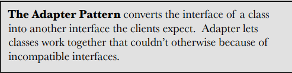

Adapter Kalıbı, bir sınıfın interface'ini Client'ların beklediği başka bir interface'e dönüştürür. Adapter, aksi
takdirde uyumsuz interface'ler nedeniyle birlikte çalışamayan sınıfların birlikte çalışmasını sağlar.

Şimdi, bu modelin, dönüşümü yapan bir Adapter oluşturarak uyumsuz bir interface'e sahip bir Client'i kullanmamıza izin
verdiğini biliyoruz. Bu, Client'i implemente edilen interface'den ayırma işlevi görür ve interface'in zaman içinde
değişmesini bekliyorsak, adapter bu değişikliği encapsulate eder, böylece Client'in farklı bir interface'e karşı
çalışması gerektiğinde her seferinde değiştirilmesi gerekmez. Kalıbın runtime davranışına bir göz attık; şimdi de sınıf
diyagramına bir göz atalım:

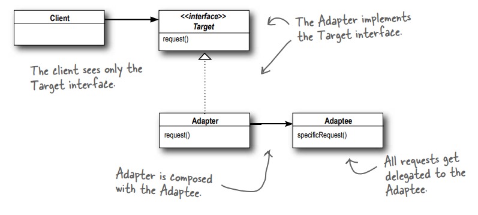

**Client** : yalnızca Target interface'i görür.

**Adapter** : Target Interface'i implemente eder. Adapter, Adaptee ile **composed** edilir

**Adaptee** : Tüm request'ler, Adaptee'ye delege edilir

Adapter Kalıbı iyi OO tasarım ilkeleriyle doludur: adaptörü değiştirilmiş bir arayüzle sarmak için nesne bileşiminin
kullanımına göz atın. Bu yaklaşım, adaptörün herhangi bir alt sınıfı ile bir adaptör kullanabilmemiz gibi ek bir
avantaja sahiptir.

Adapter Tasarım Deseni, iyi nesne yönelimli tasarım prensipleriyle doludur: adaptee edileni değiştirilmiş bir
interface'le wrap etmek için nesne composition'ı kullanmayı inceleyin. Bu yaklaşımın ek avantajı, adaptee edilenin
herhangi bir subclass'ını bir Adapter'le kullanabilme olanağı sunmasıdır. Ayrıca kalıbın Client'i bir implementasyona
değil bir interface'e nasıl bağladığına da bakın; her biri farklı bir backend sınıf kümesini dönüştüren birkaç adapter
kullanabiliriz. Ya da Target interface'ine bağlı kaldıkları sürece sonradan yeni implementasyonlar ekleyebiliriz.

# Object and class adapters

Şimdi kalıbı tanımlamış olmamıza rağmen, size henüz tüm hikayeyi anlatmadık. Aslında iki tür adapter vardır: nesne
adapter'ları ve sınıf adapter'ları. Bu bölümde nesne adapter'ları ele alınmıştır ve bir önceki sayfadaki sınıf diyagramı
bir nesne adapter'ının diyagramıdır.

Peki sınıf adapter'ı nedir ve neden size bundan bahsetmedik? Çünkü bunu implemente etmek için multi inheritance'a
ihtiyacınız vardır ve bu Java'da mümkün değildir. Multi inheritance için sınıf diyagramına bakalım.

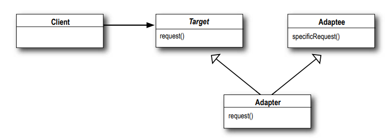

Adapter, Adaptee'yi uyarlamak için composition kullanmak yerine artık Adaptee ve Target sınıflarının subclass'larına
sahiptir.

# Class Adapter Example

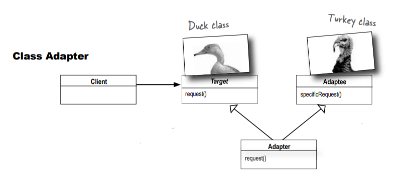

**Not** : Class adapter, multi inheritance kullanır, bu nedenle Java'da yapamazsınız...

**Client** : bir Duck ile konuştuğunu düşünüyor.

**<<interface>> Target** : Duck sınıfıdır. Bu, Client'in methodları çağırdığı şeydir.

**Adapter** : her iki sınıfı da (Duck ve Turkey) extend ederek Turkey'in bir Duck üzerindeki isteklere yanıt vermesini
sağlar.

**Adaptee** : Turkey sınıfı Duck ile aynı methodlara sahip değildir, ancak Adapter Duck method çağrılarını alabilir ve
dönüp Turkey üzerindeki methodları çağırabilir

# Object Adapter Example

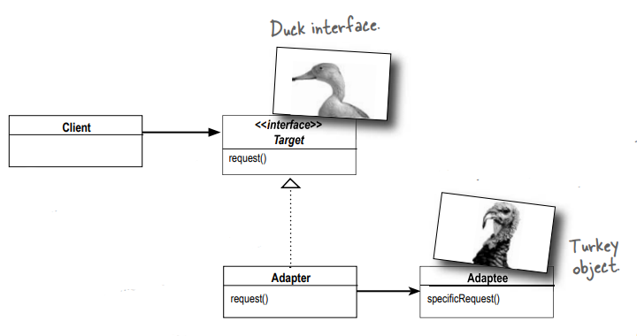

**Client** : bir Duck ile konuştuğunu düşünüyor.

**<<interface>> Target** : Tıpkı Class Adapter'da olduğu gibi, Target Duck sınıfıdır. Bu, client'in methodları çağırdığı
şeydir.

**Adapter** : Duck interface'ini implement eder, ancak bir method çağrısı aldığında geri döner ve çağrıları bir
Turkey'ye delege eder

**Adaptee** : Turkey sınıfı Duck ile aynı interface'e sahip değildir. Başka bir deyişle, Turkey'lerin quack() methodları
vb. yoktur. Adapter sayesinde Turkey (Adaptee), Client'in Duck interface'inde yaptığı çağrıları alacaktır

--**DIALOGS**--

**Object Adapter** : Composition kullandığım için avantajlıyım. Yalnızca bir adaptee sınıfını değil, onun herhangi bir
subclass'ını da adapt edebilirim.

**Class Adapter** : Bu doğru, belirli bir adaptee sınıfına bağlı olduğum için bu konuda sorun yaşıyorum, ancak büyük bir
avantajım var çünkü tüm adaptee'mi yeniden implemente etmem gerekmiyor. Gerekirse adaptee'min behavior'unu da override
edebilirim çünkü sadece subclassing yapıyorum.

**Object Adapter** : Benim dünyamda, inheritance yerine composition'ı kullanmayı severiz; birkaç satır koddan tasarruf
ediyor olabilirsiniz, ancak tek yaptığım, adaptee edene delegate etmek için küçük bir kod yazmaktır. Biz işleri esnek
tutmayı seviyoruz.

**Class Adapter** : Esnek olabilir, verimli mi? Bir Class Adapter kullanarak sadece bir tane ben varım, bir adapter ve
bir adaptee değil.

**Object Adapter** : Küçük bir nesne için mi endişeleniyorsunuz? Bir methodu hızlıca override edebilirsiniz, ancak
adapter koduma eklediğim herhangi bir behavior, adaptee sınıfım ve tüm subclass'ları ile çalışır.

**Class Adapter** : Evet, ama ya adaptee'nin bir subclass'ı yeni bir behavior eklerse. O zaman ne olur?

**Object Adapter** : Hey, anlayış göster, sadece subclass ile compose etmem gerekiyor, böylece o işe yarar hale gelir.

# Real world adapters (Gerçek dünya adapter'ları)

### Old world Enumerators

Eğer bir süredir Java ile ilgileniyorsanız, muhtemelen early koleksiyon tiplerinin (Vector, Stack, Hashtable ve birkaç
diğeri) elements() adında bir methodu implement ettiğini hatırlarsınız. Enumeration interface'i, koleksiyonun içindeki
öğeleri nasıl yönetildiğinin ayrıntılarına dair bilgi sahibi olmadan koleksiyonun öğeleri üzerinde adım adım
ilerlemenize olanak tanır.

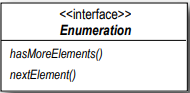

Enumeration basit bir interface'e sahiptir. Collection'da daha fazla öğe olup olmadığını size söyler. Collection
içerisinde ki bir sonraki elemanı size verir

### New World Iterators

Sun, daha yeni Collection sınıflarını piyasaya sürdüğünde, Enumeration gibi koleksiyondaki bir dizi öğeyi döngülemeye
olanak tanıyan Iterator interface'ini kullanmaya başladı, aynı zamanda öğeleri kaldırma yeteneği ekledi.

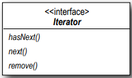

hasNext() : Enumeration interface'indeki hasMoreElements() metoduna benzer. Bu metod sadece koleksiyondaki tüm öğeleri
inceleyip incelemediğinizi size söyler.

next() : Collection'da ki bir sonraki öğeyi verir

remove() : Collection'dan bir item'i remove eder

### And today...

Çoğu zaman, yalnızca Iterator'ları kullanmak istediğimiz yeni kodumuz için Enumerator interface'ini sunan eski kodlarla
karşı karşıya kalırız gibi görünüyor. Adapter oluşturmamız gerekiyor gibi gözüküyor.

# Adapting an Enumeration to an Iterator

Öncelikle iki interface'i inceleyeceğiz ve birinden diğerine methodların nasıl eşlendiğini anlamaya çalışacağız. Başka
bir deyişle, client target üzerinde bir method çağırdığında adaptee edilen üzerinde neyi çağıracağımızı belirlemeye
çalışacağız.

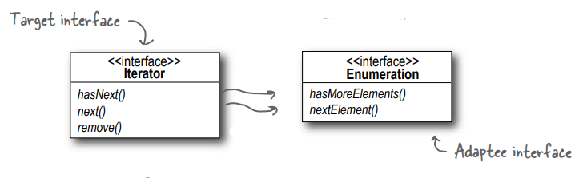

Bu iki method kolay görünüyor, doğrudan hasNext() ve next() methodlarına eşleniyor gibi görünüyor.

hasNext() -> hasMoreElements()
next() -> nextElement()

Ancak Iterator'daki remove() methodu nedir? Enumeration'da böyle bir şey yok.

# Designing the Adapter

İşte sınıfların nasıl görünmesi gerektiği: Target interface'i implement eden ve bir adaptee ile composed edilen bir
adapter'a ihtiyacımız var. hasNext() ve next() methodlarını target'dan adapte etmek kolay olacak: bunları doğrudan
geçiririz. Ancak remove() hakkında ne yapmanız gerektiğini düşünün. Şu an için şu sınıf diyagramını göz önünde
bulundurun:

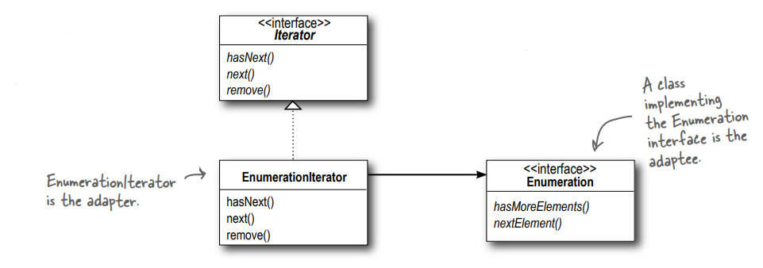

Yeni kodunuz, altında gerçekte bir Enumeration bulunsa bile hala Iterator'ları kullanmaya devam edebilir.

Eski kodunuzdaki Enumeration'ları, yeni kodunuz için Iterator gibi görünmesini sağlıyoruz.

EnumerationIterator adapter'dir

Enumeration interface'ini implement eden bir sınıf adaptee'dir

# Dealing with the remove() method

Evet, Enumeration'ın remove işlemini desteklemediğini biliyoruz. Bu bir "read-only" interface'dir. Adapter üzerinde
tam işlevsel bir remove() methodu uygulamanın bir yolu yok. En iyi yapabileceğimiz şey bir runtime exception
fırlatmaktır. Neyse ki, Iterator interface'inin tasarımcıları bu ihtiyacı önceden gördüler ve remove() methodunu
UnsupportedOperationException'ı destekleyecek şekilde tanımladılar. Bu gibi bir durumda adapter mükemmel olmayabilir;
client'lar potansiyel exception'lara dikkat etmelidir, ancak client dikkatli ve adapter iyi belgelenmişse bu mükemmel
bir çözümdür.

# Writing the EnumerationIterator adapter

```
/* Enumeration'ı Iterator'a uyarladığımız için, Adapter'ımız Iterator interface'ini implement eder...
bu bir Iterator gibi görünmelidir.*/

public class EnumerationIterator implements Iterator {
    Enumeration enumeration;

    /* Uyarlama yaptığımız Enumeration. Composition kullanıyoruz, bu yüzden onu bir instance variable'da saklıyoruz.*/
    public EnumerationIterator(Enumeration enumeration) {
        this.enumeration = enumeration;
    }

    /* Iterator'ın hasNext() methodu Enumeration'ın hasMoreElements() methoduna delege edilir...*/
    @Override
    public boolean hasNext() {
        return enumeration.hasMoreElements();
    }

    /* Iterator'ın next() methodu Enumeration'ın nextElement() methoduna delege edilir...*/
    @Override
    public Object next() {
        return enumeration.nextElement();
    }

    /* Iterator'ın remove() methodunu destekleyemiyoruz. Burada sadece bir exception fırlatıyoruz.*/
    @Override
    public void remove() {
        throw new UnsupportedOperationException();
    }
}
```

--**DIALOGS**--

**Decorator** : Benim işim tamamen responsibility (sorumlulukla) ilgili - bir Decorator işin içine girdiğinde
tasarımınıza bazı yeni sorumluluklar veya behavior'lar ekleneceğini bilirsiniz.

**Adapter** : Kirli işi yapan siperlerdeyiz: interface'leri dönüştürüyoruz. İşlerimiz cazip olmayabilir, ancak
client'larımız kesinlikle hayatlarını daha basit hale getirmemizi takdir ediyorlar.

**Decorator** : Bu doğru olabilir, ancak çok çalışmadığımızı düşünmeyin. Büyük bir interface'i decorate etmemiz
gerektiğinde, vay canına, bu çok fazla kod gerektirebilir.

**Adapter** : Client'ların beklediği interface'i sağlamak için birkaç sınıfı bir araya getirmeniz gerektiğinde bir
adapter olmayı deneyin. İşte bu zordur. Ama bir sözümüz vardır: "an uncoupled client is a happy client."

**Decorator** : Çok şirin. Tüm övgüyü bizim aldığımızı düşünmeyin; bazen kim bilir kaç tane başka decorator tarafından
wrap edilen tek bir decorator oluyorum. Bir method çağrısı size delege edildiğinde, kaç tane başka decorator'ın bu
çağrıyla ilgilendiğini bilemezsiniz ve bu isteğe hizmet etme çabalarınızın fark edilip edilmeyeceğini de bilemezsiniz.

**Adapter** : Hey, eğer adapter'ler işlerini yapıyorlarsa, client'larımız orada olduğumuzu asla bilmezler. Ancak, biz
adapter'ların en güzel yanı, client'ların herhangi bir kod değişikliği yapmadan yeni kütüphaneleri ve alt kümeleri
kullanmalarına izin vermemizdir, sadece onlar için dönüşümü yapmamıza güvenirler

**Decorator** : Biz Decorator'lar de bunu yapıyoruz, sadece mevcut kodu değiştirmeden sınıflara yeni behavior'lar
eklenmesine izin veriyoruz. Ben hala adapter'lerin sadece süslü decorator'lar olduğunu söylüyorum - yani, tıpkı bizim
gibi, bir nesneyi wrap edersiniz.

**Adapter** : Hayır, hayır, hayır, hiç de değil. Biz her zaman wrap ettiğimiz şeyin interface'ini dönüştürürüz, siz asla
dönüştürmezsiniz. Bir decorator'in bir adapter gibi olduğunu söyleyebilirim; sadece interface'i değiştirmezsiniz!

**Decorator** : Hayır. Hayattaki işimiz, wrap ettiğimiz nesnelerin behavior'larını veya responsibility'lerini extend
etmektir.

**Adapter** : Hey, sen kime basit bir geçiş diyorsun? Aşağı gelin ve birkaç interface dönüştürmeye ne kadar
dayanabileceğinizi görelim!

# And now for something different... (Ve şimdi farklı bir şey için...)

### There’s another pattern in this chapter (Bu bölümde başka bir model daha var)

Adapter Pattern'in bir sınıfın interface'ini bir client'in beklediği interface'e nasıl dönüştürdüğünü gördünüz. Java'da
bunu, uyumsuz bir arayüze sahip nesneyi doğru interface'i implemente eden bir nesneyle wrap ederek başardığımızı da
biliyorsunuz. Şimdi bir interface'i değiştiren bir kalıba bakacağız, ancak farklı bir nedenle: interface'i
basitleştirmek için. Bu kalıba uygun bir şekilde Facade Kalıbı adı verilmiştir çünkü bu kalıp bir veya daha fazla
sınıfın tüm karmaşıklığını temiz, iyi aydınlatılmış bir facade'in arkasına gizler.

# Home Sweet Home Theater

Araştırmanızı yaptınız ve bir DVD oynatıcı, bir projeksiyon video sistemi, otomatik bir ekran, surround ses ve hatta bir
patlamış mısır patlatıcısı ile tamamlanmış harika bir sistem kurdunuz. Bir araya getirdiğiniz tüm component'lere göz
atın:

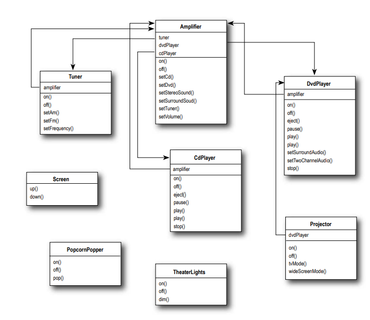

Bu çok sayıda sınıf, çok sayıda etkileşim ve öğrenilmesi ve kullanılması gereken çok sayıda interface anlamına gelir.

Haftalarca kablo döşediniz, projektörü monte ettiniz, tüm bağlantıları ve ayarları yaptınız. Şimdi her şeyi harekete
geçirme ve bir filmin keyfini çıkarma zamanı...

# Watching a movie (the hard way) (Bir film izlemek (zor yoldan))

1 - Patlamış mısır makinesini açın.

2 - Popper'ı patlatmaya başlayın

3 - Işıkları kısın

4 - Perdeyi aşağı indirin

5 - Projector'u açın

6 - Projector'un input'unu DVD olarak ayarlayın

7 - Projector'u wide screen moduna getirin.

8 - Sound Amplifier'i açın

9 - Amplifier'in input'unu DVD olarak ayarlayın

10 - Amplifier'i surround sound'a set edin

11 - Amplifier'in volume'unu medium(5)'e set edin

12 - DVD Player'i açın

13 - DVD Player'da oynatmayı başlatın

### Aynı görevlere sınıflar ve bu görevleri yerine getirmek için gereken method çağrıları açısından bakalım

```
Popper popper = new Popper();

// Patlamış mısır makinesini aç ve patlatmayı başlat...
popper.on();
popper.pop();

Lights lights = new Lights();
// Işıkları %10 seviyesine indir
lights.dim(10);

Screen screen = new Screen();
// perdeyi indir
screen.down();

Dvd dvd = new Dvd();

Projector projector = new Projector();
// projector'u ac ve wide screen mode'a gec
projector.on();
projector.setInput(dvd);
projector.wideScreenMode();

Amp amp = new Amp();
// Amplifier'i ac, dvd'yi set et, sesi surround sound'a set et ve volume 5 olarak ayarla
amp.on();
amp.setDvd(dvd);
amp.setSurroundSound();
amp.setVolume(5);

// dvd player'i aç, movie'yi oynat
dvd.on();
dvd.play(movie);
```

### Ama daha fazlası var...

* Film bittiğinde, her şeyi nasıl kapatıyorsunuz? Tüm bunları tersten tekrar yapmanız gerekmez mi?

* Bir CD ya da radyo dinlemek kadar karmaşık olmaz mıydı?

* Sisteminizi yükseltmeye karar verirseniz, muhtemelen biraz farklı bir prosedür öğrenmeniz gerekecektir.

Peki ne yapmalı? Ev sinema sisteminizi kullanmanın karmaşıklığı ortaya çıkıyor! Bakalım Facade Deseni bizi bu karmaşadan
nasıl kurtaracak, böylece filmin tadını çıkarabileceğiz...

# Lights, Camera, Facade! (Işıklar, Kamera, Facade!)

Bir Facade tam da ihtiyacınız olan şeydir: Facade Pattern ile complex bir subsystem alabilir ve daha makul bir interface
sağlayan bir Facade sınıfını implemente ederek kullanımını kolaylaştırabilirsiniz. Endişelenmeyin; complex subsystem
gücüne ihtiyacınız varsa, kullanmanız için hala oradadır, ancak ihtiyacınız olan tek şey basit bir interface ise, Facade
sizin için oradadır. Şimdi Facade'in nasıl çalıştığına bir göz atalım:

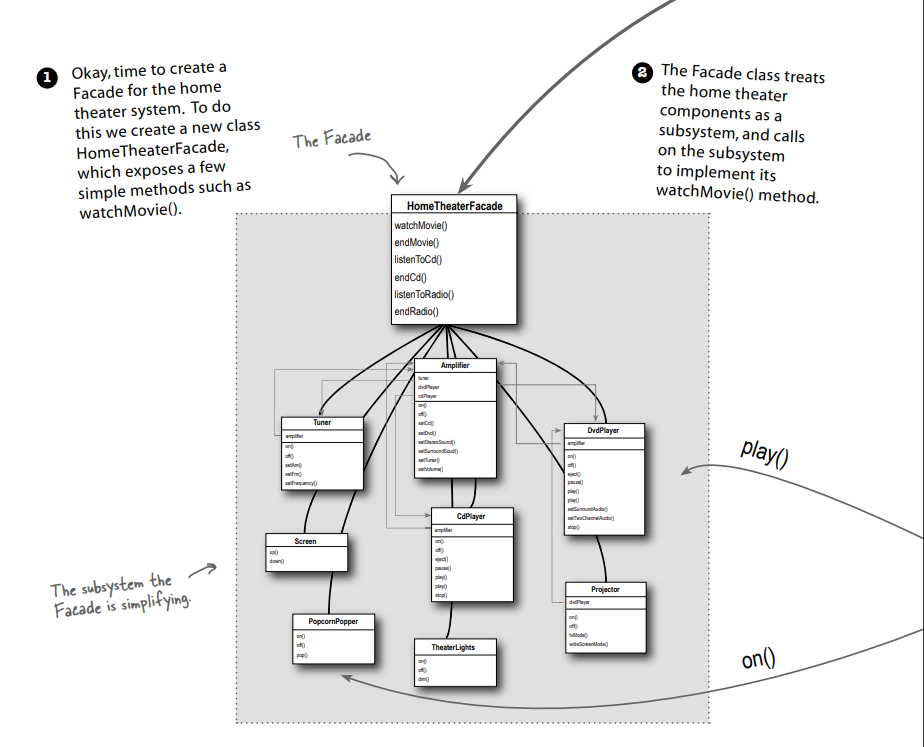

1 - Pekala, ev sinema sistemi için bir Facade oluşturma zamanı. Bunu yapmak için, watchMovie() gibi birkaç basit methodu
ortaya çıkaran yeni bir HomeTheaterFacade sınıfı oluşturuyoruz.

2 - Facade sınıfı, ev sineması componentlerini bir subsystem olarak ele alır ve watchMovie() methodunu implemente etmek
için subsystem'i çağırır.

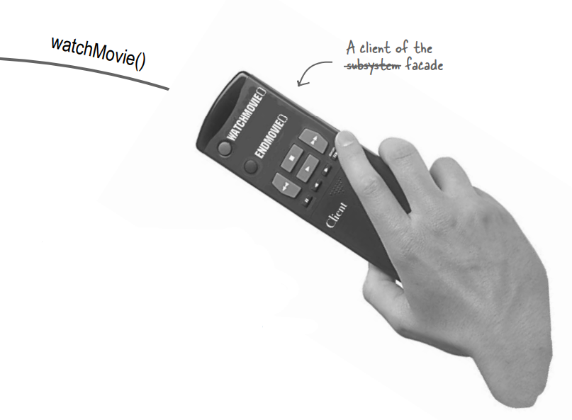

3 - Client kodunuz artık subsystem'deki değil, ev sineması Facade'ında ki methodları çağırıyor. Artık bir film izlemek
için sadece watchMovie() methodunu çağırıyoruz ve bu method bizim için ışıklarla, DVD oynatıcıyla, projektörle,
amplifikatörle, ekranla ve patlamış mısır makinesiyle iletişim kuruyor.

4 - Facade, subsystem'i doğrudan kullanılmak üzere erişilebilir bırakmaya devam eder. Subsystem sınıflarının gelişmiş
işlevselliğine ihtiyacınız varsa, bunlar kullanımınıza hazırdır.

Bir facade sadece bir interface'i basitleştirmekle kalmaz, aynı zamanda bir client'i bir component subsystem'indan
ayırır.

Facade'ler ve adapter'lar birden fazla sınıfı wrap edebilir, ancak bir facade'in amacı basitleştirmek, bir adapter'in
amacı ise interface'i farklı bir şeye dönüştürmektir.

--**DIALOGS**--

Q : Facade subsystem sınıflarını encapsulate ederse, low-level işlevselliğe ihtiyaç duyan bir client bunlara nasıl
erişebilir?

A : Facade'ler subsystem sınıflarını "encapsule etmezler"; sadece işlevlerine basitleştirilmiş bir interface sağlarlar.
Subsystem sınıfları, daha spesifik interface'ler kullanması gereken client'lar tarafından doğrudan kullanılmaya devam
eder. Bu, Facade Pattern'in güzel bir özelliğidir: basitleştirilmiş bir interface sağlarken, sistemin tüm işlevselliğini
ihtiyaç duyabilecek kişilere sunmaya devam eder.

Q : Facade herhangi bir işlevsellik ekliyor mu yoksa sadece her isteği subsystem'e mi aktarıyor?

A : Bir Facade, subsystem'i kullanmanın yanı sıra kendi "smarts özelliklerini" eklemekte özgürdür. Örneğin, ev sineması
facade'imiz herhangi bir yeni behavior implement etmese de, patlamış mısırın patlamadan önce açılması gerektiğini
bilecek kadar akıllıdır (ayrıca bir film gösteriminin nasıl açılacağı ve sahneleneceği ile ilgili ayrıntılar).

Q : Her subsystem'in yalnızca bir facade'i mi olur?

A : Zorunlu değildir. Desen, belirli bir subsystem için herhangi bir sayıda facade oluşturulmasına kesinlikle izin
verir.

Q : Artık daha basit bir interface'e sahip olduğum gerçeğinden başka Facade'in faydası nedir?

A : Facade Pattern ayrıca client implementasyonunuzu herhangi bir subsystem'den ayırmanıza olanak tanır. Örneğin, büyük
bir zam aldığınızı ve ev sinema sisteminizi farklı interface'lere sahip tüm yeni componentlere yükseltmeye karar
verdiğinizi varsayalım. Client'inizi subsystem yerine facade'a kodlarsanız, client kodunuzun değişmesi gerekmez,
sadece facade değişir (ve umarım Vendor bunu sağlar!).

Q : Yani Adapter Kalıbı ile Facade Kalıbı arasındaki farkı söylemenin yolu, adapter'in bir sınıfı wrap etmesi ve facade'
ın birçok sınıfı temsil edebilmesi mi?

A : Hayır! Unutmayın, Adapter Kalıbı bir veya daha fazla sınıfın interface'ini bir client'in beklediği tek bir
interface'e dönüştürür. Çoğu ders kitabı örneği adapter'in bir sınıfı adapting (uyarladığını) ettiğini gösterse de, bir
client'in kodlandığı interface'i sağlamak için birçok sınıfı adapting (uyarlamanız) etmeneniz gerekebilir. Benzer
şekilde, bir Facade çok karmaşık bir interface'e sahip tek bir sınıfa basitleştirilmiş bir interface sağlayabilir. İkisi
arasındaki fark, kaç sınıfı "wrap ettikleri" değil, amaçlarıdır. Adapter Kalıbının amacı, bir interface'i bir client'in
beklediği interface ile eşleşecek şekilde değiştirmektir. Facade Pattern'in amacı ise bir subsystem'a basitleştirilmiş
bir interface sağlamaktır.

# Constructing your home theater facade (Ev sinema sisteminizin facade'inin oluşturulması)

HomeTheaterFacade'in yapımını adım adım inceleyelim: İlk adım, facade'in subsystem'in tüm componentlerine erişebilmesi
için composition kullanmaktır:

```
public class HomeTheaterFacade {
    /* İşte composition; bunlar kullanacağımız subsystem'in tüm componentleri */
    Ampilifier ampilifier;
    Tuner tuner;
    DvdPlayer dvdPlayer;
    CdPlayer cd;
    Projector projector;
    TheaterLights lights;
    Screen screen;
    PopcornPopper popper;

    /* Facade'a, constructor'ında subsystem'in her bir component'ine bir referans aktarılır. Facade daha sonra her 
    birini ilgili instance variable'a atar */
    public HomeTheaterFacade(Ampilifier ampilifier,
                             Tuner tuner,
                             DvdPlayer dvdPlayer,
                             CdPlayer cd,
                             Projector projector,
                             TheaterLights lights,
                             Screen screen,
                             PopcornPopper popper)
    {
        this.ampilifier = ampilifier;
        this.tuner = tuner;
        this.dvdPlayer = dvdPlayer;
        this.cd = cd;
        this.projector = projector;
        this.lights = lights;
        this.screen = screen;
        this.popper = popper;
    }

    /* Şimdi subsystem'in component'lerini birleşik bir interface'de bir araya getirmenin zamanı geldi. 
    watchMovie() ve endMovie() methodlarını implement edelim */
    public void watchMovie(String movie){

        /* watchMovie() daha önce elle yapmak zorunda kaldığımız aynı sırayı takip eder, ancak tüm işi yapan kullanışlı 
        bir methodla tamamlar. Her görev için sorumluluğu subsystem'daki ilgili componente devrettiğimize dikkat edin */
        System.out.println("Get ready to watch a movie");

        popper.on();
        popper.pop();

        lights.dim(10);

        screen.down();

        projector.on();
        projector.wideScreenMode();

        ampilifier.on();
        ampilifier.setDvd(dvdPlayer);
        ampilifier.setSurroundSound();
        ampilifier.setVolume(5);

        dvdPlayer.on();
        dvdPlayer.play(movie);
    }

    /* Ve endMovie() bizim için her şeyi kapatmaya özen gösterir. Yine, her görev subsystem'daki uygun componente 
    devredilir */
    public void endMovie(){
        System.out.println("shutting movie theater down");

        popper.off();

        lights.on();

        screen.up();

        projector.off();

        ampilifier.off();

        dvdPlayer.stop();
        dvdPlayer.eject();
        dvdPlayer.stop();
    }
}
```

# Time to watch a movie (the easy way) (Film izleme zamanı (kolay yol))

```
public class App {
    public static void main(String[] args) {
        PopcornPopper popper = new PopcornPopper();
        TheaterLights lights = new TheaterLights();
        Screen screen = new Screen();
        DvdPlayer dvd = new DvdPlayer();
        Projector projector = new Projector();
        Ampilifier amp = new Ampilifier();
        Tuner tuner = new Tuner();
        CdPlayer cd = new CdPlayer();

        /* İlk olarak Facade'i subsystem'da ki tüm componentlerler birlikte instantiate ederiz */
        HomeTheaterFacade facade = new HomeTheaterFacade(
          amp,tuner,dvd,cd,projector,lights,screen,popper
        );

        /* Filmi önce başlatmak ve sonra kapatmak için basitleştirilmiş interface'i kullanın */
        facade.watchMovie("Raiders of the Lost Ark");
        facade.endMovie();
    }
}
```

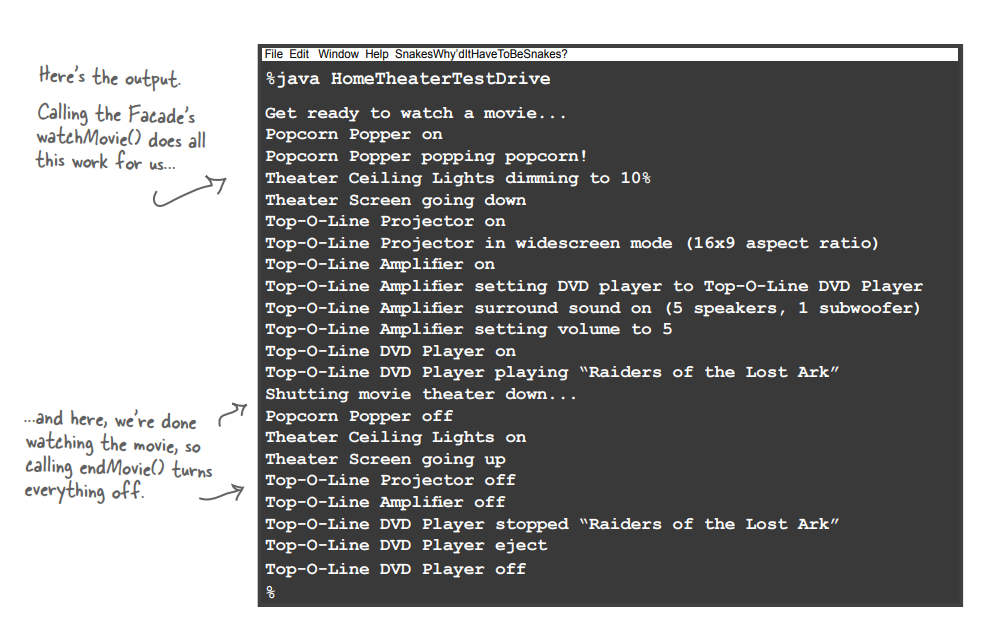

# Facade Pattern defined

Facade Kalıbını kullanmak için, bazı subsystem'lere ait daha complex sınıflar kümesini basitleştiren ve birleştiren bir
sınıf yaratırız. Pek çok kalıbın aksine, Facade oldukça basittir; kafanızı kurcalayacak akıl almaz abstractionlar
yoktur. Ancak bu onu daha az güçlü yapmaz: Facade Kalıbı, client'lar ve subsystem'ler arasındaki tight coupling (sıkı
bağlantıdan) kaçınmamızı sağlar ve birazdan göreceğiniz gibi, yeni bir nesne yönelimli ilkeye bağlı kalmamıza da
yardımcı olur. Bu yeni prensibi tanıtmadan önce, kalıbın resmi tanımına bir göz atalım:

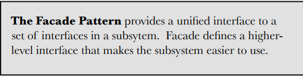

Facade Pattern, bir subsystem'deki bir dizi interface'e tek bir interface sağlar. Facade, subsystem'in kullanımını
kolaylaştıran daha higher-level bir interface tanımlar.

Burada zaten bilmediğiniz pek bir şey yok, ancak bir kalıp hakkında hatırlanması gereken en önemli şeylerden biri
amacıdır. Bu tanım bize açık ve net bir şekilde facade'in amacının basitleştirilmiş bir interface aracılığıyla bir
subsystem'in kullanımını kolaylaştırmak olduğunu söylüyor. Bunu modelin sınıf diyagramında görebilirsiniz:

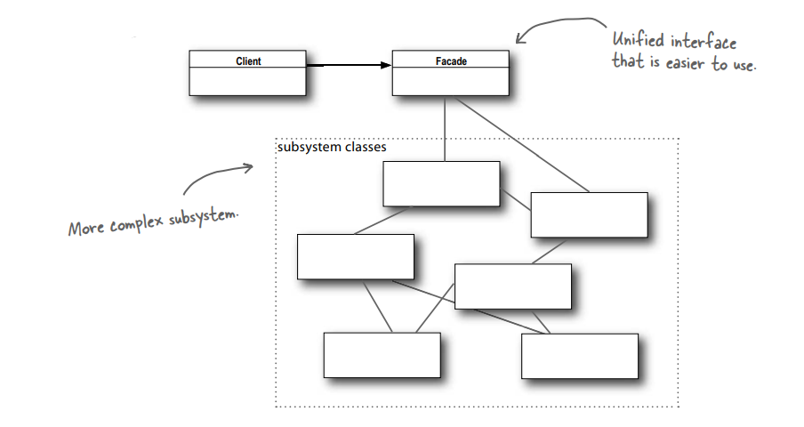

**Client** : Facade sayesinde işi kolaylaşan mutlu müşteri

**Facade** : Kullanımı daha kolay olan birleşik Interface

# The Principle of Least Knowledge (En Az Bilgi İlkesi)

En Az Bilgi İlkesi (The Principle of Least Knowledge), nesneler arasındaki etkileşimleri yalnızca birkaç yakın "friends"
arasında sınırlamamızı önerir. Bu principle genellikle şöyle ifade edilir:

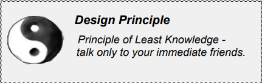

En Az Bilgi İlkesi (The Principle of Least Knowledge) - sadece yakın arkadaşlarınızla konuşun

Peki bu gerçek anlamda ne anlama geliyor? Bir sistem tasarlarken, herhangi bir nesne için, etkileşime girdiği sınıfların
sayısına ve bu sınıflarla nasıl etkileşime girdiğine dikkat edin anlamına gelir.Bu ilke, çok sayıda sınıfın birbirine
bağlı olduğu tasarımlar oluşturmamızı engeller, böylece sistemin bir bölümündeki değişiklikler diğer bölümlere de
yansır. Birçok sınıf arasında çok fazla bağımlılık oluşturduğunuzda, bakımı maliyetli ve başkalarının anlaması için
karmaşık olacak kırılgan bir sistem inşa etmiş olursunuz.

# How NOT to Win Friends and Influence Objects (Nasıl Arkadaş Kazanmaz ve Nesneleri Etkilemezsin)

Peki, ama bunu yapmaktan nasıl kaçınırsınız? İlke bazı yönergeler sağlar: herhangi bir nesneyi alın; şimdi bu nesnedeki
herhangi bir methoddan, ilke bize yalnızca nesneye ait methodları çağırmamız gerektiğini söyler:

* Object'in kendisi

* Methoda parametre olarak geçirilen object'ler

* Methodun oluşturduğu veya instantiate ettiği herhangi bir object

* Object için herhangi bir component

Bu yönergelerin bize başka methodların çağrılmasıyla döndürülen nesneler üzerindeki methodları çağırmamamızı söylediğine
dikkat edin! Bir "component'i", bir instance variable tarafından referans verilen herhangi bir nesne olarak düşünün.
Başka bir deyişle bunu bir HAS-A ilişkisi olarak düşünün. Bu kulağa biraz katı geliyor, değil mi? Başka bir çağrıdan
geri aldığımız bir nesnenin methodunu çağırmanın ne zararı var? Eğer bunu yaparsak, başka bir nesnenin subpart'ından
istekte bulunmuş oluruz (ve doğrudan bildiğimiz nesnelerin sayısını artırmış oluruz). Bu gibi durumlarda, ilke bizi
nesneden bizim için istekte bulunmasını istemeye zorlar; bu şekilde onun component nesnelerini bilmek zorunda kalmayız (
ve arkadaş çevremizi küçük tutarız). Örneğin:

### Without the principle

```
public float getTemp() {
    /* Burada station'dan termometre nesnesini alıyoruz ve ardından getTemperature() methodunu kendimiz çağırıyoruz */
    Thermometer thermometer = station.getThermometer();
    return thermometer.getTemperature();
}
```

### With the principle

```
public float getTemp() {
    /* Prensibi uyguladığımızda, Station sınıfına bizim için termometreye istekte bulunan bir method ekleriz. Bu, 
    bağımlı olduğumuz sınıf sayısını azaltır */
    return station.getTemperature();
}
```

# Keeping your method calls in bounds... (Method çağrılarınızı sınırlar içinde tutmak...)

Burada, methodları çağırabileceğiniz ve yine de Principle of Least Knowledge prensiplerine bağlı kalabileceğiniz tüm
yolları gösteren bir Car sınıfı var:

```
public class Car {

    /* İşte bu sınıfın bir componenti. Methodlarını çağırabiliriz.*/
    Engine engine;

    public Car(Engine engine) {
        this.engine = engine;
    }

    /* Parametre olarak geçirilen bir nesne üzerinde bir method çağırabilirsiniz. */
    public void start(Key key){
        /* Burada yeni bir object oluşturuyoruz, methodları legal. */
        Doors doors = new Doors();

        /* Parametre olarak geçirilen bir nesne üzerinde bir method çağırabilirsiniz. */
        boolean authorized = key.turns();

        if (authorized){
            /* Object'nin bir component'i üzerinde bir method çağırabilirsiniz */
            engine.start();
            /* Object içinde local bir method çağırabilirsiniz */
            updateDashboardDisplay();
            /* Oluşturduğunuz veya instantiate ettiğiniz bir nesne üzerinde bir method çağırabilirsiniz.*/
            doors.lock();
        }
    }

    /* local method */
    public void updateDashboardDisplay(){
        // update display
    }
}
```

* Sınıfın Component'i üzerinde ki bir methodu çağırabilirsiniz

* Parametre olarak geçirilen bir nesne üzerinde bir method çağırabilirsiniz

* Object içinde local bir method çağırabilirsiniz

* Oluşturduğunuz veya instantiate ettiğiniz bir nesne üzerinde bir method çağırabilirsiniz

--**DIALOGS**--

Q : Başka bir Principle'a da "Law Of Demeter" denir; bunların birbiri ile ilişkisi nedir?

A : İkisi bir ve aynıdır ve bu terimlerin birbirine karıştırıldığını göreceksiniz. Birkaç nedenden dolayı Priciple of
Least Knowledge kullanmayı tercih ediyoruz

1 - isim daha sezgiseldir

2 - "Law" kelimesinin kullanılması, bu ilkeyi her zaman uygulamak zorunda olduğumuzu ima etmektedir. Aslında hiçbir
ilke kanun değildir, tüm ilkeler yararlı oldukları zaman ve yerde kullanılmalıdır. Tüm tasarımlar denge içerir (
abstraction'lara karşı hız, space'e karşı zaman vb.) ve ilkeler rehberlik sağlarken, bunları uygulamadan önce tüm
faktörler dikkate alınmalıdır.

Q : Principle of Least Knowledge uygulamanın herhangi bir dezavantajı var mı?

A : Evet; bu ilke nesneler arasındaki bağımlılıkları azaltırken ve çalışmalar bunun yazılım bakımını azalttığını
gösterirken, bu ilkenin uygulanmasının diğer component'lere yapılan method çağrılarını işlemek için daha fazla "
wrapper" sınıf yazılmasına neden olduğu da bir gerçektir. Bu da karmaşıklığın ve geliştirme süresinin artmasının
yanı sıra çalışma zamanı performansının düşmesine neden olabilir.

--**Sharpen your pencil**--

Bu sınıflardan herhangi biri Principle of Least Knowledge ihlal ediyor mu? Neden ya da neden değil?

```
public House {
    WeatherStation station;
    // other methods and constructor
    public float getTemp() {
        /* Principle of Least Knowledge İhlal Ediyor! Başka bir çağrıdan dönen bir nesnenin methodunu çağırıyorsunuz */
        return station.getThermometer().getTemperature();
    }
}
```

```
public class House {
    WeatherStation station;

    // other methods and constructor
    
    public float getTemp() {
        Thermometer thermometer = station.getThermometer();
        return getTempHelper(thermometer);
    }

    public float getTempHelper(Thermometer thermometer) {
        return thermometer.getTemperature();
    }
}
```

Aykırı değil! Bu, principle'i çevreleyerek bir yol bulma gibi görünüyor. Gerçekten de sadece çağrıyı başka bir methoda
taşıdığımızdan beri ne değişti?

# The Facade and the Principle of Least Knowledge (Facade ve En Az Bilgi İlkesi)

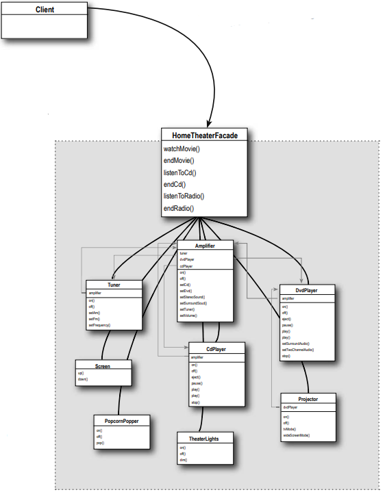

**Client** : Bu Client'in yalnızca bir arkadaşı vardır; HomeTheaterFacade. OO programlamada, sadece bir arkadaşa sahip
olmak İYİ bir şeydir!

**HomeTheaterFacade** : client için tüm bu subsystem component'lerini yönetir. Client'i basit ve esnek tutar. Client'i
etkilemeden ev sineması component'lerini yükseltebiliriz. Subsystem'leri de Principle of Least Knowledge'a bağlı tutmaya
çalışıyoruz. Bu çok karmaşık hale gelirse ve çok fazla friend birbirine karışırsa, subsystem katmanları oluşturmak için
ek facade'lar ekleyebiliriz.

### Adapter

Bir sınıfın interface'ini client'ların beklediği başka bir interface'e dönüştürür. Uyumsuz interface'ler nedeniyle
birlikte çalışamayan sınıfların birlikte çalışmasını sağlar.

### Facade

Bir subsystem'da ki bir dizi interface'e birleşik bir interface sağlar. Facade, subsystem'in kullanımını kolaylaştıran
daha üst düzey bir interface tanımlar.

--**BULLET POINTS**--

* Mevcut bir sınıfı kullanmanız gerektiğinde ve interface'i ihtiyacınız olan interface olmadığında, bir adapter
  kullanın.

* Büyük bir interface'i veya complex interface'ler kümesini basitleştirmeniz ve birleştirmeniz gerektiğinde, bir facade
  kullanın.

* Bir adapter, bir interface'i bir client'in beklediği bir interface'e dönüştürür.

* Bir facade, bir client'i complex bir subsystem'dan ayırır.

* Bir adapter'in implement edilmesi, target interface'in boyutu ve karmaşıklığına bağlı olarak az veya çok çalışma
  gerektirebilir

* Bir facade implement etmek, facade'i subsystem ile birleştirmemizi ve facade'nin işini yapmak için delegation
  kullanmamızı gerektirir.

* Adapter Deseni'nin iki türü vardır: object ve class adapters. Class adapter'lar multi inheritance gerektirir.

* Bir subsystem için birden fazla facade implement edebilirsiniz

* Bir adapter interface'ini değiştirmek için bir nesneyi wrap eder, bir decorator yeni behavior'lar ve sorumluluklar
  eklemek için bir nesneyi wrap eder ve bir facade basitleştirmek için bir dizi nesneyi "wrap eder".
