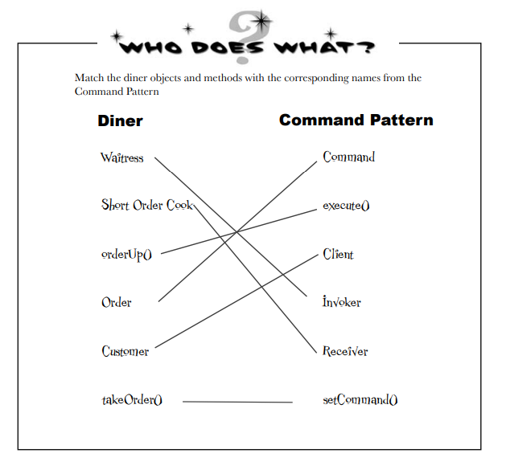
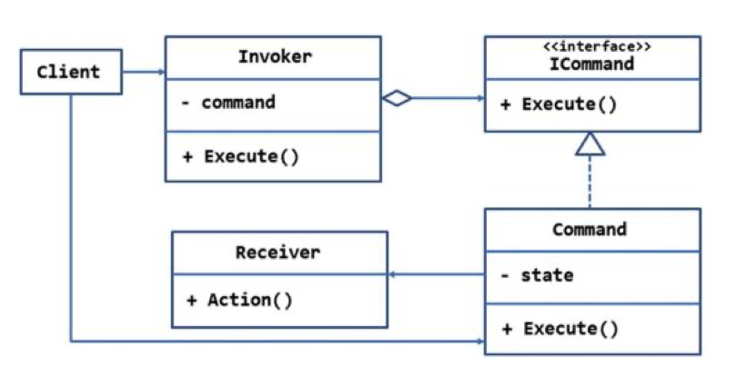
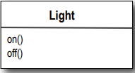
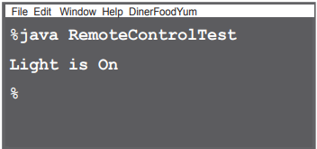
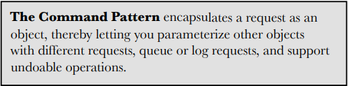
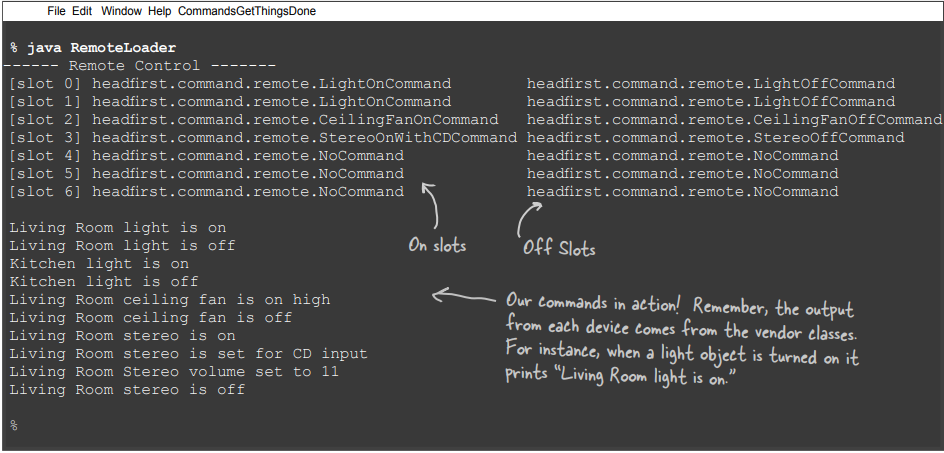

# Encapsulating Invocation

Bu bölümde, encapsulation'ı yepyeni bir seviyeye taşıyoruz: method çağrılarını encapsulate edeceğiz. Doğru, metot
çağrılarını encapsule ederek, hesaplama parçalarını kristalize edebiliriz, böylece hesaplamayı çağıran nesnenin işlerin
nasıl yapılacağı konusunda endişelenmesine gerek kalmaz, sadece kristalize metodumuzu kullanarak işi halleder. Ayrıca,
bu encapsule edilmiş method çağrılarıyla, bunları log kaydı için kaydetmek veya kodumuzda undo uygulamak için reuse gibi
bazı akıllıca şeyler de yapabiliriz.

--**MEKTUP**--

Selamlar! Yakın zamanda Weather-O-Rama CEO'su Johnny Hurricane'den yeni genişletilebilir Weather Station hakkında bir
demo ve brifing aldım. Söylemeliyim ki, yazılım mimarisinden o kadar etkilendim ki, sizden yeni Home Automation Remote
Control için API tasarlamanızı rica ediyorum. Hizmetleriniz karşılığında sizi Home Automation or Bust, Inc.
şirketinde hisse senedi opsiyonları ile cömertçe ödüllendirmekten mutluluk duyarız. İncelemeniz için çığır açan uzaktan
kumandamızın bir prototipini ekliyorum. Uzaktan kumanda yedi programlanabilir yuvaya (her biri farklı bir ev cihazına
atanabilir) ve her biri için ilgili açma/kapama düğmelerine sahiptir. Uzaktan kumandada ayrıca global bir undo
düğmesi de bulunuyor. Ayrıca CD-R üzerinde çeşitli satıcılar tarafından ışıklar, fanlar, jakuziler, ses ekipmanları ve
diğer benzer kontrol edilebilir cihazlar gibi ev otomasyon cihazlarını kontrol etmek için oluşturulmuş bir dizi Java
sınıfını da ekliyorum. Uzaktan kumandayı programlamak için bir API oluşturmanızı istiyoruz, böylece her yuva bir cihazı
veya cihaz grubunu kontrol etmek üzere atanabilir. Diskteki mevcut cihazları ve ayrıca satıcıların sağlayabileceği
gelecekteki cihazları kontrol edebilmemizin önemli olduğunu unutmayın. Weather-O-Rama meteoroloji istasyonunda
yaptığınız çalışmalar göz önüne alındığında, uzaktan kumandamızda harika bir iş çıkaracağınızı biliyoruz! Tasarımınızı
görmek için sabırsızlanıyoruz. Saygılarımla,

# Free hardware! Let’s check out the Remote Control... (Ücretsiz donanım! Uzaktan Kumandayı kontrol edelim...)


**Slots** : Programlamak için yedi slot var. Her slot'a farklı bir cihaz koyabilir ve button'ları kontrol edebiliriz.
Yedi slot'un da her biri için "on" ve "off" düğmeleri vardır.

**On - Off Butonu** : Bu düğmeler, slot'larda saklanan ev cihazlarını kontrol etmek için kullanılır...

**Undo** : İşte son basılan button'u geri alan global "undo" düğmesi.

# Taking a look at the vendor classes (Satıcı sınıflarına bir göz atalım)


CD-R üzerindeki Vendor sınıflarına göz atın. Bunlar size uzaktan kontrol etmemiz gereken nesnelerin interface'leri
hakkında bir fikir verecektir. Görünüşe göre burada bir dizi sınıfımız var ve bir dizi ortak interface bulmak için çok
fazla endüstri çabası yok. Sadece bu da değil, gelecekte bu sınıflardan daha fazlasını bekleyebiliriz gibi görünüyor.
Bir uzaktan kumanda API'si tasarlamak ilginç olacak. Şimdi tasarıma geçelim.

# Cubicle Conversation

Yapmamız gereken bir tasarım daha var. İlk gözlemim, açma ve kapama düğmeleri olan basit bir uzaktan kumandaya sahip
olduğumuz, ancak oldukça çeşitli bir dizi Vendor sınıfına sahip olduğumuzdur.

--**DIALOGS**--

Mary: Evet, on() ve off() methodları olan bir sürü sınıf göreceğimizi düşünmüştüm, ancak burada dim(), setTemperature(),
setVolume(), setDirection() gibi methodlarımız var.

Sue: Sadece bu da değil, gelecekte aynı derecede çeşitli methodlarla daha fazla Vendor sınıfı bekleyebiliriz gibi
görünüyor.

Mary: Bence bunu separation of concerns (ilgili sorunların ayrılması) olarak görmemiz önemli: uzaktan kumanda, düğmelere
basmayı ve istekte bulunmayı bilmeli, ancak ev otomasyonu veya jakuzinin nasıl açılacağı hakkında çok şey bilmemelidir.

Sue: Kulağa iyi bir tasarım gibi geliyor. Ancak uzaktan kumanda aptalsa ve sadece generic istekleri nasıl yapacağını
biliyorsa, uzaktan kumandayı, örneğin bir ışığı yakan veya garaj kapısını açan bir eylemi çağırabilecek şekilde nasıl
tasarlarız?

Mary: Emin değilim, ancak uzaktan kumandanın Vendor sınıflarının özelliklerini bilmesini istemiyoruz.

Sue: Bunun anlamı nedir?

Mary: Uzaktan kumandanın "if slot1 == Light, then light.on(), else if slot1 = Hottub then hottub.jetsOn()" gibi bir dizi
"if" ifadesinden oluşmasını istemiyoruz. Bunun kötü bir tasarım olduğunu biliyoruz.

Sue: Katılıyorum. Ne zaman yeni bir Vendor sınıfı çıksa, içeri girip kodu değiştirmemiz gerekecek, bu da potansiyel
olarak hatalar ve kendimiz için daha fazla iş yaratacak!

Joe : Merhaba, dinlememek mümkün değildi. 1. Bölümden beri Tasarım Desenleri üzerine çalışıyorum. "Command Pattern"
adında bir desen olduğunu düşünüyorum ve bu işe yarayabilir.

Mary: Biraz daha açarmısın?

Joe: Command Pattern, bir requester (eylemi talep eden) ile performs the action (eylemi gerçekleştiren nesneyi)
birbirinden ayırmanıza olanak tanır. Yani, burada talep eden uzaktan kumanda ve eylemi gerçekleştiren nesne de Vendor
sınıflarınızdan birinin bir instance'i olacaktır.

Sue: Bu nasıl mümkün olabilir? Onları nasıl ayırabiliriz? Sonuçta ben bir düğmeye bastığımda kumandanın ışığı yakması
gerekiyor.

Joe: Bunu tasarımınıza "command objects" ekleyerek yapabilirsiniz. Bir command object, belirli bir nesne (örneğin oturma
odası ışık nesnesi) üzerinde bir şey yapma (ışığı yakma gibi) isteğini encapsulate eder. Dolayısıyla, her düğme için bir
command object depolarsak, düğmeye basıldığında command object'inden bazı işler yapmasını isteriz. Uzaktan kumandanın
işin ne olduğuna dair bir fikri yoktur, sadece işi yaptırmak için doğru nesneyle nasıl konuşacağını bilen bir command
object'i vardır. Gördüğünüz gibi, uzaktan kumanda ışık nesnesinden ayrılmıştır!

Sue: Bu kesinlikle doğru yönde ilerliyor gibi görünüyor.

Mary: Yine de bu modeli anlamakta zorlanıyorum.

Joe: Nesnelerin birbirinden bu kadar ayrık olduğu düşünüldüğünde, modelin gerçekte nasıl çalıştığını hayal etmek biraz
zor.

Mary: Bakalım en azından doğru fikre sahip miyim: bu modeli kullanarak, bu command object'lerinin düğme slot'larına
yüklenebileceği bir API oluşturabilir ve böylece uzaktan kumanda kodunun çok basit kalmasını sağlayabiliriz. Ve command
object'leri, bir ev otomasyon görevinin nasıl yapılacağını, bunu yapması gereken nesne ile birlikte encapsulate eder.

Joe: Evet, sanırım öyle. Ayrıca bu modelin "undo" düğmesi konusunda da size yardımcı olabileceğini düşünüyorum, ancak o
kısmı henüz incelemedim.

Mary: Bu kulağa gerçekten cesaret verici geliyor, ancak sanırım modeli gerçekten "anlamak" için yapmam gereken biraz iş
var.

# Meanwhile, back at the Diner..., or, A brief introduction to the Command Pattern

Joe'nun da dediği gibi, sadece tanımını duyarak Command Pattern'i anlamak biraz zor.

Şimdi kısa bir yoldan lokantaya geri dönelim ve müşteriler, garson, siparişler ve short-order cook arasındaki
etkileşimleri inceleyelim. Bu etkileşimler sayesinde Command Pattern'de yer alan nesneleri anlayacak ve ayrıştırmanın
nasıl çalıştığına dair bir fikir edineceksiniz. Bundan sonra, uzaktan kumanda API'sini tamamlayacağız. Objectville
Lokantası'na giriş yapıyoruz...

Tamam, hepimiz lokantanın nasıl çalıştığını biliyoruz:


1 - Siz, Customer (Müşteri), Waitress'e (Garsona) Siparişinizi verirsiniz.

2 - Waitress siparişi alır, sipariş tezgahının üzerine koyar ve "Order Up!" der.

3 - The Short-Order Cook yemeğinizi siparişe göre hazırlar.

# Etkileşimi biraz daha ayrıntılı olarak inceleyelim...

### ve bu Lokantanın Objectville'de olduğunu göz önünde bulundurarak, ilgili nesne ve method çağrılarını da düşünelim!


### Start

Müşteri ne istediğini bilir ve bir sipariş oluşturur

```createOrder()``` Sipariş, bir sipariş fişi ve üzerinde yazılı olan müşterinin menü itemlarından oluşur

```takeOrder()``` Garson siparişi alır ve siparişe sıra geldiğinde orderUp() methodunu çağırarak siparişin
hazırlanmasına başlar.

``òrderUp()`` Sipariş, yemeği hazırlamak için gereken tüm talimatları içerir. Sipariş, makeBurger() gibi methodlar ile
Short-Order Cook'u yönlendirir.

The Short Order Cook siparişin talimatlarını takip eder ve yemeği hazırlar.

# The Objectville Diner roles and responsibilities (Objectville Diner rolleri ve sorumlulukları)

### Sipariş Fişi, bir yemek hazırlama talebini encapsulate eder


Sipariş Fişini bir nesne olarak düşünün, bir yemek hazırlama talebi olarak hareket eden bir nesne. Herhangi bir nesne
gibi, garsondan sipariş sayacına veya vardiyasını devralan bir sonraki garsona aktarılabilir. Yemeği hazırlamak için
gereken eylemleri encapsulate eden tek bir methoddan (orderUp()) oluşan bir interface'e sahiptir. Ayrıca yemeği
hazırlaması gereken nesneye (bizim durumumuzda Aşçı) bir referansı vardır. Garsonun siparişte ne olduğunu ve hatta
yemeği kimin hazırladığını bilmesi gerekmez; sadece sipariş penceresinden fişi geçirmesi ve "Order Up!" demesi
yeterlidir.

### Garsonun görevi Sipariş Fişlerini almak ve bunlar üzerinde orderUp() methodunu çağırmaktır

Garsonun işi kolaydır: müşteriden sipariş alır, sipariş tezgahına geri dönene kadar müşterilere yardım etmeye devam
eder, ardından yemeği hazırlatmak için orderUp() methodunu çağırır. Daha önce de tartıştığımız gibi, Objectville'de
Garson siparişte ne olduğu ya da kimin hazırlayacağı konusunda gerçekten endişelenmez; sadece sipariş fişlerinin işi
halletmek için çağırabileceği bir orderUp() methodu olduğunu bilir. Şimdi, gün boyunca Garsonun takeOrder() metodu
farklı müşterilerden gelen farklı sipariş fişleri ile parametrelenir, ancak bu onu etkilemez; tüm Sipariş fişlerinin
orderUp() methodunu desteklediğini bilir ve bir yemeğin hazırlanmasına ihtiyaç duyduğu her an orderUp() methodunu
çağırabilir.

### Short Order Cook yemek hazırlamak için gerekli bilgiye sahiptir

Short Order Cook, yemeklerin nasıl hazırlanacağını gerçekten bilen nesnedir. Garson orderUp() methodunu çağırdıktan
sonra Short Order Cook görevi devralır ve yemek oluşturmak için gereken tüm methodları implement eder. Garson ve
Aşçı'nın tamamen birbirinden ayrıldığına dikkat edin: Garson, yemeğin ayrıntılarını kapsayan Sipariş Fişleri'ne
sahiptir; sadece her siparişin hazırlanması için bir method çağırır. Aynı şekilde, Aşçı da talimatlarını Sipariş
Fişinden alır; asla Garsonla doğrudan iletişim kurması gerekmez.

/////////////////////////////////////////////////////////////////////////////////////////////////

Diner'ı, istekte bulunan bir nesneyi bu istekleri alan ve yürüten nesnelerden ayırmamızı sağlayan bir OO tasarım modeli
olarak düşünün. Örneğin, uzaktan kumanda API'mizde, bir düğmeye bastığımızda çağrılan kodu, bu istekleri yerine getiren
Vendor'a özgü sınıfların nesnelerinden ayırmamız gerekir. Uzaktan kumandanın her bir slot'unda Lokanta'nın sipariş fişi
nesnesi gibi bir nesne olsaydı ne olurdu? O zaman, bir düğmeye basıldığında, bu nesne üzerinde "orderUp()" methodunun
eşdeğerini çağırabilir ve uzaktan kumanda bu şeylerin nasıl gerçekleştiğinin ayrıntılarını veya hangi nesnelerin bunları
gerçekleştirdiğini bilmeden ışıkların yanmasını sağlayabilirdik. Şimdi, biraz vites değiştirelim ve tüm bu Lokanta
konuşmasını Command Pattern'e eşleyelim...

# From the Diner to the Command Pattern (Lokantadan Command Pattern'e)

Tamam, Objectville Lokantasında yeterince zaman geçirdik, tüm kişilikleri ve sorumluluklarını oldukça iyi biliyoruz.
Şimdi Lokanta şemasını Command Pattern yansıtacak şekilde yeniden düzenleyeceğiz. Tüm oyuncuların aynı olduğunu
göreceksiniz; sadece isimler değişti.


### Start

**Client** : Client command object oluşturmaktan sorumludur. Command object, bir Receiver üzerindeki bir dizi
action'dan oluşur. Action'lar ve Receiver'lar, command object'de birbirine bound olur. Client bir Invoker nesnesi
üzerinde setCommand() methodunu çağırır ve command object'i aktarır, bu nesne ihtiyaç duyulana kadar burada saklanır.

**Command** : Command object, Action'ları encapsulate eden ve Receiver üzerindeki Action'ları çağırmak için çağrılabilen
execute() adında bir method sağlar.

**Invoker** : Gelecekte bir noktada Invoker command object'inin execute() methodunu çağırır

**Receiver** : Bu da Action'ların Receiver üzerinde çağrılmasıyla sonuçlanır.

### Loading the Invoker

1 - Client, command object'i create eder

2 - Client, command object'i invoker'da saklamak için bir setCommand() yapar.

3 - Daha sonra... client invoker'dan command'i çalıştırmasını ister.

Not: Bölümün ilerleyen kısımlarında göreceğiniz gibi, command invoker'a yüklendikten sonra kullanılıp atılabilir veya
kalıp birçok kez kullanılabilir.



* Waitress -> Invoker

* Short Order Cook -> Receiver

* orderUp() -> Execute

* Order -> Command

* Customer -> Client

* takeOrder() -> setCommand()



# Our first command object

İlk Command Object'ini oluşturmamızın zamanı gelmedi mi? Hadi devam edelim ve uzaktan kumanda için biraz kod yazalım.
Uzaktan kumanda API'sini nasıl tasarlayacağımızı henüz bulamamış olsak da, aşağıdan yukarıya doğru birkaç şey inşa etmek
bize yardımcı olabilir...

### Command Interface'inin implement edilmesi

Her şeyden önce: tüm Command Object'ler tek bir methoddan oluşan aynı interface'i implemente ederler. Diner'da bu
methoda orderUp() adını verdik; ancak, genellikle sadece execute() adını kullanırız. İşte Command Interface:

```
public interface Command {
    /* Çok basit. Tek ihtiyacımız olan execute() adında bir method */
    void execute();
}
```

### Bir ışığı açmak için Command Implement Etmek

Şimdi, bir ışığı açmak için bir command implement etmek istediğinizi varsayalım. Vendor sınıfları kümemize bakacak
olursak, Light sınıfının iki methodu vardır: on() ve off(). İşte bunu bir command olarak nasıl implement edebileceğiniz:



```
/* Bu bir command, bu yüzden Command interface'ini implement etmemiz gerekir */
public class LightOnCommand implements Command {

    Light light;

    /* Constructor, bu command'ın kontrol edeceği belirli ışığı (örneğin oturma odası ışığı) alır ve bunu 
    light instance variable'ında saklar. execute çağrıldığında, bu, isteğin Receiver'i olacak Light nesnesidir */
    public LightOnCommand(Light light) {
        this.light = light;
    }

    /* execute methodu, kontrol ettiğimiz Light olan Receiver nesne üzerindeki on() methodunu çağırır */
    @Override
    public void execute() {
        light.on();
    }
}
```

Artık bir LightOnCommand sınıfınız olduğuna göre, onu kullanıp kullanamayacağımızı görelim...

# Using the command object (Command nesnesini kullanma)

Tamam, işleri basitleştirelim: diyelim ki sadece bir düğmesi ve kontrol edilecek bir cihazı tutmak için ilgili slot'u
olan bir uzaktan kumandamız var:

```
public class SimpleRemoteControl {

    /* Bir cihazı kontrol edecek olan Command'imizi tutmak için bir slot'umuz var */
    Command slot;
    
    /* Slot tarafından kontrol edilecek command'i ayarlamak için bir setter methodumuz var. Bu kodun client'i,
    uzaktan kumanda düğmesinin behavior'unu değiştirmek istiyorsa bu methodu birden fazla kez çağırabilir.*/
    public void setCommand(Command command){
        this.slot = command;
    }

    /* Bu method düğmeye basıldığında çağrılır. Tek yaptığımız, slot'a bağlı geçerli command'i almak ve execute() 
    methodunu çağırmaktır */
    public void buttonPressed(){
        this.slot.execute();
    }
}
```

# Creating a simple test to use the Remote Control (Uzaktan Kumandayı kullanmak için basit bir test oluşturma)

İşte SimpleRemoteControl'u test etmek için biraz kod. Bir göz atalım ve parçaların Command Pattern diyagramıyla nasıl
eşleştiğini gösterelim:

```
/* Bu, Command Pattern dilindeki Client'imizdir */
public class RemoteControlTest {
    public static void main(String[] args) {

        /* SimpleRemoteControl bizim Invoker'ımızdır; ona istekte bulunmak için kullanılabilecek bir command object 
        aktarılacaktır */
        SimpleRemoteControl remoteControl = new SimpleRemoteControl();

        /* Şimdi bir Light nesnesi oluşturuyoruz, bu isteğin Receiver'i olacak */
        Light light = new Light();

        /* Burada bir command oluşturuyoruz ve Receiver'i bu command'e aktarıyoruz */
        LightOnCommand lightOn = new LightOnCommand(light);

        /* Burada, Command'i Invoker'a iletin */
        remoteControl.setCommand(lightOn);

        /* Ve sonra düğmeye basılmasını simüle ediyoruz */
        remoteControl.buttonPressed();
    }
}
```



# GarageDoorOpen Command

```
public class GarageDoorOpenCommand implements Command {
    GarageDoor door;

    public GarageDoorOpenCommand(GarageDoor door) {
        this.door = door;
    }

    @Override
    public void execute() {
        door.open();
    }
}
```

Kullanımı;

```
public class RemoteControlTest {
    public static void main(String[] args) {
        SimpleRemoteControl remoteControl = new SimpleRemoteControl();
        Light light = new Light();
        GarageDoor garageDoor = new GarageDoor();

        LightOnCommand lightOn = new LightOnCommand(light);
        GarageDoorOpenCommand garageDoorOpenCommand = new GarageDoorOpenCommand(garageDoor);

        remoteControl.setCommand(lightOn);
        remoteControl.buttonPressed();
        remoteControl.setCommand(garageDoorOpenCommand);
        remoteControl.buttonPressed();
    }
}
```

# The Command Pattern defined

Objectville Diner'da zaman geçirdiniz, uzaktan kumanda API'sini kısmen implement ettiniz ve bu süreçte Command Pattern'
de
sınıfların ve nesnelerin nasıl etkileşime girdiğine dair oldukça iyi bir resim elde ettiniz. Şimdi Command Pattern'i
tanımlayacağız ve tüm ayrıntıları belirleyeceğiz. Resmi tanımı ile başlayalım:



Command Pattern bir isteği bir nesne olarak encapsulate eder, böylece diğer nesneleri farklı isteklerle
parametrelendirmenize, istekleri sıraya koymanıza veya günlüğe kaydetmenize ve undoable (geri alınabilir) işlemleri
desteklemenize olanak tanır.


Bunun üzerinden geçelim. Bir command object'in, belirli bir Receiver üzerinde bir dizi Action'ı birbirine bind ederek
bir isteği encapsulate ettiğini biliyoruz. Bunu başarmak için, Action'ları ve Receiver'i tek bir method olan execute()'u
açığa çıkaran bir nesne içinde paketler. Çağrıldığında execute(), Action'ların Receiver üzerinde çağrılmasına neden
olur. Dışarıdan bakıldığında, başka hiçbir nesne hangi Receiver üzerinde hangi Action'ların gerçekleştirileceğini
bilmez; sadece execute() methodunu çağırdıklarında isteklerinin yerine getirileceğini bilirler.

Ayrıca, bir nesneyi bir command ile parametrelendirmenin birkaç örneğini de gördük. Lokantaya geri döndüğümüzde, Garson
Kız gün boyunca birden fazla siparişle parametrelendirildi. Basit uzaktan kumandada, düğme slot'una önce bir "ışık açık"
command'i yükledik ve daha sonra bunu bir "garaj kapısı açık" command'i ile değiştirdik. Garson gibi, uzaktan kumanda
slot'unuz da Command interface'ini implement ettiği sürece hangi command nesnesine sahip olduğunu önemsemiyordu.

Henüz karşılaşmadığımız şey, queues (kuyrukları) ve logs (günlükleri) implement etmek ve undo (geri alma) işlemlerini
desteklemek için command'leri kullanmaktır. Merak etmeyin, bunlar temel Command Pattern'nin oldukça basit uzantılarıdır
ve yakında bunlara da değineceğiz. Temel bilgileri edindikten sonra Meta Command Pattern olarak bilinen şeyi de kolayca
destekleyebiliriz. Meta Command Pattern, aynı anda birden fazla command'i çalıştırabilmeniz için command macro'ları
oluşturmanıza olanak tanır.


Bir Invoker - örneğin uzaktan kumandanın bir slot'u - farklı isteklerle parametrelendirilebilir.

# The Command Pattern defined: the class diagram (Command Pattern'i açıklaması ve class diagram'ı)


**Client** : bir ConcreteCommand oluşturmaktan ve Receiver'ini ayarlamaktan sorumludur.

**Invoker** : bir command'i tutar ve bir noktada execute() methodunu çağırarak command'den bir isteği yerine getirmesini
ister.

**Command** : tüm command'ler için bir interface bildirir. Bildiğiniz gibi, bir command, Receiver'dan bir Action
gerçekleştirmesini isteyen execute() methodu aracılığıyla çağrılır. Ayrıca bu interface'in, bölümün ilerleyen
kısımlarında ele alacağımız bir undo() methoduna sahip olduğunu da fark edeceksiniz.

**ConcreteCommand içerisinde ki execute methodu** : execute methodu, isteği yerine getirmek için Receiver üzerinde
gereken Action(lar)ı çağırır

**Receiver** : isteği yerine getirmek için gereken işi nasıl yapacağını bilir. Herhangi bir sınıf Receiver olarak
hareket edebilir.

**ConcreteCommand** : bir Action ile bir Receiver arasında bir binding tanımlar. Invoker execute() methodunu çağırarak
bir istekte bulunur ve ConcreteCommand, Receiver üzerinde bir veya daha fazla Action çağırarak bunu gerçekleştirir.

--**DIALOGS**--

Sue: SimpleRemote'ta yaptığımız gibi, command'leri slotlara atamak için bir yol sağlamamız gerekiyor. Bizim durumumuzda,
her biri bir "on" ve "off" düğmesine sahip yedi slotumuz var. Böylece uzaktan kumandaya aşağıdaki gibi command'ler
atayabiliriz:

```
onCommands[0] = onCommand;
offCommands[0] = offCommand;
```

Mary: Light nesneleri dışında bu mantıklı. Kumanda oturma odasını mutfak ışığından nasıl ayırt edebilir?

Sue : Ah, işte bu, öyle değil! Uzaktan kumanda, bir düğmeye basıldığında ilgili command nesnesinde execute() methodunun
nasıl çağrılacağından başka bir şey bilmiyor.

Mary: Evet, bunu anladım ama uygulamada doğru nesnelerin doğru cihazları açıp kapattığından nasıl emin olacağız?

Sue: Uzaktan kumandaya yüklenecek commandları oluşturduğumuzda, oturma odası ışık nesnesine bağlı bir LightCommand ve
mutfak ışık nesnesine bağlı başka bir LightCommand oluştururuz. Unutmayın, talebin receiver'i, encapsulate edildiği
command'e bağlanır. Böylece, düğmeye basıldığında, hangi ışığın hangi ışık olduğu kimsenin umurunda olmaz, execute()
methodu çağrıldığında doğru şey gerçekleşir.

# Assigning Commands to slots

Yani bir planımız var: Her bir slot'u uzaktan kumandadaki bir command'e atayacağız. Bu, uzaktan kumandayı bizim
Invoker'imiz yapar. Bir düğmeye basıldığında execute() methodu ilgili command'de çağrılacak ve bu da Receiver'da
Action'ların çağrılmasıyla sonuçlanacak (ışıklar, tavan vantilatörleri, müzik setleri gibi).


1 - Her slot bir command alır

2 - Düğmeye basıldığında, ilgili command üzerinde execute() methodu çağrılır.

3 - execute() methodun da Action'lar Receiver üzerinde çağrılır.

Boş slotları daha sonra düşüneceğiz

# Implementing the Remote Control (Uzaktan Kumandanın Implementasyonu)

```
public class RemoteControl {

    /* Bu sefer uzaktan kumanda, ilgili array'ler de tutacağımız yedi "On" ve "Off" command'ini işleyecek */
    Command[] onCommands;
    Command[] offCommands;

    /* Yapılması gereken tek şey, constructor'da On ve Off array'lerini oluşturmak ve başlatmak */
    public RemoteControl() {
        
        onCommands = new Command[7];
        offCommands = new Command[7];

        /* Tüm command'ler NoCommand() olarak işaretleniyor */
        Command noCommand = new NoCommand();

        for (int i = 0; i < 7; i++) {
            onCommands[i] = noCommand;
            offCommands[i] = noCommand;
        }
    }

    /* setCommand() methodu bir slot konumu ve o slot'da saklanacak bir "On" ve "Off" command'i alır. Bu command'leri 
    daha sonra kullanmak üzere "On" ve "Off" array'lerine yerleştirir */
    public void setCommand(int slot, Command onCommand, Command offCommand){
        this.onCommands[slot] = onCommand;
        this.offCommands[slot] = offCommand;
    }
    
    /* Bir On veya Off düğmesine basıldığında, donanım ilgili onButtonWasPushed() veya offButtonWasPushed() 
    methodlarını çağırmakla ilgilenir */
    public void onButtonWasPushed(int slot){
        this.onCommands[slot].execute();
    }

    public void offButtonWasPushed(int slot){
        this.offCommands[slot].execute();
    }

    /* Her slot'u ve ilgili command'i yazdırmak için toString() methodunu override ettik. Uzaktan kumandayı test 
    ederken bunu kullandığımızı göreceksiniz */
    public String toString() {
        StringBuilder stringBuilder = new StringBuilder();
        stringBuilder.append("\n------ Remote Control -------\n");
        for (int i = 0; i < this.onCommands.length; i++) {
            stringBuilder.append("[slot ")
                    .append(i)
                    .append("] ")
                    .append(onCommands[i].getClass().getName())
                    .append(" ")
                    .append(offCommands[i].getClass().getName())
                    .append("\n");
        }
        return stringBuilder.toString();
    }
}
```

Burada kullanılan NoCommand sınıfı ile ilgili ileri de açıklama ekleyeceğiz;

```
public class NoCommand implements Command {
    @Override
    public void execute() {
    }
}
```

# Implementing the Commands

SimpleRemoteControl için LightOnCommand'ı implement ederek zaten ayaklarımızı ıslattık. Aynı kodu buraya da
ekleyebiliriz ve her şey çok güzel çalışır. "Off" command'ları da farklı değildir; aslında LightOffCommand şöyle
görünür:

LightOffCommand;

```
public class LightOffCommand implements Command {
    Light light;

    public LightOffCommand(Light light) {
        this.light = light;
    }

    /* LightOffCommand, Receiver'i farklı bir Action'a bağlamamız dışında LightOnCommand ile tamamen aynı şekilde 
    çalışır: off() methodu */
    @Override
    public void execute() {
        light.off();
    }
}
```

Biraz daha zorlayıcı bir şey deneyelim; Stereo için "On" ve "Off" command'leri yazmaya ne dersiniz? Tamam, "Off" kolay,
Stereo'yu StereoOffCommand içindeki off() metoduna bağlıyoruz. "On" biraz daha karmaşık; diyelim ki bir
StereoOnWithCDCommand yazmak istiyoruz...

```
public class StereoOnWithCDCommand implements Command {

    Stereo stereo;

    public StereoOnWithCDCommand(Stereo stereo) {
        /* Tıpkı LightOnCommand'da olduğu gibi, kontrol edeceğimiz stereo'nun instance'ini alırız ve bunu local bir 
        instance variable'da saklarız */
        this.stereo = stereo;
    }
    
    @Override
    public void execute() {
        /* Bu isteği yerine getirmek için müzik setinde üç method çağırmamız gerekiyor: önce müzik setini açmak, 
        ardından CD'yi çalacak şekilde ayarlamak ve son olarak da ses seviyesini 11'e ayarlamak */
        stereo.on();
        stereo.setCD();
        stereo.setVolume(11);
    }
}
```

# Putting the Remote Control through its paces

Uzaktan kumanda ile işimiz hemen hemen bitti; tek yapmamız gereken bazı testler yapmak ve API'yi tanımlamak için bazı
belgeleri bir araya getirmek. Home Automation or Bust, Inc. kesinlikle etkilenecek, sizce de öyle değil mi? Bakımı kolay
bir uzaktan kumanda üretmelerini sağlayacak bir tasarım bulmayı başardık ve yazılması bu kadar kolay olduğu için
gelecekte satıcıları bazı basit command sınıfları yazmaya ikna etmekte zorlanmayacaklar. Hadi bu kodu test etmeye
başlayalım!

```
public class RemoteControlTest {
    public static void main(String[] args) {
        RemoteControl remoteControl = new RemoteControl();

        /* Tüm cihazları uygun konumlarına yerleştirin. */
        Light livingRoomLight = new Light("Living room");
        Light kitchenLight = new Light("Kitchen");
        CeilingFan ceilingFan = new CeilingFan("Living room");
        GarageDoor garageDoor = new GarageDoor("");
        Stereo stereo = new Stereo("Living room");

        /* Tüm Light Command nesnelerini oluşturun */
        LightOnCommand livingRoomLightOn = new LightOnCommand(livingRoomLight);
        LightOffCommand livingRoomLightOff = new LightOffCommand(livingRoomLight);
        LightOnCommand kitchenLightRoomOn = new LightOnCommand(kitchenLight);
        LightOffCommand kitchenLightRoomOff = new LightOffCommand(kitchenLight);


        /* Tavan vantilatörü için On ve Off Command'leri oluşturun.*/
        CeilingFanOnCommand ceilingFanOn = new CeilingFanOnCommand(ceilingFan);
        CeilingFanOffCommand ceilingFanOff = new CeilingFanOffCommand(ceilingFan);

        /* Garaj kapısı için Open ve Close Command'leri oluşturun.*/
        GarageDoorOpenCommand garageDoorOpen = new GarageDoorOpenCommand(garageDoor);
        GarageDoorCloseCommand garageDoorClose = new GarageDoorCloseCommand(garageDoor);

        /* Stereo için On ve Off Command'leri oluşturun.*/
        StereoOnWithCDCommand stereoOnWithCD = new StereoOnWithCDCommand(stereo);
        StereoOffCommand stereoOff = new StereoOffCommand(stereo);

        /* Artık tüm command'larımızı aldığımıza göre, bunları remote slot'lara yükleyebiliriz */
        remoteControl.setCommand(0,livingRoomLightOn,livingRoomLightOff);
        remoteControl.setCommand(1,kitchenLightRoomOn,kitchenLightRoomOff);
        remoteControl.setCommand(2,ceilingFanOn,ceilingFanOff);
        remoteControl.setCommand(3,garageDoorOpen,garageDoorClose);
        remoteControl.setCommand(4,stereoOnWithCD,stereoOff);
        
        /* Burada toString() metodumuzu kullanarak her bir remote slot'u ve atandığı command'i yazdırıyoruz */
        System.out.println(remoteControl);

        /* Pekâlâ, çalışmaya hazırız! Şimdi, her bir slot'a girip On ve Off düğmesine basıyoruz */
        remoteControl.onButtonWasPushed(0);
        remoteControl.offButtonWasPushed(0);
        remoteControl.onButtonWasPushed(1);
        remoteControl.offButtonWasPushed(1);
        remoteControl.onButtonWasPushed(2);
        remoteControl.offButtonWasPushed(2);
        remoteControl.onButtonWasPushed(3);
        remoteControl.offButtonWasPushed(3);
        remoteControl.onButtonWasPushed(4);
        remoteControl.offButtonWasPushed(4);
    }
}
```



'NoCommand' neyin nesi? İyi yakaladın. Orada küçük bir şey gizledik. Uzaktan kumandada, bir slot'a her başvurduğumuzda
bir command'in yüklenip yüklenmediğini kontrol etmek istemedik. Örneğin, onButtonWasPushed() methodunda bunun gibi bir
koda ihtiyacımız olacaktı:

```
public void onButtonWasPushed(int slot) {
    if (onCommands[slot] != null) {
        this.onCommands[slot].execute();
    }
}
```

Peki, bunu nasıl aşacağız? Hiçbir şey yapmayan bir command implement ederek

```
public class NoCommand implements Command {
    @Override
    public void execute() {
    }
}
```

Ardından, RemoteControl constructor'ımız da, her slota varsayılan olarak bir NoCommand nesnesi atarız ve her slot'da her
zaman çağıracak bir command'imiz olacağını biliriz.

```
Command noCommand = new NoCommand();
    for (int i = 0; i < 7; i++) {
        onCommands[i] = noCommand;
        offCommands[i] = noCommand;
    }
```

Dolayısıyla, test çıktısında, RemoteControl'ü oluştururken atadığımız varsayılan NoCommand nesnesi dışında bir command'e
atanmamış slot'lar görüyorsunuz.

NoCommand nesnesi null nesnesine bir örnektir. Bir null nesnesi, döndürmek için anlamlı bir nesneniz olmadığında ve yine
de null'u işleme sorumluluğunu client'dan kaldırmak istediğinizde kullanışlıdır. Örneğin, uzaktan kumandamızda kutudan
çıkan her bir slot'a atayabileceğimiz anlamlı bir nesnemiz yoktu, bu nedenle bir vekil olarak hareket eden ve execute
methodu çağrıldığında hiçbir şey yapmayan bir NoCommand nesnesi sağladık. Null Objects'in birçok Tasarım Modeli ile
birlikte kullanıldığını göreceksiniz ve hatta bazen Null Object'in bir Tasarım Modeli olarak listelendiğini
göreceksiniz.

# Time to write that documentation... (Belgeleri yazma zamanı...)

### Remote Control API Design for Home Automation

Ev Otomasyonu Uzaktan Kumandanız için aşağıdaki tasarımı ve uygulama programlama interface'ini size sunmaktan mutluluk
duyuyoruz. Öncelikli tasarım hedefimiz, yeni Vendor sınıfları üretildikçe değişiklik gerektirmemesi için uzaktan kumanda
kodunu mümkün olduğunca basit tutmaktı. Bu amaçla RemoteControl sınıfını Vendor Sınıflarından mantıksal olarak ayırmak
için Command Kalıbını kullandık. Bunun uzaktan kumandayı üretme maliyetini düşüreceğine ve devam eden bakım
maliyetlerinizi büyük ölçüde azaltacağına inanıyoruz. Aşağıdaki sınıf diyagramı tasarımımıza genel bir bakış
sunmaktadır:


**RemoteLoader** : Uzaktan Kumandanın slotlarına yüklenen bir dizi Command Nesnesi oluşturur. Her Command nesnesi bir ev
otomasyon cihazının talebini encapsulate eder

**RemoteControl** : her düğme için bir tane olmak üzere bir dizi Command nesnesini yönetir. Bir düğmeye basıldığında,
ilgili ButtonWasPushed() methodu çağrılır ve bu da command üzerinde execute() methodunu çağırır. Command nesnesi uzaktan
kumandayı asıl ev otomasyonu işini yapan sınıflardan ayırdığı için uzaktan kumandanın çağırdığı sınıflar hakkındaki
bilgisi bu kadardır.

**Command** : Tüm RemoteControl command'leri, tek bir methoddan oluşan Command interface'ini implement eder: execute()
Command'ler,belirli bir Vendor sınıfı üzerinde bir dizi Action'ı encapsulate eder. RemoteControl execute() methodunu
çağırarak bu Action'ları çağırır.

**Light** : Vendor Sınıfları, cihazları kontrol etmek gibi gerçek ev otomasyonu işlerini gerçekleştirmek için
kullanılır. Burada örnek olarak Light sınıfını kullanıyoruz.

**Light** Vendor Sınıfları, cihazları kontrol etmek için gerçek ev otomasyon işini gerçekleştirmek için kullanılır.
Burada, bir örnek olarak Light sınıfını kullanıyoruz

**LightOnCommand - LightOffCommand** : Command Interface'i kullanılarak, uzaktan kumanda üzerindeki bir düğmeye
basılarak çağrılabilecek her Action basit bir Command nesnesiyle implement edilir. Command nesnesi, bir Vendor Sınıfının
instance'i olan bir nesneye referans tutar ve bu nesne üzerinde bir veya daha fazla methodu çağıran bir execute
methodunu implement eder. Burada, sırasıyla bir ışığı açan ve kapatan bu tür iki sınıfı gösteriyoruz

Neredeyse unutuyorduk... Neyse ki, temel Command sınıflarımıza sahip olduğumuzda, undo'yu eklemek kolaydır. Şimdi
command'lerimize ve uzaktan kumandaya undo özelliğini ekleyelim

# What are we doing? (Ne yapıyoruz biz?)

Tamam, uzaktan kumandadaki undo düğmesini desteklemek için işlevsellik eklememiz gerekiyor. Şöyle çalışır: Diyelim
ki Oturma Odası Işığı "Off" ve uzaktan kumandadaki "On" düğmesine basıyorsunuz. Açıkçası ışık yanar. Şimdi undo
düğmesine basarsanız, son Action tersine çevrilecektir - bu durumda ışık kapanacaktır. Daha karmaşık örneklere geçmeden
önce, ışığı undo düğmesiyle çalıştıralım:

1 - Command'ler undo'yu desteklediğinde, execute() methodunu yansıtan bir undo() methoduna sahip olurlar. execute() en
son ne yaptıysa, undo() onu tersine çevirir. Dolayısıyla, command'lerimize undo özelliğini eklemeden önce Command
interface'ine bir undo() methodu eklememiz gerekir:

```
public interface Command {
    void execute();
    void undo();
}
```

Bu yeterince basitti. Şimdi Light command'inin içine dalalım ve undo() methodunu implement edelim

2 - LightOnCommand ile başlayalım: LightOnCommand'ın execute() methodu çağrıldıysa, en son on() methodu çağrılmıştır.
undo() methodunun off() methodunu çağırarak bunun tam tersini yapması gerektiğini biliyoruz.

```
public class LightOnCommand implements Command {

    Light light;

    public LightOnCommand(Light light) {
        this.light = light;
    }

    @Override
    public void execute() {
        light.on();
    }

    /* execute() ışığı yakar, bu nedenle undo() sadece ışığı geri kapatır */
    @Override
    public void undo() {
        light.off();
    }
}
```

Çocuk oyuncağı! Şimdi LightOffCommand için. Burada undo() methodu sadece Light'ın on() metodunu çağırmalıdır.

```
public class LightOffCommand implements Command {
    Light light;

    public LightOffCommand(Light light) {
        this.light = light;
    }

    @Override
    public void execute() {
        light.off();
    }

    @Override
    public void undo() {
        light.on();
    }
}
```

Bu daha kolay olabilir miydi? Tamam, henüz işimiz bitmedi; son basılan düğmeyi ve undo düğmesine basmayı takip
etmek için Uzaktan Kumandaya biraz destek vermemiz gerekiyor.

3 - Undo düğmesine destek eklemek için Uzaktan Kumanda sınıfında sadece birkaç küçük değişiklik yapmamız gerekiyor.
Bunu şu şekilde yapacağız: çağrılan son command'i izlemek için yeni bir instance variable ekleyeceğiz; daha sonra, undo
düğmesine her basıldığında, bu command'i alacağız ve undo() methodunu çağıracağız.

```
public class RemoteControlUndo {
    Command[] onCommands;
    Command[] offCommands;

    /* Burası undo düğmesi için çalıştırılan son command'i saklayacağımız yerdir */
    Command undoCommand;

    public RemoteControlUndo() {
        onCommands = new Command[7];
        offCommands = new Command[7];

        Command noCommand = new NoCommand();
        for (int i = 0; i < 7; i++) {
            this.onCommands[i] = noCommand;
            this.offCommands[i] = noCommand;
        }

        /* Tıpkı diğer slotlar'da olduğu gibi, undo da NoCommand ile başlar, bu nedenle başka herhangi bir düğmeden 
        önce undo'ya basmak hiçbir şey yapmaz */
        this.undoCommand = noCommand;
    }

    public void setCommand(int slot, Command onCommand, Command offCommand){
        this.onCommands[slot] = onCommand;
        this.offCommands[slot] = offCommand;
    }

    public void onBottonWasPushed(int slot){
        this.onCommands[slot].execute();

        /* Bir düğmeye basıldığında, command'i alır ve önce çalıştırırız; ardından undoCommand instance variable'a bir 
        referans kaydederiz. Bunu hem "on" command'leri hem de "off" command'leri için yaparız */
        this.undoCommand = this.onCommands[slot];
    }

    public void offButtonWasPushed(int slot){
        this.offCommands[slot].execute();

        /* Bir düğmeye basıldığında, command'i alır ve önce çalıştırırız; ardından undoCommand instance variable'a bir 
        referans kaydederiz. Bunu hem "on" command'leri hem de "off" command'leri için yaparız */
        this.undoCommand = this.offCommands[slot];
    }

    public void undoButtonWasPushed(){
        
        /* Undo düğmesine basıldığında, undoCommand içinde saklanan command'in undo() methodunu çağırırız. Bu, en son
        çalıştırılan command'in işlemini geri çevirir.*/
        
        /* Undo düğmesine düğmesine basıldığında, undoCommand içinde saklanan command'in undo() methodunu çağırırız. 
        Bu, son çalıştırılan command'in işlemini tersine çevirir */
        this.undoCommand.undo();
    }

    public String toString() {
        StringBuilder stringBuilder = new StringBuilder();
        stringBuilder.append("\n------ Remote Control -------\n");
        for (int i = 0; i < this.onCommands.length; i++) {
            stringBuilder.append("[slot ")
                    .append(i)
                    .append("] ")
                    .append(onCommands[i].getClass().getName())
                    .append(" ")
                    .append(offCommands[i].getClass().getName())
                    .append("\n");
        }
        return stringBuilder.toString();
    }
}
```

# Time to QA that Undo button! (Undo düğmesini test etme zamanı!)

```
public class RemoteLoader {
    public static void main(String[] args) {
        RemoteControlWithUndo remoteControl = new RemoteControlWithUndo();

        /* Bir Light ve yeni undo() özellikli LightOnCommand ve LightOffCommand Command'lerinizi oluşturun */
        Light livingRoomLight = new Light("Living room");

        LightOnCommand livingRoomLightOn = new LightOnCommand(livingRoomLight);
        LightOffCommand livingRoomLightOff = new LightOffCommand(livingRoomLight);

        /* Light Command'lerini slot 0'daki uzaktan kumandaya ekleyin */
        remoteControl.setCommand(0,livingRoomLightOn,livingRoomLightOff);
        
        /* Işığı açın, sonra kapatın ve sonra undo yapın */
        remoteControl.onBottonWasPushed(0);
        remoteControl.offButtonWasPushed(0);
        System.out.println(remoteControl);
        remoteControl.undoButtonWasPushed();
        System.out.println(remoteControl);
    }
}
```


# Using state to implement Undo (Undo'yu implement etmek için state kullanma)

Tamam, Light üzerinde undo implement etmek öğreticiydi ama biraz fazla kolaydı. Tipik olarak, undo'yu implement etmek
için biraz state yönetmemiz gerekir. Vendor sınıflarından Ceiling Fan gibi biraz daha ilginç bir şey deneyelim.
Ceiling Fan, bir "Off" methodu ile birlikte bir dizi hızın set edilmesine izin verir. İşte CeilingFan için kaynak
kodu:

```
public class CeilingFan {
    private static final int HIGH = 3;
    private static final int MEDIUM = 2;
    private static final int LOW = 1;
    private static final int OFF = 0;
    private final String name;
    
    /* CeilingFan sınıfının tavan vantilatörünün speed'ini temsil eden local state'i tuttuğuna dikkat edin */
    private int speed;

    public CeilingFan(String name) {
        this.name = name;
        this.speed = OFF;
    }

    /* Bu methodlar CeilingFan'ın hızını ayarlar */
    public void high(){
        this.speed = HIGH;
    }

    public void medium(){
        this.speed = MEDIUM;
    }

    public void low(){
        this.speed = LOW;
    }

    public void off(){
        this.speed = OFF;
    }

    /* CeilingFan'ın mevcut hızını getSpeed() kullanarak alabiliriz.*/
    public int getSpeed() {
        return speed;
    }
}
```

# Adding Undo to the ceiling fan commands (Tavan vantilatörü Command'lerine Undo ekleme)

Şimdi çeşitli CeilingFan command'lerine undo ekleme konusunu ele alalım. Bunu yapmak için, fanın son hız ayarını
izlememiz ve undo() methodu çağrılırsa, fanı önceki ayarına geri döndürmemiz gerekir. İşte CeilingFanHighCommand için
kod:

```
public class CeilingFanHighCommand implements Command {
    CeilingFan ceilingFan;
    
    /* Fanın önceki hızını takip etmek için local state ekledik */
    int prevSpeed;

    public CeilingFanHighCommand(CeilingFan ceilingFan) {
        this.ceilingFan = ceilingFan;
    }

    @Override
    public void execute() {
        /* Yürütmede, fanın hızını değiştirmeden önce, Action'larınızı undo yapılması gerekmesi ihtimaline karşı önceki 
        state'i kaydetmemiz gerekir */
        this.prevSpeed = ceilingFan.getSpeed();
        this.ceilingFan.high();
    }

    @Override
    public void undo() {
        /* Undo için, fanın hızını önceki hızına geri ayarlıyoruz.
        if (this.prevSpeed == CeilingFan.HIGH) {
            ceilingFan.high();
        } else if (this.prevSpeed == CeilingFan.MEDIUM) {
            ceilingFan.medium();
        } else if (prevSpeed == CeilingFan.LOW) {
            ceilingFan.low();
        } else if (prevSpeed == CeilingFan.OFF) {
            ceilingFan.off();
        }
    }
}
```

High olan command'in bir de medium olanını yazalım;

```
public class CeilingFanMediumCommand implements Command {
    CeilingFan ceilingFan;
    int prevSpeed;

    public CeilingFanMediumCommand(CeilingFan ceilingFan) {
        this.ceilingFan = ceilingFan;
    }

    @Override
    public void execute() {
    
        /* Çalıştırmadan önce, vantilatörün hızını değiştirmeden önce, eylemlerimizi undo yapmak zorunda kalırsak
        previous speed state'ini kaydetmemiz gerekiyor*/
        
        this.prevSpeed = ceilingFan.getSpeed();
        this.ceilingFan.medium();
    }

    @Override
    public void undo() {
        /* Undo işlemi için vantilatörün hızını önceki hızına geri ayarlıyoruz */
        if (this.prevSpeed == CeilingFan.HIGH) {
            ceilingFan.high();
        } else if (this.prevSpeed == CeilingFan.MEDIUM) {
            ceilingFan.medium();
        } else if (prevSpeed == CeilingFan.LOW) {
            ceilingFan.low();
        } else if (prevSpeed == CeilingFan.OFF) {
            ceilingFan.off();
        }
    }
}
```

# Get ready to test the ceiling fan (Tavan vantilatörünü test etmeye hazır olun)

Uzaktan kumandamıza tavan vantilatörü command'lerini yükleme zamanı. Sıfırıncı slotda ki "on" düğmesine vantilatörün
medium ayarını, birinci slot'a ise high ayarını yükleyeceğiz. Karşılık gelen her iki "off" düğmesi de tavan
vantilatörünü kapatma komutunu tutacaktır. İşte test senaryomuz:


```
public class RemoteLoader {
    public static void main(String[] args) {
        RemoteControlWithUndo remoteControl = new RemoteControlWithUndo();

        CeilingFan ceilingFan = new CeilingFan("Living Room");

        /* Burada üç command'i instatiate ediyoruz: high, medium ve off */
        CeilingFanMediumCommand medium = new CeilingFanMediumCommand(ceilingFan);
        CeilingFanHighCommand high = new CeilingFanHighCommand(ceilingFan);
        CeilingFanOffCommand off = new CeilingFanOffCommand(ceilingFan);

        /* Burada sıfırıncı slota medium ve birinci slot'a high değerlerini yerleştiriyoruz. Ayrıca "off" 
        command'lerini de */
        remoteControl.setCommand(0,medium,off);
        remoteControl.setCommand(1,high,off);

        /* İlk olarak, fanı medium seviyeye getirin */
        remoteControl.onBottonWasPushed(0);
        
        /* Ardından fanı kapatın */
        remoteControl.offButtonWasPushed(0);
        
        System.out.println(remoteControl);
        
        /* Undo! Medium seviyeye geri dönmeli... */
        remoteControl.undoButtonWasPushed();
        System.out.println(remoteControl);
    }
}
```

# Every remote needs a Party Mode! (Her kumandanın bir Parti Moduna ihtiyacı vardır!)

Tek bir düğmeye basıp ışıkları kısamayacaksanız, müzik setini ve TV'yi açıp DVD'ye ayarlayamayacaksanız ve jakuziyi
çalıştıramayacaksanız uzaktan kumandaya sahip olmanın ne anlamı var?

Commmand'leri çalıştırabilen ve bunların birden fazlasını çalıştırabilen yeni bir Command türü yapmak... oldukça iyi bir
fikir, değil mi?

```
public class MacroCommand implements Command {
    Command[] commands;

    public MacroCommand(Command[] commands) {
        /* Bir dizi Command alın ve bunları MacroCommand içinde saklayın */
        this.commands = commands;
    }

    @Override
    public void execute() {
        /* Makro uzaktan kumanda tarafından yürütüldüğünde, bu command'leri teker teker yürütün */
        for (Command command : commands) {
            command.execute();
        }
    }

    @Override
    public void undo() {
        for(Command command : commands){
            command.undo();
        }
    }
}
```

# Using a macro command (Macro command kullanma)

```
public class RemoteLoader {
    public static void main(String[] args) {
        RemoteControlWithUndo remoteControl = new RemoteControlWithUndo();

        /* Light ve Stereo'yu oluşturun */
        Light light = new Light("Living Room");
        Stereo stereo = new Stereo("Living Room");

        /* On ve Off Command'leri oluşturun */
        LightOnCommand lightOnCommand = new LightOnCommand(light);
        LightOffCommand lightOffCommand = new LightOffCommand(light);
        StereoOnWithCDCommand stereoOnWithCDCommand = new StereoOnWithCDCommand(stereo);
        StereoOffCommand stereoOffCommand = new StereoOffCommand(stereo);

        /* Daha sonra, biri "On" command'leri ve diğeri "Off" command'leri için olmak üzere iki array oluşturuyoruz ve 
        bunları ilgili command'ler ile yüklüyoruz */
        Command[] macroOnCommands = {lightOnCommand,stereoOnWithCDCommand};
        Command[] macroOffCommands = {lightOffCommand,stereoOffCommand};

        /* ..ve bunları tutmak için karşılık gelen iki makro oluşturun */
        Command partyOn = new MacroCommand(macroOnCommands);
        Command partyOff = new MacroCommand(macroOffCommands);

        /* Ardından her zaman yaptığımız gibi bir düğmeye MacroCommand atarız */
        remoteControl.setCommand(0,partyOn,partyOff);
        remoteControl.onBottonWasPushed(0);
        System.out.println(remoteControl);
    }
}
```

--**DIALOGS**--

Q : Her zaman bir Receiver'a ihtiyacım var mı? Command nesnesi neden execute() methodunun ayrıntılarını implemente
edemiyor?

A : Genel olarak, bir Receiver'da sadece bir Action çağıran "dumb" command nesneleri için çabalıyoruz; ancak, bir isteği
gerçekleştirmek için gereken mantığın tamamını olmasa da çoğunu implement eden birçok "smart" command nesnesi örneği
vardır. Bunu kesinlikle yapabilirsiniz; sadece Invoker ve Receiver arasında artık aynı seviyede ayrıştırma olmayacağını
ve command'lerinizi Receiver'lar ile parametrelendiremeyeceğinizi unutmayın.

Q : Undo işlemlerinin history'sini nasıl implemente edebilirim? Başka bir deyişle, undı düğmesine birden çok kez
basabilmek istiyorum.

A : Harika bir soru! Aslında oldukça kolaydır; sadece son çalıştırılan Command'a bir referans tutmak yerine, önceki
komutların bir stack'ini tutarsınız. Ardından, undo düğmesine her basıldığında, Invoker'ınız stack'den ilk öğeyi çıkarır
ve undo() methodunu çağırır.

Q : Parti Modunu bir PartyCommand oluşturarak ve diğer command'leri çalıştırmak için yapılan çağrıları PartyCommand'ın
execute() methoduna koyarak bir Command olarak implemente edebilir miydim?

A : Yapabilirsiniz; ancak, esasen parti modunu PartyCommand içine "hardcoding" olursunuz. Neden bu zahmete giresiniz
ki? MacroCommand ile, hangi Command'lerin PartyCommand'a girmesini istediğinize dinamik olarak karar verebilirsiniz,
böylece MacroCommand'ları kullanırken daha fazla esnekliğe sahip olursunuz. Genel olarak, MakroKomut daha zarif bir
çözümdür ve daha az yeni kod gerektirir.

# More uses of the Command Pattern: queuing requests (Command Kalıbının daha fazla kullanımı: istekleri sıraya koyma)

Command'ler bize bir hesaplama parçasını (bir Receiver ve bir dizi Action'ı) paketlemenin ve bunu first class bir nesne
olarak aktarmanın bir yolunu sunar. Şimdi, hesaplamanın kendisi bir Client application'ı command nesnesini oluşturduktan
çok sonra çağrılabilir. Hatta farklı bir thread tarafından da çağrılabilir. Bu senaryoyu alıp scheduler'lar, thread
pool'lar ve job queue gibi birçok faydalı application'a uygulayabiliriz. Bir job queue düşünün: bir uçta kuyruğa
command'ler ekliyorsunuz ve diğer uçta bir grup thread bulunuyor. Thread'ler aşağıdaki script'i çalıştırır: kuyruktan
bir command'i kaldırır, execute() methodunu çağırır, çağrının bitmesini bekler, ardından command nesnesini atar ve yeni
bir tane alır.


Command interface'ini implemente eden nesneler queue'ya eklenir.

Bu bize hesaplamayı sabit sayıda thread ile sınırlamak için etkili bir yol sunar.

Thread'ler Command'leri queue'dan teker teker çıkarır ve execute() metodunu çağırır. Tamamlandığında, yeni bir command
nesnesi için geri dönerler.

Job queue sınıflarının hesaplama yapan nesnelerden tamamen ayrılmış olduğuna dikkat edin. Bir Thread bir dakika
önce finansal bir hesaplama yaparken, bir dakika sonra ağdan bir şey alıyor olabilir. Job queue nesnelerinin umurunda
değildir; sadece command'leri alır ve execute() işlevini çağırırlar. Aynı şekilde, kuyruğa Command Pattern'i implement
eden nesneler koyduğunuz sürece, bir thread kullanılabilir olduğunda execute() methodunuz çağrılacaktır.

# More uses of the Command Pattern: logging requests (Command Kalıbının daha fazla kullanımı: Request Logging)

Bazı uygulamaların semantic, tüm Action'ları kaydetmemizi ve bir çökmeden sonra bu Action'ları yeniden çağırarak
kurtarabilmemizi gerektirir. Command Pattern iki yöntemin methodun bu semantikleri destekleyebilir: store() ve load().
Java'da bu methodları implemente etmek için nesne serialization kullanabiliriz, ancak kalıcılık için serialization
kullanılmasına ilişkin normal uyarılar geçerlidir. Bu nasıl çalışıyor? Command'leri çalıştırdıkça, bunların history'sini
diskte saklarız. Bir çökme meydana geldiğinde, command nesnelerini yeniden yükler ve execute() methodlarını toplu olarak
ve sırayla çağırırız. Şimdi, bu tür bir günlük kaydı uzaktan kumanda için mantıklı olmayacaktır; ancak, her değişiklik
yapıldığında hızlı bir şekilde kaydedilemeyen büyük veri yapıları üzerinde Action'lar çağıran birçok uygulama vardır.
Günlük kaydı kullanarak, son kontrol noktasından bu yana yapılan tüm işlemleri kaydedebilir ve bir sistem arızası olması
durumunda bu işlemleri kontrol noktamıza uygulayabiliriz. Örneğin, bir elektronik tablo uygulamasını ele alalım: her
değişiklik yapıldığında elektronik tablonun bir kopyasını diske yazmak yerine, elektronik tablodaki eylemleri günlüğe
kaydederek hata kurtarma işlemimizi uygulamak isteyebiliriz. Daha gelişmiş uygulamalarda, bu teknikler işlem kümelerine
işlemsel bir şekilde uygulanacak şekilde genişletilebilir, böylece işlemlerin tümü tamamlanır ya da hiçbiri tamamlanmaz.


# Tools for your Design Toolbox

İstekte bulunan bir nesneyi, istekleri nasıl gerçekleştireceğini bilen nesnelerden ayırmanız gerektiğinde Command
Pattern'i kullanın.

Bir isteği nesne olarak encapsulate eder, böylece client'ları farklı isteklerle parametrelendirmenize, istekleri sıraya
koymanıza veya günlüğe kaydetmenize ve undoable işlemleri desteklemenize olanak tanır

--**BULLET POINTS**--

* Command Pattern bir nesneyi ayrıştırır, bir request'i nasıl gerçekleştireceğini bilen bir nesneden yapar

* Bir Command nesnesi bu decoupling'in merkezinde yer alır ve bir Receiver'i bir Action (veya Action'lar kümesiyle)
  encapsulate eder

* Bir Invoker, Receiver'da bu Action'ları çağıran execute() methodunu çağırarak bir Command nesnesinden istekte bulunur

* Invoker'lar, runtime'da dinamik olarak bile Command'ler ile parametrelendirilebilir.

* Command'ler, nesneyi execute() methodu en son çağrılmadan önceki durumuna geri döndüren bir undo methodu implemente
  ederek geri almayı destekleyebilir.

* Macro Command'leri, birden fazla command'in çağrılmasına izin veren Command'ın basit bir uzantısıdır. Aynı şekilde,
  Macro Command'ler undo() işlevini kolayca destekleyebilir.

* Pratikte, "smart" Command nesnelerinin bir Receiver'a delege etmek yerine isteği kendilerinin uygulaması nadir
  değildir.

* Command'ler ayrıca logging ve transactional system'lerin implementasyonu için de kullanılabilir.


