# Encapsulating Invocation

Bu bölümde, encapsulation'ı tamamen yeni bir seviyeye taşıyoruz: method çağrılarını kapsüllüyoruz. Evet, method
çağrılarını kapsülleyerek, hesaplama parçalarını kristalleştirebiliriz, böylece hesaplama çağrısını yapan nesne, nasıl
yapılacağıyla ilgilenmek zorunda kalmaz, sadece işi yapmak için kristalleşmiş methodumuzu kullanır. Ayrıca bu
kapsüllenmiş method çağrılarıyla bazı son derece akıllı şeyler yapabiliriz, bunları logging için saklayabilir veya
kodumuzda reuse işlemini uygulamak için yeniden kullanabiliriz.

--**MEKTUP**--

Merhaba!
Yakın zamanda Johnny Hurricane, Weather-O-Rama'nın CEO'su tarafından yeni genişletilebilir Weather Station'lar ilgili
bir demo ve brifing aldım. Yazılım mimarisi beni o kadar etkiledi ki, yeni Home Automation Remote Control API'sini
tasarlamanızı istemek istiyorum.

Yenilikçi uzaktan kumandamızın prototipini incelemeniz için ekte gönderiyorum. Uzaktan kumanda, her birine farklı bir ev
cihazı atanabilen yedi programlanabilir slot içeriyor ve her birine karşılık gelen açma/kapama düğmeleri bulunuyor.
Ayrıca uzaktan kumandada genel bir undo düğmesi de bulunuyor.

Ayrıca, ışıklar, vantilatörler, sıcak küvetler, ses ekipmanları ve diğer benzeri kontrol edilebilir cihazları kontrol
etmek için farklı Vendorlar tarafından oluşturulan Java sınıflarının bulunduğu bir CD-R da ekliyorum.

Uzaktan kumandayı programlamak için bir API oluşturmanızı istiyoruz, böylece her slotya bir cihaz veya cihaz seti
atanabilir. Diskteki mevcut cihazları ve Vendorların gelecekte sağlayabileceği cihazları kontrol edebilme önemlidir.

Weather-O-Rama hava istasyonu üzerinde yaptığınız çalışmalara dayanarak, uzaktan kumandamız için harika bir iş
çıkaracağınıza inanıyoruz! Tasarımınızı görmeyi dört gözle bekliyoruz.

Saygılarımla,

# Free hardware! Let’s check out the Remote Control...

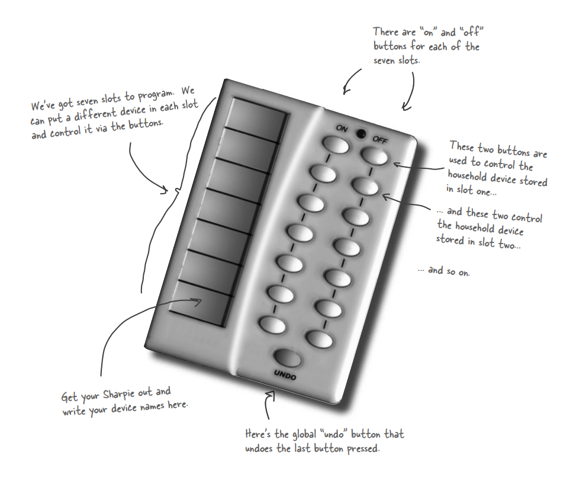

# Taking a look at the vendor classes

CD-R'deki Vendor sınıflarını inceleyin. Bu sınıflar, uzaktan kumandadan kontrol etmemiz gereken nesnelerin
interface'leri hakkında size fikir verecektir.

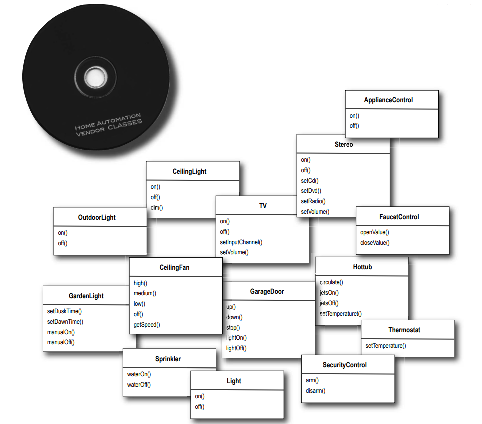

Görünüşe göre burada oldukça geniş bir sınıf setimiz var ve ortak interface'ler kümesi oluşturmak için çok fazla
endüstri bulunmuyor gibi görünüyor. Ayrıca, gelecekte daha fazla bu tür sınıfların gelmesini bekliyoruz gibi görünüyor.
Bir uzaktan kumanda API'si tasarlamak ilginç olacak. Tasarım konusuna geçelim.

Yine yapmamız gereken bir tasarımımız var. İlk gözlemimiz, açma ve kapama düğmeleri bulunan basit bir uzaktan kumandaya
sahip olmamız, ancak oldukça farklı tedarikçi sınıflarına sahip olmamızdır.

--**DIALOGS**--

Mary: Evet, ben de on() ve off() gibi bir dizi sınıf göreceğimizi düşündüm, ancak burada dim(), setTemperature(),
setVolume(), setDirection() gibi methodlar bulunuyor gibi görünüyor.

Sue: Sadece o değil, ayrıca gelecekte daha fazla tedarikçi sınıfının, benzer şekilde çeşitli methodlara sahip olmasını
bekleyebiliriz gibi geliyor.

Mary: Bence bu durumu ilgi alanlarının ayrılması olarak görmeliyiz: uzaktan kumanda, düğme basmalarını nasıl
yorumlayacağını ve talepleri nasıl yapacağını bilmelidir, ancak ev otomasyonu veya sıcak küveti nasıl açacağı konusunda
çok fazla bilgiye sahip olmamalıdır.

Sue: İyi bir tasarım gibi görünüyor. Ancak uzaktan kumanda aptalca ve sadece genel talepleri nasıl yapacağını biliyorsa,
uzaktan kumandanın bir ışığı açabilir veya bir garaj kapısını açabilir gibi bir eylemi nasıl başlatabileceğini nasıl
tasarlarız?

Mary: Emin değilim, ancak uzaktan kumandanın tedarikçi sınıflarının ayrıntılarını bilmesini istemiyoruz.

Sue: Bunun anlamı nedir?

Mary: Uzaktan kumandanın "eğer slot1 == Light ise ışık aç, aksi halde slot1 = Hottub ise hottub.jetsOn()" gibi bir
dizi "if" ifadesinden oluşmasını istemiyoruz. Bunun kötü bir tasarım olduğunu biliyoruz.

Sue: Katılıyorum. Yeni bir tedarikçi sınıfı ortaya çıktığında kodu değiştirmemiz gerekeceği için, potansiyel olarak
hatalar oluşturabilir ve kendimize daha fazla iş yaratabiliriz!

Joe : Merhaba, dinlememek mümkün değildi. 1. Bölümden beri Tasarım Desenleri üzerine çalışıyorum. "Command Pattern"
adında bir desen olduğunu düşünüyorum ve bu işe yarayabilir.

Mary: Biraz daha açarmısın?

Joe: Command Pattern, bir eylemin talep edenini, eylemi gerçekleştiren nesneden ayırmanıza olanak tanır. Bu durumda
talep eden uzaktan kumanda olurken eylemi gerçekleştiren nesne, tedarikçi sınıflarınızın bir örneği olacaktır.

Sue: Bu nasıl mümkün olabilir? Onları nasıl bağlantısız hale getirebiliriz? Sonuçta bir düğmeye bastığımda, uzaktan
kumanda bir ışığı açmalıdır.

Joe: Bunun için tasarımınıza "command objects" ekleyerek yapabilirsiniz. Bir command object, belirli bir nesne
üzerinde (örneğin, oturma odası ışığı nesnesi) bir şey yapma isteğini (örneğin, bir ışığı açma) kapsar. Bu nedenle, her
düğme için bir command object saklarsak, düğme basıldığında command object'inden bazı işleri yapmasını isteyebiliriz.
Uzaktan kumanda işin ne olduğunu hiçbir şekilde bilmez, sadece işi yapmak için doğru nesneyle iletişim kurabilen bir
command object'ine sahiptir. Bu nedenle uzaktan kumanda ile ışık nesnesi arasındaki bağlantı kesilmiş olur!

Sue: Bu kesinlikle doğru yönde ilerliyor gibi görünüyor.

Mary: Yine de, deseni anlamak konusunda zorlanıyorum gibi görünüyor.

Joe: Nesnelerin bu kadar bağlantısız olduğu düşünüldüğünde, desenin nasıl çalıştığını hayal etmek biraz zor olabilir.

Mary: En azından doğru fikre sahip olup olmadığımı görmeme izin verin: Bu deseni kullanarak, bu command object'lerini
düğme slotlarına yüklenebilecek bir API oluşturabiliriz, böylece uzaktan kumanda kodu çok basit kalabilir. Ve command
object, bir ev otomasyon görevini nasıl yapılacağıyla birlikte onu yapması gereken nesneyi kapsar.

Joe: Evet, öyle düşünüyorum. Ayrıca bu desenin size "undo" düğmesi konusunda da yardımcı olabileceğini düşünüyorum,
ancak henüz o kısmı incelemedim.

Mary: Bu gerçekten cesaret verici geliyor, ancak deseni gerçekten anlamak için biraz çalışmam gerektiğini düşünüyorum.

# Meanwhile, back at the Diner..., or, A brief introduction to the Command Pattern

Joe'in belirttiği gibi, Command Pattern'i sadece tanımını dinleyerek anlamak biraz zor olabilir. Ancak endişelenmeyin,
size yardımcı olmaya hazır bazı arkadaşlarımız var: 1. Bölümdeki dostane lokantamızı hatırlıyor musunuz? Alice, Flo ve
sipariş aşçısıyla bir süre ziyaret etmedik, ancak geri dönmemizin (yemek ve harika sohbetin ötesinde) iyi bir nedeni
var: lokanta, Command Pattern'ni anlamamıza yardımcı olacak.

Öyleyse, lokantaya kısa bir dönüş yapalım ve müşteriler, garson, siparişler ve sipariş aşçısı arasındaki etkileşimleri
inceleyelim. Bu etkileşimler aracılığıyla, Command Pattern'nde yer alan nesneleri anlayacak ve bağlantısızlığın nasıl
çalıştığına dair bir his kazanacaksınız. Bundan sonra uzaktan kumanda API'sini oluşturacağız.

Tamam, hepimiz Lokanta'nın nasıl işlediğini biliyoruz:

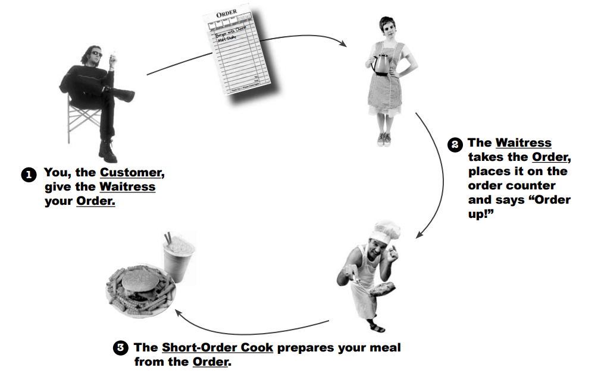

Haydi etkileşimi biraz daha ayrıntılı inceleyelim...

...ve bu Lokanta'nın Objectville'de bulunduğunu göz önünde bulundurarak, nesneler ve method çağrıları hakkında
düşünelim!

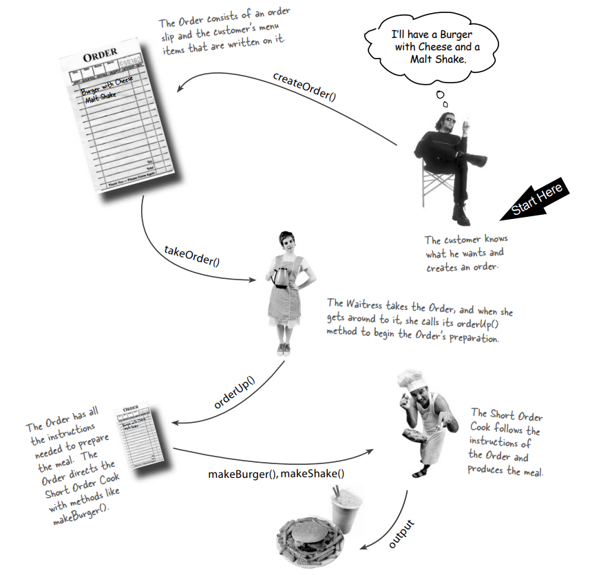

# The Objectville Diner roles and responsibilities

Bir Sipariş Fişi, bir yemeği hazırlamak için bir isteği encapsulates eder. Sipariş Fişini, bir yemek hazırlamak için bir
isteği temsil eden bir nesne olarak düşünün. Herhangi bir nesne gibi, bu fiş çevrilebilir - Garson'dan sipariş tezgahına
veya vardiyayı devralan bir sonraki Garsona. Sadece bir method olan orderUp() içeren bir interface'i vardır ve yemeği
hazırlamak için gereken eylemleri encapsulate eder. Ayrıca hazırlaması gereken nesneye bir referansa sahiptir (bizim
durumumuzda Cook). Garsonun siparişin içinde ne olduğunu veya yemeği kimin hazırladığını bilmek zorunda olmaması
nedeniyle encapsulate edilmiştir; sadece sipariş fişini sipariş penceresinden geçirmesi ve "Sipariş hazır!" demesi
gerekir.

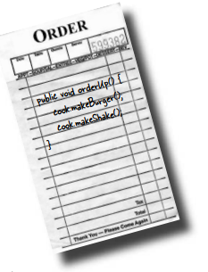

Garsonun görevi Sipariş Fişlerini almak ve üzerlerindeki orderUp() methodunu çağırmaktır. Garsonun işi kolaydır: bir
müşteriden sipariş alır, müşterilere yardımcı olmaya devam eder ve sipariş tezgahına geri dönerken orderUp() methodunu
çağırarak yemeği hazırlatır. Daha önce tartıştığımız gibi, Objectville'de Garson, siparişin üzerinde ne olduğu veya
kimin hazırlayacağı hakkında gerçekten endişelenmez; sadece sipariş fişlerinin işi bitirmek için çağırabileceği
orderUp() methoduna sahip olduğunu bilir.

Gün boyunca Garsonun takeOrder() methodu farklı müşterilerden farklı sipariş fişleriyle parametrelenir, ancak bu onu
etkilemez; tüm Sipariş Fişlerinin orderUp() methodunu desteklediğini ve yemeği hazırlatmak için herhangi bir zamanda
orderUp() çağırabileceğini bilir.

Short Order Cook, yemeği hazırlamak için gereken bilgiye sahiptir. Short Order Cook, yemek hazırlamanın gerçekten
nasıl yapılacağını bilen nesnedir. Garson orderUp() methodunu çağırdığında, Short Order Cook devralır ve yemekleri
oluşturmak için gereken tüm methodları uygular. Garson ve Aşçı'nın tamamen bağlantısız olduğuna dikkat edin: Garsonun
yemek ayrıntılarını içeren Sipariş Fişleri vardır; sadece her sipariş üzerinde bir method çağırır ve yemeği hazırlatır.
Benzer şekilde, Aşçı talimatlarını Sipariş Fişi'nden alır; Garson ile doğrudan iletişim kurması gerekmez.

Tamam, Garson ile Aşçı arasında bir Sipariş Fişi ile decoupled sağlayan bir Lokanta var, peki ya bundan sonra ne
olacak?

Lokanta, bize bir isteği yapan nesneyi isteği alan ve uygulayan nesnelerden ayırmamıza izin veren bir nesne yönelimli
bir tasarım deseni modeli olarak düşünün. Örneğin, uzaktan kumanda API'mizde, bir düğmeye bastığımızda çağrılan kodu, bu
istekleri gerçekleştiren tedarikçi özel sınıfların nesnelerinden ayırmamız gerekiyor. Uzaktan kumandanın her slotsı,
Lokanta'nın sipariş fişi nesnesi gibi bir nesne tutuyor gibi düşünelim. Sonra, bir düğme bastığında, bu nesne üzerinde "
orderUp()" method'unun eşdeğerini çağırabilir ve ışıkların nasıl açılacağı veya bu şeylerin nasıl gerçekleştiği
hakkındaki ayrıntıları uzaktan kumanda bilmeden gerçekleşebilir.

Şimdi, biraz farklı bir perspektife geçelim ve tüm bu Lokanta konuşmalarını Command Pattern'e nasıl uyarlayabileceğimize
bakalım...

# From the Diner to the Command Pattern

Tamam, Objectville Lokantası'nda yeterince zaman geçirdik ve kişiliklerini ve sorumluluklarını oldukça iyi biliyoruz.
Şimdi Diner diyagramını Command Pattern'i yansıtacak şekilde yeniden düzenleyeceğiz. Tüm oyuncuların aynı olduğunu
göreceksiniz; sadece isimler değişti.

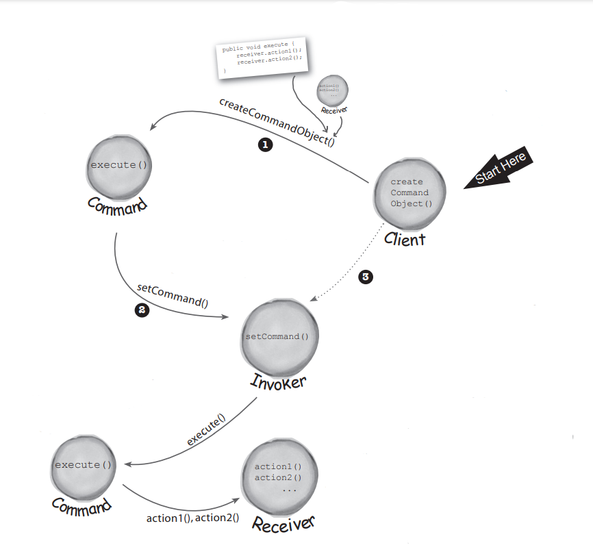

Client, command object oluşturmakla sorumludur. Command Object, bir Receiver üzerinde bir dizi action'dan oluşur.

Actions ve Receiver, command object'de bir araya getirilir.

Command Object, action'ları kapsayan execute() adında bir method sağlar ve bu method, Receiver üzerindeki action'ları
çağırmak için kullanılabilir.

Client, bir Invoker nesnesi üzerinde setCommand() methodunu çağırır ve command object geçirir, burada command object
ihtiyaç duyulana kadar saklanır.

Gelecekte bir noktada, Invoker command object'in execute() methodunu çağırır...

...bu, action'ların Receiver üzerinde çağrılmasına neden olur.

### Loading the Invoker

1 - Client, command object'i create eder

2 - Client, Command Object'ini Invoker içinde saklamak için setCommand() işlemi yapar.

3 - Daha sonra... client, command'in yürütülmesini Invoker'dan talep eder.

# Our first command object

İlk Command Object'ini oluşturma zamanı gelmedi mi? Öyleyse uzaktan kumanda için bazı kodlar yazmaya başlayalım. Henüz
uzaktan kumanda API'sini nasıl tasarlayacağımızı tam olarak çözemedik, ancak birkaç temel şeyi alttan yukarıya inşa
etmek bize yardımcı olabilir...

Önce şunu belirtmek gerekir ki, tüm Command Object'ler aynı interface'i implemente ederler ve bu interface sadece bir
method içerir. Lokanta örneğinde bu methodu orderUp() olarak adlandırdık, ancak genellikle sadece execute() adını
kullanırız. İşte Command Interface'i:

```
public interface Command {
    void execute();
}
```

Şimdi, bir ışığı açmak için bir command uygulamak istediğinizi varsayalım. Tedarikçi sınıflarımızın setine göndermeden,
Light sınıfının iki methodu vardır: on() ve off(). İşte bunu bir command olarak nasıl uygulayabileceğinizi gösteren bir
örnek:

```
public class LightOnCommand implements Command {

    Light light;

    public LightOnCommand(Light light) {
        this.light = light;
    }

    @Override
    public void execute() {
        light.on();
    }
}
```

Constructor methodu, bu command'ın kontrol edeceği belirli bir light'ı alır - örneğin oturma odası ışığı - ve bu
ışığı light adlı instance variables'da saklar. execute() methodu çağrıldığında, bu light nesnesi, talebin Receiver'i
olacaktır. Yani, bu command'ın çağrılmasıyla ışığı açmak için light.on() gibi bir işlem gerçekleştirilir. Bu, Command
Pattern'nin ana fikri olan request'i gönderen nesneyi, bu request'i alan ve gerçekleştiren nesneden ayırmamıza yardımcı
olur.

execute() methodu, kontrol ettiğimiz light'i temsil eden receiver nesne üzerinde on() methodunu çağırır. Bu şekilde,
command nesnesi ışığı açmak için gerekli işlemi gerçekleştirir. Bu, command'ın işlevselliğini sağlayan temel mantığı
temsil eder.

Şimdi bir LightOnCommand sınıfınız olduğuna göre, bu sınıfı nasıl kullanabileceğimizi görelim...

# Using the command object

Pekala, işleri basit tutalım: diyelim ki sadece bir düğmeye ve kontrol edilecek bir cihazı tutmak için bir slot bulunan
bir uzaktan kumandamız var:

```
public class SimpleRemoteControl {

    /* Bir command'i tutmak için bir slot bulunur ve bu command bir cihazı kontrol eder.*/
    
    Command slot;

    /* Slot tarafından kontrol edilecek command'i ayarlamak için bir setter methodumuz var. Bu kodun client'i,
    uzaktan kumanda düğmesinin davranışını değiştirmek istiyorsa bu methodu birden fazla kez çağırabilir.*/
    
    public void setCommand(Command command){
        this.slot = command;
    }

    /* Bu method, düğme basıldığında çağrılır. Tek yapmamız gereken, slot'a bağlı olan mevcut command'i almak ve onun
    execute() methodunu çağırmaktır.*/
    
    public void buttonPressed(){
        this.slot.execute();
    }
}
```

# Creating a simple test to use the Remote Control

İşte basit bir uzaktan kumandayı test etmek için sadece biraz kod. İnceleyelim ve parçaların Command Pattern
diyagramıyla nasıl eşleştiğini gösterelim:

```
public class RemoteControlTest {
    public static void main(String[] args) {

        /* Uzaktan kumanda, Invoker'i temsil eder; bu, request'lerde bulunmak için kullanılabilecek bir command object
        alır.*/
        SimpleRemoteControl remoteControl = new SimpleRemoteControl();

        /* Şimdi bir Light nesnesi oluşturuyoruz; bu, request'in Receiver'i olacaktır.*/
        Light light = new Light();

        /* İşte bir command oluşturuyoruz ve Receiver'i ona iletiyoruz.*/
        LightOnCommand lightOn = new LightOnCommand(light);

        /* Invoker'a command'i geciyoruz */
        remoteControl.setCommand(lightOn);

        /* button basildigini simule ediyoruz */
        remoteControl.buttonPressed();
        
    }
}
```

# GarageDoorOpen Command

```
public class GarageDoorOpenCommand implements Command {
    GarageDoor door;

    public GarageDoorOpenCommand(GarageDoor door) {
        this.door = door;
    }

    @Override
    public void execute() {
        door.open();
    }
}
```

GarageDoor class'ı;

```
public class GarageDoor {
    public void open() {
        System.out.println("Garage door is Open");
    }
}
```

Kullanımı;

```
public class RemoteControlTest {
    public static void main(String[] args) {
        SimpleRemoteControl remoteControl = new SimpleRemoteControl();
        Light light = new Light();
        GarageDoor garageDoor = new GarageDoor();

        LightOnCommand lightOn = new LightOnCommand(light);
        GarageDoorOpenCommand garageDoorOpenCommand = new GarageDoorOpenCommand(garageDoor);

        remoteControl.setCommand(lightOn);
        remoteControl.buttonPressed();
        remoteControl.setCommand(garageDoorOpenCommand);
        remoteControl.buttonPressed();
    }
}
```

# The Command Pattern defined

Objectville Lokantası'nda vakit geçirdiniz, uzaktan kumanda API'sini kısmen uyguladınız ve bu süreçte Command Pattern'
nde sınıf ve nesnelerin nasıl etkileşimde bulunduğuna dair oldukça iyi bir resim elde ettiniz. Şimdi Command Pattern'ni
tanımlayacak ve tüm ayrıntıları netleştireceğiz. Resmi tanımıyla başlayalım:

Command Pattern, bir request'i bir nesne olarak encapsulate ederek diğer nesneleri farklı request'ler ile
parametrelendirmenizi, request'leri sıralamayı veya kaydetmeyi ve undo işlemleri desteklemenizi sağlar.

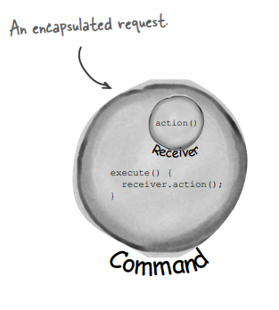

Bunu adım adım inceleyelim. Bir command object'in bir request'i bir nesne olarak kapsadığını biliyoruz; bunu belirli bir
receiver üzerinde bir dizi action'i birleştirerek yapar. Bunu başarmak için, action'ları ve receiver'i bir araya
getirerek yalnızca bir methodu, yani execute() methodunu açığa çıkaran bir nesneye paketler. Çağrıldığında, execute()
methodu, action'ların receiver üzerinde çağrılmasına neden olur. Dışarıdan bakıldığında, diğer nesneler gerçekten hangi
action'ların hangi receiver üzerinde gerçekleştirildiğini bilmez; sadece execute() methodunu çağırdıklarında
request'lerinin service edileceğini bilirler.

Ayrıca bir nesneyi bir command ile parametrelendirme örnekleri gördük. Lokanta örneğinde, Garson gün boyunca birden
fazla siparişle parametrelenmişti. Basit uzaktan kumandada ise önce düğme slot'unu "ışık açık" command'i ile doldurduk
ve daha sonra onu "garaj kapısı açık" command'i ile değiştirdik. Garson gibi uzaktan kumanda slot'unuzun hangi command
object'ine sahip olduğunu gerçekten umursamadı, yeter ki Command interface'ini implemente ettiğini bilsin

Henüz command'leri sıralamak, kaydetmek ve undo işlemlerini nasıl kullanacağımızı görmedik. Endişelenmeyin, bunlar
temel Command Pattern'nin oldukça açıklayıcı uzantılarıdır ve yakında onlara geleceğiz. Temelleri bir kez yerine
koyduğumuzda, Meta Command Pattern olarak bilinen şeyi de kolayca destekleyebiliriz. Meta Command Pattern, birden çok
command'i aynı anda çalıştırmanıza olanak tanır.

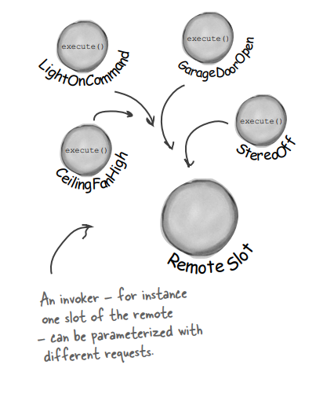

# The Command Pattern defined: the class diagram

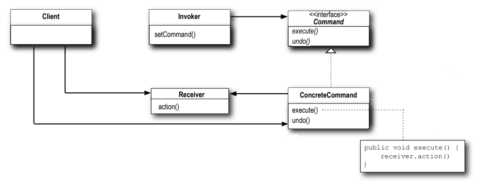

Client, bir ConcreteCommand oluşturmak ve Receiver'ini belirlemekten sorumludur.

Invoker (Çağırıcı), bir command tutar ve belirli bir noktada command'in execute() methodunu çağırarak bir request'i
gerçekleştirmesi için command'e sorar.

Command, tüm command'ler için bir interface bildirir. Bir command'in execute() yöntemi aracılığıyla çağrıldığını, bir
Receivernın bir eylemi gerçekleştirmesini istediğini zaten biliyorsunuz. Ayrıca, bu arayüzün bir undo() yöntemi olduğunu
göreceksiniz; bunu daha sonra bölümde biraz daha ayrıntılı olarak ele alacağız.

execute() methodu, request'i yerine getirmek için gereken action'ları receiver üzerinde çağırır.

ConcreteCommand, bir action ile bir Receiver arasında bir binding tanımlar. Invoker, execute() methodunu
çağırarak bir request'de bulunur ve ConcreteCommand, bu isteği yerine getirerek Receiver üzerinde bir veya daha fazla
action'ı çağırır.

Receiver, request'i yerine getirmek için gereken işlemin nasıl yapılacağını bilir. Herhangi bir sınıf bir Receiver
olarak hareket edebilir.

--**DIALOGS**--

Sue: Basit Uzaktan Kumanda'da yaptığımız gibi, command'leri slotlara atayabileceğimiz bir yol sağlamamız gerekiyor.
Bizim durumumuzda yedi slotumuz var, her biri bir "aç" ve "kapat" düğmesiyle. Bu nedenle command'leri uzaktan kumandaya
şöyle atayabiliriz:

```
onCommands[0] = onCommand;
offCommands[0] = offCommand;
```

Mary: Bu mantıklı, ancak Light nesneleri için geçerli değil gibi görünüyor. Uzaktan kumandanın oturma odasını mutfak
ışığından ayırt ettiğini nasıl bilir?

Sue: İşte asıl mesele bu, bilmez! Uzaktan kumanda, bir düğme basıldığında ilgili command nesnesinde execute() çağrılması
dışında hiçbir şeyi bilmez.

Mary: Evet, o konuyu bir nebze anladım ama implementasyonu nasıl sağlıyoruz ki doğru nesneler doğru cihazları açıp
kapatıyor?

Sue: Uzaktan kumanda yüklenmek üzere commandları oluştururken, oturma odası ışığı nesnesine bağlı olan bir LightCommand
ve mutfak ışığı nesnesine bağlı başka bir LightCommand oluştururuz. Hatırla, request'in Receiver'i, içinde kapsüllenmiş
olan command'e bağlanır. Bu nedenle düğmeye basıldığında hangi ışığın hangisi olduğu kimseyi ilgilendirmez, execute()
methodu çağrıldığında doğru şey gerçekleşir.

Mary: Sanırım anladım. Uzaktan kumandaya geçelim ve bu konu daha da açıklığa kavuşacaktır!

# Assigning Commands to slots

Bu nedenle bir planımız var: Her slot'u uzaktan kumandadaki bir command'e atayacağız. Bu, uzaktan kumandamızı Invoker
yapar. Bir düğme basıldığında execute() methodu ilgili command'de çağrılacak ve bu, receiver üzerinde (ışıklar, tavan
vantilatörleri, stereo gibi) eylemlerin çağrılmasına neden olacak.

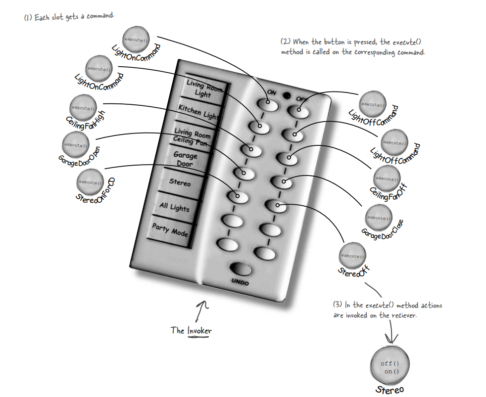

1 - Her slot bir command alır

2 - Düğme basıldığında, ilgili command'de execute() methodu çağrılır.

3 - execute() methodunda receiver üzerinde ki action'lar çağrılır.

Boş slotları daha sonra düşüneceğiz

# Implementing the Remote Control

```
public class RemoteControl {

    /* Bu sefer uzaktan kumanda, karşılık gelen array'lerde tutacağımız yedi On ve Off command'ini ele alacak.*/
    
    Command[] onCommands;
    Command[] offCommands;

    public RemoteControl() {

        /* Yapılması gereken tek şey, constructor'da On ve Off array'lerini oluşturmak ve başlatmak.*/
        
        onCommands = new Command[7];
        offCommands = new Command[7];

        Command noCommand = new NoCommand();

        for (int i = 0; i < 7; i++) {
            onCommands[i] = noCommand;
            offCommands[i] = noCommand;
        }
    }

    /* setCommand() methodu, bir slot konumu ve bu slotda saklanacak On ve Off command'lerini alır. Bu command'leri
    daha sonra kullanmak üzere On ve Off array'lerine yerleştirir.*/
    
    public void setCommand(int slot, Command onCommand, Command offCommand){
        this.onCommands[slot] = onCommand;
        this.offCommands[slot] = offCommand;
    }


    /* Bir On veya Off düğmesine basıldığında, donanım ilgili methodları onButtonWasPushed() veya offButtonWasPushed()
    çağırmakla ilgilenir.*/
    
    public void onButtonWasPushed(int slot){
        this.onCommands[slot].execute();
    }

    public void offButtonWasPushed(int slot){
        this.offCommands[slot].execute();
    }

    public String toString() {
        StringBuilder stringBuilder = new StringBuilder();
        stringBuilder.append("\n------ Remote Control -------\n");
        for (int i = 0; i < this.onCommands.length; i++) {
            stringBuilder.append("[slot ")
                    .append(i)
                    .append("] ")
                    .append(onCommands[i].getClass().getName())
                    .append(" ")
                    .append(offCommands[i].getClass().getName())
                    .append("\n");
        }
        return stringBuilder.toString();
    }
}
```

Burada kullanılan NoCommand sınıfı ile ilgili ileri de açıklama ekleyeceğiz;

```
public class NoCommand implements Command {
    @Override
    public void execute() {
    }
}
```

# Implementing the Commands

LightOffCommand;

```
public class LightOffCommand implements Command {
    Light light;

    public LightOffCommand(Light light) {
        this.light = light;
    }

    @Override
    public void execute() {
        light.off();
    }
}
```

Light class'ı içerisine off() methodunu ekliyorum

Biraz daha zor bir şey deneyelim; Stereo için On ve Off komutları yazmak nasıl olur? Tamam, Off komutu kolay,
Stereo'yu StereoOffCommand içindeki off() methodu ile bağlarız. On biraz daha karmaşık olabilir; diyelim ki
StereoOnWithCDCommand adında bir Stereo açma komutu yazmak istiyoruz...

```
public class StereoOnWithCDCommand implements Command {

    Stereo stereo;

    public StereoOnWithCDCommand(Stereo stereo) {
        this.stereo = stereo;
    }

    /* Bu isteği gerçekleştirmek için Stereo üzerinde üç methodu çağırmamız gerekiyor: İlk olarak, Stereo'yu açarız,
    ardından CD çalmak üzere ayarlarız ve son olarak ses seviyesini 11 olarak ayarlarız. */
    
    @Override
    public void execute() {
        stereo.on();
        stereo.setCD();
        stereo.setVolume(11);
    }
}
```

# Putting the Remote Control through its paces

```
public class RemoteControlTest {
    public static void main(String[] args) {
        RemoteControl remoteControl = new RemoteControl();

        /* Tüm cihazları uygun konumlarına yerleştirin. */
        
        Light livingRoomLight = new Light("Living room");
        Light kitchenLight = new Light("Kitchen");
        CeilingFan ceilingFan = new CeilingFan("Living room");
        GarageDoor garageDoor = new GarageDoor("");
        Stereo stereo = new Stereo("Living room");

        /* Tüm Light Command nesnelerini oluşturun */
        
        LightOnCommand livingRoomLightOn = new LightOnCommand(livingRoomLight);
        LightOffCommand livingRoomLightOff = new LightOffCommand(livingRoomLight);
        LightOnCommand kitchenLightRoomOn = new LightOnCommand(kitchenLight);
        LightOffCommand kitchenLightRoomOff = new LightOffCommand(kitchenLight);


        /* Tavan vantilatörü için On ve Off Command'leri oluşturun.*/
        
        CeilingFanOnCommand ceilingFanOn = new CeilingFanOnCommand(ceilingFan);
        CeilingFanOffCommand ceilingFanOff = new CeilingFanOffCommand(ceilingFan);

        /* Garaj kapısı için Open ve Close Command'leri oluşturun.*/
        
        GarageDoorOpenCommand garageDoorOpen = new GarageDoorOpenCommand(garageDoor);
        GarageDoorCloseCommand garageDoorClose = new GarageDoorCloseCommand(garageDoor);

        /* Stereo için On ve Off Command'leri oluşturun.*/
        
        StereoOnWithCDCommand stereoOnWithCD = new StereoOnWithCDCommand(stereo);
        StereoOffCommand stereoOff = new StereoOffCommand(stereo);

        /* Şimdi tüm command'lere sahip olduğumuza göre, onları uzaktan kumanda slot'larına yükleyebiliriz*/
        
        remoteControl.setCommand(0,livingRoomLightOn,livingRoomLightOff);
        remoteControl.setCommand(1,kitchenLightRoomOn,kitchenLightRoomOff);
        remoteControl.setCommand(2,ceilingFanOn,ceilingFanOff);
        remoteControl.setCommand(3,garageDoorOpen,garageDoorClose);
        remoteControl.setCommand(4,stereoOnWithCD,stereoOff);
        System.out.println(remoteControl);

        /* Tamam, hazırız! Şimdi her slot üzerinden adım adım geçiyoruz ve On ve Off düğmesine basıyoruz.*/
        
        remoteControl.onButtonWasPushed(0);
        remoteControl.offButtonWasPushed(0);
        remoteControl.onButtonWasPushed(1);
        remoteControl.offButtonWasPushed(1);
        remoteControl.onButtonWasPushed(2);
        remoteControl.offButtonWasPushed(2);
        remoteControl.onButtonWasPushed(3);
        remoteControl.offButtonWasPushed(3);
        remoteControl.onButtonWasPushed(4);
        remoteControl.offButtonWasPushed(4);
    }
}
```

'NoCommand' neyin nesi? "Iyi yakalandık. İçeriye ufak bir şeyler sokuşturduk. Uzaktan kumandada, her bir slot'a
başvurduğumuzda bir command'in yüklü olup olmadığını kontrol etmek istemedik. Örneğin, onButtonWasPushed() methodunda
şöylebir kod gerekecekti:

```
public void onButtonWasPushed(int slot) {
    if (onCommands[slot] != null) {
        this.onCommands[slot].execute();
    }
}
```

Bu durumdan nasıl kaçınabiliriz? Hiçbir şey yapmayan bir command uygulayarak

```
public class NoCommand implements Command {
    @Override
    public void execute() {
    }
}
```

"Sonra, RemoteControl constructor'ında her slota varsayılan olarak bir NoCommand nesnesi atarız ve her zaman her slotda
çağrılacak bir command'imiz olacağını biliriz."

```
Command noCommand = new NoCommand();
    for (int i = 0; i < 7; i++) {
        onCommands[i] = noCommand;
        offCommands[i] = noCommand;
    }
```

NoCommand nesnesi bir null nesnesi örneğidir. Bir null nesnesi, anlamlı bir nesne döndürme olanağınız olmadığında, ancak
null işleme sorumluluğunu istemiyorsanız faydalıdır. Örneğin, uzaktan kumandamızda her bir slot'a doğrudan atayacak
anlamlı bir nesnemiz yoktu, bu yüzden bir NoCommand nesnesi sağladık. Bu nesne bir yedek görevi görür ve execute methodu
çağrıldığında hiçbir şey yapmaz.

Null Nesnelerini, birçok Tasarım Deseni ile birlikte kullanırken bulacaksınız ve bazen Null Nesnesi'nin kendisi bir
Tasarım Deseni olarak listelenir.

# Time to write that documentation...

### Remote Control API Design for Home Automation

Ev Otomasyon Uzaktan Kumandanız için aşağıdaki tasarım ve interface programlama arayüzünü sunmaktan mutluluk duyuyoruz.
Temel tasarım hedefimiz, uzaktan kumanda kodunu mümkün olduğunca basit tutmak, böylece yeni Vendor sınıfları
üretildiğinde değişiklik gerektirmemesini sağlamaktır. Bu amaçla, RemoteControl sınıfını Vendor Sınıfları'ndan mantıksal
olarak ayırmak için Command Pattern'ni kullanmayı tercih ettik. Bu sayede uzaktan kumanda üretim maliyetini
azaltacağınıza ve sürekli bakım maliyetlerinizi büyük ölçüde düşüreceğinize inanıyoruz. Aşağıdaki sınıf diyagramı
tasarımımızın genel bir özetini sunmaktadır:

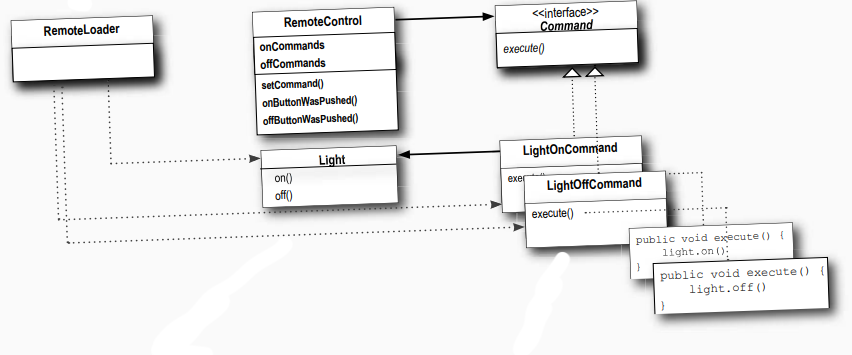

**RemoteLoader**, Uzaktan Kumanda'nın slotlarına yüklenen bir dizi Command Object oluşturur. Her Command Object, bir ev
otomasyon cihazının bir request'ini encapsulate eder

**RemoteControl**, her bir düğme için bir Command Object içeren bir dizi Command Object'ini yönetir. Bir düğme
basıldığında, ilgili ButtonWasPushed() methodu çağrılır ve bu method command üzerinde execute() methodunu çağırır. Bu,
uzaktan kumandanın çağrılan sınıflar hakkındaki bilgisinin tamamıdır, çünkü Command Object uzaktan kumandayı gerçek ev
otomasyon işini yapan sınıflardan ayırır

**Command Interface**, Tüm RemoteControl command'leri, bir method içeren Command interface'ini implement eder: execute()
Command'ler, belirli bir Vendor sınıfı üzerindeki bir dizi işlemi kapsar. Uzaktan kumanda, bu işlemleri execute()
methodunu çağırarak çağırır.

**Light** Vendor Sınıfları, cihazları kontrol etmek için gerçek ev otomasyon işini gerçekleştirmek için kullanılır.
Burada, bir örnek olarak Light sınıfını kullanıyoruz

**LightOnCommand - LightOffCommand** Command Interface'i kullanılarak, uzaktan kumandada bir düğmeye basılarak
çağrılabilen her işlem, basit bir Command Object ile uygulanır. Command Object, bir Vendor Sınıfı örneği olan bir
nesnenin bir referansını tutar ve bu nesne üzerinde bir veya daha fazla method çağıran bir execute methodu uygular. İşte
bir ışığı açan ve kapatan iki böyle sınıfı gösteriyoruz.

Hop! Neredeyse unutuyorduk...neyse ki temel Command sınıflarımızı bir kez aldıktan sonra, undo işlemi eklemek kolaydır.
Şimdi command'lere ve uzaktan kumandaya undo özelliğini eklemeyi inceleyelim...

# What are we doing?

Tamam, uzaktan kumandada undo düğmesini desteklemek için işlev eklememiz gerekiyor. Şöyle çalışır: Diyelim ki
Oturma Odası Işığı kapalı ve uzaktan kumandada aç düğmesine basarsınız. Açıkça ışık yanar. Şimdi undo düğmesine
basarsanız, son işlem geri alınır - bu durumda ışık söner. Daha karmaşık örneklerle ilgilenmeden önce, ışığı undo
düğmesiyle çalışır hale getirelim

1 - Command'ler undo işlemini desteklediğinde, execute() methodunu yansıtan bir undo() methoduna sahiptir. execute()
son ne yaptıysa, undo() geri alır. Dolayısıyla, command'lerimize undo özelliği ekleyebilmeden önce Command interface'ine
bir undo() methodu eklememiz gerekiyor:

```
public interface Command {
    void execute();
    void undo();
}
```

Bu oldukça basitti. Şimdi, Light command'ine dalalım ve undo() methodunu implemente etmeye başlayalım.

2 - Önce LightOnCommand ile başlayalım: Eğer LightOnCommand'ın execute() methodu çağrıldıysa, o zaman
en son on() methodu çağrıldı. Undo() işleminin bunun tam tersini yapması gerektiğini biliyoruz, yani off()
methodunu çağırarak.

```
public class LightOnCommand implements Command {

    Light light;

    public LightOnCommand(Light light) {
        this.light = light;
    }

    @Override
    public void execute() {
        light.on();
    }

    @Override
    public void undo() {
        light.off();
    }
}
```

Şimdi LightOffCommand'e geçelim. Burada undo() methodu sadece Light'ın on() methodunu çağırmalı.

```
public class LightOffCommand implements Command {
    Light light;

    public LightOffCommand(Light light) {
        this.light = light;
    }

    @Override
    public void execute() {
        light.off();
    }

    @Override
    public void undo() {
        light.on();
    }
}
```

Bu daha da kolay olabilir miydi? Tamam, henüz bitirmedik; son basılan düğmeyi ve undo düğmesi basımını takip etmek için
Uzaktan Kumanda'ya biraz destek eklememiz gerekiyor.

3 - Undo düğmesini desteklemek için Uzaktan Kumanda sınıfına sadece birkaç küçük değişiklik yapmamız gerekecek.
İşte nasıl yapacağımız: Son çağrılan command'i izlemek için yeni bir instance variable ekleyeceğiz; ardından undo
düğmesi her basıldığında, bu command'i alırız ve undo() methodunu çağırırız

```
public class RemoteControlUndo {
    Command[] onCommands;
    Command[] offCommands;

    /* İşte undo düğmesi için son çalıştırılan command'i saklayacağımız yer*/
    
    Command undoCommand;

    public RemoteControlUndo() {
        onCommands = new Command[7];
        offCommands = new Command[7];

        Command noCommand = new NoCommand();
        for (int i = 0; i < 7; i++) {
            this.onCommands[i] = noCommand;
            this.offCommands[i] = noCommand;
        }

        /* Diğer slotlar gibi, undo da NoCommand ile başlar, bu yüzden diğer düğmeye basmadan önce undo'ya basmak
        hiçbir şey yapmaz*/
        
        this.undoCommand = noCommand;
    }

    public void setCommand(int slot, Command onCommand, Command offCommand){
        this.onCommands[slot] = onCommand;
        this.offCommands[slot] = offCommand;
    }

    public void onBottonWasPushed(int slot){
        this.onCommands[slot].execute();

        /* Bir düğme basıldığında, command'i alırız ve önce onu çalıştırırız; ardından bu command'in bir referansını
        undoCommand instance variable'inda saklarız. Hem 'on' command'leri hem de 'off' command'leri için bunu yaparız*/
        
        this.undoCommand = this.onCommands[slot];
    }

    public void offButtonWasPushed(int slot){
        this.offCommands[slot].execute();

        /* Bir düğme basıldığında, command'i alırız ve önce onu çalıştırırız; ardından bu command'in bir referansını
        undoCommand instance variable'inda saklarız. Hem 'on' command'leri hem de 'off' command'leri için bunu yaparız*/
        
        this.undoCommand = this.offCommands[slot];
    }

    public void undoButtonWasPushed(){
        
        /* Undo düğmesine basıldığında, undoCommand içinde saklanan command'in undo() methodunu çağırırız. Bu, en son
        çalıştırılan command'in işlemini geri çevirir.*/
        
        this.undoCommand.undo();
    }

    public String toString() {
        StringBuilder stringBuilder = new StringBuilder();
        stringBuilder.append("\n------ Remote Control -------\n");
        for (int i = 0; i < this.onCommands.length; i++) {
            stringBuilder.append("[slot ")
                    .append(i)
                    .append("] ")
                    .append(onCommands[i].getClass().getName())
                    .append(" ")
                    .append(offCommands[i].getClass().getName())
                    .append("\n");
        }
        return stringBuilder.toString();
    }
}
```

# Time to QA that Undo button!

```
public class RemoteLoader {
    public static void main(String[] args) {
        RemoteControlWithUndo remoteControl = new RemoteControlWithUndo();

        Light livingRoomLight = new Light("Living room");

        LightOnCommand livingRoomLightOn = new LightOnCommand(livingRoomLight);
        LightOffCommand livingRoomLightOff = new LightOffCommand(livingRoomLight);

        remoteControl.setCommand(0,livingRoomLightOn,livingRoomLightOff);
        
        remoteControl.onBottonWasPushed(0);
        remoteControl.offButtonWasPushed(0);
        System.out.println(remoteControl);
        remoteControl.undoButtonWasPushed();
        System.out.println(remoteControl);
    }
}
```

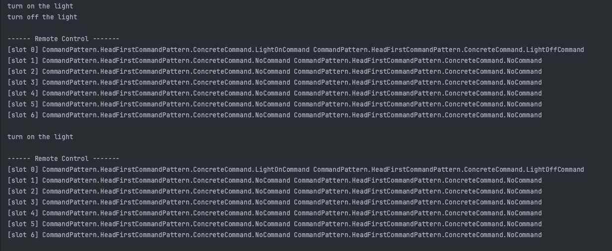

# Using state to implement Undo

Tamam, Light üzerinde undo uygulamak öğreticiydi, ama biraz fazla kolaydı. Genellikle undoyu uygulamak için
biraz state'i yönetmemiz gerekiyor. Daha ilginç bir şey deneyelim, örneğin Vendor sınıflarından CeilingFan. CeilingFan,
birkaç hızın yanı sıra bir kapatma methodu ayarlanmasına izin verir.

```
public class CeilingFan {
    private final String name;
    private int speed;
    private static final int HIGH = 3;
    private static final int MEDIUM = 2;
    private static final int LOW = 1;
    private static final int OFF = 0;

    public CeilingFan(String name) {
    
        /* Dikkat edin ki CeilingFan sınıfı, CeilingFan'ın hızını temsil eden local bir state'i saklar*/
        
        this.name = name;
        this.speed = OFF;
    }

    /* Ceiling fan'ın hızını set eden methodlar */
    
    public void high(){
        this.speed = HIGH;
    }

    public void medium(){
        this.speed = MEDIUM;
    }

    public void low(){
        this.speed = LOW;
    }

    public void off(){
        this.speed = OFF;
    }

    /* CeilingFan'ın mevcut hızını getSpeed() kullanarak alabiliriz.*/
    
    public int getSpeed() {
        return speed;
    }
}
```

# Adding Undo to the ceiling fan commands

Şimdi, çeşitli CeilingFan komutlarına undo eklemeye çalışalım. Bunu yapmak için vantilatörün son hız ayarını takip
etmemiz ve undo() methodu çağrıldığında vantilatörü önceki ayarına geri getirmemiz gerekiyor. İşte CeilingFanHighCommand
için kod:

```
public class CeilingFanHighCommand implements Command {
    CeilingFan ceilingFan;
    int prevSpeed;

    public CeilingFanHighCommand(CeilingFan ceilingFan) {
        this.ceilingFan = ceilingFan;
    }

    @Override
    public void execute() {
    
        /* Çalıştırmadan önce, vantilatörün hızını değiştirmeden önce, eylemlerimizi undo yapmak zorunda kalırsak
        previous speed state'ini kaydetmemiz gerekiyor */
        
        this.prevSpeed = ceilingFan.getSpeed();
        this.ceilingFan.high();
    }

    @Override
    public void undo() {
        
        /* Undo işlemi için vantilatörün hızını önceki hızına geri ayarlıyoruz */
        
        if (this.prevSpeed == CeilingFan.HIGH) {
            ceilingFan.high();
        } else if (this.prevSpeed == CeilingFan.MEDIUM) {
            ceilingFan.medium();
        } else if (prevSpeed == CeilingFan.LOW) {
            ceilingFan.low();
        } else if (prevSpeed == CeilingFan.OFF) {
            ceilingFan.off();
        }
    }
}
```

High olan command'in bir de medium olanını yazalım;

```
public class CeilingFanMediumCommand implements Command {
    CeilingFan ceilingFan;
    int prevSpeed;

    public CeilingFanMediumCommand(CeilingFan ceilingFan) {
        this.ceilingFan = ceilingFan;
    }

    @Override
    public void execute() {
    
        /* Çalıştırmadan önce, vantilatörün hızını değiştirmeden önce, eylemlerimizi undo yapmak zorunda kalırsak
        previous speed state'ini kaydetmemiz gerekiyor*/
        
        this.prevSpeed = ceilingFan.getSpeed();
        this.ceilingFan.medium();
    }

    @Override
    public void undo() {
        
        /* Undo işlemi için vantilatörün hızını önceki hızına geri ayarlıyoruz*/
        
        if (this.prevSpeed == CeilingFan.HIGH) {
            ceilingFan.high();
        } else if (this.prevSpeed == CeilingFan.MEDIUM) {
            ceilingFan.medium();
        } else if (prevSpeed == CeilingFan.LOW) {
            ceilingFan.low();
        } else if (prevSpeed == CeilingFan.OFF) {
            ceilingFan.off();
        }
    }
}
```

# Get ready to test the ceiling fan

Şimdi uzaktan kumandamızı CeilingFan command'leri ile doldurma zamanı geldi. Slot sıfırın açık düğmesini CeilingFan için
Medium ayarla dolduracağız ve slot biri High ayarla dolduracağız. İlgili kapat düğmeleri, CeilingFan'ın off command'ini
içerecek

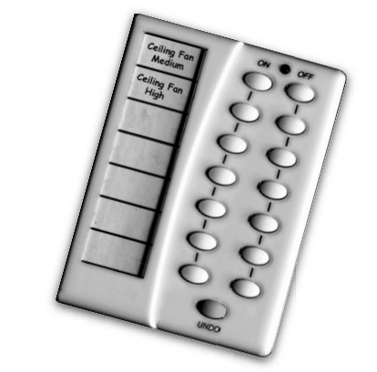

```
public class RemoteLoader {
    public static void main(String[] args) {
        RemoteControlWithUndo remoteControl = new RemoteControlWithUndo();

        CeilingFan ceilingFan = new CeilingFan("Living Room");

        CeilingFanMediumCommand medium = new CeilingFanMediumCommand(ceilingFan);
        CeilingFanHighCommand high = new CeilingFanHighCommand(ceilingFan);
        CeilingFanOffCommand off = new CeilingFanOffCommand(ceilingFan);

        remoteControl.setCommand(0,medium,off);
        remoteControl.setCommand(1,high,off);

        remoteControl.onBottonWasPushed(0);
        remoteControl.offButtonWasPushed(0);
        System.out.println(remoteControl);
        remoteControl.undoButtonWasPushed();
        System.out.println(remoteControl);
    }
}
```

# Every remote needs a Party Mode!

Bir uzaktan kumandaya sahip olmanın amacı, bir düğmeye basarak ışıkların karartılması, stereo ve TV'nin açılması ve DVD'
ye ayarlanması ve jakuzinin çalıştırılması gibi karmaşık işlemleri tek bir düğmeyle gerçekleştirebilmektir.

Commmand'leri çalıştırabilen ve bunların birden fazlasını çalıştırabilen yeni bir Command türü yapmak... oldukça iyi bir
fikir, değil mi?

```
public class MacroCommand implements Command {
    Command[] commands;

    public MacroCommand(Command[] commands) {
        
        /* Commands array'ini alın ve bunları MacroCommand içinde saklayın */
        
        this.commands = commands;
    }

    @Override
    public void execute() {
        
        /* Macro, uzaktan kumanda tarafından çalıştırıldığında, bu command'leri sırayla çalıştırır.*/
        
        for (Command command : commands) {
            command.execute();
        }
    }

    @Override
    public void undo() {
        for(Command command : commands){
            command.undo();
        }
    }
}
```

# Using a macro command

```
public class RemoteLoader {
    public static void main(String[] args) {
        RemoteControlWithUndo remoteControl = new RemoteControlWithUndo();

        Light light = new Light("Living Room");
        Stereo stereo = new Stereo("Living Room");

        LightOnCommand lightOnCommand = new LightOnCommand(light);
        LightOffCommand lightOffCommand = new LightOffCommand(light);
        StereoOnWithCDCommand stereoOnWithCDCommand = new StereoOnWithCDCommand(stereo);
        StereoOffCommand stereoOffCommand = new StereoOffCommand(stereo);

        Command[] macroOnCommands = {lightOnCommand,stereoOnWithCDCommand};
        Command[] macroOffCommands = {lightOffCommand,stereoOffCommand};

        Command partyOn = new MacroCommand(macroOnCommands);
        Command partyOff = new MacroCommand(macroOffCommands);

        remoteControl.setCommand(0,partyOn,partyOff);
        remoteControl.onBottonWasPushed(0);
        System.out.println(remoteControl);
    }
}
```

1 - Tüm vendor class'larını create ediyoruz. Şimdi vendor'ları kontrol etmek için tüm On/Off komutlarını oluşturun.

2 - Sıradaki adım, biri On commands için diğeri Off commands için olmak üzere iki array oluşturmak ve bunları karşılık
gelen command'ler ile doldurmaktır:

3 - Ardından, her zamanki gibi bir düğmeye MacroCommand atarız

--**DIALOGS**--

Q : Her zaman bir Receiver'a ihtiyacım var mı? Command object neden execute() methodunun ayrıntılarını implemente
edemiyor?

A : Genel olarak, sadece bir Receiver üzerinde bir işlemi çağıran 'dumb' command object'lerini hedefleriz; ancak birçok
örnekte, bir request'i gerçekleştirmek için gereken mantığın çoğunu, eğer gerekiyorsa tümünü implemente eden 'smart'
command object'leri bulunmaktadır. Elbette bunu yapabilirsiniz; ancak aklınızda tutmanız gereken şey, artık Invoker ve
Receiver arasındaki aynı düzeyde decoupling'e sahip olmayacaksınız ve command'lerinizi Receiverlarla parametre olarak
kullanamayacaksınız

Q : Undo işlemlerinin history'sini nasıl implemente edebilirim? Başka bir deyişle, undo düğmesine birden çok kez
basabilmek istiyorum.

A : Harika bir soru! Aslında oldukça basit; sadece en son yapılan Command'in bir referansını tutmak yerine önceki
command'lerin bir stack'ini tutarsınız. Ardından undo butonuna her basıldığında, invoker stack'in en üstündeki öğeyi
çıkarır ve onun undo() metodunu çağırır.

Q : Party Modunu bir PartyCommand oluşturarak ve diğer command'leri çalıştırmak için yapılan çağrıları PartyCommand'ın
execute() methoduna koyarak bir Command olarak implemente edebilir miydim?

A : Tabii ki, yapabilirsiniz; ancak, party modunu temel olarak PartyCommand içine "hardcoding" yapmış olursunuz.
Neden uğraşacaksınız ki? MacroCommand ile, hangi Command'lerin PartyCommand içine gideceğini dinamik olarak
belirleyebilirsiniz, bu nedenle MacroCommands kullanarak daha fazla esnekliğe sahip olursunuz. Genel olarak,
MacroCommand daha zarif bir çözümdür ve daha az yeni kod gerektirir.

# More uses of the Command Pattern: queuing requests

Commands, bir hesaplama parçasını (bir Receiver ve bir dizi action'ı) paketlemek ve onu bir birinci sınıf nesne olarak
iletmek için bir yol sunar. Şimdi, hesaplama kendisi, bir client application'ı bir command object oluşturduktan uzun bir
süre sonra dahi çağrılabilir. Aslında, farklı bir thread tarafından dahi çağrılabilir. Bu senaryoyu, schedulers, thread
pools ve job queues gibi birçok faydalı application'a uygulayabiliriz.

Bir job queue hayal edin: Command'leri kuyruğun bir ucuna eklersiniz ve diğer ucunda bir grup thread bulunur. Thread'ler
aşağıdaki script'i çalıştırır: Kuyruktan bir command çıkarırlar, onun execute() methodunu çağırırlar, çağrının
tamamlanmasını beklerler, ardından command object'ini atarlar ve yeni bir tane alırlar.

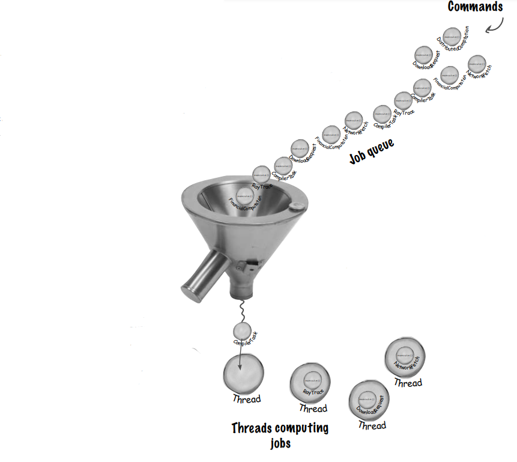

Command interface'ini implemente eden nesneler, Job queue'ya eklenir.

Bu, hesaplamanın sabit bir sayıdaki thread ile sınırlanması için etkili bir yol sağlar.

Thread'ler sırayla Command'leri queue'dan çıkarır ve onların execute() metodunu çağırır. Tamamlandığında, yeni bir
command object almak için geri dönerler.

Dikkat edilmesi gereken önemli bir nokta, job queue sınıflarının hesaplama yapan nesnelerden tamamen bağımsız
olduğudur. Bir dakika içinde bir thread finansal bir hesaplama yapabilirken, bir sonraki dakikada ağdan bir şeyler
alabilir. Job Queue nesneleri bu konuda kayıtsızdır; sadece command'leri alır ve execute() metodunu çağırır. Benzer
şekilde, Queue Deseni'ni implement eden nesneleri queue'ya koyduğunuz sürece, execute() metodunuz bir thread
kullanılabilir olduğunda çağrılacaktır.

# More uses of the Command Pattern: logging requests

Bazı uygulamaların semantic yapısı, tüm action'ları kaydetmemizi ve çökme durumunda bu eylemleri yeniden çağırarak
kurtarabilmemizi gerektirir. Command Pattern, bu semantikleri desteklemek için iki methodun eklenmesiyle (store()
ve load()) kullanılabilir. Java'da, bu methodları implemente etmek için object serialization kullanabiliriz, ancak
kalıcı verileri serialize etmek için normal uyarılar geçerlidir.

Bu nasıl çalışır? Command'leri execute ettiğinizde, bunların bir history'sini diske kaydederiz. Bir çökme meydana
geldiğinde, command object'lerini yeniden yükleriz ve bunların execute() methodlarını toplu ve sırayla çağırırız. Şimdi,
bu tür bir logging, bir uzaktan kumanda için mantıklı olmaz; ancak, büyük veri yapıları üzerinde action'ları çağıran
birçok uygulama vardır ki, her değişiklik yapıldığında hızlı bir şekilde kaydedilemezler. Logging kullanarak, son
kontrol noktasından bu yana yapılan tüm işlemleri kaydedebiliriz ve sistem arızası durumunda bu işlemleri kontrol
noktamıza uygulayabiliriz. Örneğin, bir elektronik tablo uygulamasını ele alalım: Her değişiklik meydana geldiğinde
elektronik tabloyu diske kopyalamak yerine elektronik tablo üzerindeki action'ları logging yaparak başarısızlık
kurtarmamızı uygulamak isteyebiliriz.

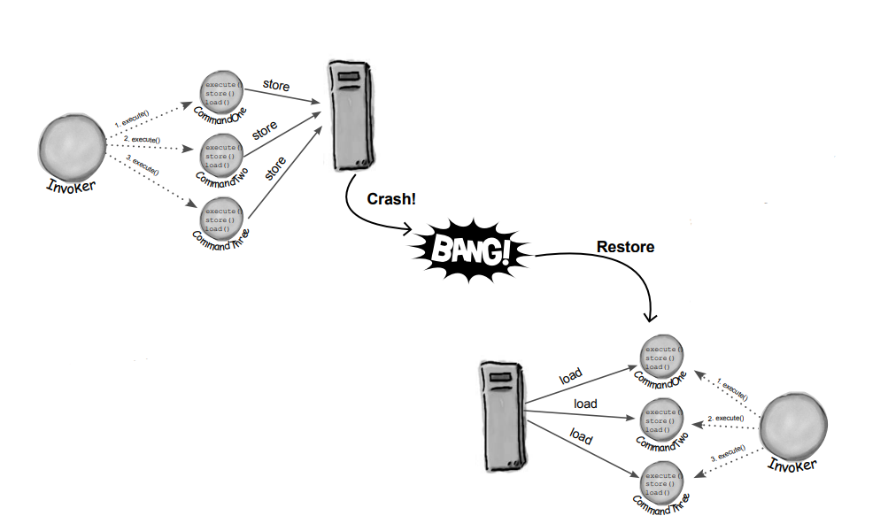

--**BULLET POINTS**--

* Command Pattern bir nesneyi ayrıştırır, bir request'i nasıl gerçekleştireceğini bilen bir nesneden yapar

* Bir Command object, decoupling'de merkezi bir rol oynar ve bir Receiver'i bir action (veya set of action) ile
  encapsule eder

* Bir Invoker, bir Command Object'e, onun execute() methodunu çağırarak request'de bulunur, bu da bu action'ları
  Receiver üzerinde çağırır.

* Invoker'lar Commandler ile parametrelendirilebilir, hatta çalışma zamanında dinamik olarak.

* Commands, execute() methodu en son çağrıldığında nesneyi önceki durumuna geri döndüren bir methodunu implemente ederek
  undo işlemini destekleyebilir.

* Macro Commands, birden fazla command'in çağrılmasına izin veren Command'in basit bir uzantısıdır. Benzer şekilde,
  Macro Command'ler kolayca undo işlemi desteği sağlayabilir.

* Pratikte, "smart" command nesnelerinin receiver'a işlemi delege etmesi yerine talebi kendilerinin uygulaması oldukça
  yaygındır.

* Command'ler ayrıca logging ve transactional system'lerin implementasyonu için de kullanılabilirler.