Desenlerin birlikte çalışabileceğini kim tahmin edebilirdi ki? En güçlü OO tasarımlarından bazıları birkaç kalıbı
birlikte kullanır.

## Birlikte Çalışma

Birçok probleme uygulanabilecek bir tasarımda birlikte çalışan bir dizi desen için özel bir adımız var: Compound pattern

Bu bölüme SimUDuck Duck simülatöründeki dost ördeklerimizi tekrar ziyaret ederek başlayacağız. Duck'lar, desenlerin aynı
çözümde nasıl birlikte çalışabileceğini anlamanıza yardımcı olacak. Ancak bazı kalıpları bir araya getirmiş olmamız,
Compound pattern olarak nitelendirilebilecek bir çözüme sahip olduğumuz anlamına gelmez. Bunun için, birçok soruna
uygulanabilecek genel amaçlı bir çözüm olması gerekir.

Bu yüzden, bölümün ikinci yarısında gerçek bir Compound kalıbı ziyaret edeceğiz: Model-View-Controller

Kalıplar genellikle birlikte kullanılır ve aynı tasarım çözümü içinde combine edilirler.

Compound bir desen, iki veya daha fazla deseni tekrar eden veya genel bir sorunu çözen bir çözümde birleştirir.

## Duck buluşması...

Duck simülatörümüzü sıfırdan yeniden inşa edeceğiz ve bir dizi desen kullanarak ona bazı ilginç yetenekler
kazandıracağız. Tamam, başlayalım...

1 - İlk olarak Quackable interface'ini create edeceğiz

```
public interface Quackable {
    void quack();
}
```

Dediğimiz gibi, sıfırdan başlıyoruz. Bu sefer, Duck'lar bir Quackable interface'ini implement edecekler.

Bu şekilde simülatörde hangi şeylerin quack() edebileceğini bileceğiz - Mallard Ducks, Redhead Ducks, Duck Calls,
gibi ve hatta Rubber Duck'ın bile geri döndüğünü görebiliriz

Quackables olanların tek bir şeyi iyi yapması gerekir: Quack

2 - Şimdi, Quackable implement eden bazı Duck'lar

```
public class MallardDuck implements Quackable{
    @Override
    public void quack() {
        System.out.println("Quack");
    }
}
```

```
public class RedHeadDuck implements Quackable{
    @Override
    public void quack() {
        System.out.println("Quack");
    }
}
```

DuckCalls (Duck seslerimiz - avcıların kullandığı şeyler, kesinlikle quackable) ve Rubber (lastik) Duck'larımız vardı.

```
public class DuckCall implements Quackable{
    @Override
    public void quack() {
        System.out.println("Kwak");
    }
}
```

```
public class RubberDuck implements Quackable{
    @Override
    public void quack() {
        System.out.println("Squeak");
    }
}
```

3 - Tamam, Duck'larımız aldık; şimdi tek ihtiyacımız olan bir simülatör.

```
public class DuckSimulator {
    public static void main(String[] args) {
        DuckSimulator simulator = new DuckSimulator();
        simulator.simulate();
    }

    private void simulate() {
        Quackable mallardDuck = new MallardDuck();
        Quackable redHeadDuck = new RedHeadDuck();
        Quackable duckCall = new DuckCall();
        Quackable rubberDuck = new RubberDuck();

        System.out.println("Duck Simulator\n");

        simulate(mallardDuck);
        simulate(redHeadDuck);
        simulate(duckCall);
        simulate(rubberDuck);
    }

    private void simulate(Quackable duck){
        /* Burada polymorphism'in sihrini göstermesine izin veriyoruz: ne tür bir Quackable aktarılırsa aktarılsın,
        simulate() methodu ondan quack'ı ister.*/
        duck.quack();
    }
}
```

Hepsi aynı Quackable interface'ini implement ediyor, ancak implementasyonları kendi yollarıyla quack'a izin verir.

4 - Duck'lar etrafta iken Geese (Kaz) çok uzakta olamaz

İşte simülatörün etrafında dolaşan bir Geese (Kaz) sınıfı.

```
public class Goose {
    public void honk(){
        /* Goose (kaz) gak'lar, vakvaklamaz */
        System.out.println("Honk");
    }
}
```

Diyelim ki Duck kullanmak istediğimiz her yerde Goose kullanabilmek istedik. Sonuçta, Goose'lar ses çıkarır; Goose uçar;
Goose yüzer. Neden simülatörde Goose kullanamıyoruz?

5 - Goose Adapter'a ihtiyacımız var

Simülatörümüz Quackable interface'ler görmeyi beklemektedir. Goose'lar quackers olmadığı için (onlar gaklarlar), bir
Goose'u Duck'a adapt etmek için bir adapter kullanabiliriz

```
/* Unutmayın, bir Adapter, bu durumda Quackable olan target interface'i implement eder */
public class GooseAdapter implements Quackable{
    Goose goose;

    /* Constructor, adapt edeceğimiz goose'u alır */
    public GooseAdapter(Goose goose){
        this.goose = goose;
    }

    /* Quack call edildiğinde, call goose'un honk() methoduna delege edilir */
    @Override
    public void quack() {
        goose.honk();
    }
}
```

6 - Artık Goose'lar da simülatörde oynayabilmeli

DuckSimulator class'ı içerisinde Goose'u kullanıyoruz;

```
private void simulate() {
    Quackable mallardDuck = new MallardDuck();
    Quackable redHeadDuck = new RedHeadDuck();
    Quackable duckCall = new DuckCall();
    Quackable rubberDuck = new RubberDuck();
    /* Goose'u GooseAdapter'a wrap ederek Duck gibi davranan bir Goose yapıyoruz */
    Quackable goose = new GooseAdapter(new Goose());

    System.out.println("Duck Simulator\n");

    simulate(mallardDuck);
    simulate(redHeadDuck);
    simulate(duckCall);
    simulate(rubberDuck);
    /* Goose wrap edildikten sonra diğer Duck Quackable'lar gibi muamele görebilir */
    simulate(goose);
}
```

7 - Şimdi bunu çalıştıralım

Bu kez simülatörü çalıştırdığımızda, simulate() methoduna aktarılan nesnelerin listesi bir Duck adapter'ına wrap edilmiş
bir Goose (Kaz) içeriyor. Sonuç ne mi olacak? Biraz Gaklama görmeliyiz!

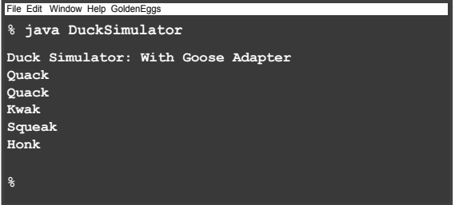

Duck sınıflarını değiştirmek zorunda kalmadan Duck quack'larını sayma özelliğini nasıl ekleyebiliriz? Yardımcı
olabilecek bir Pattern düşünebiliyor musunuz?

8 - Duck'lara bazı yeni özellikler veren bir decorator oluşturalım. Behavior'u (the behavior of counting (sayma
davranışı)) ile wrap ederek bir decorator nesnesi. Duck kodunu hiç değiştirmemiz gerekmeyecek.

```
/* QuackCounter bir decorator. Adapter'da olduğu gibi, target interface'i implement etmemiz gerekir. */
public class QuackCounter implements Quackable{

    /* Decorate etmekte olduğumuz quacker'ı tutmak için bir Duck instance variable'ımız var*/
    Quackable duck;

    /* Ve TÜM quack'ları sayıyoruz, bu yüzden takip etmek için static variable kullanacağız.*/
    static int numberOfQuacks;

    /* Constructor'da decorate ettiğimiz Quackable'ın referansını alırız.*/
    public QuackCounter(Quackable duck){
        this.duck = duck;
    }

    @Override
    public void quack() {
        /* quack() çağrıldığında, call'u decorate ettiğimiz Quackable'a delege ediyoruz... sonra da quack sayısını
        artırıyoruz.*/
        duck.quack();
        numberOfQuacks++;
    }

    /* Decorator'a bir method daha ekliyoruz. Bu static method sadece tüm Quackables'lar da  meydana gelen quack
    sayısını döndürür */
    public static int getNumberOfQuacks(){
        return numberOfQuacks;
    }
}
```

9 - Simülatörü güncellememiz gerekiyor

Şimdi, instantiate ettiğimiz her Quackable nesnesini bir QuackCounter decorator'ı ile wrap etmeliyiz.

```
public class DuckSimulator {
    public static void main(String[] args) {
        DuckSimulator simulator = new DuckSimulator();
        simulator.simulate();
    }

    private void simulate() {

        /* Her Quackable yarattığımızda, onu yeni bir decorator ile wrap ediyoruz */
        Quackable mallardDuck = new QuackCounter(new MallardDuck());
        Quackable redHeadDuck = new QuackCounter(new RedHeadDuck());
        Quackable duckCall = new QuackCounter(new DuckCall());
        Quackable rubberDuck = new QuackCounter(new RubberDuck());
        Quackable goose = new GooseAdapter(new Goose());

        System.out.println("Duck Simulator\n");

        simulate(mallardDuck);
        simulate(redHeadDuck);
        simulate(duckCall);
        simulate(rubberDuck);
        simulate(goose);

        System.out.println("The ducks quacked : " + QuackCounter.getNumberOfQuacks() + " times");
    }

    private void simulate(Quackable duck) {
        duck.quack();
    }
}
```

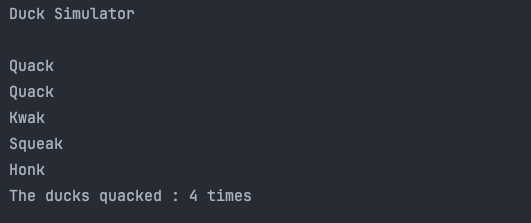

Decorate edilmiş behavior elde etmek için nesneleri decorate etmeniz gerekir. Nesneleri wrap etmek ile ilgili sorun da
bu: wrap edildiklerinden emin olmalısınız yoksa decorate edilmiş behavior'u alamazlar

Neden Duck creation'ı alıp tek bir yerde localize etmiyoruz; başka bir deyişle, Duck creation'ını alalım ve onu decorate
edip encapsulate edelim.

10 - Duck üretmek için bir factory'e ihtiyacımız var!

Tamam, Duck'larımızın wrap edildiğinden emin olmak için biraz kalite kontrole ihtiyacımız var. Sadece onları üretmek
için koca bir factory kuracağız.

Factory, farklı Duck türlerinden oluşan bir product family üretmelidir, bu nedenle Abstract Factory Kalıbını
kullanacağız.

AbstractFactory'nin tanımı ile başlayalım;

```
public abstract class AbstractDuckFactory {
    abstract Quackable createMallardDuck();
    abstract Quackable createRedHeadDuck();
    abstract Quackable createDuckCall();
    abstract Quackable createRubberDuck();
}
```

Sadece factory'e alışmak için decorator'lar olmadan Duck yaratan bir Factory oluşturarak başlayalım:

```
public class DuckFactory extends AbstractDuckFactory{
    /* Her method bir Product yaratır: belirli bir Quackable type'ı. Gerçek product simülatör tarafından bilinmez -
    sadece bir Quackableß elde ettiğini bilir */
    @Override
    Quackable createMallardDuck() {
        return new MallardDuck();
    }

    @Override
    Quackable createRedHeadDuck() {
        return new RedHeadDuck();
    }

    @Override
    Quackable createDuckCall() {
        return new DuckCall();
    }

    @Override
    Quackable createRubberDuck() {
        return new RubberDuck();
    }
}
```

Şimdi gerçekten istediğimiz factory'i, CountingDuckFactory'yi oluşturalım:

```
public class CountingFactory extends AbstractDuckFactory{

    /* Her method Quackable'ı quack count decorator'ı ile wrap eder. Simülatör aradaki farkı asla bilemez; sadece bir
    Quackable geri alır. Ancak artık bekçilerimiz tüm quack'ların sayıldığından emin olabilirler.*/
    @Override
    Quackable createMallardDuck() {
        return new QuackCounter(new MallardDuck());
    }

    @Override
    Quackable createRedHeadDuck() {
        return new QuackCounter(new RedHeadDuck());
    }

    @Override
    Quackable createDuckCall() {
        return new QuackCounter(new DuckCall());
    }

    @Override
    Quackable createRubberDuck() {
        return new QuackCounter(new RubberDuck());
    }
}
```

Goose (Kaz) içinde abstract bir factory kullanabiliriz;

```
public abstract class AbstractGooseFactory {
    abstract Quackable createGoose();
}
```

AbstractGooseFactory implementasyonu;

```
public class GooseFactory extends AbstractGooseFactory {
    @Override
    Quackable createGoose() {
        return new GooseAdapter(new Goose());
    }
}
```

11 - Simulator'ı Factory'leri kullanacak şekilde ayarlayalım

Abstract Factory'nin nasıl çalıştığını hatırlıyor musunuz? Bir factory alan ve onu nesne oluşturmak için kullanan
polymorphic bir method oluşturuyoruz. Farklı factory'ler geçirerek, methodda farklı product aileleri kullanabiliriz.

simulate() methodunu değiştireceğiz, böylece bir factory alacak ve Duck'lar oluşturmak için onu kullanacak

```
public class DuckSimulator {
    public static void main(String[] args) {
        DuckSimulator simulator = new DuckSimulator();

        /* İlk olarak simulate() methoduna aktaracağımız factory'i oluşturuyoruz */
        AbstractDuckFactory duckFactory = new CountingFactory();
        AbstractGooseFactory gooseFactory = new GooseFactory();
        simulator.simulate(duckFactory,gooseFactory);
    }

    /* simulate() methodu bir AbstractDuckFactory alır ve Duck'ları doğrudan instantiate etmek yerine oluşturmak için
    kullanır.*/
    private void simulate(AbstractDuckFactory duckFactory,AbstractGooseFactory gooseFactory) {
        Quackable mallardDuck = duckFactory.createMallardDuck();
        Quackable redHeadDuck = duckFactory.createRedHeadDuck();
        Quackable duckCall = duckFactory.createDuckCall();
        Quackable rubberDuck = duckFactory.createRubberDuck();
        Quackable goose = gooseFactory.createGoose();

        System.out.println("Duck simulator\n");

        simulate(mallardDuck);
        simulate(redHeadDuck);
        simulate(duckCall);
        simulate(rubberDuck);
        simulate(goose);

        System.out.println("The ducks quacked " + QuackCounter.getNumberOfQuacks() + " times");
    }

    private void simulate(Quackable duck) {
        duck.quack();
    }
}
```

Tüm bu farklı Duck'ları ayrı ayrı yönetmek biraz zorlaşıyor. Duck'ları bir bütün olarak yönetmemize yardımcı olmanın ve
hatta belki de takip etmek istediğimiz birkaç Duck "family'sini" yönetmemize izin vermenin bir yolu var mı?

Neden Duck'ları ayrı ayrı yönetiyoruz?

```
Quackable mallardDuck = duckFactory.createMallardDuck();
Quackable redHeadDuck = duckFactory.createRedHeadDuck();
Quackable duckCall = duckFactory.createDuckCall();
Quackable rubberDuck = duckFactory.createRubberDuck();
Quackable goose = gooseFactory.createGoose();

System.out.println("Duck simulator\n");

simulate(mallardDuck);
simulate(redHeadDuck);
simulate(duckCall);
simulate(rubberDuck);
simulate(goose);
```

Yukarıda ki kodu inceleyelim; Bu pek yönetilebilir bir şey değil!

İhtiyacımız olan şey, Duck Collection'ları ve hatta Duck'ların sub-collection'ları hakkında konuşmanın bir yoludur.
Ayrıca tüm Duck kümesi üzerinde operation uygulayabilmemiz de güzel olurdu. Hangi pattern bize yardımcı olabilir?

12 - Bir Duck Flock (Sürüsü) oluşturalım;

Bir nesne collection'ını tek tek nesnelerle aynı şekilde ele almamızı sağlayan Composite Pattern'i hatırlıyor musunuz?
Bir Quackables Flock (sürüsünden) daha iyi bir composite olabilir mi!

Bunun nasıl işleyeceğini adım adım anlatalım:

```
/* Unutmayın, composite'in leaf elemanlarla aynı interface'i implement etmesi gerekir. Leaf elemanlarımız
Quackable'lardır.*/
public class Flock implements Quackable {

    /* Her Flock'un içinde Flock'a ait Quackable'ları tutmak için bir ArrayList kullanıyoruz */
    ArrayList<Quackable> quackers = new ArrayList<>();

    /* add() methodu Flock'a (Sürüye) bir Quackable ekler.*/
    public void add(Quackable quacker) {
        quackers.add(quacker);
    }

    @Override
    public void quack() {
        /* Flock'da bir Quackable'dır. quack() methodunun tüm flock üzerinde çalışması gerekir. Burada ArrayList'i
        iterate ederek her bir oge uzerinde quack() methodunu çağırıyoruz*/
        for (Quackable duck : quackers) {
            duck.quack();
        }
    }
}
```

13 - Şimdi simulator'i değiştirmemiz gerekiyor

Composite'imiz hazır; sadece Duck'ları composite structure'a eklemek için biraz koda ihtiyacımız var.

```
public class DuckSimulator {
    public static void main(String[] args) {
        DuckSimulator simulator = new DuckSimulator();

        AbstractDuckFactory duckFactory = new CountingFactory();
        AbstractGooseFactory gooseFactory = new GooseFactory();
        simulator.simulate(duckFactory,gooseFactory);
    }

    private void simulate(AbstractDuckFactory duckFactory,AbstractGooseFactory gooseFactory) {
        /* Daha önce olduğu gibi tüm Quackable'ları oluşturun */
        Quackable redHeadDuck = duckFactory.createRedHeadDuck();
        Quackable duckCall = duckFactory.createDuckCall();
        Quackable rubberDuck = duckFactory.createRubberDuck();
        Quackable goose = gooseFactory.createGoose();

        /* Önce bir Flock yaratıyoruz ve onu Quackables ile dolduruyoruz */
        Flock flockOfDucks = new Flock();
        flockOfDucks.add(redHeadDuck);
        flockOfDucks.add(duckCall);
        flockOfDucks.add(rubberDuck);
        flockOfDucks.add(goose);

        /* Sonra yeni bir Mallards flock'u (sürüsü) oluşturacağız */
        Flock flockOfMallardDucks = new Flock();
        /* Burada küçük bir MallardDuck family'si yaratıyoruz...*/
        Quackable mallardDuckOne = duckFactory.createMallardDuck();
        Quackable mallardDuckTwo = duckFactory.createMallardDuck();
        Quackable mallardDuckThree = duckFactory.createMallardDuck();
        Quackable mallardDuckFour = duckFactory.createMallardDuck();

        /* ...ve onları mallard duck flock'una ekliyoruz */
        flockOfMallardDucks.add(mallardDuckOne);
        flockOfMallardDucks.add(mallardDuckTwo);
        flockOfMallardDucks.add(mallardDuckThree);
        flockOfMallardDucks.add(mallardDuckFour);

        /* Daha sonra main flock'a MallardDuck flock'unu ekleriz.*/
        flockOfDucks.add(flockOfMallardDucks);

        System.out.println("Duck simulator: Whole Flock Simulation\n");

        simulate(flockOfDucks);

        System.out.println("Mallard duck simulator : Mallard Duck Flock");

        simulate(flockOfMallardDucks);

        System.out.println("\nThe ducks quaked " + QuackCounter.getNumberOfQuacks() + " times");

    }

    private void simulate(Quackable duck) {
        duck.quack();
    }
}
```

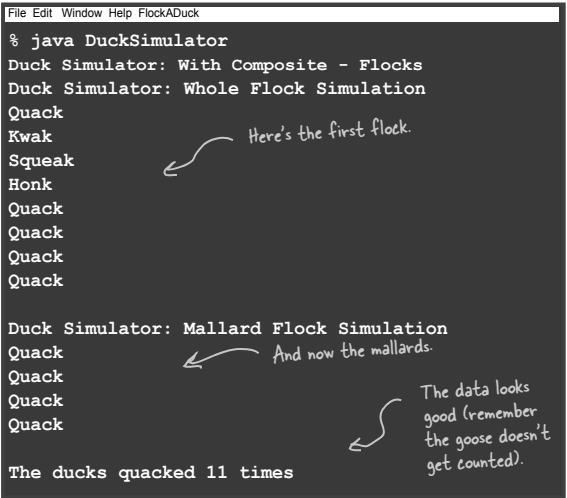

Composite Desen bölümünde composites'lerin (Menuler) ve leaf node'ların (MenuItems) add() methodu de dahil olmak üzere
tam olarak aynı method setine sahip olduğunu hatırlayabilirsiniz. Aynı method kümesine sahip oldukları için,
MenuItem'larda gerçekten mantıklı olmayan methodlar çağırabiliyorduk (add() methodunu çağırarak bir MenuItem'a bir şey
eklemeye çalışmak gibi). Bunun faydası, leaf'ler ve composite'ler arasındaki ayrımın şeffaf olmasıydı: client'in bir
leaf ile mi yoksa composite ile mi uğraştığını bilmesi gerekmiyordu; sadece her ikisinde de aynı methodları çağırıyordu.
Burada, composite'in child maintance methodlarını leaf node'lardan ayrı tutmaya karar verdik: yani, yalnızca Flock'lar
add() methoduna sahiptir. Duck'a bir şey eklemeye çalışmanın mantıklı olmadığını biliyoruz ve bu implementasyonda
bunu yapamazsınız. Sadece bir Flock'a add() yapabilirsiniz. Yani bu tasarım daha güvenlidir - component'ler üzerinde
mantıklı olmayan methodları çağıramazsınız - ancak daha az şeffaftır. Artık client'in Quackables olanları ekleyebilmesi
için Quackables'in bir Flock(Sürü) olduğunu bilmesi gerekiyor. Her zaman olduğu gibi, OO tasarımı yaparken
trade-off'lar (bazı ödünler) vardır ve kendi composite'lerinizi oluştururken bunları göz önünde bulundurmanız gerekir.

Composite harika çalışıyor! Şimdi de tam tersi bir isteğimiz var: Duck'ları tek tek takip etmemiz gerekiyor. Bize
real time olarak tek tek Duck quack'larını takip etmenin bir yolunu verebilir misiniz?

"Observer" diyebilir misiniz?

Quackologist bireysel Duck behavior'larını observe etmek istiyor gibi görünüyor. Bu da bizi doğrudan nesnelerin
behavior'larını observe etmek için yapılmış bir kalıba götürüyor: Observer Pattern.

14 - Ilk olarak Observer Interface'ini ihtiyacımız var

Bir Observable'ın observed nesne olduğunu unutmayın. Bir Observable, observer'ları register etmek ve notification için
methodlara ihtiyaç duyar. Observer'ları remove etmek için de bir methodumuz olabilir, ancak burada implementasyonu
basit tutacağız ve bunu dışarıda bırakacağız.

```
public interface Observer {
    /* QuackObservable henüz create edilmedi */
    void update(QuackObservable duck);
}
```

QuackObservable, Quackable'ların observed edilmeyi istemeleri halinde implemente etmeleri gereken interface'dir.
Observer'ları register için bir methodu var. Observer interface'ini implement eden herhangi bir nesne, quack'ları
dinleyebilir. Ayrıca observer'ları notify etmek için bir methodu var.

```
public interface QuackObservable {
    void registerObserver(Observer observer);
    void notifyObserver();
}
```

Şimdi tüm Quackable'ların bu interface'i implement ettiğinden emin olmamız gerekiyor... Quackable interface'ini
QuackObservable'dan extend ediyoruz

```
public interface Quackable extends QuackObservable{
    void quack();
}
```

15 - Şimdi, Quackable'ı implement eden tüm concrete sınıfların bir QuackObservable olmayı handle edebildiğinden emin
olmamız gerekiyor. Buna her bir sınıfta register ve notify'i implement ederek yaklaşabiliriz. Ancak bu sefer biraz
farklı yapacağız: register ve notify kodunu başka bir sınıfta encapsulate edeceğiz, ona Observable diyeceğiz ve bir
QuackObservable ile oluşturacağız.

Bu şekilde, gerçek kodu yalnızca bir kez yazarız ve QuackObservable, helper sınıf Observable'a delege etmek için yeterli
koda ihtiyaç duyar.

Observable, bir Quackable'ın observable olması için gereken tüm functionality'i implement eder. Bunu bir sınıfa
eklememiz ve o sınıfın Observable'a delege olmasını sağlamamız yeterlidir.

```
/* Observable, QuackObservable'i implemente etmelidir çünkü bunlar kendisine delege edilecek aynı method çağrılarıdır */
public class Observable implements QuackObservable {

    ArrayList<Observer> observers = new ArrayList<>();
    QuackObservable duck;

    /* Constructor'da, observable behavior'unu yönetmek için bu nesneyi kullanan QuackObservable'ı geçiririz. Aşağıdaki
    notify() methoduna göz atın; bir notify gerçekleştiğinde Observable'ın bu nesneyi ilettiğini göreceksiniz,
    böylece observer hangi nesnenin quack yaptığını bilir.*/
    public Observable(QuackObservable duck) {
        this.duck = duck;
    }

    /* Observer'ları register ettiğimiz method */
    @Override
    public void registerObserver(Observer observer) {
        observers.add(observer);
    }

    /* Notification'lar için kullanılacak method */
    @Override
    public void notifyObserver() {
        observers.forEach(observer -> {
            observer.update(duck);
        });
    }
}
```

16 - Helper Observable'ı Quackable sınıfları ile entegre edin

Tek yapmamız gereken, Quackable sınıflarının bir Observable ile oluşturulduğundan ve ona nasıl delegate atanacağını
bildiklerinden emin olmak. Bundan sonra, Observables olmaya hazırdırlar.

İşte MallardDuck'ın implementasyonu;

```
public class MallardDuck implements Quackable{

    /* Her Quackable'ın bir Observable instance variable'i vardır */
    Observable observable;

    /* constructor'da, bir Observable oluşturuyoruz ve ona MallardDuck nesnesine bir referans aktarıyoruz*/
    public MallardDuck(){
        observable = new Observable(this);
    }

    /* Quack çalıştığında, observer'ların bunu bilmesine izin vermeliyiz */
    @Override
    public void quack() {
        System.out.println("Quack");
        notifyObserver();
    }

    /* İşte iki QuackObservable methodumuz. Sadece helper'a delege ettiğimize dikkat edin */
    @Override
    public void registerObserver(Observer observer) {
        observable.registerObserver(observer);
    }

    @Override
    public void notifyObserver() {
        observable.notifyObserver();
    }
}
```

DuckCall Implementasyonu;

```
public class DuckCall implements Quackable{

    Observable observable;

    public DuckCall() {
       observable = new Observable(this);
    }

    @Override
    public void quack() {
        System.out.println("Kwak");
        notifyObserver();
    }

    @Override
    public void registerObserver(Observer observer) {
        observable.registerObserver(observer);
    }

    @Override
    public void notifyObserver() {
        observable.notifyObserver();
    }
}
```

RedHeadDuck Implementasyonu;

```
public class RedHeadDuck implements Quackable{

    Observable observable;

    public RedHeadDuck() {
        observable = new Observable(this);
    }

    @Override
    public void quack() {
        System.out.println("Quack");
        notifyObserver();
    }

    @Override
    public void registerObserver(Observer observer) {
        observable.registerObserver(observer);
    }

    @Override
    public void notifyObserver() {
        observable.notifyObserver();
    }
}
```

GooseAdapter Implementasyonu;

```
public class GooseAdapter implements Quackable {

    Goose goose;
    Observable observable;

    public GooseAdapter(Goose goose) {
        this.goose = goose;
        observable = new Observable(this);
    }

    @Override
    public void quack() {
        goose.honk();
        notifyObserver();
    }

    @Override
    public void registerObserver(Observer observer) {
        observable.registerObserver(observer);
    }

    @Override
    public void notifyObserver() {
        observable.notifyObserver();
    }
}
```

RubberDuck Implementasyonu;

```
public class RubberDuck implements Quackable{

    Observable observable;

    public RubberDuck() {
        observable = new Observable(this);
    }

    @Override
    public void quack() {
        System.out.println("Squeak");
        notifyObserver();
    }

    @Override
    public void registerObserver(Observer observer) {
        observable.registerObserver(observer);
    }

    @Override
    public void notifyObserver() {
        observable.notifyObserver();;
    }
}
```

Bir Quackable'ın, QuackCounter decorator'ının implementasyonunu değiştirmedik. Onu da bir Observable yapmamız gerekiyor

```
public class QuackCounter implements Quackable{

    Quackable duck;
    static int numberOfQuacks;

    public QuackCounter(Quackable duck){
        this.duck = duck;
    }

    @Override
    public void quack() {
        duck.quack();
        numberOfQuacks++;
    }

    public static int getNumberOfQuacks(){
        return numberOfQuacks;
    }

    @Override
    public void registerObserver(Observer observer) {
        duck.registerObserver(observer);
    }

    @Override
    public void notifyObserver() {
        duck.notifyObserver();
    }
}
```

17 - Sadece pattern'in Observer tarafı üzerinde çalışmamız gerekiyor.

Observable'lar için ihtiyacımız olan her şeyi implement ettik; şimdi bazı Observer'lara ihtiyacımız var. Observer
interface'inin sadece bir methodu vardır: update(), bu methoda quacking yapan QuackObservable aktarılır.

Şimdi bir observer'a ihtiyacımız var: nerede bu Quackologist

```
public class Quackologist implements Observer{
    @Override
    public void update(QuackObservable duck) {
        System.out.println("Quackologist: " + duck + " just quacked");
    }
}
```

Ya bir Quackologist bütün bir Flock'u observe etmek isterse? Bu ne anlama geliyor ki? Şöyle düşünün: eğer bir
composite'i observe ediyorsak, composite'de ki her şeyi observe ediyoruz demektir. Bu nedenle, bir Flock'a
register olduğunuz da , flock composite'i, diğer flock'ları da içerebilecek tüm child'larına register olmamızı sağlar.
Devam edin ve daha ileri gitmeden önce Flock observer kodunu yazın...

```
public class Flock implements Quackable {

    ArrayList<Quackable> quackers = new ArrayList<>();

    public void add(Quackable quacker) {
        quackers.add(quacker);
    }

    @Override
    public void quack() {
        for (Quackable duck : quackers) {
            duck.quack();
        }
    }

    @Override
    public void registerObserver(Observer observer) {
        for (Quackable duck : quackers) {
            duck.registerObserver(observer);
        }
    }

    @Override
    public void notifyObserver() {
    }
}
```

18 - Observe yapmaya hazırız. Simulator'ı güncelleyelim ve deneyelim:

```
public class DuckSimulator {
    public static void main(String[] args) {
        DuckSimulator simulator = new DuckSimulator();

        AbstractDuckFactory duckFactory = new CountingFactory();
        simulator.simulate(duckFactory);
    }

    private void simulate(AbstractDuckFactory duckFactory) {
        Quackable mallardDuck = duckFactory.createMallardDuck();
        Quackable redHeadDuck = duckFactory.createRedHeadDuck();
        Quackable duckCall = duckFactory.createDuckCall();
        Quackable rubberDuck = duckFactory.createRubberDuck();

        Flock flockOfDucks = new Flock();
        flockOfDucks.add(mallardDuck);
        flockOfDucks.add(redHeadDuck);
        flockOfDucks.add(duckCall);
        flockOfDucks.add(rubberDuck);

        System.out.println("Duck simulator: With Observer");

        /* Burada yaptığımız tek şey bir Quackologist yaratmak ve onu Flock'un observer'i olarak belirlemek */
        Quackologist quackologist = new Quackologist();
        flockOfDucks.registerObserver(quackologist);

        simulate(flockOfDucks);

        System.out.println("\nThe ducks quacked " + QuackCounter.getNumberOfQuacks() + " times");

    }

    private void simulate(Quackable duck) {
        duck.quack();
    }
}
```

--**DIALOGS**--

Q : Bu bir compound (birleşik) pattern'miydi

A : Hayır, bu sadece birlikte çalışan bir dizi kalıptı. Compound pattern, genel bir sorunu çözmek için bir araya
getirilen birkaç pattern'den oluşan bir kümedir. Birazdan Model-View-Controller compound modeline bir göz atacağız; bu,
birçok tasarım çözümünde tekrar tekrar kullanılan birkaç modelden oluşan bir koleksiyondur.

Q : Yani Tasarım Kalıplarının asıl güzelliği, bir sorunu alıp bir çözüm bulana kadar kalıpları uygulamaya
başlayabilmemdir. Değil mi?

A : Yanlış. Duck'lar ile bu alıştırmayı yaparak kalıpların birlikte nasıl çalışabileceğini gösterdik. Bir tasarıma asla
bizim yaptığımız gibi yaklaşmak istemezsiniz. Aslında, Duck simülatörünün bazı bölümleri için bu kalıplardan
bazılarının aşırıya kaçtığı çözümler olabilir. Bazen sadece iyi OO tasarım ilkelerini kullanmak bir sorunu kendi başına
yeterince iyi çözebilir. Bir sonraki bölümde bu konu hakkında daha fazla konuşacağız, ancak kalıpları yalnızca mantıklı
oldukları zaman ve yerde uygulamak istersiniz. Hiçbir zaman sırf olsun diye desen kullanma niyetiyle yola çıkmak
istemezsiniz. DuckSimulator'ün tasarımının zorlama ve yapay olduğunu düşünmelisiniz.Ama eğlenceliydi ve bize birkaç
desenin bir çözüme nasıl uyabileceği konusunda iyi bir fikir verdi.

## Ne yaptık?

* Bir grup Quackables ile başladık

* Bir Goose geldi ve o da bir Quackables gibi davranmak istedi. Bu yüzden Goose'u bir Quackable'a adapt etmek için
  Adapter Pattern'i kullandık. Artık adapter'a wrap edilmiş bir Goose üzerinde quack() fonksiyonunu çağırabilirsiniz ve
  goose honk() yapar!

* Sonra, Quackologist'ler quack'ları saymak istediklerine karar verdiler. Biz de Decorator Pattern'i kullanarak quack()
  fonksiyonunun kaç kez çağrıldığını takip eden ve ardından quack'ı wrap ettiği Quackable'a delege eden bir QuackCounter
  decorator'ı ekledik.

* Ancak Quackologist'ler QuackCounter decorator'ını eklemeyi unutacaklarından endişe ediyorlardı. Bu yüzden onlar için
  Duck yaratmak üzere Abstract Factory Kalıbını kullandık. Şimdi, ne zaman bir Duck isteseler, factory'den bir tane
  istiyorlar ve factory de onlara decorate edilmiş bir Duck veriyor. (Ve unutmayın, decorate edilmiş bir Duck
  istiyorlarsa başka bir Duck Factory'si de kullanabilirler!)

* Tüm bu Duck'ları, Goose'ları ve quackables'ları takip etmekte yönetim sorunları yaşıyorduk. Bu yüzden quackables'ları
  Flock(Sürü) halinde gruplamak için Composite Pattern'i kullandık. Bu kalıp aynı zamanda Quackologist'in Duck family'
  sini yönetmek için sub flock'lar oluşturmasına da olanak tanır. ArrayList'te java.util'in iterator'ını kullanarak
  uygulamamızda Iterator Pattern'i kullandık.

* Quackologist'ler ayrıca herhangi bir quackables quack()'ladığında haberdar olmak istiyorlardı. Bu yüzden
  Quackologist'lerin Quackable Observer olarak register olmalarını sağlamak için Observer Pattern'i kullandık. Şimdi
  herhangi bir Quackable quack'ladığında bilgilendiriliyorlar. Bu implementasyonda yine iterator kullandık.
  Quackologist'ler Observer Kalıbını compositeler ile bile kullanabilirler.

## Compound Pattern'in Kralı MVC

MVC, beyninizin patlamaması için kodunuzu functional bölümlere ayırmaya yönelik bir paradigmadır. Reusability'i sağlamak
için bu sınırları temiz tutmalısınız

Model bir tarafta, View diğer tarafta, Controller ise arada.

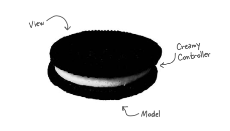

Model nesneleri uygulamanızın varlık nedenini temsil eder

Data, logic ve benzerlerini içeren özel nesneler

Custom sınıflar oluşturursunuz, uygulamanızın domain alanında bunları tüm views'ler (görünümlerle) ile yeniden
kullanmayı seçebilirsiniz, ancak model nesneleri aynı kalır.

Design Pattern'ler MVC için anahtarınızdır. MVC'yi öğrenmenin sırrı şu: MVC sadece birkaç kalıbın bir araya
getirilmesinden ibaret. MVC'yi öğrenmeye kalıplara bakarak yaklaştığınızda, birdenbire her şey mantıklı gelmeye başlar.

## Model-View-Controller ile tanışma

iTunes gibi favori MP3 çalarınızı kullandığınızı düşünün. Yeni şarkılar eklemek, çalma listelerini yönetmek ve parçaları
yeniden adlandırmak için arayüzünü kullanabilirsiniz. Oynatıcı, tüm şarkılarınızın ilgili adları ve verileriyle birlikte
küçük bir veritabanını tutmaya özen gösterir. Aynı zamanda şarkıları çalmakla da ilgilenir ve bunu yaparken kullanıcı
arayüzü mevcut şarkı başlığı, çalışma süresi vb. ile sürekli olarak güncellenir. Her şeyin altında Model-View-Controller
oturuyor...

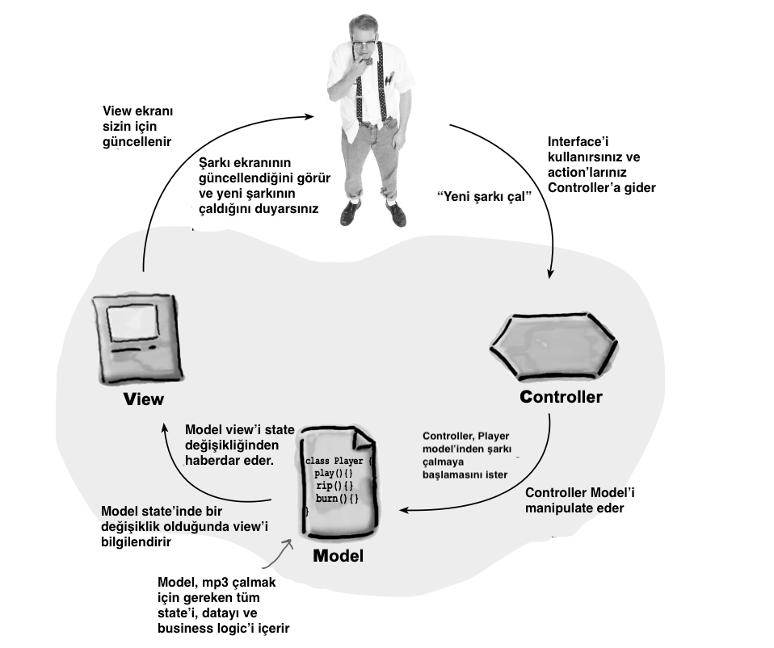

### Daha yakından bakalım...

MP3 Çalar açıklaması bize MVC'nin üst düzey bir görünümünü verir, ancak compound modelin nasıl çalıştığını, kendiniz
nasıl bir tane oluşturacağınızı veya neden bu kadar iyi bir şey olduğunu anlamanıza gerçekten yardımcı olmaz. Model,
View ve Controller arasındaki ilişkileri adım adım inceleyerek başlayalım ve ardından Tasarım Kalıpları
perspektifinden ikinci bir bakış atalım.

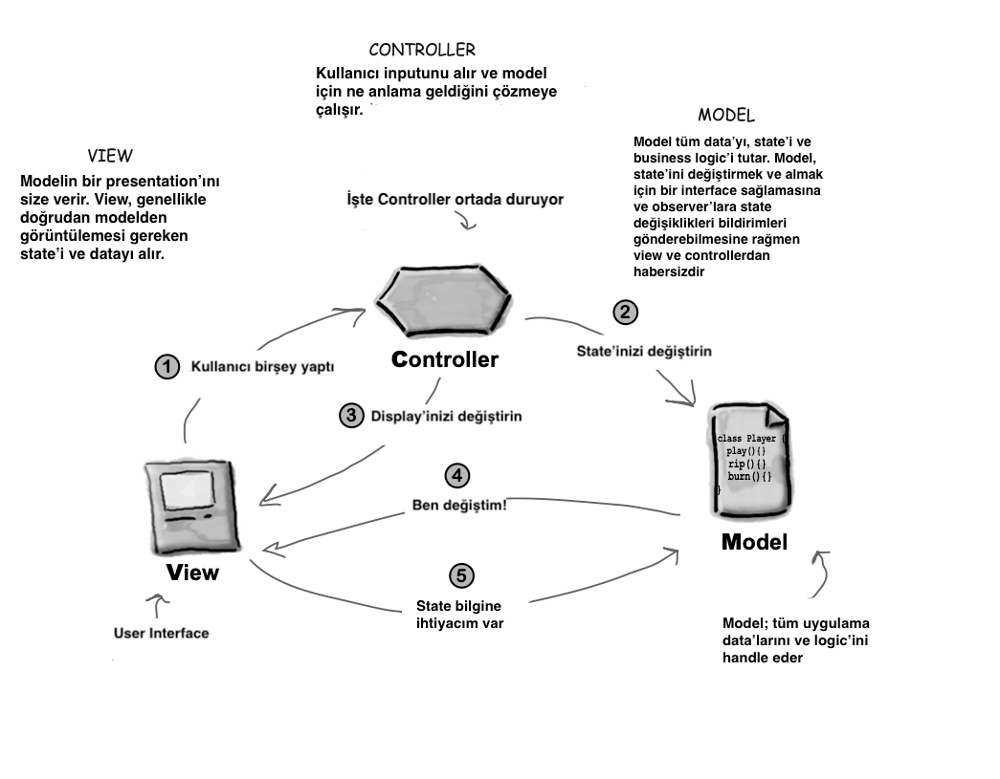

1 - User sizsiniz - View ile etkileşime geçersiniz. View sizin modele açılan pencerenizdir. View'de bir şey
yaptığınızda (Oynat düğmesine tıklamak gibi), View Controller'a ne yaptığınızı söyler. Bunu handle etmek controller'ın
işidir.

2 - Controller modelden state'ini değiştirmesini ister. Controller action'larınızı alır ve yorumlar. Bir düğmeye
tıklarsanız, bunun ne anlama geldiğini ve modelin bu action'a göre nasıl manipulate edilmesi gerektiğini bulmak
controller'in işidir.

3 - Controller ayrıca View'in değişmesini de isteyebilir. Controller View'den bir action aldığında, sonuç olarak View'e
değişmesini söylemesi gerekebilir. Örneğin, Controller arayüzdeki belirli düğmeleri veya menü öğelerini
etkinleştirebilir veya devre dışı bırakabilir.

4 - Model, state'i değiştiğinde View'i bilgilendirir. Modelde, yaptığınız bir action'a (bir düğmeye tıklamak gibi) veya
başka bir dahili değişikliğe (çalma listesindeki bir sonraki şarkının başlaması gibi) bağlı olarak bir şey değiştiğinde,
Model View'i state'inin değiştiği konusunda bilgilendirir.

5 - View, Modelden State ister. View, görüntülediği state'i doğrudan modelden alır. Örneğin, Model View'e yeni bir
şarkının çalmaya başladığını bildirdiğinde, View Model'den şarkının adını ister ve görüntüler. View, controller'in View'
de bazı değişiklikler talep etmesi sonucunda da modelden state isteyebilir.

--**DIALOGS**--

Q : Controller hiç modelin bir observer'i haline gelir mi?

A : Elbette. Bazı tasarımlarda controller modele register olur ve değişikliklerden haberdar edilir. Modeldeki bir şey
user interface kontrollerini doğrudan etkilediğinde bu durum söz konusu olabilir. Örneğin, modeldeki belirli state'ler
bazı interface öğelerinin etkinleştirilmesini veya devre dışı bırakılmasını gerektirebilir. Eğer öyleyse, View'den
ekranını buna göre güncellemesini istemek gerçekten controller'in işidir.

Q : Controller'in tek yaptığı View'den user input'u alıp modele göndermektir, doğru mu? Tek yaptığı buysa neden var ki?
Neden kod sadece View'in kendisinde olmasın? Çoğu durumda controller sadece model üzerindeki bir methodu çağırmıyor mu?

A : Controller sadece “modele göndermekten” daha fazlasını yapar, controller inputu yorumlamaktan ve bu inputa dayalı
olarak modeli manipulate etmekten sorumludur. Ancak asıl sorunuz muhtemelen “bunu neden View kodunda yapamıyorum?”
olacaktır. Yapabilirsiniz; ancak iki nedenden dolayı bunu yapmak istemezsiniz: Birincisi, View kodunuzu
karmaşıklaştırırsınız çünkü artık iki sorumluluğu vardır: User Interface'i yönetmek ve modelin nasıl kontrol
edileceğine ilişkin logic'le uğraşmak. İkinci olarak, View'inizi modele sıkı bir şekilde bağlıyorsunuz (tightly
coupling). View'i başka bir Model ile yeniden kullanmak istiyorsanız, bunu unutun. Controller, kontrol logic'ini
View'den ayırır ve View'i Modelden ayırır. View'i ve controller'i loosely coupled (gevşek bir şekilde) bağlı tutarak,
daha esnek ve genişletilebilir bir tasarım oluşturursunuz, bu tasarım ileride değişikliklere daha kolay uyum
sağlayabilir.

### MVC'ye kalıplarla renklendirilmiş gözlüklerle bakmak

Model ile başlayalım. Tahmin edebileceğiniz gibi model, View'leri ve Controller'ları en son state değişikliklerinde
güncel tutmak için Observer kullanır. Öte yandan, View ve Controller Strategy Pattern'i implement eder.

Controller, View'in behavior'undan oluşur ve farklı bir behavior istiyorsanız başka bir controller ile kolayca
değiştirilebilir. View'in kendisi de pencereleri, düğmeleri ve ekranın diğer componentlerini yönetmek için dahili olarak
bir desen kullanır: Composite Pattern

* Strategy : View ve Controller, klasik Strateji Desenini implement ederler: View, bir strateji ile configure edilmiş
  bir nesnedir. Controller, stratejiyi sağlar. View yalnızca uygulamanın görsel yönleriyle ilgilenir ve interface
  behavior'u hakkındaki kararlar için controller'a delege eder. Strategy Desenini kullanmak, View'i Model'dan ayrık
  tutar, çünkü kullanıcı isteklerini yerine getirmek için Model ile etkileşimde bulunmaktan Controller sorumludur.
  View, bunun nasıl yapıldığını bilmez.

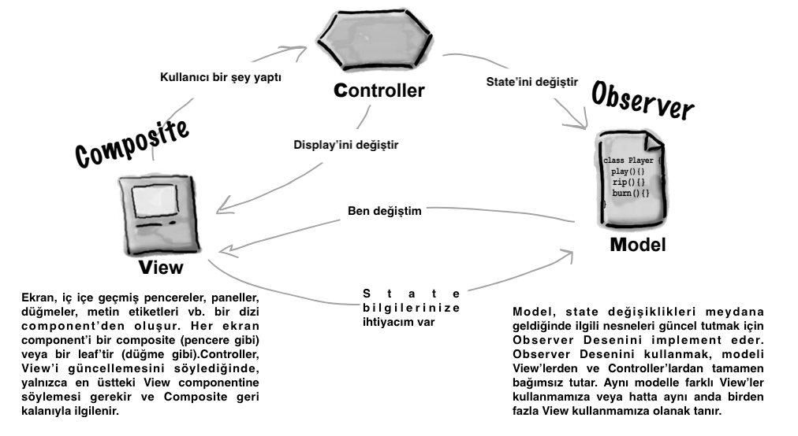

* Observer

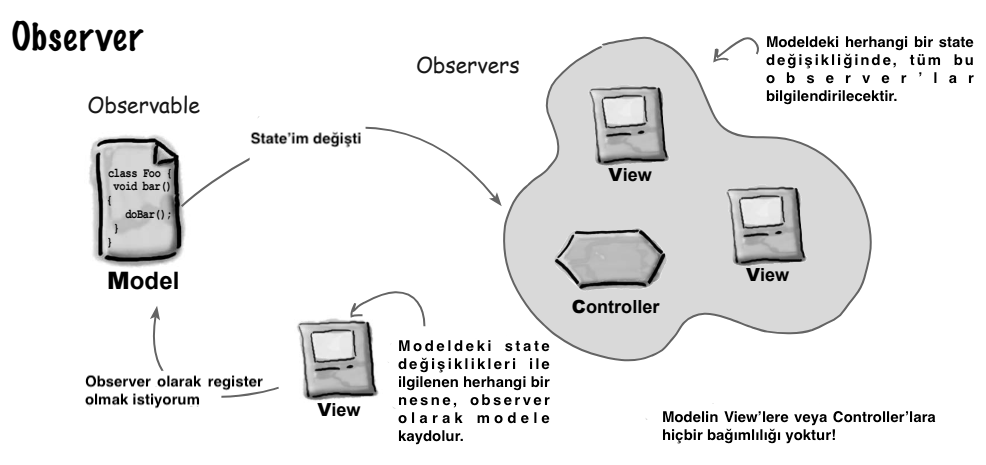

* Strategy

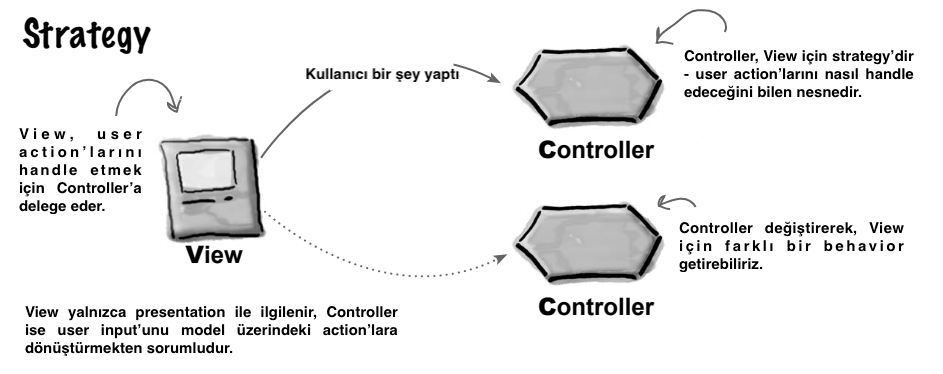

* Composite

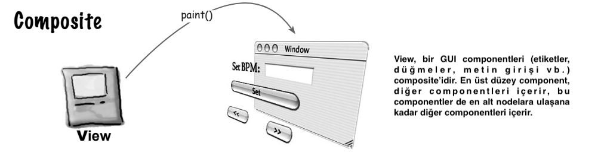

### Ritmi kontrol etmek için MVC kullanmak...

DJ olma zamanınız geldi. DJ olduğunuzda her şey ritimle ilgilidir. Miksinize dakikada 95 vuruşluk (BPM) yavaşlatılmış,
downtempo bir groove ile başlayabilir ve ardından kalabalığı 140 BPM'lik çılgın bir trance techno'ya getirebilirsiniz.
Setinizi 80 BPM'lik yumuşak bir ambient miks ile bitireceksiniz. Bunu nasıl yapacaksınız? Ritmi kontrol etmek
zorundasınız ve sizi oraya götürecek aracı inşa edeceksiniz.

* Java DJ View ile tanışın

Tool View, sürükleyici bir davul ritmi oluşturmanıza ve dakikadaki vuruş sayısını (BPM) ayarlamanıza olanak sağlar...

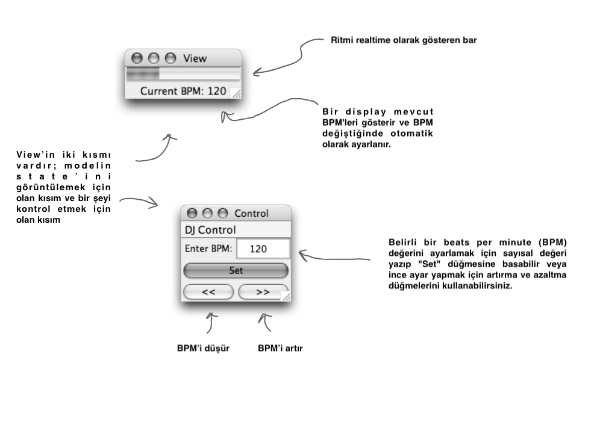

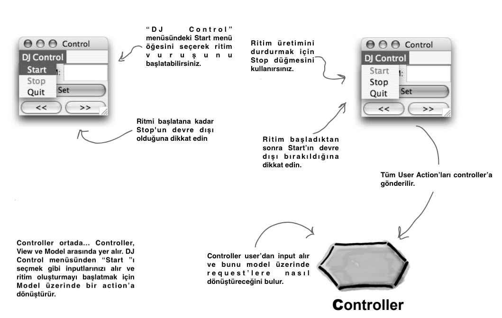

* Tüm bunların altındaki Modeli de unutmayalım...

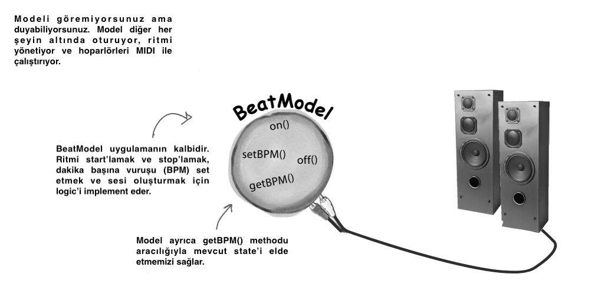

* Parçaları bir araya getirme

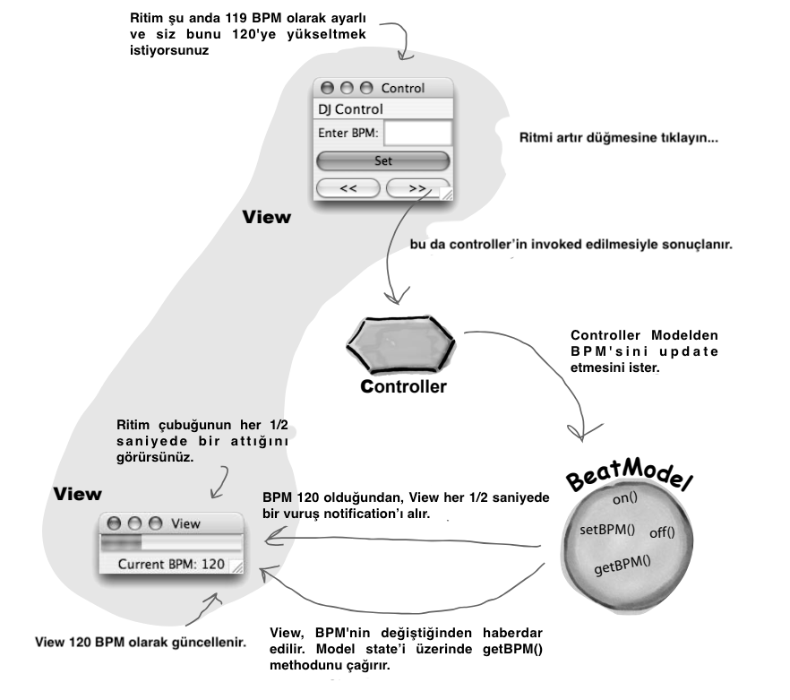

## Parçaları oluşturmak

Tamam, modelin tüm data'ları, state'i ve application logic'i korumaktan sorumlu olduğunu biliyorsunuz. Peki BeatModel'in
içinde ne var? Ana görevi ritmi yönetmektir, bu nedenle dakika başına mevcut vuruşları koruyan bir state'i ve duyduğumuz
ritmi oluşturmak için MIDI event'leri üreten çok sayıda kodu vardır. Ayrıca controller'in ritmi manipüle etmesini ve
View ile Controller'in Model'in state'ini elde etmesini sağlayan bir interface sunar. Ayrıca, Model'in Observer Kalıbı
kullandığını unutmayın, bu nedenle nesnelerin observer olarak register olmasına ve bildirim göndermesine izin vermek
için bazı methodlara da ihtiyacımız var.

### Implementasyona bakmadan önce BeatModelInterface'e göz atalım

BeatModelInterface iki adet Observer Interface'ini kullanacak;

BeatObserver;

```
public interface BeatObserver {
    void updateBeat();
}
```

BPMObserver;

```
public interface BPMObserver {
    void updateBPM();
}
```

BeatModelInterface;

```
public interface BeatModelInterface {

    /* initialize(), on(), off(), setBPM() bunlar, controller'in user etkileşimine dayalı olarak modeli yönlendirmek
    için kullanacağı methodlardır */

    /* Bu, BeatModel instantiate edildikten sonra çağrılır.*/
    void initialize();

    /* Bu method beat generator (ritim oluşturucuyu) açar */
    void on();

    /* Bu method beat generator (ritim oluşturucuyu) kapatır */
    void off();

    /* Bu method dakika başına vuruş sayısını ayarlar. Çağrıldıktan sonra, vuruş frekansı hemen değişir */
    void setBPM(int bpm);


    /* getBPM(), registerObserver(), removeObserver() Bu methodlar, View'in ve Controller'in state almasına ve observer
    olmasına olanak tanır.*/

    /* getBPM() methodu geçerli BPM'leri veya jeneratör kapalıysa 0 değerini döndürür */
    int getBPM();

    /* bu methodlar nesnelerin state değişiklikleri için observer olarak register ve unregister olmalarını sağlar. Bunu
    iki tür Observer'a ayırdık: her vuruşta bilgilendirilmek isteyen observer'lar ve sadece dakika başına vuruş
    değişikliği ile bilgilendirilmek isteyen Observer'lar.*/
    void registerObserver(BeatObserver beatObserver);
    void removeObserver(BeatObserver beatObserver);
    void registerObserver(BPMObserver bpmObserver);
    void removeObserver(BPMObserver bpmObserver);
}
```

### Şimdi concrete BeatModel sınıfına bir göz atalım:

```
public class BeatModel implements BeatModelInterface, Runnable {

    /* Bu ArrayList'ler iki tür observer'i (Beat ve BPM observer'ları) tutar */
    List<BeatObserver> beatObservers = new ArrayList<>();
    List<BPMObserver> bpmObservers = new ArrayList<>();

    /* bpm instance variable'i beat'lerin (vuruşların) frekansını tutar - varsayılan olarak 90 BPM */
    int bpm = 90;
    boolean stop = false;

    Thread thread;
    Clip clip;

    @Override
    public void run() {
        while (!stop) {
            playBeat();
            notifyBeatObservers();
            try {
                Thread.sleep(60000 / getBPM());
            } catch (Exception e) {
                e.printStackTrace();
            }
        }
    }

    @Override
    public void initialize() {
        try {
            File resource = new File("clap.wav");
            clip = (Clip) AudioSystem.getLine(new Line.Info(Clip.class));
            clip.open(AudioSystem.getAudioInputStream(resource));
        } catch (Exception e) {
            System.out.println("Error: Can't load clip");
            System.out.println(e);
        }
    }

    @Override
    public void on() {
        bpm = 90;
        thread = new Thread(this);
        stop = false;
        thread.start();
    }

    @Override
    public void off() {
        stopBeat();
        stop = true;
    }

    @Override
    public void setBPM(int bpm) {
        this.bpm = bpm;
        /* BPM değiştiğinde tüm observer'lar bilgilendirilecek */
        notifyBPMObservers();
    }

    @Override
    public int getBPM() {
        return bpm;
    }

    @Override
    public void registerObserver(BeatObserver beatObserver) {
        beatObservers.add(beatObserver);
    }

    @Override
    public void removeObserver(BeatObserver beatObserver) {
        int i = beatObservers.indexOf(beatObserver);
        if (i >= 0) {
            beatObservers.remove(i);
        }
    }

    @Override
    public void registerObserver(BPMObserver bpmObserver) {
        bpmObservers.add(bpmObserver);
    }

    @Override
    public void removeObserver(BPMObserver bpmObserver) {
        int i = bpmObservers.indexOf(bpmObserver);
        if (i >= 0) {
            bpmObservers.remove(i);
        }
    }

    private void notifyBeatObservers() {
        beatObservers.forEach(BeatObserver::updateBeat);
    }

    private void notifyBPMObservers() {
        bpmObservers.forEach(BPMObserver::updateBPM);
    }

    private void stopBeat() {
        clip.setFramePosition(0);
        clip.stop();
    }

    private void playBeat() {
        clip.setFramePosition(0);
        clip.start();
    }
}
```

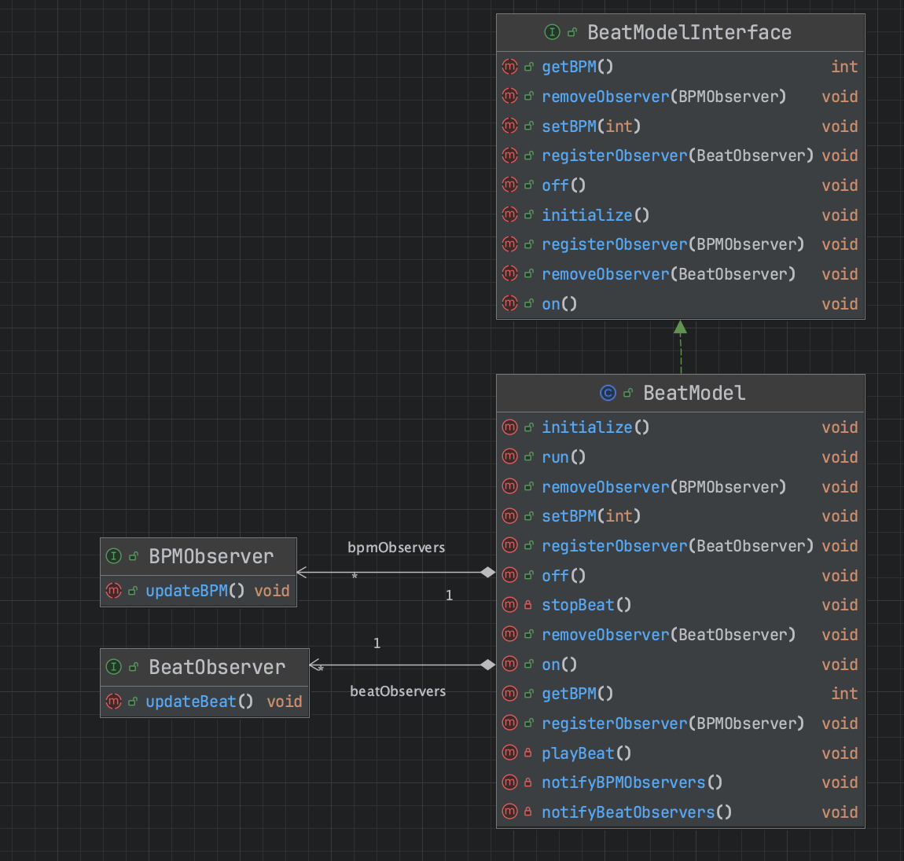

### The View

View hakkında dikkat edilmesi gereken ilk şey, View'i iki ayrı pencerede görüntülenecek şekilde implement etmiş
olmamızdır. Bir pencere mevcut BPM ve pulse'i içerir; diğeri interface kontrollerini içerir. Niçin? Modelin View'ini
içeren interface ile kullanıcı kontrolleri kümesini içeren interface'in geri kalanı arasındaki farkı vurgulamak istedik.

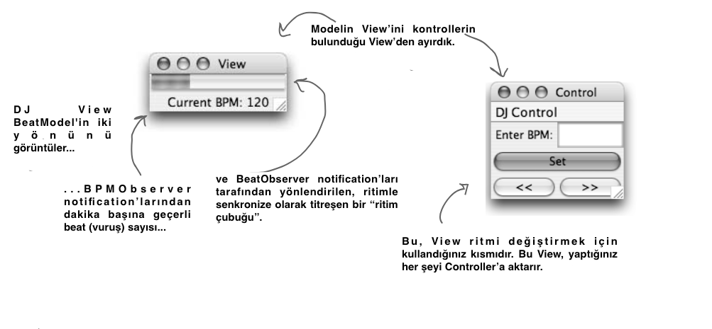

BeatModelimiz View hakkında hiçbir varsayımda bulunmaz. Model, Observer Modeli kullanılarak implement edilmiştir, bu
nedenle state'i değiştiğinde observer olarak register edilen herhangi bir View'i bilgilendirir. View, state'e erişmek
için modelin API'sini kullanır.

## View'in implementasyonu

View'in iki parçası - modelin view'i ve kullanıcı arayüzü kontrollerinin bulunduğu view - iki pencerede görüntülenir,
ancak tek bir Java sınıfında birlikte yaşar.

```
public class DJView implements ActionListener, BPMObserver, BeatObserver {

    BeatModelInterface model;
    ControllerInterface controller; //henuz create edilmedi
    BeatBar beatBar; //henuz create edilmedi

    JFrame viewFrame;
    JPanel viewPanel;
    JLabel bpmOutputLabel;
    JFrame controlFrame;
    JPanel controlPanel;
    JLabel bpmLabel;
    JTextField bpmTextField;
    JButton setBPMButton;
    JButton increaseBPMButton;
    JButton decreaseBPMButton;
    JMenuBar menuBar;
    JMenu menu;
    JMenuItem startMenuItem;
    JMenuItem stopMenuItem;

    public DJView(BeatModelInterface model, ControllerInterface controller) {
        this.model = model;
        this.controller = controller;
        model.registerObserver((BeatObserver) this);
        model.registerObserver((BPMObserver) this);
    }

    public void createView() {
        viewPanel = new JPanel(new GridLayout(1, 2));
        viewFrame = new JFrame("View");
        viewFrame.setDefaultCloseOperation(JFrame.EXIT_ON_CLOSE);
        viewFrame.setSize(new Dimension(100, 80));
        bpmOutputLabel = new JLabel("offline", SwingConstants.CENTER);
        beatBar = new BeatBar();
        beatBar.setValue(0);
        JPanel bpmPanel = new JPanel(new GridLayout(2, 1));
        bpmPanel.add(beatBar);
        bpmPanel.add(bpmOutputLabel);
        viewPanel.add(bpmPanel);
        viewFrame.getContentPane().add(viewPanel, BorderLayout.CENTER);
        viewFrame.pack();
        viewFrame.setVisible(true);
    }

    public void createControls() {
        JFrame.setDefaultLookAndFeelDecorated(true);
        controlFrame = new JFrame("Control");
        controlFrame.setDefaultCloseOperation(JFrame.EXIT_ON_CLOSE);
        controlFrame.setSize(new Dimension(100, 80));
        controlPanel = new JPanel(new GridLayout(1, 2));
        menuBar = new JMenuBar();
        menu = new JMenu("DJ Control");
        startMenuItem = new JMenuItem("Start");
        menu.add(startMenuItem);
        startMenuItem.addActionListener((event) -> controller.start());
        stopMenuItem = new JMenuItem("Stop");
        menu.add(stopMenuItem);
        stopMenuItem.addActionListener((event) -> controller.stop());
        JMenuItem exit = new JMenuItem("Quit");
        exit.addActionListener((event) -> System.exit(0));
        menu.add(exit);
        menuBar.add(menu);
        controlFrame.setJMenuBar(menuBar);
        bpmTextField = new JTextField(2);
        bpmLabel = new JLabel("Enter BPM:", SwingConstants.RIGHT);
        setBPMButton = new JButton("Set");
        setBPMButton.setSize(new Dimension(10, 40));
        increaseBPMButton = new JButton(">>");
        decreaseBPMButton = new JButton("<<");
        setBPMButton.addActionListener(this);
        increaseBPMButton.addActionListener(this);
        decreaseBPMButton.addActionListener(this);
        JPanel buttonPanel = new JPanel(new GridLayout(1, 2));
        buttonPanel.add(decreaseBPMButton);
        buttonPanel.add(increaseBPMButton);
        JPanel enterPanel = new JPanel(new GridLayout(1, 2));
        enterPanel.add(bpmLabel);
        enterPanel.add(bpmTextField);
        JPanel insideControlPanel = new JPanel(new GridLayout(3, 1));
        insideControlPanel.add(enterPanel);
        insideControlPanel.add(setBPMButton);
        insideControlPanel.add(buttonPanel);
        controlPanel.add(insideControlPanel);
        bpmLabel.setBorder(BorderFactory.createEmptyBorder(5, 5, 5, 5));
        bpmOutputLabel.setBorder(BorderFactory.createEmptyBorder(5, 5, 5, 5));
        controlFrame.getRootPane().setDefaultButton(setBPMButton);
        controlFrame.getContentPane().add(controlPanel, BorderLayout.CENTER);
        controlFrame.pack();
        controlFrame.setVisible(true);
    }

    public void enableStopMenuItem() {
        stopMenuItem.setEnabled(true);
    }

    public void disableStopMenuItem() {
        stopMenuItem.setEnabled(false);
    }

    public void enableStartMenuItem() {
        startMenuItem.setEnabled(true);
    }

    public void disableStartMenuItem() {
        startMenuItem.setEnabled(false);
    }

    @Override
    public void actionPerformed(ActionEvent event) {
        if (event.getSource() == setBPMButton) {
            int bpm = 90;
            String bpmText = bpmTextField.getText();
            if (bpmText == null || bpmText.contentEquals("")) {
                bpm = 90;
            } else {
                bpm = Integer.parseInt(bpmTextField.getText());
            }
            controller.setBPM(bpm);
        } else if (event.getSource() == increaseBPMButton) {
            controller.increaseBPM();
        } else if (event.getSource() == decreaseBPMButton) {
            controller.decreaseBPM();
        }
    }

    @Override
    public void updateBPM() {
        if (model != null) {
            int bpm = model.getBPM();
            if (bpm == 0) {
                if (bpmOutputLabel != null) {
                    bpmOutputLabel.setText("offline");
                }
            } else {
                if (bpmOutputLabel != null) {
                    bpmOutputLabel.setText("Current BPM: " + model.getBPM());
                }
            }
        }
    }

    @Override
    public void updateBeat() {
        if (beatBar != null) {
            beatBar.setValue(100);
        }
    }
}
```

View içerisinde Model'e ve henüz oluşturmadığımız Controller'a constructor içinde reference variable'lar tutuyoruz.
Ayrıca BeatBar adında bir class'da oluşturacağız.

BeatBar;

```
public class BeatBar extends JProgressBar implements Runnable {

    JProgressBar jProgressBar;
    Thread thread;

    public BeatBar() {
        thread = new Thread(this);
        setMaximum(100);
        thread.start();
    }

    @Override
    public void run() {
        for (; ; ) {
            int value = getValue();
            value = (int) (value * .75);
            setValue(value);
            repaint();
            try {
                Thread.sleep(50);
            } catch (Exception e) {
            }
        }
    }
}
```

### Controller

Şimdi eksik parçayı yazma zamanı: Controller. Controller'in, View'e biraz akıl katmak için ona eklediğimiz strateji 
olduğunu unutmayın. Strategy Pattern'ini implement ettiğimiz için, DJView'e plugged olabilecek herhangi bir Strategy 
için bir interface ile başlamamız gerekir. Buna ControllerInterface adını vereceğiz

```
/* View'in controller üzerinde çağırabileceği tüm methodlar burada verilmiştir.*/
public interface ControllerInterface {

    /* Modelin interface'ini gördükten sonra bunlar tanıdık gelecektir. Ritim üretimini durdurup başlatabilir ve BPM'yi
    değiştirebilirsiniz. Bu Interface BeatModel Interface'inden “daha zengindir” çünkü BPM'leri artırma ve azaltma ile
    ayarlayabilirsiniz.*/
    void start();
    void stop();
    void increaseBPM();
    void decreaseBPM();
    void setBPM(int bpm);
}
```

### Controller Implementation

```
public class BeatController implements ControllerInterface {

    /* Controller, MVC oreo kurabiyesinin ortasındaki kremalı şeydir, bu nedenle View'i ve Modeli tutan ve hepsini
    birbirine yapıştıran nesnedir.*/
    BeatModelInterface model;
    DJView view;

    public BeatController(BeatModelInterface model) {

        /* Controller, constructor'da Modeli geçirir ve ardından View'i oluşturur.*/
        this.model = model;
        view = new DJView(model, this);
        view.createView();
        view.createControls();
        view.disableStopMenuItem();
        model.initialize();
    }

    @Override
    public void start() {

        /* Kullanıcı arayüzü menüsünden Start'ı seçtiğinizde kontrol ünitesi Modeli açar ve ardından kullanıcı arayüzünü,
        Start menü öğesi devre dışı bırakılacak ve Stop menü öğesi etkinleştirilecek şekilde değiştirir.*/
        model.on();
        view.disableStartMenuItem();
        view.enableStopMenuItem();
    }

    @Override
    public void stop() {

        /* Aynı şekilde, menüden Stop öğesini seçtiğinizde, kontrol ünitesi Modeli kapatır ve kullanıcı arayüzünü, Stop
        menü öğesi devre dışı bırakılacak ve Start menü öğesi etkinleştirilecek şekilde değiştirir*/
        model.off();
        view.disableStopMenuItem();
        view.enableStartMenuItem();
    }

    @Override
    public void increaseBPM() {

        /* Artır düğmesine tıklanırsa Controller Modelden geçerli BPM'yi alır, bir ekler ve ardından yeni bir BPM
        set eder.*/
        int bpm = model.getBPM();
        model.setBPM(bpm + 1);
    }

    @Override
    public void decreaseBPM() {

        /* Burada da yukarıda ki ile aynı şey, sadece mevcut BPM'den bir çıkarıyoruz.*/
        int bpm = model.getBPM();
        model.setBPM(bpm - 1);
    }

    @Override
    public void setBPM(int bpm) {

        /* Son olarak, kullanıcı arayüzü keyfi bir BPM ayarlamak için kullanılırsa, Controller Modele BPM'sini
        ayarlaması talimatını verir.*/
        model.setBPM(bpm);
    }
}
```

Controller, View için akıllı kararlar verir. View sadece menü öğelerini nasıl açıp kapatacağını bilir; onları hangi 
durumlarda devre dışı bırakması gerektiğini bilmez.

### Test Zamanı

İhtiyacımız olan her şeye sahibiz: bir Model, bir View ve bir Controller. Şimdi hepsini bir MVC'de bir araya getirme 
zamanı! Birlikte ne kadar iyi çalıştıklarını göreceğiz ve duyacağız.

```
public class DJTestDrive {
    public static void main(String[] args) {
        
        /* Ilk olarak model oluşturulur */
        BeatModelInterface model = new BeatModel();

        /* ...sonra bir Controller oluşturun ve Modeli ona aktarın. Unutmayın, Controller View'i oluşturur, bu yüzden
        bunu yapmak zorunda değiliz*/
        ControllerInterface controller = new BeatController(model);
    }
}
```