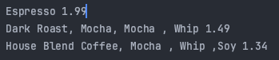

# Decorating Objects

Bu bölümü "Desing Eye for the Inheritance Guy" olarak adlandırın.

Inheritance'in tipik overuse (aşırı kullanımını) yeniden inceleyeceğiz ve bir tür nesne composition'ı kullanarak
runtime'da sınıflarınızı nasıl decorate edeceğiniz öğreneceksiniz. Neden mi? Decoration tekniklerini öğrendikten sonra,
temel sınıflarda herhangi bir kod değişikliği yapmadan kendi (veya başkasının) nesnelerinize yeni sorumluluklar
verebilirsiniz.

# Welcome to Starbuzz Coffee

Starbuzz Coffee en hızlı büyüyen kahve dükkanı olarak adından söz ettiriyor. Eğer yerel köşenizde bir tane gördüyseniz,
caddenin karşısına bakın; bir tane daha göreceksiniz. Hızlı büyüdükleri için, içecek seçeneklerine uyacak şekilde
sipariş sistemlerini güncellemeye çalışıyorlar. İlk işe başladıklarında sınıflarını şu şekilde tasarladılar...


**Beverage** : kahve dükkanında sunulan tüm içeceklerin tarafından alt sınıflandırılan abstract bir sınıftır

**cost()** methodu abstract'dır; subclass'ların kendi implementasyonlarını tanımlamaları gerekir.

**description** instance variable'i her subclass'da ayarlanır ve içeceğin "Most Excellent Dark Roast" gibi bir
açıklamasını tutar. getDescription() methodu açıklamayı döndürür.

Her subclass, içeceğin maliyetini döndürmek için cost() methodunu implement eder.

Kahvenize ek olarak, buharda pişirilmiş süt, soya ve mocha (çikolata olarak da bilinir) gibi çeşitli çeşniler
isteyebilir ve hepsini çırpılmış sütle tamamlayabilirsiniz. Starbuzz bunların her biri için biraz ücret alıyor, bu
yüzden bunları sipariş sistemlerine dahil etmeleri gerekiyor. İşte ilk denemeleri...


Buna "Sınıf patlaması" diyebilir misiniz?

Her cost() methodu, kahvenin maliyetini siparişteki diğer katkı maddeleri ile birlikte hesaplar.

Starbuzz'ın kendileri için bir bakım kabusu yarattığı oldukça açık. Sütün fiyatı arttığında ne olacak? Yeni bir karamel
malzemesi eklediklerinde ne yapacaklar? Bakım sorununun ötesinde düşünecek olursak, şimdiye kadar ele aldığımız tasarım
ilkelerinden hangilerini ihlal ediyorlar?

Bu aptalca; neden tüm bu sınıflara ihtiyacımız var? Çeşnileri takip etmek için superclass'da instance variable'ları ve
inheritance kullanamaz mıyız?

Peki, bir deneyelim. Beverage base class'ı ile başlayalım ve her bir içeceğin süt, soya, mocha ve whip içerip
içermediğini temsil etmek için instance variable'lar ekleyelim...


Her condiment (çeşni) için yeni boolean değerleri; (milk,soy,mocha,whip)

Şimdi cost() methodunu Beverage'da implement edeceğiz (abstract tutmak yerine), böylece belirli bir içecek instance'i
için çeşnilerle ilişkili maliyetleri hesaplayabilecek. Subclass'lar cost() methodunu override etmeye devam edecek, ancak
temel içeceğin toplam maliyetini ve eklenen çeşnilerin maliyetlerini hesaplayabilmek için super sürümü de çağıracaklar.

getter-setter'lar çeşniler için boolean değerlerini get etmek ve set etmek için kullanılır.


Şimdi menüdeki her içecek için bir tane olmak üzere subclass'ları ekleyelim:


**cost()** : Superclass cost() tüm çeşnilerin maliyetlerini hesaplarken, subclass'larda ki override edilmiş cost() bu
işlevi söz konusu içecek türünün maliyetlerini içerecek şekilde extend eder.

Her cost() methodunun içeceğin maliyetini hesaplaması ve ardından cost() superclass implementasyonunu çağırarak
çeşnileri eklemesi gerekir

**Dialog :** Bak, toplam beş sınıf. Bu kesinlikle gidilecek yol.

**Dialog :** Ben o kadar emin değilim; tasarımın gelecekte nasıl değişmesi gerekebileceğini düşünerek bu yaklaşımla
ilgili bazı potansiyel sorunları görebiliyorum.

--**DIALOGS**--

Usta: Çekirge, son görüşmemizden bu yana biraz zaman geçti. Inheritance konusunda derin düşüncelere mi daldın?

Öğrenci: Evet, Usta. Inheritance güçlü olsa da, her zaman en esnek veya sürdürülebilir tasarımlara yol açmadığını
öğrendim.

Usta: Ah evet, biraz ilerleme kaydettiniz. Peki, söyle bana öğrencim, inheritance yoluyla değilse nasıl yeniden
kullanmayı başaracaksın?

Öğrenci: Efendim, composition ve delegation atama yoluyla runtime'da behavior'u "inheritance almanın" yolları olduğunu
öğrendim.

Usta: Devam et?

Öğrenci : Subclassing yoluyla bir behavior'u inherit aldığımda, bu behavior compile time'da statik olarak ayarlanır.
Ayrıca, tüm subclass'lar aynı behavior'ı inherit etmelidir. Ancak, bir nesnenin behavior'ını composition yoluyla extend
edebilirsem, bunu runtime'da dinamik olarak yapabilirim.

Usta: Çok iyi, Çekirge, Composition'ın gücünü görmeye başlıyorsun.

Öğrenci : Evet, bu teknikle nesnelere birden fazla yeni sorumluluk eklemem mümkün, superclass'ın tasarımcısı tarafından
düşünülmemiş sorumluluklar da dahil. Ve onların kodlarına dokunmak zorunda değilim!

Usta: Composition'ın kodunuzu nasıl sürdürülebilir kıldığı hakkında ne öğrendin?

Öğrenci : Ben de bunu anlatmaya çalışıyordum. Nesneleri dinamik olarak composing ederek, mevcut kodu değiştirmek yerine
yeni kod yazarak yeni işlevler ekleyebilirim. Mevcut kodu değiştirmediğim için, önceden var olan kodda hataların ortaya
çıkma veya istenmeyen side-effect'lere neden olma olasılığı çok daha düşüktür.

Usta : Çok iyi. Bugünlük bu kadar yeter, Çekirge. Gidip bu konu üzerinde biraz daha düşünmeni istiyorum... Unutma, kod
akşamları lotus çiçeği gibi kapalı (değişime kapalı), sabahları ise lotus çiçeği gibi açık (genişlemeye açık) olmalıdır.

# The Open-Closed Principle

Çekirge, en önemli tasarım prensiplerinden birini anlamaya başlıyor gibi görünüyor:


**Desing Principle : Sınıflar, genişletmeye açık ancak değişikliğe kapalı olmalıdır.**

İçeri gelin; kapımız açık. Sınıflarımızı istediğiniz yeni behavior'lar ile extend etmekten çekinmeyin. İhtiyaçlarınız
veya gereksinimleriniz değişirse (ve değişeceğini biliyoruz), devam edin ve kendi extension'larınızı yapın.

Üzgünüz, kapalıyız. Bu doğru, bu kodu doğru ve hatasız hale getirmek için çok zaman harcadık, bu yüzden mevcut kodu
değiştirmenize izin veremeyiz. Değişikliğe kapalı kalmalıdır. Eğer beğenmediyseniz, müdürle konuşabilirsiniz.

Amacımız, sınıfların mevcut kodu değiştirmeden yeni behavior'ları içerecek şekilde kolayca extended edilebilmesini
sağlamaktır. Bunu başarırsak ne elde ederiz? Değişime dirençli ve değişen gereksinimleri karşılamak için yeni işlevler
üstlenebilecek kadar esnek tasarımlar.

--**DIALOGS**--

Q : Open for extension and closed for modification (Genişletmeye açık ve değişikliğe kapalı mı?) Bu kulağa çok çelişkili
geliyor. Bir tasarım nasıl her ikisi birden olabilir?

A : Bu çok güzel bir soru. İlk başta kulağa kesinlikle çelişkili geliyor. Sonuçta, bir şey ne kadar az
değiştirilebilirse, genişletilmesi de o kadar zor olur, değil mi? Ancak altta yatan kodu değiştiremesek bile sistemlerin
genişletilmesine olanak tanıyan bazı akıllı OO teknikleri olduğu ortaya çıktı. Observer Kalıbını düşünün (Bölüm 2'de)...
yeni Observer'lar ekleyerek, Subject'e kod eklemeden Subject'i istediğimiz zaman genişletebiliriz. Diğer OO tasarım
teknikleriyle behavior'u extend etmenin birkaç yolunu daha göreceksiniz.

Q : Tamam, Observable'ı anlıyorum, ancak genel olarak genişletilebilir, ancak değişikliğe kapalı bir şeyi nasıl
tasarlayabilirim?

A : Pattern'lerin çoğu, bir genişletme aracı sağlayarak kodunuzu değiştirilmekten koruyan, zaman içinde test edilmiş
tasarımlar sunar. Bu bölümde, OpenClosed prensibini takip etmek için Decorator kalıbını kullanmanın iyi bir örneğini
göreceksiniz.

Q : Tasarımımın her parçasının Open-Close İlkesine uymasını nasıl sağlayabilirim?

A : Genellikle yapamazsınız. OO tasarımını esnek ve mevcut kodu değiştirmeden genişletmeye açık hale getirmek zaman ve
çaba gerektirir. Genel olarak, tasarımlarımızın her parçasını bağlama lüksüne sahip değiliz (ve bu muhtemelen israf
olacaktır). Open-Closed Prensibini takip etmek genellikle yeni abstraction seviyeleri getirir ve bu da kodumuza
karmaşıklık katar. Tasarımlarınızda değişme olasılığı en yüksek olan alanlara odaklanmak ve ilkeleri buralarda uygulamak
istersiniz.

Q : Hangi değişim alanlarının daha önemli olduğunu nasıl bilebilirim?

A : Bu kısmen OO sistemleri tasarlama deneyimi ve ayrıca çalıştığınız alanı tanıma meselesidir. Diğer örneklere bakmak,
kendi tasarımlarınızdaki değişim alanlarını belirlemeyi öğrenmenize yardımcı olacaktır.

**Not :**Çelişki gibi görünse de, kodun doğrudan değiştirilmeden genişletilmesine izin veren teknikler vardır.
Genişletilmesi gereken kod alanlarını seçerken dikkatli olun; Open-Closed İlkesini HER YERDE uygulamak israftır,
gereksizdir ve karmaşık, anlaşılması zor kodlara yol açabilir.

# Meet the Decorator Pattern

Tamam, içecek artı çeşni fiyatlandırma şemamızı inheritance yoluyla temsil etmenin pek işe yaramadığını gördük - class
explosion, rigid desing'lar elde ediyoruz veya base class'a bazı subclass'lar için uygun olmayan işlevler ekliyoruz.
Bunun yerine şöyle yapacağız: bir içecekle başlayacağız ve runtime'da onu çeşnilerle "decorate edeceğiz". Örneğin,
müşteri Mocha ve Whip ile Dark Roast istiyorsa, o zaman şöyle yapacağız:

1 - Bir DarkRoast object'i alın

2 - Bir Mocha object'i ile decorate edin

3 - Bir Whip object'i ile decorate edin

4 - cost() methodunu çağırın ve çeşni maliyetlerini eklemek için delegasyona güvenin

Peki ama bir nesneyi nasıl "decorate edersiniz" ve delegasyon bu işe nasıl dahil olur? Bir ipucu: decorator
nesnelerini "wrapper" olarak düşünün. Bunun nasıl çalıştığını görelim...

# Constructing a drink order with Decorators

1 - DarkRoast nesnemizle başlıyoruz.


DarkRoast'un Beverage'dan inheritance aldığını ve içeceğin maliyetini hesaplayan bir cost() methoduna sahip olduğunu
unutmayın.

2 - Müşteri Mocha istiyor, bu yüzden bir Mocha nesnesi oluşturuyoruz ve onu DarkRoast'un etrafına wrap ediyoruz.


**Mocha** nesnesi bir decorator'dır. Türü, decorate ettiği nesneyi, bu durumda bir Beverage'i mirror eder. ("Mirror"
derken, aynı tür olduğunu kastediyoruz..)

Dolayısıyla, Mocha'nın da bir cost() methodu vardır ve polymorphism sayesinde Mocha'ya wrapped edilmiş herhangi bir
Beverage'ı da bir Beverage olarak ele alabiliriz (çünkü Mocha, Beverage'ın bir subtype'ıdır). Bu, tasarımın esnekliğini
ve yeniden kullanılabilirliğini artırır ve Mocha'nın Beverage'i decorate etmesi sonucunda bile Beverage olarak işlem
görmesini sağlar.

3 - Müşteri ayrıca Whip istiyor, bu yüzden bir Whip decorator'ı oluşturup Mocha'yı bununla wrap ediyoruz.


**Whip** bir decorator'dır, bu nedenle DarkRoast'un türünü de yansıtır ve bir cost() methodu içerir.

Yani, Mocha ve Whip ile sarılmış bir DarkRoast hala bir Beverage'dir ve onunla, cost() methodunu çağırmak da dahil olmak
üzere bir DarkRoast ile yapabileceğimiz her şeyi yapabiliriz.

4 - Şimdi sıra müşteri için maliyeti hesaplamaya geldi. Bunu, en dıştaki decorator olan Whip üzerinde cost() methodunu
çağırarak yapıyoruz ve Whip, maliyeti hesaplama işlemini, decorate ettiği nesnelere devredecek. Bir maliyet elde
ettiğinde, Whip'in maliyetini ekleyecektir.


    1 - İlk olarak, en dıştaki decorator olan Whip üzerinde cost() methodunu çağırıyoruz.
    2 - Whip, Mocha üzerinde cost() methodunu çağırır.
    3 - Mocha, DarkRoast üzerinde cost() methodu çağırır.
    4 - DarkRoast 99 cent'e mal oluyor.
    5 - Mocha, DarkRoast'tan gelen sonuca kendi maliyeti olan 20 cent'i ekler ve yeni toplam olan 1,19 doları döndürür.
    6 - Whip, Mocha'dan gelen sonuca kendi toplamı olan 10 cent'i ekler ve nihai sonucu verir - 1,29 $.

# Okay, here’s what we know so far...

* Decorator'lar, decorate ettikleri nesnelerle aynı supertype'a sahiptir.
* Bir nesneyi wrap etmek için bir veya daha fazla decorator kullanabilirsiniz.
* Decorator'ın decorate ettiği nesneyle aynı supertype'a sahip olduğu göz önüne alındığında, orijinal (wrapped) nesnenin
  yerine decorate edilmiş bir nesneyi aktarabiliriz.
* Decorator, işin geri kalanını yapması için decorate ettiği nesneye yetki vermeden önce ve/veya sonra kendi
  behavior'ını ekler.
* Nesneler herhangi bir zamanda decorate edilebilir, bu nedenle nesneleri runtime'da istediğimiz kadar decorator ile
  dinamik olarak decorate edebiliriz.

Şimdi Decorator Pattern tanımına bakarak ve biraz kod yazarak tüm bunların gerçekten nasıl çalıştığını görelim.

# The Decorator Pattern defined

İlk olarak Decorator Pattern açıklamasına bir göz atalım:

Decorator Pattern, bir nesneye dinamik olarak ek sorumluluklar ekler. Decorator'lar, işlevselliği genişletmek için
subclassing'e kolay bir alternatif sağlar.

Bu, Decorator Kalıbının rolünü açıklasa da, kalıbı kendi uygulamamıza nasıl implement edeceğimiz konusunda bize çok
fazla fikir vermiyor. Biraz daha açıklayıcı olan sınıf diyagramına bir göz atalım.


* **ConcreteComponent**, dinamik olarak yeni Behavior ekleyeceğimiz nesnedir. Component'i extend eder

* Her **Component** kendi başına kullanılabilir veya bir decorator tarafından wrap edilebilir

* Her **Decorator** bir Component'e HAS-A ilişkisine sahip olur (wrap eder), bu da Decorator'ın bir Component'e referans
  tutan bir instance variable'a sahip olduğu anlamına gelir. Decorator'lar, decorate edecekleri Component ile aynı
  interface'i veya abstract sınıfı implement ederler. Decorator'lar Component'in state'ini extend edebilirler.
  Decorator'lar yeni methodlar ekleyebilir; ancak yeni behavior genellikle Component'de ki mevcut bir methoddan önce
  veya sonra hesaplama yapılarak eklenir.

* **ConcreteDecorator**, decorate ettiği şey (Decorator'ın wrap ettiği Component) için bir instance variable'a sahiptir.

# Decorating our Beverages

Tamam, Starbuzz içeceklerimizi bu Framework'e yerleştirelim...


* **Beverage** abstract Component sınıfımız olarak işlev görür.

* Her kahve türü için bir tane olmak üzere dört concrete component

1 - HouseBlend

2 - DarkRoast

3 - Espresso

4 - Decaf

* Ve işte çeşni decorator'ları; sadece cost()'u değil getDescription()'ı da implement etmeleri gerektiğine dikkat edin.
  Nedenini birazdan göreceğiz...

1 - Milk

2 - Mocha

3 - Soy

4 - Whip

# Cubicle Conversation

Inheritance ve Comnposition konusunda bazı karışıklıklar

Tamam, biraz kafam karıştı... Bu modelde inheritance kullanmayacağımızı, bunun yerine Composition'a güveneceğimizi
sanıyordum.

--**DIALOGS**--

S :  Ne demek istiyorsun?

M : Sınıf diyagramına bakın. CondimentDecorator, Beverage sınıfını extend ediyor. Bu inheritance, değil mi?

S : Doğru. Bence asıl önemli olan nokta, decorator'ları decorate edecekleri nesnelerle aynı type'a sahip olmalarının
hayati önem taşımasıdır. Yani burada type matching sağlamak için inheritance kullanıyoruz, ancak behavior elde etmek
için inheritance kullanmıyoruz.

M : Tamam, decorator'ların wrap ettikleri Component'ler ile aynı "interface'e" nasıl ihtiyaç duyduklarını görebiliyorum
çünkü Component'in yerine geçmeleri gerekiyor. Ama behavior nerede devreye giriyor?

S : Bir Decorator ile bir Component'i compose ettiğimizde, yeni bir behavior eklemiş oluruz. Yeni behavior'u bir
superclass'dan inheritance alarak değil, nesneleri composing ederek ediniriz.

M : Tamam, Beverage abstract sınıfını, behavior'unu inheritance almak için değil, doğru type'a sahip olmak için
subclass'lara ayırıyoruz. Behavior, decorator'ların base component'lerle ve diğer decorator'lar ile composition'ı
yoluyla gelir.

S : Bu doğru

M : Ve nesne composition'ı kullandığımız için, çeşnileri ve içecekleri nasıl karıştırıp eşleştireceğimiz konusunda çok
daha fazla esneklik elde ediyoruz.

S : Evet, inheritance'a güveniyorsak, behavior'ımız yalnızca compile time'da statik olarak belirlenebilir. Başka bir
deyişle, yalnızca superclass'ın bize verdiği veya bizim override ettiğimiz behavior'u elde ederiz. Composition ile,
decorator'ları runtime'da istediğimiz şekilde karıştırabilir ve eşleştirebiliriz.

M : Ve anladığım kadarıyla, yeni behavior'lar eklemek için istediğimiz zaman yeni decorator'lar implement edebiliriz.
Inheritance'a güveniyor olsaydık, yeni behavior istediğimiz her seferinde mevcut kodu değiştirmemiz gerekirdi

S : Kesinlikle

M : Eğer inheritance almamız gereken tek şey component'in type'ı ise, neden Beverage sınıfı için abstract
bir sınıf yerine bir interface kullanmadık?

S : Hatırlayın, bu kodu aldığımızda Starbuzz zaten abstract bir Beverage sınıfına sahipti. Geleneksel olarak Decorator
Modeli abstract bir component belirtir, ancak Java'da tabii ki bir interface kullanabiliriz. Ancak her zaman mevcut kodu
değiştirmekten kaçınmaya çalışırız, bu nedenle abstract sınıf gayet iyi çalışacaksa bunu "düzeltmeyin".

# Writing the Starbuzz code

Bu tasarımı gerçek bir koda dönüştürmenin zamanı geldi.

Starbuzz'ın orijinal tasarımından değişmesine gerek olmayan Beverage sınıfı ile başlayalım. Bir göz atalım:

```
/* Beverage, getDescription() ve cost() methodlarını içeren abstract bir sınıftır */
public abstract class Beverage {
    String description = "unknown beverage";

    /* getDescription() bizim için zaten implement ediliyor, ancak subclass'larda cost() methodunu implement etmemiz 
    gerekiyor */
    public String getDescription() {
        return description;
    }

    public abstract double cost();
}
```

Beverage yeterince basittir. Condiment (Decorator) için de abstract sınıfı implements edelim:

```
/* İlk olarak, bir Beverage ile değiştirilebilir olmamız gerekiyor, bu yüzden Beverage sınıfını extend ediyoruz */
public abstract class CondimentDecorator extends Beverage{

    /* Ayrıca, Condiment decorator'ların hepsinin getDescription() methodunu yeniden implemente etmesini gerektireceğiz. 
    Nedenini birazdan göreceğiz... */
    public abstract String getDescription();
    
    @Override
    public double cost() {
        return 0;
    }
    
}
```

# Coding beverages

Base class'larımızı aradan çıkardığımıza göre, şimdi bazı Beverage'leri implement edelim. Espresso ile başlayacağız.
Unutmayın, belirli bir Beverage için bir Description set etmemiz ve ayrıca cost() methodunu implement etmemiz gerekiyor.

```
/* Bu bir Beverage olduğu için önce Beverage sınıfını extends ediyoruz */
public class Espresso extends Beverage{
    
    /* Description ile ilgilenmek için, bunu sınıfın constructor'ında ayarlarız. description instance variable'inin 
    Beverage'dan ineritance alındığını unutmayın */
    public Espresso(){
        description = "Espresso";
    }
    
    /* Son olarak, bir Espresso'nun maliyetini hesaplamamız gerekiyor. Bu sınıfta Condiment ekleme konusunda 
    endişelenmemize gerek yok, sadece bir Espresso'nun fiyatını döndürmemiz gerekiyor: 1,99 $. */
    @Override
    public double cost() {
        return 1.99;
    } 
}
```

Şimdi HouseBlend içeceğini ekliyoruz;

```
/* Tamam, işte başka bir içecek. Tek yapmamız gereken uygun Description olan "House Blend Coffee "yi set etmek ve 
ardından doğru maliyeti döndürmek: 89¢. */
public class HouseBlend extends Beverage{

    public HouseBlend() {
        description = "House Blend Coffee";
    }

    @Override
    public double cost() {
        return .89;
    }
}
```

Şimdi DarkRoast içeceğini ekliyoruz;

```
public class DarkRoast extends Beverage{

    public DarkRoast() {
        description = "Dark Roast";
    }

    @Override
    public double cost() {
        return .99;
    }
}
```

Şimdi Decaf içeceğini ekliyoruz;

```
public class Decaf extends Beverage{

    public Decaf() {
        description = "Decaf";
    }

    @Override
    public double cost() {
        return 1.05;
    }
}
```

# Coding condiments

Decorator Pattern sınıf diyagramına geri dönüp bakarsanız, artık abstract component'imizi (Beverage) yazdığımızı,
concrete component'lerimizi (HouseBlend, DarkRoast, Decaf) ve abstract decorator'ımızı (CondimentDecorator) yazdığımızı
göreceksiniz. Şimdi sıra concrete decorator'ları implement etmeye geldi. İşte Mocha:

```
/* Mocha bir decorator'dır, bu yüzden CondimentDecorator'ı extends ediyoruz. Unutmayın, CondimentDecorator Beverage'i 
extends eder */
public class Mocha extends CondimentDecorator{

    /* Mocha'yı Beverage kullanarak bir referans ile instantiate edeceğiz:
    1 - Wrap ettiğimiz Beverage'i tutmak için bir instance variable
    2 - Bu instance variable'i wrap ettiğimiz nesneye set etmenin bir yolu. Burada, wrap ettiğimiz Beverage'i 
    decorator'ın constructor'ına aktaracağız. */
    Beverage beverage;

    public Mocha(Beverage beverage) {
        this.beverage = beverage;
    }
    
    /* Description'ın yalnızca Beverage'i - örneğin "Dark Roast" - içermesini değil, aynı zamanda içeceği decorate eden 
    her bir öğeyi de içermesini istiyoruz, örneğin "Dark Roast, Mocha". Bu nedenle, önce description'i almak için 
    decorate ettiğimiz nesneye yetki atıyoruz, ardından bu description'a ", Mocha" ekliyoruz. */
    @Override
    public String getDescription() {
        return beverage.getDescription() + ", Mocha";
    }

    /* Şimdi Mocha ile Beverage'imizin maliyetini hesaplamamız gerekiyor. İlk olarak, maliyeti hesaplayabilmesi için 
    çağrıyı decorated ettiğimiz nesneye delege ediyoruz; ardından Mocha'nın maliyetini sonuca ekliyoruz */
    @Override
    public double cost() {
        return beverage.cost() + .20;
    }
}
```

Soy Condiments içinde class'ımızı yazalım;

```
public class Soy extends CondimentDecorator{

    Beverage beverage;

    public Soy(Beverage beverage) {
        this.beverage = beverage;
    }

    @Override
    public String getDescription() {
        return beverage.getDescription() + " ,Soy";
    }

    @Override
    public double cost() {
        return beverage.cost() + .15;
    }
}
```

Whip Condiments içinde class'ımızı yaratalım;

```
public class Whip extends CondimentDecorator{

    Beverage beverage;

    public Whip(Beverage beverage) {
        this.beverage = beverage;
    }

    @Override
    public String getDescription() {
        return beverage.getDescription() + " , Whip";
    }

    @Override
    public double cost() {
        return beverage.cost() + .10;
    }
}
```

# Serving some coffees

Tebrikler. Şimdi arkanıza yaslanıp birkaç kahve sipariş etme ve Decorator Deseni ile yarattığınız esnek tasarıma hayran
olma zamanı.

```
public class StarbuzzCafe {
    public static void main(String[] args) {
        
        /* Condiment içermeyen bir espresso sipariş edin description ve cost'u yazdırın */
        Beverage espresso = new Espresso();
        System.out.println(espresso.getDescription() + " " + espresso.cost());

        /* DarkRoast object'i create edin */
        Beverage darkRoast = new DarkRoast();
        
        /* Bir Mocha ile wrap edin */
        darkRoast = new Mocha(darkRoast);
        
        /* Bir Mocha ile daha wrap edin */
        darkRoast = new Mocha(darkRoast);
        
        /* Bir Whip ile wrap edin*/
        darkRoast = new Whip(darkRoast);
        
        /* Desciption ve cost'u yazdırın */
        System.out.println(darkRoast.getDescription() + " " + darkRoast.cost());

        /* Son olarak, bize Soya, Mocha ve Whip ile bir HouseBlend verin */
        Beverage houseBlend = new HouseBlend();
        houseBlend = new Soy(houseBlend);
        houseBlend = new Mocha(houseBlend);
        houseBlend = new Whip(houseBlend);
        
        /* Desciption ve cost'u yazdırın */
        System.out.println(houseBlend.getDescription() + " " + houseBlend.cost());
        
    }
}
```

Factory Pattern'i ve Builder Pattern'i ele aldığımızda decorate edilmiş nesneler oluşturmanın çok daha iyi bir yolunu
göreceğiz.



--**DIALOGS**--

Q : Belirli bir concrete component'i (örneğin HouseBlend) test edebilecek ve indirim yapmak gibi bir şey yapabilecek kod
konusunda biraz endişeliyim. HouseBlend'i decorator'lar ile wrap ettikten sonra, bu artık işe yaramayacak.

A : Bu kesinlikle doğru. Concrete Component'in type'ına dayanan bir kodunuz varsa, decorator'lar bu kodu bozacaktır.
Yalnızca abstract component type'ına karşı kod yazdığınız sürece, decorator'ların kullanımı kodunuz için şeffaf
kalacaktır. Ancak, concrete component'lere karşı kod yazmaya başladığınızda, uygulama tasarımınızı ve decorator
kullanımınızı yeniden düşünmek isteyeceksiniz.

Q : Bir Beverage Client'inin en dıştaki decorator olmayan bir decorator'a sahip olması kolay olmaz mıydı? Örneğin,
Mocha, Soy ve Whip içeren bir DarkRoast'ım olsaydı, bir şekilde Whip yerine Soy'a referans veren bir kod yazmak kolay
olurdu, bu da Whip'i sıraya dahil etmeyeceği anlamına gelirdi.

A : Decorator Kalıbı ile daha fazla nesneyi yönetmeniz gerektiğini ve bu nedenle kodlama hatalarının önerdiğiniz türden
sorunlara yol açma olasılığının arttığını kesinlikle iddia edebilirsiniz. Ancak decorator'lar genellikle Factory ve
Builder gibi diğer kalıplar kullanılarak oluşturulur. Bu kalıpları ele aldığımızda, concrete component'in decorator'ı
ile birlikte oluşturulmasının "well encapsulated (iyi kapsüllenmiş)" olduğunu ve bu tür sorunlara yol açmadığını
göreceksiniz.

Q : Decorator'lar chain'deki diğer decoration'lar hakkında bilgi sahibi olabilir mi? Diyelim ki getDecription()
methodumun "Mocha, Whip, Mocha" yerine "Whip, Double Mocha" yazdırmasını istedim? Bu, en dıştaki decorator'ımın
wrap ettiği tüm decorator'ları bilmesini gerektirir.

A : Decorator'ler, wrap ettikleri nesneye behavior eklemek içindir. Decorator chain'inde birden fazla katmana göz
atmanız gerektiğinde, Decorator'ü gerçek amacının ötesine itmeye başlarsınız. Bununla birlikte, bu tür şeyler mümkündür.
Son açıklamayı ayrıştıran ve "Mocha, Whip, Mocha" ifadesini "Whip, Double Mocha" olarak yazdırabilen bir
CondimentPrettyPrint Decorator'ü düşünün. Bunu kolaylaştırmak için getDecription() methodunun bir ArrayList of
descriptions döndürebileceğini unutmayın.

# Real World Decorators: Java I/O

java.io paketindeki çok sayıda sınıf... bunaltıcıdır. Bu API'ye ilk (ve ikinci ve üçüncü) kez baktığınızda "vay be"
dediyseniz kendinizi yalnız hissetmeyin. Ancak artık Decorator Pattern'i bildiğinize göre, java.io paketi büyük ölçüde
Decorator'a dayandığı için I/O sınıfları daha anlamlı olacaktır. İşte bir file'den veri okumaya işlevsellik eklemek
için Decorator'ları kullanan tipik bir nesne kümesi:


**FileInputStream : **, decorated edilen Component'dir Java I/O kütüphanesi, FileInputStream, StringBufferInputStream,
ByteArrayInputStream ve diğerleri dahil olmak üzere çeşitli Component'ler sağlar. Tüm bunlar bize byte'ları
okuyabileceğimiz base bir component sağlar.

**BufferedInputStream : ** concrete bir Decorator'dır. BufferedInputStream iki şekilde behavior ekler: performansı
artırmak için input'u buffer'a alır ve ayrıca character based inputu her seferinde bir satır okumak için yeni bir
readLine() methodu ile interface'i güçlendirir.

**LineNumberInputStream : ** de concrete bir Decorator'dır. Verileri okurken satır numaralarını sayma yeteneği ekler.

BufferedInputStream ve LineNumberInputStream'in her ikisi de Abscract Decorator sınıf olarak görev yapan
FilterInputStream'i extend ederler.

# Decorating the java.io classes


**InputStream :** İşte abstract component'imiz

**FilterInputStream :** abstract bir decorator'dır


Bu InputStream'ler, decorator'lar ile wrap edeceğimiz concrete component'ler olarak işlev görür. ObjectInputStream gibi
göstermediğimiz birkaç tane daha var.


Ve son olarak, işte tüm concrete decorator'larımız

Bunun Starbuzz tasarımından çok da farklı olmadığını görebilirsiniz. Artık java.io API dokümanlarına göz atmak ve
çeşitli input stream'leri üzerinde decorator'lar oluşturmak için iyi bir konumda olmalısınız.

Ve output stream'lerinin de aynı tasarıma sahip olduğunu göreceksiniz. Ve muhtemelen Reader/Writer stream'lerinin (
character-based data'lar için) stream sınıflarının tasarımını yakından yansıttığını (birkaç farklılık ve tutarsızlıkla
birlikte, ancak neler olup bittiğini anlamak için yeterince yakın) zaten bulmuşsunuzdur.

Ancak Java I/O, Decorator Deseninin dezavantajlarından birine de dikkat çeker: Bu deseni kullanan tasarımlar genellikle
Decorator tabanlı API'yi kullanmaya çalışan bir geliştirici için bunaltıcı olabilecek çok sayıda küçük sınıfla
sonuçlanır. Ancak artık Decorator'ın nasıl çalıştığını bildiğinize göre, işleri perspektif içinde tutabilir ve başka
birinin Decorator ağırlıklı API'sini kullanırken, sınıflarının nasıl organize edildiğini inceleyebilir, böylece
istediğiniz behavior'u elde etmek için wrapper'ları kolayca kullanabilirsiniz.

# Writing your own Java I/O Decorator

Tamam, Decorator Desenini biliyorsunuz, I/O sınıf diyagramını gördünüz. Kendi input decorator'ınızı yazmaya hazır
olmalısınız

Şuna ne dersiniz: InputStream'de ki tüm büyük harfleri küçük harfe dönüştüren bir decorator yazın. Başka bir deyişle, "
Decorator Kalıbını biliyorum, bu nedenle HÜKÜMDARIM!" yazısını okursak, decorator'ınız bunu "decorator kalıbını
biliyorum, bu nedenle hükümdarım!" şekline dönüştürür.

```
/* İlk olarak, tüm InputStream'ler için abstract decorator olan FilterInputStream'i extends edin */
public class LowerCaseInputStream extends FilterInputStream {
    protected LowerCaseInputStream(InputStream in) {
        super(in);
    }

    /* Şimdi iki read() methodu implement etmemiz gerekiyor. Bunlar bir byte (veya byte array'i) alır ve her byte'ı 
    (bir karakteri temsil eden) büyük harf ise küçük harfe dönüştürür */
    @Override
    public int read() throws IOException {
        int c = super.read();
        return (c == -1 ? c : Character.toLowerCase((char) c));
    }

    public int read(byte[] b, int offset, int len) throws IOException {
        int result = super.read(b, offset, len);
        for (int i = offset; i < offset+result; i++) {
            b[i] = (byte)Character.toLowerCase((char)b[i]);
        }
        return result;
    }
}
```

# Test out your new Java I/O Decorator

```
public class InputTest {
    public static void main(String[] args) {
        int c;
        try{
            /* FileInputStream'i kurun ve önce bir BufferedInputStream ve ardından yepyeni LowerCaseInputStream 
            filtresi ile decorate edin */
            InputStream in = new LowerCaseInputStream(new BufferedInputStream(new FileInputStream("test.txt")));
            
            /* File'in sonuna kadar karakterleri okumak için stream'i kullanın ve ilerledikçe print edin */
            while ((c = in.read())>=0){
                System.out.print((char) c);
            }
            in.close();
        } catch (IOException e){
            e.printStackTrace();
        }
    }
}
```


--**DIALOGS**--

HeadFirst : Decorator Pattern'e Hoş Geldiniz. Son zamanlarda kendinizi biraz kötü hissettiğinizi duyduk.

Decorator : Evet, dünyanın beni göz alıcı bir tasarım modeli olarak gördüğünü biliyorum ama herkes gibi benim de
sorunlarım var.

HeadFirst : Yaşadığınız bazı sıkıntıları bizimle paylaşabilir misiniz?

Decorator: Elbette. Tasarımlara esneklik katma gücüne sahip olduğumu biliyorsunuz, bu kesin, ancak aynı zamanda karanlık
bir tarafım da var. Gördüğünüz gibi, bazen bir tasarıma çok sayıda küçük sınıf ekleyebiliyorum ve bu bazen başkalarının
anlaması için basit olmayan bir tasarımla sonuçlanıyor.

HeadFirst : Bize bir örnek verebilir misiniz?

Decorator: Java I/O kütüphanelerini ele alalım. Bunları insanların ilk başta anlaması oldukça zordur. Ancak sınıfları
sadece bir InputStream etrafında bir dizi wrapper olarak görürlerse, hayat çok daha kolay olacaktır.

HeadFirst: Kulağa o kadar da kötü gelmiyor. Hala harika bir modelsiniz ve bunu geliştirmek sadece bir halk eğitimi
meselesi, değil mi?

Decorator : Korkarım dahası da var. Yazım sorunlarım var: görüyorsunuz, insanlar bazen belirli türlere dayanan bir
client kod parçasını alıp her şeyi düşünmeden Decorator'ler ekliyorlar. Şimdi, benimle ilgili harika bir şey,
Decorator'leri genellikle şeffaf bir şekilde ekleyebilmeniz ve client'in bir Decorator'ler ile uğraştığını asla bilmek
zorunda olmamasıdır. Ancak dediğim gibi, bazı kodlar belirli türlere bağımlıdır ve Decorator'leri tanıtmaya
başladığınızda, boom! Kötü şeyler olur.

HeadFirst : Sanırım herkes Decorator'ları yerleştirirken dikkatli olmanız gerektiğini anlıyor, bunun kendinize çok fazla
yüklenmek için bir neden olduğunu düşünmüyorum.

Decorator : Biliyorum, öyle olmamaya çalışıyorum. Ayrıca, Decorator'lerin kullanılmasının component'i oluşturmak için
gereken kodun karmaşıklığını artırması gibi bir sorunum da var. Decorator'lere sahip olduğunuzda, yalnızca componenti
instantiate etmekle kalmayıp, aynı zamanda kim bilir kaç tane Decorator'le wrap etmeniz gerekir.

HeadFirst : Önümüzdeki hafta Factory ve Builder modelleriyle röportaj yapacağım - bu konuda çok yardımcı
olabileceklerini duydum?

Decorator : Bu doğru; o adamlarla daha sık konuşmalıyım.

HeadFirst : Hepimiz esnek tasarımlar yaratma ve Open-Closed Principle'a sadık kalma konusunda harika bir model
olduğunuzu düşünüyoruz, bu yüzden çenenizi dik tutun ve olumlu düşünün!

# Tools for your Design Toolbox

Classes should be open for extension but closed for modification. (Sınıflar genişlemeye açık ancak değişiklik için
kapalı olmalıdır)

Artık bize rehberlik edecek Open-Closed Principle'imiz var. Sistemimizi, kapalı kısımların yeni genişletmelerimizden
izole edileceği şekilde tasarlamaya çalışacağız.

Decorator - Bir nesneye dinamik olarak ek sorumluluklar ekleyin. Decorator'lar, işlevselliği extending etmek için
subclassing'e esnek bir alternatif sağlar

--**BULLET POINTS**--

* Inheritance, extension'ın bir biçimidir, ancak tasarımlarımızda esneklik elde etmenin en iyi yolu olmayabilir.

* Tasarımlarımızda, mevcut kodu değiştirmeye gerek kalmadan Behavior'un extended edilmesine izin vermeliyiz.

* Composition ve delegation genellikle runtime'da yeni Behavior'lar eklemek için kullanılabilir.

* Decorator Kalıbı, Behavior extending için subclassing'e bir alternatif sunar

* Decorator Kalıbı, concrete component'leri wrap etmek için kullanılan bir dizi Decorator sınıfını içerir.

* Decorator sınıflar, decorate ettikleri component'lerin type'ını yansıtır. (Aslında, inheritance ya da interface
  implementasyonu yoluyla decorate ettikleri componentler ile aynı type'dadırlar)

* Decorator'lar, component'e yapılan method çağrılarından önce ve/veya sonra (hatta bunların yerine) yeni işlevler
  ekleyerek component'lerin behavior'larını değiştirir.

* Bir componenti istediğiniz sayıda Decorator ile wrap edebilirsiniz

* Decorator'lar genellikle component'in client'ina karşı şeffaftır; yani, client component'in concrete type'ına
  güvenmediği sürece.

* Decorator'lar tasarımımızda çok sayıda küçük nesneye yol açabilir ve overuse (aşırı kullanım) karmaşık olabilir.
