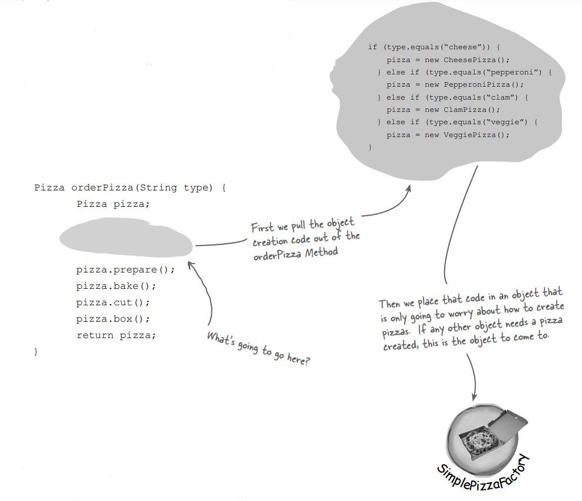
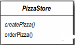

# Baking with OO Goodness

Loosely Coupled nesneleri pişirmeye hazır olun. Nesneleri yaratmak sadece new() operatörünü kullanmaktan daha
fazlasıdır. Instantiation (başlatma), her zaman genel alanda yapılması gereken bir faaliyet olmamalıdır ve sıklıkla
bağlantı sorunlarına yol açabilir. Ve bunu istemezsiniz, değil mi? Factory Desenlerinin sizi utanç verici
bağımlılıklardan kurtarmaya nasıl yardımcı olabileceğini öğrenin.

"new" kelimesini gördüğünüz de "concrete'i" düşünün

Evet, 'new' kullandığınızda kesinlikle concrete bir sınıfın instance'ini oluşturuyorsunuz, bu kesinlikle bir
implementasyon, bir interface değil. Ve bu iyi bir soru; kodunuzu concrete bir sınıfa bağlamak, onu daha kırılgan ve
daha az esnek hale getirebileceğini öğrendiniz.

```Duck duck = new MallardDuck();```

Esnek bir kod elde etmek için interface'leri kullanmak istiyoruz. Ancak bir concrete sınıfın bir instance'ini
oluşturmamız gerekiyor!

İlgili bir dizi concrete sınıfa sahip olduğunuzda, sıklıkla şöyle bir kod yazmak zorunda kalırsınız:

```
Duck duck;

if (picnic) {
    duck = new MallardDuck();
    } else if (hunting) {
        duck = new DecoyDuck();
    } else if (inBathTub) {
        duck = new RubberDuck();
}
```

Çeşitli Duck sınıflarımız var ve hangi sınıfı başlatmamız gerektiğini çalışma zamanına kadar bilmiyoruz.

İşte birkaç concrete sınıfın başlatıldığı bir durum var ve hangisinin başlatılacağı, belirli bir koşul kümesine bağlı
olarak çalışma zamanında belirleniyor. Bu tür kodları gördüğünüzde, değişiklikler veya uzantılar zamanı geldiğinde, bu
kodu yeniden açmanız ve eklenmesi gereken (veya silinmesi gereken) şeyleri incelemeniz gerektiğini biliyorsunuz. Bu tür
kodlar genellikle uygulamanın birkaç bölümünde yer alır ve bakımı ve güncellemeleri daha zor ve hata yapma olasılığını
artırır.

Ancak belirli bir noktada bir nesne oluşturmanız gerekiyor ve Java bize nesne oluşturmanın tek bir yolunu sunuyor, değil
mi? Peki, bu durumda ne yapmalıyız?

"new" de yanlış olan ne var?

Teknik olarak bakıldığında, 'new' ile herhangi bir sorun yoktur çünkü sonuçta bu, Java'nın temel bir parçasıdır. Gerçek
sorun, esasen değişiklik olan ve değişikliğin 'new' kullanımımıza nasıl etki ettiğidir.

Bir interface'e kod yazarak, gelecekte sisteme gelebilecek birçok değişiklikten kendinizi izole edebileceğinizi
biliyorsunuz. Neden mi? Kodunuz bir interface'e yazıldığında, o interface'i implement eden herhangi yeni sınıflarla çok
biçimlilik (polimorfizm) aracılığıyla çalışacaktır. Ancak, birçok concrete sınıf kullanan kodunuz varsa, sorun
arıyorsunuz demektir, çünkü yeni concrete sınıflar eklenirken bu kodun değiştirilmesi gerekebilir. Yani başka bir
deyişle, kodunuz "closed for modification" olmayacak. Yeni concrete türlerle extend etmek için onu yeniden açmanız
gerekecektir.

Peki ne yapabilirsiniz? Bu tür durumlarda, ipuçları aramak için OO Tasarım Prensiplerine geri dönebilirsiniz. Unutmayın,
ilk prensibimiz değişiklikle ilgilidir ve değişen yönleri tanımlamamıza ve sabit kalanlardan ayırmamıza rehberlik eder.

# Identifying the aspects that vary (Farklılık gösteren yerlerin belirlenmesi)

Diyelim ki bir pizza dükkanınız var ve Objectville'deki son teknoloji bir pizza dükkanı sahibi olarak şöyle bir kod
yazmanız gerekebilir:

```
Pizza orderPizza() {
    Pizza pizza = new Pizza();
    pizza.prepare();
    pizza.bake();
    pizza.cut();
    pizza.box();
    return pizza;
}
```

Esneklik açısından, bunun bir abstract sınıf veya interface olmasını istiyoruz, ancak bu ikisini doğrudan instantiate
edemeyiz.

Birden fazla pizza çeşidine ihtiyacınız var? O zaman uygun pizza tProductü belirleyen ve ardından pizzayı yapmaya
başlayan kod eklersiniz:

```
Pizza orderPizza(String type) {
    Pizza pizza;
    
    if (type.equals(“cheese”)) {
        pizza = new CheesePizza();
    } else if (type.equals(“greek”) {
        pizza = new GreekPizza();
    } else if (type.equals(“pepperoni”) {
        pizza = new PepperoniPizza();
    }
    
    pizza.prepare();
    pizza.bake();
    pizza.cut();
    pizza.box();
    return pizza;
}
```

Pizza tProducte bağlı olarak doğru concrete sınıfı oluştururuz ve onu pizza instance variable'ina atarız. Burada her
pizza'nın Pizza interface'ini implemente etmesi gerektiğini unutmayın.

Pizza'yı bir kez elde ettiğimizde, onu hazırlarız (hamuru açarız, sosu koyarız ve üstleri ile peyniri ekleriz), ardından
pişiririz, keseriz ve paketleriz! Her Pizza alt türü (CheesePizza, VeggiePizza vb.) kendini nasıl hazırlayacağını bilir.

# But the pressure is on to add more pizza types

Tüm rakiplerinizin menülerine birkaç trend pizza eklediğini fark edersiniz: Clam Pizza ve Veggie Pizza. Açıkçası
rekabetle adım atmanız gerekiyor, bu yüzden bu öğeleri menünüze ekleyeceksiniz. Ve son zamanlarda çok fazla Greek Pizza
satmıyorsanız, menüden çıkarmaya karar verirsiniz:

Bu kod "closed for modification" değil. Eğer Pizza Dükkanı pizza seçeneklerini değiştirirse, bu kodu değiştirmemiz
gerekecektir. Zamanla pizza seçimi değiştikçe, bu kodu tekrar tekrar değiştirmeniz gerekecektir.

```
pizza.prepare();
pizza.bake();
pizza.cut();
pizza.box();
return pizza;
```

Bu kısmım aynı kalmasını beklediğimiz kısmıdır. Pizza hazırlama, pişirme ve paketleme büyük ölçüde yıllar boyunca aynı
kalmıştır. Bu yüzden bu kodun değişmesini beklemiyoruz, sadece üzerinde çalıştığı pizzaların değişeceğini bekliyoruz.

Açıkça görülüyor ki hangi concrete sınıfın başlatıldığı, orderPizza() metodunu karmaşık hale getiriyor ve değişiklik
için kapalı olmasını engelliyor. Ancak şimdi neyin değişken olduğunu ve neyin sabit kaldığını bildiğimize göre, bunu
encapsulate zamanı geldiğini söyleyebiliriz.

# Encapsulating object creation

Şimdi nesne oluşturmayı orderPizza() metodundan çıkarmamızın daha iyi olacağını biliyoruz. Peki, nasıl yapacağız? İşte
yapacaklarımız, oluşturma kodunu alıp başka bir nesneye taşımak, bu nesnenin yalnızca pizzaları oluşturmayla
ilgileneceği bir nesne oluşturmaktır.



Bu yeni nesnenin bir adı var: ona bir Factory diyoruz. Factory'ler, nesne oluşturmanın ayrıntılarıyla ilgilenirler. Bir
SimplePizzaFactory'ye sahip olduğumuzda, orderPizza() metodumuz yalnızca bu nesnenin bir client'i olur. Bir pizza
gerektiğinde her seferinde pizza factory'e bir tane yapması için istekte bulunur. Artık orderPizza() metodunun Greek
ve Clam pizzaları hakkında bilgi sahibi olması gereken günler geride kaldı. Şimdi orderPizza() methodu, sadece Pizza
interface'ini implement eden bir pizzayı alıp almadığını önemser, böylece prepare(), bake(), cut() ve box() methodlarını
çağırabiliriz.

Henüz burada doldurulacak bazı ayrıntılarımız var; örneğin, orderPizza() metodu oluşturma kodunu neyle değiştirir? Pizza
dükkanı için basit bir factory'i implement edelim ve bulalım...

# Building a simple pizza factory

İlk olarak factory ile başlayalım. Yapmamız gereken, tüm pizzaların nesne oluşturmasını encapsulates eden bir sınıfı
tanımlamaktır. İşte bu sınıf...

```
public class SimplePizzaFactory {
    public Pizza createPizza(String type) {
        
        Pizza pizza = null;
        
        if (type.equals(“cheese”)) {
            pizza = new CheesePizza();
        } else if (type.equals(“pepperoni”)) {
            pizza = new PepperoniPizza();
        } else if (type.equals(“clam”)) {
            pizza = new ClamPizza();
        } else if (type.equals(“veggie”)) {
            pizza = new VeggiePizza();
        }
        
        return pizza;
    }
}
```

İlk olarak, factory'de bir createPizza() methodu tanımlıyoruz. Bu method, tüm client'ların yeni nesneleri instantiate
etmek için kullanacağı methoddur.

Bu kod hala pizzanın tProducte göre parameterized olarak çalışmaktadır, tam olarak orijinal orderPizza() metodumuz gibi.

--**DIALOGS**--

Q : Bunun avantajı nedir? Görünüşe göre sadece sorunu başka bir nesneye aktarır.

A : SimplePizzaFactory'nin birçok client'a sahip olabileceğidir. Sadece orderPizza() methodunu gördük; ancak
PizzaShopMenu sınıfı, factory'i mevcut açıklamaları ve fiyatları için pizzalar almak için kullanabilir. Ayrıca PizzaShop
sınıfımızdan farklı bir şekilde pizzaları işleyen ancak yine de factoryn'nin bir client'ı olan HomeDelivery sınıfımız
olabilir. Yani, pizza oluşturmayı bir sınıfta encapsulate ederek, uygulama kodunda değişiklik yapmanız gerektiğinde
yapmanız gereken tek bir yeriniz vardır. Ayrıca, unutmayın, aynı zamanda client kodumuzdan concrete instantiations'ları
kaldırmak üzereyiz!

Q : Benzer bir tasarımı, bu tür bir factory'nin bir static method olarak tanımlandığı bir yapıda gördüm. Aralarındaki
fark nedir?

A : Bir basit factory'i bir statik method olarak tanımlamak yaygın bir tekniktir ve genellikle "static factory" olarak
adlandırılır. Neden bir statik method kullanılır? Çünkü create methodini kullanmak için bir nesne örneği oluşturmanıza
gerek yoktur. Ancak unutmayın ki, create methodunun behavior'unu alt sınıflandırarak ve değiştirerek değiştiremezsiniz,
bu da bir dezavantaj olabilir.

# Reworking the PizzaStore class

Şimdi müşteri kodumuzu düzeltme zamanı geldi. Pizzaları oluşturmak için factory'e güvenmek istiyoruz. İşte yapılacak
değişiklikler:

```
public class PizzaStore {
    
    SimplePizzaFactory factory;

    public PizzaStore(SimplePizzaFactory factory) {
        this.factory = factory;
    }

    public Pizza orderPizza(String type){
        Pizza pizza;

        pizza = factory.createPizza(type);

        pizza.prepare();
        pizza.bake();
        pizza.cut();
        pizza.box();
        return pizza;
    }
}
```

Şimdi PizzaStore'a bir SimplePizzaFactory referansı veriyoruz. PizzaStore, factory'i constructor method aracılığıyla
alır.

Ve orderPizza() methodu, siparişin tProductü sadece ileterek pizzalarını oluşturmak için factory'i kullanır.

Dikkat edin, "new" operatörünü factory nesnesindeki bir create methoduyla değiştirdik. Artık burada concrete
instantiations yok!

# The Simple Factory defined

SimpleFactory aslında bir Tasarım Deseni değil, daha çok bir programlama idiyomudur. Bazı geliştiriciler bu idiyomu "
Factory Deseni" ile karıştırır.

Sadece SimpleFactory gerçek bir desen olmasa da, nasıl bir araya getirildiğini incelemememiz gerektiği anlamına gelmez.
Yeni PizzaStore'un sınıf diyagramına bir göz atalım:


Factory'nin Client'i PizzaStore'dur. PizzaStore, artık pizza instance'larını almak için SimplePizzaFactory üzerinden
geçer.

SimplePizzaFactory : pizzaları oluşturduğumuz factory'dir; uygulamamızın concrete Pizza sınıflarına başvuran tek bölümü
olmalıdır. create methodu genellikle statik olarak tanımlanır.

Pizza : Bu, factory'nin product'ıdır. Pizza'yı bazı yardımcı uygulamalar içeren bir abstract sınıf olarak tanımladık ve
bu implementasyonların overridden olduğunu belirttik.

CheesePizza, VeggiePizza, ClamPizza, PepperonPizza Bunlar, concrete product'larımızdır. Her product, Pizza interface'ini
implement etmelidir (bu durumda "abstract Pizza sınıfını extends etmek" anlamına gelir) ve concrete olmalıdır. Bu koşul
karşılandığı sürece, factory tarafından oluşturulabilir ve client'a teslim edilebilir.

SimpleFactory'i bir hazırlık olarak düşünebilirsiniz. Bir sonraki aşamada, her ikisi de factory'ler olan iki yoğun
deseni keşfedeceğiz. Ancak endişelenmeyin, daha fazla pizza var gelecek!

Bir hatırlatma daha: tasarım desenlerinde "bir interface'i implements etmek" ifadesi HER ZAMAN "Java interface'ini
implements eden bir sınıf yazmak, sınıf bildiriminde "implements" anahtar kelimesini kullanmak" anlamına gelmez.
Genel kullanım bağlamında, bir concrete sınıfın bir üst tProduct (bir sınıf veya interface olabilir) methodunu implement
etmesi, hala bu üst tProduct "interface'ini implemente etmek" olarak kabul edilir.

# Franchising the pizza store

Objectville PizzaStore'ünüz o kadar başarılı oldu ki rekabeti alt etti ve şimdi herkes kendi mahallesinde bir PizzaStore
istiyor. Franchise veren olarak, franchise operasyonlarının kalitesini sağlamak istiyorsunuz, bu yüzden onların zamanla
test edilmiş kodunuzu kullanmasını istiyorsunuz.

Ancak bölgesel farklılıklar ne olacak? Her franchise, franchise mağazasının bulunduğu yere ve yerel pizza uzmanlarının
tatlarına bağlı olarak farklı pizza tarzları sunmak isteyebilir (New York, Chicago ve California gibi birkaç örnek
verilebilir).


Tüm franchise pizza mağazalarının, pizzaların aynı şekilde hazırlandığından yararlanmasını istiyorsunuz, bu yüzden
PizzaStore kodunuzu kullanmalarını istiyorsunuz.

Bir franchise, NY tarzı pizzaları yapan bir factory istiyor: ince hamur, lezzetli sos ve sadece az miktarda peynir
içeren pizzalar.

Başka bir franchise, Chicago tarzı pizzaları yapan bir factory istiyor; müşterileri kalın hamurlu, bol soslu ve bol
peynirli pizzaları tercih ediyorlar.

Görülen bir yaklaşım... Eğer SimplePizzaFactory'i çıkarır ve üç farklı factory oluşturursak (NYPizzaFactory,
ChicagoPizzaFactory ve CaliforniaPizzaFactory), o zaman sadece PizzaStore'u uygun factory ile birleştirebiliriz ve bir
franchise işlem yapmaya hazır olur. Bu bir yaklaşım.

```
NYPizzaFactory nyFactory = new NYPizzaFactory();
PizzaStore nyStore = new PizzaStore(nyFactory);
nyStore.order(“Veggie”);
```

İşte NY tarzı pizzalar yapmak için bir factory oluşturuyoruz. Sonra bir PizzaStore oluşturuyoruz ve ona NY factory'sine
bir referans iletiyoruz. Ve pizza yaparken NY tarzı pizzalar elde ediyoruz.

```
ChicagoPizzaFactory chicagoFactory = new ChicagoPizzaFactory();
PizzaStore chicagoStore = new PizzaStore(chicagoFactory);
chicagoStore.order(“Veggie”);
```

Aynı şekilde Chicago pizza mağazaları için: Chicago pizzaları için bir factory oluştururuz ve bir Chicago factory'si ile
composed edilmiş bir mağaza oluştururuz. Pizza yaparken Chicago tarzı olanları elde ederiz.

Ancak biraz daha kalite kontrol istiyorsunuz gibi görünüyor... Bu nedenle SimpleFactory fikrini test ettiğinizde
bulduğunuz şey, franchise'ların pizzaları oluşturmak için factory'nizi kullanmalarına rağmen, geri kalan süreç için
kendi özel prosedürlerini kullanmaya başladıklarıydı: farklı şekillerde pişiriyorlardı, pizzayı kesmeyi unutuyorlardı ve
3rd party kutularını kullanıyorlardı.

Problemi tekrar düşündüğünüzde, aslında mağazayı ve pizza oluşturmayı bir araya getiren ancak esnekliği korumayı
sağlayan bir framework oluşturmak istediğinizi görüyorsunuz.

Early code'da, SimplePizzaFactory öncesi, pizza yapma kodu PizzaStore'a bağlıydı, ancak esnek değildi. Peki, hem
pizzamızı yemek hem de onu korumak için ne yapabiliriz?

# A framework for the pizza store

Pizza yapımıyla ilgili tüm faaliyetleri PizzaStore sınıfına yerelleştirmenin, aynı zamanda şubelere kendi bölgesel
tarzlarını sürdürme özgürlüğü vermenin bir yolu vardır. Ne yapacağız, createPizza() methodunu PizzaStore'a geri
koyacağız, ancak bu sefer abstract bir method olarak eklemek ve ardından her bölgesel tarz için bir PizzaStore alt
sınıfı oluşturacağız. İlk olarak, PizzaStore'daki değişikliklere bakalım.

```
public abstract class PizzaStore {
    public Pizza orderPizza(String type){

        Pizza pizza;

        pizza = createPizza(type);

        pizza.prepare();
        pizza.bake();
        pizza.cut();
        pizza.box();
        return pizza;
    }

    abstract Pizza createPizza(String type);
}
```

PizzaStore şimdi abstract;

Şimdi createPizza, bir factory nesnesindeki bir method çağrısı olmaktan çıkıp doğrudan PizzaStore içindeki bir method
çağrısı olarak geri döndü.

```abstract Pizza createPizza(String type);``` Şimdi factory nesnemizi bu methoda taşıdık. Artık "factory methodu"
PizzaStore içinde abstract bir methoddur

Şimdi alt sınıfları bekleyen bir mağazamız var; her bölgesel tür için bir alt sınıfımız olacak (NYPizzaStore,
ChicagoPizzaStore, CaliforniaPizzaStore) ve her alt sınıf, bir pizzanın ne oluşturduğuna karar verme görevini
üstlenecektir. Bunun nasıl çalışacağını görelim.

# Allowing the subclasses to decide

Hatırlayın, PizzaStore'un zaten orderPizza() methodunda iyi ayarlanmış bir sipariş sistemi bulunuyor ve bunun tüm
şubeler arasında tutarlı olmasını istiyorsunuz. Bölgesel PizzaStore'lar arasında değişen şey, yapmakta oldukları
pizzaların tarzıdır - New York Pizza ince hamur, Chicago Pizza kalın hamur ve benzerleri - ve tüm bu farklılıkları
createPizza() methoduna iteleyip doğru türde pizzayı oluşturma sorumluluğunu ona veriyoruz. Bunu yapmanın yolu,
PizzaStore'un her alt sınıfının createPizza() methodunun nasıl görüneceğini tanımlamasına izin vermektir. Bu nedenle
PizzaStore'un concrete alt sınıflarına sahip olacağız, her biri kendi pizza varyasyonlarına sahip olacak ve hepsi
PizzaStore framework'unun içine uyacak ve yine de iyi ayarlanmış orderPizza() methodunu kullanacaktır.


Her alt sınıf, createPizza() methodunu override eder, ancak tüm alt sınıflar PizzaStore'da tanımlanan orderPizza()
methodunu kullanır. Eğer istenirse, bu behavior'u zorlamak için orderPizza() methodunu final yapabiliriz.

Bir franchise müşterileri için NY tarzı pizzalar istiyorsa, kendi createPizza() methoduna sahip olan NY alt sınıfını
kullanır ve bu alt sınıf NY tarzı pizzaları oluşturur.

Benzer şekilde, Chicago alt sınıfını kullanarak, Chicago malzemeleriyle createPizza() methodunun implementation'ınını
elde ederiz.

Unutmayın: createPizza() PizzaStore içinde abstract bir methoddur, bu nedenle tüm pizza mağazası alt türleri bu methodu
IMPLEMENT ETMEK ZORUNDADIR.



Anlamıyorum. PizzaStore alt sınıfları sadece alt sınıflar. Herhangi bir şeye nasıl karar veriyorlar?
NYStylePizzaStore'da mantıklı bir karar verme kodu göremiyorum....

PizzaStore'un orderPizza() methodu açısından düşünün: Bu method, abstract PizzaStore içinde tanımlanır, ancak concrete
tipler sadece alt sınıflarda oluşturulur

orderPizza() methodu abstract PizzaStore sınıfında tanımlanmıştır, alt sınıflar değil. Bu nedenle, bu methodun hangi alt
sınıfın kodu çalıştırdığını ve pizzaları hazırladığının bilgisi yoktur.

Bunu biraz daha ileri taşımak için, orderPizza() methodu bir Pizza nesnesiyle birçok işlem yapar (hazırla, pişir,
dilimle, kutula), ancak Pizza abstract olduğundan, orderPizza() hangi gerçek concrete sınıfların dahil olduğunu bilmez.
Yani, başka bir deyişle, bu method bağımsızdır (decoupled)!

orderPizza() createPizza() methodunu çağırarak aslında bir pizza nesnesi alır. Ancak hangi tür pizza alınacak?
orderPizza() methodu karar veremez; nasıl yapılacağını bilmez. Peki, kim karar verir?

orderPizza() createPizza() methodunu çağırdığında, alt sınıflardan biri devreye girer ve bir pizza oluşturur. Hangi tür
pizza yapılacak? İşte bu, sipariş verdiğiniz pizza dükkanının seçimine bağlıdır: NYStylePizzaStore veya
ChicagoStylePizzaStore.

Öyleyse, alt sınıflar gerçek zamanlı bir karar mı veriyor? Hayır, ancak orderPizza() methodunun perspektifinden
bakıldığında, eğer bir NYStylePizzaStore seçtiyseniz, o alt sınıf hangi pizza'nın yapılacağını belirler. Yani alt
sınıflar gerçekten "karar vermiyor" - kararı hangi dükkanı seçtiyseniz siz veriyorsunuz - ancak hangi tür pizza'nın
yapılacağını belirliyorlar.

# Let’s make a PizzaStore

Franchise olmanın avantajları var. Tüm PizzaStore işlevselliğini ücretsiz olarak alırsınız. Bölgesel dükkanların yapması
gereken tek şey PizzaStore sınıfını alt sınıf yapmak ve kendi Pizza tarzlarını uygulayan bir createPizza() methodu
sağlamaktır. Franchise sahipleri için büyük üç pizza tarzını biz hallederiz. İşte New York bölgesel tarzı:

```
public class NYPizzaStore extends PizzaStore {
    @Override
    Pizza createPizza(String item) {
        if (item.equals("cheese")) {
            return new NYStyleCheesePizza();
        } else if (item.equals("veggie")) {
            return new NYStyleVeggiePizza();
        } else if (item.equals("clam")) {
            return new NYStyleClamPizza();
        } else if (item.equals("pepperoni")) {
            return new NYStylePepperoniPizza();
        } else return null;
    }
}
```

createPizza() bir Pizza döndürür ve alt sınıf, hangi concrete Pizza instance'ini oluşturacağı konusunda tamamen
sorumludur. PizzaStore içinde abstract bir şekilde tanımlandığı için createPizza() methodunu implement etmemiz gerekiyor
If block'ları içerisinde concrete sınıflarımızı oluşturuyoruz. Her tür Pizza için NY tarzını oluşturuyoruz.

Unutmayın ki üst sınıftaki orderPizza() methodu, hangi Pizza'yı oluşturduğumuz hakkında hiçbir fikre sahip değil; sadece
onu hazırlayabileceğini, pişirebileceğini, dilimleyebileceğini ve kutlayabileceğini biliyor!

# Declaring a factory method

PizzaStore'a yaptığımız sadece birkaç dönüşümle, concrete sınıflarımızın instantiation'ınını bir nesnenin
üstlenmesinden, şimdi bu sorumluluğu üstlenen bir dizi alt sınıfa geçtik. Biraz daha yakından inceleyelim:

```
public abstract class PizzaStore {
    public Pizza orderPizza(String type){

        Pizza pizza;

        pizza = createPizza(type);

        pizza.prepare();
        pizza.bake();
        pizza.cut();
        pizza.box();
        return pizza;
    }

    abstract Pizza createPizza(String type);
}
```

PizzaStore'un alt sınıfları, createPizza() methodu içinde nesne oluşturmayı bizim için yönetirler.

```abstract Pizza createPizza(String type);``` Pizzaları instantiating ile ilgili tüm sorumluluk, bir factory gibi işlev
gören bir methoda taşınmıştır. Factory method nesne oluşturmayı ele alır ve bunu bir alt sınıfta encapsulate eder. Bu,
üst sınıftaki client kodunu alt sınıftaki nesne oluşturma kodundan bağımsız hale getirir.

Bir factory methodu, bir Productün çeşitli varyasyonları arasında seçim yapmak için parameterized ```(String type)```
olarak kullanılabilir (veya kullanılmayabilir).

Bir factory methodu abstract olduğu için alt sınıflar nesne oluşturmayı ele alması beklenir

Bir factory methodu genellikle üst sınıfta tanımlanan methodlar içinde kullanılan bir Product (Product) döndürür.

Bir factory methodu, client'i (üst sınıftaki kodu, örneğin orderPizza()) gerçekte hangi tür concrete Productün
oluşturulduğunu bilmekten izole eder.

# Let’s see how it works: ordering pizzas with the pizza factory method


Peki nasıl sipariş veriyorlar?

1 - İlk olarak, Joel ve Ethan bir PizzaStore instance'ina ihtiyaç duyarlar. Joel, bir ChicagoPizzaStore instance'i
oluşturmalıdır ve Ethan bir NYPizzaStore instance'i oluşturmalıdır.

2 - PizzaStore'a sahip olduktan sonra, hem Ethan hem de Joel orderPizza() methodunu çağırır ve istedikleri pizza
tProductü (peynirli, sebzeli vb.) geçirirler.

3 - Pizzaları oluşturmak için, createPizza() methodu çağrılır, bu method NYPizzaStore ve ChicagoPizzaStore alt
sınıflarında tanımlanmıştır. Bizim tanımladığımız şekilde, NYPizzaStore NY tarzı bir pizza instance'i oluştururken ve
ChicagoPizzaStore Chicago tarzı bir pizza instance2i oluştururken, her iki durumda da Pizza orderPizza() methoduna geri
döndürülür.

4 - orderPizza() methodu oluşturulan pizzanın tProductü bilmez, ancak bir pizza olduğunu bilir ve onu Ethan ve Joel için
hazırlar, pişirir, dilimler ve kutular.

# Let’s check out how these pizzas are really made to order...

1 - Ethan'ın siparişini takip edelim: İlk olarak bir NY PizzaStore'a ihtiyacımız var:

```PizzaStore nyPizzaStore = new NYPizzaStore();``` NYPizzaStore için bir instance create et

2 - Şimdi bir dükkanımız olduğuna göre, bir sipariş alabiliriz:

```nyPizzaStore.orderPizza(“cheese”);```

orderPizza() methodu nyPizzaStore instance'inda çağrılır (PizzaStore içinde tanımlanan method çalışır).

3 - orderPizza() methodu daha sonra createPizza() methodunu çağırır:

```Pizza pizza = createPizza(“cheese”);```

Unutmayın ki createPizza(), yani factory methodu, alt sınıfta uygulanır. Bu durumda bir NY Peynirli Pizza döndürüyor.

4 - Sonunda hazırlanmamış pizza elimizde ve orderPizza() methodu onu hazırlamayı tamamlar:

```
pizza.prepare();
pizza.bake();
pizza.cut();
pizza.box();
```

orderPizza() methodu, tam olarak hangi concrete sınıf olduğunu bilmeden bir Pizza alır.

Tüm bu methodlar, NYPizzaStore içinde tanımlanan createPizza() factory methodu tarafından döndürülen özel pizzada
tanımlanmıştır.


# We’re just missing one thing: PIZZA!

Pizzasız bir PizzaStore pek popüler olmayacak, o yüzden onları implement edelim:

```
public abstract class Pizza {
    String name;
    String dough; // hamur
    String sauce; // sos

    ArrayList<String> toppings = new ArrayList<>(); // üst malzemeler

    void prepare() {
        System.out.println("Preparing " + name);
        System.out.println("Tossing dough...");
        System.out.println("Adding sauce");
        System.out.println("Adding toppings");

        for (int i = 0; i < toppings.size(); i++) {
            System.out.println("   " + toppings.get(i));
        }
    }

    void bake(){
        System.out.println("Bake for 25 minutes at 350");
    }

    void cut(){
        System.out.println("Cutting the pizza into diagonal slices");
    }

    void box(){
        System.out.println("Place pizza in official PizzaStore box");
    }

    public String getName() {
        return name;
    }
}
```

Bir abstract Pizza sınıfıyla başlayacağız ve tüm concrete pizzalar bundan türeyecek.

Her Pizza'nın bir name'i, bir dough (hamur) çeşidi, bir sauce (sos) çeşidi ve bir dizi toppings (malzemesi) vardır.

Abstract sınıf, bake, cut ve box için bazı temel varsayılanlar sağlar. Preperation belirli bir sırayla birkaç adımı
takip eder.

# Now we just need some concrete subclasses... how about defining New York and Chicago style cheese pizzas?

```
public class NYStyleCheesePizza extends Pizza{

    public NYStyleCheesePizza() {
        name = "NY Style sauce and cheese pizza";
        dough = "Thin Crust Dough";
        sauce = "Marinara sauce";

        toppings.add("Grated Reggiano Cheese");
    }
    
}
```

NYStyle Pizza'nın kendi marinara tarzı sosu ve ince hamuru vardır. Ve bir malzeme olarak reggiano peyniri!

```
public class ChicagoStyleCheesePizza extends Pizza{
    
    public ChicagoStyleCheesePizza() {
        name = "Chicago Style Deep Dish Cheese Pizza";
        dough = "Extra Thick Crust Dough";
        sauce = "Plum Tomato Sauce";

        toppings.add("Shredded Mozzarella Cheese");
    }

    @Override
    void cut() {
        System.out.println("Cutting the pizza into square slices");
    }
    
}
```

Chicago Pizza, ekstra kalın hamur ile birlikte erik domatesleri kullanır.

Chicago tarzı derin taban pizza, bol miktarda mozzarella peyniri içerir!

Chicago tarzı pizza, parçaların kareler halinde kesilir ve cut() methodunu override eder

# You’ve waited long enough, time for some pizzas!

```
public class PizzaTestDrive {

    public static void main(String[] args) {
        PizzaStore nyStore = new NYPizzaStore();
        Pizza pizza = nyStore.orderPizza("cheese");
        System.out.println("Ethan ordered a " + pizza.getName());
    }
    
}
```

# It’s finally time to meet the Factory Method Pattern

Tüm factory desenleri nesne oluşturmayı kapsar. Factory Method Deseni, alt sınıfların hangi nesneleri oluşturacağını
belirlemelerine izin vererek nesne oluşturmayı kapsüller. Bu desenin içinde kimlerin rol aldığını görmek için bu sınıf
diyagramlarına bir göz atalım:

### The Creator classes


Bu, abstract bir creator sınıfımızdır. Alt sınıfların product üretmek için implemente ettiği abstract bir factory
methodu tanımlar. Sıklıkla creator, bir alt sınıf tarafından üretilen concrete bir product'a bağımlı olan kod içerir.
Creator aslında hangi concrete product'ın üretildiğini asla bilmez.

createPizza() methodu, factory methodudur. Product'ları üretir.

Her franchise, kendi PizzaStore alt sınıfını aldığı için, kendi pizza tarzını createPizza() methodunu implement ederek
özgürce oluşturabilir.

Product üreten sınıflar "concrete creators" olarak adlandırılır.

### The Product classes


Factory'ler Product'ları üretir ve PizzaStore içinde Product'ımız bir Pizzadır.


Yukarıdaki resimdekinler concrete Product'lardır - dükkanlarımız tarafından üretilen tüm pizzalardır.

# Another perspective: parallel class hierarchies

Gördük ki factory method, bir factory methodu ile combined edilen orderPizza() methodunu sağlayarak bir framework sunar.
Bu deseni bir framework olarak görmek için başka bir yol, her creator'a Product bilgisini encapsule etme şeklinde
açıklanabilir.

İki paralel sınıf hiyerarşisine bakalım ve nasıl ilişkilendiklerini görelim:


Bu sınıf hiyerarşilerinin nasıl paralel olduğuna dikkat edin: her ikisi de abstract sınıfları içerir ve bu abstract
sınıflar, NY ve Chicago için belirli implementasyonları bilen concrete sınıflar tarafından extends edilir

NYPizzaStore, NY tarzı pizza yapmanın tüm bilgisini encapsulate eder.

ChicagoPizzaStore, Chicago tarzı pizza yapma bilgisini encapsulate eder.

Factory method, bu bilgiyi encapsulating etmek için anahtardır.

# Factory Method Pattern defined

Factory Methodu Deseni'nin resmi tanımını sunma zamanı geldi:

Factory Method Deseni, bir nesne oluşturmak için bir interface tanımlar, ancak alt sınıfların hangi sınıfın
instance'inin oluşturacağına karar vermesine izin verir. Factory Method, bir sınıfın instantiation işini alt sınıflara
defer etmesine izin verir.

Her factory gibi, Factory Methodu Deseni bize concrete tiplerin instantiations'larını encapsule etmemiz için bir yol
sunar. Aşağıdaki sınıf diyagramına baktığınızda, Abstract Creator size nesneler oluşturmak için bir method içeren bir
interface sunar, bu method aynı zamanda "factory method" olarak bilinir. Abstract Creator'da implemente edilen diğer
methodlar, factory methodu tarafından üretilen Product'lar üzerinde çalışacak şekilde yazılır. Yalnızca alt sınıflar
factory methodunu gerçekten implemente ederler ve Product'ları oluştururlar.

Resmi tanıma benzer şekilde, geliştiriciler sıklıkla Factory Methodu'nun alt sınıfların hangi sınıfı instantiate
edeceğine karar vermesine izin verdiğini söylerler. Decides (karar verir) derler çünkü desen alt sınıfların çalışma
zamanında kendilerinin karar vermesine izin vermez, ancak Creator sınıf, oluşturulacak gerçek Product'lardan bilgisiz
bir şekilde yazıldığı için, kullanılan alt sınıf seçimine bağlı olarak sadece alt sınıflar tarafından implemente edilir.


Product : Tüm Product'lar, product'ları kullanan sınıfların concrete sınıf yerine interface'e başvurabilmesi için aynı
interface'i implemente etmelidir

Creator : Factory method hariç tüm Product'ları manipüle etmek için gerekli olan tüm methodların implementasyonlarını
içeren bir sınıftır. Abstract factory methodu (factoryMethod()), tüm Creator alt sınıflarının implemente etmesi gereken
bir methoddur.

ConcreteCreator : Gerçekte Product'ları üreten factory methodunu (factoryMethod()) implemente eder. ConcreteCreator
bir veya daha fazla concrete product oluşturmakla sorumludur. Bu Product'ları nasıl oluşturacağına dair bilgiye
sahip tek sınıftır.

--**DIALOGS**--

Q : Yalnızca bir ConcreteCreator'ınız olduğunda Factory Method Pattern'in avantajı nedir?

A : Factory Methodu Deseni, yalnızca bir concrete creator'a sahipseniz faydalıdır, çünkü Product'ın implementasyonunu
kullanımından ayırmış olursunuz. Ek Product'lar eklerseniz veya bir Product'ın implementasyonunu değiştirirseniz,
Creator'ınıza herhangi bir etkisi olmaz (çünkü Creator, herhangi bir Concrete Product'la tightly coupled değildir).

Q : NY ve Chicago mağazalarımızın SimpleFactory kullanılarak hayata geçirildiğini söylemek doğru olur mu? Tıpkı ona
benziyorlar.

A : Bu iki yaklaşım benzerdir, ancak farklı şekillerde kullanılırlar. Her concrete mağaza implementasyonu
SimplePizzaFactory'ye çok benziyor gibi görünse de, unutmayın ki concrete mağazalar, createPizza() methodunu abstract
bir method olarak tanımlayan bir sınıfı extends etmektedir. Her mağaza, createPizza() methodunun behavior'unu
tanımlamakla yükümlüdür. SimpleFactory yaklaşımında, factory PizzaStore ile composed edilen başka bir nesnedir.

Q : Factory methodu ve Creator hep abstract mı olmalı?

A : Hayır, concrete bir Product üretmek için varsayılan bir factory methodu tanımlayabilirsiniz. Böylece, Creator'ın
alt sınıfları olmasa bile her zaman bir Product yaratma aracınız olur.

Q : Her mağaza, geçilen türe dayalı olarak dört farklı türde pizza yapabilir. Tüm concrete creator'lar birden fazla
Product'mı yapar, yoksa bazen sadece bir tane mi yaparlar?

A : Implement ettiğimiz şey, parameterized factory method olarak bilinen şeydir. Bir parametreye dayalı olarak birden
fazla nesne yaratabilir, fark ettiğiniz gibi. Ancak genellikle bir factory sadece bir nesne üretir ve parametre
almayabilir. Her ikisi de desenin geçerli biçimleridir.

Q : Parameterized tipleriniz "type-safe" gibi görünmüyor. Sadece bir String geçiriyorum! Eğer "CalmPizza" istesem ne
olurdu?

A : Kesinlikle doğru söylüyorsunuz ve bu, iş dünyasında "runtime error" olarak adlandırdığımız bir soruna neden
olurdu. Parametreleri daha "type-safe" hale getirmek için kullanabileceğiniz daha sofistike birkaç teknik
bulunmaktadır veya başka bir deyişle, parametre hatalarını derleme zamanında yakalamak için kullanılabilir. Örneğin,
parametre tiplerini temsil eden nesneler oluşturabilir, statik sabitleri kullanabilir veya Java 5'te enumlar
kullanabilirsiniz.

Q : Aradaki fark konusunda kafam hala biraz karışık. SimpleFactory ve Factory Method arasında. Factory Method'da pizzayı
döndüren sınıfın bir alt sınıf olması dışında birbirlerine çok benzerler. Açıklayabilir misin?

A : Alt sınıfların SimpleFactory'e çok benzediği konusunda haklısınız, ancak SimpleFactory'yı bir seferlik bir işlem
olarak düşünün, Factory Method ile alt sınıfların hangi implementasyonu kullanılacağına karar vermesine izin veren bir
framework oluşturduğunuzu düşünün. Örneğin, Factory Method'daki orderPizza() methodu, bir pizzayı oluşturmak için bir
factory methoda dayanan genel bir framework sağlar. Pizza yapımında kullanılan concrete sınıfları gerçekten oluşturur.
PizzaStore sınıfını alt sınıflandırarak, orderPizza() tarafından döndürülen pizzanın yapımında hangi concrete
Productlerin
kullanılacağına siz karar verirsiniz. SimpleFactory ile karşılaştırırsanız, nesne oluşturmayı encapsule etmenin bir
yolunu verir, ancak Factory Method'un esnekliğini vermez çünkü oluşturduğunuz Product'ları değiştirmenin bir yolu
yoktur.

--**DIALOGS**--

Usta : Çekirge, eğitimin nasıl gidiyor, bana anlat.

Öğrenci: Usta, encapsulate what varies (ne değişken ise kapsayın) ilkesi üzerine olan çalışmalarımı daha da ileriye
taşıdım.

Usta : Devam et!

Öğrenci : Öğrendim ki nesneleri oluşturan kodu da encapsulate edebiliriz. Concrete sınıfları instantiates ettiğimizde,
bu sıkça değişen bir alandır. "factory" olarak adlandırılan bir teknik öğrendim ve bu instantiaon'ının behavior'unu
encapsule etmememize olanak tanır.

Usta : Ve bu "factory," ne gibi faydalar sağlar?

Öğrenci : Bunların birçok faydası var. Tüm oluşturma kodumu bir nesne veya methodda toplayarak kodumda tekrarı önlerim
ve bakım yapmak için tek bir yer sağlarım. Bu aynı zamanda client'ların nesneleri instatiate etmek için gerekli olan
concrete sınıflar yerine yalnızca interface'lerden bağımlı olmaları anlamına gelir. Çalışmalarım sırasında öğrendiğim
gibi, bu, bir implementasyona değil bir interface programlama yapmamı sağlar ve bu da kodumu gelecekte daha esnek ve
genişletilebilir hale getirir.

Usta : Evet, çekirge, nesne yönelimli programlama içgüdüleriniz gelişiyor gibi görünüyor. Bugün benim için herhangi bir
sorunuz var mı?

Öğrenci : Usta, nesne oluşturmayı encapsulate ederek abstraction'lara kod yazdığımı ve client kodumu gerçek
implementasyonlardan ayırdığımı biliyorum. Ancak factory kodum hala gerçek nesneleri instantiate etmek için concrete
sınıfları kullanmalıdır. Kendi kendime bir oyun mu oynuyorum?

Usta : Çekirge, nesne oluşturma hayatın bir gerçeğidir; nesneleri oluşturmalıyız, aksi takdirde tek bir Java programı
bile oluşturamayız. Ancak, bu gerçeği bilerek, kodumuzu tasarlayabiliriz, böylece bu oluşturma kodunu, gözlerinizi
kapattığınız koyunun yünü gibi kontrol altına almış oluruz. Bir kez kontrol altına alındığında, oluşturma kodunu
koruyabilir ve bakımını yapabiliriz. Eğer oluşturma kodumuzu serbest bırakırsak, o zaman "yününü" asla toplayamayız.

Öğrenci : Usta, bunun gerçek olduğunu görüyorum.

# A very dependent PizzaStore

Haydi, bir OO (Object-Oriented) factory'sini hiç duymamış gibi davranalım. Aşağıda bir factory kullanmayan PizzaStore'un
bir sürümü verilmiştir; bu sınıfın bağımlı olduğu concrete pizza nesnelerinin sayısını hesaplayın. Bu PizzaStore'a
California tarzı pizzalar eklediğinizde, o zaman kaç nesneye bağımlı olurdu?

```
public class DependentPizzaStore {
    public Pizza createPizza(String style, String type) {
    
        Pizza pizza = null;
        
        if (style.equals(“NY”)) {
            if (type.equals(“cheese”)) {
                pizza = new NYStyleCheesePizza();
            } else if (type.equals(“veggie”)) {
                pizza = new NYStyleVeggiePizza();
            } else if (type.equals(“clam”)) {
                pizza = new NYStyleClamPizza();
            } else if (type.equals(“pepperoni”)) {
                pizza = new NYStylePepperoniPizza();
            }
        } else if (style.equals(“Chicago”)) {
            if (type.equals(“cheese”)) {
                pizza = new ChicagoStyleCheesePizza();
            } else if (type.equals(“veggie”)) {
                pizza = new ChicagoStyleVeggiePizza();
            } else if (type.equals(“clam”)) {
                pizza = new ChicagoStyleClamPizza();
            } else if (type.equals(“pepperoni”)) {
                pizza = new ChicagoStylePepperoniPizza();
            }
        } else {
            System.out.println(“Error: invalid type of pizza”);
            return null;
        }
        
        pizza.prepare();
        pizza.bake();
        pizza.cut();
        pizza.box();
        return pizza;
    }
}
```

# Looking at object dependencies

Doğrudan bir nesne instance'i oluşturduğunuzda, bu nesnenin concrete sınıfına bağımlı hale geliyorsunuz. Bir sayfa
önceki oldukça bağımlı PizzaStore örneğimize bir göz atın. PizzaStore sınıfının içinde pizza nesnelerini doğrudan
oluşturuyor, bunun yerine bir factory'e iletmiyor. Eğer PizzaStore'un bu sürümünü ve ona bağımlı olan tüm nesneleri
temsil eden bir diyagram çizersek, işte böyle görünüyor:


Bu sınıfların implementasyonları değişirse, o zaman PizzaStore sınıfını da değiştirmemiz gerekebilir.

Bu PizzaStore sürümü, bu pizza nesnelerine bağımlıdır, çünkü bunları doğrudan oluşturur.

Pizza implemetasyonlarının concrete implementasyonlarında yapılacak herhangi bir değişiklik, PizzaStore'u etkilediğinde,
PizzaStore'un pizza implementasyonlarına "bağımlı" olduğunu söyleyebiliriz.

Eklediğimiz her yeni pizza türü, PizzaStore için başka bir bağımlılık yaratır.

# The Dependency Inversion Principle

Kodumuzdaki concrete sınıflara olan bağımlılıkları azaltmanın "iyi bir şey" olduğu açıktır. Aslında, bu kavramı
resmileştiren bir nesne yönelimli tasarım ilkesine sahibiz; hatta büyük, resmi bir adı bile var: Dependency Inversion
Principle. İşte genel prensip:

**Abstraction'lara bağımlı olun. Concrete sınıflara bağımlı olmayın.**


Başlangıçta, bu prensip "Program to an interface, not an implementation" gibi görünüyor, değil mi? Benzerdir; ancak
Dependency Inversion Principle, abstraction hakkında daha da güçlü bir ifade yapar.

Bu, high-level componentlerimizin low-level componentlerimize bağımlı olmaması gerektiğini, bunun yerine her ikisinin
de abstraction'lara bağımlı olması gerektiğini önerir. Peki, bu ne anlama geliyor?

Neyse, önce bir önceki sayfadaki pizza dükkanı diyagramına tekrar göz atarak başlayalım. PizzaStore, "high-level
componentimiz" ve pizza implementasyonları "low-level componentlerimiz"dir ve açıkça PizzaStore'un concrete pizza
sınıflarına bağımlı olduğunu göstermektedir.

Şimdi, bu prensip bize kodumuzu abstractionları, concrete sınıflara bağımlı olmadan yazmamız gerektiğini söyler. Bu, hem
high-level modüllerimiz için hem de low-level modüllerimiz için geçerli olan bir ilkedir.

Peki, bunu nasıl yaparız? Bu ilkeyi Very Dependent PizzaStore uygulamamıza nasıl uygulayacağımızı düşünelim...

Bir high-level component, behavior'u diğer "low-level" componentlere göre tanımlanan bir sınıftır. Örneğin, PizzaStore,
behavior'u pizzalarla ilişkilendirilen bir high-level componentdir - farklı pizza nesnelerini oluşturur, hazırlar,
pişirir, keser ve paketler, bu sırada kullandığı pizzalar low-level componentlerdir.

# Applying the Principle

Çok Bağımlı PizzaStore'un temel sorunu, her tür pizzaya bağımlı olmasıdır, çünkü orderPizza() methodunda concrete
tipleri gerçekten instantiates eder.

Bir abstraction olan Pizza'yı oluşturduk, ancak yine de bu kodda concrete Pizza'ları oluşturuyoruz, bu nedenle bu
abstraction'dan pek fazla yararlanamıyoruz.

Bu instantiations'ları orderPizza() methodunun dışına nasıl çıkarabiliriz? İşte, Factory Method bunu yapmamıza izin
verir. Dolayısıyla Factory Method'u uyguladıktan sonra diyagramımız şöyle görünüyor:


Şimdi PizzaStore, yalnızca Pizza adlı abstract sınıfa bağımlıdır.

Pizza, abstract bir sınıftır... bir abstraction

Concrete pizza sınıfları da Pizza abstraction'ına bağımlıdır, çünkü Pizza abstract sınıfında Pizza interface'ini
implement ederler (hatırlatmak gerekirse, "interface" terimini genel anlamıyla kullanıyoruz).

Factory Method'u implement ettikten sonra, high-level componentimiz olan PizzaStore ve low-level componentlerimiz olan
Pizzaların her ikisi de abstraction olan Pizza'ya bağımlıdır. Dependency Inversion Principle'a uymak için
kullanabileceğiniz tek teknik Factory Method değildir, ancak daha güçlü tekniklerden biridir.

Tamam, dependency (bağımlılık) kısmını anladım ama neden buna dependency inversion deniyor?

Dependency Inversion Principle İlkesi'ndeki "inversion (tersine çevirme)" nerede?

"Dependency Inversion Principle" adındaki "inversion" ifadesi, genellikle OO tasarımınızı düşünme şeklinizi
tersine çevirdiği için kullanılır. Bir önceki sayfadaki diyagrama bakın, low-level componentlerin şimdi daha yüksek
seviyeli bir abstraction'a bağımlı olduğunu fark edin. Aynı şekilde, high-level component de aynı abstraction'a
bağlıdır.

Bu nedenle, birkaç sayfa önce çizdiğimiz yukarıdan aşağıya bağımlılık şeması kendini tersine çevirmiş durumda, hem
high-level hem de low-level modüller şimdi abstraction'a bağlıdır.

Ayrıca, tipik tasarım süreci arkasındaki düşünceyi de inceleyelim ve bu ilkenin tasarım düşünme şeklimizi nasıl tersine
çevirebileceğini görelim...

# Inverting your thinking...

Bir PizzaStore implement etmeniz gerekiyor. Aklınıza ilk gelen düşünce nedir?

CheesePizza, VeggiePizza ve ClamPizza hepsi sadece Pizza olduğundan, bir Pizza interface'ini paylaşmalılar.

Evet, başlangıcı yukarıdan yaparsınız ve aşağıya doğru devam edersiniz. Ancak, gördüğünüz gibi, mağazanızın concrete
pizza türlerini bilmesini istemezsiniz, çünkü o zaman tüm bu concrete sınıflara bağımlı olacaktır!

Şimdi düşünce yapınızı "tersine çevirelim"... en üstten başlamak yerine, Pizza türlerinden başlayın ve neyi
abstact yapabileceğinizi düşünün.

Doğru! Şu anda Pizza abstraction'ını düşünüyorsunuz. Şimdi, Pizza Dükkanı tasarımını tekrar düşünün.

Şimdi bir Pizza abstraction'ım olduğuna göre, Pizza Dükkanımı tasarlayabilirim ve concrete pizza sınıfları hakkında
endişe etmem gerekmez.

Yaklaşık olarak doğru! Ancak bunu yapabilmek için mağazanızdan bu concrete sınıfları çıkarmak için bir factory'e
güvenmelisiniz. Bunu yaptığınızda, farklı concrete pizza türleri sadece bir abstraction'a bağımlı olur ve mağazanız da
öyle. Mağazanın concrete sınıflara bağımlı olduğu bir tasarımı alıp bu bağımlılıkları tersine çevirdik (ve düşünce
yapınızı).

# A few guidelines to help you follow the Principle...

Dependency Inversion Principle'i ihlal eden nesne yönelimli tasarımlardan kaçınmanıza yardımcı olabilecek aşağıdaki
kurallar:

* Hiçbir variable, bir concrete sınıfa referans tutmamalıdır. Eğer "new" kullanıyorsanız, concrete bir sınıfa referans
  tutmuş olursunuz. Bu durumu aşmak için bir factory kullanın!

* Bir sınıf, bir concrete sınıftan türetilmemelidir. Bir concrete sınıftan türetiyorsanız, concrete bir sınıfa bağımlı
  hale geliyorsunuz demektir. Bir abstraction'dan, örneğin bir interface veya abstract bir sınıftan türetin.

* Hiçbir method, temel sınıflarının implement edilen methodlarını override etmemelidir. Eğer bir implemente edilen
  methodu override ediyorsanız, temel sınıfınız aslında başlangıçta bir abstraction değildi demektir. Temel sınıfta
  implemente edilen bu methodlar, tüm alt sınıflarınız tarafından paylaşılmak üzere tasarlanmıştır.

Ama durun, bu yönergeleri takip etmek imkansız değil mi? Eğer bunlara uyarsam, asla tek bir program bile yazamam!

Tamamen doğru söylüyorsunuz! Birçok ilkimiz gibi, bu bir yönerme olan ve her zaman takip etmeniz gereken bir kural
yerine uğraşmanız gereken bir kılavuzdur.

Açıkça, bugüne kadar yazılmış her Java programı bu kılavuzları ihlal ediyor! Ancak, bu kılavuzları içselleştirir ve
tasarlarken aklınızda bulundurursanız, ilkeyi ihlal ettiğinizi bileceksiniz ve bunu yapmak için iyi bir nedeniniz
olacak. Örneğin, değişmeyecek bir sınıfınız varsa ve bunu biliyorsanız, kodunuzda concrete bir sınıfı instantiate
etmenin dünya sonu olmadığını düşünün.

Düşünün; String nesnelerini düşünmeden sürekli olarak instantiate ediyoruz. Bu ilkeyi ihlal ediyor mu? Evet. Bu sorun
mu? Hayır. Neden? Çünkü String çok olası bir şekilde immutable'dır. Öte yandan, yazdığınız bir sınıfın değişmesi
muhtemelse, bu değişikliği kapsamak için Factory Method gibi iyi tekniklere sahipsiniz.

# Meanwhile, back at the PizzaStore...

PizzaStore'un tasarımı gerçekten şekilleniyor: esnek bir framework'u var ve tasarım ilkelerine uyum sağlama konusunda
iyi bir iş çıkarıyor.

Şimdi, Objectville Pizza'nın başarısının anahtarı her zaman taze, kaliteli malzemeler olmuştur, ve keşfettiğiniz şey,
yeni framework ile şubelerinizin prosedürlerinizi takip ettiği, ancak bazı şubelerin maliyetleri düşürmek ve
kârlılıklarını artırmak için pastalarında kalitesiz malzemeleri ikame ettikleri.

Bunu yapmanız gerektiğini biliyorsunuz, çünkü uzun vadede bu, Objectville markasına zarar verecektir!

### Malzemelerinizde tutarlılık sağlamak

Peki, her bir şubenin kaliteli malzemeleri kullanmasını nasıl sağlayacaksınız? Bu işi üreten ve şubelere sevk eden bir
factory inşa edeceksiniz!

Ancak bu planın tek bir sorunu var: şubeler farklı bölgelerde bulunuyor ve New York'ta kırmızı sos, Chicago'da kırmızı
sos değil. Bu nedenle, New York'a gönderilmesi gereken bir dizi malzeme ve Chicago'ya gönderilmesi gereken farklı bir
dizi malzeme var. Daha yakından bakalım:


Aynı Product ailelerine (hamur, sos, peynir, sebzeler, etler) sahibiz, ancak bölgeye bağlı olarak farklı
implementasyonlara sahibiz.

### Malzemelerin aileleri...

New York bir dizi malzemeyi kullanıyor ve Chicago ise başka bir dizi malzemeyi kullanıyor. Objectville Pizza'nın
popülaritesi göz önüne alındığında, yakın zamanda California'ya başka bir bölgesel malzeme setini göndermeniz
gerekebilir, ve ardından ne geliyor? Seattle mı? Bu işlemi başarılı bir şekilde yürütebilmek için malzeme ailelerini
nasıl yöneteceğinizi çözmeniz gerekecek.


Tüm Objectville Pizzaları aynı component'lerden yapılıyor, ancak her bölgenin bu component'lere farklı bir
implementasyonu var.

Her aile, bir tür hamur, bir tür sos, bir tür peynir ve bir deniz Productü üstü (sebzeler ve baharatlar gibi
göstermediğimiz birkaç tane daha dahil) içerir.

Toplamda, bu üç bölge, her bölgenin tam bir malzeme ailesini implement ettiği malzeme aileleri oluşturur.

# Building the ingredient factories

Şimdi, malzemelerimizi oluşturmak için bir factory inşa edeceğiz; factory, malzeme ailesindeki her malzemeyi
oluşturmaktan sorumlu olacak. Diğer bir deyişle, factory hamur, sos, peynir vb. oluşturmak için gerekecek... Bölgesel
farkları nasıl ele alacağımızı yakında göreceksiniz.

Hadi başlayalım ve tüm malzemelerimizi oluşturacak olan factory için bir interface tanımlayalım:

```
public interface PizzaIngredientFactory {
    Dough createDough(); // hamur
    Sauce createSauce(); // sos
    Cheese createCheese(); // peynir
    Veggies[] createVeggies(); // sebzeler
    Pepperoni createPepperoni; // biberli
    Clams createClam(); // istiridye
}
```

Her malzeme için interface'imizde bir "create" methodu tanımlıyoruz.

Burada birçok yeni sınıf var, her biri bir malzeme(ingredient) için.

Eğer her factory instance'inda implement edilmesi gereken ortak "makine"ye sahip olsaydık, bunu bir abstract sınıf
haline getirebilirdik.

**Dough interface'i tüm concrete Dough'lar için;**

```
public interface Dough {
    String getName();
}
```

**Sauce interface'i tüm concrete Sauce'lar için;**

```
public interface Sauce {
    String getName();
}
```

**Cheese interface'i tüm concrete Cheese'ler için;**

```
public interface Cheese {
    String getName();
}
```

**Veggies interface'i tüm concrete Veggies'ler için;**

```
public interface Veggies {
    String getName();
}
```

**Pepperoni interface'i tüm concrete Pepperoni'ler için;**

```
public interface Pepperoni {
    String getName();
}
```

**Clams interface'i tüm concrete Clams'ler için;**

```
public interface Clams {
    String getName();
}
```

### Yapacağımız şey şu;

* Her bölge için bir factory oluşturmak. Bunu yapmak için, her "create" methodunu implements eden
  PizzaIngredientFactory'nin bir alt sınıfını oluşturacaksınız.

* Factory ile kullanılacak bir dizi malzeme sınıfı implement edin, örneğin ReggianoCheese, RedPeppers ve ThickCrustDough
  gibi. Bu sınıflar, uygun olduğunda bölgeler arasında paylaşılabilir.

* Bu aşamada, yeni malzeme factory'lerimizi eski PizzaStore kodumuza entegre etmek için çalışmamız gerekiyor.

# Building the New York ingredient factory

New York malzeme factory'si için implementasyonunu buraya ekleyebilirsiniz. Bu factory Marinara Sauce, Reggiano Cheese,
Fresh Clams gibi özel Product'lar üretmektedir.

```
public class NYPizzaIngredientFactory implements PizzaIngredientFactory{
    @Override
    public Dough createDough() {
        return new ThinCrustDough();
    }

    @Override
    public Sauce createSauce() {
        return new MarinaraSauce();
    }

    @Override
    public Cheese createCheese() {
        return new ReggianoCheese();
    }

    @Override
    public Veggies[] createVeggies() {
        return new Veggies[]{new Garlic(), new Onion(),new Mushroom(),new RedPepper()};
    }

    @Override
    public Pepperoni createPepperoni() {
        return new SlicedPepperoni();
    }

    @Override
    public Clams createClam() {
        return new FreshClams();
    }
}
```

Bu class'ın kullanacağı Dough,Sauce,Cheese,Pepperoni ve Clams için concrete class'ları create ediyorum ve
Interface'lerinden implement ediyorum

```
public class ThinCrustDough implements Dough {
    @Override
    public String getName() {
        return "Thin Crust Dough";
    }
}
```

```
public class MarinaraSauce implements Sauce {
    @Override
    public String getName() {
        return "Marinara sauce";
    }
}
```

```
public class ReggianoCheese implements Cheese {
    @Override
    public String getName() {
        return "Reggiano Cheese";
    }
}
```

```
public class Garlic implements Veggies {
    @Override
    public String getName() {
        return "Garlic";
    }
}
```

```
public class Onion implements Veggies {
    @Override
    public String getName() {
        return "Onion";
    }
}
```

```
public class Mushroom implements Veggies {
    @Override
    public String getName() {
        return "Mushroom";
    }
}
```

```
public class RedPepper implements Veggies {
    @Override
    public String getName() {
        return "Red Pepper";
    }
}
```

```
public class SlicedPepperoni implements Pepperoni {
    @Override
    public String getName() {
        return "Sliced Pepperoni";
    }
}
```

```
public class FreshClams implements Clams {
    @Override
    public String getName() {
        return "Fresh Clams";
    }
}
```

Her malzeme (ingredient) ailesindeki malzeme (ingredient) için New York sürümünü oluşturuyoruz.

Veggies'ler için, bir Veggies dizisi döndürüyoruz. Burada sebzeleri sabit olarak belirledik. Daha karmaşık bir yapı
oluşturabiliriz, ancak bu, factory desenini öğrenme konusuna çok fazla katkıda bulunmaz, bu yüzden basit tutmaya devam
edeceğiz.

En iyi Sliced Pepperoni. Bu, New York ve Chicago arasında paylaşılır. Chicago factory'sini implement etmeye geçtiğinizde
kullanmayı unutmayın.

# Building the Chicago ingredient factory

```
public class ChicagoPizzaIngredientFactory implements PizzaIngredientFactory{
    @Override
    public Dough createDough() {
        return new ThinCrustDough();
    }

    @Override
    public Sauce createSauce() {
        return new PlumTomatoSauce();
    }

    @Override
    public Cheese createCheese() {
        return new Mozzarella();
    }

    @Override
    public Veggies[] createVeggies() {
        return new Veggies[]{new BlackOlives(),new EggPlant(),new Spinach()};
    }

    @Override
    public Pepperoni createPepperoni() {
        return new SlicedPepperoni();
    }

    @Override
    public Clams createClam() {
        return new FrozenClams();
    }
}
```

Sauce, Cheese, Veggies, Pepperoni, Clam concrete class'ları gene interface'den implements alacaklar

```
public class PlumTomatoSauce implements Sauce {
    @Override
    public String getName() {
        return "Plum Tomato Sauce";
    }
}
```

```
public class Mozzarella implements Cheese {
    @Override
    public String getName() {
        return "Mozarella";
    }
}
```

```
public class BlackOlives implements Veggies {
    @Override
    public String getName() {
        return "Black Olives";
    }
}
```

```
public class EggPlant implements Veggies {
    @Override
    public String getName() {
        return "Egg Plant";
    }
}
```

```
public class Spinach implements Veggies {
    @Override
    public String getName() {
        return "Spinach";
    }
}
```

# Reworking the pizzas...

Factory'lerimizi devreye aldık ve kaliteli malzemeler üretmeye hazırız; şimdi sadece pizzalarımızı factory üretimi
malzemeleri kullanacak şekilde yeniden düzenlememiz gerekiyor. İlk olarak abstract Pizza sınıfımızla başlayalım:

```
public abstract class Pizza {
    private String name;
    Dough dough;
    Sauce sauce;
    Veggies[] veggies;
    Cheese cheese;
    Pepperoni pepperoni;
    Clams clams;

    abstract void prepare();

    void bake(){
        System.out.println("Bake for 25 minutes at 350");
    }

    void cut(){
        System.out.println("Cutting the pizza into diagonal slice");
    }

    void box(){
        System.out.println("Place pizza in official PizzaStore box");
    }

    public void setName(String name) {
        this.name = name;
    }

    public String getName() {
        return name;
    }
}
```

Şimdi "prepare" methodunu abstract hale getirdik. İşte pizza için gereken malzemeleri toplayacağımız yer burasıdır ve bu
malzemeler tabii ki malzeme factory'den gelecektir.

# Reworking the pizzas, continued...

Artık abstract bir Pizza sınıfını çalışma noktanız olarak aldığınıza göre, New York ve Chicago tarzı Pizzaları oluşturma
zamanı geldi - bu sefer malzemelerini doğrudan factory'den alacaklar. Şubelerin malzeme tasarrufu yapma günleri sona
erdi!

Factory Method kodunu yazdığımızda, NYCheesePizza ve ChicagoCheesePizza sınıfımız vardı. İki sınıfa bakarsanız, tek fark
bölgesel malzemelerin kullanımıdır. Pizzalar aynı şekilde yapılır (hamur + sos + peynir). Diğer pizzalar için de aynı
durum geçerlidir: Veggie, Clam vb. Hepsi aynı hazırlık adımlarını takip ederler; sadece farklı malzemelere sahiptirler.
Bu nedenle, her pizza için gerçekten iki sınıfa ihtiyacımız olmadığını göreceksiniz; malzeme factory'si bölgesel
farkları bizim için ele alacaktır. İşte Cheese Pizza:

```
public class CheesePizza extends Pizza{

    PizzaIngredientFactory ingredientFactory;

    public CheesePizza(PizzaIngredientFactory ingredientFactory) {
        this.ingredientFactory = ingredientFactory;
    }

    @Override
    void prepare() {
        System.out.println("Preparing " + name);
        dough = ingredientFactory.createDough();
        sauce = ingredientFactory.createSauce();
        cheese = ingredientFactory.createCheese();
    }
}
```

Şimdi bir pizza yapmak için malzemeleri sağlayacak bir factory'e ihtiyacımız var. Bu nedenle her Pizza sınıfına bir
factory, constructor methoduna iletilir ve bir instance variable'da saklanır.

"prepare()" methodu, bir peynirli pizza oluşturma adımlarını takip eder ve her malzemeye ihtiyaç duyduğunda, factory'den
onu üretmesini ister.

Pizza kodu, içeri aldığı factory'i kullanarak pizzada kullanılan malzemeleri üretir. Üretilen malzemeler, hangi
factory'i kullandığımıza bağlıdır. Pizza sınıfı umursamaz; pizzaların nasıl yapılacağını bilir. Şimdi bölgesel malzeme
farklarından bağımsızdır ve Rockies, Pacific Northwest ve ötesi için factory'ler olduğunda kolayca yeniden
kullanılabilir.

```sauce = ingredientFactory.createSauce();```

ingredientFactory, Bu bizim malzeme factory'mizdir. Pizza, hangi factory'nin kullanıldığını umursamaz, yeter ki bir
malzeme factory'si olsun.

"createSauce()" methodu, bulunduğu bölgede kullanılan sostan döner. Eğer bu bir New York malzeme factory'si ise,
marinara sosu alırız.

```
public class ClamPizza extends Pizza {

    PizzaIngredientFactory ingredientFactory;

    public ClamPizza(PizzaIngredientFactory ingredientFactory) {
        this.ingredientFactory = ingredientFactory;
    }

    @Override
    void prepare() {
        System.out.println("Preparing " + name);
        dough = ingredientFactory.createDough();
        sauce = ingredientFactory.createSauce();
        cheese = ingredientFactory.createCheese();
        clams = ingredientFactory.createClam();
    }
}
```

```
public class VeggiePizza extends Pizza {
    PizzaIngredientFactory ingredientFactory;

    public VeggiePizza(PizzaIngredientFactory ingredientFactory) {
        this.ingredientFactory = ingredientFactory;
    }

    @Override
    void prepare() {
        System.out.println("Preparing " + name);
        dough = ingredientFactory.createDough();
        sauce = ingredientFactory.createSauce();
        cheese = ingredientFactory.createCheese();
        clams = ingredientFactory.createClam();
    }
}
```

```
public class PepperoniPizza extends Pizza {

    PizzaIngredientFactory ingredientFactory;

    public PepperoniPizza(PizzaIngredientFactory ingredientFactory) {
        this.ingredientFactory = ingredientFactory;
    }

    @Override
    void prepare() {
        System.out.println("Preparing " + name);
        dough = ingredientFactory.createDough();
        sauce = ingredientFactory.createSauce();
        cheese = ingredientFactory.createCheese();
        clams = ingredientFactory.createClam();
    }
}
```

# Revisiting our pizza stores

Neredeyse tamamladık; şimdi sadece franchise mağazalarımıza kısa bir ziyaret yapmamız gerekiyor ve doğru Pizzaları
kullanıp kullanmadıklarını kontrol etmeliyiz. Ayrıca onlara kendi yerel malzeme factory'lerine bir referans vermemiz
gerekiyor:

```
public abstract class PizzaStore {
    public Pizza orderPizza(String type){

        Pizza pizza = createPizza(type);

        pizza.prepare();
        pizza.bake();
        pizza.cut();
        pizza.box();

        return pizza;
    }

    protected abstract Pizza createPizza(String type);
}
```

```
public class NYPizzaStore extends PizzaStore{
    @Override
    protected Pizza createPizza(String item) {
        Pizza pizza = null;
        PizzaIngredientFactory factory = new NYPizzaIngredientFactory();
        switch (item) {
            case "cheese" -> {
                pizza = new CheesePizza(factory);
                pizza.setName("New York Style Cheese Pizza");
            }
            case "veggie" -> {
                pizza = new VeggiePizza(factory);
                pizza.setName("New York Style Veggie Pizza");
            }
            case "clam" -> {
                pizza = new ClamPizza(factory);
                pizza.setName("New York Style Clam Pizza");
            }
            case "pepperoni" -> {
                pizza = new PepperoniPizza(factory);
                pizza.setName("New York Style Pepperoni Pizza");
            }
        }
        return pizza;
    }
}
```

NYPizzaStore, NY pizza malzeme factory'si ile composed edilmiştir. Bu, tüm NY tarzı pizzalar için malzemeleri üretmek
için kullanılacaktır.

Şimdi her pizzaya, malzemelerini üretmek için kullanılması gereken factory'i iletiyoruz. Her tür Pizza için yeni bir
Pizza instance'i oluşturuyoruz ve ona malzemelerini alması gereken factory'i veriyoruz.

# What have we done?

Oldukça fazla kod değişikliği oldu; tam olarak ne yaptık?

Pizzalar için bir malzeme ailesi oluşturmanın bir yolunu, bir Abstract Factory olarak adlandırılan yeni bir tür factory
tanıtarak sağladık. Bir Abstract Factory, Product ailesini oluşturmak için bir interface sağlar. Bu interface'i kullanan
kod yazarak, kodumuzu Product'ları yaratan gerçek factory'den ayırırız. Bu, farklı bağlamlar için (farklı bölgeler,
farklı işletim sistemleri veya farklı görünüm ve hisler gibi) Product'lar üreten çeşitli factory'lerı implement etmemize
olanak tanır.

Kodumuz gerçek Product'lardan bağımsız olduğu için farklı behavior'lar elde etmek için farklı factory'leri
kullanabiliriz (örneğin, plum tomatoes yerine marinara elde etmek gibi).

Bir Abstract Factory, bir Product ailesi için bir interface sağlar. Aile nedir? Bizim durumumuzda bir pizza yapmak için
ihtiyaç duyduğumuz her şeydir: dough, sauce, cheese, meats ve veggies gibi.


Abstract factory'den, aynı Product'ları farklı implementasyonlar ile üreten bir veya daha fazla concrete factory
türetiyoruz.

NewYork ve Chicago Product'lar için implementasyonlar sağlar.

Ardından kodumuzu Product'ları oluşturmak için factory'i kullanacak şekilde yazıyoruz. Çeşitli factory'leri ileterek, bu
Product'ların çeşitli implementasyonlarını elde ederiz. Ancak client kodumuz aynı kalır.

# Abstract Factory Pattern defined

Desen ailesine başka bir factory deseni daha ekliyoruz, Product ailesi oluşturmamıza izin veren bir desen. Hadi bu desen
için resmi tanımına bakalım:


Abstract Factory Pattern, related (ilişkili) veya dependent (bağımlı) nesne ailelerini oluşturmak için interface sağlar
ve bu nesnelerin concrete sınıflarını belirtmeden yapar.

Kesinlikle, Abstract Factory, bir client'in abstract bir interface'i kullanarak ilgili Product grubunu oluşturmasına ve
aslında üretilen concrete product'lar hakkında bilgi sahibi olmadan veya umursamadan kullanmasına izin verir. Bu
şekilde, client concrete product'ların özelliklerinden bağımsız hale gelir. İşte bunun nasıl bir arada tutulduğunu
görmek için sınıf diyagramına bakalım:


* AbstractFactory, tüm concrete factory'lerin implement gereken interface'i tanımlar ve Product'lar üretmek için bir
  dizi method içerir.

* Client, abstract factory ile yazılır ve ardından çalışma zamanında gerçek bir factory ile composed edilir.

* AbstractProductA, AbstractProductB Bu Product ailesidir. Her concrete factory, tam bir Product seti üretebilir.

* ConcreteFactory1, ConcreteFactory2 Concrete factory'ler farklı Product ailelerini implement ederler. Bir Product
  oluşturmak için client bu factory'lerden birini kullanır, bu nedenle bir Product nesnesi instatiate edilmesi gerekmez.


Abstract PizzaIngredientFactory, ilişkili Product grubunu oluşturmanın nasıl yapılacağını tanımlayan interface'dir - bir
pizza yapmak için ihtiyacımız olan her şey.

Concrete pizza factory'lerinin görevi pizza malzemeleri üretmektir. Her factory, kendi bölgesi için doğru nesneleri
nasıl oluşturacağını bilir. (NYPizzaIngerientFactory, ChicagoPizzaIngredientFactory)

Her factory, Product ailesi için farklı bir implementasyon üretir.

Her method aslında bir Factory Methodu gibi görünüyor (createDough(), createSauce() vb.). Her method abstract olarak
bildirilir ve alt sınıflar bu methodu bazı nesneler oluşturmak için override eder.

Bu, Abstract Factory içinde gizlenmiş bir Factory Methodu mu?

İyi yakaladınız! Evet, genellikle Abstract Factory'nin methodları factory methodları olarak implemente edilir. Bu
mantıklı, değil mi? Abstract Factory'nin görevi bir Product kümesi oluşturmak için bir interface tanımlamaktır. Bu
interfacedeki her method, concrete bir Product oluşturmakla sorumludur ve bu implementasyonları sağlamak için Abstract
Factory'nin alt sınıfını implement ederiz. Bu nedenle factory methodları, abstract factory'lerinizde ki Product
methodlarınızı implements etmenin doğal bir yoludur.

--**DIALOGS**--

Factory Method : Evet, Abstract Factory ile aynı kategoriye konulmayı pek sevdiğim söylenemez, bilirsiniz. Sadece her
ikimiz de factory desenleri olduğumuz için kendi röportajlarımızı yapmamamız gerektiği anlamına gelmez.

HeadFirst: Gerçekten benzerlikleriniz var ve insanların sizi bazen karıştırdığını duydum.

Abstract Factory: Doğru, bazen Factory Method ile karıştırıldığım zamanlar oldu ve biliyorum ki sen de benzer sorunlar
yaşadın, Factory Method. Her ikimiz de implementasyonları belirli implementasyonlardan ayırma konusunda gerçekten
iyiyiz, sadece farklı yollarla yapıyoruz. Bu yüzden insanların bizi zaman zaman karıştırabileceğini anlayışla
karşılıyorum.

Factory Method: Sonuçta, ben sınıfları oluştururken sen nesneleri kullanıyorsun; bu tamamen farklı!

HeadFirst: Daha fazla açıklama yapabilir misiniz, Factory Method?

Factory Method: Tabii ki. Hem Abstract Factory hem de ben nesneler oluşturuyoruz - bu işimiz. Ama ben bunu inheritance
aracılığıyla yaparım...

Abstract Factory: ...ve ben bunu nesne composition aracılığıyla yaparım.

Factory Method: Doğru. Yani, Factory Method kullanarak nesneler oluşturmak için bir sınıfı extends etmeli ve bir factory
methodunu override etmelisiniz

HeadFirst: Ve bu factory method ne yapıyor?

Factory Method: Tabii ki nesneler oluşturuyor! Yani, Factory Method Pattern'nin tam amacı, yaratma işlemini bir alt
sınıfta yapmanızı sağlamaktır. Bu şekilde, client'lar sadece kullandıkları abstract türü bilmelidir, alt sınıf concrete
türle ilgilenir. Yani başka bir deyişle, client'ları concrete türlerden ayırıyorum.

Abstract Factory: Ve ben de öyle yapıyorum, sadece farklı bir şekilde yapıyorum.

HeadFirst: Devam et, Abstract Factory... Nesne composition'ı hakkında bir şeyler söylediniz, değil mi?

Abstract Factory: Product ailesi oluşturmak için abstract bir tür sağlarım. Bu type'ın alt sınıfları bu Product'ların
nasıl üretileceğini tanımlar. Factory'i kullanmak için bir tane instatiate edilir ve bunu abstract tür ile yazılmış olan
bazı kodlara iletilir. Yani, Factory Method gibi, benim Client'larım kullanılan gerçek concrete Product'lardan
bağımsızdır.

HeadFirst: Anladım, yani başka bir avantaj, ilişkili Product'ları bir araya getirmenizdir.

Abstract Factory : Bu doğru

HeadFirst: Related (İlişkili) Product grubunu extends etmeniz gerektiğinde, başka birini eklemek gibi, interface'inizi
değiştirmeniz gerekmeyecek mi?

Abstract Factory: Bu doğru; eğer yeni Product'lar eklenirse, interface'im değişmek zorunda kalır, ki biliyorum ki
insanlar bunu pek sevmezler...

Abstract Factory: Ne için kıkır kıkır gülüyorsun, Factory Method?

Factory Method: Oh, hadi canım, bu büyük bir mesele! Interface'i değiştirmek, her alt sınıfın interface'ini değiştirmen
gerektiği anlamına gelir! Bu çok fazla iş gibi görünüyor.

Abstract Factory: Evet, ama ben tam Product ailelerini oluşturmak için kullanılıyorum, bu yüzden büyük bir interface'e
ihtiyaç duyuyorum. Sadece bir Product oluşturuyorsun, bu yüzden gerçekten büyük bir interface'e ihtiyacın yok, sadece
bir methoda ihtiyacın var.

HeadFirst: Abstract Factory, sık sık concrete factory'lerini implement etmek için factory methodlarını kullandığını
duydum, doğru mu?

Abstract Factory: Evet, kabul edeyim, concrete factory'lerim genellikle Product'larını oluşturmak için bir factory
methodu implement ederler. Benim durumumda, onlar yalnızca Product'ları oluşturmak için kullanılırlar...

Factory Method: ...benim durumumda ise genellikle abstract creator'da, alt sınıfların oluşturduğu concrete türleri
kullanan kodları implement ederim.

HeadFirst: Sanki her ikisi de yapmaları gereken işi iyi yapıyorlar gibi görünüyor. Eminim insanlar seçenekleri
seviyordur; sonuçta factory'ler çok kullanışlıdır, her türlü farklı durumda kullanmak isteyeceklerdir. Her ikisi de
nesne oluşturmayı implementasyonlardan dependent (bağımsız) ve implementasyonları application'lara daha loosely coupled
tutmak için encapsulate ederler, bu gerçekten harika bir şeydir, Factory Method veya Abstract Factory kullanıyor olmanız
fark etmez.

Abstract Factory: Teşekkür ederim. Beni hatırla, Abstract Factory, ait oldukları Product ailelerini oluşturmanız
gerektiğinde ve istediğinizde client'larınızın bir arada olması gereken Product'ları oluşturduğundan emin olmak
istediğinizde beni kullanın.

Factory Method: Client kodunuzu instantiate etmeniz gereken concrete sınıflardan ayırmak için veya ihtiyacınız olacak
tüm concrete sınıfları önceden bilmiyorsanız beni kullanın. Beni kullanmak için, sadece beni alt sınıflayın ve factory
methodumu implement edin!

# Factory Method and Abstract Factory compared

### Factory Method


"PizzaStore" Factory Method olarak implement edilmiştir çünkü bölgeye göre değişen bir Product oluşturabilmek istiyoruz.
Factory Method ile her bölge kendi concrete factory'sini alır ve bu bölge için uygun olan pizzaları nasıl yapacağını
bilir. Bir Product oluşturmak için abstact bir interface sağlar.

"NYPizzaStore, ChicagoPizzaStore" : Her alt sınıf hangi concrete sınıfın instantiate edileceğine karar verir.

NYPizzaStore alt sınıfı yalnızca NY tarzı pizzaları instantiate eder. ChicagoPizzaStore alt sınıfı yalnızca Chicago
tarzı pizzaları instantiate eder.

"Pizza" : Bu PizzaStore'un Product'ıdır. Client'lar yalnızca bu abstract türe güvenir.


Yukarıda görüldüğü üzere Alt sınıflar Factory Methodları tarafından instantiate edilirler.

createPizza() methodu pizza type'ına göre parametrelendirilir, böylece birçok pizza Product type'ını döndürebiliriz.

### Abstract Factory


"PizzaIngredientFactory," Abstract Factory olarak implement edilmiştir çünkü Product aileleri (yani ingredient)
oluşturmamız gerekiyor. Her alt sınıf, kendi bölgesel tedarikçilerini kullanarak ingredient'ları (malzemeleri) implement
eder. Bir Product ailesi oluşturmak için abstract bir interface sağlar.

NYPizzaIngredientFactory - ChicagoPizzaIngredientFactory : Her concrete alt sınıf, bir Product ailesi oluşturur. Bir
Abstract Factory içinde Product'ları oluşturmak için kullanılan methodlar genellikle Factory Method ile implement
edilir...


Örneğin, alt sınıf Dough'un type'ını belirler...


Her malzeme, Abstract Factory'deki bir Factory Method tarafından üretilen bir Product'ı temsil eder.

--**BULLET POINTS**--

* Tüm factory'ler nesne oluşturmayı encapsule ederler

* Simple Factory, gerçek bir tasarım deseni olmasa da, client'larınızı concrete sınıflardan ayırmak için basit bir
  yoldur.

* Factory Method inheritance'a dayanır: nesne oluşturma, alt sınıflara devredilir ve nesneleri oluşturmak için factory
  methodu implement edilir

* Abstract Factory nesne composition'ına dayanır: nesne oluşturma, factory interface'inde sunulan methodlarda implement
  edilir.

* Tüm factory pattern'leri, uygulamanızın concrete sınıflara olan bağımlılığını azaltarak loosely coupled'a teşvik eder.

* Factory Method'un amacı, bir sınıfın nesne oluşturmayı alt sınıflarına defer (ertelemesine) etmesine izin vermektir.

* Abstract Factory'nin amacı, ilgili nesnelerin ailelerini oluşturmak için onların concrete sınıflarına bağımlı olmadan
  nesneleri yaratmaktır.

* The Dependency Inversion Principle, concrete type'lar üzerindeki bağımlılıklardan kaçınmamızı ve abstraction'ları
  hedeflememizi yönlendirir.

* Factory'ler, abstraction'lara kod yazmak için güçlü bir tekniktir, concrete sınıflara değil.