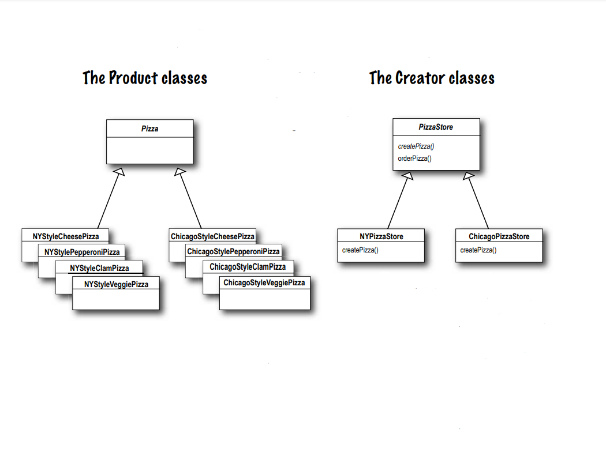
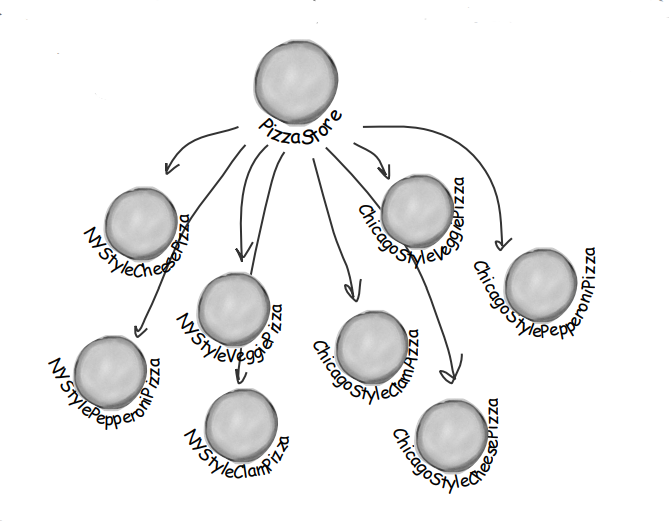
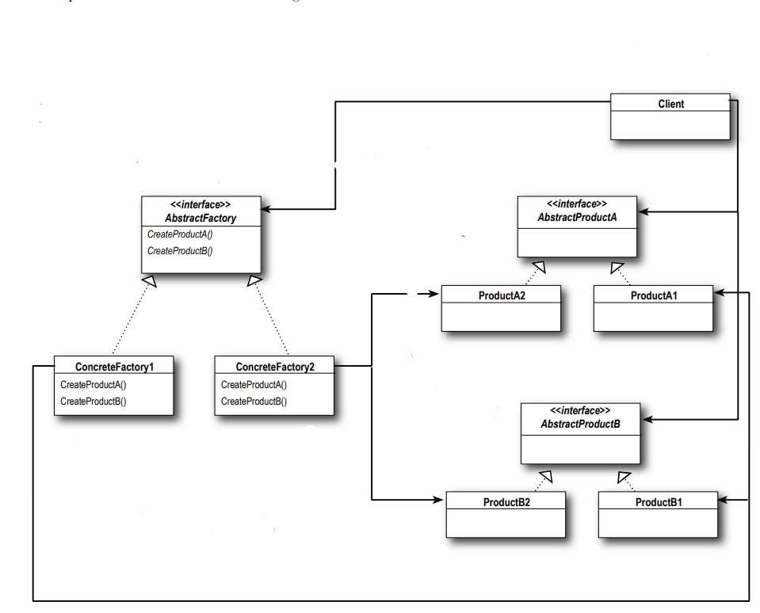
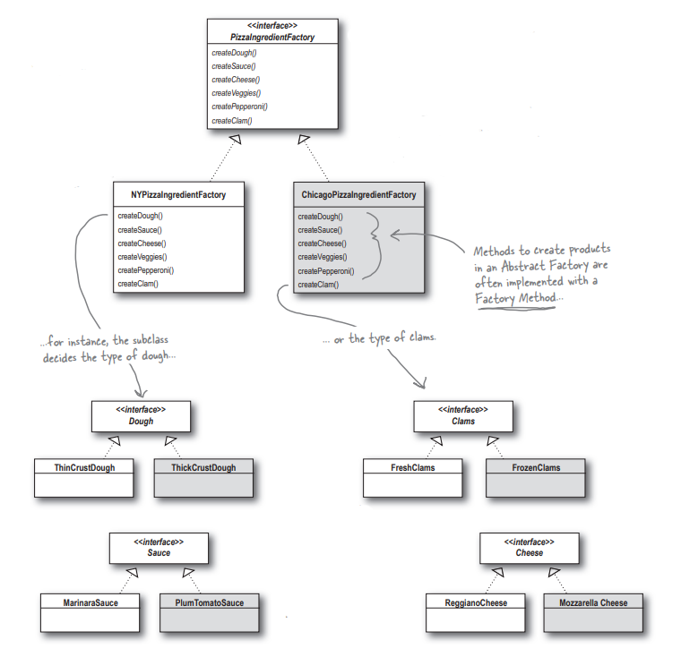

# Baking with OO Goodness (OO Goodness ile Pişirme)

Bazı Loosely Coupled OO tasarımlarını pişirmeye hazır olun. Nesne oluşturmada new operatörünü kullanmaktan daha fazlası
vardır. Instantiation (Örneklemenin) her zaman herkese açık olarak yapılmaması gereken bir etkinlik olduğunu ve
genellikle bağlanma sorunlarına yol açabileceğini öğreneceksiniz. Ve siz bunu istemezsiniz, değil mi? Factory
Kalıplarının sizi utanç verici bağımlılıklardan kurtarmaya nasıl yardımcı olabileceğini öğrenin.

Tamam, üç bölüm oldu ve hala new ile ilgili sorumu yanıtlamadınız. Bir implementasyona programlama yapmamamız gerekiyor
ama ne zaman new kullansam, tam olarak bunu yapıyorum, değil mi?

"new" kelimesini gördüğünüz de "concrete'i" düşünün

Evet, new kullandığınızda kesinlikle concrete bir sınıfı instantiating etmiş olursunuz, yani bu kesinlikle bir
implementasyondur, bir interface değil. Ve bu iyi bir soru; kodunuzu concrete bir sınıfa bağlamanın onu daha kırılgan ve
daha az esnek hale getirebileceğini öğrendiniz.

```Duck duck = new MallardDuck();```

Kodu esnek tutmak için interface'leri kullanmak istiyoruz ```Duck```

Ancak concrete bir sınıfın instance'ini oluşturmamız gerekiyor! ```new MallardDuck()```

Birbiriyle ilişkili bir dizi concrete sınıfınız olduğunda, genellikle bu şekilde kod yazmak zorunda kalırsınız:

```
Duck duck;

if (picnic) {
    /* Bir sürü farklı Duck sınıfımız var ve runtime'a kadar hangisini instantiate (örneklememiz) gerektiğini 
    bilmiyoruz */
    duck = new MallardDuck();
    } else if (hunting) {
        duck = new DecoyDuck();
    } else if (inBathTub) {
        duck = new RubberDuck();
}
```

Burada instantiated (örneklenen) birkaç concrete sınıfımız var ve hangisinin instantiate (örnekleneceğine) runtime'da
bazı koşullara bağlı olarak karar veriliyor

Böyle bir kod gördüğünüzde, değişiklik veya ekleme zamanı geldiğinde bu kodu yeniden açmanız ve nelerin eklenmesi (veya
silinmesi) gerektiğini incelemeniz gerekeceğini bilirsiniz. Genellikle bu tür kodlar uygulamanın çeşitli bölümlerinde
yer alır ve bu da bakım ve güncellemeleri daha zor ve hataya açık hale getirir.

Ancak bir noktada bir nesne oluşturmanız gerekir ve Java bize bir nesne oluşturmanın yalnızca bir yolunu sunar, değil
mi? Peki ne oluyor?

### "new" in nesi var?

Teknik olarak "new" ile ilgili yanlış bir şey yok, sonuçta Java'nın temel bir parçası. Asıl suçlu eski dostumuz CHANGE
ve change'in "new" kullanımımızı nasıl etkilediğidir.

Bir interface'e göre kodlama yaparak, ileride sistemde meydana gelebilecek pek çok değişiklikten kendinizi izole
edebileceğinizi bilirsiniz. Neden mi? Kodunuz bir interface'e göre yazılmışsa, polymorphism yoluyla bu interface'i
implement eden tüm yeni sınıflarla çalışacaktır. Ancak, çok sayıda concrete sınıf kullanan bir kodunuz varsa, yeni
concrete sınıflar eklendikçe bu kodun değiştirilmesi gerekebileceğinden başınız belaya girebilir. Yani, başka bir
deyişle, kodunuz "closed for modification (değişikliğe kapalı)" olmayacaktır. Yeni concrete türlerle extend etmek için
yeniden açmanız gerekecektir.

Peki ne yapabilirsiniz? İşte böyle zamanlarda ipucu aramak için OO Tasarım İlkelerine başvurabilirsiniz. Unutmayın, ilk
ilkemiz değişimle ilgilidir ve bize değişen yönleri tanımlamamız ve bunları aynı kalanlardan ayırmamız için rehberlik
eder.

Uygulamanızın concrete sınıfları instantiate (örnekleyen) tüm parçalarını alıp bunları uygulamanızın geri kalanından
nasıl ayırabilir veya encapsulate edebilirsiniz?

# Identifying the aspects that vary (Farklılık gösteren yerlerin belirlenmesi)

Diyelim ki bir pizza dükkanınız var ve Objectville'de son teknoloji bir pizza dükkanı sahibi olarak bunun gibi bazı
kodlar yazabilirsiniz:

```
Pizza orderPizza() {
    /* Esneklik için, bunun gerçekten abstract bir sınıf veya interface olmasını istiyoruz, ancak bunlardan herhangi 
    birini doğrudan instantiate (örnekleyemiyoruz) edemiyoruz */
    Pizza pizza = new Pizza();
    pizza.prepare();
    pizza.bake();
    pizza.cut();
    pizza.box();
    return pizza;
}
```

### Ama birden fazla pizza çeşidine ihtiyacınız var...

Böylece, uygun pizza type'ını belirleyen ve ardından pizzayı yapmaya devam eden bir kod eklersiniz:

```
/* Şimdi sipariş edilecek pizza type'ini giriyoruz orderPizza */
Pizza orderPizza(String type) {
    Pizza pizza;
    
    /* Pizza type'ina bağlı olarak, doğru concrete sınıfı instantiate (örneklendirir) eder ve pizza instance variable'ina 
    atarız. Buradaki her pizzanın Pizza interface'ini implement etmesi gerektiğini unutmayın */
    if (type.equals(“cheese”)) {
        pizza = new CheesePizza();
    } else if (type.equals(“greek”) {
        pizza = new GreekPizza();
    } else if (type.equals(“pepperoni”) {
        pizza = new PepperoniPizza();
    }
    
    pizza.prepare();
    pizza.bake();
    pizza.cut();
    pizza.box();
    
    /* Pizzayı hazırladıktan sonra (bilirsiniz, hamuru açıyoruz, sosu koyuyoruz, malzemeleri ve peyniri ekliyoruz), 
    pişiriyoruz, kesiyoruz ve kutuluyoruz */
    return pizza;
}
```

Her Pizza subtype'ı (CheesePizza, VeggiePizza, vb.) kendini nasıl hazırlayacağını bilir.

# But the pressure is on to add more pizza types (Ancak daha fazla pizza çeşidi eklemek için baskı yapılıyor)

Tüm rakiplerinizin menülerine birkaç moda pizza eklediğini fark ettiniz: Clam Pizza ve Veggie Pizza. Açıkçası
rekabete ayak uydurmanız gerekiyor, bu yüzden bu Productleri menünüze ekleyeceksiniz. Son zamanlarda çok fazla Greek
Pizzası satamadığınız için bunları menüden çıkarmaya karar verdiniz:


Bu kod closed for modification (değişikliğe KAPALI) DEĞİLDİR. Pizza Dükkanı pizza seçeneklerini değiştirirse, bu koda
girmeli ve onu değiştirmeliyiz.


Değişen şey budur. Pizza seçimi zaman içinde değiştikçe, bu kodu tekrar tekrar değiştirmeniz gerekecektir


Aynı kalmasını beklediğimiz şey budur. Bir pizzanın hazırlanması, pişirilmesi ve paketlenmesi çoğunlukla yıllardır aynı
kalmıştır. Dolayısıyla, bu kodun değişmesini beklemiyoruz, sadece üzerinde çalıştığı pizzaların değişmesini bekliyoruz.

Açıkçası, hangi concrete sınıfın instantiated (örneklendiği) ile uğraşmak orderPizza() methodumuzu gerçekten
karıştırıyor ve closed for modification'ı (değişiklik için kapatılmasını) engelliyor. Ancak artık neyin değişip neyin
değişmediğini bildiğimize göre, muhtemelen bunu encapsule etmenin zamanı gelmiştir.

# Encapsulating object creation (Nesne oluşturmayı kapsülleme)

Artık nesne oluşturma işlemini orderPizza() methodunun dışına taşımamızın daha iyi olacağını biliyoruz. Ama nasıl?
Yapacağımız şey, oluşturma kodunu almak ve sadece pizza oluşturmakla ilgilenecek başka bir nesneye taşımak.


İlk olarak nesne oluşturma kodunu orderPizza(String type) methodundan çıkarıyoruz


Daha sonra bu kodu sadece pizza oluşturma konusunda endişelenecek bir nesneye yerleştiririz. Eğer başka bir nesnenin
pizza yaratması gerekirse, bu nesneye başvurulacaktır. Bu yeni nesne için bir adımız var: ona **Factory** diyoruz.

Factory'ler nesne oluşturma ayrıntılarını ele alır. Bir SimplePizzaFactory'ye sahip olduğumuzda, orderPizza() metodumuz
sadece bu nesnenin bir client'i haline gelir. Ne zaman bir pizzaya ihtiyaç duysa pizza Factory'sinden bir pizza
yapmasını ister. orderPizza() metodunun Greek ve Clam pizzaları hakkında bilgi sahibi olması gereken günler geride
kaldı. Artık orderPizza() metodu sadece Pizza interface'ini implement eden bir pizza almakla ilgileniyor, böylece
prepare(), bake(), cut() ve box() metotlarını çağırabiliyor.

Burada hala doldurmamız gereken birkaç ayrıntı var; örneğin, orderPizza() metodu oluşturma kodunu ne ile değiştiriyor?
Pizza mağazası için basit bir Factory implement edelim ve öğrenelim...

# Building a simple pizza factory (Basit bir pizza fabrikası inşa etmek)

Factory'nin kendisi ile başlayacağız. Yapacağımız şey, tüm pizzalar için nesne oluşturmayı encapsulate eden bir sınıf
tanımlamak. İşte burada...

```
/* İşte yeni sınıfımız, SimplePizzaFactory. Hayatta tek bir işi var: client'ları için pizza yaratmak */
public class SimplePizzaFactory {

    /* İlk olarak Factory'de bir createPizza() metodu tanımlıyoruz. Bu, tüm client'ların yeni nesneyi 
    instatiate (örneklemek) için kullanacağı methoddur */
    public Pizza createPizza(String type) {
        
        Pizza pizza = null;
        
        /* İşte orderPizza() metodundan çıkardığımız kod. Bu kod, tıpkı orijinal orderPizza() methodumuzda olduğu gibi 
        pizza type'ına göre parametrelendirilmiştir.*/
        if (type.equals(“cheese”)) {
            pizza = new CheesePizza();
        } else if (type.equals(“pepperoni”)) {
            pizza = new PepperoniPizza();
        } else if (type.equals(“clam”)) {
            pizza = new ClamPizza();
        } else if (type.equals(“veggie”)) {
            pizza = new VeggiePizza();
        }
        
        return pizza;
    }
}
```

--**DIALOGS**--

Q : Bunun avantajı nedir? Görünüşe göre sorunu başka bir nesneye itiyoruz.

A : Unutulmaması gereken bir şey SimplePizzaFactory'nin birçok client'i olabileceğidir. Biz sadece orderPizza() metodunu
gördük; ancak, mevcut description ve price için pizzaları almak üzere Factory'i kullanan bir PizzaShopMenu sınıfı
olabilir. Ayrıca, pizzaları PizzaShop sınıfımızdan farklı bir şekilde işleyen ancak aynı zamanda Factory'nin bir client'
i olan bir HomeDelivery sınıfımız da olabilir. Böylece, pizza oluşturmayı tek bir sınıfta encapsulating ederek,
implementasyon değiştiğinde değişiklik yapmak için artık tek bir yerimiz var. Unutmayın, concrete instantiations (
örneklemeleri) client kodumuzdan da kaldırmak üzereyiz!

Q : Bunun gibi bir Factory'nin static bir method olarak tanımlandığı benzer bir tasarım gördüm. Aradaki fark nedir?

A : Basit bir Factory'i static bir method olarak tanımlamak yaygın bir tekniktir ve genellikle Static Factory olarak
adlandırılır. Neden static bir method kullanılır? Çünkü create metodunu kullanmak için bir nesneyi instantiate
(örneklemeniz) gerekmez. Ancak bunun, subclass oluşturamama ve create method'unun behavior'unu değiştirememe gibi bir
dezavantajı olduğunu da unutmayın.

# Reworking the PizzaStore class (PizzaStore sınıfını yeniden işleme)

Şimdi sıra client kodumuzu düzeltmeye geldi. Yapmak istediğimiz şey, pizzaları bizim için oluşturması için Factory'e
güvenmek. İşte değişiklikler:

```
public class PizzaStore {
    
    /* Şimdi PizzaStore'a bir SimplePizzaFactory referansı veriyoruz */
    SimplePizzaFactory factory;

    /* PizzaStore, constructor'da kendisine aktarılan Factory'i alır */
    public PizzaStore(SimplePizzaFactory factory) {
        this.factory = factory;
    }

    public Pizza orderPizza(String type){
        Pizza pizza;

        /* Ve orderPizza() methodu, pizzalarını oluşturmak için sadece siparişin type'ını aktararak Factory'i kullanır. 
        new operatörünü factory nesnesi üzerinde bir create metodu ile değiştirdiğimize dikkat edin. Burada artık 
        concrete instantiations (örnekleme) yok! */
        pizza = factory.createPizza(type);

        pizza.prepare();
        pizza.bake();
        pizza.cut();
        pizza.box();
        return pizza;
    }
}
```

# The Simple Factory defined (Basit Fabrika tanımlandı)

SimpleFactory aslında bir Tasarım Kalıbı değildir; daha çok bir programlama idiom'udur. Ancak yaygın olarak
kullanılmaktadır. Bazı geliştiriciler bu deyimi "Factory Pattern" ile karıştırıyor.

SimpleFactory'nin REAL bir kalıp olmaması, nasıl bir araya getirildiğini kontrol etmememiz gerektiği anlamına gelmez.
Yeni Pizza Mağazamızın sınıf diyagramına bir göz atalım:


**PizzaStore** : Bu, factory'nin client'idir. PizzaStore şimdi pizza instance'larını (örneklerini) almak için
SimplePizzaFactory'den geçer.

**SimplePizzaFactory** : Bu, pizzaları oluşturduğumuz factory'dir; uygulamamızın Concrete Pizza sınıflarına atıfta
bulunan tek parçası olmalıdır... create methodu genellikle static olarak bildirilir

**Pizza** : Bu factory'nin product'ı : pizza! Pizza'yı, overriden edebilecek bazı yararlı implementasyonlarla birlikte
abstract bir sınıf olarak tanımladık.

**CheesePizza, VeggiePizza, ClamPizza, PepperonPizza** : Bunlar bizim concrete product'larımızdır. Her Product'in Pizza
interface'ini implement etmesi (bu durumda "Abstract Pizza sınıfını extends etmek" anlamına gelir) ve concrete olması
gerekir. Durum böyle olduğu sürece, factory tarafından oluşturulabilir ve client'a geri verilebilir.

SimpleFactory'i bir ısınma olarak düşünün. Daha sonra, her ikisi de factory olan iki ağır hizmet modelini keşfedeceğiz.
Ama endişelenmeyin, daha çok pizza gelecek!

Bir hatırlatma daha: tasarım kalıplarında "bir interface'i implemente etmek" ifadesi her zaman "sınıf bildiriminde
implements" anahtar sözcüğünü kullanarak bir Java interface'ini implement eden bir sınıf yazmak" anlamına GELMEZ.
İfadenin genel kullanımında, bir supertype'dan (bir sınıf veya interface olabilir) bir methodu implement eden concrete
bir sınıf, yine de o supertype'ın "interface'ini implement ediyor" olarak kabul edilir.

# Franchising the pizza store (Pizza dükkanının franchisingi)

Objectville PizzaStore'unuz o kadar iyi iş çıkardı ki rekabeti alt üst ettiniz ve şimdi herkes kendi mahallesinde bir
PizzaStore istiyor. Franchise veren olarak, franchise operasyonlarının kalitesinden emin olmak istiyorsunuz ve bu
nedenle zaman içinde test edilmiş kodunuzu kullanmalarını istiyorsunuz.

Peki ya bölgesel farklılıklar? Her franchise, franchise mağazasının bulunduğu yere ve yerel pizza uzmanlarının
zevklerine bağlı olarak farklı pizza stilleri (birkaç isim vermek gerekirse New York, Chicago ve California) sunmak
isteyebilir.


**PizzaStore** : Tüm franchise pizza mağazalarının **PizzaStore** kodunuzdan yararlanmasını istiyorsunuz, böylece
pizzalar aynı şekilde hazırlanıyor

**NYPizzaFactory** : Bir franchise NY tarzı pizzalar yapan bir Factory istiyor: ince hamur, lezzetli sos ve az peynir.

**ChicagoPizzaFactory** : Başka bir franchise Chicago tarzı pizza yapan bir Factory istiyor; müşterileri kalın hamurlu,
zengin soslu ve tonlarca peynirli pizzalardan hoşlanıyor.

### Bir yaklaşım gördük...

SimplePizzaFactory'yi çıkarır ve NYPizzaFactory, ChicagoPizzaFactory ve CaliforniaPizzaFactory olmak üzere üç farklı
Factory oluşturursak, PizzaStore'u uygun Factory ile compose edebiliriz ve bir franchise hazır olur. Bu da bir yaklaşım.
Bunun neye benzeyeceğini görelim...

```
/* Burada NY tarzı pizza yapmak için bir Factory oluşturuyoruz */
NYPizzaFactory nyFactory = new NYPizzaFactory();

/* Ardından bir PizzaStore oluşturuyoruz ve NY Factory'sine bir referans iletiyoruz */
PizzaStore nyStore = new PizzaStore(nyFactory);

/* ...ve pizza yaptığımızda, NY tarzı pizzalar elde ediyoruz */
nyStore.order(“Veggie”);
```

```
ChicagoPizzaFactory chicagoFactory = new ChicagoPizzaFactory();
PizzaStore chicagoStore = new PizzaStore(chicagoFactory);
chicagoStore.order(“Veggie”);
```

Aynı şekilde Chicago pizza mağazaları için de: Chicago pizzaları için bir Factory yaratıyoruz ve Chicago Factory'sinden
composed edilmiş bir mağaza yaratıyoruz. Pizzaları yaptığımızda, Chicago aromalı olanları alıyoruz

### Ama biraz daha kalite kontrol istiyorsunuz...

Böylece SimpleFactory fikrini test ettiniz ve franchise'ların pizza yapmak için Factory'nizi kullandığını, ancak sürecin
geri kalanında kendi geliştirdikleri prosedürleri uygulamaya başladıklarını gördünüz: farklı şekillerde pişiriyorlardı,
pizzayı kesmeyi unutuyorlar ve third-party kutuları kullanıyorlardı.

Sorunu biraz daha düşündüğünüzde, aslında yapmak istediğiniz şeyin mağaza ile pizza yaratımını birbirine bağlayan, ancak
yine de işlerin esnek kalmasına izin veren bir framework oluşturmak olduğunu görüyorsunuz.

SimplePizzaFactory'den önceki ilk kodumuzda, pizza yapma kodu PizzaStore'a bağlıydı, ancak esnek değildi

# A framework for the pizza store (Pizza dükkanı için bir framework)

Tüm pizza yapma faaliyetlerini PizzaStore sınıfına yerelleştirmenin ve yine de franchise'lara kendi bölgesel stillerine
sahip olma özgürlüğü vermenin bir yolu var. Yapacağımız şey, createPizza() methodunu PizzaStore'a geri koymak, ancak bu
kez abstract bir method olarak koymak ve ardından her bölgesel stil için bir PizzaStore subclass'ı oluşturmaktır. İlk
olarak, PizzaStore'daki değişikliklere bakalım:

```
/* PizzaStore artık abstract */
public abstract class PizzaStore {
    public Pizza orderPizza(String type){

        Pizza pizza;

        /* Artık createPizza, bir Factory nesnesi yerine PizzaStore'daki bir methoda yapılan çağrıya geri dönüyor */
        pizza = createPizza(type);

        /* Bunların hepsi aynı görünüyor */
        pizza.prepare();
        pizza.bake();
        pizza.cut();
        pizza.box();
        return pizza;
    }

    /* Şimdi Factory nesnemizi bu methoda taşıdık. PizzaStore'da "Factory Methodumuz" artık abstract */
    abstract Pizza createPizza(String type);
}
```

Şimdi subclass'ları bekleyen bir mağazamız var; her bölgesel tip için bir subclass'ımız olacak (NYPizzaStore,
ChicagoPizzaStore, CaliforniaPizzaStore) ve her subclass bir pizzayı neyin oluşturduğuna karar verecek. Şimdi bunun
nasıl çalışacağına bir göz atalım.

# Allowing the subclasses to decide (Subclass'ların karar vermesine izin vermek)

PizzaStore'un orderPizza() methodunda zaten iyi geliştirilmiş bir sipariş sistemine sahip olduğunu ve bunun tüm
franchise'larda tutarlı olmasını sağlamak istediğinizi unutmayın.

Bölgesel PizzaStore'lar arasında farklılık gösteren şey, yaptıkları pizzaların tarzıdır - New York Pizza ince
hamurludur, Chicago Pizza kalın hamurludur vb - ve tüm bu varyasyonları createPizza() methoduna aktaracağız ve doğru
pizza tProductü oluşturmaktan sorumlu kılacağız. Bunu yapmanın yolu, PizzaStore'un her bir subclass'ının createPizza()
methodunun neye benzediğini tanımlamasına izin vermektir. Böylece, PizzaStore'un her biri kendi pizza varyasyonlarına
sahip, hepsi PizzaStore framework'u içinde yer alan ve yine de iyi ayarlanmış orderPizza() methodunu kullanan bir dizi
concrete subclass'ımız olacak.


**PizzaStore** : Her subclass createPizza() methodunu override ederken, tüm subclass'lar PizzaStore'da tanımlanan
orderPizza() methodunu kullanır. Bunu gerçekten zorlamak istiyorsak orderPizza() methodunu final yapabiliriz.

**NYStylePizzaStore** : Bir franchise, müşterileri için NY tarzı pizzalar istiyorsa, NY tarzı pizzalar oluşturan kendi
createPizza() methoduna sahip NY subclass'ını kullanır.


**ChicagoStylePizzaStore** : Benzer şekilde, Chicago subclass'ını kullanarak, Chicago içerikli bir createPizza()
implementasyonu elde ederiz.


Unutmayın: createPizza() PizzaStore'da abstract'dır, bu nedenle tüm pizza mağazası subtype'ları bu methodu implement
etmelidir.

Anlamıyorum. PizzaStore subclass'ları sadece subclass'lar. Herhangi bir şeye nasıl karar veriyorlar?
NYStylePizzaStore'da mantıklı bir karar verme kodu göremiyorum....

PizzaStore'un orderPizza() methodu açısından düşünün: Abstract PizzaStore'da tanımlanmıştır, ancak concrete type'lar
yalnızca subclass'da oluşturulur.


orderPizza() subclass'lar da değil, Abstract PizzaStore'da tanımlanmıştır. Dolayısıyla, methodun hangi subclass'ın kodu
çalıştırdığı ve pizzaları yaptığı hakkında hiçbir fikri yoktur

Şimdi, bunu biraz daha ileri götürmek gerekirse, orderPizza() methodu bir Pizza nesnesiyle birçok şey yapar (hazırlamak,
pişirmek, kesmek, kutulamak gibi), ancak Pizza abstract olduğu için, orderPizza()'nın hangi gerçek concrete sınıfların
dahil olduğu hakkında hiçbir fikri yoktur. Başka bir deyişle, bu method bağımsızdır! (decoupled)


orderPizza(), gerçekten bir pizza nesnesi almak için createPizza() işlevini çağırır. Ama hangi tür pizzayı alacak?
orderPizza() methodu karar veremez; nasıl karar vereceğini bilemez. Peki kim karar verecek?

orderPizza() işlevi createPizza() işlevini çağırdığında, alt sınıflarınızdan biri bir pizza oluşturmak için harekete
geçecektir. Ne tür bir pizza yapılacak? Buna sipariş verdiğiniz pizza mağazasının seçimi karar verir: NYStylePizzaStore
veya ChicagoStylePizzaStore.

Peki, subclass'ların verdiği real-time bir karar var mı? Hayır, ancak orderPizza() açısından bakıldığında, eğer bir
NYStylePizzaStore seçtiyseniz, bu subclass hangi pizzanın yapılacağını belirler. Yani subclass'lar gerçekten "karar
vermiyor" - hangi mağazayı istediğinize karar veren sizsiniz - ancak hangi tür pizzanın yapılacağını onlar belirliyor

# Let’s make a PizzaStore (Hadi bir PizzaStore yapalım)

Franchise olmanın avantajları vardır. Tüm PizzaStore işlevselliğini ücretsiz olarak elde edersiniz. Bölgesel mağazaların
yapması gereken tek şey PizzaStore subclass'ını oluşturmak ve kendi Pizza stillerini uygulayan bir createPizza() methodu
sağlamaktır. Franchise'lar için üç büyük pizza stilini biz halledeceğiz. İşte New York bölgesel tarzı:

```
/* createPizza() bir Pizza döndürür ve subclass hangi concrete Pizza'yı instatiate edeceğinden tamamen kendisi 
sorumludur. NYPizzaStore, PizzaStore'u extends eder, bu nedenle orderPizza() methodunu (diğerlerinin yanı sıra) 
inherit eder */
public class NYPizzaStore extends PizzaStore {

    /* PizzaStore'da abstract olduğu için createPizza() methodunu implement etmemiz gerekir */
    @Override
    Pizza createPizza(String item) {
    
        /* Concrete sınıflarımızı burada oluşturuyoruz. Her Pizza türü için NY stilini oluşturuyoruz */
        if (item.equals("cheese")) {
            return new NYStyleCheesePizza();
        } else if (item.equals("veggie")) {
            return new NYStyleVeggiePizza();
        } else if (item.equals("clam")) {
            return new NYStyleClamPizza();
        } else if (item.equals("pepperoni")) {
            return new NYStylePepperoniPizza();
        } else return null;
    }
}
```

Superclass'da ki orderPizza() methodunun hangi Pizza'yı oluşturduğumuz hakkında hiçbir fikri olmadığını unutmayın;
sadece onu hazırlayabileceğini, pişirebileceğini, kesebileceğini ve kutulayabileceğini biliyor!

# Declaring a factory method (Factory methodu bildirme)

PizzaStore'da yaptığımız birkaç değişiklikle, concrete sınıflarımızın instatiation'larını bir nesnenin üstlenmesinden,
artık bu sorumluluğu üstlenen bir dizi subclass'a geçtik. Şimdi daha yakından bakalım:

```
public abstract class PizzaStore {
    
    /* PizzaStore'un subclass'ları createPizza() methodunda bizim için nesne oluşturma işlemini gerçekleştirir */
    public Pizza orderPizza(String type){

        Pizza pizza;

        pizza = createPizza(type);

        pizza.prepare();
        pizza.bake();
        pizza.cut();
        pizza.box();
        return pizza;
    }

    /* Pizzaları instantiating etmek için tüm sorumluluk, Factory görevi gören bir methoda taşındı */
    abstract Pizza createPizza(String type);
}
```

Bir Factory methodu nesne oluşturma işlemini gerçekleştirir ve bunu bir subclass'da encapsulate eder. Bu, superclass'da
ki client kodunu subclass'da ki nesne oluşturma kodundan ayırır.

```abstract Product factoryMethod (String type);```

Bir Factory Method, bir Product'ın çeşitli varyasyonları arasından seçim yapmak için parametrelendirilebilir (veya
parametrelendirilemez) ```(String type)```

Bir Factory Method, Client'i (orderPizza() gibi superclass'da ki kod) gerçekte ne tür bir Concrete Product
oluşturulduğunu bilmekten izole eder. ```factoryMethod()```

Factory Method, tipik olarak superclass'da tanımlanan methodlar da kullanılan bir Product döndürür. ```Product```

Bir Factory Methodu abstract'dır, bu nedenle subclass'ların nesne oluşturma işlemini gerçekleştireceği varsayılır.

# Let’s see how it works: ordering pizzas with the pizza factory method (Nasıl çalıştığını görelim: pizza factory methodu ile pizza siparişi vermek)


### Peki nasıl sipariş veriyorlar?

1 - İlk olarak, Joel ve Ethan'ın bir PizzaStore instance'ina ihtiyacı vardır. Joel'in bir ChicagoPizzaStore ve Ethan'ın
da bir NYPizzaStore instance'ina ihtiyacı var.

2 - Ellerinde bir PizzaStore bulunan Ethan ve Joel, orderPizza() methodunu çağırır ve istedikleri pizza type'ını (
peynirli, sebzeli vb.) iletirler.

3 - Pizzaları oluşturmak için, NYPizzaStore ve ChicagoPizzaStore subclass'ların da tanımlanan createPizza() methodu
çağrılır. Tanımladığımız gibi, NYPizzaStore NY tarzı bir pizzayı, ChicagoPizzaStore ise Chicago tarzı bir pizzayı
instantiates eder. Her iki durumda da Pizza, orderPizza() methoduna döndürülür.

4 - orderPizza() methodunun ne tür bir pizza yaratıldığı hakkında hiçbir fikri yoktur, ancak bunun bir pizza olduğunu
bilir ve Ethan ve Joel için pizzayı hazırlar, pişirir, keser ve kutular.

# Let’s check out how these pizzas are really made to order... (Bu pizzaların gerçekten sipariş üzerine nasıl yapıldığına bir göz atalım...)

1 - Ethan'ın sırasını takip edelim: önce bir NY PizzaStore'a ihtiyacımız var:

```PizzaStore nyPizzaStore = new NYPizzaStore();``` NYPizzaStore'un bir instance'ini oluşturur.

2 - Artık bir mağazamız olduğuna göre, sipariş alabiliriz:

```nyPizzaStore.orderPizza(“cheese”);``` orderPizza() methodu nyPizzaStore instance'in da çağrılır (PizzaStore'un içinde
tanımlanan method çalışır).

3 - orderPizza() methodu daha sonra createPizza() methodunu çağırır:

```Pizza pizza = createPizza(“cheese”);``` Factory methodu olan createPizza()'nın subclass'da implement edildiğini
unutmayın. Bu durumda bir NY Cheese Pizza döndürür.

4 - Sonunda hazır olmayan pizzayı elimize aldık ve orderPizza() methodu pizzayı hazırlamayı bitirdi:

```
pizza.prepare();
pizza.bake();
pizza.cut();
pizza.box();
```

Bu methodların tümü NYPizzaStore'da tanımlanan createPizza() factory methodundan döndürülen belirli bir pizzada
tanımlanmıştır

orderPizza() methodu, tam olarak hangi concrete sınıf olduğunu bilmeden bir Pizza alır.

# We’re just missing one thing: PIZZA! (Sadece bir şey eksik: PİZZA!)

PizzaStore'umuz pizzalar olmadan çok popüler olmayacak, bu yüzden onları implement edelim :

```
/* Abstract bir Pizza sınıfı ile başlayacağız ve tüm concrete pizzalar bundan türetilecek */
public abstract class Pizza {

    /* Her Pizza'nın bir name'i, bir dough (hamur türü), bir sauce (sos) türü ve bir dizi toppings (malzemesi) vardır */
    String name;
    String dough; // hamur
    String sauce; // sos

    ArrayList<String> toppings = new ArrayList<>(); // üst malzemeler

    /* Abstract sınıf, baking (pişirme), cutting (kesme) ve boxing (kutulama) için bazı temel varsayılanlar sağlar. 
    Prepare (Hazırlık), belirli bir sırayla bir dizi adımı takip eder. */
    void prepare() {
        System.out.println("Preparing " + name);
        System.out.println("Tossing dough...");
        System.out.println("Adding sauce");
        System.out.println("Adding toppings");

        for (int i = 0; i < toppings.size(); i++) {
            System.out.println("   " + toppings.get(i));
        }
    }

    void bake(){
        System.out.println("Bake for 25 minutes at 350");
    }

    void cut(){
        System.out.println("Cutting the pizza into diagonal slices");
    }

    void box(){
        System.out.println("Place pizza in official PizzaStore box");
    }

    public String getName() {
        return name;
    }
}
```

# Now we just need some concrete subclasses... how about defining New York and Chicago style cheese pizzas? (Şimdi sadece bazı concrete subclass'lara ihtiyacımız var... New York ve Chicago tarzı peynirli pizzaları tanımlamaya ne dersiniz?)

```
public class NYStyleCheesePizza extends Pizza{

    /* NY Pizza'nın kendine has marinara tarzı sosu ve ince hamuru vardır */
    public NYStyleCheesePizza() {
        name = "NY Style sauce and cheese pizza";
        dough = "Thin Crust Dough";
        sauce = "Marinara sauce";
        
        /* Ve bir tane de reggiano peyniri! */
        toppings.add("Grated Reggiano Cheese");
    }
}
```

```
public class ChicagoStyleCheesePizza extends Pizza{
    
    public ChicagoStyleCheesePizza() {
        /* Chicago Pizza, ekstra kalın kabuğunun yanı sıra sos olarak erik domates kullanır */
        name = "Chicago Style Deep Dish Cheese Pizza";
        dough = "Extra Thick Crust Dough";
        sauce = "Plum Tomato Sauce";

        /* Chicago tarzı derin tabak pizzada bol miktarda mozzarella peyniri var! */
        toppings.add("Shredded Mozzarella Cheese");
    }

    /* Chicago tarzı pizza ayrıca cut() methodunu override eder, böylece parçalar kareler halinde kesilir */
    @Override
    void cut() {
        System.out.println("Cutting the pizza into square slices");
    }
}
```

# You’ve waited long enough, time for some pizzas! (Yeterince beklediniz, biraz pizza zamanı!)

```
public class PizzaTestDrive {

    public static void main(String[] args) {
    
        /* İlk olarak iki farklı mağaza oluşturuyoruz */
        PizzaStore nyStore = new NYPizzaStore();
        PizzaStore chicagoStore = new ChicagoPizzaStore();
        
        /* Ethan'ın siparişini vermek için tek bir mağaza kullanın */
        Pizza pizza = nyStore.orderPizza(“cheese”);
        System.out.println(“Ethan ordered a “ + pizza.getName() + “\n”);
        
        /* Diğeri de Joel'in */
        pizza = chicagoStore.orderPizza(“cheese”);
        System.out.println(“Joel ordered a “ + pizza.getName() + “\n”);
    }
}
```


# It’s finally time to meet the Factory Method Pattern (Sonunda Factory Methodu Pattern'i ile tanışma zamanı geldi)

Tüm Factory kalıpları nesne oluşturmayı encapsulate eder. Factory Methodu Kalıbı, subclass'ların hangi nesnelerin
oluşturulacağına karar vermesine izin vererek nesne oluşturmayı encapsulate eder. Bu kalıptaki oyuncuların kimler
olduğunu görmek için bu sınıf diyagramlarına göz atalım:

### The Creator classes (Creator class'lar)


**PizzaStore** : Bu bizim Abstract Creator sınıfımızdır. Subclass'ların Product üretmek için implement edeceği abstract
bir factory methodu tanımlar. Genellikle Creator, bir subclass tarafından üretilen Abstract bir Product'a bağlı olan kod
içerir. Creator hangi concrete Product'ın üretildiğini asla bilemez.

**NYPizzaStore** : createPizza() methodu bizim Factory metodumuzdur. Product üretir.

Her franchise PizzaStore'un kendi subclass'ına sahip olduğundan, createPizza() methodunu implement ederek kendi pizza
stilini yaratmakta özgürdür

**NYPizzaStore - ChicagoPizzaStore** : Product üreten sınıflara concrete creator denir

### The Product classes (Product class'ları)


**Pizza** : Factory'ler Product üretir ve PizzaStore'da Product'ımız bir Pizza'dır.


Bunlar concrete Product'lar - mağazalarımız tarafından üretilen tüm pizzalar.

# Another perspective: parallel class hierarchies (Başka bir bakış açısı: paralel sınıf hiyerarşileri)

Factory methodunun, bir factory methodu ile combined edilen bir orderPizza() methodu sağlayarak bir framework
sağladığını gördük. Bu kalıba bir framework olarak bakmanın bir başka yolu da Product bilgisini her bir Creator'a
encapsulate etme biçimidir. İki paralel sınıf hiyerarşisine bakalım ve nasıl ilişkili olduklarını görelim:



**The Product Classes - The Creator Classes** : Bu sınıf hiyerarşilerinin nasıl paralel olduğuna dikkat edin: her ikisi
de NY ve Chicago için özel implementasyonları bilen concrete sınıflar tarafından extends edilen abstract sınıflara
sahiptir

**NYPizzaStore**, NY tarzı pizzaların nasıl yapılacağı hakkındaki tüm bilgileri encapsulate eder

**ChicagoPizzaStore**, NY tarzı pizzaların nasıl yapılacağı hakkındaki tüm bilgileri encapsulate eder

Factory method, bu bilgiyi encapsulating etmek için anahtardır.

# Factory Method Pattern defined (Factory Methodu Kalıbı tanımlandı)

Factory Method Kalıbının resmi tanımını yayınlamanın zamanı geldi:


Factory Methodu Kalıbı, bir nesne oluşturmak için bir interface tanımlar, ancak hangi sınıfın instantiate edileceğine
subclass'ların karar vermesine izin verir. Factory Methodu, bir sınıfın instantiate işini (örnek oluşturmayı)
subclass'lara defer etmesini sağlar.

Her Factory'de olduğu gibi, Factory Metodu Kalıbı da bize concrete tiplerin instantiations'larını encapsule etmenin bir
yolunu sunar. Aşağıdaki sınıf diyagramına baktığınızda, Abstract Creator'ın size "Factory Methodu" olarak da bilinen
nesne oluşturma Methoduna sahip bir interface sunduğunu görebilirsiniz. Abstract Creator'da implement edilen diğer tüm
methodlar, Factory Methodu tarafından üretilen Product'lar üzerinde çalışmak üzere yazılmıştır. Yalnızca subclass'lar
gerçekte Factory Methodunu implement eder ve Product'lar oluşturur.

Resmi tanımda olduğu gibi, geliştiricilerin sık sık Factory Methodu'nun subclass'ların hangi sınıfı instatiate edeceğini
karar vermesine izin verdiğini söylediklerini duyacaksınız. "Karar verir" demelerinin nedeni, kalıbın subclass'ların
runtime'da karar vermesine izin vermesi değil, Creator sınıfın oluşturulacak Real Product'lar hakkında bilgi sahibi
olmadan yazılması ve buna tamamen kullanılan subclass'ın seçimiyle karar verilmesidir.


**Product** : Tüm Product'lar aynı interface'i implement etmelidir, böylece Product'ları kullanan sınıflar concrete
sınıfa değil interface'e başvurabilir

**Creator** : Creator, Factory Methodu hariç, Product'ları manipüle etmek için kullanılan tüm methodların
implementasyonlarını içeren bir sınıftır. Abstract factoryMethod(), tüm Creator subclass'larının implement etmesi
gereken şeydir

**ConcreteCreator** : ConcreteCreator, Product'ları gerçekten üreten method olan factoryMethod() Methodunu implement
eder. ConcreteCreator bir veya daha fazla Concrete Product oluşturmaktan sorumludur. Bu Product'ların nasıl
oluşturulacağı bilgisine sahip olan tek sınıftır.

--**DIALOGS**--

Q : Yalnızca bir ConcreteCreator'ınız olduğunda Factory Method Pattern'in avantajı nedir?

A : Factory Methodu Kalıbı, yalnızca tek bir concrete creator'ınız varsa kullanışlıdır çünkü Product'ın
implementasyonunu kullanımından ayırırsınız. Ek Product'lar eklerseniz veya bir Product'ın implementasyonunu
değiştirirseniz, bu durum Creator'ınızı etkilemeyecektir (çünkü Creator herhangi bir ConcreteProduct'a sıkı sıkıya bağlı
değildir).

Q : NY ve Chicago mağazalarımızın Simple Factory kullanılarak hayata geçirildiğini söylemek doğru olur mu? Tıpkı ona
benziyorlar.

A : Benzerdirler, ancak farklı şekillerde kullanılırlar. Her concrete mağazanın implementasyonu SimplePizzaFactory'ye
çok benzese de, concrete mağazaların createPizza() methodunu abstract bir method olarak tanımlayan bir sınıfı extends
ettiğini unutmayın. createPizza() methodunun behavior'unu tanımlamak her bir mağazaya bağlıdır. Simple Factory'de
Factory, PizzaStore ile birlikte oluşturulan başka bir nesnedir.

Q : Factory methodu ve Creator hep abstract mı olmalı?

A : Hayır, concrete bir Product üretmek için varsayılan bir factory methodu tanımlayabilirsiniz. Böylece, Creator'ın
subclass'ları olmasa bile her zaman Product oluşturmak için bir aracınız olur.

Q : Her mağaza, iletilen türe göre dört farklı çeşit pizza yapabiliyor. Tüm Concrete Creator'lar birden fazla Product mı
üretiyor yoksa bazen sadece bir tane mi üretiyorlar?

A : Parameterized Factory Methodu olarak bilinen yöntemi implement ettik. Fark ettiğiniz gibi, geçirilen bir
parametreye bağlı olarak birden fazla nesne oluşturabilir. Bununla birlikte, genellikle bir factory sadece bir nesne
üretir ve parametrelendirilmez. Her ikisi de kalıbın geçerli biçimleridir.

Q : Parameterized tipleriniz "type-safe" gibi görünmüyor. Sadece bir String geçiriyorum! Eğer "CalmPizza" istesem ne
olurdu?

A : Kesinlikle haklısınız ve bu, sektörde "runtime error" olarak adlandırdığımız bir duruma neden olur.
Parametreleri daha "type-safety" hale getirmek ya da başka bir deyişle, parametrelerdeki hataların compile time'da
yakalanabilmesini sağlamak için kullanılabilecek daha karmaşık birkaç teknik daha vardır. Örneğin, parametre türlerini
temsil eden nesneler oluşturabilir, statik sabitler kullanabilir veya Java 5'te enum'ları kullanabilirsiniz.

Q : Simple Factory ve Factory Method arasındaki fark konusunda hala biraz kafam karışık. Factory Method'da pizzayı
döndüren sınıfın bir subclass olması dışında çok benzer görünüyorlar. Açıklayabilir misiniz?

A : Subclass'ların Simple Factory'ye çok benzediği konusunda haklısınız, ancak Simple Factory'yi tek seferlik bir
anlaşma olarak düşünün, Factory Method ile subclass'ların hangi implementasyonun kullanılacağına karar vermesine izin
veren bir framework oluşturuyorsunuz. Örneğin, Factory Method'daki orderPizza() methodu, pizza yapmak için kullanılan
concrete sınıfları oluşturmak için bir factory methoduna dayanan pizza oluşturmak için genel bir framework sağlar.
PizzaStore sınıfını subclass'lara ayırarak, orderPizza() methodunun döndürdüğü pizzanın yapımında hangi Concrete
Product'ların kullanılacağına siz karar verirsiniz. Bunu SimpleFactory ile karşılaştırın, bu size nesne oluşturmayı
encapsulate etmenin bir yolunu sunar, ancak oluşturduğunuz Product'ları değiştirmenin bir yolu olmadığı için size
Factory Methodunun esnekliğini vermez.

--**DIALOGS**--

Usta : Çekirge, eğitimin nasıl gidiyor, bana anlat.

Öğrenci: Usta, encapsulate what varies (ne değişken ise kapsayın) ilkesi üzerine olan çalışmalarımı daha da ileriye
taşıdım. "farklılıkları encapsulate etme" çalışmamı daha da ileri götürdüm.

Usta : Devam et!

Öğrenci : Nesneleri oluşturan kodun encapsulate edilebileceğini öğrendim. Concrete sınıfları instantiates eden bir
kodunuz olduğunda, bu sık sık değişen bir alandır. "Factory'ler" adı verilen ve bu instantitation behavior'unu
encapsulete etmemize olanak tanıyan bir teknik öğrendim.

Usta : Peki bu "factory'ler" ne işe yarıyor?

Öğrenci: Çok sayıda var. Tüm creation kodumu tek bir nesne ya da methoda yerleştirerek kodumda yinelemeyi önler ve
bakım için tek bir yer sağlarım. Bu aynı zamanda client'ların nesneleri oluşturmak için gereken concrete sınıflar yerine
yalnızca interface'lere bağlı olduğu anlamına gelir. Çalışmalarımda öğrendiğim gibi bu, "to program to an interface, not
an implmentation", ve bu da kodumu gelecekte daha esnek ve genişletilebilir hale getiriyor.

Usta : Evet, çekirge, nesne yönelimli programlama içgüdüleriniz gelişiyor gibi görünüyor. Bugün benim için herhangi bir
sorunuz var mı?

Öğrenci: Efendim, nesne yaratımını encapsulate ederek abstraction'lara kodlama yaptığımı ve client kodumu gerçek
implementasyonları ayırdığımı biliyorum. Ancak Factory kodum hala gerçek nesneleri instantiate etmek için concrete
sınıflar kullanmalıdır. Kendi kendimi kandırmış olmuyor muyum?

Usta: Çekirge, nesne yaratma hayatın bir gerçeğidir; nesneler yaratmak zorundayız yoksa asla tek bir Java programı bile
yaratamayız. Ancak, bu gerçekliğin bilgisiyle, kodumuzu tasarlayabiliriz, böylece bu Creation kodunu, yününü gözünüzün
üzerinden çekeceğiniz koyun gibi ağıllaştırmış oluruz. Bir kez çembere aldıktan sonra, yaratılış kodunu koruyabilir ve
ona özen gösterebiliriz. Yaratılış kodumuzun başıboş dolaşmasına izin verirsek, onun "yününü" asla toplayamayız.

Öğrenci : Usta, bunun gerçek olduğunu görüyorum.

# A very dependent PizzaStore (Çok bağımlı bir pizzastore)

OO factory'sini hiç duymadığınızı varsayalım. İşte PizzaStore'un factory kullanmayan bir versiyonu; bu sınıfın bağımlı
olduğu concrete pizza nesnelerinin sayısını hesaplayın. Eğer bu PizzaStore'a California tarzı pizzalar eklerseniz, o
zaman kaç nesneye bağımlı olur?

```
public class DependentPizzaStore {
    public Pizza createPizza(String style, String type) {
    
        Pizza pizza = null;
        
        /* Tüm NY tarzı pizzaları idare eder */
        if (style.equals(“NY”)) {
            if (type.equals(“cheese”)) {
                pizza = new NYStyleCheesePizza();
            } else if (type.equals(“veggie”)) {
                pizza = new NYStyleVeggiePizza();
            } else if (type.equals(“clam”)) {
                pizza = new NYStyleClamPizza();
            } else if (type.equals(“pepperoni”)) {
                pizza = new NYStylePepperoniPizza();
            }
            
        /* Tüm Chicago tarzı pizzaları idare eder */
        } else if (style.equals(“Chicago”)) {
            if (type.equals(“cheese”)) {
                pizza = new ChicagoStyleCheesePizza();
            } else if (type.equals(“veggie”)) {
                pizza = new ChicagoStyleVeggiePizza();
            } else if (type.equals(“clam”)) {
                pizza = new ChicagoStyleClamPizza();
            } else if (type.equals(“pepperoni”)) {
                pizza = new ChicagoStylePepperoniPizza();
            }
        } else {
            System.out.println(“Error: invalid type of pizza”);
            return null;
        }
        
        pizza.prepare();
        pizza.bake();
        pizza.cut();
        pizza.box();
        return pizza;
    }
}
```

# Looking at object dependencies (Nesne bağımlılıklarına bakma)

Bir nesneyi doğrudan instantiate ettiğinizde, onun concrete sınıfına bağımlı olursunuz. Bir sayfa önceki çok bağımlı
PizzaStore'umuza bir göz atın. Tüm pizza nesnelerini bir factory'e delege etmek yerine doğrudan PizzaStore sınıfında
oluşturur. PizzaStore'un bu versiyonunu ve bağımlı olduğu tüm nesneleri temsil eden bir diyagram çizersek, işte böyle
görünür:



**PizzaStore** : PizzaStore'un bu sürümü tüm bu pizza nesnelerine bağlıdır, çünkü onları doğrudan oluşturur. Bu
sınıfların implementasyonu değişirse, PizzaStore'da değişiklik yapmamız gerekebilir. Pizzaların concrete
implementasyonlarında yapılan herhangi bir değişiklik PizzaStore'u etkilediğinden, PizzaStore'un pizza
implementasyonlarına "bağlı" olduğunu söyleriz.

Eklediğimiz her yeni pizza türü PizzaStore için başka bir bağımlılık yaratıyor.

# The Dependency Inversion Principle (Bağımlılığın Tersine Çevrilmesi İlkesi)


**Abstraction'lara bağımlı olun. Concrete sınıflara bağımlı olmayın.**

İlk başta bu ilke kulağa "Program to an interface, not an implementation" gibi geliyor, değil mi? Benzerdir; ancak
Dependency Inversion Principle abstraction hakkında daha da güçlü bir açıklama yapar. High-level component'lerimizin
low-level component'lerimize bağlı olmaması gerektiğini, bunun yerine her ikisinin de abstraction'lara bağlı olması
gerektiğini öne sürer. Ama bu ne anlama geliyor?

"High-level" bir component, behavior'u diğer "low-level" componentler açısından tanımlanan bir sınıftır. Örneğin,
PizzaStore high-level bir component'dir çünkü behavior'u pizzalar açısından tanımlanmıştır - tüm farklı pizza
nesnelerini oluşturur, hazırlar, pişirir, keser ve kutular, kullandığı pizzalar ise low-level componentlerdir.

Bir önceki sayfadaki pizza mağazası diyagramına tekrar bakarak başlayalım. PizzaStore bizim "high-level componentimiz",
pizza implementasyonları ise "low-level componentlerimizdir" ve PizzaStore'un concrete pizza sınıflarına bağımlı olduğu
açıktır.

Şimdi, bu ilke bize kodumuzu concrete sınıflara değil abstraction'lara bağlı olacak şekilde yazmamız gerektiğini söyler.
Bu hem high-level modüllerimiz hem de low-level modüllerimiz için geçerlidir.

Ama bunu nasıl yapacağız? Bu prensibi Very Dependent PizzaStore uygulamamıza nasıl implement edeceğimiz düşünelim...

# Applying the Principle (Prensibin Uygulanması)

Şimdi, Çok Bağımlı PizzaStore ile ilgili temel sorun, orderPizza() methodunda aslında concrete türleri instatiate ettiği
için için her pizza tProducte bağımlı olmasıdır.

Pizza adında bir abstraction oluşturmuş olsak da, bu kodda concrete Pizzalar oluşturuyoruz, bu nedenle bu
abstraction'dan çok fazla yararlanamıyoruz. Bu instatiations'ları orderPizza() methodundan nasıl çıkarabiliriz?
Bildiğimiz gibi, Factory Methodu tam da bunu yapmamıza olanak tanır. Factory Methodunu implement ettikten sonra
diyagramımız şöyle görünür:


**PizzaStore** : artık yalnızca abstract sınıf olan Pizza'ya bağlıdır.

**Pizza** : abstract bir sınıftır... bir abstraction. Concrete pizza sınıfları da Pizza abstraction'ına bağlıdır, çünkü
Pizza abstract sınıfındaki Pizza interface'ini (genel anlamda "interface" kullandığımızı unutmayın) implement ederler.

Factory Methodunu implement ettikten sonra, high-level componentimiz olan PizzaStore'un ve low-level componentlerimiz
olan pizzaların her birinin de abstraction olan Pizza'ya bağlı olduğunu fark edeceksiniz. Factory Method, Dependency
Inversion Principle'a bağlı kalmak için tek teknik değildir, ancak en güçlü tekniklerden biridir.

Tamam, bağımlılık kısmını anladım ama neden buna dependency inversion deniyor?

Dependency Inversion Principle'daki "inversion (tersine çevirme)" nerede?

Dependency Inversion Principle adındaki "inversion", OO tasarımınız hakkında tipik olarak düşünebileceğiniz
yolu tersine çevirdiği için oradadır. Önceki sayfadaki diyagrama bakın, low-level componentlerin artık daha high-level
bir abstraction'a bağlı olduğuna dikkat edin. Aynı şekilde, high-level component de aynı abstraction'a bağlıdır.
Dolayısıyla, birkaç sayfa önce çizdiğimiz yukarıdan aşağıya bağımlılık şeması tersine dönmüş, high-level hem de
low-level modüller artık abstraction'a bağlı hale gelmiştir. Tipik tasarım sürecinin arkasındaki düşünceyi de gözden
geçirelim ve prensibi uygulamaya koymanın tasarım hakkındaki düşüncelerimizi nasıl tersine çevirebileceğini görelim...

# Inverting your thinking... (Düşünceni tersine çeviriyorsun.)

Hmmm, Pizza Dükkanları pizza hazırlar, pişirir ve kutular. Yani, dükkanımın bir sürü farklı pizza yapabilmesi gerekiyor:
CheesePizza, VeggiePizza, ClamPizza, vb.

Tamam, bir PizzaStore'u hayata geçirmeniz gerekiyor. Aklınıza gelen ilk düşünce nedir?

CheesePizza, VeggiePizza ve ClamPizza sadece Pizzadır, bu yüzden bir Pizza interface'i paylaşmalıdırlar.

Doğru, en üstten başlayıp concrete sınıflara kadar her şeyi takip edersiniz. Ancak, gördüğünüz gibi, mağazanızın
concrete pizza türlerini bilmesini istemezsiniz, çünkü o zaman tüm bu concrete sınıflara bağımlı olacaktır! Şimdi,
düşüncenizi "tersine çevirelim"... en üstten başlamak yerine, Pizzalardan başlayın ve neleri abstract yapabileceğinizi
düşünün. Doğru ya! Pizza abstraction'ı hakkında düşünüyorsunuz. Şimdi geri dönün ve Pizza Mağazasının tasarımını tekrar
düşünün.

Artık bir Pizza abstraction'ına sahip olduğum için, Pizza Mağazamı tasarlayabilir ve concrete pizza sınıfları hakkında
endişelenmeyebilirim.

Yakın. Ancak bunu yapmak için bu concrete sınıfları Pizza Mağazanızdan çıkarmak üzere bir factory'e güvenmeniz gerekir.
Bunu yaptıktan sonra, farklı concrete pizza türleriniz yalnızca bir abstraction'a bağlıdır ve mağazanız da öyle.
Mağazanın concrete sınıflara bağlı olduğu bir tasarımı aldık ve bu bağımlılıkları tersine çevirdik (sizin düşüncenizle
birlikte).

# A few guidelines to help you follow the Principle... (Prensibi takip etmenize yardımcı olacak birkaç kılavuz)

Dependency Inversion Principle'i ihlal eden nesne yönelimli tasarımlardan kaçınmanıza yardımcı olabilecek aşağıdaki
kurallar:

* Hiçbir variable concrete bir sınıfa referans tutmamalıdır. Eğer "new" kullanırsanız, concrete bir sınıfa referans
  tutmuş olursunuz. Bunu aşmak için bir factory kullanın!

* Hiçbir sınıf concrete bir sınıftan türetilmemelidir. Concrete bir sınıftan türetirseniz, Concrete bir sınıfa bağlı
  olursunuz. Bir interface veya abstract sınıf gibi bir abstraction'dan türetebilirsiniz.

* Hiçbir method, base sınıflarından herhangi birinin implement edilen bir methodunu override etmemelidir. Implement
  edilen bir methodu override ediyorsanız, base sınıfınız başlangıçta gerçekten bir abstraction değildir. Base sınıfta
  implemente edilen bu methodların tüm subclass'larınız tarafından paylaşılması gerekir.

Ama durun, bu yönergeleri takip etmek imkansız değil mi? Eğer bunlara uyarsam, asla tek bir program bile yazamam!

Kesinlikle haklısınız! İlkelerimizin çoğu gibi, bu da her zaman uymanız gereken bir kuraldan ziyade, çaba göstermeniz
gereken bir kılavuzdur. Açıkçası, şimdiye kadar yazılmış her bir Java programı bu yönergeleri ihlal ediyor! Ancak, bu
ilkeleri içselleştirir ve tasarım yaparken aklınızın bir köşesinde tutarsanız, ilkeyi ne zaman ihlal ettiğinizi
bilirsiniz ve bunu yapmak için iyi bir nedeniniz olur. Örneğin, değişme ihtimali olmayan bir sınıfınız varsa ve bunu
biliyorsanız, kodunuzda concrete bir sınıf instantiate etmek dünyanın sonu değildir. Bir düşünün; String nesnelerini iki
kez düşünmeden her zaman instantiate ediyoruz. Bu ilkeyi ihlal eder mi? Evet. Peki bu doğru mu? Evet. Neden mi? Çünkü
String'in değişmesi pek olası değil. Öte yandan, yazdığınız bir sınıfın değişme olasılığı varsa, bu değişikliği
encapsule etmek için Factory Method gibi bazı iyi tekniklere sahipsiniz.

# Meanwhile, back at the PizzaStore... (Bu arada, PizzaStore'da.)

PizzaStore'un tasarımı gerçekten şekilleniyor: esnek bir framework var ve tasarım ilkelerine bağlı kalarak iyi bir iş
çıkarıyor. Objectville Pizza'nın başarısının anahtarı her zaman taze, kaliteli malzemeler olmuştur ve keşfettiğiniz şey,
yeni framework ile franchise'larınızın prosedürlerinizi takip ettiği, ancak birkaç franchise'ın maliyetleri düşürmek ve
marjlarını artırmak için turtalarında daha düşük malzemeler kullandıklarıdır. Bir şeyler yapmanız gerektiğini
biliyorsunuz, çünkü uzun vadede bu Objectville markasına zarar verecek!

### Malzemelerinizde tutarlılık sağlamak

Peki her franchise'ın kaliteli malzemeler kullandığından nasıl emin olacaksınız? Bunları üreten ve bayilerinize gönderen
bir Factory kuracaksınız! Şimdi bu planla ilgili tek bir sorun var: Franchise'lar farklı bölgelerde yer alıyor ve New
York'ta kırmızı sos olan şey Chicago'da kırmızı sos değil. Dolayısıyla, New York'a gönderilmesi gereken bir dizi
malzemeniz ve Chicago'ya gönderilmesi gereken farklı bir setiniz var. Daha yakından bakalım:


Aynı Product ailelerine sahibiz (hamur, sos, peynir, sebzeler, etler) ancak bölgelere göre farklı implementasyonları
var

### Malzemelerin aileleri...

New York bir dizi malzeme kullanırken Chicago başka bir malzeme kullanıyor. Objectville Pizza'nın popülaritesi göz önüne
alındığında, California'ya başka bir dizi bölgesel malzeme göndermeniz gerekmesi uzun sürmeyecektir ve sırada ne var?
Seattle'a mı? Bunun işe yaraması için, malzeme ailelerini nasıl idare edeceğinizi bulmanız gerekecek.


Tüm Objectville's Pizzaları aynı component'lerden yapılır, ancak her bölge bu component'lerin farklı bir
implementasyonuna sahiptir. Her aile bir tür hamur, bir tür sos, bir tür peynir ve bir deniz Productü sosundan oluşur (
sebzeler ve baharatlar gibi göstermediğimiz birkaç şeyle birlikte). Toplamda bu üç bölge malzeme ailelerini oluşturmakta
ve her bölge eksiksiz bir malzeme ailesi implement etmektedir

# Building the ingredient factories (Malzeme factory'lerinin inşası)

Şimdi malzemelerimizi oluşturmak için bir factory kuracağız; factory, malzeme ailesindeki her bir malzemeyi
oluşturmaktan sorumlu olacak. Başka bir deyişle, factory'nin hamur, sos, peynir ve benzerlerini yaratması gerekecek...
Bölgesel farklılıkları nasıl ele alacağımızı birazdan göreceksiniz. Tüm malzemelerimizi oluşturacak factory için bir
interface tanımlayarak başlayalım:

```
public interface PizzaIngredientFactory {
    
    /* Her malzeme için arayüzümüzde bir create methodu tanımlıyoruz. Burada her malzeme için bir tane olmak üzere çok 
    sayıda yeni sınıf var. */
    Dough createDough(); // hamur
    Sauce createSauce(); // sos
    Cheese createCheese(); // peynir
    Veggies[] createVeggies(); // sebzeler
    Pepperoni createPepperoni; // biberli
    Clams createClam(); // istiridye
}
```

Her factory instance'in da implement edilecek bazı ortak "makinelerimiz" olsaydı, bunu abstract bir sınıf haline
getirebilirdik...

### Yapacağımız şey şu;

* Her bölge için bir factory oluşturun. Bunu yapmak için, her create methodunu implement eden bir PizzaIngredientFactory
  subclass'ı oluşturacaksınız

* ReggianoCheese, RedPeppers ve ThickCrustDough gibi Factory ile kullanılacak bir dizi malzeme sınıfını implement edin.
  Bu sınıflar uygun olduğunda bölgeler arasında paylaşılabilir.

* Daha sonra, yeni malzeme factory'lerimizi eski PizzaStore kodumuzla çalıştırarak tüm bunları birbirine bağlamamız
  gerekiyor.

**Dough interface'i tüm concrete Dough'lar için**

```
public interface Dough {
    String getName();
}
```

**Sauce interface'i tüm concrete Sauce'lar için**

```
public interface Sauce {
    String getName();
}
```

**Cheese interface'i tüm concrete Cheese'ler için**

```
public interface Cheese {
    String getName();
}
```

**Veggies interface'i tüm concrete Veggies'ler için**

```
public interface Veggies {
    String getName();
}
```

**Pepperoni interface'i tüm concrete Pepperoni'ler için**

```
public interface Pepperoni {
    String getName();
}
```

**Clams interface'i tüm concrete Clams'ler için**

```
public interface Clams {
    String getName();
}
```

# Building the New York ingredient factory (New York malzeme factory'sinin inşası)

Tamam, işte New York malzeme factory'si için implementasyon. Bu Cactory Marinara sosu, Reggiano Peyniri, Taze
İstiridye... gibi özel Product'lar üretmektedir.

```
/* NY malzeme fabrikası, tüm malzeme factory'leri için interface'i implement eder */
public class NYPizzaIngredientFactory implements PizzaIngredientFactory{
    
    /* Malzeme ailesindeki her bir malzeme için New York versiyonunu oluşturuyoruz */
    @Override
    public Dough createDough() {
        return new ThinCrustDough();
    }

    @Override
    public Sauce createSauce() {
        return new MarinaraSauce();
    }

    @Override
    public Cheese createCheese() {
        return new ReggianoCheese();
    }

    /* Sebzeler için bir dizi Veggies döndürüyoruz. Burada sebzeleri sabit kodladık. Bunu daha karmaşık hale 
    getirebiliriz, ancak bu factory modelini öğrenmeye gerçekten bir şey katmaz, bu yüzden basit tutacağız */
    @Override
    public Veggies[] createVeggies() {
        return new Veggies[]{new Garlic(), new Onion(),new Mushroom(),new RedPepper()};
    }

    /* En iyi dilimlenmiş pepperoni. Bu New York ve Chicago arasında paylaşılır. Chicago factory'sini kendiniz implement 
    ettiğinizde bir sonraki sayfada kullandığınızdan emin olun */
    @Override
    public Pepperoni createPepperoni() {
        return new SlicedPepperoni();
    }

    /* New York deniz kıyısında; taze istiridye alıyor. Chicago dondurulmuşla yetinmek zorunda */
    @Override
    public Clams createClam() {
        return new FreshClams();
    }
}
```

Bu class'ın kullanacağı Dough,Sauce,Cheese,Pepperoni ve Clams için concrete class'ları create ediyorum ve
Interface'lerinden implement ediyorum

```
public class ThinCrustDough implements Dough {
    @Override
    public String getName() {
        return "Thin Crust Dough";
    }
}
```

```
public class MarinaraSauce implements Sauce {
    @Override
    public String getName() {
        return "Marinara sauce";
    }
}
```

```
public class ReggianoCheese implements Cheese {
    @Override
    public String getName() {
        return "Reggiano Cheese";
    }
}
```

```
public class Garlic implements Veggies {
    @Override
    public String getName() {
        return "Garlic";
    }
}
```

```
public class Onion implements Veggies {
    @Override
    public String getName() {
        return "Onion";
    }
}
```

```
public class Mushroom implements Veggies {
    @Override
    public String getName() {
        return "Mushroom";
    }
}
```

```
public class RedPepper implements Veggies {
    @Override
    public String getName() {
        return "Red Pepper";
    }
}
```

```
public class SlicedPepperoni implements Pepperoni {
    @Override
    public String getName() {
        return "Sliced Pepperoni";
    }
}
```

```
public class FreshClams implements Clams {
    @Override
    public String getName() {
        return "Fresh Clams";
    }
}
```

# Building the Chicago ingredient factory (Chicago malzeme fabrikasının inşası)

```
public class ChicagoPizzaIngredientFactory implements PizzaIngredientFactory{
    @Override
    public Dough createDough() {
        return new ThinCrustDough();
    }

    @Override
    public Sauce createSauce() {
        return new PlumTomatoSauce();
    }

    @Override
    public Cheese createCheese() {
        return new Mozzarella();
    }

    @Override
    public Veggies[] createVeggies() {
        return new Veggies[]{new BlackOlives(),new EggPlant(),new Spinach()};
    }

    @Override
    public Pepperoni createPepperoni() {
        return new SlicedPepperoni();
    }

    @Override
    public Clams createClam() {
        return new FrozenClams();
    }
}
```

Sauce, Cheese, Veggies, Pepperoni, Clam concrete class'ları gene interface'den implements alacaklar

```
public class PlumTomatoSauce implements Sauce {
    @Override
    public String getName() {
        return "Plum Tomato Sauce";
    }
}
```

```
public class Mozzarella implements Cheese {
    @Override
    public String getName() {
        return "Mozarella";
    }
}
```

```
public class BlackOlives implements Veggies {
    @Override
    public String getName() {
        return "Black Olives";
    }
}
```

```
public class EggPlant implements Veggies {
    @Override
    public String getName() {
        return "Egg Plant";
    }
}
```

```
public class Spinach implements Veggies {
    @Override
    public String getName() {
        return "Spinach";
    }
}
```

# Reworking the pizzas... (Pizzalar yeniden hazırlanıyor...)

Factory'lerimizi çalıştırdık ve kaliteli malzemeler üretmeye hazır hale getirdik; şimdi tek yapmamız gereken
Pizzalarımızı sadece factory'de üretilen malzemeleri kullanacak şekilde yeniden düzenlemek. Abstract Pizza sınıfımızla
başlayacağız:

```
public abstract class Pizza {
    private String name;
    
    /* Her pizza, hazırlanmasında kullanılan bir dizi malzemeye sahiptir */
    Dough dough;
    Sauce sauce;
    Veggies[] veggies;
    Cheese cheese;
    Pepperoni pepperoni;
    Clams clams;

    /* Şimdi prepare methodunu abstract hale getirdik. Burası pizza için gerekli malzemeleri toplayacağımız yerdir, 
    tabii ki bunlar malzeme fabrikasından gelecektir */
    abstract void prepare();

    /* prepare() methodu haricinde diğer methodlarımız aynı kalmaktadır */
    void bake(){
        System.out.println("Bake for 25 minutes at 350");
    }

    void cut(){
        System.out.println("Cutting the pizza into diagonal slice");
    }

    void box(){
        System.out.println("Place pizza in official PizzaStore box");
    }

    public void setName(String name) {
        this.name = name;
    }

    public String getName() {
        return name;
    }
}
```

# Reworking the pizzas, continued... (Pizzalar üzerinde çalışmaya devam ediyoruz...)

Artık üzerinde çalışabileceğiniz abstract bir Pizza'nız olduğuna göre, sıra New York ve Chicago tarzı Pizzalar yaratmaya
geldi - ancak bu sefer malzemelerini doğrudan factory'den alacaklar. Franchise alanların malzeme konusunda cimrilik
yaptığı günler sona erdi! Factory Method kodunu yazdığımızda, bir NYCheesePizza ve bir ChicagoCheesePizza sınıfımız
vardı. İki sınıfa bakarsanız, farklı olan tek şeyin bölgesel malzemelerin kullanımı olduğunu görürsünüz. Pizzalar aynı
şekilde yapılır (hamur + sos + peynir). Aynı şey diğer pizzalar için de geçerli: Sebzeli, İstiridyeli vb. Hepsi aynı
hazırlık adımlarını izler; sadece farklı malzemelere sahiptirler. Yani, her pizza için iki sınıfa ihtiyacımız olmadığını
göreceksiniz; malzeme factory'si bölgesel farklılıkları bizim için halledecek. İşte Cheese Pizza:

```
public class CheesePizza extends Pizza{

    PizzaIngredientFactory ingredientFactory;

    /* Şimdi bir pizza yapmak için, malzemeleri sağlayacak bir factory'e ihtiyacımız var. Böylece her Pizza sınıfı, 
    constructor'ına bir factory geçirir ve bu factory bir instance variable'da saklanır */
    public CheesePizza(PizzaIngredientFactory ingredientFactory) {
        this.ingredientFactory = ingredientFactory;
    }

    /* İşte sihrin gerçekleştiği yer. prepare() methodu peynirli bir pizza oluşturmak için adım adım ilerler ve bir
    malzemeye her ihtiyaç duyduğunda factory'den onu üretmesini ister */
    @Override
    void prepare() {
        System.out.println("Preparing " + name);
        dough = ingredientFactory.createDough();
        sauce = ingredientFactory.createSauce();
        cheese = ingredientFactory.createCheese();
    }
}
```

### Code up close (Kod yakından)

Pizza kodu, pizzada kullanılan malzemeleri üretmek için birlikte oluşturulduğu factory'i kullanır. Üretilen malzemeler
hangi factory'i kullandığımıza bağlıdır. Pizza sınıfının umurunda değil; o nasıl pizza yapılacağını biliyor. Şimdi,
bölgesel malzemelerdeki farklılıklardan ayrılmıştır ve Rockies, Pasifik Kuzeybatı ve ötesi için factory'ler olduğunda
kolayca yeniden kullanılabilir.

```sauce = ingredientFactory.createSauce();```

```sauce``` Pizza instance variable'ını, bu pizzada kullanılan özel sosa atıfta bulunacak şekilde ayarlıyoruz.

```ingredientFactory``` Bu bizim malzeme factory'miz. Pizza, bir malzeme factory'si olduğu sürece hangi factory'nin
kullanıldığını önemsemez.

```createSauce()``` methodu kendi bölgesinde kullanılan sosu döndürür. Bu bir NY malzeme factory'si ise, marinara sosu
elde ederiz.

### ClamPizza'yı da kontrol edelim

```
public class ClamPizza extends Pizza {

    PizzaIngredientFactory ingredientFactory;

    public ClamPizza(PizzaIngredientFactory ingredientFactory) {
        this.ingredientFactory = ingredientFactory;
    }

    @Override
    void prepare() {
        System.out.println("Preparing " + name);
        dough = ingredientFactory.createDough();
        sauce = ingredientFactory.createSauce();
        cheese = ingredientFactory.createCheese();
        clams = ingredientFactory.createClam();
    }
}
```

### VeggiePizza'yı da kontrol edelim

```
public class VeggiePizza extends Pizza {
    PizzaIngredientFactory ingredientFactory;

    public VeggiePizza(PizzaIngredientFactory ingredientFactory) {
        this.ingredientFactory = ingredientFactory;
    }

    @Override
    void prepare() {
        System.out.println("Preparing " + name);
        dough = ingredientFactory.createDough();
        sauce = ingredientFactory.createSauce();
        cheese = ingredientFactory.createCheese();
        clams = ingredientFactory.createClam();
    }
}
```

### PepperoniPizza'yı da kontrol edelim

```
public class PepperoniPizza extends Pizza {

    PizzaIngredientFactory ingredientFactory;

    public PepperoniPizza(PizzaIngredientFactory ingredientFactory) {
        this.ingredientFactory = ingredientFactory;
    }

    @Override
    void prepare() {
        System.out.println("Preparing " + name);
        dough = ingredientFactory.createDough();
        sauce = ingredientFactory.createSauce();
        cheese = ingredientFactory.createCheese();
        clams = ingredientFactory.createClam();
    }
}
```

# Revisiting our pizza stores (Pizza dükkanlarımızı yeniden ziyaret ediyoruz)

Neredeyse tamamladık; sadece doğru Pizzaları kullandıklarından emin olmak için franchise mağazalarımıza hızlı bir
ziyaret yapmamız gerekiyor. Ayrıca onlara local malzeme factory'leri için bir referans vermemiz gerekiyor:

```
public abstract class PizzaStore {
    public Pizza orderPizza(String type){

        Pizza pizza = createPizza(type);

        pizza.prepare();
        pizza.bake();
        pizza.cut();
        pizza.box();

        return pizza;
    }

    protected abstract Pizza createPizza(String type);
}
```

### PizzaStore'dan extends edilen NYPizzaStore

```
public class NYPizzaStore extends PizzaStore{
    @Override
    protected Pizza createPizza(String item) {
        Pizza pizza = null;
        
        /* NY Mağazası bir NY pizza malzemesi factory'sinden oluşmaktadır. Bu factory tüm NY tarzı pizzaların 
        malzemelerini üretmek için kullanılacak */
        PizzaIngredientFactory factory = new NYPizzaIngredientFactory();
        
        switch (item) {
            case "cheese" -> {
                /* Şimdi her pizzaya, malzemelerini üretmek için kullanılması gereken factory'i veriyoruz. Her Pizza 
                türü için yeni bir Pizza oluşturuyoruz ve ona malzemelerini alması için gereken factory'i veriyoruz */
                pizza = new CheesePizza(factory);
                pizza.setName("New York Style Cheese Pizza");
            }
            case "veggie" -> {
                pizza = new VeggiePizza(factory);
                pizza.setName("New York Style Veggie Pizza");
            }
            case "clam" -> {
                pizza = new ClamPizza(factory);
                pizza.setName("New York Style Clam Pizza");
            }
            case "pepperoni" -> {
                pizza = new PepperoniPizza(factory);
                pizza.setName("New York Style Pepperoni Pizza");
            }
        }
        return pizza;
    }
}
```

# What have we done? (Biz ne yaptık)

Bu bir dizi kod değişikliğiydi; tam olarak ne yaptık? Abstract Factory adı verilen yeni bir factory tProductü tanıtarak
pizzalar için bir malzeme ailesi oluşturmanın bir yolunu sağladık. Abstract Factory bize bir Product ailesi oluşturmak
için bir interface sağlar. Bu interface'i kullanan kod yazarak, kodumuzu Product'ları oluşturan gerçek factory'den
ayırırız. Bu, farklı bölgeler, farklı işletim sistemleri veya farklı görünüm ve hisler gibi farklı bağlamlara yönelik
Product'lar üreten çeşitli factory'leri implement etmemize olanak tanır. Kodumuz gerçek Product'lardan ayrıldığı için,
farklı behavior'lar elde etmek için farklı factory'leri değiştirebiliriz (plum tomatoes yerine marinara elde etmek gibi)

Abstract Factory, bir Product ailesi için bir interface sağlar. Aile nedir? Bizim durumumuzda pizza yapmak için
ihtiyacımız olan her şey: dough, sauce, cheese, meats ve veggies


**Objectville Abstract Ingredient Factory** : Interface'i tanımlar. Abstract factory'den, aynı Product'ları üreten ancak
farklı implementasyonlara sahip bir veya daha fazla concrete factory türetiriz.

**New York - Chicago** : Product'lar için implementasyonları sağlar.

Daha sonra kodumuzu, Product'ları oluşturmak için factory'i kullanacak şekilde yazarız. Çeşitli factory'ler geçerek, bu
Product'ların çeşitli implementasyonlarını elde ederiz. Ancak client kodumuz aynı kalır.

# More pizza for Ethan and Joel (Ethan ve Joel için biraz daha pizza)

Ethan ve Joel Objectville Pizza'ya doyamıyor! Bilmedikleri şey ise siparişlerinin artık yeni malzeme factory'lerini
kullandıklarıdır. Yani artık sipariş verdiklerinde...

Sipariş sürecinin ilk kısmı hiç değişmedi. Ethan'ın siparişini tekrar takip edelim:

1 - Önce bir NY PizzaStore'a ihtiyacımız var:

```PizzaStore nyPizzaStore = new NYPizzaStore();``` NYPizzaStore'un bir instance'ini oluşturur.

2 - Artık bir mağazamız olduğuna göre, sipariş alabiliriz:

```nyPizzaStore.orderPizza(“cheese”);``` nyPizzaStore instance'i üzerinde orderPizza() methodu çağrılır

3 - orderPizza() methodu ilk olarak createPizza() methodunu çağırır:

```Pizza pizza = createPizza(“cheese”);```

### Buradan sonra işler değişiyor, çünkü bir malzeme factory'si kullanıyoruz

4 - createPizza() methodu çağrıldığında, malzeme factory'miz devreye girer:

```Pizza pizza = new CheesePizza(nyIngredientFactory);```

New York malzeme factory'si ile oluşturulmuş bir Pizza instance'i oluşturur

```nyIngredientFactory``` Malzeme factory'si seçilir ve PizzaStore'da instatiated edilir ve ardından her pizzanın
constructor'ına aktarılır

5 - Daha sonra pizzayı hazırlamamız gerekiyor. prepare() methodu çağrıldığında, factory'den malzemeleri hazırlaması
istenir:

```
void prepare() {
    /* Ethan'ın pizzası için New York malzeme factory'si kullanılıyor ve böylece NY malzemeleri elde ediyoruz */
    dough = factory.createDough(); //thin crust
    sauce = factory.createSauce(); // Marinara
    cheese = factory.createCheese(); // Reggiano
}
```

6 - Sonunda elimizde hazırlanmış pizza var ve orderPizza() methodu pizzayı pişiriyor, kesiyor ve kutuluyor.

# Abstract Factory Pattern defined

Kalıp ailemize, Product aileleri oluşturmamızı sağlayan bir factory kalıbı daha ekliyoruz. Bu kalıbın resmi tanımına göz
atalım:


Abstract Factory Pattern, concrete sınıflarını belirtmeden related (ilgili) veya dependent (bağımlı) nesne aileleri
oluşturmak için bir interface sağlar.

Abstract Factory'nin, bir client'in gerçekte üretilen concrete product'ları bilmeden (veya önemsemeden) bir dizi ilgili
Product oluşturmak için abstract bir interface kullanmasına izin verdiğini kesinlikle gördük. Bu şekilde, client
concrete product'ların herhangi bir özelliğinden ayrılmış olur. Tüm bunların nasıl bir araya geldiğini görmek için sınıf
diyagramına bakalım:



**AbstractFactory** : tüm Concrete factory'lerin implement etmesi gereken ve Product üretmek için bir dizi methoddan
oluşan interface'i tanımlar.

**ConcreteFactory** : Factory'ler farklı Product ailelerini implement ederler. Client bir Product oluşturmak için bu
factory'lerden birini kullanır, böylece hiçbir zaman bir Product nesnesi instantiate etmek zorunda kalmaz

**Client** : Abstract Factory'e göre yazılır ve daha sonra runtime'da gerçek bir factory ile composed edilir

**AbstractProductA - AbstractProductB** : Bu Product ailesidir. Her concrete factory bir dizi Product'ın tamamını
üretebilir

### Bu oldukça karmaşık bir sınıf diyagramı; şimdi tüm bunlara PizzaStore'umuz açısından bakalım:


**Abstract PizzaIngredientFactory** : bir pizza yapmak için ihtiyaç duyduğumuz her şey olan ilgili Product ailesinin
nasıl yapılacağını tanımlayan interface'dir. Abstract Factory'deki her methodun aslında bir Factory Methodu gibi
göründüğünü fark ettim (createDough(), createSauce(), vb.). Her method abstract olarak bildirilir ve subclass'lar bir
nesne oluşturmak için bunu override eder. Bu Factory Method değil mi? Abstract Factory'nin içinde gizlenen bir Factory
Methodu mu? İyi yakaladın! Evet, genellikle bir Abstract Factory'nin methodları factory methodları olarak implement
edilir. Bu mantıklı, değil mi? Abstract Factory'nin görevi, bir dizi Product oluşturmak için bir interface
tanımlamaktır. Bu interface'de ki her method concrete bir product oluşturmaktan sorumludur ve bu implementasyonları
sağlamak için Abstract Factory'nin bir subclass'ını implement ederiz. Dolayısıyla, factory methodları, Product
methodlarınızı abstract factory'leriniz de implement etmenin doğal bir yoludur.

**NYPizzaIngredientFactory - ChicagoPizzaIngredientFactory** : Concrete pizza factory'lerinin işi pizza malzemeleri
yapmaktır. Her factory kendi bölgesi için doğru nesneleri nasıl yaratacağını bilir.

**Pizza** : Abstract Factory'nin client'ları, Pizza abstract sınıfının concrete instance'larıdır

Her factory, Product ailesi için farklı bir implementasyon üretir.

--**DIALOGS**--

HeadFirst: Vay canına, aynı anda iki desenle röportaj! Bu bizim için bir ilk.

Factory Method : Evet, Abstract Factory ile aynı kefeye konulmaktan hoşlandığımdan pek emin değilim. İkimizin de factory
pattern olması, kendi röportajlarımızı yapmamamız gerektiği anlamına gelmez.

HeadFirst : Kızmayın, sizinle birlikte röportaj yapmak istedik, böylece okuyucular için kimin kim olduğu konusunda
herhangi bir karışıklığı gidermeye yardımcı olabiliriz. Benzerlikleriniz var ve insanların bazen sizi karıştırdığını
duydum.

Abstract Factory : Factory Method ile karıştırıldığım zamanlar oldu ve sizin de benzer sorunlar yaşadığınızı biliyorum,
Factory Method. İkimiz de implementasyonları belirli implementasyonlardan ayırma konusunda gerçekten iyiyiz; sadece bunu
farklı şekillerde yapıyoruz. Bu yüzden insanların bazen bizi neden karıştırdıklarını anlayabiliyorum.

Factory Method : Sonuçta ben create etmek için sınıfları kullanıyorum ve siz nesneleri kullanıyorsunuz; bu tamamen
farklı!

HeadFirst : Factory Method hakkında daha fazla bilgi verebilir misiniz?

Factory Method : Elbette. Hem Abstract Factory hem de ben nesne yaratıyoruz - bu bizim işimiz. Ama ben bunu inheritance
yoluyla yapıyorum...

Abstract Factory : ...ve bunu nesne composition yoluyla yapıyorum.

Factory Method : Doğru. Yani, Factory Method'unu kullanarak nesne oluşturmak için bir sınıfı extends etmeniz ve bir
Factory Method'unu override etmeniz gerekir.

HeadFirst : Peki bu Factory Method'u ne yapıyor?

Factory Method : Elbette nesneler yaratır! Demek istediğim, Factory Method Kalıbının tüm amacı, yaratma işlemini sizin
yerinize yapması için bir subclass kullanmanızdır. Bu şekilde, client'ların yalnızca kullandıkları abstract türü
bilmeleri gerekir, subclass ise concrete türle ilgilenir. Yani başka bir deyişle, client'ları concrete tiplerden ayrı
tutuyorum.

Abstract Factory : Ben de yapıyorum, sadece farklı bir şekilde yapıyorum

HeadFirst : Devam et, Abstract Factory... Nesne composition'ı hakkında bir şeyler söylemiştin?

Abstract Factory : Bir Product ailesi oluşturmak için abstract bir tür sağlıyorum. Bu tProduct subclass'ları, bu
Product'ların nasıl üretildiğini tanımlar. Factory'i kullanmak için bir tane instantiate edilir ve abstract tip ile
yazılan bazı kodlara iletilir. Böylece, Factory Method gibi, client'larım kullandıkları gerçek concrete Product'lardan
ayrılmış oluyor.

HeadFirst : Anlıyorum, bir başka avantaj da bir dizi ilgili Product'ı bir araya getirmeniz.

Abstract Factory : Bu doğru

HeadFirst : Bu related (ilgili) Product'lar kümesini extends etmeniz, örneğin bir tane daha eklemeniz gerekirse ne olur?
Bu interface'inizi değiştirmenizi gerektirmez mi?

Abstract Factory : Bu doğru; yeni Product'lar eklendiğinde interface'imin değişmesi gerekiyor ki insanların bunu
yapmaktan hoşlanmadığını biliyorum....

Factory Method : Alaylı bir gülüş...

Abstract Factory : Ne diye kıs kıs gülüyorsun, Factory Method?

Factory Method : Oh, hadi ama, bu büyük bir mesele! Interface'ini değiştirmek, her subclass'ın interface'ini
değiştirmeniz gerektiği anlamına gelir! Kulağa çok fazla iş gibi geliyor.

Abstract Factory : Evet, ama büyük bir interface'e ihtiyacım var çünkü tüm Product ailelerini oluşturmaya alışkınım. Siz
sadece tek bir Product yaratıyorsunuz, bu yüzden büyük bir interface'e ihtiyacınız yok, sadece bir methoda ihtiyacınız
var

HeadFirst : Abstract Factory, concrete factory'lerinizi implement etmek için genellikle Factory methodlarını
kullandığınızı duydum?

Abstract Factory : Evet, itiraf ediyorum, concrete factory'lerim genellikle Product'larını oluşturmak için bir Factory
Method'u implement ediyor. Benim durumumda, sadece Product yaratmak için kullanılıyorlar...

Factory Method : ...benim durumumda ise genellikle subclass'ların oluşturduğu concrete türleri kullanan abstract
creator'da kod implement ederim

HeadFirst : Görünüşe göre ikiniz de yaptığınız işte iyisiniz. Eminim insanlar bir seçeneğe sahip olmaktan hoşlanıyordur;
sonuçta factory'ler çok kullanışlıdır, onları her türlü farklı durumda kullanmak isteyeceklerdir. Her ikiniz de
uygulamaları gevşek bir şekilde bağlanmış ve implementasyonları daha az bağımlı tutmak için nesne oluşturmayı
encapsulate ediyorsunuz, bu da ister Factory Method ister Abstract Factory kullanıyor olun gerçekten harika.

Abstract Factory : Teşekkürler. Beni hatırlayın, Abstract Factory ve oluşturmanız gereken Product aileleri olduğunda ve
client'larınızın birbirine ait Product'lar oluşturduğundan emin olmak istediğinizde beni kullanın.

Factory Method : Client kodunuzu instatiate etmeniz gereken concrete sınıflardan ayırmak için veya ihtiyacınız olacak
tüm concrete sınıfları önceden bilmiyorsanız beni kullanın. Beni kullanmak için, sadece beni subclass'layın ve factory
methodunu implemente edin

# Factory Method and Abstract Factory compared


**PizzaStore** : Bir Product oluşturmak için Abstract bir Interface sağlar. PizzaStore bir Factory Method olarak
implement edilmiştir çünkü bölgeye göre değişen bir Product yaratabilmek istiyoruz. Factory Method ile her bölge,
bölgeye uygun pizzaların nasıl yapılacağını bilen kendi Concrete Factory'sine sahip olur.

**NYPizzaStore - ChicagoPizzaStore** : Factory Method'lar.

**NYPizzaStore** : subclass'ı yalnızca NY tarzı pizzaları instantiate eder. createPizza() methodu pizza type'ına göre
parametrelendirilir, böylece birçok pizza Product type'ını döndürebiliriz.


**ChicagoPizzaStore** : subclass'ı yalnızca Chicago tarzı pizzaları instantiate eder. createPizza() methodu pizza
type'ına göre parametrelendirilir, böylece birçok pizza Product type'ını döndürebiliriz.


Yukarıda görüldüğü üzere subclass'lar Factory Methodları tarafından instantiate edilirler.

**Pizza** : Bu PizzaStore'un Product'ıdır. Client'lar yalnızca bu abstract türe güvenir.



**PizzaIngredientFactory** : Bir Product ailesi oluşturmak için Abstract bir Interface sağlar. PizzaIngredientFactory
bir Abstract Factory olarak implement edilmektedir çünkü Product aileleri (malzemeler) oluşturmamız gerekmektedir. Her
subclass kendi bölgesel tedarikçilerini kullanarak malzemeleri implement eder

**NYPizzaIngredientFactory** : Örneğin, subclass dough (hamurun) type'ına karar verir... Her concrete subclass bir
Product ailesi oluşturur.


Yukarıda ki resimde görüleceği üzere Abstract bir Factory'de Product oluşturma methodları genellikle bir Factory Method
ile implement edilir...


Her bir malzeme, Abstract Factory'deki bir Factory Method tarafından üretilen bir Product'ı temsil eder.

Product subclass'ları, Product ailelerinin paralel kümelerini oluşturur. Burada bir New York içerik ailesi ve bir
Chicago ailesi var.

# Tools for your Design Toolbox

Bu bölümde, araç kutunuza iki araç daha ekledik: Factory Method ve Abstract Factory. Her iki kalıp da nesne oluşturmayı
encapsulate eder ve kodunuzu concrete türlerden ayırmanıza olanak tanır.

"Depend on abstractions. Do not depend on concrete classes (Abstraction'lara bağlı kalın. Concrete sınıflara bağlı
kalmayın)"

**Abstract Factory** : Concrete sınıflarını belirtmeden related (ilgili) veya dependent (bağımlı) nesne aileleri
oluşturmak için bir interface sağlayın

**Factory Method** : Bir nesne oluşturmak için bir interface tanımlayın, ancak hangi sınıfın instantiate edileceğine
subclass'ların karar vermesine izin verin. Factory Method, bir sınıfın instance oluşturmayı subclass'lara defer etmesini
sağlar.

--**BULLET POINTS**--

* Tüm factory'ler nesne oluşturmayı encapsule ederler

* Simple Factory, gerçek bir tasarım deseni olmasa da, client'larınızı concrete sınıflardan ayırmak için basit bir
  yoldur.

* Factory Method inheritance'a dayanır: nesne oluşturma, subclass'lara devredilir ve nesneleri oluşturmak için factory
  methodu implement edilir

* Abstract Factory nesne composition'ına dayanır: nesne oluşturma, factory interface'inde sunulan methodlarda implement
  edilir.

* Tüm factory pattern'leri, uygulamanızın concrete sınıflara olan bağımlılığını azaltarak loosely coupled'a teşvik eder.

* Factory Method'un amacı, bir sınıfın nesne oluşturmayı subclass'larına defer (ertelemesine) etmesine izin vermektir.

* Abstract Factory'nin amacı, concrete sınıflarına bağımlı olmak zorunda kalmadan ilgili nesne aileleri oluşturmaktır

* The Dependency Inversion Principle, concrete type'lar üzerindeki bağımlılıklardan kaçınmamızı ve abstraction'ları
  hedeflememize yönlendirir.

* Factory'ler, concrete sınıflara değil abstraction'lara kodlama yapmak için güçlü bir tekniktir
