# Well-Managed Collections (İyi Yönetilen Koleksiyonlar)

Nesneleri bir koleksiyona yerleştirmenin birçok yolu vardır. Onları bir Array'e, Stack'e, List'e, Hashtable'a koyun,
seçiminizi yapın. Her birinin kendine göre avantajları ve dezavantajları vardır. Ancak bir noktada client'ınız bu
nesneler üzerinde iterate yapmak isteyecek ve bunu yaptığında ona implementasyonunuzu gösterecek misiniz? Umarız
göstermezsiniz! Bu hiç profesyonelce olmaz. Kariyerinizi riske atmak zorunda değilsiniz; Client'larınızın nesnelerinizi
nasıl sakladığınızı görmeden nesneleriniz üzerinde iterate yapmalarına nasıl izin verebileceğinizi göreceksiniz.
Ayrıca, bazı etkileyici veri yapılarının üzerinden tek seferde atlayabilen bazı super nesne koleksiyonlarını nasıl
oluşturacağınızı da öğreneceksiniz. Ve eğer bu yeterli değilse, nesne responsibility'si hakkında da bir iki şey
öğreneceksiniz.

# Breaking News: Objectville Diner and Objectville Pancake House Merge

Bu harika bir haber! Artık Pancake House'daki o lezzetli pancake kahvaltılarını ve Diner'daki o nefis öğle yemeklerini
tek bir yerden alabileceğiz. Ama ufak bir sorun var gibi görünüyor.


**Lou** : Kahvaltı Menusü olarak benim Pancake House Menumü ve öğle yemeği Menusü olarak da Diner's Menusünü kullanmak
istiyorlar. Menu öğeleri için bir implementasyon üzerinde anlaştık...


**Mel** : ... ancak Menulerimizi nasıl implement edeceğimiz konusunda anlaşamıyoruz. Şuradaki Joker Menu öğelerini
tutmak için bir ArrayList kullandı ve ben de bir Array kullandım. İkimiz de implementasyonları değiştirmek
istemiyoruz... sadece onlara bağlı olan çok fazla kod yazdık.

# Check out the Menu Items (Menu Öğelerine Göz Atın)

En azından Lou ve Mel, MenuItems'in implementasyonu konusunda hemfikir. Her bir Menudeki öğeleri kontrol edelim ve
ayrıca implementasyona bir göz atalım.


Diner Menusünde çok sayıda öğle yemeği ürünü bulunurken, Pancake House kahvaltı ürünlerinden oluşmaktadır. Her Menu
öğesinin bir adı, bir açıklaması ve bir fiyatı vardır

```
public class MenuItem {
    String name;
    String description;
    boolean vegetarian;
    double price;

    /* Bir MenuItem bir name, bir description, öğenin vegetarian olup olmadığını gösteren bir flag ve bir price'dan
    oluşur. MenuItem'ı başlatmak için tüm bu değerleri constructor'a aktarırsınız */
    public MenuItem(String name, String description, boolean vegetarian, double price) {
        this.name = name;
        this.description = description;
        this.vegetarian = vegetarian;
        this.price = price;
    }

    /* Bu getter methodları, Menu öğesinin field'lerine erişmenizi sağlar */
    public String getName() {
        return name;
    }

    public String getDescription() {
        return description;
    }

    public boolean isVegetarian() {
        return vegetarian;
    }

    public double getPrice() {
        return price;
    }
}
```

# Lou and Mel’s Menu implementations (Lou ve Mel'in Menu implementasyonları)

Şimdi Lou ve Mel'in ne hakkında tartıştıklarına bir göz atalım. Her ikisi de Menu öğelerini bir Menude saklama şekline
ve buna bağlı olan diğer birçok koda çok fazla zaman ve kod yatırımı yapmıştır.

### Lou Implementation

```
/* İşte Lou'nun Pancake House Menusü implementasyonu */
public class PancakeHouseMenu {
    ArrayList<MenuItem> menuItems;

    public PancakeHouseMenu() {
        /* Lou Menu öğelerini saklamak için bir ArrayList kullanıyor */
        menuItems = new ArrayList<>();

        /* Her Menu öğesi ArrayList'e burada, constructor'da eklenir. Her Menu Öğesinin bir name'i, description'ı,
        vegetarian öğe olup olmadığı ve price'ı vardır */
        addItem(
                "K&B's Pancake Breakfast",
                "Pancakes with scrambled eggs, and toast",
                true, 2.99);
        
        addItem("Regular Pancake Breakfast",
                "Pancakes with fried eggs, sausage",
                false,
                2.99);

        addItem("Blueberry Pancakes",
                "Pancakes made with fresh blueberries",
                true,
                3.49);

        addItem("Waffles",
                "Waffles, with your choice of blueberries or strawberries",
                true,
                3.59);
    }

    private void addItem(String name, String description, boolean vegetarian, double price) {
        /* Bir Menu öğesi eklemek için Lou, her bir argümanı ileterek yeni bir MenuItem nesnesi oluşturur ve ardından
        bunu ArrayList'e ekler*/
        MenuItem menuItem = new MenuItem(name, description, vegetarian, price);
        menuItems.add(menuItem);
    }

    public ArrayList<MenuItem> getMenuItems() {
        /* getMenuItems() methodu Menu öğelerinin listesini döndürür */
        return menuItems;
    }
}
```

### Mel Implementation

Haah! Bir Arraylist... Menumün maksimum boyutunu kontrol edebilmek ve cast kullanmak zorunda kalmadan MenuItems
öğelerimi alabilmek için GERÇEK bir Array kullandım.

```
public class DinerMenu {
    private static final int MAX_ITEMS = 6;
    int numberOfItems = 0;

    /* Mel farklı bir yaklaşım benimsiyor; bir Array kullanıyor, böylece Menunün maksimum boyutunu kontrol edebiliyor
    ve nesnelerini cast etmek zorunda kalmadan Menu öğelerini geri alabiliyor */
    MenuItem[] menuItems;

    public DinerMenu() {

        /* Lou gibi Mel de Menu öğelerini addItem() yardımcı methodunu kullanarak constructor'da oluşturur */
        menuItems = new MenuItem[MAX_ITEMS];
        addItem(
                "Vegetarian BLT",
                "(Fakin’) Bacon with lettuce & tomato on whole wheat",
                true,
                2.99);
        addItem("BLT",
                "Bacon with lettuce & tomato on whole wheat",
                false,
                2.99);
        addItem("Soup of the day",
                "Soup of the day, with a side of potato salad",
                false,
                3.29);
        addItem("Hotdog",
                "A hot dog, with saurkraut, relish, onions, topped with cheese",
                false,
                3.05);
    }

    /* addItem() bir MenuItem oluşturmak için gerekli tüm parametreleri alır ve bir tane oluşturur */
    private void addItem(String name, String description, boolean vegeterian, double price) {
        MenuItem menuItem = new MenuItem(name,description,vegeterian,price);

        /* Menu boyutu sınırına ulaşmadığımızdan emin olmak için kontrol eder. Mel özellikle Menusünü belirli bir
        boyutun altında tutmak istiyor (muhtemelen çok fazla tarif hatırlamak zorunda kalmamak için) */
        if (numberOfItems>=MAX_ITEMS){
            System.err.println("Sorry, menu is full! Can’t add item to menu");
        } else {
            menuItems[numberOfItems] = menuItem;
            numberOfItems += 1;
        }
    }

    /* getMenuItems(), Menu öğeleri Array'ini döndürür */
    public MenuItem[] getMenuItems() {
        return menuItems;
    }
}
```

# İki farklı Menu gösterimine sahip olmanın sorunu nedir?

İki farklı Menu representation'ına sahip olmanın işleri neden karmaşıklaştırdığını görmek için, iki Menuyü kullanan bir
client'i implement etmeye çalışalım. Diner ve Pancake House'un birleşmesiyle oluşan yeni şirket tarafından Java
özellikli bir garson yaratmak üzere işe alındığınızı düşünün (ne de olsa burası Objectville). Java özellikli garsonun
özellikleri, talep üzerine müşteriler için özel bir Menu basabileceğini ve hatta aşçıya sormanıza gerek kalmadan bir
Menu öğesinin vejetaryen olup olmadığını size söyleyebileceğini belirtiyor - işte bu bir yenilik! Spesifikasyona göz
atalım ve ardından onu implement etmek için neler gerekebileceğini adım adım inceleyelim...

### The Java-Enabled Waitress Specification (Java Destekli Garson Spesifikasyonu)

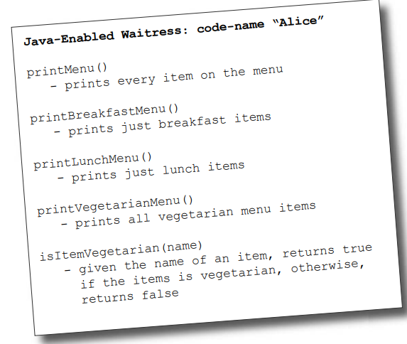

printMenu() methodunu nasıl implement edeceğimizi adım adım inceleyerek başlayalım:

1 - Her Menudeki tüm öğeleri yazdırmak için PancakeHouseMenu ve DinerMenu üzerinde getMenuItem() methodunu çağırarak
ilgili Menu öğelerini almanız gerekir. Her birinin farklı bir tür döndürdüğüne dikkat edin:

```
PancakeHouseMenu pancakeHouseMenu = new PancakeHouseMenu();
/* Method aynı görünüyor, ancak çağrılar farklı türler döndürüyor */
ArrayList<MenuItem> breakfastItems = pancakeHouseMenu.getMenuItems();

DinerMenu dinerMenu = new DinerMenu();
/* Method aynı görünüyor, ancak çağrılar farklı türler döndürüyor */
MenuItem[] lunchItems = dinerMenu.getMenuItems();
```

Implementasyon, kahvaltı öğelerinin bir ArrayList'te, öğle yemeği öğelerinin bir Array'de olduğunu gösteriyor.

2 - Şimdi, PancakeHouseMenu'deki öğeleri yazdırmak için breakfastItems ArrayList'indeki öğeler arasında döngü yapacağız.
Diner öğelerini yazdırmak için de Array'de döngü yapacağız.

```
for (MenuItem menuItem : breakfastItems) {
    System.out.print(menuItem.getName());
    System.out.println(menuItem.getDescription());
    System.out.println(menuItem.getPrice());
}

for (MenuItem lunchItem : lunchItems) {
    /* Array'de null check implemente ediyorum */
    if (lunchItem != null) {
        System.out.print(lunchItem.getName() + " ");
        System.out.println(lunchItem.getDescription());
        System.out.println(lunchItem.getPrice());
    }
}
```

3 - Her zaman her iki Menuyü de almamız ve öğeleri arasında yineleme yapmak için iki loops kullanmamız gerekecek. Farklı
bir implementasyona sahip başka bir restoran edinilirse, üç loop'umuz olacaktır

# What now? (Şimdi ne olacak)

Mel ve Lou bizi zor bir duruma sokuyorlar. Implementasyonlarını değiştirmek istemiyorlar çünkü bu, her bir Menu
sınıfında bulunan çok sayıda kodun yeniden yazılması anlamına gelecektir. Ancak içlerinden biri pes etmezse, bakımı ve
genişletilmesi zor olacak bir Waitress implementasyonu işine sahip olacağız. Menuler için aynı interface'i implemente
etmelerine izin vermenin bir yolunu bulabilirsek gerçekten iyi olur (getMenuItems() methodunun dönüş türü Externalında
zaten
yakınlar).Bu şekilde Waitress kodundaki concrete referansları en aza indirebilir ve ayrıca her iki Menu üzerinde iterate
yapmak için gereken çoklu loop'lardan kurtulabiliriz. Kulağa hoş geliyor mu? Peki, bunu nasıl yapacağız?

# Can we encapsulate the iteration? (Iteration'ı kapsülleyebilir miyiz?)

Bu kitapta öğrendiğimiz bir şey varsa, o da değişenleri encapsulate etmektir. Burada neyin değiştiği çok açık:
Menulerden döndürülen farklı nesne koleksiyonlarının neden olduğu iterasyon. Peki bunu encapsulate edebilir miyiz? Fikir
üzerinde çalışalım...

1 - Breakfast öğeleri arasında gezinmek için **ArrayList** üzerinde size() ve get() methodlarını kullanırız:

```
for (int i = 0; i < breakfastItems.size(); i++) {
    MenuItem menuItem = breakfastItems.get(i);
}
```

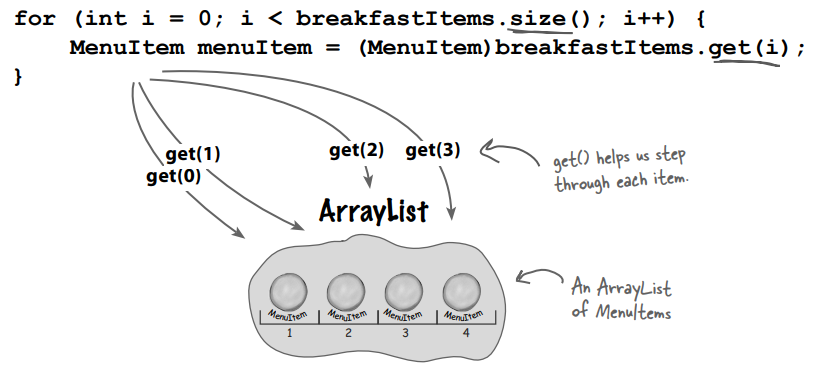

2 - Lunch öğeleri arasında iterate yapmak için Array length field'ını ve MenuItem Array üzerindeki Array subscript
gösterimini kullanırız.

```
for (int i = 0; i < lunchItems.length; i++) {
    MenuItem menuItem = lunchItems[i];
}
```

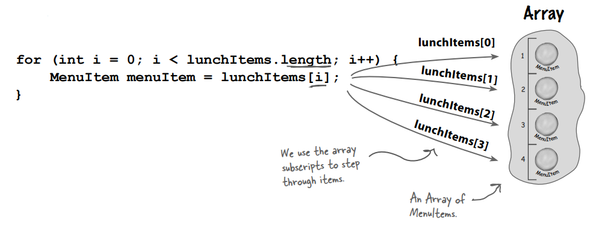

Öğeler arasında geçiş yapmak için Array subscript'lerini kullanırız.

# Meet the Iterator Pattern (Iterator Pattern ile buluşma)

Görünüşe göre, iteration'i encapsulate etme planımız gerçekten işe yarayabilir; ve muhtemelen tahmin ettiğiniz gibi, bu
Iterator Kalıbı adı verilen bir Tasarım Kalıbıdır. Iterator Deseni hakkında bilmeniz gereken ilk şey, Iterator adlı bir
interface'e dayanmasıdır. İşte olası bir Iterator arayüzü:

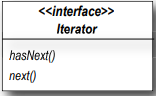

hasNext() methodu bize yığın içerisinde iterate edilecek daha fazla eleman olup olmadığını söyler. next() methodu,
yığındaki bir sonraki nesneyi döndürür.

Şimdi, bu interface'e sahip olduğumuzda, her türlü nesne koleksiyonu için Iterator'ları implement edebiliriz: Array'ler,
List'ler, HashTable'lar, ... favori nesne koleksiyonunuzu seçin. Diyelim ki DinerMenu'de kullanılan Array için bir
Iterator uygulamak istedik. Şöyle görünecektir:

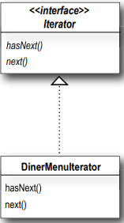

DinerMenuIterator, bir Array MenuItems üzerinde nasıl iterate yapılacağını bilen bir Iterator implementasyonudur.
COLLETION dediğimizde sadece bir grup nesneyi kastederiz. List'ler, Array'ler, hashtable'lar gibi çok farklı veri
yapılarında saklanabilirler, ancak yine de koleksiyonlardır. Bazen bunlara AGGREGATES de diyoruz. Devam edelim ve bu
Iterator'ı implemente edelim ve nasıl çalıştığını görmek için DinerMenu'ya hook'layalım...

# Adding an Iterator to DinerMenu (DinerMenu'ye Iterator Ekleme)

DinerMenu'ye bir Iterator eklemek için öncelikle Iterator Interface'ini tanımlamamız gerekir:

```
public interface Iterator {
    /* hasNext() methodu, üzerinde iterate edilecek daha fazla öğe olup olmadığını gösteren bir boolean döndürür...
    boolean hasNext();
    /* next methodu bir sonraki elemanı döndürür */
    Object next();
}
```

### Ve şimdi Diner Menusü için çalışan Concrete bir Iterator implement etmemiz gerekiyor:

```
/* Iterator interface'ini implement ediyoruz */
public class DinerMenuIterator implements Iterator<MenuItem> {
    MenuItem[] menuItems;

    /*position array üzerindeki iteration'ın geçerli konumunu korur */
    int position = 0;

    /* Constructor, üzerinde iterate yapacağımız Menu öğeleri Array'ini alır */
    public DinerMenuIterator(MenuItem[] menuItems) {
        this.menuItems = menuItems;
    }

    /* hasNext() methodu, Array'in tüm öğelerini görüp görmediğimizi kontrol eder ve iterate edilecek daha fazla öğe
    varsa true değerini döndürür.*/
    @Override
    public boolean hasNext() {
        return position < menuItems.length && menuItems[position] != null;
    }

    /* next() methodu Array'de ki bir sonraki öğeyi döndürür ve position'ı artırır. Diner şefi maksimum boyutlu bir
    Array ayırdığı için, yalnızca Array'in sonunda olup olmadığımızı değil, aynı zamanda bir sonraki öğenin null olup
    olmadığını da kontrol etmemiz gerekir, bu da daha fazla öğe olmadığını gösterir. */
    @Override
    public MenuItem next() {
        MenuItem menuItem = menuItems[position];
        position += 1;
        return menuItem;
    }
}
```

# Reworking the Diner Menu with Iterator (Iterator ile DinerMenu'yu Yeniden Düzenleme)

Tamam, iterator'ı elde ettik. Bunu DinerMenu'ye yerleştirme zamanı; tek yapmamız gereken bir DinerMenuIterator
oluşturmak ve bunu client'a döndürmek için bir method eklemek:

```
public class DinerMenu {
    private static final int MAX_ITEMS = 6;
    int numberOfItems = 0;
    MenuItem[] menuItems;

    public DinerMenu() {
        menuItems = new MenuItem[MAX_ITEMS];
        addItem(
                "Vegetarian BLT",
                "(Fakin’) Bacon with lettuce & tomato on whole wheat",
                true,
                2.99);
        addItem("BLT",
                "Bacon with lettuce & tomato on whole wheat",
                false,
                2.99);
        addItem("Soup of the day",
                "Soup of the day, with a side of potato salad",
                false,
                3.29);
        addItem("Hotdog",
                "A hot dog, with saurkraut, relish, onions, topped with cheese",
                false,
                3.05);
    }
    private void addItem(String name, String description, boolean vegeterian, double price) {
        MenuItem menuItem = new MenuItem(name, description, vegeterian, price);
        if (numberOfItems >= MAX_ITEMS) {
            System.err.println("Sorry, menu is full! Can’t add item to menu");
        } else {
            menuItems[numberOfItems] = menuItem;
            numberOfItems += 1;
        }
    }

    /* getMenuItems() methoduna artık ihtiyacımız olmayacak ve aslında bunu istemiyoruz çünkü dahili implementasyonumuzu
    açığa çıkarıyor! İşte createIterator() methodu. menuItems Array'inden bir DinerMenuIterator oluşturur ve bunu
    client'a döndürür */
    public Iterator<MenuItem> createIterator(){
        /* Iterator interface'ini döndürüyoruz. Client'in Menu öğelerinin DinerMenu'de nasıl tutulduğunu ya da
        DinerMenuIterator'ın nasıl implement edildiğini bilmesi gerekmez. Sadece Menudeki öğeler arasında adım adım
        ilerlemek için iterator'ları kullanması gerekir.*/
        return new DinerMenuIterator(menuItems);
    }
}
```

### Şimdi de PancakeHouseIterator'ı yazalım;

```
public class PancakeHouseIterator implements Iterator<MenuItem> {
    ArrayList<MenuItem> pancakeHouseItems;
    int position = 0;

    public PancakeHouseIterator(ArrayList<MenuItem> pancakeHouseItems) {
        this.pancakeHouseItems = pancakeHouseItems;
    }

    @Override
    public boolean hasNext() {
        /* ArrayList için null check'e gerek olmadığı için kontrol yapılmıyor */
        return position < pancakeHouseItems.size();
    }

    @Override
    public MenuItem next() {
        MenuItem item = pancakeHouseItems.get(position);
        position++;
        return item;
    }
}
```

### PancakeHouseMenu class'ını da iterator kullanımı için refactor edelim

```
public class PancakeHouseMenu {
    ArrayList<MenuItem> menuItems;

    public PancakeHouseMenu() {
        menuItems = new ArrayList<>();
        addItem(
                "K&B's Pancake Breakfast",
                "Pancakes with scrambled eggs, and toast",
                true, 2.99);
        
        addItem("Regular Pancake Breakfast",
                "Pancakes with fried eggs, sausage",
                false,
                2.99);

        addItem("Blueberry Pancakes",
                "Pancakes made with fresh blueberries",
                true,
                3.49);

        addItem("Waffles",
                "Waffles, with your choice of blueberries or strawberries",
                true,
                3.59);
    }

    private void addItem(String name, String description, boolean vegetarian, double price) {
        MenuItem menuItem = new MenuItem(name, description, vegetarian, price);
        menuItems.add(menuItem);
    }

    public Iterator<MenuItem> createIterator() {
        return new PancakeHouseIterator(menuItems);
    }
}
```

# Fixing up the Waitress code (Waitress kodunun düzeltilmesi)

Şimdi iterator kodunu Waitress'e entegre etmemiz gerekiyor. Bu süreçte bazı fazlalıklardan kurtulabilmeliyiz.
Entegrasyon oldukça basit: önce bir Iterator alan bir printMenu() methodu oluşturuyoruz, ardından Iterator'ı almak ve
yeni methoda aktarmak için her Menude createIterator() methodunu kullanıyoruz.

```
public class Waitress {
    PancakeHouseMenu pancakeHouseMenu;
    DinerMenu dinerMenu;

    /* Constructor'da waitress 2 adet Menu alır */
    public Waitress(PancakeHouseMenu pancakeHouseMenu, DinerMenu dinerMenu) {
        this.pancakeHouseMenu = pancakeHouseMenu;
        this.dinerMenu = dinerMenu;
    }

    public void printMenu(){
        /* printMenu() methodu artık her Menu için bir tane olmak üzere iki iterator oluşturmaktadır */
        Iterator<MenuItem> pancakeIterator = pancakeHouseMenu.createIterator();
        Iterator<MenuItem> dinerIterator = dinerMenu.createIterator();

        System.out.println("MENU\n----\nBREAKFAST");
        /* Ve sonra her iterator ile overload edilmiş printMenu() methodunu çağırır */
        printMenu(pancakeIterator);

        System.out.println("\nLUNCH");
        /* Ve sonra her iterator ile overload edilmiş printMenu() methodunu çağırır */
        printMenu(dinerIterator);
    }

    /* Overloaded printMenu() methodu, Menu öğeleri arasında adım adım ilerlemek ve bunları yazdırmak için Iterator
    kullanır */
    public void printMenu(Iterator<MenuItem> iterator){
        /* Başka öğe olup olmadığını test edin */
        while(iterator.hasNext()){
            /* Bir sonraki öğeyi alın */
            MenuItem menuItem = iterator.next();
            /* Name, price ve description almak ve yazdırmak için menuItem'i kullanın */
            System.out.print(menuItem.getName());
            System.out.print(menuItem.getPrice());
            System.out.println(menuItem.getDescription());
        }
    }
}
```

# Testing our code (Kodumuzu test etme)

Her şeyi test etme zamanı geldi. Biraz test sürüşü kodu yazalım ve Waitress'in nasıl çalıştığını görelim...

```
public static void main(String[] args) {
    /* Önce yeni Menuleri oluşturuyoruz */
    PancakeHouseMenu pancakeHouseMenu = new PancakeHouseMenu();
    DinerMenu dinerMenu = new DinerMenu();

    /* Sonra bir waitress yaratıyoruz ve Menuleri ona veriyoruz */
    Waitress waitress = new Waitress(pancakeHouseMenu,dinerMenu);
    /* sonra onları print ederiz */
    waitress.printMenu();
}
```

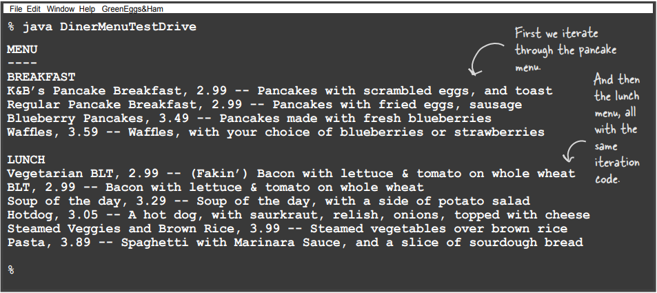

# What have we done so far? (Şimdiye kadar ne yaptık?)

Başlangıç olarak, Objectville aşçılarımızı çok mutlu ettik. Farklılıklarını çözdüler ve kendi implementasyonlarını
korudular. Onlara bir PancakeHouseMenuIterator ve bir DinerMenuIterator verdiğimizde, tek yapmaları gereken bir
createIterator() methodu eklemekti ve işleri bitti. Bu süreçte kendimize de yardımcı olduk. Waitress'in bakımı ve
ileride genişletilmesi çok daha kolay olacak. Tam olarak ne yaptığımızı gözden geçirelim ve sonuçlarını düşünelim:

### Sürdürülmesi Zor Waitress Implementasyonu

* Menuler iyi bir şekilde encapsulate edilmemiştir; Diner'ın bir Array, PancakeHouse'un ise bir ArrayList kullandığını
  görebiliriz.

* MenuItems boyunca iterate etmek için iki loop'a ihtiyacımız var.

* Waitress concrete sınıflara (MenuItem[] ve ArrayList) bound olmaktadır.

* Waitress, interface'leri neredeyse aynı olmasına rağmen iki farklı Concrete Menu sınıfına bağlıdır.

### Iterator Tarafından Desteklenen Yeni Waitress

* Menu implementasyonları artık encapsulate edilmiştir. Waitress'in, Menulerin Menu öğeleri koleksiyonunu nasıl tuttuğu
  hakkında hiçbir fikri yoktur.

* İhtiyacımız olan tek şey, Iterator'ı implement ettiği sürece herhangi bir öğe koleksiyonunu polymorphic olarak handle
  eden bir loop'dur

* Waitress artık bir interface (Iterator) kullanmaktadır.

* Menu interface'leri artık tamamen aynı, hala ortak bir interface'imiz yok, bu da Waitress'in hala iki Concrete Menu
  sınıfına bağlı olduğu anlamına geliyor. Bunu düzeltsek iyi olur.

# What we have so far... (Şu ana kadar elimizde ne var?)

İşleri temizlemeden önce, mevcut tasarımımıza kuş bakışı bir göz atalım.

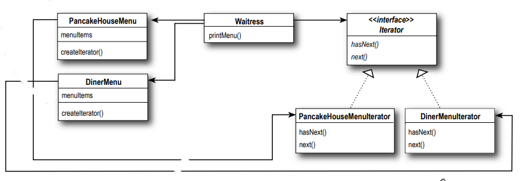

**PancakeHouseMenu - DinerMenu** : Bu iki Menu tam olarak aynı method setini implement ediyor, ancak aynı Interface'i
implement etmiyorlar. Bunu düzelteceğiz ve Waitress'i Concrete Menuler üzerindeki herhangi bir bağımlılıktan
kurtaracağız.

**Waitress** : Iterator, Waitress'in Concrete sınıfların gerçek implementasyonundan ayrılmasını sağlar. Bir Menu'nun bir
Array, bir ArrayList veya PostIt notları ile implement edilip edilmediğini bilmesine gerek yoktur. Tek önemsediği,
iteration'ı yapmak için bir Iterator alabilmesidir.

**Iterator** : Artık ortak bir Iterator interface'i kullanıyoruz ve iki Concrete sınıf implemente ettik

**PancakeHouseMenuIterator - DinerMenuIterator** : PancakeHouseMenu ve DinerMenu yeni createIterator() methodunu
implement eder; kendi Menu öğeleri implementasyonları için iterator oluşturmaktan sorumludurlar.

Iterator'ın bize, kümeyi kendi interface'ini öğelerinin geçişini desteklemek için bir grup methodlar karıştırmaya
zorlamadan bir kümenin öğeleri arasında adım atmanın bir yolunu verdiğini unutmayın. Ayrıca, iterator'ın
implementasyonunun toplamın Externalında yaşamasına izin verir; başka bir deyişle, etkileşimi encapsulate ettik.

# Making some improvements... (Bazı iyileştirmeler yapıyorum...)

Tamam, PancakeHouseMenu ve DinerMenu'nün interface'lerinin tamamen aynı olduğunu biliyoruz ve yine de onlar için ortak
bir interface tanımlamadık. Bu yüzden, bunu yapacağız ve Waitress'i biraz daha temizleyeceğiz. Neden Java Iterator
interface'ini kullanmadığımızı merak ediyor olabilirsiniz - bunu sıfırdan bir iterator'ın nasıl oluşturulacağını
görebilmeniz için yaptık. Şimdi bunu yaptığımıza göre, Java Iterator interface'ini kullanmaya geçeceğiz, çünkü kendi
geliştirdiğimiz Iterator interface'i yerine bunu implement ederek çok fazla avantaj elde edeceğiz. Ne tür bir avantaj?
Birazdan göreceksiniz. İlk olarak, java.util.Iterator arayüzüne göz atalım:

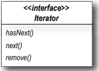

Bu tıpkı önceki tanımımıza benziyor. Ancak next() metodu tarafından döndürülen son öğeyi aggregate (toplamdan)
çıkarmamızı sağlayan ek bir methodumuz var (remove()). Bu çocuk oyuncağı olacak: Sadece PancakeHouseMenuIterator ve
DinerMenuIterator'ın extend ettiği interface'i değiştirmemiz gerekiyor, değil mi? Neredeyse... aslında bundan daha da
kolay. Sadece java.util kendi Iterator interface'ine sahip olmakla kalmaz, aynı zamanda ArrayList bir iterator döndüren
bir iterator() methoduna sahiptir. Başka bir deyişle, ArrayList için kendi iterator'imizi implemente etmemize hiç gerek
kalmadı. Bununla birlikte, DinerMenu için yine de implementasyonumuza ihtiyacımız olacak çünkü iterator() methodunu (
veya bir dizi iterator'ını oluşturmanın başka bir yolunu) desteklemeyen bir Array'e dayanıyor.

**---DIALOGS---**

Q : Ya temel nesne koleksiyonundan bir şeyi remove etme olanağı sağlamak istemiyorsam?

A : remove() methodu optional olarak kabul edilir. remove methodunu sağlamak zorunda değilsiniz. Ancak, Iterator
interface'inin bir parçası olduğu için bu methodu sağlamanız gerektiği açıktır. Iterator'ınız da remove() methoduna izin
vermeyecekseniz, java.lang.UnsupportedOperationException runtime exception atmak isteyeceksiniz. Iterator API
dokümantasyonu bu exception'ın remove() methodundan atılabileceğini belirtir ve iyi bir vatandaş olan herhangi bir
client remove() methodunu çağırırken bu exception'i kontrol edecektir.

Q : remove() aynı nesne koleksiyonu üzerinde farklı iterator'lar kullanan multiple threads altında nasıl davranır?

A : Koleksiyon üzerinde iterating yaparken koleksiyon değişirse remove() methodunun behavior'u belirtilmemiştir. Bu
nedenle, bir koleksiyona concurrently olarak erişirken kendi multithreaded kodunuzu tasarlarken dikkatli olmalısınız.

# Cleaning things up with java.util.Iterator (java.util.Iterator ile işleri temizlemek)

PancakeHouseMenu ile başlayalım, onu java.util.Iterator olarak değiştirmek kolay olacak. Sadece PancakeHouseMenuIterator
sınıfını siliyoruz, PancakeHouseMenu'nun üstüne bir import java.util.Iterator ekliyoruz ve PancakeHouseMenu'nun bir
satırını değiştiriyoruz:

PancakeHouseMenu;

```
public Iterator<MenuItem> createIterator() {
    /* Şimdi kendi iterator'ımızı oluşturmak yerine, menuItems ArrayList üzerindeki iterator() methodunu
    çağırıyoruz */
    return menuItems.iterator();
}
```

Ve işte bu kadar, PancakeHouseMenu tamamlandı. Şimdi DinerMenu'nun java.util.Iterator ile çalışmasını sağlayacak
değişiklikleri yapmamız gerekiyor;

DinerMenuIterator class'ına remove methodunu ekliyorum;

```
@Override
public void remove() {
    if (position <= 0) {
        throw new IllegalStateException("You can't remove an item until you've done at least one next()");
    }
    if (menuItems[position - 1] != null) {
        for (int i = position - 1; i < (menuItems.length - 1); i++) {
            menuItems[i] = menuItems[i + 1];
        }
        menuItems[menuItems.length - 1] = null;
    }
}
```

remove() fonksiyonunu implement etmemiz gerekiyor. Burada, şef sabit boyutlu bir Array kullandığı için, remove()
çağrıldığında tüm öğeleri bir yukarı kaydırıyoruz.

# We are almost there... (Neredeyse geldik)

Sadece Menulere ortak bir interface vermemiz ve Waitress'i biraz elden geçirmemiz gerekiyor. Menu interface'i oldukça
basit: ileride addItem() gibi birkaç method daha eklemek isteyebiliriz, ancak şimdilik bu methodu genel interface'in
Externalında tutarak şeflerin Menulerini kontrol etmelerine izin vereceğiz:

```
/* Bu, client'ların Menudeki öğeler için bir iterator almasını sağlayan basit bir interface'dir */
public interface Menu {
    Iterator<MenuItem> createIterator();
}
```

Şimdi hem PancakeHouseMenu hem de DinerMenu sınıf tanımlarına bir implements Menu eklememiz ve Waitress'i güncellememiz
gerekiyor:

Waitress;

```
public class Waitress {

    /* Concrete class'lar yerine Menu isimli interface'i kullanıyoruz */
    Menu pancakeHouseMenu;
    Menu dinerMenu;

    /* Concrete class'lar yerine Menu isimli interface'i kullanıyoruz */
    public Waitress(Menu pancakeHouseMenu, Menu dinerMenu) {
        this.pancakeHouseMenu = pancakeHouseMenu;
        this.dinerMenu = dinerMenu;
    }

    public void printMenu(){
        Iterator<MenuItem> pancakeIterator = pancakeHouseMenu.createIterator();
        Iterator<MenuItem> dinerIterator = dinerMenu.createIterator();

        System.out.println("MENU\n----\nBREAKFAST");
        printMenu(pancakeIterator);

        System.out.println("\nLUNCH");
        printMenu(dinerIterator);
    }
    public void printMenu(Iterator<MenuItem> iterator){
        while(iterator.hasNext()){
            MenuItem menuItem = iterator.next();
            System.out.print(menuItem.getName());
            System.out.print(menuItem.getPrice());
            System.out.println(menuItem.getDescription());
        }
    }
}
```

# What does this get us? (Bu bize ne kazandıracak?)

PancakeHouseMenu ve DinerMenu sınıfları Menu adında bir interface implement ederler. Waitress, Concrete sınıf yerine
interface kullanarak her Menu nesnesine başvurabilir. Böylece, Waitress ve Concrete sınıflar arasındaki bağımlılığı
"programming to an interface, not an implementation" yaparak azaltıyoruz.

Yeni Menu interface'inin PancakeHouseMenu ve DinerMenu tarafından implement edilen createIterator() adında bir methodu
vardır. Her Menu sınıfı, Menu öğelerinin dahili implementasyonu için uygun olan Concrete bir Iterator oluşturma
sorumluluğunu üstlenir.

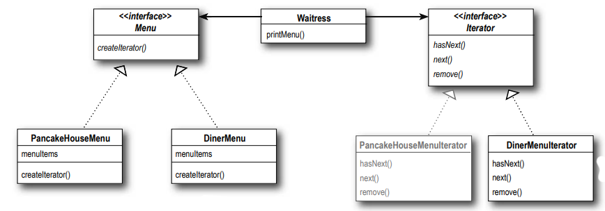

**Menu <interface>** : İşte yeni Menu interface'imiz. Yeni method olan createIterator()'ı belirtiyor.

**PancakeHouseMenu - DinerMenu** : artık Menu interface'ini implement etmektedir, bu da yeni createIterator() methodunu
implement etmeleri gerektiği anlamına gelmektedir. Her Concrete Menu, uygun Concrete Iterator sınıfını oluşturmaktan
sorumludur.

**Waitress** : Artık Waitress'in yalnızca Menu'ler ve Iterator'lar ile ilgilenmesi gerekiyor.

**Iterator <interface>** : Waitress'i Menulerin implementasyonundan ayırdık, böylece artık öğe listesinin nasıl
implement edildiğini bilmek zorunda kalmadan herhangi bir Menu öğesi listesi üzerinde iterate etmek için bir Iterator
kullanabiliriz.

**PancakeHouseMenuIterator** : Artık java.util tarafından sağlanan ArrayList iterator'ını kullanıyoruz.
Artık buna ihtiyacımız yok (Silinen iterator)

**DinerMenuIterator** : DinerMenu, createIterator() methodundan bir DinerMenuIterator döndürür çünkü Menu öğeleri
array'i üzerinde iterate yapmak için gereken iterator türü budur.

# Iterator Pattern defined

Iterator Pattern'ini kendi iterator'ınızla nasıl implement edeceğinizi zaten gördünüz. Ayrıca Java'nın bazı koleksiyon
odaklı sınıflarında (ArrayList) iterator'ları nasıl desteklediğini de gördünüz. Şimdi sıra kalıbın resmi tanımına göz
atmaya geldi:

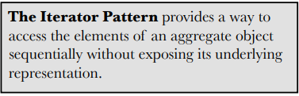

Iterator Pattern, bir aggregate nesnenin öğelerine erişmenin, onun temel temsilini açığa çıkarmadan sıralı bir şekilde
yapılmasını sağlayan bir method sunar.

Bu oldukça mantıklı: bu desen, bir koleksiyonun öğeleri arasında dolaşmanızı sağlar ve bu dolaşım operationinde
nesnelerin
iç yapısını bilmek zorunda kalmazsınız. İki Menu implementasyonu ile bunu gördünüz. Ancak iterator'ların tasarımınıza
etkisi de aynı derecede önemlidir: tüm koleksiyon nesnelerinizin öğelerine erişmenin tek tip bir yolunu elde
ettiğinizde, bu koleksiyonlarla çalışan polymorphic kod yazabilirsiniz. Örneğin, printMenu() methodu, Menu öğelerinin
bir Array veya ArrayList'te tutulup tutulmadığıyla ilgilenmez (ya da Iterator oluşturabilen başka bir şeyle ilgilenmez),
yeter ki bir Iterator elde edebilsin.

Iterator Pattern, tasarımınız üzerindeki diğer önemli etkisi, öğelerin gezinme sorumluluğunu aggregate nesnesinden alıp
iterator nesnesine vermesidir. Bu, sadece aggregate interface'ini ve implementasyonunu daha basit tutmakla kalmaz, aynı
zamanda iterasyon sorumluluğunu aggregate'den alır ve aggregate'in odaklanması gereken şeylere odaklanmasını sağlar (
nesnelerin bir koleksiyonunu yönetmek), iterasyonla uğraşmak yerine. Şimdi, tüm parçaları context'e yerleştirmek için
sınıf diyagramına bakalım.

Iterator Deseni, bir Collection öğelerinin üzerinde gezinmeyi sağlayarak altta yatan implementasyonu açığa
çıkarmadan yapılmasına olanak tanır.

Ayrıca, gezinme görevini aggregate'e değil, iterator nesnesine yükler. Bu, aggregate interface'ini ve implementasyonunu
basitleştirir ve sorumluluğun yerine konmasını sağlar, doğru bir noktaya taşır.

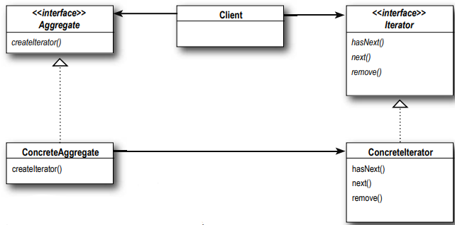

**Aggregate <interface>** : Koleksiyonlarınız için ortak bir Interface'iniz olması, Client'iniz için kullanışlıdır;
Client'inizi nesne koleksiyonunuzun implementasyonundan bağımsız hale getirir.

**ConcreteAggregate** : nesnelerin bir koleksiyonuna sahiptir ve koleksiyonu için bir Iterator döndüren methodu
implement eder. Her ConcreteAggregate, nesne koleksiyonu üzerinde dolaşabilen bir ConcreteIterator'ı instatiating'den
sorumludur.

**Iterator <interface>** : Iterator interface'i, tüm iteratorların implement etmesi gereken interface'i sağlar ve bir
koleksiyonun öğeleri üzerinde gezinme için bir dizi method içerir. Burada java.util.Iterator kullanıyoruz. Eğer Java'nın
Iterator interface'ini kullanmak istemiyorsanız, her zaman kendi Iterator'unuzu oluşturabilirsiniz.

**ConcreteIterator** : ConcreteIterator, iterasyonun mevcut konumunu yönetmekten sorumludur.

**--DIALOGS--**

Q : Başka kitaplarda Iterator sınıf diyagramının first(), next(), isDone() ve currentItem() methodlarıyla gösterildiğini
gördüm. Bu methodlar neden farklıdır?

A : Eski kullanılan method adları bu örneklerde kullanılan klasik adlardı. Zamanla bu adlar değişti ve şimdi
java.util.Iterator içinde next(), hasNext() hatta remove() gibi methodlar var. Klasik methodlara bakalım. next() ve
currentItem() methodları java.util içinde birleştirilmiş durumda. isDone() methodu açıkça hasNext() haline gelmiş; ancak
first() methoduna karşılık gelen bir methodumuz yok. Bunun nedeni, Java'da genellikle gezinmeyi yeniden başlatmak için
yeni bir iterator alıyor olmamız. Yine de bu interface'ler arasında çok az fark olduğunu görebilirsiniz. Aslında
iterator'larınıza verebileceğiniz geniş bir behavior yelpazesi var. remove() metodu, java.util.Iterator içindeki bir
extension örneğidir.

Q : "Internal" iterator'lar ve "external" iterator'lar hakkında bir şeyler duydum. Bunlar nedir? Örnekte hangi türü
implement ettik?

A : External iteratorlar, Client'e next() gibi methodları çağırarak iterasyon üzerinde açık kontrol sağlar. Diğer yandan
Internal iteratorlar, iterasyon sürecini kendileri kontrol eder; yani iterator, öğeler arasında gezinmeyi ve bu öğeler
üzerinde operationler yapmayı belirler. Internal iteratorlarda, iteratora bir operation iletilir ve iterator bu
operationi
gerçekleştirir. Internal iteratorlar, iterasyonun doğrudan kontrolünün olmaması nedeniyle daha az esnek olarak kabul
edilebilir; ancak bir operasyonu ileterek iteratora iterasyon yapmasını söylemek daha kolay olabilir, çünkü iterator tüm
işi sizin için yapar.

Q : İleriye olduğu kadar geriye de gidebilen bir Iterator implement edebilir miyim?

A : Kesinlikle. Bu durumda, muhtemelen önceki öğeye gitmek için bir method ve öğe koleksiyonunun başında olduğunuzu
belirten bir method eklemek istersiniz. Java'nın Collection Framework'ü, standart Iterator interface'ine previous() ve
birkaç başka method ekleyen başka bir tür iterator interface'i sağlar. Bu iterator, List interface'ini implement eden
herhangi bir Collection tarafından desteklenir

Q : Hashtable gibi doğası gereği sırasız olan bir koleksiyonda iteration sıralamasını kim tanımlar?

A : Iterator'lar sıralama garantisi vermez. Temel koleksiyonlar, bir hashtable'da veya bir bag'de olduğu gibi sırasız
olabilir; hatta duplicate'ler içerebilirler. Dolayısıyla, sıralama, hem temel koleksiyonun özellikleriyle hem de
implementasyon ile ilgilidir. Genel olarak, Collection belgeleri aksi belirtilmedikçe sıralama hakkında varsayımlar
yapmamanız gerekir.

Q : Bir Iterator kullanarak "polymorphic kod" yazabileceğimizi söylediniz; bunu daha fazla açıklayabilir misiniz?

A : Iteratörleri parametre olarak alan methodlar yazdığımızda, polymorphic iterasyonu kullanıyoruz. Bu, Iterator'ü
desteklediği sürece herhangi bir koleksiyon üzerinde iteration yapabilen kod oluşturduğumuz anlamına gelir. Koleksiyonun
nasıl implement edildiği ile ilgilenmiyoruz, iteration için hala kod yazabiliriz.

Q : Java kullanıyorsam, Java iterator'ını zaten kullanan sınıflarla kendi iterator implementasyonlarımı kullanabilmek
için her zaman java.util.Iterator interface'ini kullanmak istemeyecek miyim?

A : Evet, ortak bir Iterator interface'iniz varsa, kendi koleksiyonlarınızı ArrayList ve Vector gibi Java
koleksiyonlarıyla daha kolay bir şekilde birleştirebilirsiniz. Ancak unutmayın, kendi koleksiyonlarınız için Iterator
interface'ine işlevsellik eklemeniz gerekiyorsa, her zaman Iterator interface'ini extend edebilirsiniz.

Q : Java'da bir Enumeration interface'i gördüm; bu Iterator Modelini implement ediyor mu?

A : Tabii, şunun hakkında konuşmuştuk: Adapter Bölümünde. Hatırlıyor musun? java.util.Enumeration,
java.util.Iterator ile değiştirilmiş olan eski bir implementasyondur. Enumeration'ın hasMoreElements() olarak karşılığı
olan hasNext() ve nextElement() olarak karşılığı olan next() adında iki methodu vardır. Ancak, muhtemelen daha fazla
Java sınıfı tarafından desteklendiği için Enumeration yerine Iterator kullanmak isteyeceksiniz. Birinden diğerine
dönüştürme ihtiyacınız varsa, Enumeration ve Iterator için Adapter'i implement ettiğiniz Adapter Bölümünü tekrar
inceleyin.

# Single Responsibility

Aggregate yapılarımızın Internal koleksiyonlarını ve ilgili operationleri, AYNI ZAMANDA iteration metotlarını
implementasyonlarına izin versek ne olurdu? Zaten bunun, aggregate içindeki method sayısını artıracağını biliyoruz, ama
peki bunda ne sakınca var? Neden bu kadar kötü bir şey olarak görülüyor? Nedenini anlamak için, öncelikle bir sınıfın
sadece kendi işiyle ilgilenmesine (bir tür aggregate'i yönetmek) değil, aynı zamanda daha fazla sorumluluk (iteration
gibi) üstlenmesine izin verdiğimizde, sınıfa değişmesi için iki neden vermiş olduğumuzu kabul etmeniz gerekir. İki mi?
Evet, iki: koleksiyon bir şekilde değişirse değişebilir ve iteration şeklimiz değişirse değişebilir. Böylece dostumuz
DEĞİŞİM bir kez daha başka bir tasarım ilkesinin merkezinde yer alıyor:


Bir sınıfın değişmesi için tek bir neden olmalıdır. Bir sınıfın her sorumluluğu potansiyel bir değişim alanıdır. Birden
fazla sorumluluk, birden fazla değişim alanı anlamına gelir. Bu ilke, her sınıfı tek bir sorumluluk altında tutmamız
için bize yol gösterir.

Bir sınıfta değişiklik yapmaktan vebadan kaçar gibi kaçınmak istediğimizi biliyoruz - kodun değiştirilmesi, sorunların
ortaya çıkması için her türlü fırsatı sağlar. Değiştirmenin iki yolu olması, sınıfın gelecekte değişme olasılığını
artırır ve değiştiğinde, tasarımınızın iki yönünü etkileyecektir. Çözüm nedir? İlke, her bir sorumluluğu tek bir sınıfa
ve sadece tek bir sınıfa vermemiz için bize rehberlik eder. Doğru, bu kadar kolay ama yine de değil: tasarımda
sorumluluğu ayırmak, yapılması en zor şeylerden biridir. Beyinlerimiz bir dizi davranışı görmekte ve aslında iki veya
daha fazla sorumluluk olsa bile bunları bir araya getirmekte çok iyidir. Başarılı olmanın tek yolu, tasarımlarınızı
incelerken özenli olmak ve sisteminiz büyüdükçe bir sınıfın birden fazla şekilde değiştiğine dair sinyallere dikkat
etmektir.

# Cohesion

Cohesion, bir sınıfın veya modülün tek bir amacı veya sorumluluğu ne kadar yakından desteklediğinin bir ölçüsü olarak
kullanıldığını duyacağınız bir terimdir. Bir modül veya sınıf, birbiriyle ilişkili bir dizi işlev etrafında
tasarlandığında High Cohesion'a sahip olduğunu, birbiriyle ilişkisiz bir dizi işlev etrafında tasarlandığında ise
Low Cohesion'a sahip olduğunu söyleriz. Cohesion, Single Responsiblity Principle'dan daha genel bir kavramdır, ancak
ikisi yakından ilişkilidir. Bu ilkeye uyan sınıflar High Cohesion eğilimindedir ve birden fazla sorumluluk üstlenen
ve Low Cohesion'a sahip sınıflara göre daha sürdürülebilirdir.

# Taking a look at the Café Menu (Kafe Menusüne Bir Göz Atalım)

Menumüze yeni eklenecek olan CafeMenu class'ı;

```
/* CafeMenu yeni Menu interface'ini implement etmiyor, ancak bu kolayca düzeltilebilir */
public class CafeMenu {
    Hashtable<String,MenuItem> menuItems;

    public CafeMenu() {
        /* Cafe, Menu öğelerini bir Hashtable'da depoluyor. Bu Iterator'ı destekliyor mu? Birazdan göreceğiz...*/
        this.menuItems = new Hashtable<>();

        /* Diğer Menulerde olduğu gibi, Menu öğeleri constructor'da initialized edilir. */
        addItem("Veggie Burger and Air Fries",
                "Veggie burger on a whole wheat bun, lettuce, tomato, and fries",
                true,
                3.99);
        addItem("Soup of the day",
                "A cup of the soup of the day, with a side salad",
                false,
                3.69);
        addItem("Burrito",
                "A large burrito, with whole pinto beans, salsa, guacamole",
                true,
                4.29);
    }

    /* Burada yeni bir MenuItem oluşturuyoruz ve menuItems hashtable'ına ekliyoruz */
    public void addItem (String name, String description, boolean vegetarian, double price){
        MenuItem menuItem = new MenuItem(name,description,vegetarian,price);
        /* HashTable Key,Value pair'larından oluştuğu için burada ekleme yapıyoruz */
        menuItems.put(menuItem.getName(),menuItem);
    }

    /* Artık buna ihtiyacımız olmayacak */
    public Hashtable<String, MenuItem> getMenuItems() {
        return menuItems;
    }
}
```

# Reworking the Café Menu code (Cafe Menu kodunun yeniden düzenlenmesi)

Cafe Menusünü framework'umuze entegre etmek kolaydır. Neden mi? Çünkü Hashtable, Iterator'ı destekleyen Java
koleksiyonlarından biridir. Ancak ArrayList ile tam olarak aynı değildir...

```
public class CafeMenu implements Menu{

    /* Değerleri depolamak için yaygın bir veri yapısı olduğu için Hashtable kullanıyoruz; daha yeni olan HashMap'i de
    kullanabilirsiniz.*/
    Hashtable<String,MenuItem> menuItems;

    public CafeMenu() {
        this.menuItems = new Hashtable<>();

        addItem("Veggie Burger and Air Fries",
                "Veggie burger on a whole wheat bun, lettuce, tomato, and fries",
                true,
                3.99);
        addItem("Soup of the day",
                "A cup of the soup of the day, with a side salad",
                false,
                3.69);
        addItem("Burrito",
                "A large burrito, with whole pinto beans, salsa, guacamole",
                true,
                4.29);
    }
    public void addItem (String name, String description, boolean vegetarian, double price){
        MenuItem menuItem = new MenuItem(name,description,vegetarian,price);
        menuItems.put(menuItem.getName(),menuItem);
    }

    /* Ve işte burada createIterator() methodunu implement ediyoruz. Hashtable'ın tamamı için değil, sadece value'lar
    için bir Iterator aldığımıza dikkat edin */
    @Override
    public Iterator<MenuItem> createIterator() {
        return menuItems.values().iterator();
    }
}
```

# Adding the Café Menu to the Waitress (CafeMenu'nun Waitress'a eklenmesi)

Yeni Menumüzü desteklemesi için Waitress'i değiştirmeye ne dersiniz? Artık Waitress Iterator'ları beklediğine
göre.

```
public class Waitress {
    Menu pancakeHouseMenu;
    Menu dinerMenu;
    Menu cafeMenu;

    /* Café Menusü, diğer Menulerle birlikte Constructor'da Waitress'e aktarılır ve bir instance variable'da saklanır */
    public Waitress(Menu pancakeHouseMenu, Menu dinerMenu, Menu cafeMenu) {
        this.pancakeHouseMenu = pancakeHouseMenu;
        this.dinerMenu = dinerMenu;
        this.cafeMenu = cafeMenu;
    }

    public void printMenu() {
        Iterator<MenuItem> pancakeIterator = pancakeHouseMenu.createIterator();
        Iterator<MenuItem> dinerIterator = dinerMenu.createIterator();

        /* DINER Menumüz için Café'nin Menusünü kullanıyoruz. Yazdırmak için tek yapmamız gereken bir iterator
        oluşturmak ve bunu printMenu() fonksiyonuna aktarmak. İşte bu kadar! */
        Iterator<MenuItem> cafeIterator = cafeMenu.createIterator();

        System.out.println("MENU\n----\nBREAKFAST");
        printMenu(pancakeIterator);

        System.out.println("\nLUNCH");
        printMenu(dinerIterator);

        System.out.println("\nDINNER");
        printMenu(cafeIterator);
    }

    public void printMenu(Iterator<MenuItem> iterator) {
        while (iterator.hasNext()) {
            MenuItem menuItem = iterator.next();
            System.out.print(menuItem.getName());
            System.out.print(menuItem.getPrice());
            System.out.println(menuItem.getDescription());
        }
    }
}
```

# Breakfast, lunch AND diner

Tüm bunların çalıştığından emin olmak için test sürüşümüzü güncelleyelim.

```
public static void main(String[] args) {
    /* Önce yeni Menuleri oluşturuyoruz */
    PancakeHouseMenu pancakeHouseMenu = new PancakeHouseMenu();
    DinerMenu dinerMenu = new DinerMenu();
    CafeMenu cafeMenu = new CafeMenu();

    Waitress waitress = new Waitress(pancakeHouseMenu,dinerMenu,cafeMenu);
    waitress.printMenu();
}
```

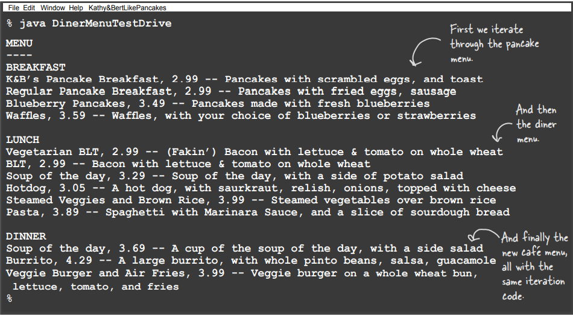

# What did we do? (Biz ne yaptık)

Waitress'a Menu öğeleri üzerinde iteration yapmanın kolay bir yolunu vermek istedik... ve Menu öğelerinin nasıl
implemente edildiğini bilmesini istemedik. Menu öğelerimizin iki farklı implementasyonu ve iteration için iki farklı
interface'i vardı.

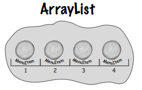 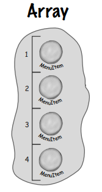

# We decoupled the Waitress (Waitress'i ayrıştırdık....)

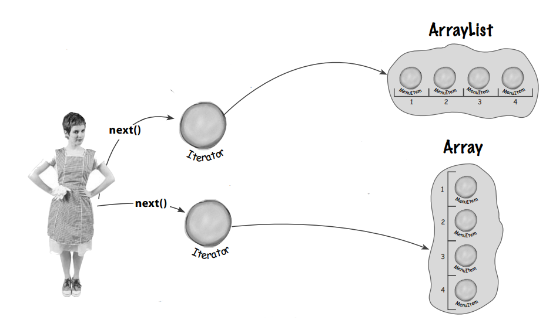

Waitress'a, üzerinde iterate etmesi gereken her nesne grubu için bir Iterator verdik... Iterator'lardan biri ArrayList,
diğeri Array için. Artık hangi implementasyonu kullandığımız konusunda endişelenmesine gerek yok; Menu öğeleri üzerinde
iteration yapmak için her zaman aynı interface'i - Iterator - kullanıyor. Implementasyondan ayrıştırılmıştır.

ArrayList'in yerleşik bir Iterator'i vardır...

... Array'in yerleşik bir Iterator'ı yoktur, bu yüzden kendimizinkini oluşturduk.

# ... and we made the Waitress more extensible (... ve Waitress'i daha extensible hale getirdik)

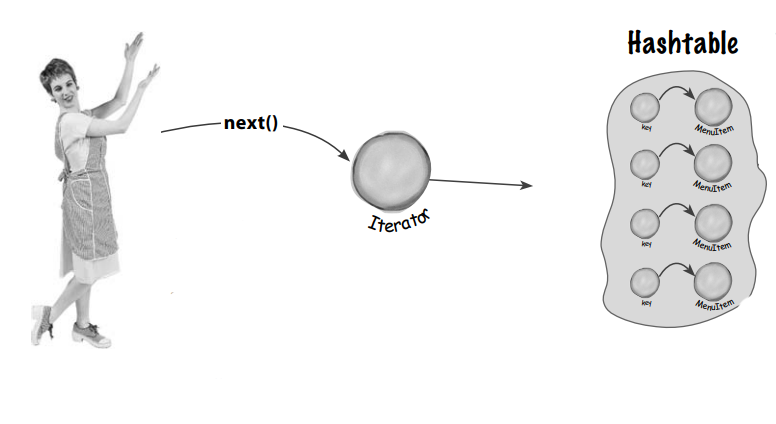

Ona bir Iterator vererek onu Menu öğelerinin implementasyonundan ayırdık, böylece istersek kolayca yeni Menuler
ekleyebiliriz. Bu onun için daha iyi, çünkü artık herhangi bir nesne grubu üzerinde iteration yapmak için aynı kodu
kullanabilir. Bizim için de daha iyi çünkü implementasyon detayları açığa çıkmıyor.

Menu öğelerine kolayca başka bir implementasyon ekledik (HashTable) ve bir Iterator sağladığımız için Waitress ne
yapacağını biliyordu.Hashtable değerleri için bir Iterator oluşturmak kolaydı; values.iterator() dediğinizde bir
iterator elde edersiniz

# But there’s more! (Ama dahası da var)

Java, nesne gruplarını saklamanıza ve almanıza olanak tanıyan çok sayıda "collection" sınıfı sunar. Örneğin, Vector ve
LinkedList. Çoğunun farklı interface'leri vardır. Ancak neredeyse hepsi bir Iterator elde etmenin bir yolunu
destekler.Iterator'ı desteklemiyorlarsa da sorun değil, çünkü artık kendi Iterator'ınızı nasıl oluşturacağınızı
biliyorsunuz.

# Iterators and Collections (Iterator'lar ve Collection'lar)

Java Collection Framework'une ait birkaç sınıf kullanıyoruz. Bu "framework", kullandığımız ArrayList gibi sınıfların
yanı sıra Vector, LinkedList, Stack ve PriorityQueue gibi birçok sınıfı içeren bir dizi sınıf ve arayüzden oluşur. Bu
sınıfların her biri java.util.Collection arayüzünü uygular; bu arayüz, nesne gruplarını manipüle etmek için bir dizi
yararlı yöntem içerir. Hadi arayüze kısaca bir göz atalım:

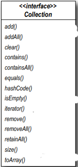

Gördüğünüz gibi, burada her türlü iyi şey var. Nasıl implemente edildiğini bile bilmeden koleksiyonunuza öğeler
ekleyebilir ve çıkarabilirsiniz. İşte eski dostumuz, iterator() methodu. Bu methodla, Collection interface'ini implement
eden herhangi bir sınıf için bir Iterator elde edebilirsiniz. Diğer kullanışlı methodlar arasında eleman sayısını almak
için size() ve koleksiyonunuzu bir Array'e dönüştürmek için toArray() yer alır. Collections ve Iterator ile ilgili güzel
olan şey, her Collection nesnesinin kendi Iterator'ını nasıl oluşturacağını bilmesidir. Bir ArrayList üzerinde
iterator() işlevi çağrıldığında, ArrayLists için yapılmış concrete bir Iterator döndürülür, ancak kullandığı Abstract
sınıfı görmeniz veya endişelenmeniz gerekmez; sadece Iterator interface'ini kullanırsınız. Hashtable, Iterator'ü dolaylı
olarak destekleyen birkaç sınıftan biridir. CafeMenu'yu implement ettiğimizde gördüğünüz gibi, ondan bir Iterator
alabilirsiniz, ancak bunu yalnızca önce values adlı koleksiyonunu alarak yapabilirsiniz. Bunu düşündüğünüzde mantıklı
olduğunu göreceksiniz: Hashtable, iki tür nesneyi içerir: KEY ve VALUES. Değerler üzerinde dönmek istiyorsak,
önce onları Hashtable'dan almalı ve sonra Iterator'ü elde etmeliyiz.

# Iterators and Collections in Java 5 (Java 5'de Iterator'lar ve Collection'lar)

Şuna bir bakın, Java 5'te Collection'lar üzerinde iteration desteği eklediler, böylece bir Iterator istemenize bile
gerek kalmadı. Java 5, açıkça bir Iterator oluşturmadan bir Collection veya Array üzerinde iteration yapmanızı sağlayan
for/in adlı yeni bir for deyimi biçimi içerir. for/in kullanmak için, aşağıdaki gibi görünen bir for deyimi
kullanırsınız:

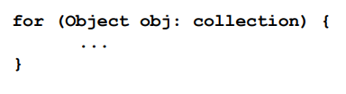

Collection'da ki her nesne üzerinde iterates yapar. obj, döngü boyunca her seferinde Collection'da ki bir sonraki
elemana atanır

for/in kullanarak bir ArrayList üzerinde nasıl iterate yapacağınız aşağıda açıklanmıştır:

```
ArrayList items = new ArrayList();
items.add(new MenuItem("Pancakes", "delicious pancakes", true, 1.59);
items.add(new MenuItem("Waffles", "yummy waffles", true, 1.99);
items.add(new MenuItem("Toast", "perfect toast", true, 0.59);
for (MenuItem item: items) {
    /* Liste üzerinde iterate yapın ve her bir öğeyi yazdırın */
    System.out.println("Breakfast item: " + item);
}
```

# Is the Waitress ready for prime time? (Waitress prime time için hazır mı?)

Waitress uzun bir yol kat etti, ancak printMenu() methoduna yapılan bu üç çağrının biraz çirkin göründüğünü kabul
etmelisiniz. Gerçekçi olalım, her yeni Menu eklediğimizde Waitress implementasyonunu açmamız ve daha fazla kod eklememiz
gerekecek. "Open Closed Priniple ihlali" diyebilir misiniz?

```
public void printMenu() {
    
    /* 3 adet createIterator call ediliyor */
    Iterator<MenuItem> pancakeIterator = pancakeHouseMenu.createIterator();
    Iterator<MenuItem> dinerIterator = dinerMenu.createIterator();
    Iterator<MenuItem> cafeIterator = cafeMenu.createIterator();

    System.out.println("MENU\n----\nBREAKFAST");
    printMenu(pancakeIterator);

    System.out.println("\nLUNCH");
    printMenu(dinerIterator);

    System.out.println("\nDINNER");
    printMenu(cafeIterator);
}
```

Her Menu eklediğimizde veya kaldırdığımızda bu kodu değişiklikler için açmamız gerekecek. Bu Waitress'in hatası değil.
Menu implementasyonunu decoupling ve iteration'i bir iterator'a çıkarma konusunda harika bir iş çıkardık. Ancak Menuleri
hala ayrı, bağımsız nesnelerle idare ediyoruz - bunları birlikte yönetmek için bir yola ihtiyacımız var. Bu o kadar da
kötü değil, tek yapmamız gereken Menuleri bir ArrayList'e paketlemek ve ardından her bir Menuyü iterate etmek için
iteratörünü almak. Waitress'teki kod basit olacak ve herhangi bir sayıda Menuyü işleyecektir.

```
public class Waitress {
    ArrayList<Menu> menus;

    /* Şimdi sadece Menulerden oluşan bir ArrayList alıyoruz */
    public Waitress(ArrayList<Menu> menus) {
        this.menus = menus;
    }

    public void printMenu() {
        /* Ve her Menunün iterator'ını overloaded printMenu() methoduna aktararak Menuler arasında iteration yaparız.*/
        for (Menu menu : menus) {
            printMenu(menu.createIterator());
        }
    }

    public void printMenu(Iterator<MenuItem> iterator) {
        while (iterator.hasNext()) {
            MenuItem menuItem = iterator.next();
            System.out.print(menuItem.getName());
            System.out.print(menuItem.getPrice());
            System.out.println(menuItem.getDescription());
        }
    }
}
```

Menulerin name'lerini kaybetmiş olsak da bu oldukça iyi görünüyor, ancak her Menuye name'leri ekleyebiliriz.

# Just when we thought it was safe (Tam da güvenli olduğunu düşündüğümüz anda)

Şimdi de bir tatlı alt Menusü eklemek istiyorlar. Tamam, şimdi ne olacak? Artık sadece birden fazla Menuyü değil, Menu
içindeki Menuleri de desteklememiz gerekiyor. Tatlı Menusünü DinerMenu koleksiyonunun bir öğesi haline getirebilseydik
güzel olurdu, ancak şu anda implement edildiği şekliyle bu işe yaramayacaktır.

Ne istiyoruz (bunun gibi bir şey):

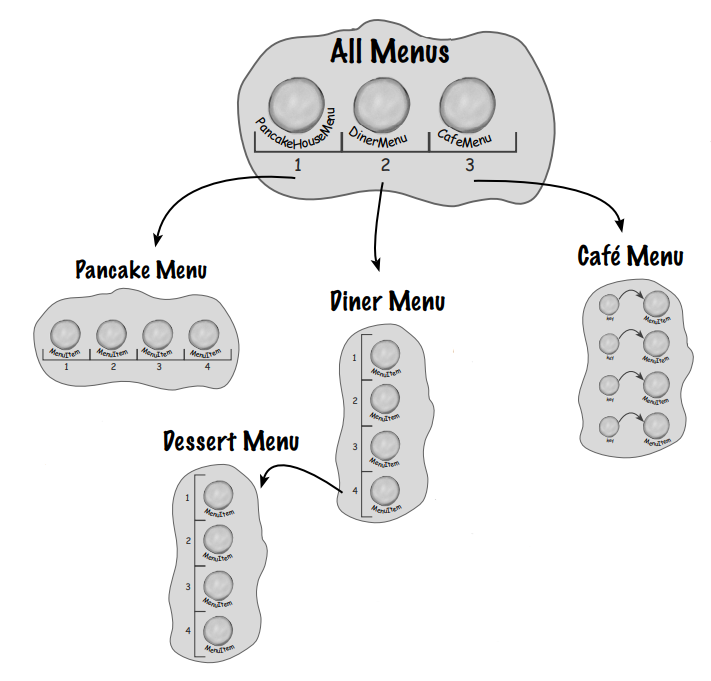

**AllMenus** : İşte her bir restoranın Menulerini içeren Arraylist'imiz

**PancakeMenu** : ArrayList

**DinerMenu** : Array. Diner Menu'nün bir alt Menu tutmasına ihtiyacımız var, ancak türleri farklı olduğu için aslında
bir MenuItem Array'ine bir Menu atayamayız, bu yüzden bu işe yaramayacaktır.

**CafeMenu** : HashTable

MenuItem Array'ine bir tatlı Menusü atayamayız. Değişiklik zamanı!

# What do we need? (Neye ihtiyacımız var?)

Şefin implementasyonuna tüm Menuler (ve şimdi alt Menuler) üzerinde çalışacak kadar genel bir hale getirmek için idari
bir karar alma zamanı geldi. Bu doğru, şeflere Menulerini yeniden implement etmelerinin zamanının geldiğini
söyleyeceğiz. Gerçek şu ki, öyle bir karmaşıklık seviyesine ulaştık ki, eğer tasarımı şimdi elden geçirmezsek, daha
fazla satın alma veya alt Menuyü barındırabilecek bir tasarıma asla sahip olamayacağız. Peki, yeni tasarımımızda
gerçekten neye ihtiyacımız var?

* Menuleri, alt Menuleri ve Menu öğelerini barındıracak tree şeklinde bir yapıya ihtiyacımız var.

* Her Menudeki öğeler arasında geçiş yapmak için en az şu anda iterator'lar ile yaptığımız kadar kullanışlı bir yol
  tuttuğumuzdan emin olmamız gerekir.

* Öğeler arasında daha esnek bir şekilde geçiş yapabilmemiz gerekebilir. Örneğin, yalnızca Diner'in tatlı Menusü
  üzerinde iteration yapmamız gerekebilir veya tatlı alt Menusü de dahil olmak üzere Diner'in tüm Menusü üzerinde
  iteration yapmamız gerekebilir.

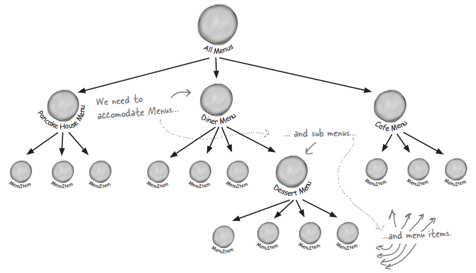

Menuleri, iç içe geçmiş alt Menuleri ve Menu öğelerini temsil etmemiz gerektiğinden, bunları doğal olarak tree benzeri
bir yapıya sığdırabiliriz. Menulere uyum sağlamalıyız... Yine de tree'de ki tüm öğeleri dolaşabilmemiz gerekiyor. Bir
Menu üzerinde daha esnek bir şekilde dolaşabilmemiz gerekiyor.

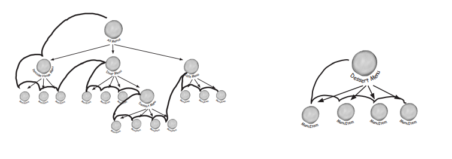

# The Composite Pattern defined (Composite Pattern açıklaması)

Doğru, bu sorunu çözmek için başka bir kalıp kullanacağız. Iterator'dan vazgeçmedik - hala çözümümüzün bir parçası
olacak - ancak Menuleri yönetme sorunu Iterator'ın çözemediği yeni bir boyut kazandı. Bu yüzden geri adım atacağız ve bu
sorunu Composite Pattern ile çözeceğiz. Bu desen konusunda lafı dolandırmayacağız, şimdi resmi tanımını yapacağız:

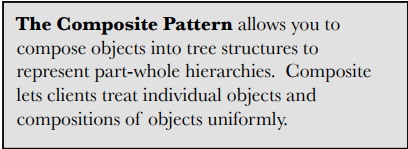

Composite Deseni, part-whole (parça-bütün) hiyerarşilerini temsil etmek için nesneleri tree yapıları halinde
oluşturmanıza olanak tanır. Composite, Client'ların tek tek nesneleri ve nesne composition'larını aynı şekilde ele
almasını sağlar.

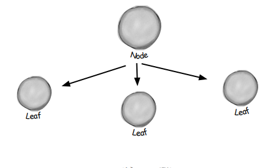

Alt öğeleri olan öğeler Node olarak adlandırılır. Children'i olmayan öğeler Leaf olarak adlandırılır. Bunu Menulerimiz
açısından düşünelim: bu kalıp bize iç içe geçmiş bir grup Menu ve Menu öğesini aynı yapıda işleyebilen bir tree yapısı
oluşturmanın bir yolunu sunar. Menuleri ve öğeleri aynı yapıya yerleştirerek bir part-whole (parça-bütün) hiyerarşisi
oluşturuyoruz; yani parçalardan (Menuler ve Menu öğeleri) oluşan ancak büyük bir über Menu gibi bir bütün olarak ele
alınabilen bir nesne tree'si.

Über Menumüzü oluşturduktan sonra, bu modeli "tek tek nesneleri ve composition'ları tek tip olarak" ele almak için
kullanabiliriz. Bu ne anlama geliyor? Menu öğelerinin yanı sıra Menuler, alt Menuler ve belki de alt Menulerden oluşan
bir tree yapımız varsa, herhangi bir Menu bir "composition'dır" çünkü hem diğer Menuleri hem de Menu öğelerini
içerebilir. Tek tek nesneler sadece Menu öğeleridir - başka nesneleri tutmazlar. Göreceğiniz gibi, Composition Deseni
izleyen bir tasarım kullanmak, tüm Menu yapısı üzerinde aynı operationi (yazdırma gibi!) uygulayabilen bazı basit kodlar
yazmamıza izin verecektir.

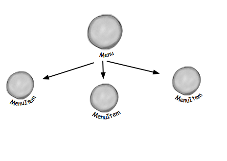

Menumüzü ve MenuItems'i bir tree yapısında temsil edebiliriz. Menus node'ları, MenuItems leaf'leridir

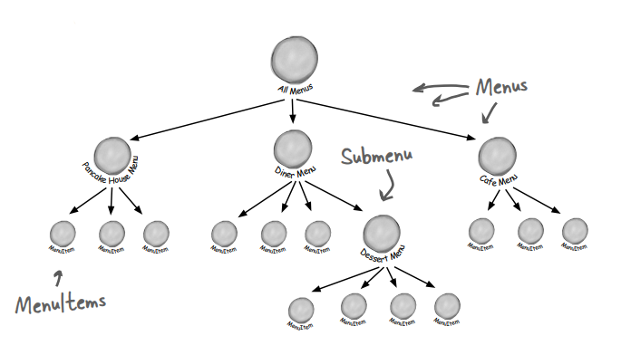

Keyfi olarak karmaşık tree'ler oluşturabiliriz.

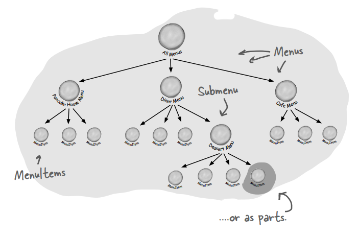

Ve onlara bir bütün olarak davranın, ya da parça olarak

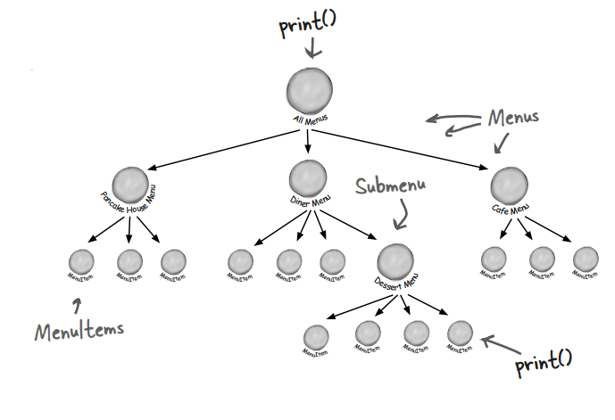

operationler bütüne uygulanabilir, ya da parçaya

Composite Desen, hem nesnelerin composition'larını hem de tek tek nesneleri node olarak içeren tree biçiminde nesne
yapıları oluşturmamızı sağlar. Composite bir yapı kullanarak, aynı operationleri hem composite'ler hem de tek tek
nesneler
üzerinde uygulayabiliriz. Başka bir deyişle, çoğu durumda nesnelerin composition'ları ile tek tek nesneler arasındaki
farkları göz ardı edebiliriz.

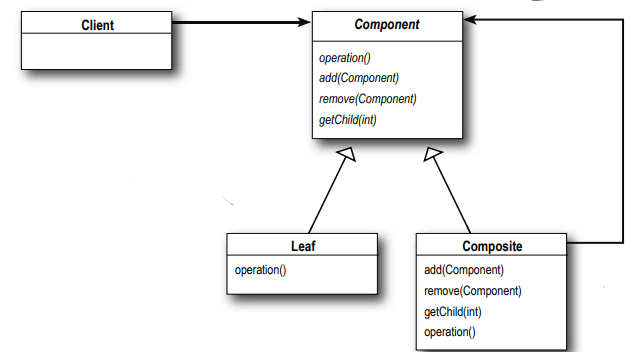

**Client** : Composition'da ki nesneleri manipüle etmek için Component interface'ini kullanır.

**Component** : Component, composition'da ki tüm nesneler için bir interface tanımlar: hem composite hem de leaf
node'lar. Component, add(), remove(), getChild() ve operation'ları için varsayılan bir behavior implement edebilir.

**Leaf** : Bir Leaf'in children'i yoktur. Bir Leaf, composition'da ki öğeler için behavior tanımlar. Bunu Composite'in
desteklediği operation'ları implement ederek yapar. Leaf'in ayrıca add(), remove() ve getChild() gibi bir leaf node
için pek de anlamlı olmayan methodları miras aldığını unutmayın. Bu konuya tekrar döneceğiz.

**Composite** : Composite'in rolü, children'ları olan component'lerin behaviour'unu tanımlamak ve Child component'leri
saklamaktır. Composite ayrıca Leaf'le ilgili operation'ları da implement eder. Bunlardan bazılarının bir Composite
üzerinde anlamlı olmayabileceğini unutmayın, bu durumda bir exception oluşturulabilir

**--DIALOGS--**

Q : Component, Composite, Trees? Kafam karıştı.

A : Bir Composite Component'ler içerir. Component'ler iki çeşittir: Composite'ler ve Leaf elemanlar. Kulağa recursive mi
geliyor? Evet öyle. Bir Composite bir dizi Children barındırır, bu Children'lar başka Composite'ler veya Leaf elemanlar
olabilir. Verileri bu şekilde düzenlediğinizde, root'unda bir composite ve composite'lerin leaf node'larına kadar
büyüyen dalları olan bir tree yapısı (aslında baş aşağı bir ağaç yapısı) elde edersiniz.

Q : Bunun iterator'lar ile ilişkisi nedir?

A : Unutmayın, yeni bir yaklaşım benimsiyoruz. Menuleri yeni bir çözümle yeniden implemente edeceğiz: Composite Desen.
Yani bir iterator'dan bir composite'e sihirli bir dönüşüm beklemeyin. Bununla birlikte, ikisi birlikte çok güzel
çalışıyor. Yakında iterator'ları composite implementasyonda birkaç şekilde kullanabileceğimizi göreceksiniz.

# Implementing the Menu Component

Tüm Component'ler MenuComponent interface'ini implement etmelidir; ancak leaf'ler ve node'lar farklı rollere sahip
olduğundan, her method için her zaman mantıklı bir varsayılan implementasyon tanımlayamayız. Bazen yapabileceğiniz en
iyi şey bir runtime exception atmaktır.

Tamam, MenuComponent Abstract sınıfı ile başlayacağız; hatırlayın, menu component'inin rolü leaf node'lar ve composite
node'lar için bir interface sağlamaktır. Şimdi "MenuComponent iki rol oynamıyor mu?" diye soruyor olabilirsiniz.
Olabilir ve bu noktaya geri döneceğiz. Ancak, şimdilik methodların varsayılan bir implementasyonunu sağlayacağız,
böylece MenuItem (Leaf) veya Menu (Composite) bazı methodları implement etmek istemezse (leaf node için getChild() gibi)
bazı temel behavior'lara geri dönebilirler:

```
public abstract class MenuComponent {

    /* "Composite" methodları, yani MenuComponents ekleme, kaldırma ve alma methodlarını bir araya getirdik */
    public void add(MenuComponent menuComponent){
        throw new UnsupportedOperationException();
    }

    public void remove(MenuComponent menuComponent){
        throw new UnsupportedOperationException();
    }

    public MenuComponent getChild(int i){
        throw new UnsupportedOperationException();
    }

    /* İşte "operation" methodları; bunlar MenuItems tarafından kullanılır. Birkaç sayfa sonra Menu kodunu
    gösterdiğimizde göreceğiniz gibi, bunlardan birkaçını Menu'de de kullanabiliriz. print(), hem Menu'lerimizin hem de
    MenuItems'in implemente edeceği bir "operation" methodudur, ancak burada varsayılan bir operation sağlıyoruz.*/
    public String getName(){
        throw new UnsupportedOperationException();
    }

    public String getDescription(){
        throw new UnsupportedOperationException();
    }

    public double getPrice(){
        throw new UnsupportedOperationException();
    }

    public boolean isVegetarian(){
        throw new UnsupportedOperationException();
    }

    public void print(){
        throw new UnsupportedOperationException();
    }
}
```

Bu methodlardan bazıları yalnızca MenuItems için, bazıları da yalnızca Menuler için anlamlı olduğundan, varsayılan
implementasyon UnsupportedOperationException'dır. Bu şekilde, MenuItem veya Menu bir operation'i desteklemiyorsa, hiçbir
şey yapmaları gerekmez, sadece varsayılan implementasyonu miras alabilirler.

# Implementing the MenuItem (MenuItem implementasyonu)

Tamam, MenuItem sınıfına bir şans verelim. Unutmayın, bu Composite diyagramındaki Leaf sınıftır ve Composite'in
elemanlarının behavior'unu implemente eder

```
/* Öncelikle MenuComponent interface'ini extend etmemiz gerekiyor. */
public class MenuItem extends MenuComponent{
    String name;
    String description;
    boolean vegetarian;
    double price;
    public MenuItem(String name, String description, boolean vegetarian, double price) {
        /* Constructor sadece name, description vb. alır ve hepsine bir referans tutar. Bu bizim eski menu item
        implementasyonumuza oldukça benzer.*/
        this.name = name;
        this.description = description;
        this.vegetarian = vegetarian;
        this.price = price;
    }

    /* İşte getter methodlarımız - tıpkı önceki implementasyonumuzda olduğu gibi.*/
    @Override
    public String getName() {
        return name;
    }

    @Override
    public String getDescription() {
        return description;
    }
    @Override
    public double getPrice() {
        return price;
    }
    @Override
    public boolean isVegetarian() {
        return vegetarian;
    }

    /* Bu, önceki implementasyondan farklıdır. Burada MenuComponent sınıfındaki print() methodunu override ediyoruz.
    MenuItem için bu method Menu girişinin tamamını yazdırır: name, description, price ve veggie olup olmadığı.*/
    @Override
    public void print() {
        System.out.println("  " + getName());
        if (isVegetarian()) System.out.print("v");
        System.out.println(", " + getPrice());
        System.out.println("      -- " + getDescription());
    }
}
```

# Implementing the Composite Menu (Composite Menu implementasyonu)

Artık MenuItem'a sahip olduğumuza göre, sadece Menu adını verdiğimiz Composite sınıfa ihtiyacımız var. Unutmayın,
Composite sınıf MenuItem'ları veya diğer Menuleri tutabilir. MenuComponent'ten bu sınıfın implement etmediği birkaç
method var: getPrice() ve isVegetarian(), çünkü bunlar bir Menu için çok anlamlı değil.

```
/* Menu de tıpkı MenuItem gibi bir MenuComponent'tir */
public class Menu extends MenuComponent{

    /* Menu, MenuComponent türünde herhangi bir sayıda child'a sahip olabilir, bunları tutmak için internal bir
    ArrayList kullanacağız.*/
    ArrayList<MenuComponent> menuComponents;
    String name;
    String description;

    public Menu(String name, String description) {
        /* Bu, eski implementasyonumuzdan farklıdır: her Menuye bir isim ve bir açıklama vereceğiz. Daha önce, her menu
        için farklı sınıflara sahip olmaya güveniyorduk.*/
        menuComponents = new ArrayList<>();
        this.name = name;
        this.description = description;
    }

    /* İşte bir Menu'ye MenuItems veya diğer Menu'leri nasıl ekleyeceğiniz. Hem MenuItems hem de Menuler MenuComponent
    olduğundan, her ikisini de yapmak için tek bir methoda ihtiyacımız var. Ayrıca bir MenuComponent'i kaldırabilir
    veya bir MenuComponent alabilirsiniz.*/
    @Override
    public void add(MenuComponent menuComponent) {
        menuComponents.add(menuComponent);
    }

    @Override
    public void remove(MenuComponent menuComponent) {
        menuComponents.remove(menuComponent);
    }

    /* İşte name ve description almak için getter methodları. Dikkat edin, getPrice() veya isVegetarian() methodlarını
    override etmiyoruz çünkü bu methodlar bir Menu için mantıklı değil (isVegetarian() methodunun mantıklı olabileceğini
    tartışabilirsiniz). Birisi bu methodları bir Menu üzerinde çağırmaya çalışırsa UnsupportedOperationException alır.*/
    @Override
    public MenuComponent getChild(int i) {
        return menuComponents.get(i);
    }

    @Override
    public String getName() {
        return name;
    }

    @Override
    public String getDescription() {
        return description;
    }

    /* Menuyu yazdırmak için, Menunun name'ini ve description'i yazdırırız.*/
    @Override
    public void print() {
        System.out.print("\n" + getName());
        System.out.println(", " + getDescription());
        System.out.println("--------------------");
    }
}
```

Bir saniye, print() implementasyonunu anlamıyorum. Bir Leaf'e uygulayabildiğim operation'ların aynısını bir Composite de
uygulayabilmem gerektiğini sanıyordum. Bu implementasyon ile print() operation'ini bir Composite'e uygularsam, tek elde
ettiğim basit bir Menu Name ve Description oluyor. COMPOSITE'in bir çıktısını alamıyorum.

Mükemmel bir yakalama. Menu bir Composite olduğundan ve hem Menu Items'larını hem de diğer Menuleri içerdiğinden,
print() methodu içerdiği her şeyi yazdırmalıdır. Eğer öyle olmasaydı, tüm Composite'i iterate etmemiz ve her bir öğeyi
kendimiz yazdırmamız gerekirdi. Bu da Composite bir yapıya sahip olmanın amacına ters düşer. Göreceğiniz gibi, print()
operation'ini doğru bir şekilde implement etmek kolaydır çünkü her Component'in kendisini yazdırabileceğine
güvenebiliriz. Hepsi harika bir şekilde recursive ve harika. Bir göz atın:

```
@Override
public void print() {
    System.out.print("\n" + getName());
    System.out.println(", " + getDescription());
    System.out.println("--------------------");

    /* Tek yapmamız gereken print() methodunu değiştirerek sadece bu Menu hakkındaki bilgileri değil, bu Menünün
    tüm component'lerini (diğer Menüler ve MenuItems) yazdırmasını sağlamaktır. Bakın! Bir Iterator kullanabiliyoruz.
    Bunu Menu'nün tüm Component'lerini iterate etmek için kullanıyoruz... bunlar başka Menuler ya da MenuItems
    olabilir. Hem Menu'ler hem de MenuItems print() operation'ini implement ettiğinden, sadece print() operation'ını
    çağırıyoruz ve gerisi onlara kalıyor.*/
    for (MenuComponent next : menuComponents) {
        next.print();
    }
}
```

# Getting ready for a test drive...

Bu kodu bir test sürüşüne çıkarmanın zamanı geldi, ancak bunu yapmadan önce Waitress kodunu güncellememiz gerekiyor -
sonuçta bu kodun ana Client'i o:

```
public class Waitress {
    MenuComponent menuComponents;

    /* Evet! Waitress kodu gerçekten bu kadar basit. Şimdi ona sadece diğer tüm menüleri içeren en üst düzey
    menü component'ini veriyoruz. Buna menuComponents adını verdik.*/
    public Waitress(MenuComponent menuComponents) {
        this.menuComponents = menuComponents;
    }

    public void printMenu(){
        /* Tüm menü hiyerarşisini - tüm menüleri ve tüm menü item'larını - yazdırmak için tek yapması gereken en üst
        düzey menüde print() operation'ini çağırmaktır. Mutlu bir garsonumuz olacak.*/
        menuComponents.print();
    }
}
```

Tamam, test sürüşümüzü yazmadan önce son bir şey daha. Menu composite'inin runtime'da nasıl görüneceği hakkında bir
fikir edinelim:

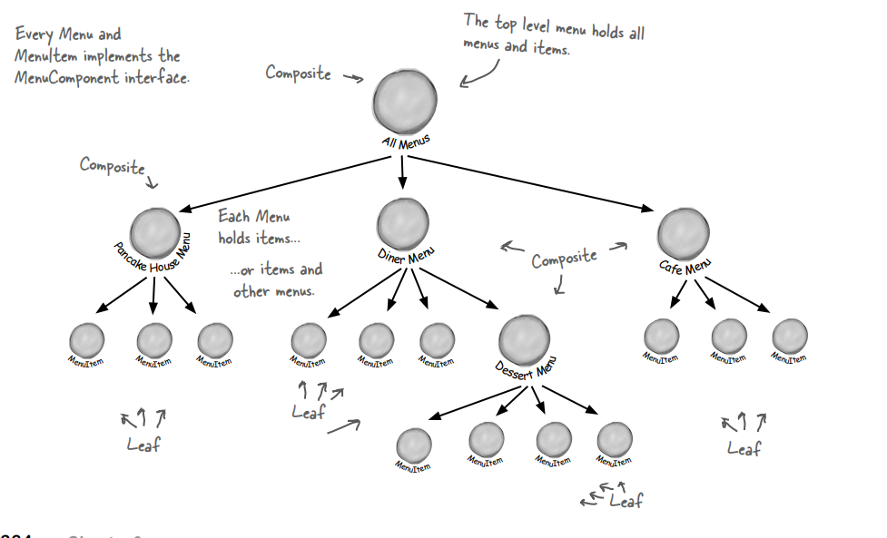

Her Menu ve MenuItem MenuComponent interface'ini implement eder.

# Now for the test drive...

Tamam, şimdi sadece bir test sürüşüne ihtiyacımız var. Önceki sürümümüzden farklı olarak, tüm menü oluşturma
operationlerini
test sürüşünde gerçekleştireceğiz. Her şeften bize yeni menüsünü vermesini isteyebiliriz, ancak önce hepsini test
edelim. İşte kod:

```
public class MenuTestDrive {
    public static void main(String[] args) {

        /* Önce tüm Menu nesnelerini oluşturalım */
        MenuComponent pancakeHouseMenu = new Menu(
                "PANCAKE HOUSE MENU",
                "Breakfast"
        );

        MenuComponent dinerMenu = new Menu(
                "DINER MENU",
                "Lunch"
        );

        MenuComponent cafeMenu = new Menu(
                "CAFE MENU",
                "Dinner"
        );

        MenuComponent dessertMenu = new Menu(
                "DESSERT MENU",
                "Dessert of cource"
        );

        /* Ayrıca şimdi allMenus adını vereceğimiz iki üst düzey menüye ihtiyacımız var */
        MenuComponent allMenus = new Menu("ALL MENUS", "All menus combined");

        /* Her Menu'yu en üst düzey Menu olan allMenus'a eklemek için Composite add() methodunu kullanıyoruz */
        allMenus.add(pancakeHouseMenu);
        allMenus.add(dinerMenu);
        allMenus.add(cafeMenu);

        pancakeHouseMenu.add(new MenuItem(
                "K&B's Pancake Breakfast",
                "Pancakes with scrambled eggs and toast",
                true,
                2.99));
        pancakeHouseMenu.add(new MenuItem(
                "Regular Pancake Breakfast",
                "Pancakes with fried eggs, sausage",
                false,
                2.99));
        pancakeHouseMenu.add(new MenuItem(
                "Blueberry Pancakes",
                "Pancakes made with fresh blueberries, and blueberry syrup",
                true,
                3.49));
        pancakeHouseMenu.add(new MenuItem(
                "Waffles",
                "Waffles with your choice of blueberries or strawberries",
                true,
                3.59));
        dinerMenu.add(new MenuItem(
                "Vegetarian BLT",
                "(Fakin') Bacon with lettuce & tomato on whole wheat",
                true,
                2.99));
        dinerMenu.add(new MenuItem(
                "BLT",
                "Bacon with lettuce & tomato on whole wheat",
                false,
                2.99));
        dinerMenu.add(new MenuItem(
                "Soup of the day",
                "A bowl of the soup of the day, with a side of potato salad",
                false,
                3.29));
        dinerMenu.add(new MenuItem(
                "Hot Dog",
                "A hot dog, with saurkraut, relish, onions, topped with cheese",
                false,
                3.05));
        dinerMenu.add(new MenuItem(
                "Steamed Veggies and Brown Rice",
                "Steamed vegetables over brown rice",
                true,
                3.99));
        dinerMenu.add(new MenuItem(
                "Pasta",
                "Spaghetti with marinara sauce, and a slice of sourdough bread",
                true,
                3.89));

        /* Ayrıca bir Menu'ye bir Menu ekliyoruz. dinerMenu'nün önemsediği tek şey, ister menü öğesi ister menü olsun,
        tuttuğu her şeyin bir MenuComponent olmasıdır */
        dinerMenu.add(dessertMenu);

        /* Tatlı Menusune biraz elmalı turta ekleyin... */
        dessertMenu.add(new MenuItem(
                "ApplePie",
                "Apple Pie with a flakey crust, topped with vanilla icecream",
                true,
                1.59
        ));
        dessertMenu.add(new MenuItem(
                "Cheesecake",
                "Creamy New York cheesecake, with a chocolate graham crust",
                true,
                1.99));
        dessertMenu.add(new MenuItem(
                "Sorbet",
                "A scoop of raspberry and a scoop of lime",
                true,
                1.89));

        Waitress waitress = new Waitress(allMenus);
        waitress.printMenu();
    }
}
```

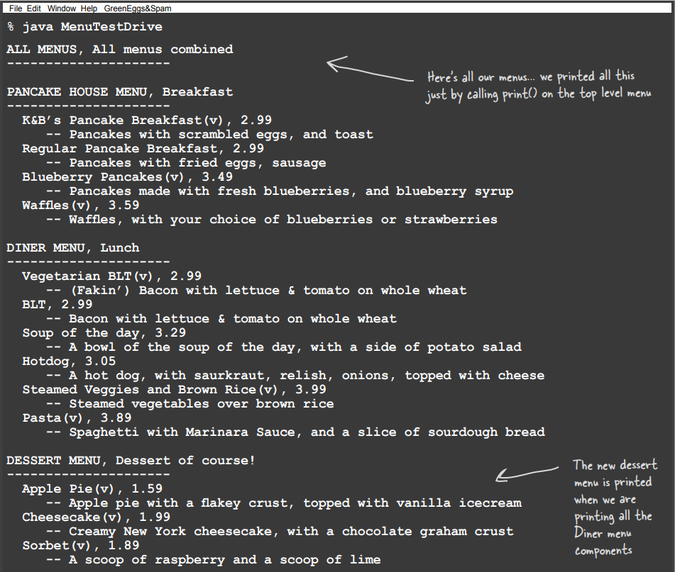

Hikaye nedir? Önce bize Bir Sınıf, Bir Sorumluluk diyorsunuz, şimdi de bir sınıfta iki sorumluluğu olan bir kalıp
veriyorsunuz. Composite Pattern bir hiyerarşiyi yönetiyor VE Menülerle ilgili operation'ları gerçekleştiriyor. Bu
gözlemde doğruluk payı vardır. Composite Modelin Tek Sorumluluk tasarım ilkesini alıp şeffaflıkla takas ettiğini
söyleyebiliriz. Şeffaflık nedir? Component interface'inin child yönetim operation'larını ve leaf operation'larını
içermesine izin vererek, bir client hem Compositelere hem de leaf node'lara aynı şekilde davranabilir; böylece bir
öğenin Composite mi yoksa Leaf node mu olduğu Client için şeffaf hale gelir

Component sınıfında her iki operation türüne de sahip olduğumuzdan, bir Client bir öğe üzerinde uygunsuz veya anlamsız
bir şey yapmaya çalışabileceğinden (bir menü öğesine menü eklemeye çalışmak gibi) biraz güvenlik kaybederiz. Bu bir
tasarım kararıdır; tasarımı diğer yöne çekebilir ve sorumlulukları interface'lere ayırabiliriz. Bu, tasarımımızı güvenli
hale getirecektir, çünkü öğeler üzerindeki uygunsuz çağrılar derleme zamanında veya çalışma zamanında yakalanacaktır,
ancak şeffaflığı kaybedeceğiz ve kodumuz koşulluları ve instanceof operatörünü kullanmak zorunda kalacaktır.

Sorunuza dönecek olursak, bu klasik bir tradeoff (ödünleşme) durumudur. Tasarım ilkeleri bize rehberlik eder, ancak
bunların tasarımlarımız üzerindeki etkisini her zaman gözlemlememiz gerekir. Bazen işleri bilerek ilkeyi ihlal ediyormuş
gibi görünen bir şekilde yaparız. Ancak bazı durumlarda bu bir bakış açısı meselesidir; örneğin, leaf node'lar child
yönetimi operation'larının olması (add(), remove() ve getChild() gibi) yanlış görünebilir, ancak yine de bakış açınızı
herzaman değiştirebilir ve bir leaf'i sıfır child'i olan bir node olarak görebilirsiniz.

# Flashback to Iterator (Iterator'a Geri Dönüş)

Birkaç sayfa önce size Iterator'ı bir Composite ile nasıl kullanacağınızı göstereceğimize söz vermiştik. Iterator'ı
zaten print() methodunun internal implementasyonun da kullandığımızı biliyorsunuz, ancak Waitress'in ihtiyaç duyması
halinde, örneğin tüm menüyü gözden geçirip vejetaryen öğeleri çıkarmak istediğinde, tüm bir composite üzerinde iterate
yapmasına da izin verebiliriz. Bir Composite iterator'ını implement etmek için her Component'e bir createIterator()
methodu ekleyelim. Abstract MenuComponent sınıfı ile başlayacağız:

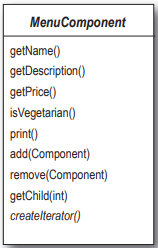

```
public abstract Iterator<MenuComponent> createIterator();
```

MenuComponent'e bir createIterator() methodu ekledik. Bu, her Menu ve MenuItem'ın bu methodu implement etmesi gerekeceği
anlamına gelir. Ayrıca, bir Composite üzerinde createIterator() çağrısının Composite'in tüm children'ları için geçerli
olması gerektiği anlamına gelir.

# The Composite Iterator

CompositeIterator CİDDİ bir iterator'dır. Component'de ki MenuItems üzerinde iteration ve tüm Child Menulerin (ve child
child Menulerin vb.) dahil edildiğinden emin olma görevi vardır. İşte kod. Dikkat edin, bu çok fazla kod değil, ancak
biraz zihin bükücü olabilir. Sadece üzerinden geçerken kendinize "recursion benim dostumdur, recursion benim
dostumdur" diye tekrarlayın.

```
/* Tüm iterator'lar gibi biz de java.util.Iterator interface'ini implement ediyoruz */
public class CompositeIterator implements Iterator<MenuComponent> {
    Stack<Iterator<MenuComponent>> stack = new Stack<>();

    /* Üzerinde iterate yapacağımız en üst düzey Composite'in iterator'i içeri aktarılır. Bunu bir Stack veri yapısına
    atıyoruz.*/
    public CompositeIterator(Iterator<MenuComponent> iterator) {
        stack.push(iterator);
    }

    @Override
    public MenuComponent next() {
        /* Tamam, Client bir sonraki öğeyi almak istediğinde, önce hasNext() methodunu çağırarak bir tane olduğundan
        emin oluruz... */
        if (hasNext()){
            /* Bir sonraki eleman varsa, mevcut iterator'i Stack'den çıkarır ve bir sonraki elemanını alırız */
            Iterator<MenuComponent> iterator = stack.peek();
            MenuComponent menuComponent = iterator.next();
            if (menuComponent instanceof Menu){
                /* Bu öğe bir menüyse, iterate'e dahil edilmesi gereken başka bir composite'e sahibiz, bu yüzden onu 
                Stack'e atarız. Her iki durumda da Component'i döndürürüz */
                stack.push(menuComponent.createIterator());
            }
            return menuComponent;
        } else return null;
    }

    @Override
    public boolean hasNext() {
        /* Bir sonraki elemanın olup olmadığını görmek için, Stack'in boş olup olmadığını kontrol ederiz; eğer öyleyse,
        yoktur. Aksi takdirde, iterator'i Stack'in tepesinden alır ve bir sonraki öğeye sahip olup olmadığına bakarız.
        Eğer yoksa Stack'den çıkarırız ve hasNext() fonksiyonunu recursive olarak çağırırız. */
        if (stack.isEmpty()) return false;
        else {
            Iterator<MenuComponent> iterator = stack.peek();
            if (!iterator.hasNext()){
                stack.pop();
                return hasNext();
            } else {
                /* Aksi takdirde bir sonraki eleman vardır ve true değerini döndürürüz */
                return true;
            }
        }
    }
}
```

Bu ciddi bir kod... Böyle bir Composite üzerinde iterate yapmanın neden MenuComponent sınıfında print() için yazdığımız
iterate kodundan daha zor olduğunu anlamaya çalışıyorum?

MenuComponent sınıfında print() methodunu yazdığımızda, Component de ki her bir öğeyi adımlamak için bir iterator
kullandık ve bu öğe bir Menu ise (bir MenuItem yerine), bunu işlemek için print() mehtodunu recursive olarak çağırdık.
Başka bir deyişle, MenuComponent iteration'i internal olarak kendisi gerçekleştiriyordu. Bu kod ile external bir
iterator implement ediyoruz, bu nedenle takip edilmesi gereken çok daha fazla şey var. Yeni başlayanlar için, external
bir iterator iteration'da ki konumunu korumalıdır, böylece dışarıdan bir Client hasNext() ve next() operation'larını
çağırarak iteration'i yönlendirebilir. Ancak bu durumda, kodumuzun bu konumu composite, recursive bir yapı üzerinde de
koruması gerekir. Bu nedenle, composite hiyerarşide yukarı ve aşağı hareket ederken konumumuzu korumak için Stack'leri
kullanırız.

# The Null Iterator

Tamam, şimdi bu Null Iterator ne hakkında? Şöyle düşünün: Bir MenuItem'ın üzerinde iterate edilebilecek hiçbir şeyi
yoktur, değil mi? Peki createIterator() methodunun implementasyonunu nasıl ele alacağız? İki seçeneğimiz var:

* Seçenek 1

```Return null``` createIterator() methodundan null döndürebiliriz, ancak o zaman null döndürülüp döndürülmediğini
görmek için Client'da koşullu koda ihtiyacımız olur.

* Seçenek 2

hasNext() çağrıldığında her zaman false döndüren bir iterator döndürür. Bu daha iyi bir plan gibi görünüyor. Hala bir
iterator döndürebiliriz, ancak Client'in null döndürülüp döndürülmediği konusunda endişelenmesi gerekmez. Gerçekte, "
no op" olan bir iterator oluşturuyoruz. İkinci seçenek kesinlikle daha iyi görünüyor. Buna NullIterator adını verelim ve
implement edelim.

```
/* Bu şimdiye kadar gördüğünüz en tembel iterator'dır, yolun her adımında pes eder */
public class NullIterator implements Iterator<MenuComponent> {

    /* En önemlisi hasNext() çağrıldığında her zaman false döndürüyoruz */
    @Override
    public boolean hasNext() {
        return false;
    }

    /* next() çağrıldığında null döndürüyoruz. */
    @Override
    public MenuComponent next() {
        return null;
    }
}
```

# Menu class'ını MenuComponent ile extend ediyoruz (MenuComponent'e createIterator methodu eklendi)

```
public class Menu extends MenuComponent {
    ArrayList<MenuComponent> menuComponents;
    Iterator<MenuComponent> iterator = null;
    String name;
    String description;

    public Menu(String name, String description) {
        menuComponents = new ArrayList<>();
        this.name = name;
        this.description = description;
    }

    @Override
    public void add(MenuComponent menuComponent) {
        menuComponents.add(menuComponent);
    }

    @Override
    public void remove(MenuComponent menuComponent) {
        menuComponents.remove(menuComponent);
    }

    @Override
    public MenuComponent getChild(int i) {
        return menuComponents.get(i);
    }

    @Override
    public String getName() {
        return name;
    }

    @Override
    public String getDescription() {
        return description;
    }

    @Override
    public void print() {
        System.out.print("\n" + getName());
        System.out.println(", " + getDescription());
        System.out.println("--------------------");

        for (MenuComponent menuComponent : menuComponents) {
            menuComponent.print();
        }
    }

    @Override
    public Iterator<MenuComponent> createIterator() {
        if (iterator == null) {
            iterator = new CompositeIterator(menuComponents.iterator());
        }
        return iterator;
    }
}
```

# MenuItem class'ını MenuComponent ile extend ediyoruz (MenuComponent'e createIterator methodu eklendi)

Iterator olarak NullIterator kullanacağız;

```
public class MenuItem extends MenuComponent{
    String name;
    String description;
    double price;
    boolean vegetarian;
    public MenuItem(String name, String description, boolean vegetarian, double price) {
        this.name = name;
        this.description = description;
        this.vegetarian = vegetarian;
        this.price = price;
    }

    @Override
    public String getName() {
        return name;
    }

    @Override
    public String getDescription() {
        return description;
    }
    @Override
    public double getPrice() {
        return price;
    }
    @Override
    public boolean isVegetarian() {
        return vegetarian;
    }

    @Override
    public void print() {
        System.out.println("  " + getName());
        if (isVegetarian()) System.out.print("v");
        System.out.println(", " + getPrice());
        System.out.println("      -- " + getDescription());
    }

    @Override
    public Iterator<MenuComponent> createIterator() {
        return new NullIterator();
    }
}
```

# Give me the vegetarian menu (Bana vejetaryen menüsünü ver)

Artık Menü'deki her öğe üzerinde iteration yapmanın bir yolunu bulduk. Bunu alalım ve Waitress'e tam olarak hangi
öğelerin vejetaryen olduğunu söyleyebilecek bir method verelim.

```
public class Waitress {
    MenuComponent menuComponents;

    public Waitress(MenuComponent menuComponents) {
        this.menuComponents = menuComponents;
    }

    public void printMenu() {
        menuComponents.print();
    }

    /* printVegetarianMenu() methodu menuComponents'in composite'ını alır ve iterator'ını elde eder. Bu bizim
    CompositeIterator'ımız olacaktır. */
    public void printVegetarianMenu() {
        Iterator<MenuComponent> iterator = menuComponents.createIterator();
        System.out.println("\nVEGETARIAN MENU\n---");
        /* Composite'in her öğesini yineleyin */
        while (iterator.hasNext()) {
            MenuComponent next = iterator.next();
            try {
                /* Her bir öğenin isVegetarian() methodunu çağırıyoruz ve eğer doğruysa print() methodunu çağırıyoruz */
                if (next.isVegetarian()) {
                    /* print() sadece MenuItems üzerinde çağrılır, asla Composite'ler üzerinde çağrılmaz. Nedenini
                    anlayabiliyor musunuz? */
                    next.print();
                }
                /* Menülerde isVegetarian() operation'ını her zaman bir exception fırlatacak şekilde implement ettik.
                Böyle bir durumda exception'ı yakalarız ancak iteration'a devam ederiz */
            } catch (UnsupportedOperationException ignored) {
            }
        }
    }
}
```

printVegetarianMenu() methodunda, isVegetarian() methodunu desteklemeyen Menülerin mantığını ele almak için try/catch
kullandığınızı fark ettim. Bunun iyi bir programlama şekli olmadığını hep duymuşumdur.

Neden bahsettiğinize bir göz atalım:

```
try {
  if (menuComponent.isVegetarian()) {
      menuComponent.print();
  }
} catch (UnsupportedOperationException) {}
```

Tüm MenuComponent'lerde isVegetarian() operation'ını çağırıyoruz, ancak Menüler bu operation'ını desteklemediği için bir
exception oluşturuyor. Menu Component'i operation'ını desteklemiyorsa, exception'ı atar ve yok sayarız.

Genel olarak aynı fikirdeyiz; try/catch exception handling içindir, program mantığı için değil. Diğer seçeneklerimiz
nelerdir? isVegetarian() çağrısını yapmadan önce Menu Component'inin bir MenuItem olduğundan emin olmak için instanceof
ile runtime type'ını kontrol edebilirdik. Ancak bu süreçte şeffaflığı kaybederiz çünkü Menüler ve MenuItem'lara aynı
şekilde davranmamış oluruz. Menulerdeki isVegetarian() operation'ını da false değerini döndürecek şekilde
değiştirebiliriz. Bu basit bir çözüm sağlar ve şeffaflığımızı koruruz. Bizim çözümümüzde açıklık getirmeye çalışıyoruz:
bunun Menü üzerinde desteklenmeyen bir işlem olduğunu gerçekten bildirmek istiyoruz (bu, isVegetarian()'ın yanlış
olduğunu söylemekten farklıdır). Bu aynı zamanda birilerinin gelip Menu için makul bir isVegetarian() methodu implement
etmesine ve mevcut kodla çalışmasına olanak tanır. Bizim hikayemiz bu ve buna sadık kalacağız.

**--DIALOGS--**

HeadFirst: Bu akşam burada Composite Pattern ile konuşuyoruz. Neden bize biraz kendinden bahsetmiyorsun, Composite?

Comnposite: Elbette... Whole-Part (Bütün - Parça) ilişkilerine sahip nesne koleksiyonlarınız olduğunda ve bu nesneleri
tek tip olarak ele almak istediğinizde kullanacağınız modelim.

HeadFirst: Tamam, hemen konuya girelim... Whole-Part (Bütün - Parça) ilişkileri derken neyi kastediyorsunuz?

Comnposite: Bir grafik kullanıcı arayüzü düşünün; orada genellikle menüler, metin bölmeleri, kaydırma çubukları ve
düğmeler gibi diğer component'leri içeren Frame veya Panel gibi üst düzey bir component bulacaksınız. Yani GUI'niz
birkaç parçadan oluşur, ancak onu görüntülediğinizde genellikle bir bütün olarak düşünürsünüz. En üst düzey component'e
görüntülemesini söylersiniz ve tüm parçalarını görüntülemesi için bu component'e güvenirsiniz. Diğer component'leri
içeren component'lere Comnposite nesneler, diğer component'leri içermeyen bileşenlere ise Leaf nesneler diyoruz.

HeadFirst: Nesneleri tek tip olarak ele almaktan kastınız bu mu? Composite'lerde ve Leaf'lerde çağırabileceğiniz ortak
methodlara sahip olmak mı?

Comnposite: Doğru. Bir Composite nesneye görüntülemesini veya bir Leaf nesneye görüntülemesini söyleyebilirim ve onlar
da doğru şeyi yapacaktır. Composite nesne, tüm component'lerine görüntülemesini söyleyerek görüntüleyecektir

HeadFirst: Bu, her nesnenin aynı interface'e sahip olduğu anlamına gelir. Peki ya Composite'de farklı şeyler yapan
nesneler varsa?

Composite: Composite'in Client için şeffaf bir şekilde çalışabilmesi için, Composite'de ki tüm nesneler için aynı
interface'i implement etmeniz gerekir, aksi takdirde Client her nesnenin hangi interface'i implement ettiği konusunda
endişelenmek zorunda kalır, bu da amacı bozar. Açıkçası bu, zaman zaman bazı method çağrılarının mantıklı olmadığı
nesnelere sahip olacağınız anlamına gelir.

HeadFirst: Peki bununla nasıl başa çıkıyorsunuz?

Composite: Bunu ele almanın birkaç yolu vardır; bazen hiçbir şey yapmayabilir ya da null veya false döndürebilirsiniz -
implementasyonunuz için hangisi mantıklıysa. Diğer zamanlarda daha proaktif olmak ve bir exception oluşturmak
istersiniz. Tabii ki bu durumda Client'in biraz uğraşması ve method çağrısının beklenmedik bir şey yapmadığından emin
olması gerekir.

HeadFirst: Ancak Client hangi tür nesneyle uğraştığını bilmiyorsa, türü kontrol etmeden hangi çağrıları yapacağını
nasıl bilebilir?

Composite: Biraz yaratıcıysanız, varsayılan implementasyonların mantıklı bir şey yapması için methodlarınızı
yapılandırabilirsiniz. Örneğin, Client getChild() methodunu çağırıyorsa, Composite üzerinde bu mantıklıdır. Ve Leaf
Child'i olmayan bir nesne olarak düşünürseniz, bir Leaf üzerinde de mantıklıdır.

HeadFirst: Ah... akıllıca. Ancak, bazı Client'ların bu konuda o kadar endişeli olduklarını duydum ki, farklı nesneler
için ayrı interface'ler istiyorlar, böylece saçma method çağrıları yapmalarına izin verilmiyor. Bu hala Composite Model
mi?

Composite: Evet. Composite Pattern'in çok daha güvenli bir versiyonudur, ancak Client'in bir çağrı yapmadan önce her
nesnenin türünü kontrol etmesini gerektirir, böylece nesne doğru şekilde cast edilebilir.

HeadFirst: Bize bu Composite ve Leaf nesnelerin nasıl yapılandırıldığından biraz daha bahsedin.

Composite: Genellikle bir tree yapısı, bir çeşit hiyerarşidir. Root, en üst düzey Composite'dir ve tüm Children'lar da
ya Composite'dir ya da leaf node'dur.

HeadFirst: Children'lar hiç parent'larını işaret ederler mi?

Composite: Evet, bir component, yapıda gezinmeyi kolaylaştırmak için bir parent'a işaretçiye sahip olabilir. Ve eğer bir
child'a referansınız varsa ve onu silmeniz gerekiyorsa, child'i kaldırmak için parent'i almanız gerekir. Parent
referansına sahip olmak bunu da kolaylaştırır.

HeadFirst: Implementasyonunuz da dikkate alınması gereken gerçekten çok şey var. Composite Deseni implement ederken
düşünmemiz gereken başka konular var mı?

Composite: Aslında var... bir tanesi childer'ların sıralanması. Ya children'ları belirli bir sırada tutması gereken bir
Composite'iniz varsa? O zaman child eklemek ve kaldırmak için daha sofistike bir yönetim şemasına ihtiyacınız olacak ve
hiyerarşiyi nasıl geçtiğiniz konusunda dikkatli olmanız gerekecek

HeadFirst: Düşünmediğim iyi bir nokta

Composite: Peki caching almayı düşündünüz mü?

HeadFirst: Caching?

Composite: Evet, caching. Bazen, Composite yapı karmaşıksa veya gezinmesi pahalıysa, Composite node'ların önbelleğe
alınmasını implement etmek yararlı olabilir. Örneğin, bir sonucu hesaplamak için sürekli olarak bir composite'i ve tüm
alt öğelerini geziyorsanız, gezileri kaydetmek için sonucu geçici olarak depolayan bir önbellek implement edebilirsiniz.

HeadFirst: Composite Desenlerde tahmin ettiğimden çok daha fazlası varmış. Bu konuyu kapatmadan önce, bir soru daha: En
güçlü yönünüzün ne olduğunu düşünüyorsunuz?

Composite: Sanırım kesinlikle Client'larım için hayatı kolaylaştırmak demeliyim. Client'larımıun bir Composite
nesneyle mi yoksa bir leaf nesneyle mi uğraştıkları konusunda endişelenmeleri gerekmiyor, bu nedenle doğru nesneler
üzerinde doğru methodları çağırdıklarından emin olmak için her yere if deyimleri yazmak zorunda kalmıyorlar. Çoğu zaman,
tek bir method çağrısı yaparak tüm yapı üzerinde bir işlem gerçekleştirebiliyorlar.

# Tools for your Design Toolbox

Bir sınıfın değişmesi için tek bir neden olmalıdır.

### Composite

Parça-bütün hiyerarşilerini temsil etmek için nesneleri tree yapıları halinde oluşturun. Composite, Client'ların tek tek
nesnelere ve nesne composition'larına eşit şekilde davranmasını sağlar

### Iterator

Bir aggregate nesnenin iç yapısını doğrudan açığa çıkarmadan sıralı olarak öğelere erişmenin bir yolu, Iterator tasarım
desenini kullanmaktır.

**BULLET POINTS**

* Bir Iterator, iç yapısını açığa çıkarmadan bir aggregate'in öğelerine erişime izin verir.

* Bir Iterator, bir aggregate üzerinde iterate işini alır ve bunu başka bir nesnede encapsulate eder.

* Bir Iterator kullanırken, aggregate'i verilerini çaprazlamak için destekleyici işlemlerin sorumluluğundan kurtarırız.

* Yineleyici, bir aggregate'in öğelerini çaprazlamak için ortak bir interface sağlar ve aggregate'in öğelerini kullanan
  kod yazarken polymorphism kullanmanıza olanak tanır

* Her sınıfa yalnızca bir sorumluluk vermek için çaba göstermeliyiz.

* Composite Desen, hem tek tek nesneleri hem de Composite'leri tutmak için bir yapı sağlar.

* Composite Desen, Client'ların Composite'leri ve tek tek nesneleri aynı şekilde ele almasına olanak tanır

* Component, Composite yapıdaki herhangi bir nesnedir. Component'ler diğer Composite'ler veya Leaf node'lar olabilir.

* Composite'in implementasyonun da birçok tasarım tradeoffs (ödünleşimi) vardır. Şeffaflık ve güvenliği ihtiyaçlarınızla
  dengelemeniz gerekir.
