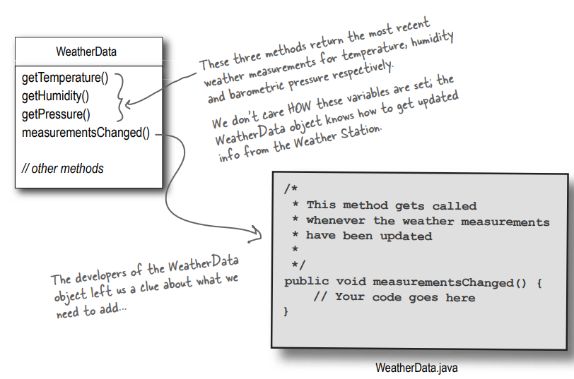

# Keeping your Objects in the know

İlginç bir şey olduğunda kaçırmayın! Nesnelerinizin önemseyebilecekleri bir şey olduğunda haberdar olmalarını sağlayan
bir modelimiz var. Nesneler, bilgilendirilmek isteyip istemediklerine runtime'da bile karar verebilirler.
Observer Pattern, JDK'da en yoğun kullanılan kalıplardan biridir ve inanılmaz derecede kullanışlıdır. İşimiz bitmeden
önce, one to many ve loose coupling (evet, doğru, bağlantı dedik) konularına da bakacağız.

# The Weather Monitoring application overview

Sistemdeki üç oyuncu WeatherStation (gerçek hava durumu verilerini toplayan fiziksel cihaz), WeatherData nesnesi (hava
istasyonundan gelen verileri izleyen ve ekranları güncelleyen) ve kullanıcılara mevcut hava durumunu gösteren Display


Current Conditions üç farklı Display'den biridir. Kullanıcı ayrıca hava durumu istatistiklerini ve hava tahminini de
alabilir

WeatherData nesnesi, güncellenmiş verileri almak için fiziksel Weather Station ile nasıl konuşulacağını bilir.
WeatherData nesnesi daha sonra üç farklı Display öğesi için ekranlarını günceller: Current Conditions (sıcaklık, nem ve
basıncı gösterir), Hava Durumu İstatistikleri ve basit bir tahmin.

Bizim işimiz, WeatherData nesnesini kullanarak mevcut koşullar, hava durumu istatistikleri ve hava tahmini için üç
Display'i güncelleyen bir uygulama oluşturmaktır.

# Unpacking the WeatherData class

Söz verildiği gibi, ertesi sabah WeatherData kaynak dosyaları geldi. Kodun içine baktığımızda, işler oldukça basit
görünüyor:



Bu üç method sırasıyla sıcaklık, nem ve barometrik basınç için en son hava durumu ölçümlerini döndürür. Bu değişkenlerin
NASIL ayarlandığı umurumuzda değil; WeatherData nesnesi Weather Station'dan güncel bilgilerin nasıl alınacağını biliyor

WeatherData nesnesinin geliştiricileri, eklememiz gerekenler hakkında bize bir ipucu bıraktı...

```measurementChanged()``` Bu method, hava ölçümleri güncellendiğinde çağrılır.


Unutmayın, Bu Current Conditions sadece üç farklı Display ekranından BİRİDİR.

Bizim işimiz measurementsChanged() metodunu implement etmek ve böylece Current Conditions, hava durumu istatistikleri ve
hava tahmini için üç Display'i güncellemek.

# What do we know so far?

Weather-O-Rama'dan gelen spesifikasyonlar o kadar da net değildi, ancak ne yapmamız gerektiğini bulmamız gerekiyor.
Peki, şu ana kadar ne biliyoruz?

* WeatherData sınıfı üç ölçüm değeri için getter methodlarına sahiptir: sıcaklık, nem ve barometrik basınç.

```
getTemperature()
getHumidity()
getPressure()
```

* measurementsChanged() methodu, yeni hava durumu ölçüm verileri mevcut olduğunda çağrılır. (Bu methodun nasıl
  çağrıldığını bilmiyoruz veya umursamıyoruz; sadece çağrıldığını biliyoruz).

```measurementsChanged()```

* Hava durumu verilerini kullanan üç Display öğesi uygulamamız gerekiyor: bir mevcut koşullar ekranı, bir istatistik
  ekranı ve bir tahmin ekranı. WeatherData her yeni ölçüm aldığında bu ekranlar güncellenmelidir.


* Sistem genişletilebilir olmalıdır - diğer geliştiriciler yeni özel Display öğeleri oluşturabilir ve kullanıcılar
  uygulamaya istedikleri kadar görüntüleme öğesi ekleyebilir veya kaldırabilir. Şu anda yalnızca ilk üç Display
  türü (mevcut koşullar, istatistikler ve tahminler) hakkında bilgi sahibiyiz.


# İlk, yanıltıcı tahminimizi Weather Station'a uygulayarak başlayalım.

İşte ilk implementasyon olasılığı - Weather-ORama geliştiricilerinden ipucu alacağız ve kodumuza measurementsChanged()
methodunu ekleyeceğiz:

```
public class WeatherData {
   
   // instance variable declarations
   
   public void measurementsChanged() {
   
      /* WeatherData'nın getter methodlarını (zaten implement edildi) çağırarak en son ölçümleri alın. */ 
      
      float temp = getTemperature();
      float humidity = getHumidity();
      float pressure = getPressure();
      
      /* Her bir Display öğesini çağırın ve en son ölçümleri iletmek için display güncellemesini sağlayın. */
      
      currentConditionsDisplay.update(temp, humidity, pressure);
      statisticsDisplay.update(temp, humidity, pressure);
      forecastDisplay.update(temp, humidity, pressure);
 }
 // other WeatherData methods here
}
```

# What’s wrong with our implementation?

Bölüm 1'deki tüm o concepts ve principles'ları tekrar düşünün...

```
currentConditionsDisplay.update(temp, humidity, pressure);
statisticsDisplay.update(temp, humidity, pressure);
forecastDisplay.update(temp, humidity, pressure);
```

Yukarıda ki değişim alanını encapsulate etmemiz gerekiyor.

```
forecastDisplay.update(temp, humidity, pressure)
```

En azından Display öğeleriyle konuşmak için ortak bir interface kullanıyor gibiyiz... hepsinin sıcaklık, nem ve basınç
değerlerini alan bir update() methodu var.

```
currentConditionsDisplay
statisticsDisplay
forecastDisplay
```

Concrete implementasyonlara kodlama yaparak, programda değişiklik yapmadan diğer Display öğelerini eklemenin veya
kaldırmanın hiçbir yolu yoktur.

Observer'a bir göz atacağız, sonra geri dönüp bunu Weather Monitoring uygulamasına nasıl uygulayacağımızı bulacağız.

# Meet the Observer Pattern

Gazete veya dergi aboneliklerinin nasıl çalıştığını biliyorsunuzdur:

* Bir gazete publisher'i işe girer ve gazete publishing etmeye başlar.

* Belirli bir publisher'a subscribe olursunuz ve her yeni baskı olduğunda size teslim edilir. Subscriber olarak
  kaldığınız sürece yeni gazeteler alırsınız.

* Artık gazete istemediğinizde unsubscribe olursunuz ve gazete gönderimi durur.

* Publisher faaliyetlerine devam ederken, insanlar, oteller, havayolları ve diğer işletmeler sürekli olarak gazeteye
  subscribe veya unsubscribe olur

# Publishers + Subscribers = Observer Pattern

Eğer gazete subscription'larını anlıyorsanız, Observer Modelini de hemen hemen anlıyorsunuz demektir, sadece biz
publisher'a SUBJECT, subscriber'lara da OBSERVERS diyoruz.

Biraz daha yakından inceleyelim:


* Subject object bir miktar veriyi yönetir.

* Subject'deki veriler değiştiğinde Observer'lar bilgilendirilir.

* Yeni veri değerleri değiştiğinde Observer'lara bir şekilde iletilir.

* Observer'lar, Subject'in verileri değiştiğinde güncellemeleri almak için Subject'e subscribed olmuştur (register
  olmuştur)

* Duck nesne'si bir observer değildir, bu nedenle Subject'in verileri değiştiğinde bildirim almaz.

# A day in the life of the Observer Pattern


Bir Duck nesnesi gelir ve Subject'e Observer olmak istediğini söyler. Duck gerçekten de aksiyona dahil olmak istiyor;
state'i her değiştiğinde Subject'in gönderdiği bu int variable'lar oldukça ilginç görünüyor...


Duck nesnesi artık resmi bir Observer. Duck çok heyecanlı... listede yer alıyor ve bir sonraki bildirimi büyük bir
heyecanla bekliyor, böylece bir int variable alabilecek.


Subject yeni bir veri değeri alır! Şimdi Duck ve diğer tüm Observerler Subject'in değiştiğine dair bir bildirim alır.


Mouse nesnesi bir Observer olarak kaldırılmak ister. Mouse nesnesi uzun süredir int variable alıyor ve bundan bıktı, bu
yüzden Observer olmayı bırakma zamanının geldiğine karar veriyor.


Mouse buradan gidiyor! Subject, Mouse'un talebini kabul eder ve onu Observer'lar kümesinden çıkarır.


Subject'in yeni bir int'i daha vardır. Artık dahil olmayan Mouse hariç tüm Observer'lar bir bildirim daha alır. Kimseye
söylemeyin ama Mouse gizliden gizliye bu int'leri özlüyor... belki bir gün tekrar Observer olmak ister.

# The Observer Pattern defined

Observer Tasarımını anlamaya çalışırken, bir gazete subscription hizmetiyle publisher ve subscriber'ların bulunduğu bir
yapıyı düşünmek, deseni görselleştirmek için iyi bir yoldur. Ancak gerçek dünyada Observer Tasarımı genellikle şu
şekilde tanımlanır:

Observer Pattern nesneler arasında one-to-many dependency tanımlar, böylece bir nesne state değiştirdiğinde tüm
dependent olanlar otomatik olarak bilgilendirilir ve güncellenir

Bu tanımı, deseni nasıl konuştuğumuzla ilişkilendirelim:


Subject ve Observer'lar one-to-many ilişkisini tanımlar. Observer'lar Subject'e bağımlıdır, öyle ki Subject'in durumu
değiştiğinde Observer'lar bilgilendirilir. Bildirim tarzına bağlı olarak, Observer da yeni değerlerle güncellenebilir.

Subject ve observerlar, one-to-many ilişkiyi tanımlar. Observer'lar, subject'e bağımlıdır, böylece subject'in durumu
değiştiğinde observerlar bilgilendirilir. Bildirim stiline bağlı olarak, observer aynı zamanda yeni değerlerle
güncellenebilir.

Keşfedeceğiniz gibi, Observer Kalıbını implemente etmenin birkaç farklı yolu vardır, ancak çoğu Subject ve Observer
interface'lerini içeren bir sınıf tasarımı etrafında döner. Şimdi bir göz atalım...

# The Observer Pattern defined: the class diagram


**Subject Interface** : Nesneler bu interface'i observer olarak register olmak ve kendilerini Observer olmaktan çıkarmak
için kullanırlar

**observers** -> Her Subject, birçok observer'a sahip olabilir.

**Observer Interface** : Tüm potansiyel observer'ların Observer interface'ini implement etmesi gerekir. Bu interface'in,
Subject'in state'i değiştiğinde çağrılan update() adında tek bir methodu vardır.

**ConcreteSubject** : Concrete bir Subject her zaman Subject interface'ini implement eder. Concrete Subject, register ve
remove methodlarına ek olarak, state değiştiğinde mevcut tüm observer'ları update etmek için kullanılan bir
notifyObservers() methodunu implemente eder. Concrete Subject'in state'ini SET ve GET için methodları da olabilir (bu
konuda daha sonra bilgi verilecektir).

**ConcreteObserver** : Concrete Observer'lar, Observer interface'ini implement eden herhangi bir sınıf olabilir. Her
observer, güncellemeleri almak için concrete bir subject'e kaydolur.

--**DIALOGS**--

Q : Bunun one-to-many ilişkilerle ne ilgisi var?

A : Observer pattern ile Subject, state'i içeren ve onu kontrol eden nesnedir. Yani, state'e sahip TEK bir Subject
vardır. Öte yandan observer'lar, state'e sahip olmasalar bile onu kullanırlar. Çok sayıda observer vardır ve state
değiştiğinde bunu kendilerine bildirmesi için Subject'e güvenirler. Yani TEK Subject ile ÇOK sayıda Observer arasında
bir ilişki vardır.

Q : Bağımlılık bu işin içine nasıl giriyor?

A : Subject bu verinin tek sahibi olduğu için, observer'lar veri değiştiğinde kendilerini güncellemesi için Subject'e
bağımlıdır. Bu, birçok nesnenin aynı veriyi kontrol etmesine izin vermekten daha temiz bir OO tasarımına yol açar.

# The power of Loose Coupling

İki nesne Loosely Coupled bağlandığında, etkileşime girebilirler, ancak birbirleri hakkında çok az bilgiye
sahiptirler. Observer Pattern, subject'lerin ve observer'ların loosely coupled birbirine bağlı olduğu bir nesne tasarımı
sağlar.

Niçin?

Subject'in bir observer hakkında bildiği tek şey belirli bir interface'i (Observer interface'i) implement ettiğidir.
Observer'in concrete sınıfını, ne yaptığını veya onunla ilgili başka bir şeyi bilmesine gerek yoktur.

İstediğimiz zaman yeni Observer'lar ekleyebiliriz. Subject'in bağlı olduğu tek şey Observer interface'ini implement eden
nesnelerin bir listesi olduğundan, istediğimiz zaman yeni Observer'lar ekleyebiliriz. Aslında, runtime'da herhangi bir
Observer'i başka bir Observer'la değiştirebiliriz ve Subject mırıldanmaya devam edecektir. Aynı şekilde, Observer'ları
istediğimiz zaman kaldırabiliriz.

Yeni Observer türleri eklemek için Subject'i değiştirmemize asla gerek yoktur. Diyelim ki Observer olması gereken yeni
bir concrete sınıfımız var. Yeni sınıf türüne uyum sağlamak için Subject'de herhangi bir değişiklik yapmamız gerekmez,
tek yapmamız gereken yeni sınıfta Observer interface'ini implement etmek ve bir Observer olarak kaydolmaktır. Subject'in
umurunda değildir; Observer interface'ini implement eden herhangi bir nesneye bildirim gönderecektir.

Subject'leri veya Observer'ları birbirlerinden bağımsız olarak yeniden kullanabiliriz. Bir Subject veya Observer için
başka bir kullanımımız varsa, bunları kolayca yeniden kullanabiliriz çünkü ikisi birbirine sıkı sıkıya bağlı değildir.

Subject ya da Observer'da yapılan değişiklikler diğerini etkilemeyecektir. İkisi birbirine gevşek bir şekilde bağlı
olduğundan, nesneler Subject veya Observer interface'lerini implement etme yükümlülüklerini yerine getirmeye devam
ettiği sürece herhangi birinde değişiklik yapmakta özgürüz.


**Design Principle** : Etkileşime giren nesneler arasında loosely coupled tasarımlar için çaba gösterin.

Loosely Coupled tasarımlar, nesneler arasındaki karşılıklı bağımlılığı en aza indirdikleri için değişimle başa çıkabilen
esnek OO sistemleri oluşturmamızı sağlar.

# Designing the Weather Station


**Subject Interface** : İşte Subject interface'imiz

**Observer Interface** : Tüm Weather component'leri Observer interface'ini implement ederler. Bu, Observer'ları
güncelleme zamanı geldiğinde Subject'e konuşmak için ortak bir interface sağlar.

**DisplayElement Interface** : Ayrıca tüm Display öğelerinin implementasyonu için bir interface oluşturalım. Display
öğelerinin sadece bir display() methodunu implement etmesi gerekir.

**WeatherData** : WeatherData artık Subject interface'ini implement etmektedir.

**CurrentConditionDisplay** : Bu Display öğesi, WeatherData nesnesinden alınan geçerli ölçümleri gösterir.

**StaticDisplay** : Bu display min/avg/max ölçümleri takip eder ve gösterir.

**ForecastDisplay** : Bu display, barometreye dayalı hava tahminini gösterir.

**ThirdPartyDisplay** : Developer'lar, kendi display elemanlarını oluşturmak için Observer ve Display interface'lerini
implement edebilirler

Bu üç Display öğesinin de WeatherData'ya "Subject" etiketli bir pointeri olmalıdır, diyagram da yer almamaktalar çünkü
çok karmaşık bir görüntü olacaktı

# Implementing the Weather Station

Bu bölümün ilerleyen kısımlarında Java'nın Observer modeli için bazı built-in destekler sağladığını göreceksiniz, ancak
şimdilik ellerimizi kirleteceğiz ve kendi modelimizi oluşturacağız. Bazı durumlarda Java'nın built-in desteğinden
yararlanabilseniz de, çoğu durumda kendi desteğinizi oluşturmak daha esnektir (ve o kadar da zor değildir). Öyleyse,
interface'ler ile başlayalım:

```
public interface Subject {

    /* Her iki method da bir Observer'i argüman olarak alır; yani, register edilecek veya remove edilecek olan
    Observer'i temsil eder.*/
    void registerObserver(Observer o);
    void removeObserver(Observer o);

    /* Bu method, Subject'in state'i değiştiğinde tüm observer'lara bildirimde bulunmak için çağrılır.*/
    void notifyObservers();
}
```

```
public interface Observer {

    /* Bunlar, bir hava durumu ölçümü değiştiğinde Observer'ların Subject'den aldığı state değerleridir */
    void update(float temperature, float humidity, float pressure);
}
```

Observer interface'i tüm Observer'lar tarafından implement edilir, bu nedenle hepsinin update() methodunu implement
etmesi gerekir.

```
public interface DisplayElement {
    void display();
}
```

DisplayElement interface'i, Display öğesinin görüntülenmesi gerektiğinde çağıracağımız display() adında yalnızca bir
method içerir.

# BRAIN POWER

Ölçümleri doğrudan Observer'lara aktarmanın state'i güncellemek için en basit method olduğunu düşünülebilir.
Bunun akıllıca olduğunu düşünüyor musunuz? İpucu: Bu, uygulamanın gelecekte değişebilecek bir alanı mı? Eğer değişirse,
değişiklik iyi bir şekilde encapsulated edilebilir mi yoksa kodun birçok bölümünde değişiklik gerektirir mi?
Updated state'i Observer'lara aktarma sorununa yaklaşmak için başka yollar düşünebiliyor musunuz? Merak etmeyin, ilk
implementasyonu bitirdikten sonra bu tasarım kararına geri döneceğiz.

# Implementing the Subject interface in WeatherData

Bölümün başında WeatherData sınıfını implemente etmeye yönelik ilk girişimimizi hatırlıyor musunuz? Hafızanızı tazelemek
isteyebilirsiniz. Şimdi geri dönüp Observer Kalıbını göz önünde bulundurarak bir şeyler yapmanın zamanı geldi...

```
/* Subject interface'ini implements ettik */
public class WeatherData implements Subject { 
    private final ArrayList<Observer> observers;
    private float temperature;
    private float humidity;
    private float pressure;

    public WeatherData() {
        /* Observer'ları tutmak için bir ArrayList ekledik ve bunu constructor'da oluşturuyoruz.*/
        observers = new ArrayList<>();
    }

    @Override
    public void registerObserver(Observer o) {
        
        /* Bir observer register edildiğinde, onu sadece listenin sonuna ekliyoruz. */
        observers.add(o);
    }

    @Override
    public void removeObserver(Observer o) {
        /* Benzer şekilde, bir observer remove edilmek istediğinizde, onu sadece listeden çıkarıyoruz. */
        int i = observers.indexOf(o);
        if (i >= 0)
            observers.remove(i);
    }

    @Override
    public void notifyObservers() {
        /* burası tüm Observer'lara state'i anlattığımız yerdir. Hepsi Observer olduğu için, hepsinin update() 
        methodunu implement ettiğinizi biliyoruz, bu yüzden onları nasıl bilgilendireceğimizi biliyoruz */
        observers.forEach(observer -> observer.update(temperature, humidity, pressure));
    }

    public void measurementChanged() {
        /* WeatherStation'dan güncel ölçümler aldığımızda Observer'ları bilgilendiriyoruz */
        notifyObservers();
    }

    public void setMeasurement(float temperature, float humidity, float pressure) {
        /* Tamam, her kitapla birlikte küçük bir WeatherStation göndermek istedik ama yayıncı bunu kabul etmedi. 
        Bu nedenle, bir cihazdan gerçek hava durumu verilerini okumak yerine, ekran öğelerimizi test etmek için bu 
        methodu kullanacağız. */
        this.temperature = temperature;
        this.humidity = humidity;
        this.pressure = pressure;
        measurementChanged();
    }
}
```

# Now, let’s build those display elements

WeatherData sınıfımızı düzene soktuğumuza göre, şimdi Display Öğelerini oluşturma zamanı. Weather-O-Rama üç tane sipariş
etti: CurrentCondition Display, Statistics Display ve Forecast Display. CurrentCondition Display'e bir göz atalım; bu
Display öğesi hakkında iyi bir fikir edindikten sonra, ilk kod dizinindeki Statistics ve Forecast Display'lerine göz
atın. Çok benzer olduklarını göreceksiniz.

```
/* Bu Display, WeatherData nesnesinden değişiklikleri alabilmek için Observer'ı implement eder. Ayrıca 
DisplayElement'i de implement eder, çünkü API'miz tüm Display öğelerinin bu interface'i implement etmesini 
gerektirecektir. */

public class CurrentConditionDisplay implements Observer, DisplayElement{

    private float temperature;
    private float humiditiy;
    private Subject weatherData;

    /* Constructor'a WeatherData nesnesi (Subject) aktarılır ve Display'i bir Observer olarak register etmek için bunu 
    kullanırız. */
    public CurrentConditionDisplay(Subject weatherData) {
        this.weatherData = weatherData;
        weatherData.registerObserver(this);
    }
    
    @Override
    public void update(float temperature, float humidity, float pressure) {
        /* update() çağrıldığında, sıcaklığı ve nemi kaydeder ve display() methodunu çağırırız */
        this.temperature = temperature;
        this.humiditiy = humidity;
        display();
    }

    @Override
    public void display() {
        /* display() methodu sadece en son sıcaklık ve nem değerlerini yazdırır. */
        System.out.println("Current conditions: " + temperature + "F degrees and " + humiditiy + "% humidity");
    }
}
```

**Statistic Display**

```
public class StatisticDisplay implements Observer, DisplayElement {
    private Subject weatherData;
    private float temperature;
    private float humidity;
    private float pressure;

    public StatisticDisplay(Subject weatherData) {
        this.weatherData = weatherData;
        weatherData.registerObserver(this);
    }

    @Override
    public void update(float temperature, float humidity, float pressure) {
        this.temperature = temperature;
        this.humidity = humidity;
        this.pressure = pressure;
        display();
    }

    @Override
    public void display() {
        System.out.println("Statistics display : " + temperature + " C degrees and " + humidity + " %humidity" + pressure + " pressure");
    }
}
```

**Forecast Display**

```
public class ForecastDisplay implements Observer,DisplayElement{

    private Subject weatherData;
    private float humidity;

    public ForecastDisplay(Subject weatherData) {
        this.weatherData = weatherData;
        weatherData.registerObserver(this);
    }

    @Override
    public void update(float temperature, float humidity, float pressure) {
        this.humidity = humidity;
        display();
    }

    @Override
    public void display() {
        System.out.println("Forecast : humidity : " + this.humidity);
    }
}
```

--**DIALOGS**--

Q : update() display çağrısı için en iyi yer midir?

A : Bu basit örnekte, değerler değiştiğinde display() methodunu çağırmak mantıklıydı. Ancak haklısınız, verilerin
görüntülenme şeklini tasarlamanın çok daha iyi yolları var. Bunu model-view-controller modeline geçtiğimizde göreceğiz.

Q : Neden Subject'e bir referans sakladınız? Constructor'dan sonra tekrar kullanılmıyormuş gibi görünüyor?

A : Doğru, ancak gelecekte kendimizi bir Observer olarak un-register etmek isteyebiliriz ve Subject'le ilgili bir
referansa sahip olmak kullanışlı olacaktır.

# Power up the Weather Station

1 - Öncelikle bir test düzeneği oluşturalım. Weather Station hazır, tek ihtiyacımız her şeyi bir araya getiren bazı kod
parçacıkları. İşte ilk denememiz. Kitabın ilerleyen bölümlerinde tüm bileşenlerin bir yapılandırma dosyası aracılığıyla
kolayca takılabilir olduğundan emin olacağız. Şimdilik işleyiş şu şekildedir:

```
public class WeatherStation {
    public static void main(String[] args) {
        WeatherData weatherData = new WeatherData();

        CurrentConditionDisplay currentConditionDisplay = new CurrentConditionDisplay(weatherData);
        StatisticDisplay statisticDisplay = new StatisticDisplay(weatherData);
        ForecastDisplay forecastDisplay = new ForecastDisplay(weatherData);

        weatherData.setMeasurement(80,65,30.4f);
    }
}
```


**Dialogs**

Subject : Nihayet birebir sohbet etme fırsatı bulduğumuza sevindim

Observer : Gerçekten mi? Biz Observer'ları pek önemsemediğini sanıyordum.

Subject : Ben işimi yapıyorum, değil mi? Sana her zaman neler olup bittiğini anlatıyorum. Kim olduğunu bilmemem
umursamadığım anlamına gelmez. Ayrıca, seninle ilgili en önemli şeyi biliyorum: Observer interface'ini implement
ediyorsun.

Observer : Evet, ama bu benim kim olduğumun sadece küçük bir parçası. Her neyse, senin hakkında daha çok şey
biliyorum.

Subject : Öyle mi? ne gibi?

Observer : İçinde neler olup bittiğini görebilmemiz için her zaman state'ini biz Observer'lara aktarıyorsun. Bu da bazen
biraz can sıkıcı oluyor.

Subject : Kusuruma bakmayın. State'i bildirimlerimle birlikte göndermeliyim ki siz lazy Observer'lar ne olduğunu
bilesiniz!

Observer : Tamam, burada bir dakika bekleyin; birincisi, biz lazy değiliz, sadece sizin çok önemli bildirimleriniz
arasında yapacak başka işlerimiz var, Sayın Subject, ve ikincisi, neden istediğimiz state için herkese iletim yapmak
yerine size gelmemize izin vermiyorsunuz?

Subject : Şey... Sanırım bu işe yarayabilir. Siz Observer'ların içeri girip ihtiyacınız olan state'i alabilmeniz için
kendimi daha da açmam gerekecek. Bu biraz tehlikeli olabilir. İçeri girip sahip olduğum her şeye bakmanıza izin veremem.

Observer : Neden ihtiyacımız olan state'i çekmemize izin verecek bazı public getter methodları yazmıyorsunuz?

Subject : Evet, state'i çekmenize izin verebilirim. Ama bu sizin için daha az kullanışlı olmaz mı? Bir şey istediğiniz
her seferinde bana gelmeniz gerekiyorsa, istediğiniz tüm state'i almak için birden fazla method çağrısı yapmanız
gerekebilir. Bu yüzden push'u daha çok seviyorum... o zaman ihtiyacınız olan her şeye tek bir bildirimde sahip
olursunuz.

Observer : Bu kadar ısrarcı olmayın! Biz Observer'ların o kadar çok farklı türü var ki, ihtiyacımız olan her şeyi tahmin
etmenize imkan yok. Sadece ihtiyacımız olan state'i almak için size gelmemize izin verin. Bu şekilde, bazılarımızın
sadece biraz state'e ihtiyacı varsa, hepsini almak zorunda kalmayız. Ayrıca daha sonra değişiklik yapmayı da
kolaylaştırır. Örneğin, kendinizi genişlettiğinizi ve biraz daha state eklediğinizi varsayalım, eğer pull
kullanıyorsanız, etrafta dolaşıp her observer'da ki update çağrılarını değiştirmek zorunda değilsiniz, sadece ek
state'imize erişmek için daha fazla getter methoduna izin vermek için kendinizi değiştirmeniz gerekir

Subject : Her iki şekilde de yapmanın avantajlarını görebiliyorum. Pull veya Push yöntemlerinden birini kullanmanıza
olanak tanıyan built-in bir Java Observer Pattern'i olduğunu fark ettim.

Observer : Oh, gerçekten mi? Sanırım bunu bir sonraki adımda inceleyeceğiz..

Subject : Harika... belki iyi bir pull örneği görürüm ve fikrimi değiştiririm.

# Using Java’s built-in Observer Pattern

Şimdiye kadar Observer Pattern için kendi kodumuzu yazdık, ancak Java'nın birçok API'sinde yerleşik destek vardır.
Bunlardan en genel olanı Observer interface'i ve java.util paketindeki Observable sınıfıdır. Bunlar bizim Subject ve
Observer interface'imize oldukça benzer, ancak size kutudan çıkar çıkmaz birçok işlevsellik sunar. Ayrıca göreceğiniz
gibi Observer'larınıza push ya da pull tarzı update uygulayabilirsiniz. java.util.Observer ve java.util.Observable
hakkında üst düzey bir fikir edinmek için, WeatherStation için yeniden işlenmiş bu OO tasarımına göz atın:

Java'nın yerleşik desteğiyle, yapmanız gereken tek şey Observable sınıfını extend etmek ve observer'lara ne zaman
bildirim yapılacağını belirtmek. API gerisini sizin için yapar.


**Observable** : sınıfı tüm Observer'larınızın kaydını tutar ve onları sizin için bilgilendirir. Observable bir
INTERFACE değil bir CLASS'tır, bu nedenle WeatherData Observable'ı extends eder.

```setChanged()``` Bu tanıdık gelmiyor! Sıkı durun, birazdan bu konuya geleceğiz...

**WeatherData** : İşte artık Observable olarak da adlandırabileceğimiz Subject'imiz. Artık register(), remove() ve
notifyObservers() methodlarına ihtiyacımız yok; bu behavior'ları üst sınıftan inherit ediyoruz.

**ObserverInterface** : Bu tanıdık gelecektir. Aslında, önceki sınıf diyagramımızla tamamen aynı!

DisplayElement interface'ini dışarıda bıraktık, ancak tüm Display'ler hala onu da implement ediyorlar.

**Display'ler** : Concrete Observer'larda update() methodunda yapılacak birkaç değişiklik olacak, ancak temelde aynı
fikir... Subject tarafından çağrılan bir update() methoduna sahip ortak bir Observer interface'imiz var

# How Java’s built-in Observer Pattern works

Built-in Observer Pattern, WeatherStation'da kullandığımız implementasyondan biraz farklı çalışır. En belirgin fark,
WeatherData'nın (Subject'imiz) artık Observable sınıfını extend etmesi ve add, delete ve notify Observer methodlarını (
diğer birkaçının yanı sıra) inherit almasıdır. İşte Java'nın versiyonunu nasıl kullandığımız:

### Bir nesnenin Observer olabilmesi için...

Her zamanki gibi, Observer interface'ini (bu kez java.util.Observer interface) implement edin ve herhangi bir Observable
nesnesi üzerinde addObserver() methodunu çağırın. Aynı şekilde, kendinizi bir Observer olarak kaldırmak için
deleteObserver() methodunu çağırmanız yeterlidir.

### Observable'ın bildirim göndermesi için...

Öncelikle java.util.Observable superclass'ını extend ederek Observable olmanız gerekir. Bundan sonrası iki adımlı bir
süreçtir:

1 - Nesnenizde state'in değiştiğini belirtmek için önce setChanged() methodunu çağırmanız gerekir

2 - Ardından, iki notifyObservers() methodundan birini çağırın:

```notifyObservers()``` ya da ```notifyObservers(Object arg)```

```notifyObservers(Object arg)``` Bu sürüm, her bir Observer'a bildirimde bulunulduğunda aktarılan rastgele bir veri
nesnesi alır.

### Bir Observer'in bildirim alması için...

Daha önce olduğu gibi update methodunu implement eder, ancak methodun imzası biraz farklıdır:

```update(Observable o, Object arg)```

Bildirimi gönderen Subject bu bağımsız değişken olarak aktarılır ``Òbservable o``

notifyObservers() methoduna aktarılan veri nesnesi veya bir veri nesnesi belirtilmemişse null olacaktır. ``Òbject arg``


Observer'lara veri "push" etmek istiyorsanız, verileri notifyObserver(arg) methoduna bir veri nesnesi olarak
aktarabilirsiniz. Aksi takdirde, Observer istediği veriyi kendisine iletilen Observable nesnesinden "pull" etmek
zorundadır. Nasıl mı? WeatherStation'ı yeniden çalışalım.

Bekle, buna gelmeden önce, neden bu setChanged() methoduna ihtiyacımız var? Daha önce buna ihtiyacımız yoktu.

setChanged() methodu, state'in değiştiğini ve notifyObservers() methodunun çağrıldığında Observer'larını güncellemesi
gerektiğini belirtmek için kullanılır. Önce setChanged() çağrılmadan notifyObservers() çağrılırsa, Observer'lara
bildirim GÖNDERİLMEYECEKTİR. Bunun nasıl çalıştığını görmek için Observable'ın perde arkasına bir göz atalım:


**setChanged()** methodu bir changed flag'ini TRUE olarak ayarlar.

**notifyObservers()** sadece changed flag TRUE ise Observer'larını bilgilendirir.

Ve Observer'ları bilgilendirdikten sonra, changed flag tekrar FALSE olarak ayarlar.

Bu neden gereklidir? setChanged() methodu, bildirimleri optimize etmenize olanak tanıyarak Observer'ları güncelleme
şeklinizde size daha fazla esneklik sağlamak içindir. Örneğin, hava istasyonumuzda, ölçümlerimizin sıcaklık değerlerinin
sürekli olarak bir derecenin birkaç onda biri kadar dalgalanmasına neden olacak kadar hassas olduğunu düşünün. Bu durum
WeatherData nesnesinin sürekli bildirim göndermesine neden olabilir. Bunun yerine, yalnızca sıcaklık yarım dereceden
fazla değiştiğinde bildirim göndermek isteyebilir ve setChanged() methodunu yalnızca bu gerçekleştikten sonra
çağırabiliriz.

Bu işlevi çok sık kullanmayabilirsiniz, ancak ihtiyacınız olursa oradadır. Her iki durumda da bildirimlerin çalışması
için setChanged() methodunu çağırmanız gerekir. Bu işlevsellik işinize yarayacaksa, changed state'ini false değerine
geri döndüren clearChanged() methodunu ve changed flag'inin current state'ini bildiren hasChanged() methodunu da
kullanmak isteyebilirsiniz.

# Reworking the Weather Station with the built-in support

### İlk olarak, WeatherData'yı java.util.Observable kullanacak şekilde yeniden çalışalım

1 - Doğru Observer/Observable'ı import ettiğinizden emin olun.

Artık Observer'larımızı takip etmemize veya kayıtlarını ve kaldırılmalarını yönetmemize gerek yok (superclass bunu
halledecek), bu nedenle register, add ve notify kodlarını kaldırdık.

```
/* Şimdi Observable'ın subclass'ını oluşturuyoruz. */
public class WeatherDataBuiltIn extends Observable {
    private float temperature;
    private float humidity;
    private float pressure;

    /* Constructor'ımızın artık Observer'ları tutmak için bir veri yapısı oluşturmasına gerek yok */
    public WeatherDataBuiltIn() {
    }

    public void measurementChanged(){
        /* Şimdi notifyObservers() methodunu çağırmadan önce state'in değiştiğini belirtmek için setChanged() methodunu 
        çağırıyoruz.*/
        setChanged();
        
        /* notifyObservers() çağrısı ile bir veri nesnesi göndermediğimize dikkat edin. Bu, PULL modelini kullandığımız 
        anlamına gelir.*/
        notifyObservers();
    }

    public void setMeasurements(float temperature,float humidity, float pressure){
        this.temperature = temperature;
        this.humidity = humidity;
        this.pressure = pressure;
        measurementChanged();
    }
    
    /* GETTER methodları yeni değildir, ancak "PULL" modelini kullanacağımız için burada olduklarını hatırlatmak istedik. 
    Observer'lar bunları WeatherData nesnesinin state'ine ulaşmak için kullanacaktır */
    public float getTemperature() {
        return temperature;
    }

    public float getHumidity() {
        return humidity;
    }

    public float getPressure() {
        return pressure;
    }
}
```

# Now, let’s rework the CurrentConditionsDisplay

```
/* Şimdi java.util'den Observer interface'ini implement ediyoruz */
public class CurrentConditionDisplayBuiltIn implements Observer, DisplayElement {

    Observable observable;
    private float temperature;
    private float humidity;

    public CurrentConditionDisplayBuiltIn(Observable observable) {
        /* Constructor'ımız şimdi bir Observable alıyor ve bunu CurrentCondition nesnesini bir Observer olarak eklemek 
        için kullanıyoruz.*/
        this.observable = observable;
        observable.addObserver(this);
    }
    
    /* update() methodunu hem bir Observable hem de optional data argument alacak şekilde değiştirdik */
    @Override
    public void update(Observable o, Object arg) {
        /* update() methodunda, önce Observable'ın WeatherData türünde olduğundan emin oluruz ve ardından sıcaklık ve 
        nem ölçümlerini elde etmek için getter methodlarını kullanırız. Bundan sonra display() metodunu çağırıyoruz.
        if (o instanceof WeatherDataBuiltIn weatherData){
            this.temperature = weatherData.getTemperature();
            this.humidity = weatherData.getHumidity();
            display();
        }
    }

    @Override
    public void display() {
        System.out.println("Current conditions : " + temperature + "F degrees and " + humidity + "% humidity");
    }
}
```

**Önemli Not : java.util.Observable, programlama yaparken interface'lere değil implementasyonlara dayalı olma ilkesine
uymayabilir. DEPRECATE edilmiştir**

# The dark side of java.util.Observable

Evet, iyi yakaladın. Fark ettiğiniz gibi, Observable bir interface değil, bir sınıftır ve daha da kötüsü, bir
interface'i bile implement etmemektedir. Ne yazık ki java.util.Observable implementasyonu, kullanışlılığını ve yeniden
kullanımını sınırlayan bir dizi soruna sahiptir. Bu, bazı faydalar sağlamadığı anlamına gelmez, ancak dikkat edilmesi
gereken bazı büyük çukurlar vardır.

Prensiplerimizden bunun kötü bir fikir olduğunu zaten biliyorsunuz, ancak gerçekten ne gibi bir zararı var? İlk olarak,
Observable bir sınıf olduğu için onu alt sınıflara ayırmanız gerekir. Bu, Observable behavior'unu zaten başka bir
superclass'ı extend eden mevcut bir sınıfa ekleyemeyeceğiniz anlamına gelir. Bu da yeniden kullanım potansiyelini
sınırlar (zaten kalıpları bu yüzden kullanmıyor muyuz?). İkinci olarak, bir Observable interface'i olmadığı için,
Java'nın yerleşik Observer API'si ile iyi çalışan kendi implementasyonunuzu bile oluşturamazsınız. Ayrıca java.util
implementasyonunu başka bir implementasyon ile değiştirme seçeneğiniz de yoktur (örneğin, yeni, multi-threading bir
uygulama).

Observable, önemli methodları korur. Observable API'ye baktığınızda, setChanged() methodunun korumalı olduğunu
göreceksiniz. Peki bu ne anlama geliyor? İşte, Observable'ı alt sınıflandırmadıkça setChanged() methodunu çağıramazsınız
demektir. Bu, Observable sınıfının bir instance'ini oluşturamayacağınız anlamına gelir ve kendi nesnelerinizle bile
composition yapamazsınız, bunun yerine alt sınıflandırmak zorundasınız. Bu tasarım, burada bir başka tasarım ilkesini
ihlal ediyor... kalıtım yerine composition'ı tercih etme ilkesini ihlal ediyor.

# Tools for your Design Toolbox

Etkileşime giren nesneler arasında loosely coupled tasarımlar için çaba gösterin.

State'i bir dizi nesneye loosely coupled bağlanmış bir şekilde iletmek için yeni bir model. Observer Kalıbının
sonuncusunu görmedik - MVC hakkında konuşana kadar bekleyin!

--**BULLET POINTS**--

* Observer Deseni, nesneler arasında one-to-many ilişki tanımlar.

* Subject'ler ya da bizim bildiğimiz adıyla Observables'lar, ortak bir interface kullanarak Observer'ları update eder.

* Observer'lar, Observable'ın Observer interface'ini implement etmek dışında onlar hakkında hiçbir şey bilmemesi
  nedeniyle loosely coupled bağlanmıştır.

* Kalıbı kullanırken Observable'dan veri pull veya push edebilirsiniz (pull daha "doğru" olarak kabul edilir).

* Observer'larınız için belirli bir bildirim sırasına bağlı kalmayın.

* Java, genel amaçlı java.util dahil olmak üzere Observer Kalıbının çeşitli implementasyonlarına sahiptir. Observable.

* java.util.Observable implementasyonu ile ilgili sorunlara dikkat edin.

* Gerekirse kendi Observable implementasyonunuzu oluşturmaktan korkmayın.

* Swing, birçok GUI framework'u gibi Observer Kalıbını yoğun bir şekilde kullanır.

* Bu kalıbı JavaBeans ve RMI dahil olmak üzere başka birçok yerde de bulabilirsiniz.