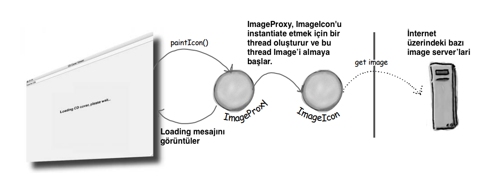
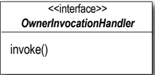

# Proxy Design Pattern

## Nesne Erişimini Kontrol Etme

Hiç iyi polis, kötü polis oynadınız mı? İyi polissiniz ve tüm Servicelerinizi nazik ve dostane bir şekilde sunuyorsunuz,
ancak herkesin sizden Service istemesini istemiyorsunuz, bu yüzden kötü polisin size erişimi kontrol etmesini
sağlıyorsunuz. Proxy'lerin yaptığı da budur: erişimi kontrol etmek ve yönetmek. Göreceğiniz gibi, proxies'lerin proxy
oldukları nesnelerin yerine geçtikleri pek çok yol vardır. Proxies'lerin, proxy oldukları nesneler için tüm method
çağrılarını İnternet üzerinden taşıdıkları bilinmektedir; ayrıca oldukça tembel bazı nesnelerin yerine sabırla
durdukları da bilinmektedir.

Sakız makinelerim için gerçekten daha iyi bir monitoring almak istiyorum. Bana envanter ve makine state'i raporu almanın
bir yolunu bulabilir misiniz?

Kulağa yeterince kolay geliyor. Hatırlarsanız, sakız makinesi kodunda sakızların sayısını almak (getCount()) ve
makinenin mevcut state'ini almak (getState()) için zaten methodlarımız var. Tek yapmamız gereken çıktısını alıp CEO'ya
geri gönderebileceğimiz bir rapor oluşturmak. Hmmm, muhtemelen her sakız makinesine bir konum alanı da eklemeliyiz; bu
şekilde CEO makineleri düzenli tutabilir.

# Monitoring'in codelanması

Location'ları işleyebilmesi için GumballMachine sınıfına destek ekleyerek başlayalım:

### GumballMachine

```
public class GumballMachine {
    State soldOutState;
    State noQuarterState;
    State hasQuarterState;
    State soldState;
    State winnerState;
    State state = soldOutState;
    int count = 0;
    String location;

    public GumballMachine(int count, String location) {
        soldOutState = new SoldOutState(this);
        noQuarterState = new NoQuarterState(this);
        hasQuarterState = new HasQuarterState(this);
        soldState = new SoldState(this);
        winnerState = new WinnerState(this);
        this.count = count;
        this.location = location;

        if (count > 0) {
            state = noQuarterState;
        }
    }

    public void insertQuarter() {
        state.insertQuarter();
    }

    public void ejectQuarter() {
        state.ejectQuarter();
    }

    public void turnCrank() {
        state.turnCrank();
        state.dispense();
    }
    void setState(State state) {
        this.state = state;
    }

    void releaseBall() {
        System.out.println("A gumball comes rolling out the slot...");
        if (count != 0) {
            count -= 1;
        }
    }

    public State getSoldOutState() {
        return soldOutState;
    }

    public State getNoQuarterState() {
        return noQuarterState;
    }

    public State getHasQuarterState() {
        return hasQuarterState;
    }

    public State getSoldState() {
        return soldState;
    }

    public State getWinnerState() {
        return winnerState;
    }

    public State getState() {
        return state;
    }

    public int getCount() {
        return count;
    }

    public String getLocation() {
        return location;
    }

    @Override
    public String toString() {
        return "GumballMachine{" +
                "state=" + state +
                ", count=" + count +
                ", location='" + location + '\'' +
                '}';
    }
}
```

Şimdi makinenin location'ınını, sakız envanterini ve mevcut makine state'ini alan ve bunları küçük bir rapor halinde
yazdıran GumballMonitor adlı başka bir sınıf oluşturalım:

### GumballMonitor

```
public class GumballMonitor {
    GumballMachine gumballMachine;

    public GumballMonitor(GumballMachine gumballMachine) {
        this.gumballMachine = gumballMachine;
    }

    /* Rapor methodumuz sadece location, count ve makinenin state'ini içeren bir rapor yazdırır.*/
    public void report(){
        System.out.println("Gumball Machine : " + gumballMachine.getLocation());
        System.out.println("Current Inventory : " + gumballMachine.getCount());
        System.out.println("Current State : " + gumballMachine.getState());
    }
}
```

### Monitor'un test edilmesi

Bunu kısa sürede hayata geçirdik. CEO, geliştirme becerilerimiz karşısında heyecanlanacak ve hayrete düşecek. Şimdi tek
yapmamız gereken bir GumballMonitor oluşturmak ve ona izlemesi için bir makine vermek:

```
public class GumballMachineTestDrive {
    public static void main(String[] args) {
        int count = 0;

        /* IDE uzerinden verdigimiz iki deger bos olmasin diye burada kontrol ediyoruz */
        if (args.length<2) {
            System.out.println("GumballMachine <name> <inventory>");
            System.exit(1);
        }

        /* IDE uzerinde parametre olarak args[1] 112 degerini geciyoruz*/
        count = Integer.parseInt(args[1]);

        /* IDE uzerinden args[0] olarak Seattle degerini geciyoruz*/
        GumballMachine gumballMachine = new GumballMachine(count,args[0]);

        GumballMonitor monitor = new GumballMonitor(gumballMachine);
        monitor.report();
    }
}
```


Monitör output'u harika görünüyor, ama sanırım yeterince açık olamadım. Sakız makinelerini UZAKTAN izlemem gerekiyor!
Aslında, izleme için zaten ağlarımız var. Hadi ama çocuklar, sizin internet nesli olmanız gerekiyordu!

Tek ihtiyacımız olan bir uzak proxy!

**--DIALOGS--**

Frank: Remote proxy. Bir düşünün: monitör kodunu zaten yazdık, değil mi? GumballMonitor'a bir makineye referans
veriyoruz ve o da bize bir rapor veriyor. Sorun şu ki, monitör gumball makinesiyle aynı JVM'de çalışıyor ve CEO
masasında oturup makineleri uzaktan izlemek istiyor! Peki GumballMonitor sınıfımızı olduğu gibi bıraksak, ancak ona uzak
bir nesneye bir proxy versek ne olur? En baştan başlayalım... bir proxy gerçek bir nesnenin yerine geçer. Bu durumda,
proxy tıpkı bir Gumball Machine nesnesi gibi davranır, ancak perde arkasında gerçek, remote'da ki GumballMachine ile
konuşmak için ağ üzerinden iletişim kurar.

Jim: Yani kodumuzu olduğu gibi tutacağımızı ve monitöre GumballMachine'in proxy sürümüne bir referans vereceğimizi
söylüyorsunuz...

Joe: Ve bu proxy gerçek nesneymiş gibi davranıyor, ama aslında sadece gerçek nesneyle ağ üzerinden iletişim kuruyor.

Frank: Evet, hikaye aşağı yukarı böyle. Frank: Belki, ama o kadar da kötü olacağını sanmıyorum. Gumball makinesinin bir
service olarak hareket edebildiğinden ve ağ üzerinden istekleri kabul edebildiğinden emin olmalıyız; ayrıca monitörümüze
bir proxy nesnesine referans almak için bir yol vermemiz gerekiyor, ancak bize yardımcı olmak için Java'da zaten
yerleşik bazı harika araçlarımız var. Önce remote proxyler hakkında biraz daha konuşalım...

# Remote proxy'nin rolü

Remote bir proxy, bir remote nesnenin local bir temsilcisi olarak hareket eder. Peki, "remote nesne" nedir? Bu, farklı
bir Java Sanal Makinesi'nin belleğinde (veya daha genel olarak, farklı bir namespace'de çalışan remote bir nesne)
bulunan bir nesnedir. Peki, "local representative (yerel temsilci)" nedir? Bu, local methodları çağırabileceğiniz ve
bunların remote nesneye iletilmesini sağlayabileceğiniz bir nesnedir.


Client nesneniz remote method çağrıları yapıyormuş gibi davranır. Ancak gerçekte yaptığı şey, ağ iletişiminin tüm düşük
seviyeli ayrıntılarını işleyen bir heaplocal 'proxy' nesnesi üzerindeki methodları çağırmaktır

Bu oldukça zekice bir fikir. Bir method çağrısını alan, bir şekilde ağ üzerinden aktaran ve aynı methodu remote'da ki
bir nesne üzerinde çağıran bir kod yazacağız. Daha sonra çağrı tamamlandığında, sonucun ağ üzerinden client'imiza geri
gönderileceğini varsayıyorum. Ancak bana öyle geliyor ki bu kodu yazmak çok zor olacak. Şimdi durun, bu kodu kendimiz
yazmayacağız, Java'nın uzaktan çağırma işlevselliği içinde oldukça yerleşiktir. Tek yapmamız gereken kodumuzu RMI'dan
yararlanacak şekilde güçlendirmek.

### Gumball Machine monitoring koduna remote bir proxy ekleme

Kağıt üzerinde bu iyi görünüyor, ancak başka bir JVM'de yaşayan bir nesne üzerinde bir yöntemi nasıl çağıracağını bilen
bir proxy'yi nasıl oluşturacağız? Hmmm. Başka bir heap üzerindeki bir şeye referans alamazsınız, değil mi? Başka bir
deyişle, şöyle diyemezsiniz:

```
Duck d = <object in another heap>
```

"d" değişkeninin referans aldığı her neyse, deyimi çalıştıran kodla aynı heap alanında olmalıdır. Peki buna nasıl
yaklaşacağız? İşte burada Java'nın Remote Method Invocation özelliği devreye girer... RMI bize remote da ki bir JVM'deki
nesneleri bulma ve onların methodlarını çağırma imkanı verir.

Gumball Machine koduna proxy desteğini eklemeden önce küçük bir sapma yapacağız ve RMI konusunda hızlanacağız. İşte
yapacağımız şey:

1 - İlk olarak, RMI Detour'a gireceğiz ve RMI'yi kontrol edeceğiz. RMI'ye aşina olsanız bile, takip etmek ve manzarayı
kontrol etmek isteyebilirsiniz.

2 - Ardından GumballMachine'imizi alıp remote olarak çağrılabilecek bir dizi method çağrısı sağlayan bir remote service
haline getireceğiz.

3 - Ardından, yine RMI kullanarak remote bir GumballMachine ile konuşabilen bir proxy oluşturacağız ve CEO'nun herhangi
bir sayıda remote makineyi izleyebilmesi için monitoring sistemini bir araya getireceğiz.

### Remote methods 101

Diyelim ki her request'i remote da ki bir nesneye ileten local bir nesneyi çağırmamızı sağlayan bir sistem tasarlamak
istiyoruz. Bunu nasıl tasarlarız? İletişimi bizim için yapan birkaç helper nesneye ihtiyacımız olacak. Helper
nesneler, client'in local bir nesne üzerinde bir method çağırıyormuş gibi davranmasını mümkün kılar (ki aslında
öyledir). Client, sanki client helper'ı gerçek bir service'miş gibi, client helper üzerinde bir method çağırır.
Client helper daha sonra bu request'i bizim için iletmekle ilgilenir.

Başka bir deyişle, client nesnesi remote service'de ki bir methodu çağırdığını düşünür, çünkü client helper'ı service
nesnesi gibi davranmaktadır. Client'in çağırmak istediği methoda sahip olan şey gibi davranıyor.

Ancak client helper'ı gerçekte remote service değildir. Client helper'ı onun gibi davransa da (çünkü Service'in
reklamını yaptığı methodun aynısına sahiptir), client helper'ı client'in beklediği gerçek method mantığının
hiçbirine sahip değildir. Bunun yerine, client helper'ı sunucuyla iletişim kurar, method çağrısı hakkında bilgi
aktarır (örneğin, methodun adı, argümanlar, vb.) ve sunucudan bir response bekler.

Server tarafında, Service helper client helper'ından gelen request'i alır (bir Soket bağlantısı aracılığıyla), çağrı
hakkındaki bilgileri açar ve ardından gerçek Service nesnesi üzerindeki gerçek methodu çağırır. Yani, Service nesnesi
için çağrı local'dir. Remote bir client'dan değil, Service helper'ından gelmektedir.

Service helper Service'ten dönen değeri alır, paketler ve (bir Soket'in output stream'i üzerinden) client helper'ına
geri gönderir. Client helper bilgiyi paketinden çıkarır ve değeri Client nesnesine döndürür.


### Yöntem çağrısı nasıl gerçekleşir

1 - Client nesnesi, client helper nesnesinde doBigThing() methodunu çağırır


2 - Client helper, call hakkındaki bilgileri (arguments, method ismi vb.) paketler ve ağ üzerinden service helper'a
gönderir.


3 - Service helper, client helper'dan gelen bilgileri açar, hangi methodun (ve hangi nesne üzerinde)
çağrılacağını bulur ve real service object üzerinde gerçek methodu çağırır.


4 - Method, service object üzerinde çağrılır ve service helper'a bazı sonuçlar döndürür.


5 - Service helper call'dan dönen bilgileri paketler ve ağ üzerinden client helper'a geri gönderir.


6 - Client helper döndürülen değerleri paketinden çıkarır ve client object'e döndürür. Client object için tüm bunlar
şeffaftır.


### Java RMI, Buyuk Resim

Tamam, remote methodların nasıl çalıştığını anladınız; şimdi sadece remote method çağırmayı etkinleştirmek için RMI'yi
nasıl kullanacağınızı anlamanız gerekiyor.

RMI'nin sizin için yaptığı şey, remote service ile aynı methodlara sahip bir client helper nesnesi oluşturmaya kadar,
client ve service helper nesnelerini oluşturmaktır. RMI ile ilgili güzel olan şey, ağ veya I/O kodunu kendiniz yazmak
zorunda olmamanızdır. Client'inizla, remote methodları (yani Real Service'in sahip olduğu methodları) tıpkı client'in
kendi yerel JVM'sinde çalışan nesnelerdeki normal method çağrıları gibi çağırırsınız.

RMI ayrıca, client'in remote'da ki nesneleri bulmak ve bunlara erişmek için kullanabileceği bir arama hizmeti de dahil
olmak üzere, tüm bunların çalışmasını sağlamak için tüm runtime altyapısını sağlar.

RMI call'ları ile local (normal) method çağrıları arasında bir fark vardır. Client için method çağrısı local gibi
görünse de, client helper'ının method çağrısını ağ üzerinden gönderdiğini unutmayın. Yani ağ ve I/O söz konusudur.
Peki ağ ve I/O methodları hakkında ne biliyoruz? Risklidirler! Başarısız olabilirler! Ve bu yüzden, her yerde
exception'lar ortaya çıkarırlar. Sonuç olarak, client'in riski kabul etmesi gerekir. Nasıl olduğunu birkaç sayfa sonra
göreceğiz.

* RMI İsimlendirmesi: RMI'da, client helper bir 'stub' ve service helper bir 'skeleton'dır


Şimdi bir nesneyi remote'dan call kabul edebilen bir service'e dönüştürmek için gereken tüm adımları ve ayrıca bir
client'in remote call yapmasına izin vermek için gereken adımları gözden geçirelim.

# Remote Service'in oluşturulması

Bu, remote service oluşturmak için gereken adımlara genel bir bakıştır. Başka bir deyişle, sıradan bir nesneyi almak ve
remote'da ki bir client tarafından çağrılabilmesi için onu güçlendirmek için gereken adımlar. Bunu daha sonra
GumballMachine için yapacağız. Şimdilik adımları sıralayalım ve sonra her birini ayrıntılı olarak açıklayacağız.

## Step One

* Make a Remote Interface

Remote Interface, bir client'in remotely çağırabileceği methodları tanımlar. Bu, client'in service'iniz için sınıf türü
olarak kullanacağı şeydir. Hem Stub hem de Real Service bunu implemente edecektir!


1 - Extend java.rmi.Remote

Remote bir 'marker' interface'dir, yani hiçbir methodu yoktur. Yine de RMI için özel bir anlamı vardır, bu yüzden bu
kurala uymalısınız. Burada 'extends' dediğimize dikkat edin. Bir interface'in başka bir interface'i extend etmesine izin
verilir.

```
public interface MyRemote extends Remote {
}
```

Bu bize interface'in remote call'ları desteklemek için kullanılacağını söyler

2 - Tüm methodların bir RemoteException fırlattığını declare etme

Remote Interface, client'in service için tür olarak kullandığı Interface'dir. Başka bir deyişle, Client Remote
Interface'i implement eden bir şey üzerindeki methodları çağırır. Bu şey tabii ki stub'dır ve stub ağ iletişimi ve I/O
yaptığı için her türlü Kötü Şey olabilir. Client, remote'da ki exception'ları handle ederek veya bildirerek riskleri
kabul etmelidir. Bir Interface'deki methodlar exception'ları bildiriyorsa, bu türden (Interface türü) bir referans
üzerindeki methodları çağıran tüm kodlar exception'ları handle etmeli veya declare etmelidir.

```
public interface MyRemote extends Remote {
    String sayHello() throws RemoteException;
}
```

Her remote method çağrısı 'riskli' olarak kabul edilir. Her method da RemoteException bildirmek, Client'i dikkat etmeye
ve işlerin yürümeyebileceğini kabul etmeye zorlar.

3 - Argument'lerin ve return value'ların Primitive veya Serializable olduğundan emin olun

```
String sayHello() throws RemoteException;
```

Bu return value(String) server'dan client'a kablo üzerinden gönderilecektir, bu nedenle Serializable olmalıdır.
Argümanlar ve dönüş değerleri bu şekilde paketlenir ve gönderilir

## Step Two

* Make a Remote Implementation

Bu, Real Work'u yapan sınıftır. Remote interface'de tanımlanan remote methodların real implementasyonuna sahiptir.
Client'in üzerinde method çağırmak istediği nesnedir (örneğin, GumballMachine!).


1 - Remote Interface Implementasyonu

```
public class MyRemoteImpl implements MyRemote {
    @Override
    public String sayHello() {
        return "Server say Hello";
    }

    public MyRemoteImpl() {
    }

    public static void main(String[] args) {
        try {
            /* Creating Stub */
            MyRemote server = new MyRemoteImpl();
            /* Stub implemantation'ini oluşturmak için statik UnicastRemoteObject.exportObject methodunu kullanırız
            Sıfır değerinin verilmesi, exportObject'in hangi portu kullandığını önemsemediğimizi gösterir ki bu tipik
            bir durumdur ve dinamik olarak seçilir.*/
            MyRemote stub = (MyRemote) UnicastRemoteObject.exportObject(server, 0);

            /* Bu, stub'ların server'lar tarafından bağlanabileceği ve client'lar tarafından keşfedilebileceği bir
            registry oluşturur. Ayrıca, registry'i server için local olarak oluşturduğumuzdan createRegistry methodunu
            kullandık. Varsayılan olarak, bir RMI registry 1099 numaralı port'da çalışır. Bunun yerine, createRegistry
            factory methodunda farklı bir port da belirtilebilir. Ancak stand-alone durumda, hostname ve port numarasını
            parametre olarak ileterek getRegistry'yi çağırırız.*/
            Registry registry = LocateRegistry.createRegistry(1099);

            /* Stub'in bind edilmesi */
            registry.rebind("RemoteHello",stub);

            System.err.println("Server ready...");

        } catch (Exception ex) {
            System.out.println("server exception..." + ex);
            ex.printStackTrace();
        }
    }
}

```

2 - RemoteException declare eden bir no-arg constructor'ı yazın

Yeni superclass'ınız UnicastRemoteObject'in küçük bir sorunu var - constructor'ı bir RemoteException fırlatıyor. Bununla
başa çıkmanın tek yolu, RemoteException'ı bildirmek için bir yeriniz olması amacıyla remote implementasyonunuz için bir
constructor declare etmektir. Unutmayın, bir sınıf instantiated edildiğinde, her zaman superclass constructor'ı
çağrılır. Superclass constructor'ınız bir exception fırlatırsa, constructor'ınızın da bir exception fırlattığını
bildirmekten başka seçeneğiniz yoktur.

```
public MyRemoteImpl() throws RemoteException{}
```

## Client stub nesnesini nasıl alır?

Client stub nesnesini (proxy'mizi) almak zorundadır, çünkü client'in methodları çağıracağı şey budur. İşte bu noktada
RMI registry devreye girer. Client, bir telefon rehberinin beyaz sayfalarına gider gibi bir 'arama' yapar ve
esasen "İşte bir isim ve bu isimle birlikte gelen stub'ı istiyorum" der. Bir stub nesnesini aramak ve almak için
ihtiyaç duyduğumuz koda bir göz atalım.

* MyRemoteClient.java;

```
public class MyRemoteClient {
    public static void main(String[] args) {
        try{
            Registry registry = LocateRegistry.getRegistry();
            MyRemote server = (MyRemote) registry.lookup("RemoteHello");
            String responseMessage = server.sayHello();
            System.out.println(responseMessage);
        } catch (Exception exception){
            exception.printStackTrace();
        }
    }
}
```

## GumballMachine remote proxy'mize geri dönün

Tamam, artık RMI temellerini öğrendiğinize göre, gumball machine remote proxy'sini implement etmek için ihtiyacınız olan
araçlara sahipsiniz. GumballMachine'in bu framework'e nasıl uyduğuna bir göz atalım:


## GumballMachine'i Remote bir Service olmaya hazırlama

Kodumuzu remote proxy'yi kullanacak şekilde dönüştürmenin ilk adımı, GumballMachine'in client'lardan gelen remote
request'lere service vermesini sağlamaktır. Başka bir deyişle, onu bir service haline getireceğiz. Bunu yapmak için
şunları yapmamız gerekir:

* GumballMachine için bir remote interface oluşturun. Bu, remotely çağrılabilecek bir dizi method sağlayacaktır.

* Interface'de ki tüm return type'ların serializable olduğundan emin olun

* Interface'i concrete bir sınıfta implement edin

```
public interface GumballMachineRemote extends Remote {
    int getCount() throws RemoteException;
    String getLocation() throws RemoteException;
    State getState() throws RemoteException;
}
```

State interface'inin Serializable olması gerekiyor ki yukarıda ki Interface'imiz hata vermesin

```
public interface State extends Serializable {
    void insertQuarter();
    void ejectQuarter();
    void turnCrank();
    void dispense();
}
```

Sadece Serializable interface'ini extend ederiz (içinde hiçbir method yoktur). Ve şimdi tüm subclass'larda ki State ağ
üzerinden aktarılabilir.

Aslında Serializable ile işimiz henüz bitmedi; State ile ilgili bir sorunumuz var. Hatırlayacağınız gibi, her State
nesnesi bir GumballMachine'e referans tutar, böylece gumball makinesinin methodlarını çağırabilir ve state'ini
değiştirebilir. Tüm gumball makinesinin serializable edilmesini ve State nesnesiyle birlikte aktarılmasını istemiyoruz.
Bunu düzeltmenin kolay bir yolu vardır:

```
public class NoQuarterState implements State {
    transient GumballMachine gumballMachine;
    // all other methods here
}
```

State'in her implementasyonunda, GumballMachine instance variable'ına transient anahtar sözcüğünü ekleriz. Bu, JVM'ye bu
alanı serializable edilmemesini söyler. Serializable edildikten ve aktarıldıktan sonra bu alana erişmeye çalışırsanız
bunun biraz tehlikeli olabileceğini unutmayın.

```
public class HasQuarterState implements State {
    transient GumballMachine gumballMachine;
    // all other methods here
}
```

```
public class SoldOutState implements State {
    transient GumballMachine gumballMachine;
    // all other methods here
}
```

```
public class SoldState implements State {
    transient GumballMachine gumballMachine;
    // all other methods here
}
```

```
public class WinnerState implements State {
    transient GumballMachine gumballMachine;
    // all other methods here
}
```

GumballMachine'imizi zaten implement ettik, ancak bir service olarak hareket edebildiğinden ve ağ üzerinden gelen
request'leri karşılayabildiğinden emin olmamız gerekiyor. Bunu yapmak için, GumballMachine'in GumballMachineRemote
interface'ini implement etmek için için ihtiyaç duyduğu her şeyi yaptığından emin olmalıyız. RMI dolambaçlı yolunda daha
önce gördüğünüz gibi, bu oldukça basittir, tek yapmamız gereken birkaç şey eklemektir...

```
public class GumballMachine implements GumballMachineRemote
```

## RMI registry ile Register etmek

Bu, gumball machine service'ini tamamlar. Şimdi requestleri alabilmesi için onu çalıştırmamız gerekiyor. Öncelikle,
client'ların onu bulabilmesi için RMI registry'sine kaydettiğimizden emin olmamız gerekir.

```
public class GumballMachineTestDrive {
    public static void main(String[] args) {
        GumballMachineRemote gumballMachineRemote = null;
        int count;

        if (args.length < 2) {
            System.err.println("Gumball machine <name> <inventory>");
            System.exit(1);
        }

        try {
            count = Integer.parseInt(args[1]);
            gumballMachineRemote = new GumballMachine(count, args[0]);
            gumballMachineRemote = (GumballMachineRemote) UnicastRemoteObject.exportObject(gumballMachineRemote, 0);

            Registry registry = LocateRegistry.createRegistry(1099);
            registry.rebind("RemoteGumble", gumballMachineRemote);
            System.err.println("Server ready...");
        } catch (Exception ex) {
            ex.printStackTrace();
        }
    }
}
```


Ide uzerinden argument olarak 'Seattle' ve 15 değerlerini döndürüyorum

## Şimdi Client için GumballMonitor kodu

```
public class GumballMonitor {
    /* Şimdi concrete GumballMachine sınıfı yerine remote interface'e güveneceğiz.*/
    GumballMachineRemote gumballMachineRemote;

    public GumballMonitor(GumballMachineRemote gumballMachineRemote) {
        this.gumballMachineRemote = gumballMachineRemote;
    }

    /* Rapor methodumuz sadece location, count ve makinenin state'ini içeren bir rapor yazdırır.*/
    public void report() {
        try {
            System.out.println("Gumball machine : " + gumballMachineRemote.getLocation());
            System.out.println("Current Inventory : " + gumballMachineRemote.getCount());
            System.out.println("Current State : " + gumballMachineRemote.getState());
        } catch (Exception ex) {
            ex.printStackTrace();
        }
    }
}
```

## Monitörümüzü test edecek olan kod

```
public class GumballMonitorTestDrive {
    public static void main(String[] args) {
        try {
            Registry registry = LocateRegistry.getRegistry();
            GumballMachineRemote server = (GumballMachineRemote) registry.lookup("RemoteGumble");

            String location = server.getLocation();
            int count = server.getCount();
            State state = server.getState();
            System.out.println("Location : " + location);
            System.out.println("Count : " + count);
            System.out.println(state);

        } catch (Exception ex){
            ex.printStackTrace();
        }
    }
}
```

Proxy'deki methodların çağrılmasıyla, kablo üzerinden remote bir call yapılır ve bir String, bir tamsayı ve bir State
nesnesi döndürülür. Bir proxy kullandığımız için, GumballMonitor çağrıların remote'da olduğunu bilmez veya umursamaz (
remote exception'lar hakkında endişelenmek zorunda kalmak dışında)

# Proxy Pattern Tanımı

Bu bölümde çok sayıda sayfayı geride bıraktık; gördüğünüz gibi Remote Proxy'yi açıklamak oldukça kapsamlı. Buna rağmen,
Proxy Pattern için tanım ve sınıf diyagramının aslında oldukça basit olduğunu göreceksiniz. Remote Proxy'nin genel Proxy
Modelinin bir implementasyonu olduğunu unutmayın; aslında bu modelin pek çok çeşidi vardır ve bunlardan daha sonra
bahsedeceğiz. Şimdilik, genel modelin ayrıntılarını öğrenelim.

* Proxy Kalıbı, başka bir nesneye erişimi kontrol etmek için bir surrogate (vekil) veya placeholder (yer tutucu) sağlar.

* Remote, oluşturulması pahalı veya güvenliğinin sağlanması gereken başka bir nesneye erişimi kontrol eden bir
  representative (temsilci) nesne oluşturmak için Proxy Kalıbını kullanın.

Proxy Kalıbının başka bir nesne için nasıl bir surrogate (vekil) veya placeholder (yer tutucu) sağladığını gördük.
Proxy'yi başka bir nesne için bir "representative (temsilci)" olarak da tanımladık.

Peki ya erişimi kontrol eden bir proxy? Bu kulağa biraz garip geliyor. Endişelenmeyin. Gumball makinesi örneğinde,
remote'da ki nesneye erişimi kontrol eden proxy'yi düşünün. Proxy'nin erişimi kontrol etmesi gerekiyordu çünkü
client'imiz olan monitör uzaktaki bir nesneyle nasıl konuşacağını bilmiyordu. Yani bir anlamda remote'da ki proxy
erişimi kontrol ediyordu, böylece ağ ayrıntılarını bizim için halledebiliyordu. Az önce de bahsettiğimiz gibi, Proxy
Modelinin birçok çeşidi vardır ve bu çeşitler genellikle proxy'nin "erişimi kontrol etme" şekli etrafında döner. Bu konu
hakkında daha sonra daha fazla konuşacağız, ancak şimdilik proxy'lerin erişimi kontrol etmesinin birkaç yolu var:

* Bildiğimiz gibi, bir remote proxy remote bir nesneye erişimi kontrol eder.

* Virtual proxy, oluşturulması pahalı olan bir resource'a erişimi kontrol eder.

* Bir protection proxy'si, erişim haklarına dayalı olarak bir kaynağa erişimi kontrol eder.

Şimdi genel modelin özünü anladığınıza göre, sınıf diyagramına göz atın...


Diagramı adım adım inceleyelim:

İlk olarak, RealSubject ve Proxy için bir interface sağlayan bir Subject'imiz vardır. Aynı interface implement
edildiğinde, Proxy her yerde RealSubject'in yerine kullanılabilir.

RealSubject gerçek işi yapan nesnedir. Proxy'nin temsil ettiği ve erişimi kontrol ettiği nesnedir.

Proxy, RealSubject'e bir referans tutar. Bazı durumlarda Proxy, RealSubject'in oluşturulmasından ve yok edilmesinden
sorumlu olabilir. Client'lar RealSubject ile Proxy aracılığıyla etkileşime girer. Proxy ve RealSubject aynı interface'i
(Subject) implement ettiğinden, Proxy, subject'in kullanılabileceği her yerde kullanılabilir. Proxy ayrıca RealSubject'e
erişimi de kontrol eder; bu kontrol, Subject remote bir makinede çalışıyorsa, Subject'in oluşturulması bir şekilde
pahalıysa veya subject'e erişimin bir şekilde korunması gerekiyorsa gerekli olabilir.

Artık genel modeli anladığınıza göre, Remote Proxy'nin ötesinde proxy kullanmanın diğer bazı yollarına bakalım...

# Virtual Proxy için hazır olun

Tamam, şu ana kadar Proxy Modelinin tanımını gördünüz ve belirli bir örneğe göz attınız: Remote Proxy. Şimdi farklı bir
proxy türüne, Virtual Proxy'ye göz atacağız. Keşfedeceğiniz gibi, Proxy Kalıbı kendini birçok biçimde gösterebilir,
ancak tüm biçimler kabaca genel proxy tasarımını takip eder. Neden bu kadar çok form var? Çünkü proxy kalıbı pek çok
farklı kullanım durumuna uygulanabilir. Virtual Proxy'yi inceleyelim ve Remote Proxy ile karşılaştıralım:

## Remote Proxy

Remote Proxy ile proxy, farklı bir JVM'de yaşayan bir nesne için local bir representative (temsilci) görevi görür.
Proxy'de yapılan bir method çağrısı, çağrının kablo üzerinden aktarılması, remotely çağrılması ve sonucun proxy'ye ve
ardından Client'a geri döndürülmesiyle sonuçlanır.


## Virtual Proxy

Virtual Proxy, oluşturulması pahalı olabilecek bir nesne için representative (temsilci) görevi görür. Virtual Proxy
genellikle ihtiyaç duyulana kadar nesnenin oluşturulmasını erteler; Virtual Proxy ayrıca oluşturulmadan önce ve
oluşturulurken nesne için bir surrogate (suret) görevi görür. Bundan sonra, proxy request'leri doğrudan RealSubject'e
delege eder.


## Displaying CD covers

Diyelim ki favori kompakt disk kapaklarınızı görüntüleyen bir uygulama yazmak istiyorsunuz. CD başlıklarından oluşan bir
menü oluşturabilir ve ardından Amazon.com gibi bir çevrimiçi hizmetten görüntüleri alabilirsiniz. Swing kullanıyorsanız,
bir Icon oluşturabilir ve ağdan görüntü yüklemesini isteyebilirsiniz. Tek sorun, ağ yüküne ve bağlantınızın bant
genişliğine bağlı olarak, bir CD kapağını almak biraz zaman alabilir, bu nedenle uygulamanız görüntünün yüklenmesini
beklerken bir şeyler görüntülemelidir. Ayrıca görüntü beklerken tüm uygulamanın kapanmasını istemiyoruz. Görüntü
yüklendikten sonra mesaj kaybolmalı ve görüntüyü görmelisiniz.

Bunu başarmanın kolay bir yolu virtual bir proxy kullanmaktır. Virtual proxy Icon'un yerine geçebilir, arka plan
yüklemesini yönetebilir ve görüntü ağdan tam olarak alınmadan önce "CD kapağı yükleniyor, lütfen bekleyin..." mesajını
görüntüleyebilir. Görüntü yüklendikten sonra, proxy görüntüyü Icon'a devreder

## CD kapağının tasarlanması Virtual Proxy

CD Kapak Görüntüleyicisi için kodu yazmadan önce, sınıf diyagramına bakalım. Bunun tıpkı Remote Proxy sınıf
diyagramımıza benzediğini göreceksiniz, ancak burada proxy, aslında ağ üzerinde başka bir yerde yaşayan bir nesnenin
aksine, oluşturulması pahalı olan bir nesneyi gizlemek için kullanılır (çünkü Icon için verileri ağ üzerinden almamız
gerekir)


* ImageProxy nasıl çalışacak?

    * ImageProxy önce bir ImageIcon oluşturur ve bunu bir ağ URL'sinden yüklemeye başlar.
    * Image'in byte'ları alınırken ImageProxy "Loading CD cover, please wait..." mesajını görüntüler.
    * Image tamamen yüklendiğinde, ImageProxy paintIcon(), getWidth() ve getHeight() dahil olmak üzere ImageIcon'a
      yapılan tüm method çağrılarını delege olarak belirler.
    * Kullanıcı yeni bir Image talep ederse, yeni bir proxy oluşturup süreci baştan başlatacağız.

## Image Proxy'nin yazılması

```
public class ImageProxy implements Icon {

    /* imageIcon, yüklendiğinde nihayetinde görüntülemek istediğimiz REAL icon'dur */
    volatile ImageIcon imageIcon;
    Thread retrievalThread;
    boolean retrieving = false;
    final URL imageURL;

    /* Resmin URL'sini constructor'a aktarıyoruz. Bu, yüklendikten sonra görüntülememiz gereken image'dir! */
    public ImageProxy(URL imageURL) {
        this.imageURL = imageURL;
    }

    @Override
    public int getIconWidth() {
        /* imageIcon yüklenene kadar varsayılan bir genişlik ve yükseklik döndürüyoruz; sonra bunu imageIcon'a
        döndürüyoruz.*/
        if (imageIcon != null) {
            return imageIcon.getIconWidth();
        } else {
            return 800;
        }
    }

    @Override
    public int getIconHeight() {
        /* imageIcon yüklenene kadar varsayılan bir genişlik ve yükseklik döndürüyoruz; sonra bunu imageIcon'a
        döndürüyoruz.*/
        if (imageIcon != null) {
            return imageIcon.getIconHeight();
        } else {
            return 600;
        }
    }

    synchronized void setImageIcon(ImageIcon imageIcon) {
        this.imageIcon = imageIcon;
    }

    @Override
    public void paintIcon(Component c, Graphics g, int x, int y) {
        if (imageIcon != null) {
            /* Zaten bir Icon'umuz varsa, devam edip ona kendisini paint etmesini söyleriz.*/
            imageIcon.paintIcon(c, g, x, y);
        } else {
            /* Aksi takdirde "Loading..." mesajını görüntüleriz.*/
            g.drawString("Loading CD cover, please wait...", x + 300, y + 190);
            if (!retrieving){
                retrieving = true;
                /* Tüm User Interface'i kapatmak istemiyoruz, bu yüzden image'i almak için başka bir thread
                kullanacağız*/
                retrievalThread = new Thread(() -> {
                    try {
                        /* İşte burada işler ilginçleşiyor. Bu kod ekrandaki Icon'u paint eder (imageIcon'a delege
                        atayarak). Ancak, tam olarak oluşturulmuş bir ImageIcon'umuz yoksa, bir tane oluştururuz.
                        İşte burada REAL Icon görüntüsünü yüklüyoruz. IconImage ile görüntü yüklemenin synchronous
                        olduğuna dikkat edin: ImageIcon constructor'ı görüntü yüklenene kadar geri dönmez. Bu bize
                        ekran güncellemeleri yapmak ve mesajımızı görüntülemek için fazla bir şans vermiyor,
                        bu yüzden bunu asenkron olarak yapacağız */
                        /* Thread'imizde Icon nesnesini instantiate ediyoruz. Görüntü yüklenene kadar constructor geri
                        dönmeyecektir.*/
                        setImageIcon(new ImageIcon(imageURL,"CD Cover"));
                        c.repaint();
                    } catch (Exception e){
                        e.printStackTrace();
                    }
                });
                
                retrievalThread.start();
            }
        }
    }
}
```

## ImageComponent

```
public class ImageComponent extends JComponent {
    @Serial
    private static final long serialVersionUID = 1L;
    private Icon icon;
    public ImageComponent(Icon icon) {
        this.icon = icon;
    }
    public void setIcon(Icon icon) {
        this.icon = icon;
    }
    public void paintComponent(Graphics g) {
        super.paintComponent(g);
        int w = icon.getIconWidth();
        int h = icon.getIconHeight();
        int x = (800 - w)/2;
        int y = (600 - h)/2;
        icon.paintIcon(this, g, x, y);
    }
}
```

ImageComponent adlı class'ı ImageProxyTestDrive içerisinde kullanacağız (aşağıda)

## ImageProxyTestDrive

Pekala, bu yeni virtual proxy'yi test etme zamanı geldi.

```
public class ImageProxyTestDrive {
    ImageComponent imageComponent;
    JFrame frame = new JFrame("Album Cover Viewer");
    JMenuBar menuBar;
    JMenu menu;
    Hashtable<String, String> albums = new Hashtable<>();

    public static void main(String[] args) throws Exception {
        ImageProxyTestDrive testDrive = new ImageProxyTestDrive();
    }

    public ImageProxyTestDrive() throws Exception {
        albums.put("Buddha Bar","http://images.amazon.com/images/P/B00009XBYK.01.LZZZZZZZ.jpg");
        albums.put("Ima","http://images.amazon.com/images/P/B000005IRM.01.LZZZZZZZ.jpg");
        albums.put("Karma","http://images.amazon.com/images/P/B000005DCB.01.LZZZZZZZ.gif");
        albums.put("MCMXC a.D.","http://images.amazon.com/images/P/B000002URV.01.LZZZZZZZ.jpg");
        albums.put("Northern Exposure","http://images.amazon.com/images/P/B000003SFN.01.LZZZZZZZ.jpg");
        albums.put("Selected Ambient Works, Vol. 2","http://images.amazon.com/images/P/B000002MNZ.01.LZZZZZZZ.jpg");

        URL initialURL = new URL(albums.get("Buddha Bar"));
        menuBar = new JMenuBar();
        menu = new JMenu("Favorite Albums");
        menuBar.add(menu);
        frame.setJMenuBar(menuBar);

        for (Enumeration<String> e = albums.keys(); e.hasMoreElements();) {
            String name = e.nextElement();
            JMenuItem menuItem = new JMenuItem(name);
            menu.add(menuItem);
            menuItem.addActionListener(event -> {
                imageComponent.setIcon(new ImageProxy(getAlbumUrl(event.getActionCommand())));
                frame.repaint();
            });
        }

        Icon icon = new ImageProxy(initialURL);
        imageComponent = new ImageComponent(icon);
        frame.getContentPane().add(imageComponent);
        frame.setDefaultCloseOperation(JFrame.EXIT_ON_CLOSE);
        frame.setSize(800,600);
        frame.setVisible(true);
    }

    URL getAlbumUrl(String name) {
        System.out.println(albums.get(name));
        try {
            return new URL(albums.get(name));
        } catch (MalformedURLException e) {
            e.printStackTrace();
            return null;
        }
    }
}
```

## Ne yaptık?

1 - Ekran için bir ImageProxy oluşturduk. paintIcon() methodu çağrılır ve ImageProxy Image'i almak ve ImageIcon'u
oluşturmak için bir thread başlatır



2 - Bir noktada Image döndürülür ve ImageIcon tamamen instantiate edilir.


3 - ImageIcon oluşturulduktan sonra, paintIcon() işlevi bir daha çağrıldığında, proxy ImageIcon'a delege eder.


**--DIALOGS--**

Q : Remote Proxy ve Virtual Proxy bana çok farklı görünüyor; bunlar gerçekten TEK bir model mi?

A : Gerçek dünyada Proxy Pattern'in birçok varyantını bulabilirsiniz; hepsinin ortak noktası, client'in subject'in
üzerinde yaptığı bir method çağrısını ele geçirmesidir. Bu dolaylılık seviyesi, remote bir subject'e request'leri
iletebilme, maliyetli bir nesne için bir representative (temsilci) sağlama veya görece olarak bir koruma seviyesi
sağlama gibi birçok şey yapmamıza olanak tanır. Bu sadece başlangıç; genel Proxy Pattern birçok farklı şekilde
uygulanabilir ve bölümün sonunda diğer bazı uygulama yöntemlerini ele alacağız.

Q : ImageProxy bana tıpkı bir Decorator gibi görünüyor. Yani, temelde bir nesneyi başka bir nesneyle wrapping (
sarıyoruz) ve ardından call'ları ImageIcon'a devrediyoruz. Neyi gözden kaçırıyorum?

A : Bazen Proxy ve Decorator birbirine çok benzer, ancak amaçları farklıdır: bir decorator bir sınıfa behavior eklerken,
bir proxy ona erişimi kontrol eder. "Loading" mesajının bir behavior eklediğini mi söyleyeceksiniz? Bazı yönlerden öyle;
ancak daha önemlisi, ImageProxy'nin bir ImageIcon'a erişimi kontrol etmesidir. Erişimi nasıl kontrol ediyor? Şöyle
düşünün: Proxy, client'i ImageIcon'dan decoupling ediyor. Eğer coupled olsalardı, client her resmin alınmasını beklemek
zorunda kalır ve interface'i tamamen boyayamazdı. Proxy, ImageIcon'a erişimi kontrol eder, böylece tam olarak
oluşturulmadan önce proxy ekranda başka bir representation (temsil) sağlar. ImageIcon oluşturulduktan sonra proxy
erişime izin verir.

Q : Client'ların Real Subject yerine Proxy kullanmasını nasıl sağlarım?

A : İyi bir soru. Yaygın bir teknik, subject'i oluşturan ve döndüren bir factory sağlamaktır. Bu işlem bir factory
methodunda gerçekleştiği için subject'i döndürmeden önce onu bir proxy ile wrap edebiliriz. Client, gerçek şey yerine
bir proxy kullandığını asla bilmez veya umursamaz.

Q : ImageProxy örneğinde, Image zaten alınmış olsa bile, Image'i almak için her zaman yeni bir ImageIcon
oluşturduğunuzu fark ettim. Geçmiş alımları cache'e alan ImageProxy'ye benzer bir şey implement edebilir misiniz?

A : Caching Proxy'si adı verilen özel bir Virtual Proxy biçiminden bahsediyorsunuz. Bir caching proxy'si daha önce
oluşturulmuş nesnelerin cache'ini tutar ve bir request yapıldığında mümkünse cache'de ki alınmış nesneyi döndürür.

Q : Decorator ve Proxy'nin nasıl ilişkili olduğunu anlıyorum, peki ya Adapter? Bir adapter da çok benzer görünüyor.

A : Hem Proxy hem de Adapter diğer nesnelerin önünde oturur ve request'leri onlara iletir. Adapter'ın adapt ettiği
nesnelerin interface'ini değiştirdiğini, Proxy'nin ise aynı interface'i implement ettiğini unutmayın. Protection
Proxy'si ile ilgili bir benzerlik daha vardır. Bir Protection Proxy'si, client'in rolüne bağlı olarak bir client'in bir
nesnedeki belirli methodlara erişmesine izin verebilir veya vermeyebilir. Bu şekilde bir Protection Proxy'si bir client'
a yalnızca kısmi bir interface sağlayabilir, bu da bazı Adapter'lara oldukça benzer.

**--FIRESIDE CHATS--**

Proxy : Decorator. Sanırım insanlar bazen bizi karıştırdığı için buradasın?

Decorator : Sanırım insanların kafasının karışmasının nedeni, aslında sadece kılık değiştirmiş bir Decorator iken,
tamamen farklı bir pattern'miş gibi davranmanız. Tüm fikirlerimi kopyalamanız gerektiğini düşünmüyorum.

Proxy : Senin fikirlerini mi kopyalıyorum? Lütfen. Nesnelere erişimi ben kontrol ederim. Sen sadece decorate ediyorsun.

Decorator : "Sadece" decorate etmek mi? Decorating'in anlamsız ve önemsiz bir şey olduğunu mu düşünüyorsunuz? Ben
behavior ekliyorum. Nesnelerle ilgili en önemli şey budur - ne yaptıkları!

Proxy : Tamam, belki de tamamen anlamsız değilsiniz... ama neden tüm fikirlerinizi kopyaladığımı düşündüğünüzü hala
anlamıyorum. Ben tamamen subject'leri represent (temsil) ediyorum, onları decorate etmiyorum

Decorator : Buna "representation (temsil)" diyebilirsiniz ama ördeğe benziyorsa ve ördek gibi yürüyorsa... Tabii, şu an
Virtual Proxy'nize bakın; bu, büyük maliyetli bir nesne yüklenirken bir şey yapmak için behavior eklemenin başka bir
yoludur ve Remote Proxy'niz, client'larınızın bununla uğraşmak zorunda kalmadan remote nesnelerle iletişim kurmasını
sağlar. Her şey behavior ile ilgili, tıpkı dediğim gibi.

Proxy : Anladığını sanmıyorum, Decorator. Subject'lerin yerine geçerim; sadece behavior eklemem. Client'lar beni Real
Subject'in surrogate'i (vekili) olarak kullanırlar, çünkü onları istenmeyen erişimlerden koruyabilirim veya büyük
nesnelerin yüklenmesini beklerken GUI'lerinin takılmasını önleyebilirim veya Subject'lerinin remote makinelerde
çalıştığı gerçeğini gizleyebilirim

Decorator : Nasıl isterseniz öyle adlandırın. Wrap ettiğim nesnelerle aynı interface'i implement ediyorum; siz de öyle.

Proxy : Tamam, bu ifadeyi gözden geçirelim. Bir nesneyi wrap edersiniz. Bazen gayri resmi olarak bir proxy'nin Subject'
ini wrap ettiğini söylesek de, bu gerçekten doğru bir terim değildir. Remote bir proxy düşünün... hangi nesneyi wrap
ediyorum? Representing (Temsil) ettiğim ve erişimini kontrol ettiğim nesne başka bir makinede yaşıyor! Bunu nasıl
yaptığınızı görelim.

Decorator : Tamam, ama hepimiz remote proxy'lerin biraz garip olduğunu biliyoruz. İkinci bir örnek var mı? Hiç
sanmıyorum.

Proxy : Elbette, tamam, virtual bir proxy'yi ele alalım... CD viewer örneğini düşünün. Client beni proxy olarak
ilk kullandığında Subject mevcut bile değil! Peki orada neyi wrap ediyorum?

Decorator : Bir sonraki söyleyeceğiniz şey de nesneler yaratabildiğiniz olacak.

Proxy : Decorator'ların bu kadar aptal olduğunu hiç bilmiyordum! Elbette bazen nesneler yaratıyorum, virtual bir proxy
subject'ini nasıl alır sanıyorsunuz! Tamam, az önce aramızdaki büyük bir farka işaret ettin: ikimiz de decorator'ların
sadece vitrin süslemesi eklediğini biliyoruz; asla bir şey instantiate edemezler. Çok nadiren bir proxy'nin bir
Subject'i birden fazla kez wrap ettiğini görürsünüz; aslında, bir şeyi 10 kez wrap ediyorsanız, tasarımınızı yeniden
gözden geçirseniz iyi olur.

Decorator : Tıpkı bir proxt gibi, aslında Real Work'u yapan nesnelerin yerine geçtiğiniz halde gerçekmiş gibi
davranıyorsunuz

## Protection proxy'si oluşturmak için Java API Proxy'sini kullanma

Java'nın java.lang.reflect paketinde kendi proxy desteği vardır. Bu paket ile Java, bir veya daha fazla interface'i
implement eden ve method çağrılarını belirttiğiniz bir sınıfa ileten bir proxy sınıfı oluşturmanıza olanak tanır.

Gerçek proxy sınıfı runtime'da oluşturulduğu için, bu Java teknolojisini dynamic proxy olarak adlandırıyoruz.

Bir sonraki proxy implementasyonumuzu (bir Protection proxy'si) oluşturmak için Java'nın dynamic proxy'sini
kullanacağız, ancak bunu yapmadan önce, dynamic proxy'lerin nasıl bir araya getirildiğini gösteren bir sınıf diyagramına
hızlıca bakalım. Gerçek dünyadaki çoğu şey gibi, bu da pattern'in klasik tanımından biraz farklıdır:


Java Proxy sınıfını sizin için oluşturduğundan, Proxy sınıfına ne yapacağını söylemenin bir yoluna ihtiyacınız vardır.
Bu kodu daha önce yaptığımız gibi Proxy sınıfına koyamazsınız, çünkü doğrudan bir sınıf implement etmiyorsunuz. Peki, bu
kodu Proxy sınıfına koyamıyorsanız, nereye koyacaksınız? Bir InvocationHandler'da. InvocationHandler'ın görevi, proxy
üzerindeki herhangi bir method çağrısına yanıt vermektir. InvocationHandler'ı, Proxy'nin method çağrılarını aldıktan
sonra tüm Real Work'u yapmasını istediği nesne olarak düşünün. Tamam, dynamic proxy'nin nasıl kullanılacağını adım adım
anlatalım...

## ObjectVille'de Çöpçatanlık

Her kasabanın bir çöpçatanlık servisine ihtiyacı vardır, değil mi? Siz bu görevi üstlendiniz ve Objectville için bir
çöpçatanlık hizmetini hayata geçirdiniz. Ayrıca, katılımcıların birbirlerini değerlendirebilecekleri bir "Hot ya da
Not" özelliğini hizmete dahil ederek yenilikçi olmaya çalıştınız - bunun müşterilerinizin ilgisini çekmesini ve olası
eşleşmeleri incelemesini sağladığını düşünüyorsunuz;

Hizmetiniz, bir kişi hakkında bilgi set etmenize ve get etmenize olanak tanıyan bir PersonBean etrafında döner:

```
/* Bu interface'dir; birazdan implementasyona geçeceğiz... */
public interface PersonBean {
    /* Burada kişinin adı, cinsiyeti, ilgi alanları ve HotOrNot derecelendirmesi (1-10) hakkında bilgi alabiliriz */
    String getName();
    String getGender();
    String getInterest();
    int getHotOrNotRating();

    void setName(String name);
    void setGender(String gender);
    void setInterest(String interests);
    void setHotOrNotRating(int rating);
}
```

## PersonBean implementasyonu

```
public class PersonBeanImpl implements PersonBean{
    String name;
    String gender;
    String interests;
    int rating;
    int ratingCount = 0;

    @Override
    public String getName() {
        return name;
    }

    @Override
    public String getGender() {
        return gender;
    }

    @Override
    public String getInterest() {
        return interests;
    }

    @Override
    public int getHotOrNotRating() {
        /* rating'leri ratingCount'a bölerek rating'lerin ortalamasını hesaplar */
        return ratingCount == 0 ? 0 : rating / ratingCount;
    }

    @Override
    public void setName(String name) {
        this.name = name;
    }

    @Override
    public void setGender(String gender) {
        this.gender = gender;
    }

    @Override
    public void setInterest(String interests) {
        this.interests = interests;
    }

    /* setHotOrNotRating() methodu toplam ratingCount değerini artırır */
    @Override
    public void setHotOrNotRating(int rating) {
        this.rating = rating;
        ratingCount++;
    }
}
```

Birçok insanın kendilerine yüksek puanlar vererek HotOrNot puanlarını yükselttiklerini fark ettim. Başkasının ilgi
alanlarını değiştirememeli ya da kendinize bir puan verememelisiniz! PersonBean'imizin tanımlanma şekline göre, herhangi
bir client herhangi bir methodu çağırabilir. Bu, bir Protection Proxy'sini nerede kullanabileceğimize dair mükemmel bir
örnektir. Protection Proxy'si nedir? Erişim haklarına dayalı olarak bir nesneye erişimi kontrol eden bir proxy'dir.

Örneğin, bir employee nesnemiz olsaydı, bir protection proxy'si employee'nin nesne üzerinde belirli methodları
çağırmasına, bir manager'in ek methodları çağırmasına (setSalary() gibi) ve bir insan kaynakları employee'sinin nesne
üzerinde herhangi bir methodu çağırmasına izin verebilirdi. Arkadaşlık hizmetimizde, bir müşterinin kendi bilgilerini
ayarlayabildiğinden ve başkalarının bunları değiştirmesini engellediğinden emin olmak istiyoruz.

Ayrıca HotOrNot derecelendirmelerinde tam tersine izin vermek istiyoruz: diğer müşterilerin derecelendirmeyi
belirleyebilmesini, ancak belirli bir müşterinin belirleyememesini istiyoruz.

Ayrıca PersonBean'de bir dizi getter metodumuz vardır ve bunların hiçbiri özel bilgi döndürmediğinden, herhangi bir
müşteri bunları çağırabilmelidir.

## Büyük Resim: PersonBean için Dynamic Proxy oluşturma

Birkaç sorunumuz var: müşteriler kendi HotOrNot derecelendirmelerini değiştirememeli ve müşteriler diğer müşterilerin
kişisel bilgilerini değiştirememeli. Bu sorunları çözmek için iki proxy oluşturacağız: biri kendi PersonBean nesnenize
erişmek için, diğeri de başka bir müşterinin PersonBean nesnesine erişmek için. Bu şekilde, proxy'ler her durumda hangi
request'lerin yapılabileceğini kontrol edebilir. Bu proxy'leri oluşturmak için birkaç sayfa önce gördüğünüz Java API'
sinin dynamic proxy'sini kullanacağız. Java bizim için iki proxy oluşturacaktır; tek yapmamız gereken proxy üzerinde bir
method çağrıldığında ne yapacağını bilen handler'ları sağlamaktır.


* Step One

İki adet InvocationHandlers oluşturulacak. InvocationHandlers proxy'nin behavior'unu implement eder. Göreceğiniz gibi,
Java gerçek proxy sınıfını ve nesnesini oluşturmayı üstlenecektir, sadece bir method çağrıldığında ne yapacağını bilen
bir handler sağlamamız gerekir.


Biri owner için diğeri non-owner için olmak üzere iki invocation handler yazmamız gerektiğini biliyoruz. Peki invocation
handler nedir? Bunları şu şekilde düşünebilirsiniz: Proxy'de bir method çağrısı yapıldığında, proxy bu çağrıyı
invocation handler'a iletir, ancak invocation handler'in ilgili methodunu çağırarak değil. Peki, ne çağırıyor?
InvocationHandler interface'ine bir göz atın:



Sadece bir method vardır: invoke() ve proxy'de hangi method çağrılırsa çağrılsın, handler'da çağrılacak olan invoke()
methodudur.

1 - Diyelim ki proxy üzerinde setHotOrNotRating() methodu çağrıldı.


2 - Proxy daha sonra geri döner ve InvocationHandler üzerinde invoke() methodunu çağırır. Reflection API'sinin bir
parçası olan Method sınıfı, getName() methodu aracılığıyla proxy üzerinde hangi methodun çağrıldığını bize bildirir.

3 - Handler, request'de ne yapması gerektiğine karar verir ve muhtemelen onu RealSubject'e iletir. Handler nasıl karar
verir?

```return method.invoke(person, args);```

Methodu Real Subject üzerinde yukarıda ki şekilde çağırırız.

```method.``` Burada, proxy üzerinde çağrılan orijinal methodu invoke ediyoruz. Bu nesne invoke call'unda bize
aktarılmıştı.

```(person,``` Ancak şimdi onu RealSubject üzerinde invoke ediyoruz...

```
public class OwnerInvocationHandler implements InvocationHandler {

    PersonBean personBean;

    /* Constructor'da Real Subject'i aktarırız ve ona bir referans tutarız */
    public OwnerInvocationHandler(PersonBean personBean) {
        this.personBean = personBean;
    }

    /* Proxy'de bir method her çağrıldığında çağrılan invoke methodu burada yer alır */
    @Override
    public Object invoke(Object proxy, Method method, Object[] args) throws IllegalAccessException {
        try{
            /* Method bir getter ise, devam eder ve onu real subject üzerinde çağırırız.*/
            if (method.getName().startsWith("get")){
                return method.invoke(personBean,args);
            }

            /* Aksi takdirde, setHotOrNotRating() methodu ise IllegalAccessException atarak buna izin vermeyiz.*/
            else if(method.getName().equals("setHotOrNotRating")){
                throw new IllegalAccessException();
            }

            /* Owner biz olduğumuz için başka herhangi bir set methodu uygundur ve devam edip onu real subject üzerinde
            çağırırız*/
            else if(method.getName().startsWith("set")){
                return method.invoke(personBean,args);
            }
        } catch (InvocationTargetException e){
            e.printStackTrace();
        }

        /* Başka bir method çağrılırsa, riske girmek yerine null değerini döndüreceğiz.*/
        return null;
    }
}
```

NonOwnerInvocationHandler, setHotOrNotRating() çağrısına izin vermesi ve başka herhangi bir set methoduna çağrı
yapılmasına izin vermemesi dışında OwnerInvocationHandler gibi çalışır. Devam edin ve bu handler'a bakalım:

```
public class NonOwnerInvocationHandler implements InvocationHandler {

    PersonBean personBean;

    public NonOwnerInvocationHandler(PersonBean personBean) {
        this.personBean = personBean;
    }

    @Override
    public Object invoke(Object proxy, Method method, Object[] args) throws IllegalAccessException {
        try {
            if (method.getName().startsWith("get")) {
                return method.invoke(personBean, args);
            } else if (method.getName().equals("setHotOrNotRating")) {
                return method.invoke(personBean, args);
            } else if (method.getName().startsWith("set")) {
                throw new IllegalAccessException();
            }
        } catch (InvocationTargetException e) {
            e.printStackTrace();
        }
        return null;
    }
}
```

* Step Two

Dynamic proxy'leri oluşturan kodu yazın. Proxy sınıfını oluşturmak ve instantiate etmek için biraz kod yazmamız
gerekiyor.

Şimdi geriye kalan tek şey proxy sınıfını dynamic olarak oluşturmak ve proxy nesnesini instantiate etmektir. Bir
PersonBean alan ve bunun için bir owner proxy'sinin nasıl oluşturulacağını bilen bir method yazarak başlayalım.

```
/* Bu method bir person nesnesi (real subject) alır ve bunun için bir proxy döndürür. Proxy subject ile aynı interface'e 
sahip olduğundan, bir PersonBean döndürürüz */
PersonBean getOwnerProxy(PersonBean person) {
    /* Bir proxy oluşturmak için Proxy sınıfındaki static newProxyInstance methodunu kullanırız */
    return (PersonBean) Proxy.newProxyInstance(
    person.getClass().getClassLoader(), // Subject için classloader'i ona aktarıyoruz...
    person.getClass().getInterfaces(), // ...ve proxy'nin implement etmesi gereken interface'ler kümesi...
    new OwnerInvocationHandler(person)); // ...ve bir invocation handler, bu durumda bizim OwnerInvocationHandler'ımız.
}
```

Real Subject'i invocation handler'in constructor'ına aktarırız.

* Step Three

Herhangi bir PersonBean nesnesini uygun proxy ile wrap edin. Bir PersonBean nesnesi kullanmamız gerektiğinde, bu ya
müşterinin kendi nesnesidir (bu durumda ona "owner" diyeceğiz) ya da müşterinin kontrol ettiği hizmetin başka bir
kullanıcısıdır (bu durumda ona "non owner" diyeceğiz). Her iki durumda da PersonBean için uygun proxy'yi oluştururuz.

## MatchMaking service'inin test edilmesi

```
public class MatchMakingTestDrive {

    HashMap<String, PersonBean> datingDB = new HashMap<>();

    public static void main(String[] args) {
        MatchMakingTestDrive test = new MatchMakingTestDrive();
        test.driveOwnerProxy();
        System.out.println("\n");
        test.driveNonOwnerProxy();
    }

    public MatchMakingTestDrive() {
        initializeDatabase();
    }

    public void driveOwnerProxy() {
        PersonBean joe = getPersonFromDB("Joe");
        PersonBean ownerProxy = getOwnerProxy(joe); //getOwnerProxy methodu yardımı ile PersonBean'i alıyoruz
        System.out.println(ownerProxy.getName());

        ownerProxy.setInterest("bowling"); // ownerProxy'e sahip olduğumuz için interest'i set edebiliyoruz
        System.out.println(ownerProxy.getInterest());

        ownerProxy.setName("Jow"); // ownerProxy'e sahip olduğumuz için name'i set edebiliyoruz
        System.out.println(ownerProxy.getName());

        /* OwnerInvocationHandler içerisinde setHotOrNotRating methoduna izin verilmediği için catch bloğu çalışacak */
        try {
            ownerProxy.setHotOrNotRating(10);
        } catch (Exception e) {
            System.out.println("Can't set rating from owner proxy");
        }
        System.out.println("Rating is " + ownerProxy.getHotOrNotRating());
    }

    public void driveNonOwnerProxy() {
        PersonBean jenny = getPersonFromDB("Jenny");
        PersonBean nonOwnerProxy = getNonOwnerProxy(jenny);
        System.out.println(nonOwnerProxy.getName());

        /* NonOwnerInvocationHandler kullanıldığı için interest'ler set edilemez, catch bloğu çalışacak */
        try {
            nonOwnerProxy.setInterest("coding");
        } catch (Exception e) {
            System.out.println("Can't set interests from non owner proxy");
        }

        /* NonOwnerInvocationHandler kullanıldığı için setHotOrNothing'e izin veriliyor */
        nonOwnerProxy.setHotOrNotRating(4);
        System.out.println("Rating set from non owner proxy");
        System.out.println(nonOwnerProxy.getHotOrNotRating());
    }

    PersonBean getOwnerProxy(PersonBean personBean) {
        return (PersonBean) Proxy.newProxyInstance(
                personBean.getClass().getClassLoader(),
                personBean.getClass().getInterfaces(),
                new OwnerInvocationHandler(personBean));
    }

    PersonBean getNonOwnerProxy(PersonBean personBean) {
        return (PersonBean) Proxy.newProxyInstance(
                personBean.getClass().getClassLoader(),
                personBean.getClass().getInterfaces(),
                new NonOwnerInvocationHandler(personBean)
        );
    }

    PersonBean getPersonFromDB(String name) {
        return datingDB.get(name);
    }

    private void initializeDatabase() {
        PersonBean joe = new PersonBeanImpl();
        joe.setName("Joe");
        joe.setInterest("cars, computers, music");
        joe.setHotOrNotRating(7);
        datingDB.put(joe.getName(), joe);

        PersonBean jenny = new PersonBeanImpl();
        jenny.setName("Jenny");
        jenny.setInterest("movies, music");
        jenny.setHotOrNotRating(6);
        datingDB.put(jenny.getName(), jenny);
    }
}
```

**--DIALOGS--**

Q : Peki dynamic proxy'lerin "dynamic" yönü tam olarak nedir? Proxy'yi instantiating etmek ve runtime'da bir handler'mi
ayarlıyorum?

A : Hayır, proxy dynamic'tir çünkü sınıfı runtime'da oluşturulur. Şöyle düşünün: kodunuz çalışmadan önce proxy
sınıfı yoktur; proxy sınıfı, ilettiğiniz interface'ler kümesinden talep üzerine oluşturulur.

Q : InvocationHandler'ım çok garip bir proxy gibi görünüyor, proxy yaptığı sınıfın hiçbir methodunu implement etmiyor.

A : Bunun nedeni InvocationHandler'ın bir proxy olmamasıdır - proxy'nin method çağrılarını handle etmek için gönderdiği
bir sınıftır. Proxy'nin kendisi runtime'da statik Proxy.newProxyInstance() methodu tarafından dynamic olarak
oluşturulur.

Q : Bir sınıfın Proxy sınıfı olup olmadığını anlamanın bir yolu var mı?

A : Evet. Proxy sınıfının isProxyClass() adlı statik bir methodu vardır. Bu method bir sınıfla birlikte çağrıldığında,
sınıf dynamic bir proxy sınıfıysa true değeri döndürülür. Bunun dışında, proxy sınıfı belirli bir interface kümesini
set eden diğer sınıflar gibi davranacaktır.

Q : newProxyInstance() işlevine aktarabileceğim interface türleri konusunda herhangi bir kısıtlama var mı?

A : Evet, birkaç tane var. İlk olarak, newProxyInstance() işlevine her zaman bir interface array'i ilettiğimizi
belirtmek gerekir - yalnızca interface'lere izin verilir, sınıflara izin verilmez. Başlıca kısıtlamalar, non-public tüm
interface'lerin aynı paketten olması gerektiğidir. Ayrıca, birbiriyle çakışan method adlarına sahip interface'lere de
sahip olamazsınız (yani, aynı imzaya sahip bir methoda sahip iki interface).

Q : Neden skeleton kullanıyorsunuz? Java 1.2'de onlardan kurtulduğumuzu sanıyordum.

A : Haklısınız; aslında skeleton üretmemize gerek yok. Java 1.2'den itibaren RMI runtime'ı, reflection kullanarak
client çağrılarını doğrudan remote service'e gönderebilir.

Q : Java 5'te artık stub oluşturmama bile gerek olmadığını duydum. Bu doğru mu?

A : Kesinlikle öyle. Java 5'te RMI ve Dynamic Proxy bir araya geldi ve artık stub'lar Dynamic Proxy kullanılarak dinamik
olarak üretiliyor. Remote nesnenin stub'ı, client tarafından remote nesneye yapılan local method çağrılarını almanın tüm
ayrıntılarını handle etmek için otomatik olarak oluşturulan bir java.lang.reflect.Proxy örneğidir (bir invocation
handler ile birlikte). Yani, artık rmic kullanmanıza gerek yok; bir client'in remoteda'ki bir nesneyle konuşmasını
sağlamak için ihtiyacınız olan her şey perde arkasında sizin için halledilir

## Proxy Zoo

İşimiz bitmedi; gerçek dünyada bu modelin daha fazla varyasyonunu göreceğinizden eminiz, bu yüzden daha fazla proxy
kataloglamak için mevcut koleksiyona bir göz atalım:

* Firewall Proxy

Firewall Proxy, bir dizi ağ kaynağına erişimi kontrol ederek subject'i "bad" client'lardan korur.

* Smart Reference Proxy

Bir subject'e başvurulduğunda, bir nesneye yapılan başvuruların sayısını saymak gibi ek eylemler sağlar.

* Caching Proxy

Pahalı olan işlemlerin sonuçları için geçici depolama sağlar. Ayrıca hesaplama veya ağ gecikmesini azaltmak için birden
fazla client'in sonuçları paylaşmasına izin verebilir.

* Synchronization Proxy

Bir Subject'e birden fazla thread ile güvenli erişim sağlar.

* Complexity Hiding Proxy

Complex bir sınıf kümesinin complexity'sini gizler ve bunlara erişimi kontrol eder. Bu bazen bariz nedenlerden dolayı
Facade Proxy olarak adlandırılır. Facade Pattern'den farkı, proxy'nin erişimi kontrol etmesi, Facade Pattern'in ise
sadece alternatif bir interface sağlamasıdır.

* Copy-On-Write Proxy

Bir nesnenin kopyalanmasını, bir client tarafından gerekli olana kadar erteleyerek kontrol eder. Bu, Virtual Proxy'nin
bir çeşididir

# Tools for your Design Toolbox

### Bullet Points

* Proxy Kalıbı, client'in nesneye erişimini kontrol etmek amacıyla başka bir nesne için bir proxy sağlar. Bu erişimi
  yönetebilmenin birkaç yolu vardır.

* Remote Proxy, bir client ile remote bir nesne arasındaki etkileşimi yönetir.

* Virtual Proxy, instantiate edilmesi pahalı olan bir nesneye erişimi kontrol eder

* Protection Proxy'si, çağırana bağlı olarak bir nesnenin methodlarına erişimi kontrol eder.

* Caching proxy'leri, synchronization proxy'leri, firewall proxy'leri, copy-on-write proxy'leri ve benzerleri dahil
  olmak üzere Proxy Pattern'in diğer birçok çeşidi mevcuttur.

* Proxy yapısal olarak Decorator'a benzer, ancak ikisi amaç bakımından farklılık gösterir.

* Decorator Kalıbı bir nesneye behavior eklerken, Proxy erişimi kontrol eder.

* Java'nın Proxy için built-in desteği, request üzerine dynamic bir proxy sınıfı oluşturabilir ve tüm çağrıları
  seçtiğiniz bir handler'a gönderebilir

* Her wrapper gibi, proxy'ler de tasarımlarınızdaki sınıf ve nesne sayısını artıracaktır.