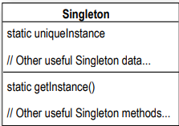
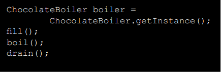

# One of a Kind Objects

Sıradaki durağımız Singleton Tasarım Deseni'dir, yalnızca bir instance'i bulunan benzersiz nesneler oluşturmak için
kullanılan bir desendir. Tüm tasarım desenleri arasında, Singleton en basit olanıdır; aslında diyagram sadece tek bir
sınıfı içerir! Ancak çok rahat hissetmeyin; sınıf tasarımı perspektifinden basitliğine rağmen, uygulamasında birkaç
zorlukla karşılaşacağız. Dolayısıyla hazır olun.

--**DIALOGS**--

Geliştirici: Bu ne işe yarar?

Usta: Sadece bir tane ihtiyacımız olan birçok nesne var: thread pools, caches, dialog boxes, preferences'ları ve
registry settings işleyen nesneler, logging için kullanılan nesneler ve printerlar ve GPU'lar gibi cihazlar için driver
olarak işlev gören nesneler gibi. Aslında, bu tür nesnelerin birinden fazlasını oluşturursak, yanlış program davranışı,
kaynakların aşırı kullanımı veya tutarsız sonuçlar gibi birçok sorunla karşılaşırız.

Geliştirici: Tamam, belki sadece bir kez instantiated edilmesi gereken sınıflar var, ama bunun için bir bütün bölüm
gerekli mi? Bu işi sadece gelenek veya global variable'lar ile yapamaz mıyım? Mesela Java'da bir static variable ile
yapabilirim.

Usta: Birçok yönden, Singleton Tasarım Deseni, belirli bir sınıf için yalnızca bir nesnenin instantiated edilmesini
sağlamak için bir gelenektir. Daha iyi bir methodunuz varsa, dünya onu duymak ister; ancak unutmayın ki, tıpkı diğer
tasarım desenleri gibi, Singleton Tasarım Deseni, yalnızca bir nesnenin oluşturulmasını sağlamak için zaman testini
geçmiş bir yöntemdir. Singleton Tasarım Deseni, bize global bir erişim noktası da sağlar, tıpkı bir global değişken
gibi, ancak dezavantajları olmadan.

Geliştirici : Ne gibi dezavantajları var?

Usta: İşte bir örnek: Bir nesneyi bir global değişkene atarsanız, o nesne uygulamanız başladığında oluşturulabilir,
değil mi? Peki ya bu nesne kaynak yoğunsa ve uygulamanız hiçbir zaman onu kullanmazsa ne olur? Singleton Deseni ile
göreceğiniz gibi, nesnelerimizi sadece ihtiyaç duyulduğunda oluşturabiliriz.

Geliştirici: Hala bu kadar zor olması gerektiğini düşünmüyorum gibi görünüyor.

Usta: Eğer static sınıf değişkenleri ve metotları ile erişim belirleyicilerine iyi hakimseniz, o zaman zor değil. Ancak
her iki durumda da, bir Singleton'ın nasıl çalıştığını görmek ilginçtir ve ne kadar basit görünürse görünsün, Singleton
kodunu doğru bir şekilde yazmak zordur. Kendinize şunu sorun: Birden fazla nesnenin örneklenmesini nasıl engellerim? O
kadar da açık değil, değil mi?

# Dissecting the classic Singleton Pattern implementation

```
public class Singleton {

    /* Singleton sınıfının bir instance'ini tutmak için statik bir değişkenimiz var. */
    private static Singleton uniqueInstance;

    /* private constructor */
    private Singleton() {}

    /* getInstance() methodu bize sınıfı oluşturma ve aynı zamanda bir instance'ini döndürme yolunu sağlar. */
    public static Singleton getInstance(){
        if (uniqueInstance == null){
            uniqueInstance = new Singleton();
        }
        return uniqueInstance;
    }

    /* Tabii ki, Singleton normal bir sınıftır; başka kullanışlı instance variable'ları ve methodları vardır.*/
}
```

Eğer sadece kitap içinde geziniyorsanız, bu kodu körü körüne yazmayın; ilerleyen bölümlerde birkaç sorunu olduğunu
göreceksiniz.

--**DIALOGS**--

HeadFirst: Kendiniz hakkında biraz bilgi vermekle başlayabilir misiniz?

Singleton: İşte tamamen unique'im; sadece bir tane var.

HeadFirst : Bir?

Singleton: Evet, sadece bir. Ben, herhangi bir anda sadece bir instance'ın olmasını sağlayan Singleton Tasarım Deseni'ne
dayalıyım.

HeadFirst: Bu bir tür israf değil mi? Birisi tam teşekküllü bir sınıf geliştirmek için zaman harcadı ve şimdi sadece bir
nesne elde edebiliyoruz?

Singleton: Hiç de öyle değil! TEK bir nesnede güç var. Diyelim ki registery settings'leri içeren bir nesneniz var. Bu
nesnenin ve değerlerinin etrafta birden fazla kopyasını istemezsiniz - bu kaosa yol açabilir. Benim gibi bir nesneyi
kullanarak, uygulamanızdaki her nesnenin aynı global kaynağı kullandığından emin olabilirsiniz.

HeadFirst : Biraz açarmısın?

Singleton : Sıklıkla connection veya thread pool'lar gibi resource pool'ları yönetmek için kullanılırım.

HeadFirst: Yine de, sadece bir tane mi sizden var? Bu yalnız gibi geliyor.

Singleton: Benim sadece bir tane olmam nedeniyle oldukça meşgulüm, ancak daha fazla geliştiricinin beni bilmesi güzel
olurdu - birçok geliştirici, farkında olmadan etrafta dolaşan birden fazla nesneye sahip oldukları için hatalarla
karşılaşır.

HeadFirst: Peki, sormamıza izin verirseniz, sadece bir tane olduğunuzu nasıl biliyorsunuz? (new) operatörü kullanarak
herhangi bir kişi bir "sen" oluşturamaz mı?

Singleton: Hayır! Gerçekten unique'im.

HeadFirst: Peki, geliştiriciler seni birden fazla kez instantiate etmemeye yemin ediyorlar mı?

Singleton: Tabii ki hayır. Gerçek şu ki... bu biraz kişisel hale geliyor ama... benim herhangi bir public constructor'ım
yok.

HeadFirst: public constructor yok! Oh, özür dilerim, public constructor yok mu?

Singleton: Doğru. Constructor Private olarak tanımlanmış durumda.

HeadFirst: Bu nasıl işliyor?

Singleton: Gördüğünüz gibi, bir Singleton nesnesine sahip olmak için bir tane instance oluşturmazsınız, sadece bir
instance istersiniz. Bu yüzden sınıfımın getInstance() adında bir static methodu var. Onu çağırın, ben hemen ortaya
çıkacağım ve çalışmaya hazır olacağım. Aslında, siz beni istediğinizde başka nesnelere yardım etmiş bile olabilirim.

# The Chocolate Factory

```
public class ChocolateBoiler {
    private boolean empty;
    private boolean boiled;

    public ChocolateBoiler() {
        
        /* Bu kod, yanlızca kazan boş olduğunda başlatılır!*/
        
        this.empty = true;
        this.boiled = false;
    }

    public void fill() {
        if (isEmpty()) {
            
            /* Kazanı doldurmak için önce boş olmalıdır ve bir kez dolu olduğunda boş ve kaynatılmış bayraklarını
            ayarlarız.*/
            
            this.empty = false;
            this.boiled = false;
        }
    }

    public void drain() {
        if (!isEmpty() && isBoiled()) {
            
            /* Kazanı boşaltmak için, kazanın dolu (not empty) ve (isBoiled true) olması gerekir. Bir kez
            boşaltıldığında, emply flag'ini yeniden true olarak ayarlarız.*/
            
            empty = true;
        }
    }

    public void boil(){
        if (!isEmpty() && !isBoiled()){
            
            /* Karışımı kaynatmak için, kazanın dolu olması ve daha önce kaynatılmamış olması gerekir. Bir kez
            kaynadığında, boiled flag'ini true olarak ayarlarız.*/
            
            boiled = true;
        }
    }

    public boolean isEmpty() {
        return empty;
    }

    public boolean isBoiled() {
        return boiled;
    }
}
```

Choc-O-Holic, kötü şeylerin olmasını engellemek için iyi bir iş yapmış gibi görünüyor, öyle değil mi? Ancak, muhtemelen
iki ChocolateBoiler instance'i serbest bırakılırsa, çok kötü şeylerin olabileceğini düşünüyorsunuzdur.

Bir uygulamada birden fazla ChocolateBoiler instance'i oluşturulursa neler yanlış gidebilir?

# Singleton Pattern defined

Singleton Tasarım Deseni, bir sınıfın yalnızca bir instance'i olduğunu garanti eder ve ona Global bir erişim noktası
sağlar.

Büyük sürprizler yok gibi görünüyor. Ancak, biraz daha ayrıntılara inelim:

* Burada gerçekte ne oluyor? Bir sınıfı alıyoruz ve kendi single instance'ini yönetmesine izin veriyoruz. Ayrıca başka
  bir sınıfın kendi başına yeni bir instance oluşturmasını engelliyoruz. Bir instance almak için sınıfın kendisi
  üzerinden gitmek zorundasınız.

* Ayrıca, instance'a global bir erişim noktası sağlıyoruz: bir instance'a ihtiyacınız olduğunda sadece sınıfa sorgu
  gönderirseniz, size Singleton bir instance'i geri verir. Gördüğünüz gibi, Singleton'ı kaynak yoğun nesneler için
  özellikle önemli olan lazy bir şekilde oluşturacak şekilde implemente edebiliriz.

### Okay, let’s check out the class diagram:



getInstance() methodu, statik bir methoddur, yani bir sınıf methodudur. Bu nedenle Singleton.getInstance() kullanarak
kodunuzun herhangi bir yerinden bu methoda rahatlıkla erişebilirsiniz. Bu, bir global değişkene erişmek kadar kolaydır,
ancak Singleton'dan lazy oluşturma gibi avantajlar elde ederiz. Bu sayede yalnızca ihtiyaç duyulduğunda instance
oluşturulur ve kaynaklar daha verimli kullanılır.

uniqueInstance sınıf değişkeni, Singleton'ın tek ve yegane instance'ını tutar.

Singleton Tasarım Deseni uygulayan bir sınıf, sadece bir Singleton değildir; kendi data ve method setine sahip genel
amaçlı bir sınıftır.

# Houston we have a problem

ChocalateBoiler bizi hayal kırıklığına uğratmış gibi görünüyor; Klasik Singleton kullanarak kodu geliştirmemize
rağmen, ChocolateBoiler'ın fill() methodu bir süt ve çikolata partisi kaynatılırken bile kazanı doldurmaya
başlayabilmiş! Bu, 500 gallon dökülmüş süt (ve çikolata) demek!

Thread'lerin eklenmesi bu soruna neden olabilir mi? uniqueInstance değişkenini ChocolateBoiler'ın single instance'i
olarak ayarladığımızda, getInstance() çağrılarının hepsinin aynı örneği döndürmesi gerekmez mi? Doğru mu?

# Be the JVM

İki thread'imiz var, her biri bu kodu çalıştırıyor. Göreviniz, JVM ile oynamak ve iki thread'in farklı Boiler
nesnelerine sahip olabileceği bir durum olup olmadığını belirlemektir. İpucu: Gerçekten sadece getInstance() methodunu
ve uniqueInstance'ın değerini incelemeniz gerekiyor, böylece nasıl örtüşebileceklerini görebilirsiniz.



# Dealing with multithreading

Multithread sorunlarımız neredeyse basit bir şekilde düzeltilebilir. getInstance() methodunu synchronized bir method
yaparak:

```
public class Singleton {
    private static Singleton uniqueInstance;

    private Singleton(){}

    public static synchronized Singleton getInstance(){
        if (uniqueInstance == null){
            uniqueInstance = new Singleton();
        }
        return uniqueInstance;
    }
}
```

getInstance() methoduna synchronized anahtar kelimesini ekleyerek, her thread'i sırasını beklemeye zorluyoruz.
Yani, aynı anda iki thread methoda giremez. Fakat synchorinization pahalı bir işlemdir.

Çok iyi bir noktaya değindiniz ve aslında durum biraz daha kötü: senkronizasyonun ilgili olduğu tek zaman bu methodun
ilk kez çağrılmasıdır. Yani, uniqueInstance değişkenini Singleton bir instance'a ayarladıktan sonra, bu methodu
senkronize etmeye ihtiyacımız kalmaz. İlk çağrıdan sonra senkronizasyon tamamen gereksiz bir maliyettir!

# Can we improve multithreading?

Çoğu Java uygulaması için Singleton'ın multithreading çalışmasını sağlamamız gerektiği açıktır. Ancak,
getInstance() methodunu senkronize etmek oldukça maliyetli görünüyor, o zaman ne yapmalıyız? İşte birkaç seçeneğimiz
var:

1 - getInstance() methodunun performansı uygulamanız için kritik değilse hiçbir şey yapmayın. getInstance() methodunu
çağırmak uygulamanız için önemli bir yük oluşturmuyorsa, üzerine düşünmeyin. getInstance() methodunu senkronize etmek
basit ve etkilidir. Sadece unutmayın ki bir methodu senkronize etmek performansı 100 kat kadar azaltabilir, bu nedenle
kodunuzun yüksek trafiğe sahip bir bölümü getInstance() kullanmaya başlarsa tekrar düşünmeniz gerekebilir.

2 - Lazy bir şekilde oluşturulan bir instance'a değil, eagerly oluşturulan bir instance'a geçin. Eğer uygulamanız her
zaman Singleton'ın bir instance'ini oluşturur ve kullanır veya Singleton'ın oluşturma ve çalışma süreçlerinin maliyeti
yüksek değilse, Singleton'ınızı aşağıdaki gibi eagerly oluşturmayı tercih edebilirsiniz:

```
public class Singleton {

    /* Singleton'ın bir instance2ini bir statik başlatıcıda oluşturabilirsiniz. Bu kod, kesinlikle multithreading
    güvenliği sağlar!*/
    
    private static Singleton uniqueInstance = new Singleton();

    private Singleton(){}

    public static Singleton getInstance(){
        return uniqueInstance;
    }
}
```

Bu yaklaşımı kullanarak, sınıf yüklendiğinde JVM'in Singleton'ın unique instance'ini oluşturmasına güveniyoruz. JVM,
örneğin statik uniqueInstance değişkenine erişen herhangi bir thread'den önce instance'in oluşturulacağını garanti
eder.

3 - getInstance() içinde senkronizasyon kullanımını azaltmak için "double-checked locking" kullanabilirsiniz.
Double-checked locking" ile önce bir instance2in oluşturulup oluşturulmadığını kontrol ediyoruz ve eğer oluşturulmadıysa
O ZAMAN senkronize ediyoruz. Bu şekilde, sadece ilk kez geçişte senkronize ederiz, tam olarak istediğimiz şey budur

```
public class Singleton {
    private volatile static Singleton uniqueInstance;

    private Singleton(){}

    public static Singleton getInstance(){
    
        /* Bir instance'i kontrol edin ve eğer bir instance yoksa synchronized bir bloğa girin. Dikkat edin, sadece ilk
        kez geçişte synchronize ediyoruz! */
    
        if (uniqueInstance == null){
            synchronized (Singleton.class) {
                if (uniqueInstance == null){
        
                    /* Bir kez blok içine girdikten sonra tekrar kontrol edin ve hala null ise bir instance oluşturun.*/
                    uniqueInstance = new Singleton();
                
                }
            }
        }
        return uniqueInstance;
    }
}
```

**Volatile** anahtar sözcüğü, uniqueInstance değişkeni Singleton instance'ina initialize edilirken multiple thread'in bu
değişkeni doğru şekilde işlemesini sağlar.

getInstance() methodunu kullanırken performans bir sorun teşkil ediyorsa, Singleton'ı uygulamanın bu yöntemi ek yükü
büyük ölçüde azaltabilir.

--**DIALOGS**--

Q : Bir sınıftan oluşan bu kadar basit bir desen için, Singletonlar kesinlikle bazı sorunlar sunabiliyorlar.

A : Önceden sizi uyardık! Ancak sorunlar sizi caydırmasın; Singletonları doğru bir şekilde uygulamak zor olabilir, ancak
bu bölümü okuduktan sonra instance sayısını kontrol etmeniz gereken her yerde Singletonları oluşturmak için
kullanabileceğiniz teknikler hakkında iyi bilgilendirildiniz.

Q : Tüm methodların ve variable'ların statik olarak tanımlandığı bir sınıf oluşturamaz mıyım? Bu bir Singleton ile aynı
şey olmaz mı?

A : Evet, eğer sınıfınız kendi başına bağımsız ve karmaşık bir initialization'a bağlı değilse. Ancak, Java'da static
initialization'ların işlendiği şekilden dolayı, özellikle birden fazla sınıfın dahil olduğu durumlarda bu durum çok
karmaşık hale gelebilir. Bu senaryo genellikle initialization sırasıyla ilgili karmaşık ve zor bulunan hatalara yol
açabilir. Eğer "singleton"ınızı bu şekilde implemente etmeniz için ikna edici bir neden yoksa, nesne dünyasında kalmak
çok daha iyi bir seçenektir.

Q : Peki ya class loader'lar? İki class loader'ın her birinin kendi Singleton instance'ina sahip olma ihtimali olduğunu
duydum.

A : Evet, bu doğru. Her class loader bir namespace tanımlar. İki veya daha fazla class loader'a sahipseniz, aynı sınıfı
birden çok kez yükleyebilirsiniz (her bir class loaderde bir kez). Şimdi, bu sınıf tesadüfen bir Singleton ise, çünkü
sınıfın birden fazla versiyonuna sahibiz, Singleton'ın birden fazla instance'ına da sahibiz demektir. Bu nedenle, birden
çok class loader ve Singleton kullanıyorsanız dikkatli olmanız gerekebilir. Bu sorunun bir yolunu kendiniz belirtmek
için class loader'i belirlemelisiniz

Q : Bana her zaman bir sınıfın sadece ve sadece tek bir şey yapması gerektiği öğretildi. Bir sınıfın iki şey yapması
kötü OO tasarımı olarak kabul edilir. Bir Singleton bunu ihlal etmiyor mu?

A : Siz "One class, One responsibility" prensifine atıfta bulunuyorsunuz ve evet, haklısınız, Singleton sınıfı yalnızca
kendi instance'ini yönetmekle (ve global erişim sağlamakla) sorumlu değil, aynı zamanda uygulamanızdaki ana rolü neyse
ondan da sorumlu. Bu nedenle kesinlikle iki sorumluluğu üstlendiği savunulabilir. Bununla birlikte, bir sınıfın kendi
instance'ini yönetmesinin faydalı olduğunu görmek zor değil; genel tasarımı kesinlikle daha basit hale getiriyor.
Ayrıca, Singleton deseni birçok geliştirici tarafından yaygın olarak kullanıldığı için, birçok geliştirici tarafından
bilinir. Bununla birlikte, bazı geliştiriciler Singleton işlevselliğini abstract etmeye ihtiyaç duyabilir.

Q : Singleton kodumu alt sınıflara ayırmak istedim, ancak sorunlarla karşılaştım. Bir Singleton'ı alt sınıflara ayırmak
doğru mudur?

A : Singleton sınıfını alt sınıflandırmanın bir sorunu, constructor'ın private olmasıdır. Private bir constructor'ı olan
bir sınıfı genişletemezsiniz. Bu nedenle yapmanız gereken ilk şey, constructor'ı public veya protected hale getirmektir.
Ancak bu durumda artık gerçekten bir Singleton olmayacaktır, çünkü diğer sınıflar onu initialize edebilir.
Constructor'ı değiştirirseniz, başka bir sorun ortaya çıkar. Singleton uygulaması, bir static değişkene dayandığı için
doğrudan bir alt sınıf oluşturursanız, tüm türetilmiş sınıflar aynı instance variable'ini paylaşacaktır. Bu muhtemelen
aklınızda olan şey değildir. Bu nedenle alt sınıflandırmak için, temel sınıfta bir tür registry uygulamanız gerekebilir.
Bu tür bir şemayı uygulamadan önce, bir Singleton'ı alt sınıflandırmanın size ne kazandıracağını sormanız önemlidir.
Çoğu tasarım deseni gibi, Singleton genellikle bir kütaplık içine sığabilecek bir çözüm olması gerekmeyebilir. Ayrıca,
Singleton kodu mevcut bir sınıfa kolayca eklenebilecek kadar basittir. Son olarak, uygulamanızda çok sayıda Singleton
kullanıyorsanız, tasarımınıza dikkatlice göz atmanız gerekebilir. Singleton'lar tasarruflu bir şekilde kullanılması
gereken özelliklerdir.

Q : Global değişkenlerin neden bir Singleton'dan daha kötü olduğunu hala tam olarak anlamış değilim.

A : Java'da, global değişkenler temel olarak nesnelere yönelik statik referanslardır. Bu şekilde global değişkenler
kullanmanın bazı dezavantajları vardır. Zaten birini belirttik: tembel (lazy) ile hemen (eager) başlatma sorunu. Ancak
desenin amacını aklımızda tutmamız gerekiyor: bir sınıfın yalnızca bir instance'inin varlığını sağlamak ve global erişim
sağlamak. Bir global değişken, ikinciyi sağlayabilir, ancak birinciyi sağlayamaz. Global değişkenler ayrıca
geliştiricileri küçük nesnelere yönelik çok sayıda global referansla ad alanını kirletmeye teşvik etme eğilimindedir.
Singletonlar bunu aynı şekilde teşvik etmez, ancak yine de kötüye kullanılabilir.

--**BULLET POINTS**--

* Singleton Deseni, uygulamanızda en fazla bir sınıf instance'ina sahip olduğunuzu garanti eder.

* Singleton Deseni ayrıca bu instance'a global bir erişim noktası sağlar.

* Java'nın Singleton Deseni implementasyonunda, private bir constructor, combined bir static method ve bir static
  variable kullanır.

* Performans ve kaynak kısıtlamalarınızı inceleyin ve multithreaded uygulamalar için uygun bir Singleton
  implementasyonunu dikkatlice seçin (ve tüm uygulamaların multithreaded olduğunu düşünmelisiniz!).

* Java 2, sürüm 5 öncesi sürümlerde double-checked locking implementasyonuna dikkat edin; bu sürümlerde thread safety
  değildir.

* Birden fazla class loader kullanıyorsanız dikkatli olun; bu, Singleton implementasyonunu geçersiz kılabilir ve birden
  fazla instance'a neden olabilir.