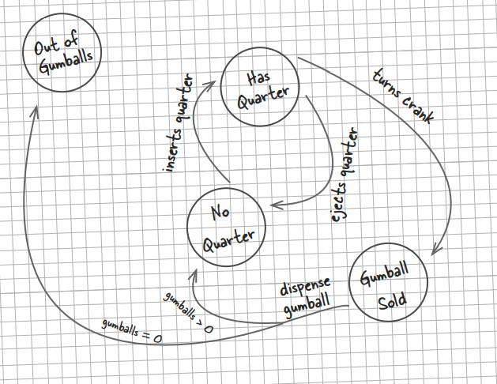
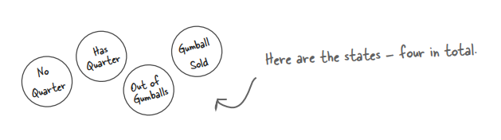
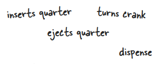
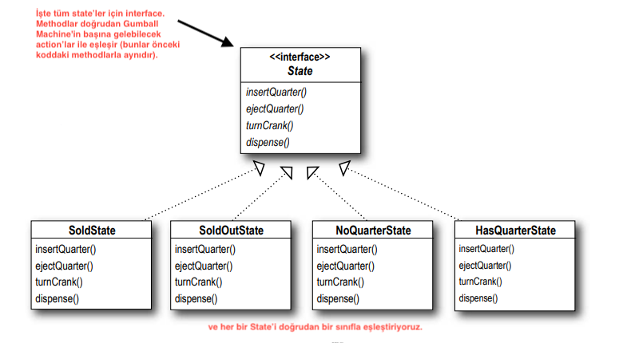
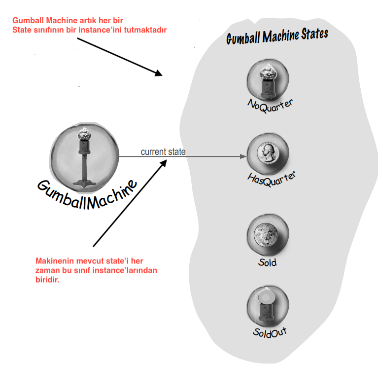
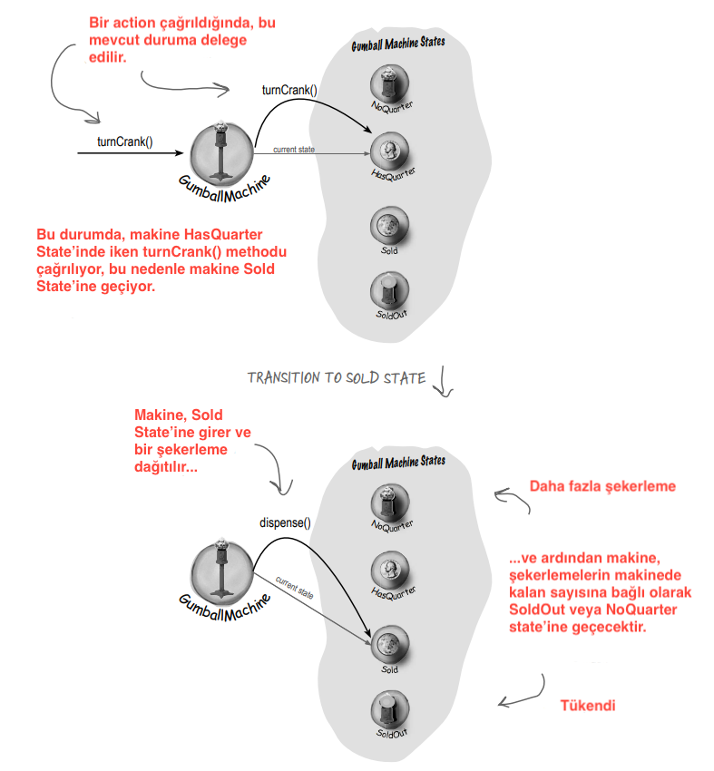
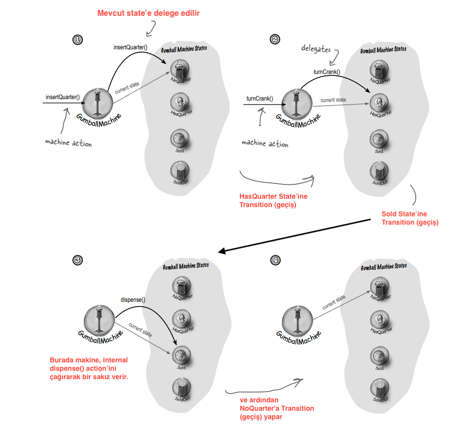
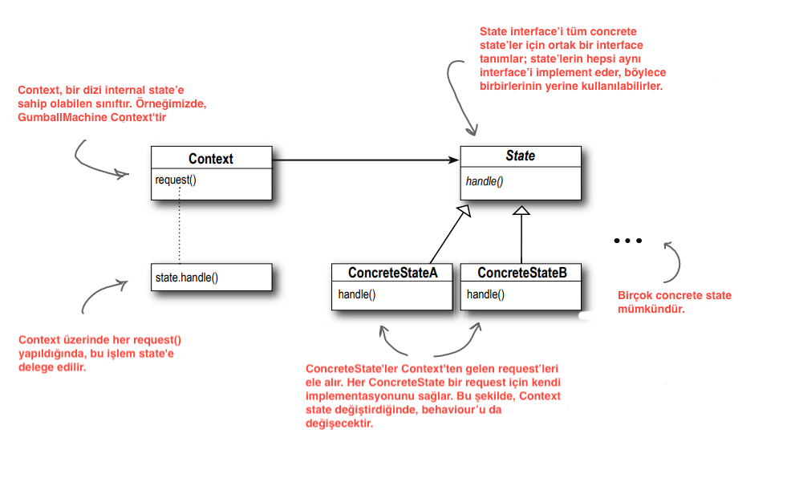
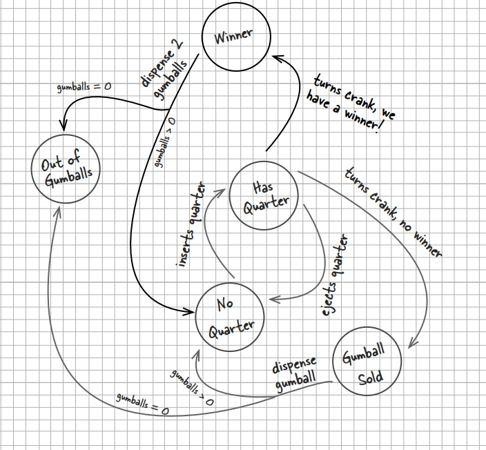
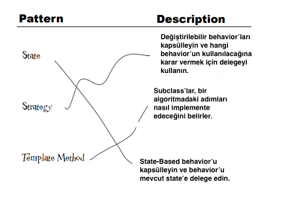

# State Pattern

Az bilinen bir gerçek: Strategy ve State Kalıpları doğumda ayrılmış ikizlerdir. Bildiğiniz gibi Strategy Kalıbı,
değiştirilebilir algoritmalar etrafında çılgınca başarılı bir iş yaratmaya devam etti. Ancak State, nesnelerin internal
state'lerini değiştirerek davranışlarını kontrol etmelerine yardımcı olmak gibi belki de daha asil bir yol izledi. Sık
sık object client'larına şöyle dediği duyulur: "Benden sonra tekrar edin: Ben yeterince iyiyim, ben yeterince zekiyim..

Java tost makineleri 90'larda kaldı. Bugün insanlar Java'yı sakız makineleri gibi gerçek cihazlara yerleştiriyorlar. Bu
doğru, sakız makineleri yüksek teknolojiye sahip oldu; büyük üreticiler makinelerine CPU yerleştirerek satışları
artırabileceklerini, ağ üzerinden envanteri izleyebileceklerini ve müşteri memnuniyetini daha doğru ölçebileceklerini
keşfettiler.

İşte sakız makinesi denetleyicisinin çalışması gerektiğini düşündüğümüz yol. Bunu bizim için Java'da implement
edebileceğinizi umuyoruz! Gelecekte daha fazla behavior ekleyebiliriz, bu nedenle tasarımı olabildiğince esnek ve
sürdürülebilir tutmanız gerekir!



Bu şemaya bir göz atalım ve Mighty Gumball elemanlarının ne istediğini görelim...

**--DIALOGS--**

Anne : Bu diyagram bir State diyagramına benzemektedir.

Joe : Doğru, bu dairelerin her biri bir State

Anne : ... ve okların her biri bir State Transition (geçişidir)

Frank : İkiniz de yavaş olun, State diyagramlarını çalışmayalı çok uzun zaman oldu. Bana neyle ilgili olduklarını
hatırlatabilir misiniz?

Anne : Dairelere bakın; bunlar State'leri temsil eder. "No Quarter" muhtemelen sakız makinesinin başlangıç Stateudur
çünkü orada öylece oturmuş ve çeyrek koymanızı beklemektedir. Tüm State'ler, makinenin belirli bir şekilde davranan ve
onları başka bir Statea geçirmek için bazı actionlere ihtiyaç duyan farklı konfigürasyonlardır.

Joe : Doğru. Başka bir State'e geçmek için, örneğin, makineye bir çeyrek koymak gibi bir şey yapmanız gerekir.
"No Quarter" dan "Has Quarter?"a giden oku görebiliyorsunuz değil mi? Tam olarak! Bu, sakız makinesinin "No Quarter"
State'inde olduğunu ve bir çeyrek koyarsanız, State'inin "Has Quarter" State'ine değişeceği anlamına gelir. Bu State
Transition'dır (geçişidir)

Frank : Madem "Has Quarter" State'indeyim, kolu çevirebilirim ve "Gumball Sold" State'ine geçebilirim veya
çeyreği çıkartabilir ve "No Quarter" State'ine dönebilirim. Bu pek de kötü görünmüyor gibi. Açıkça dört State'imiz var
gibi görünüyor ve aynı zamanda dört action'ımız olduğunu düşünüyorum: "insert quarter" "ejects quarter" "turns crank"
ve "dispense" Ancak... dağıttığımızda, "Gumblaa Sold" State'inde sıfır veya daha fazla şekerlemeyi test ediyoruz ve
ardından ya "Out Of Gamballs" State'ine ya da "No Quarter" state'ine geçiyoruz. Yani aslında bir State'den diğerine
beş transition'ımız var gibi görünüyor.

Anne : Sıfır veya daha fazla şekerleme için yapılan bu test aynı zamanda şekerlemelerin sayısını da takip etmemiz
gerektiği anlamına geliyor. Makine size bir şekerleme verdiğinde, bu sonuncusu olabilir ve öyleyse "Out of Gamball"
state'ine geçmeliyiz.

Joe : Ayrıca, sakız makinesi "No Quarter" state'inde iken çeyrekliği çıkarmaya çalışmak veya iki çeyreklik yerleştirmek
gibi saçma şeyler yapabileceğinizi unutmayın.

Frank : Oh, bunu düşünmemiştim; onlarla da ilgilenmemiz gerekecek

Joe : Her olası actipn için hangi State'de olduğumuzu kontrol etmemiz ve uygun şekilde hareket etmemiz gerekecek. Bunu
yapabiliriz! State diyagramını kodla eşlemeye başlayalım...

# State Machines 101

Bu State diyagramından gerçek koda nasıl ulaşacağız? İşte state machine'leri implement etmeye hızlı bir giriş:

1 - Ilk olarak state'leri toplayın



2 - Ardından, geçerli state'i tutmak için bir instance variable oluşturun ve her bir State için değerler tanımlayın:

```
/* Burada her state unique bir tamsayı olarak temsil ediliyor... */
final static int SOLD_OUT = 0; // "Out of Gumballs "a kısaca "Sold Out" diyelim
final static int NO_QUARTER = 1;
final static int HAS_QUARTER = 2;
final static int SOLD = 3;

/* ve burada mevcut State'i tutan bir instance variables var. Makine kutusundan ilk çıkarıldığında ve açıldığında 
dolmamış olacağı için bunu "SOLD_OUT" olarak ayarlayacağız */
int state = SOLD_OUT;
```

3 - Şimdi sistemde gerçekleşebilecek tüm Action'ları bir araya getiriyoruz:



* Insert Quarter
* Turns Crank
* Ejects Quarter
* Dispense

Bu Action'lar sakız makinesinin interface'idir - onunla yapabileceğiniz şeyler

Dispense (dağıtım) daha çok makinenin kendi kendine gerçekleştirdiği dahili bir action'dır

Diyagrama bakıldığında, bu Action'lardan herhangi birinin çağrılması bir State Transition (geçişine) neden olur.

4 - Şimdi state machine olarak hareket eden bir sınıf oluşturuyoruz. Her action için, her state'de hangi behavior'un
uygun olduğunu belirlemek üzere conditional statement (koşullu ifadeler) kullanan bir method oluşturuyoruz. Örneğin,
çeyrek ekleme action'i için şöyle bir method yazabiliriz:

```
public void insertQuarter() {
    /* Her olası state bir koşullu ifade ile kontrol edilir... ve her olası state için uygun behavior'u sergiler */
    if (state == HAS_QUARTER) {
        System.out.println("You can't insert another quarter");
    } else if (state == SOLD_OUT) {
        System.out.println("You can't insert a quarter, the machine is sold out");
    } else if (state == SOLD) {
        System.out.println("Please wait, we're already giving you a gumball");
    } else if (state == NO_QUARTER){
        /* ancak diyagramda gösterildiği gibi diğer state'lere de geçiş yapabilir.*/
        state = HAS_QUARTER;
        System.out.println("You inserted a quarter");
    }
}
```

Burada yaygın bir teknikten bahsediyoruz: state değerlerini tutmak için bir instance variable oluşturarak ve çeşitli
state'leri işlemek için methodlarımız içinde koşullu kod yazarak bir nesne içindeki state'i modellemek.

# Kodun yazılması

Gumball Machine'i implement etme zamanı geldi. Mevcut State'i tutan bir instance variable'a sahip olacağımızı biliyoruz.
Bundan sonra, gerçekleşebilecek tüm action'ları, behavior'ları ve State Transition (geçişlerini) ele almamız gerekiyor.
Action'lar için, bir çeyreklik yerleştirme, bir çeyreklik çıkarma, krankı çevirme ve bir sakız dağıtma action'larını
implement etmemiz gerekiyor; ayrıca implement etmemiz gereken boş sakız koşulumuz da var.

```
public class GumballMachine {

    /* İşte dört State; Mighty Gumball'ın State diyagramındaki State'ler ile eşleşiyorlar */
    private static final int SOLD_OUT = 0;
    private static final int NO_QUARTER = 1;
    private static final int HAS_QUARTER = 2;
    private static final int SOLD = 3;

    /* İşte içinde bulunduğumuz State'i takip edecek olan instance variable. SOLD_OUT State'inde başlıyoruz */
    private int state = SOLD_OUT;

    /* Makinedeki sakızların sayısını takip eden ikinci bir instance variablemiz var */
    private int count = 0;

    /* Constructor başlangıçta bir sakız envanteri alır. Envanter sıfır değilse, makine NO_QUARTER durumuna girer,
    yani birinin çeyreklik koymasını bekler, aksi takdirde SOLD_OUT state'inde kalır */
    public GumballMachine(int count) {
        this.count = count;
        if (count > 0) {
            state = NO_QUARTER;
        }
    }

    /* Şimdi action'ları method olarak implement etmeye başlıyoruz.... Bir çeyreklik yerleştirildiğinde....*/
    public void insertQuarter() {
        /* Her olası state bir koşullu ifade ile kontrol edilir... ve her olası state için uygun behavior'u sergiler */
        /* bir çeyreklik zaten yerleştirilmişse client'a söyleriz */
        if (state == HAS_QUARTER) {
            System.out.println("You can't insert another quarter");

        }

        /* aksi takdirde çeyreği kabul eder ve HAS_QUARTER State'ine geçeriz. */
        else if (state == NO_QUARTER) {
            state = HAS_QUARTER;
            System.out.println("You inserted a quarter");

        }

        /* ve eğer makine tükenmişse, çeyreği reddediyoruz */
        else if (state == SOLD_OUT) {
            System.out.println("You can't insert a quarter, the machine is sold out");

        }

        /* Client az önce bir sakız satın aldıysa, bir çeyreklik daha yerleştirmeden önce işlemin tamamlanmasını
        beklemesi gerekir */
        else if (state == SOLD) {
            System.out.println("Please wait, we're already giving you a gumball");
        }
    }

    /* Şimdi, eğer client çeyreği çıkarmaya çalışırsa... */
    public void ejectQuarter() {
        /* Eğer bir çeyreklik varsa, onu iade eder ve NO_QUARTER state'ine geri döneriz */
        if (state == HAS_QUARTER) {
            System.out.println("Quarter returned");
            state = NO_QUARTER;
        }

        /* Aksi takdirde, eğer çeyreklik yoksa geri veremeyiz */
        else if (state == NO_QUARTER) {
            System.out.println("You haven't inserted a quarter");
        }

        /* Client crank'ı yeni çevirmişse, para iadesi yapamayız; sakız zaten onda */
        else if (state == SOLD) {
            System.out.println("Sorry, you already turned the crank");
        }

        /* Makine tükenmişse çıkaramazsınız, çeyreklik kabul etmiyor! */
        else if (state == SOLD_OUT) {
            System.out.println("You can't eject, you haven't inserted a quarter yet");
        }
    }

    /* Client crank'ı çevirmeye çalışır... */
    public void turnCrank() {

        /* Birisi makineyi kandırmaya çalışıyor */
        if (state == SOLD) {
            System.out.println("Turning twice doesn't get your another gumball");
        }

        /* Önce bir çeyreklik lazım */
        else if (state == NO_QUARTER) {
            System.out.println("You turned but there's no quarter");
        }

        /* Sakızları teslim edemeyiz; hiç sakız yok */
        else if (state == SOLD_OUT) {
            System.out.println("You turned, but there are no gumballs");
        }

        /* Başarılı! Bir sakız alırlar. State'i SOLD olarak değiştirin ve makinenin dispense() methodunu çağırın */
        else if (state == HAS_QUARTER) {
            System.out.println("You turned");
            state = SOLD;
            dispense();
        }
    }

    public void dispense() {
        /* SOLD state'indeyiz; onlara bir sakız verin! */
        if (state == SOLD) {
            System.out.println("A gumball comes rolling out the slot");
            count -= 1;
            if (count == 0) {
                /* Burada "sakız bitti" durumunu ele alıyoruz: Eğer bu sonuncusuysa, makinenin state'ini SOLD_OUT
                olarak ayarlarız; aksi takdirde, bir çeyrekliğimiz olmama state'ine geri döneriz. */
                System.out.println("Oops out of gumballs!");
                state = SOLD_OUT;
            } else {
                state = NO_QUARTER;
            }
        }

        /* Bunların hiçbiri olmamalı, ama olursa, onlara bir hata veririz, sakız değil */
        else if (state == NO_QUARTER) {
            System.out.println("You need to pay first");
        } else if (state == SOLD_OUT){
            System.out.println("No gumball dispensed");
        } else if (state == HAS_QUARTER) {
            System.out.println("No gumball dispensed");
        }
    }
}
```

# In-house testing

```
public class GumballMachineTestDrive {
    public static void main(String[] args) {
        GumballMachine gumballMachine = new GumballMachine(5);
        System.out.println(gumballMachine); // makinanın içinde şu anda 5 adet sakız var, state'i de NO_QUARTER

        gumballMachine.insertQuarter();
        gumballMachine.turnCrank();
        System.out.println(gumballMachine); // makinaya bir çeyreklik attık ve crank'i çevirip sakızı aldık

        gumballMachine.insertQuarter();
        gumballMachine.ejectQuarter();
        System.out.println(gumballMachine); // makinaya bir çeyreklik attık ve ardından çıkardık

        gumballMachine.insertQuarter();
        gumballMachine.turnCrank();
        gumballMachine.insertQuarter();
        gumballMachine.turnCrank();
        gumballMachine.ejectQuarter();
        System.out.println(gumballMachine);

        gumballMachine.insertQuarter();
        gumballMachine.insertQuarter();
        gumballMachine.turnCrank();
        gumballMachine.insertQuarter();
        gumballMachine.turnCrank();
        gumballMachine.insertQuarter();
        gumballMachine.turnCrank();
        System.out.println(gumballMachine);
    }
}
```

# Bunun olacağını biliyordunuz... bir değişiklik talebi!

Mighty Gumball, Inc. kodunuzu en yeni makinelerine yükledi ve kalite güvence uzmanları onu test ediyor. Şimdiye kadar,
onların bakış açısından her şey harika görünüyor. Aslında, işler o kadar sorunsuz gitti ki, işleri bir sonraki seviyeye
taşımak istiyorlar...

Zamanın %10'unda, crank döndürüldüğünde, client bir yerine iki sakız alır.

# İşlerin dağınık State'i...

Gumball makinenizi iyi düşünülmüş bir metodoloji kullanarak yazmış olmanız, onu genişletmenin kolay olacağı anlamına
gelmez. Aslında, geri dönüp kodunuza baktığınızda ve onu değiştirmek için ne yapmanız gerektiğini düşündüğünüzde, şey...

```
private static final int SOLD_OUT = 0;
private static final int NO_QUARTER = 1;
private static final int HAS_QUARTER = 2;
private static final int SOLD = 3;
```

Öncelikle, buraya yeni bir WINNER state'i eklemeniz gerekir. Bu o kadar da kötü değil...

```
public void insertQuarter(){
    // insert quarter code here
}

public void ejectQuarter(){
    // eject quarter code here
}

public void turnCrank(){
    // turn crank code here
}

public void dispence(){
    // dispence code here
}
```

Ancak o zaman, WINNER state'ini işlemek için her bir methoda yeni bir koşul eklemeniz gerekir; bu da değiştirilecek çok
fazla kod demektir. turnCrank() özellikle karmaşık hale gelecektir, çünkü bir WINNER olup olmadığını kontrol etmek için
kod eklemeniz ve ardından WINNER State'ine veya SOLD state'ine geçmeniz gerekecektir.

**--DIALOGS--**

Joe : Bu konuda haklısınız! Bu kodu bakımı ve değiştirilmesi kolay olacak şekilde yeniden düzenlememiz gerekiyor.

Anne : Her bir State için behavior'u gerçekten yerelleştirmeye çalışmalıyız, böylece bir State'de değişiklik yaparsak
diğer kodu bozma riskiyle karşılaşmayız.

Joe : Doğru; başka bir deyişle, şu eski "encapsulate what varies (değişeni kapsülle)" ilkesini izleyin. Her state'in
behavior'unu kendi sınıfına koyarsak, her State sadece kendi action'ları implement eder.

Anne : Doğru. Belki de Şekerleme Makinesi, mevcut State'i temsil eden State nesnesine delegasyon yapabilir.

Joe : Composition'ı tercih etmek... daha fazla ilke devrede

Anne : Bunun nasıl işleyeceğinden %100 emin değilim ama sanırım bir şeyler bulduk.

Joe : Acaba bu yeni state'lerin eklenmesini kolaylaştıracak mı?

Anne : Sanırım öyle... Hâlâ kodu değiştirmemiz gerekecek, ancak değişiklikler kapsam olarak çok daha sınırlı olacak,
çünkü yeni bir State eklemek, sadece yeni bir sınıf eklememizi ve belki burada birkaç Transition'ı (geçişi)
değiştirmemizi gerektirecek.

# Yeni dizayn...

Görünüşe göre yeni bir planımız var: mevcut kodumuzu sürdürmek yerine, State nesnelerini kendi sınıflarında kapsülleyip
ardından bir action gerçekleştiğinde mevcut State'e delege edeceğiz. Burada tasarım prensiplerimizi takip ediyoruz, bu
nedenle ileride sürdürmesi daha kolay bir tasarım elde etmeliyiz. İşte bunu nasıl yapacağımız:

1 - İlk olarak, Gumball Machine'deki her action için bir method içeren bir State interface'ini tanımlayacağız.

2 - Ardından, makinenin her State'i için bir State sınıfı implement edeceğiz. Bu sınıflar, makine o State'de olduğunda
behavior'undan sorumlu olacaktır.

3 - Son olarak, tüm koşullu kodlarımızdan kurtulacak ve bunun yerine işi bizim için yapması için state sınıfına delege
edeceğiz.

Sadece tasarım prensiplerini takip etmekle kalmıyoruz, göreceksiniz ki aslında State Pattern'i implement ediyoruz. Ancak
kodumuzu tekrar düzenledikten sonra tüm resmi State Pattern konularına geçeceğiz. Şimdi bir State'in tüm behavior'unu
bir sınıfa yerleştireceğiz. Bu şekilde behavior'unu yerelleştiriyor ve değiştirmeyi ve anlamayı çok daha kolay hale
getiriyoruz.

# State interface'lerinin ve sınıflarının tanımlanması

### Öncelikle State için tüm state'lerimizin implement edeceği bir interface oluşturalım:

Tasarımımızdaki her bir State'i alın ve State interface'ini implement eden bir sınıfta kapsülleyin.



Unutmayın, state interface'ini implement eden yeni bir "WINNER" state'ine de ihtiyacımız var. Gumball Machine'in ilk
versiyonunu yeniden implemente ettikten sonra bu konuya geri döneceğiz.

### State Interface;

```
public interface State {
    void insertQuarter();
    void ejectQuarter();
    void turnCrank();
    void dispense();
}
```

State Interface'ini implemente edecek 4 adet state'i create ediyorum;

```
public class SoldState implements State{
    // implementing methods
}
```

```
public class SoldOutState implements State{
    // implementing methods
}
```

```
public class NoQuarterState implements State{
    // implementing methods
}
```

```
public class HasQuarterState implements State{
    // implementing methods
}
```

# Gumball Machine için yeniden çalışma...

State sınıflarını bitirmeden önce, Gumball Machine'i yeniden çalışacağız - böylece her şeyin birbirine nasıl uyduğunu
görebilirsiniz. State ile ilgili instance variables'larla başlayacağız ve kodu tamsayı kullanmaktan state nesneleri
kullanmaya geçireceğiz:

```
/* GumballMachine'de kodu statik tamsayılar yerine yeni sınıfları kullanacak şekilde güncelliyoruz. Bir sınıfta
tamsayılar ve diğerinde nesneler olması dışında kod oldukça benzerdir... */
public class GumballMachine {

    /* İşte yine tüm state'ler */
    State soldOutState;
    State noQuarterState;
    State hasQuarterState;
    State soldState;

    /* State instance variable */
    State state = soldOutState;

    /* count instance variable'i sakızların sayısını tutar - başlangıçta makine boştur. */
    int count = 0;

    /* Constructor başlangıçtaki sakız sayısını alır ve bunu bir instance variable'da saklar */
    public GumballMachine(int count) {
        /* Ayrıca her birinden birer tane olmak üzere State instance'ları oluşturulur */
        soldOutState = new SoldOutState(this);
        noQuarterState = new NoQuarterState(this);
        hasQuarterState = new HasQuarterState(this);
        soldState = new SoldState(this);
        this.count = count;

        /* Eğer 0'dan fazla sakız varsa State'i NoQuarterState olarak ayarlarız. */
        if (count > 0) {
            state = noQuarterState;
        }
    }

    /* Şimdi Action'lara geçelim. Bunları ŞİMDİ ÇOK KOLAY bir şekilde implemente etmek mümkün. Sadece mevcut State'e
    delege ediyoruz.*/
    public void insertQuarter() {
        state.insertQuarter();
    }

    public void ejectQuarter() {
        state.ejectQuarter();
    }

    public void turnCrank() {
        state.turnCrank();
        /* Unutmayın ki GumballMachine sınıfında dispense() için bir Action methoduna ihtiyacımız yok çünkü bu sadece
        internal bir action'dır; bir kullanıcının makineye doğrudan dispense yapmasını isteyemez. Ancak turnCrank()
        methodundan State nesnesinde dispense() methodunu çağırıyoruz.*/
        state.dispense();
    }

    /* Bu method, diğer nesnelerin (örneğin, State nesnelerimiz) makineyi farklı bir State'e geçirmesine izin verir.*/
    void setState(State state) {
        this.state = state;
    }

    /* Makine, topu serbest bırakan ve count instance variable'ini azaltan bir releaseBall() helper methodunu
    destekler.*/
    void releaseBall() {
        System.out.println("A gumball comes rolling out the slot...");
        if (count != 0) {
            count -= 1;
        }
    }

    public State getSoldOutState() {
        return soldOutState;
    }

    public State getNoQuarterState() {
        return noQuarterState;
    }

    public State getHasQuarterState() {
        return hasQuarterState;
    }

    public State getSoldState() {
        return soldState;
    }

    public State getState() {
        return state;
    }

    public int getCount() {
        return count;
    }
}
```

# State sınıflarımızın implement edilmesi

Bir State'i implemente etme zamanı: hangi behavior'ları istediğimizi biliyoruz; sadece bunu koda dökmemiz gerekiyor.
Yazdığımız state machine kodunu yakından takip edeceğiz, ancak bu sefer her şey farklı sınıflara ayrılmış durumda.

### NoQuarterState

```
public class NoQuarterState implements State{
    GumballMachine gumballMachine;

    /* Constructor aracılığıyla Gumball Machine'e bir referans aktarılır. Bunu bir instance variable'da saklayacağız */
    public NoQuarterState(GumballMachine gumballMachine) {
        this.gumballMachine = gumballMachine;
    }

    @Override
    public void insertQuarter() {
        /* Eğer birisi bir çeyrek eklerse, çeyreğin kabul edildiğine dair bir mesaj yazdırırız ve ardından makinenin
        State'ini HasQuarterState olarak değiştiririz.*/
        System.out.println("You inserted a quarter");
        gumballMachine.setState(gumballMachine.getHasQuarterState());
    }

    @Override
    public void ejectQuarter() {
        /* Bize hiç vermediğiniz parayı geri alamazsınız! */
        System.out.println("You haven't inserted a quarter");
    }

    @Override
    public void turnCrank() {
        /* Ve bize ödeme yapmazsanız sakız alamazsınız */
        System.out.println("You turned, but there's no quarter");
    }

    @Override
    public void dispense() {
        /* Ödeme yapmadan sakız dağıtamayız */
        System.out.println("You need to pay first");
    }
}
```

### HasQuarterState

```
public class HasQuarterState implements State{
    GumballMachine gumballMachine;

    /* State oluşturulduğunda, ona bir GumballMachine referansı geçiriyoruz. Bu, makineyi farklı bir State'e geçirmek
    için kullanılır.*/
    public HasQuarterState(GumballMachine gumballMachine) {
        this.gumballMachine = gumballMachine;
    }

    /* Bu state için uygunsuz bir Action */
    @Override
    public void insertQuarter() {
        System.out.println("You can't insert another quarter");
    }

    /* Client'in çeyreğini iade et ve NoQuarterState State'ine geri geç */
    @Override
    public void ejectQuarter() {
        System.out.println("Quarter returned");
        gumballMachine.setState(gumballMachine.getNoQuarterState());
    }

    @Override
    public void turnCrank() {
        /* Kolu çevirdiğimizde, setState() methodunu çağırarak makineyi SoldState State'ine geçiririz ve ona SoldState
        nesnesini geçiririz. SoldState nesnesi, getSoldState() getter methodu aracılığıyla alınır (her State için bir
        tane bu tür bir getter methodu bulunmaktadır).*/
        System.out.println("You turned");
        gumballMachine.setState(gumballMachine.getSoldState());
    }

    /* Bu state için başka uygunsuz bir action */
    @Override
    public void dispense() {
        System.out.println("No gumball dispensed");
    }
}
```

### SoldState

```
public class SoldState implements State{
    GumballMachine gumballMachine;

    public SoldState(GumballMachine gumballMachine) {
        this.gumballMachine = gumballMachine;
    }

    @Override
    public void insertQuarter() {
        System.out.println("Please wait, we're already giving you a gumball");
    }

    @Override
    public void ejectQuarter() {
        System.out.println("Sorry, you already turned the crank");
    }

    @Override
    public void turnCrank() {
        System.out.println("Turning twice doesn't get your another gumball");
    }

    /* Ve işte asıl iş burada başlıyor...*/
    @Override
    public void dispense() {
        /* SoldState state'indeyiz, yani müşteri ödeme yaptı. Bu yüzden önce makineden bir sakız bırakmasını istememiz
        gerekiyor.*/
        gumballMachine.releaseBall();

        /* Ardından makineye sakız sayısının ne olduğunu sorarız ve ya NoQuarterState ya da SoldOutState State'ine
        geçeriz.*/
        if (gumballMachine.getCount() > 0){
            gumballMachine.setState(gumballMachine.getNoQuarterState());
        } else {
            System.out.println("Oops, out of gumball");
            gumballMachine.setState(gumballMachine.getSoldOutState());
        }
    }
}
```

### SoldOutState

```
public class SoldOutState implements State{
    GumballMachine gumballMachine;

    public SoldOutState(GumballMachine gumballMachine) {
        this.gumballMachine = gumballMachine;
    }

    @Override
    public void insertQuarter() {
        System.out.println("You can't insert a quarter, the machine is sold out");
    }

    @Override
    public void ejectQuarter() {
        System.out.println("You can't eject, you haven't inserted a quarter yet");
    }

    @Override
    public void turnCrank() {
        System.out.println("You turned, but there are no gumballs");
    }

    @Override
    public void dispense() {
        System.out.println("No gumball dispensed");
    }
}
```

GumballMachine implementasyonuna geri dönün. Crank çevrilir ve başarılı olmazsa (diyelim ki müşteri önce bir çeyreklik
yerleştirmedi), gereksiz olmasına rağmen yine de dispense diyoruz. Bunu nasıl düzeltebilirsiniz?

# Şimdiye kadar neler yaptığımıza bir göz atalım...

Artık yapısal olarak ilk versiyonunuzdan oldukça farklı, ancak işlevsel olarak tamamen aynı olan bir Gumball Machine
implementasyonuna sahipsiniz. Implementasyonu yapısal olarak değiştirerek:

* Her bir state'in behavior'u kendi sınıfına yerelleştirdi.

* Bakımı zor olan tüm zahmetli if statements'ları kaldırıldı.

* Her bir State'i değişikliğe kapattı ve yine de Gumball Machine'i yeni State sınıfları ekleyerek genişletmeye açık
  bıraktı (ve bunu birazdan yapacağız).

* Mighty Gumball diyagramına çok daha yakın ve okunması ve anlaşılması daha kolay bir kod tabanı ve sınıf yapısı
  oluşturuldu.

Şimdi yaptığımız şeyin işlevsel yönüne biraz daha bakalım:





# Perde Arkası



# State Pattern tanımlaması

Evet, bu doğru, State Pattern'i az önce implemente ettik! Şimdi, bunun neyle ilgili olduğuna bir göz atalım:

```
"State Pattern," bir nesnenin internal state'i değiştiğinde behavior'unu değiştirmesine izin veren bir tasarım
desenidir. Nesne, sınıfını değiştirmiş gibi görünecektir.
```

Bu açıklamanın ilk kısmı oldukça mantıklı, değil mi? Çünkü pattern, state'i ayrı sınıflara encapsulate edip mevcut
state'i temsil eden nesneye delege ettiği için, behavior'un internal state'le birlikte değiştiğini biliyoruz. Gumball
Makinesi iyi bir örnek sağlar: Gumball makinesi NoQuarterState state'indeyken bir çeyrek eklerseniz, farklı bir behavior
elde edersiniz (makine çeyreği kabul eder); ancak HasQuarterState state'indeyken bir çeyrek eklerseniz (makine çeyreği
reddeder).

Peki ya tanımın ikinci kısmı? Bir nesnenin "sınıfını değiştiriyor gibi görünmesi" ne anlama gelir? Bunu bir client
açısından düşünün: eğer kullandığınız bir nesne behavior'unu tamamen değiştirebiliyorsa, o zaman size o nesnenin aslında
başka bir sınıftan instatiated edildiği izlenimi verir. Ancak gerçekte, sadece farklı state nesnelerine atıfta bulunarak
bir sınıf değişikliği görünümü vermek için composition kullandığımızı biliyorsunuz.

Tamam, şimdi State Pattern sınıf diyagramını incelemenin zamanı geldi:



Bir saniye, Strategy Deseninden hatırladığım kadarıyla, bu sınıf diyagramı TAMAMEN aynı.

Evet, sınıf diyagramları temelde aynıdır, ancak iki desen de niyetlerinde farklılık gösterir. State Deseni ile,
behavior'ların bir seti state nesnelerine kapsüllenmiştir; herhangi bir zamanda Context, bu state'lerden birine delege
eder. Zamanla, mevcut state, context'in internal state'ini yansıtmak için state nesneleri seti içinde değişir, bu
nedenle context'in behavior'u da zamanla değişir. Client genellikle state nesneleri hakkında çok az veya hiçbir şey
bilmez.

Strategy ile client genellikle context'in composed oluşturulacağı strateji nesnesini belirtir. Şimdi, kalıp çalışma
zamanında strateji nesnesini değiştirme esnekliği sağlasa da, genellikle bir context nesnesi için en uygun olan bir
strateji nesnesi vardır.

Genel olarak, Strateji Kalıbını subclassing'e esnek bir alternatif olarak düşünün; bir sınıfın behavior'ını tanımlamak
için inheritance kullanırsanız, değiştirmeniz gerekse bile o behavior'a bağlı kalırsınız. Strategy ile farklı bir
nesneyle oluşturarak behavior'u değiştirebilirsiniz.

State Pattern'i context'inize çok sayıda koşul koymanın bir alternatifi olarak düşünün; behavior'ları state nesneleri
içinde kapsülleyerek, behavior'unu değiştirmek için context'de ki state nesnesini değiştirebilirsiniz

**--DIALOGS--**

Q : GumballMachine'de state'ler bir sonraki state'in ne olması gerektiğine karar verir. ConcreteStates her zaman bir
sonraki state'in ne olacağına karar verir mi?

A : Hayır, her zaman değil. Alternatif, state transitions'larının(geçişlerinin) flow'una Context'in karar vermesine izin
vermektir. Genel bir kılavuz olarak, state transitions'ları(geçişleri) sabit olduğunda Context'e yerleştirilmeleri
uygundur; ancak, transition'lar (geçişler) daha dinamik olduğunda, genellikle state sınıflarının kendilerine
yerleştirilirler (örneğin, GumballMachine'de NoQuarter veya SoldOut transition'ının (geçişinin) seçimi runtime'da sakız
sayısına bağlıdır). State sınıflarında State transition'larına (geçişlerine) sahip olmanın dezavantajı, state sınıfları
arasında bağımlılıklar yaratmamızdır. GumballMachine implementasyonumuz da, açık concrete state sınıflarını sabit
kodlamak yerine Context üzerinde getter methodları kullanarak bunu en aza indirmeye çalıştık. Bu kararı vererek, sistem
geliştikçe hangi sınıfların (Context veya state sınıfları) değişikliğe kapalı olacağına dair bir karar verdiğinize
dikkat edin.

Q : Client'lar hiç state'ler ile doğrudan etkileşime giriyor mu?

A : Hayır. State'ler, internal state'ini ve behavior'unu temsil etmek için Context tarafından kullanılır, bu
nedenle state'lere yönelik tüm request'ler context tarafından gelir. Client'lar doğrudan Context'in state'ini
değiştirmez. Context'in state'ini denetlemek Context'in görevidir ve genellikle bir client'in, Context'in bilgisi
olmadan Context'in state'ini değiştirmesini istemezsiniz.

Q : Uygulamamda Context'in çok sayıda instance'i varsa, state nesnelerini bunlar arasında paylaşmak mümkün mü?

A : Evet, kesinlikle ve aslında bu çok yaygın bir senaryodur. Tek gereksinim, state nesnelerinizin kendi internal
state'lerini tutmamasıdır; aksi takdirde, context başına unique bir instance'a ihtiyacınız olur. State'leri paylaşmak
için genellikle her state'i statik bir instance variable'a atarsınız. State'inizin Context'inizdeki methodları veya
instance variable'ları kullanması gerekiyorsa, her handler() methodunda Context'e bir referans da vermeniz gerekir.

Q : State Pattern'i kullanmak tasarımlarımızdaki sınıf sayısını her zaman artırıyor gibi görünüyor. Bakın
GumballMachine'imiz orijinal tasarımdan kaç tane daha fazla sınıfa sahip!

A : Haklısınız, State behavior'unu ayrı state sınıflarına kapsülleyerek, tasarımınızda her zaman daha fazla sınıfa sahip
olursunuz. Bu genellikle esneklik için ödediğiniz bedeldir. Kodunuz atacağınız "tek seferlik" bir uygulama değilse (
evet, doğru), onu ek sınıflarla oluşturmayı düşünün ve muhtemelen ileride kendinize teşekkür edeceksiniz. Çoğu zaman
önemli olanın müşterilerinize gösterdiğiniz sınıf sayısı olduğunu ve bu ekstra sınıfları müşterilerinizden gizlemenin
yolları olduğunu unutmayın. Ayrıca, alternatifi de düşünün: Çok fazla state içeren bir uygulamanız varsa ve ayrı
nesneler kullanmamaya karar verirseniz, bunun yerine çok büyük, monolitik koşullu ifadeler elde edersiniz. Bu da
kodunuzun bakımını ve anlaşılmasını zorlaştırır. Nesneleri kullanarak durumları açık hale getirir ve kodunuzu anlamak ve
sürdürmek için gereken çabayı azaltırsınız.

Q : State Pattern sınıf diyagramı State'in abstract bir sınıf olduğunu gösterir. Ama sakız makinesinin state'inin
implementasyonun da bir interface kullanmadınız mı?

A : Evet. Abstract bir sınıfa yerleştirecek ortak bir işlevimiz olmadığından, bir interface kullandık. Siz de kendi
uygulamanızda abstract bir sınıf kullanmayı düşünebilirsiniz. Bunu yapmak, concrete state implementasyonlarını bozmadan
abstract sınıfa daha sonra methodlar eklemenize olanak tanıma avantajına sahiptir.

# Hala Gumball 10'da 1 oyununu bitirmemiz gerekiyor.

Unutmayın, henüz işimiz bitmedi. Uygulamamız gereken bir oyun var; ama artık State Pattern'i uyguladığımıza göre, bu çok
kolay olacak. İlk olarak, GumballMachine sınıfına bir state eklememiz gerekiyor:

### WinnerState

Sonradan ekleyeceğimiz söylediğimiz WinnerState'i ekliyoruz;

```
public class WinnerState implements State{
    GumballMachine gumballMachine;

    public WinnerState(GumballMachine gumballMachine) {
        this.gumballMachine = gumballMachine;
    }

    @Override
    public void insertQuarter() {
        System.out.println("Please wait, we're already giving you a gumball");
    }

    @Override
    public void ejectQuarter() {
        System.out.println("Sorry, you already turned the crank");
    }

    @Override
    public void turnCrank() {
        System.out.println("Turning twice doesn't get your another gumball");
    }

    @Override
    public void dispense() {
        /* Burada iki sakız topunu serbest bırakıyoruz ve ardından ya NoQuarterState ya da SoldOutState'e gidiyoruz.*/
        System.out.println("YOU'RE A WINNER! You get two gumballs for your quarter");
        gumballMachine.releaseBall();
        if (gumballMachine.getCount() == 0){
            gumballMachine.setState(gumballMachine.getSoldOutState());
        } else {
            /* İkinci bir sakızımız olduğu sürece onu serbest bırakacağız. */
            gumballMachine.releaseBall();
            if (gumballMachine.getCount()>0){
                gumballMachine.setState(gumballMachine.getNoQuarterState());
            } else {
                System.out.println("Oops out of gumballs");
                gumballMachine.setState(gumballMachine.getSoldOutState());
            }
        }
    }
}
```

WinnerState'i ekledikten sonra GumballMachine içerisinde de WinnerState'ini eklemem gerekiyor

### GumballMachine

```
/* GumballMachine'de kodu statik tamsayılar yerine yeni sınıfları kullanacak şekilde güncelliyoruz. Bir sınıfta
tamsayılar ve diğerinde nesneler olması dışında kod oldukça benzerdir... */
public class GumballMachine {

    /* İşte yine tüm state'ler */
    State soldOutState;
    State noQuarterState;
    State hasQuarterState;
    State soldState;
    State winnerState;

    /* State instance variable */
    State state = soldOutState;

    /* count instance variable'i sakızların sayısını tutar - başlangıçta makine boştur. */
    int count = 0;

    /* Constructor başlangıçtaki sakız sayısını alır ve bunu bir instance variable'da saklar */
    public GumballMachine(int count) {
        /* Ayrıca her birinden birer tane olmak üzere State instance'ları oluşturulur */
        soldOutState = new SoldOutState(this);
        noQuarterState = new NoQuarterState(this);
        hasQuarterState = new HasQuarterState(this);
        soldState = new SoldState(this);
        winnerState = new WinnerState(this);
        this.count = count;

        /* Eğer 0'dan fazla sakız varsa State'i NoQuarterState olarak ayarlarız. */
        if (count > 0) {
            state = noQuarterState;
        }
    }

    /* Şimdi Action'lara geçelim. Bunları ŞİMDİ ÇOK KOLAY bir şekilde implemente etmek mümkün. Sadece mevcut State'e
    delege ediyoruz.*/
    public void insertQuarter() {
        state.insertQuarter();
    }

    public void ejectQuarter() {
        state.ejectQuarter();
    }

    public void turnCrank() {
        state.turnCrank();
        /* Unutmayın ki GumballMachine sınıfında dispense() için bir Action methoduna ihtiyacımız yok çünkü bu sadece
        internal bir action'dır; bir kullanıcının makineye doğrudan dispense yapmasını isteyemez. Ancak turnCrank()
        methodundan State nesnesinde dispense() methodunu çağırıyoruz.*/
        state.dispense();
    }

    /* Bu method, diğer nesnelerin (örneğin, State nesnelerimiz) makineyi farklı bir State'e geçirmesine izin verir.*/
    void setState(State state) {
        this.state = state;
    }

    /* Makine, topu serbest bırakan ve count instance variable'ini azaltan bir releaseBall() helper methodunu
    destekler.*/
    void releaseBall() {
        System.out.println("A gumball comes rolling out the slot...");
        if (count != 0) {
            count -= 1;
        }
    }

    public State getSoldOutState() {
        return soldOutState;
    }

    public State getNoQuarterState() {
        return noQuarterState;
    }

    public State getHasQuarterState() {
        return hasQuarterState;
    }

    public State getSoldState() {
        return soldState;
    }

    public State getWinnerState() {
        return winnerState;
    }

    public State getState() {
        return state;
    }

    public int getCount() {
        return count;
    }
}
```

# Oyunu bitirmek

Yapmamız gereken bir değişiklik daha var: rastgele şans oyununu uygulamamız ve WinnerState'e bir transtion (geçiş)
eklememiz gerekiyor. Her ikisini de HasQuarterState'e ekleyeceğiz çünkü müşterinin crank'ı çevirdiği yer burası:

### HasQuarterState

```
public class HasQuarterState implements State{
    /* Önce %10 kazanma şansı oluşturmak için rastgele bir sayı üreteci ekliyoruz...*/
    Random randomWinner = new Random(System.currentTimeMillis());
    GumballMachine gumballMachine;

    /* State oluşturulduğunda, ona bir GumballMachine referansı geçiriyoruz. Bu, makineyi farklı bir State'e geçirmek
    için kullanılır.*/
    public HasQuarterState(GumballMachine gumballMachine) {
        this.gumballMachine = gumballMachine;
    }

    /* Bu state için uygunsuz bir Action */
    @Override
    public void insertQuarter() {
        System.out.println("You can't insert another quarter");
    }

    /* Client'in çeyreğini iade et ve NoQuarterState State'ine geri geç */
    @Override
    public void ejectQuarter() {
        System.out.println("Quarter returned");
        gumballMachine.setState(gumballMachine.getNoQuarterState());
    }

    @Override
    public void turnCrank() {
        /* Kolu çevirdiğimizde, setState() methodunu çağırarak makineyi SoldState State'ine geçiririz ve ona SoldState
        nesnesini geçiririz. SoldState nesnesi, getSoldState() getter methodu aracılığıyla alınır (her State için bir
        tane bu tür bir getter methodu bulunmaktadır).*/
        System.out.println("You turned");
        int winner = randomWinner.nextInt(10);

        /* Eğer kazanmışlarsa ve iki tane alabilecekleri kadar sakız kalmışsa, WinnerState'e gideriz; aksi takdirde,
        SoldState'e gideriz (her zaman yaptığımız gibi).*/
        if ((winner==0) & (gumballMachine.getCount()>1)){
            gumballMachine.setState(gumballMachine.getWinnerState());
        } else {
            gumballMachine.setState(gumballMachine.getSoldState());
        }
        gumballMachine.setState(gumballMachine.getSoldState());
    }

    /* Bu state için başka uygunsuz bir action */
    @Override
    public void dispense() {
        System.out.println("No gumball dispensed");
    }
}
```

Sadece GumballMachine'e yeni bir durum ekledik ve sonra onu uyguladık. Bundan sonra yapmamız gereken tek şey şans
oyunumuzu uygulamak ve doğru duruma geçiş yapmaktı. Görünüşe göre yeni kod stratejimiz işe yarıyor...

# Demo

```
public class GumballMachineTestDrive {
    public static void main(String[] args) {
        GumballMachine gumballMachine = new GumballMachine(5);
        System.out.println(gumballMachine); // makinanın içinde şu anda 5 adet sakız var, state'i de NO_QUARTER

        gumballMachine.insertQuarter();
        gumballMachine.turnCrank();
        System.out.println(gumballMachine);

        System.out.println("------------------");
        gumballMachine.insertQuarter();
        gumballMachine.turnCrank();
        gumballMachine.insertQuarter();
        gumballMachine.turnCrank();
        System.out.println(gumballMachine);
    }
}
```

**--DIALOGS--**

Q : Neden WinnerState'e ihtiyacımız var? SoldState'in iki sakız dağıtmasını sağlayamaz mıydık?

A : Bu harika bir soru. SoldState ve WinnerState, WinnerState'in bir yerine iki sakız dağıtması dışında neredeyse
aynıdır. SoldState'e iki sakız dağıtacak kodu kesinlikle koyabilirsiniz. Elbette bunun dezavantajı, artık bir State
sınıfında temsil edilen İKİ state'imiz olmasıdır: kazanan olduğunuz durum ve olmadığınız durum. Yani kod tekrarını
azaltmak için State sınıfınızdaki netlikten ödün veriyorsunuz. Dikkate alınması gereken bir diğer husus da önceki
bölümde öğrendiğiniz ilkedir: Bir sınıf, Bir sorumluluk. WinnerState sorumluluğunu SoldState içine koyarak, SoldState'e
İKİ sorumluluk vermiş oldunuz. Promosyon sona erdiğinde ne olacak? Ya da yarışmanın riskleri değiştiğinde? Yani, bu bir
değiş tokuş ve bir tasarım kararına bağlı.

# Akıl sağlığı kontrolü.

GumballMachine'in düzeltmek isteyebileceğimiz bazı yönlerini düşünelim:

* Sold ve Winning state'lerinde çok sayıda yinelenen kodumuz var ve bunları temizlemek isteyebiliriz. Bunu nasıl
  yapabiliriz? State'i abstract bir sınıf haline getirebilir ve methodlar için bazı varsayılan behavior'lar
  oluşturabiliriz; sonuçta, "Zaten bir çeyreklik eklediniz" gibi hata mesajları müşteri tarafından görülmeyecektir.
  Dolayısıyla, tüm "error response" behavior'ları genel olabilir ve abstract State sınıfından miras alınabilir.

* Çeyreklik yokken crank çevrilse bile dispense() methodu her zaman çağrılır. Makine doğru şekilde çalışsa ve doğru
  state'de olmadığı sürece dağıtım yapmasa da, turnCrank() metodunun bir boolean döndürmesini sağlayarak veya
  exception'lar getirerek bunu kolayca düzeltebiliriz. Sizce hangisi daha iyi bir çözümdür?

* State transition'ları (geçişleri) için tüm zeka State sınıflarındadır. Bu ne gibi sorunlara yol açabilir? Bu mantığı
  Gumball Machine'e taşımak ister miydik? Bunun avantajları ve dezavantajları neler olurdu?

* Çok sayıda GumballMachine nesnesi mi oluşturacaksınız? Eğer öyleyse, state instance'larını statik instance variable'
  lara taşımak ve paylaşmak isteyebilirsiniz. Bu, GumballMachine ve State'ler üzerinde ne gibi değişiklikler gerektirir?

**--DIALOGS--**

Strategy : Template Metodu elemanlarına yardım etmek için buradaydım - bölümlerini bitirmeleri için bana ihtiyaçları
vardı. Her neyse, asil kardeşim neler yapıyor?

State : Her zamanki gibi - sınıfların farklı state'lerde farklı behavior'lar sergilemesine yardımcı olmak.

Strategy : Bilmiyorum, her zaman benim yaptığım şeyi kopyalamış gibi konuşuyorsun ve onu tanımlamak için farklı
kelimeler kullanıyorsun. Bunu bir düşünün: Nesnelerin composition ve delegation yoluyla farklı behavior'lar veya
algoritmalar içermesine izin veriyorum. Sen sadece beni kopyalıyorsun.

State : Yaptığımız işin kesinlikle birbiriyle bağlantılı olduğunu kabul ediyorum ama benim amacım sizinkinden tamamen
farklı. Ve client'larıma composition ve delegation kullanmayı öğretme şeklim de tamamen farklı.

Strategy : Öyle mi? Nasıl yani? Anlamıyorum.

State : Nasıl çalıştığınızı düşünün: Instantiating bir sınıfınız var ve genellikle ona bazı behavior'ları implemente
eden bir strateji nesnesi veriyorsunuz. Mesela Bölüm 1'de vak vak behavior'ları dağıtıyordunuz, değil mi? Gerçek
ördeklere gerçek bir vak vak, lastik ördeklere ise gıcırdayan bir vak vak.

Strategy : Evet, bu iyi bir çalışmaydı... ve eminim bunun behavior'unuzu inheriting almaktan ne kadar güçlü olduğunu
görebiliyorsunuzdur, değil mi?

State : Evet, tabii ki. Şimdi benim nasıl çalıştığımı düşünün; bu tamamen farklı.

Strategy : Üzgünüm, bunu açıklamak zorundasınız.

State : Tamam, Context nesnelerim oluşturulduğunda, onlara başlamaları gereken state'i söyleyebilirim, ancak daha sonra
zaman içinde kendi state'lerini değiştirirler.

Strategy : Hey, hadi ama, runtime da behavior'u değiştirebilirim; composition tamamen bununla ilgilidir!

State : Elbette yapabilirsiniz, ancak benim çalışma şeklim discrete (ayrık) state'ler etrafında inşa edilmiştir; Context
nesnelerim, iyi tanımlanmış bazı state transition'larına (geçişlerine) göre zaman içinde state değiştirir. Başka bir
deyişle, değişen behavior benim şemamda yerleşiktir - ben böyle çalışıyorum!

Strategy : Kabul ediyorum, nesnelerimin state'ler arasında iyi tanımlanmış bir dizi transition'a (geçişe) sahip olmasını
teşvik etmiyorum. Aslında, genellikle nesnelerimin hangi stratejiyi kullandığını kontrol etmek isterim

State : Bakın, yapı olarak birbirimize benzediğimizi zaten söyledik, ancak yaptığımız şey niyet olarak oldukça farklı.
Kabul edin, dünyada ikimize de ihtiyaç var.

# Winner state'i eklendikten sonra genel şablon



# Pattern karşılaştırması



# Tools for your Design Toolbox

### OO Principles

* Değişenleri encapsulate edin

* Inheritance yerine composition'ı tercih edin

* Interface'i programlayın, implementasyonu değil

* Etkileşime giren nesneler arasında gevşek bağlı tasarımlar için çaba gösterin

* Sınıflar extension'a açık ancak modification için kapalı olmalıdır.

* Abstraction'lara bağlı kalın. Concrete sınıflara bağlı kalmayın.

* Sadece arkadaşlarınızla konuşun

* Siz bizi aramayın, biz sizi ararız.

* Bir sınıfın değişmek için tek bir nedeni olmalıdır

### State

Bir nesnenin internal state'i değiştiğinde behavior'unu değiştirmesine izin verin. Nesne sınıfını değiştirmiş gibi
görünecektir

# Bullet Points

* State Pattern, bir nesnenin kendi internal state'ine dayanan birçok farklı behavior'a sahip olmasını sağlar.

* Prosedürel bir state makinesinin aksine, State Pattern state'i tam gelişmiş bir sınıf olarak temsil eder.

* Context behavior'unu, birlikte oluşturulduğu mevcut state nesnesine delege ederek alır.

* Her bir state'i bir sınıfa kapsülleyerek, yapılması gereken değişiklikleri yerelleştiriyoruz.

* State ve Strategy Kalıpları aynı sınıf diyagramına sahiptir, ancak amaç bakımından farklılık gösterirler.

* Strategy Pattern tipik olarak Context sınıflarını bir behavior veya algoritma ile yapılandırır.

* State Kalıbı, Context'in durumu değiştikçe bir Context'in behavior'unu değiştirmesine olanak tanır.

* State transition'ları (geçişleri) state sınıfları veya context sınıfları tarafından kontrol edilebilir.

* State Kalıbını kullanmak genellikle tasarımınızda daha fazla sayıda sınıfla sonuçlanacaktır.

* State sınıfları Context instance'ları arasında paylaşılabilir.