# Strategy Design Pattern

# It started with a simple SimUDuck app

Joe, son derece başarılı bir Duck göleti simülasyon oyunu olan SimUDuck'ı yapan bir şirkette çalışmaktadır. Oyun çok
çeşitli Duck türlerini yüzerken ve vaklama sesleri çıkarırken gösterebilmektedir. Sistemin ilk tasarımcıları standart
OO tekniklerini kullanmış ve diğer tüm Duck türlerinin inheritance aldığı bir Duck superclass'ı yaratmışlardır.

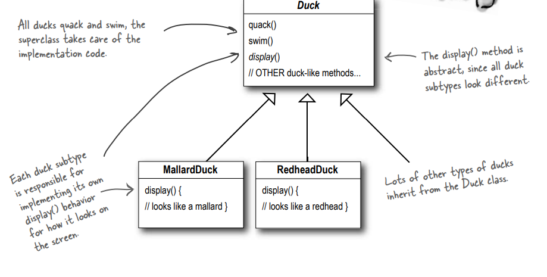

Tüm Duck'lar quack'lar (vakvaklayıp) swim(yüzer), superclass implementasyon koduyla ilgilenir.

Tüm Duck subtype'ları farklı göründüğü için display() methodu abstract olarak tanımlanmıştır.

Her Duck subtype'ı, ekranda nasıl göründüğüne ilişkin kendi display() behavior'unu implemente etmekten sorumludur

Duck sınıfından çok sayıda farklı Duck türü miras alır.

Diğer birçok Duck türü Duck sınıfından inherit edilir

Geçen yıl, şirket rakiplerinin artan baskısı altında kalmıştır. Bir hafta boyunca golf oynayarak beyin fırtınası
yaptıktan sonra şirket yöneticileri büyük bir yenilik yapmanın zamanının geldiğini düşünürler. Gelecek hafta Maui'de
yapılacak hissedarlar toplantısında göstermek için gerçekten etkileyici bir şeye ihtiyaçları vardır.

# But now we need the ducks to FLY

Yöneticiler, uçan Duck'ların simülatörün diğer Duck simülatörü rakiplerini geride bırakması için gereken şey olduğuna
karar verdiler. Ve tabii ki Joe'nun yöneticisi onlara Joe'nun bir hafta içinde bir şeyler hazırlamasının hiç sorun
olmayacağını söyledi. "Ne de olsa" dedi Joe'nun patronu, "o bir OO programcısı... ne kadar zor olabilir ki?"

Joe : Duck sınıfına bir fly() methodu eklemem gerekiyor ve sonra tüm Duck'lar bunu inherit edecekler. Şimdi gerçek OO
dehamı gösterme zamanım geldi.

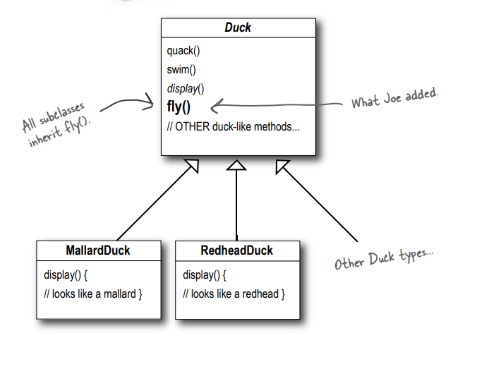

Tüm subclass'lar fly() methodunu inherit alır.

# But something went horribly wrong...

### What happened?

Joe, Duck subclass'larının hepsinin uçmaması gerektiğini fark etmedi. Joe, Duck superclass'ına yeni behaviorlar
eklediğinde, bazı Duck subclass'ları için uygun olmayan behaviorlar da ekliyordu. Şimdi SimUDuck programında uçan cansız
nesneleri var.

Kodda yapılan localized bir güncelleme non-local bir side effect'e (flying rubber ducks (uçan lastik Duckler)) neden
oldu!

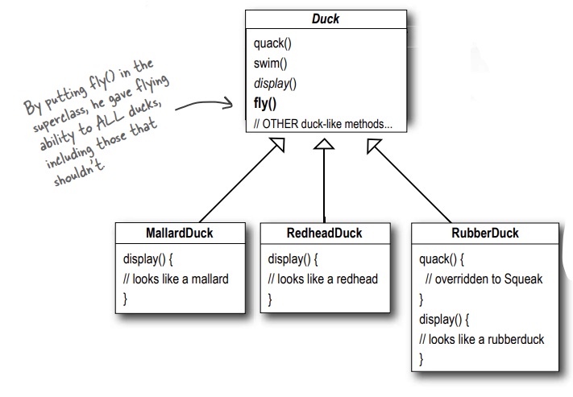

fly() işlevini superclass'a koyarak, uçmaması gerekenler de dahil olmak üzere TÜM Duck'lara uçma yeteneği verdi

Lastik Duck'lar quack'lamaz (vaklamaz), bu nedenle quack() methodu "Squeak" olarak override edilir.

Reuse(Yeniden kullanım) amacıyla inheritance'in harika bir kullanımı olduğunu düşündüğü şey, bakım söz konusu olduğunda
o kadar da iyi sonuç vermedi.

# Joe thinks about inheritance...

Joe : RubberDuck'ta fly() methodunu her zaman override edebilirim, tıpkı quack() methodunda yaptığım gibi...

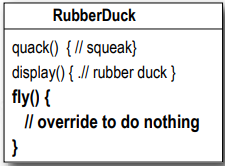

Joe : Ama programa Wooden Decoy Duck'lar eklediğimizde ne olur? Fly(uçmamalı) ya da quack(vakvaklama) yapmamalı

İşte hiyerarşideki bir başka sınıf (DecoyDuck); RubberDuck gibi uçmadığına, vaklamadığına da dikkat edin.

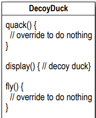

# How about an interface?

Joe, inheritance'in muhtemelen çözüm olmadığını fark etti, çünkü yöneticilerin artık ürünü her altı ayda bir (henüz
karar vermedikleri şekillerde) güncellemek istediklerini söyleyen bir not aldı. Joe, teknik özelliklerin değişmeye devam
edeceğini ve programa eklenen her yeni Duck subclass'ı için fly() ve quack() methodlarına bakmak ve muhtemelen bunları
override etmek zorunda kalacağını biliyor... sonsuza kadar. Bu nedenle, Duck type'larının yalnızca bazılarının (ancak
hepsinin değil) fly (uçmasını) veya quack (vaklamasını) sağlamak için daha temiz bir yola ihtiyacı var.

Duck superclass'ından fly() metodunu çıkarabilir ve fly() metoduna sahip bir Flyable() interface'i oluşturabilirim. Bu
şekilde, yalnızca uçması gereken Duck'lar bu interface'i implement ederler ve bir fly() methoduna sahip olurlar... ve
ayrıca bir Quackable da yapabilirim, çünkü tüm Duck'lar vaklayamaz.

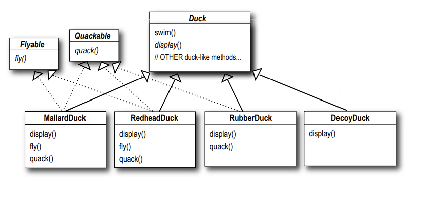

Bu aklına gelen en aptalca fikir. "Duplicate code" diyebilir misiniz? Birkaç methodu override etmenin kötü olduğunu
düşünüyorsanız, uçan Duck subclass'larının 48'inde de uçma behaviour'unda küçük bir değişiklik yapmanız gerektiğinde
nasıl hissedeceksiniz?

# What would you do if you were Joe?

Tüm alt sınıfların flying veya quacking behavior'una sahip olmaması gerektiğini biliyoruz, bu nedenle inheritance doğru
cevap değildir.

Ancak subclass'ların Flyable ve/veya Quackable implementasyonuna sahip olması sorunun bir kısmını çözse de (
uygunsuz şekilde uçan RubberDucks'lar olmaması), bu behavior'lar için kodun yeniden kullanımını tamamen yok eder, bu
nedenle sadece farklı bir bakım kabusu yaratır. Ve tabii ki flying Duck'lar arasında bile birden fazla fly behavior'u
olabilir...

Bu noktada bir Tasarım Deseninin beyaz bir ata binerek gelip günü kurtarmasını bekliyor olabilirsiniz. Ama bu ne kadar
eğlenceli olurdu ki? Hayır, eski usul bir çözüm bulacağız - iyi OO software design principle uygulayarak.

Yazılımı değiştirmemiz gerektiğinde, bunu mevcut kod üzerinde mümkün olan en az etkiyle yapabileceğimiz bir yazılım
oluşturmanın bir yolu olsaydı rüya gibi olmaz mıydı? Kodu yeniden işlemek için daha az zaman harcayıp programın daha
havalı şeyler yapmasını sağlayabilirdik...

# The one constant in software development

Peki, yazılım geliştirmede her zaman güvenebileceğiniz tek şey nedir? Nerede çalışırsanız çalışın, ne inşa ederseniz
edin veya hangi dilde programlama yaparsanız yapın, her zaman sizinle birlikte olacak tek gerçek constant (sabit) nedir?

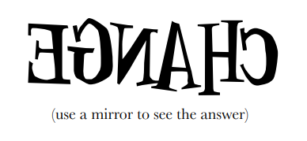

Bir uygulamayı ne kadar iyi tasarlarsanız tasarlayın, zaman içinde bir uygulama büyümeli ve değişmelidir, aksi takdirde
ölür.

# Zeroing in on the problem...

Dolayısıyla, Duck behavior'u subclass'lar arasında değişmeye devam ettiğinden ve tüm subclass'ların bu behavior'lara
sahip olması uygun olmadığından, inheritance kullanmanın çok iyi sonuç vermediğini biliyoruz. Flyable ve Quackable
interface'i ilk başta kulağa umut verici geliyordu - sadece gerçekten uçan Duck'lar Flyable vb. olacak - ancak Java
interface'lerinin implementasyon kodu yoktur, bu nedenle kodun reuse'u yoktur. Bu da bir behavior'u değiştirmeniz
gerektiğinde, o behavior'un tanımlandığı tüm farklı subclass'ları takip etmek ve değiştirmek zorunda kalacağınız ve
muhtemelen yol boyunca yeni hatalar ortaya çıkaracağınız anlamına gelir! Neyse ki, tam da bu durum için bir tasarım
ilkesi vardır.

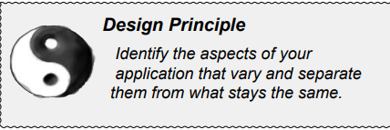

Design Principle : Uygulamanızın değişen yönlerini belirleyin ve bunları aynı kalanlardan ayırın.

Başka bir deyişle, kodunuzun her yeni gereksinimde değişen bir yönü varsa, o zaman çıkarılması ve değişmeyen tüm
şeylerden ayrılması gereken bir behavior'unuz olduğunu bilirsiniz.

Bu principle hakkında düşünmenin başka bir yolu da şudur: Değişen parçaları alın ve bunları encapsulate edin, böylece
daha sonra değişmeyenleri etkilemeden değişen parçaları değiştirebilir veya genişletebilirsiniz.

Bu kavram ne kadar basit olursa olsun, hemen hemen her tasarım modelinin temelini oluşturur. Tüm kalıplar, bir sistemin
bazı parçalarının diğer tüm parçalardan bağımsız olarak değişmesine izin vermenin bir yolunu sağlar. Tamam, Duck
behavior'unu Duck sınıflarından çıkarma zamanı!

Değişenleri alın ve kodunuzun geri kalanını etkilemeyecek şekilde "encapsulate edin". Sonuç mu? Kod değişikliklerinden
kaynaklanan daha az istenmeyen sonuç ve sistemlerinizde daha fazla esneklik!

# Separating what changes from what stays the same

Nereden başlayacağız? Söyleyebildiğimiz kadarıyla, fly() ve quack() ile ilgili sorunlar dışında, Duck sınıfı iyi
çalışıyor ve sık sık değişen veya değişen başka bir parçası yok. Dolayısıyla, birkaç küçük değişiklik dışında, Duck
sınıfını hemen hemen kendi haline bırakacağız.

Şimdi, "değişen parçaları aynı kalanlardan" ayırmak için, biri fly diğeri quack için olmak üzere iki sınıf kümesi
oluşturacağız (Duck'tan tamamen ayrı). Her sınıf kümesi kendi behavior'larının tüm implementasyonlarını tutacaktır.
Örneğin, quacking (vaklamayı) implement eden bir sınıfımız, squeaking uygulayan başka bir sınıfımız ve silence uygulayan
başka bir sınıfımız olabilir.

Fly() ve quack() işlevlerinin Duck sınıfının Duck'lar arasında farklılık gösteren kısımları olduğunu biliyoruz.

Bu behavior'ları Duck sınıfından ayırmak için, her iki methodu da Duck sınıfından çıkaracağız ve her behavior'u temsil
etmek için yeni bir sınıf kümesi oluşturacağız.

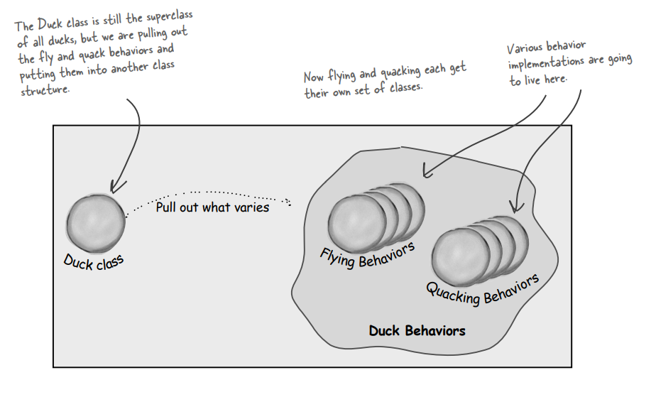

Duck sınıfı hala tüm Duck'ların superclass'ıdır, ancak fly ve quack behavior'larını çıkarıyoruz ve bunları başka bir
sınıf yapısına koyuyoruz.

Şimdi flying ve quacking her biri kendi sınıflarına sahip. Çeşitli behavior implementasyonları burada yaşayacak

# Designing the Duck Behaviors

Peki, fly ve quack behavior'larını implemente eden sınıflar kümesini nasıl tasarlayacağız?

Her şeyi esnek tutmak istiyoruz; ne de olsa en başta başımızı belaya sokan şey Duck behavior'larında ki esneklikti. Ve
Duck instance'larına behavior'lar atamak istediğimizi biliyoruz. Örneğin, yeni bir MallardDuck instance'i oluşturmak ve
onu belirli türde bir fly behavior'u ile başlatmak isteyebiliriz. Hazır bu noktaya gelmişken, neden bir Duck'ın
behavior'unu dinamik olarak değiştirebileceğimizden emin olmayalım? Başka bir deyişle, Duck sınıflarına behavior setter
methodları eklemeliyiz, böylece örneğin MallardDuck'ın flying behavior'unu runtime'da değiştirebiliriz. Bu
hedefleri göz önünde bulundurarak ikinci tasarım ilkemize bakalım:

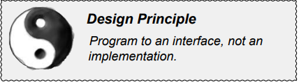

Design Principle : Bir interface'i programlayın, bir implementasyonu değil.

Her behavior'u temsil etmek için bir interface kullanacağız - örneğin, FlyBehavior ve QuackBehavior - ve bir behavior'un
her implementasyonu bu interface'lerden birini implement edecek.

Bu yüzden bu sefer Duck sınıfları flying ve quacking interface'lerini implement etmeyecek. Bunun yerine, tüm yaşam
nedeni bir behavior'u (örneğin, "squeaking") temsil etmek olan bir dizi sınıf oluşturacağız ve behavior interface'ini
implement edecek olan Duck sınıfı yerine behavior sınıfı olacak.

Bu, daha önce yaptığımız şekle zıt bir yaklaşımdır, burada bir behavior ya superclass Duck'taki concrete bir
implementasyondan geliyordu veya subclass kendisi özelleştirilmiş bir implementasyonu sağlıyordu. Her iki durumda da
bir implementasyona güveniyorduk. O belirli implementasyonu kullanmaya kilitlenmiştik ve behavior'u değiştirmek için yer
yoktu (daha fazla kod yazmadıkça).

Yeni tasarımımızla, Duck subclass'ları bir interface (FlyBehavior ve QuackBehavior) tarafından temsil edilen bir
behavior'u kullanacak, böylece behavior'un gerçek implementasyonu (başka bir deyişle, FlyBehavior veya QuackBehavior'u
implemente eden sınıfta kodlanan belirli concrete behavior) Duck subclass'ına kilitlenmeyecektir.

Şu andan itibaren, Duck behavior'ları ayrı bir sınıfta yaşayacak - belirli bir behavior interface'ini implement eden bir
sınıf. Bu şekilde, Duck sınıflarının kendi behavior'ları için herhangi bir implementasyon detayını bilmeleri
gerekmeyecek.


Question : FlyBehavior için neden bir interface kullanmanız gerektiğini anlamıyorum. Aynı şeyi abstract bir superclass
ile yapabilirsiniz. Nihai amaç polymorphism kullanmak değil mi?

"Program to an interface" gerçekte "Program to a supertype" anlamına gelir.

Interface kelimesi burada overloaded edilmiştir. Interface concept'i vardır, ancak aynı zamanda Java interface construct
da vardır. Aslında bir Java interface'i kullanmak zorunda kalmadan bir interface'e göre programlama yapabilirsiniz.
Önemli olan, bir supertype programlama yaparak polymorphism'den yararlanmaktır, böylece gerçek runtime object
koda kilitlenmez.

"program to a supertype (Bir supertype'a göre programlama)" ifadesini "variable'ların bildirilen type'ı bir supertype,
genellikle abstract bir sınıf veya interface olmalıdır, böylece bu variable'lara atanan object'ler supertype'ın herhangi
bir concrete implementasyonundan olabilir, bu da onları bildiren sınıfın gerçek object type'larını bilmek zorunda
olmadığı anlamına gelir!" şeklinde yeniden ifade edebiliriz.

Bu muhtemelen sizin için eski bir haberdir, ancak hepimizin aynı şeyi söylediğinden emin olmak için, polymorphic bir tür
kullanmanın basit bir örneğini verelim - Dog ve Cat olmak üzere iki concrete implementasyonu olan abstract bir Animal
sınıfı düşünün.

--**"Programming to an implementation" şu şekilde olurdu:**--

```
Dog d = new Dog();
d.bark();
```

"d" değişkenini Dog (Animal'ın concrete bir implementasyonu) tipi olarak bildirmek bizi concrete bir implementasyona kod
yazmaya zorlar.

--**"Programming to an interface/supertype" şu şekilde olurdu:**--

```
Animal animal = new Dog();
animal.makeSound();
```

Bunun bir Dog olduğunu biliyoruz, ancak artık Animal referansını polymorphic olarak kullanabiliriz

Daha da iyisi, subtype'ın instantiation'ını (new Dog() gibi) koda sabit kodlamak yerine, "assign the concrete
implementation object at runtime (concrete implementasyon nesnesini runtime'da atayın)"

```
a = getAnimal();
a.makeSound(); 
```

Gerçek Animal subtype'ının NE olduğunu bilmiyoruz... tek önemsediğimiz makeSound() methoduna nasıl yanıt vereceğini
bilmesi.

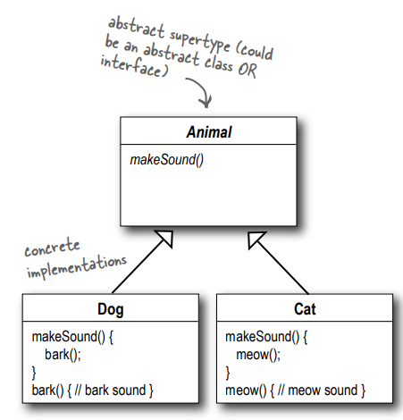

Abstract supertype (abstract bir sınıf VEYA interface olabilir)

Dog ve Cat concrete implementasyonlar

# Implementing the Duck Behaviors

Burada FlyBehavior ve QuackBehavior olmak üzere iki interface ve her bir concrete behavior'ı implement eden ilgili
sınıflar bulunmaktadır:

FlyBehavior interface'i;

```
public interface FlyBehavior {
    void fly();
}
```

QuackBehavior interface'i;

```
public interface QuackBehavior {
    void quack();
}
```

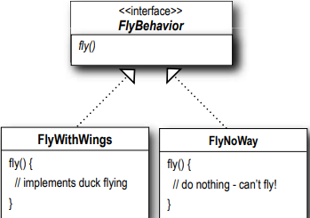

FlyBehavior, tüm flying sınıfların implemente ettiği bir interface'dir. Tüm yeni flying sınıfların sadece fly metodunu
implement etmesi gerekir

**FlyWithWings** : İşte kanatları olan tüm Duck'ların flying implementasyonu:

```
public class FlyWithWings implements FlyBehavior{
    @Override
    public void fly() {
        System.out.println("i am flying");
    }
}

```

**FlyNoWay** : Ve işte uçamayan tüm Duck'ların implementasyonu:

```
public class FlyNoWay implements FlyBehavior{
    @Override
    public void fly() {
        System.out.println("i am not flying");
    }
}
```

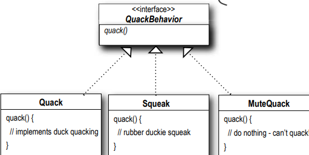

QuackBehavior'u için de aynı şey geçerli; sadece implementasyonu gereken bir quack() methodu içeren bir interface'imiz
var.

```
public interface QuackBehavior {
    void quack();
}
```

**Quack** - Gerçekten quack(öten)

```
public class Quack implements QuackBehavior{
    @Override
    public void quack() {
        System.out.println("Quack");
    }
}

```

**Squeak** - Ses çıkaran quack (ötme)

```
public class Squeak implements QuackBehavior{
    @Override
    public void quack() {
        System.out.println("Squeak");
    }
}
```

**MuteQuack** - Hiç ses çıkarmayan quack(ötme)

```
public class MuteQuack implements QuackBehavior{
    @Override
    public void quack() {
        System.out.println("<Silence>");
    }
}
```

Bu tasarımla, diğer nesne türleri fly ve quack behavior'larımızı yeniden kullanabilir çünkü bu behavior'lar artık Duck
sınıflarımızda saklı değildir!

Ve mevcut behavior sınıflarımızdan herhangi birini değiştirmeden ya da mevcut behavior'ları kullanan Duck sınıflarından
herhangi birine dokunmadan yeni behavior'lar ekleyebiliriz.

Böylece, inheritance ile birlikte gelen tüm yükler olmadan REUSE'un avantajını elde ediyoruz

--**DIALOGS**--

Q : Her zaman önce uygulamamı implemente etmem, işlerin nerede değiştiğini görmem ve sonra geri dönüp bu şeyleri ayırmam
ve encapsule etmem mi gerekiyor?

A : Her zaman değil; genellikle bir uygulama tasarlarken, değişiklik gösterecek alanları önceden tahmin eder ve ardından
kodunuza bu durumla başa çıkabilecek esnekliği eklersiniz. Bu principles ve pattern'lerin geliştirme lifecycle'ının her
aşamasında uygulanabileceğini göreceksiniz.

Q : Duck sınıfını da bir interface mi yapmalıyız?

A : Bu durumda değil. Her şeyi birbirine bağladığımızda göreceğiniz gibi, Duck'ın bir interface olmaması ve MallardDuck
gibi belirli ördeklerin ortak özellikleri ve methodları inherit alması bize fayda sağlıyor. Artık Duck inheritance'ından
farklı olanları kaldırdığımıza göre, bu yapının avantajlarını sorunsuz bir şekilde elde ediyoruz.

Q : Sadece bir behavior olan bir sınıfa sahip olmak biraz garip hissettiriyor. Sınıfların bir şeyleri temsil etmesi
gerekmiyor mu? Sınıfların hem state hem de behavior'lara sahip olması gerekmez mi?

A : Bir OO sisteminde, evet, sınıflar genellikle hem state'leri (instance variables) hem de methodları olan şeyleri
temsil eder. Ve bu durumda, bu şey bir behavior olmaktadır. Ancak bir behavior bile hala state ve methodlara sahip
olabilir; bir flybehavior, flying behavior'unun niteliklerini temsil eden instance variables'lara sahip olabilir (
dakikadaki kanat vuruşları, maksimum irtifa ve hız, vb.)

--**Sharpen your pencil**--

Q : Yeni tasarımımızı kullanarak, SimUDuck uygulamasına roket gücüyle uçuş eklemek isteseydiniz ne yapardınız?

A : FlyBehavior interface'ini implement eden bir FlyRocketPowered sınıfı oluşturun.

Q : Duck olmayan ama Quack (Vak Vak) behavior'unu kullanmak isteyebilecek bir sınıf düşünebiliyor musunuz?

A : Bir örnek, bir Duck çağrısı (Duck sesi çıkaran bir cihaz).

# Integrating the Duck Behavior

Önemli olan, Duck sınıfında (veya subclass'larında) tanımlanan flying ve quacking methodlarını kullanmak yerine, Duck'ın
artık quacking ve flying behavior'unu delegate olarak kullanacak olmasıdır.

İşte nasıl yapılacağı:

1 - İlk olarak Duck sınıfına flyBehavior ve quackBehavior adında iki instance variable ekleyeceğiz, bunlar interface
tipi olarak bildirilir (concrete bir sınıf implementasyon tipi değil). Her Duck nesnesi, runtime'da istediği belirli
behavior türüne (FlyWithWings, Squeak, vb.) başvurmak için bu variable'ları polymorphic olarak ayarlayacaktır.

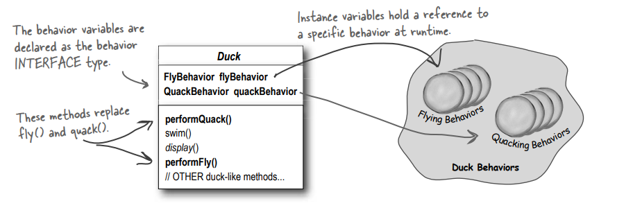

Bu behavior'u FlyBehavior ve QuackBehavior sınıflarına taşıdığımız için Duck sınıfından (ve tüm subclass'lardan) fly()
ve quack() methodlarını da kaldıracağız.

Duck sınıfındaki fly() ve quack() methodlarını performFly() ve performQuack() adlı iki benzer methodla değiştireceğiz;
nasıl çalıştıklarını daha sonra göreceksiniz.

Behavior variable'ları behavior INTERFACE tipi olarak declare edilir.

fly ve quack methodları yerine performQuack() ve performFly() methodları eklenir

Instance variable'lar runtime'da belirli bir behavior'a referans tutar.

2 - performQuack'i implemente edelim:

```
public class Duck {
    /* Her Duck, QuackBehavior interface'ini implemente eden bir şeye referansa sahiptir. */
    QuackBehavior quackBehavior;
    
    public void performQuack() {
        /* Duck nesnesi, quack behavior'unu kendi başına ele almak yerine, bu behavior'u quackBehavior tarafından 
        başvurulan nesneye devreder */
        quackBehavior.quack();
    }
}
```

Oldukça basit, değil mi? Duck quack (vakvaklamayı) gerçekleştirmek için, quackBehavior tarafından referans verilen
nesnenin kendisi için quack (vakvaklamasına) izin verir. Kodun bu kısmında nesnenin ne tür bir nesne olduğu umurumuzda
değil, tek umurumuzda olan nasıl quack() (vaklayacağını) bilmesi!

# More Integration

3 - Tamam, flyBehavior ve quackBehavior instance variable'larının nasıl ayarlandığı konusunda endişelenme zamanı.
MallardDuck sınıfına bir göz atalım:

```
public class MallardDuck extends Duck {
    public MallardDuck() {
        /* Bir MallardDuck quack (vaklamasını) handle etmek için Quack sınıfını kullanır, bu nedenle performQuack 
        çağrıldığında quack (vaklamanın) sorumluluğu Quack nesnesine devredilir ve gerçek bir quack (vaklama) elde 
        ederiz. */
        quackBehavior = new Quack();
        flyBehavior = new FlyWithWings();
    }
    
    public void display() {
        System.out.println(“I’m a real Mallard duck”);
    }
}
```

Bir MallardDuck, quack (vakvaklama) işlemini ele almak için Quack sınıfını kullanır. Bu nedenle performQuack
çağrıldığında, quack (vakvaklama) sorumluluğu Quack nesnesine devredilir ve gerçek bir quack (vakvaklama) elde edilir.

Ve FlyWithWings'ı FlyBehavior type olarak kullanır.

Unutmayın, MallardDuck sınıfı quackBehavior ve flyBehavior instance variables'larını Duck sınıfından miras alır.

Yani MallardDuck'ın quack (vaklaması) gerçek bir Duck quack (vaklamasıdır), squeak ya da mute bir quack (vaklama)
değildir. Peki burada ne oluyor? Bir MallardDuck instantiated edildiğinde, constructor'ı MallardDuck'ın inheritance
alınan quackBehavior instance variable'i Quack türünde (QuackBehavior concrete implementasyon sınıfı) yeni bir
instance başlatır.

Aynı durum Duck'ın flying behavior'u için de geçerlidir: MallardDuck'ın constructor'ı flyBehavior instance variable'i
FlyWithWings (bir FlyBehavior concrete implementasyon sınıfı) türünde bir instance'la başlatır.

Bir saniye, bir implementasyona göre programlamamamız gerektiğini söylememiş miydiniz? Ama bu constructor da ne
yapıyoruz? Concrete bir Quack implementasyon sınıfının yeni bir instance'ini oluşturuyoruz!

İyi yakaladınız, tam olarak şu anda yapmakta olduğumuz bu...

Kitabın ilerleyen bölümlerinde araç kutumuzda bunu düzeltmemize yardımcı olabilecek daha fazla tasarım deseni olacak.

Yine de, behavior'ları concrete sınıflara ayarlarken (Quack veya FlyWithWings gibi bir behavior sınıfını instantiating
ederek ve behavior'u referans değişkenimize atayarak), bunu runtime'da kolayca değiştirebileceğimize dikkat edin.

Yani, burada hala çok fazla esnekliğe sahibiz, ancak instance variables'ları esnek bir şekilde başlatma konusunda zayıf
bir iş yapıyoruz. Ama bir düşünün, quackBehavior instance variable'i bir interface tipi olduğundan, (polymorphism'in
büyüsü sayesinde) runtime'da dinamik olarak farklı bir QuackBehavior implementasyon sınıfı atayabiliriz

Bir an durun ve behavior'un runtime'da değişebilmesi için bir Duck'ı nasıl implement edeceğinizi düşünün. (Bunu yapan
kodu birkaç sayfa sonra göreceksiniz).

1 - Aşağıdaki Duck sınıfını yazın:

```
public abstract class Duck {
    
    /* İki referans variable'i declare ediyoruz behavior interface tipleri için. Bütün Duck alt sınıfları 
    (aynı paket içinde) bunları miras alır. */ 
    
    FlyBehavior flyBehavior;
    QuackBehavior quackBehavior;

    public Duck() {
    }

    public abstract void display();

    public void performFly(){
        flyBehavior.fly();
    }

    public void performQuack(){
        quackBehavior.quack();
    }

    public void swim(){
        System.out.println("all ducks float, even decoys!");
    }
}
```

2 - FlyBehavior interface'ini ve iki behavior implementasyon sınıfını (FlyWithWings ve FlyNoWay) yazın ve derleyin.

```
/* Tüm flying behavior sınıflarının implement ettiği arayüz */
public interface FlyBehavior {
    void fly();
}
```

```
/* Uçan Duck'lar için fly behavior implementasyonu... */
public class FlyWithWings implements FlyBehavior{
    @Override
    public void fly() {
        System.out.println("i am flying");
    }
}
```

```
/* Uçmayan Duck'lar için fly behavior implementasyonu (Rubber Ducks ve Decoy Ducks gibi). */
public class FlyNoWay implements FlyBehavior{
    @Override
    public void fly() {
        System.out.println("i am not flying");
    }
}
```

# Testing the Duck code continued...

3 - QuackBehavior interface'ini ve üç behavior implementasyon sınıfını (Quack, MuteQuack ve Squeak) yazın ve derleyin.

```
public interface QuackBehavior {
    void quack();
}
```

```
public class Quack implements QuackBehavior{
    @Override
    public void quack() {
        System.out.println("Quack");
    }
}
```

```
public class MuteQuack implements QuackBehavior{
    @Override
    public void quack() {
        System.out.println("<Silence>");
    }
}
```

```
public class Squeak implements QuackBehavior{
    @Override
    public void quack() {
        System.out.println("Squeak");
    }
}
```

4 - MallardDuck class'ını yaz:

```
public class MallardDuck extends Duck{

    /* Tabii, MallardDuck sınıfı, quackBehavior ve flyBehavior instance variable'larını Duck sınıfından miras alır.*/

    public MallardDuck() {
        quackBehavior = new Quack();
        flyBehavior = new FlyWithWings();
    }

    @Override
    public void display() {
        System.out.println("I am real Mallard Duck");
    }
}
```

5 - Test class'ını yaz ve çalıştır:

```
public class MiniDuckSimulator {
    public static void main(String[] args) {
        Duck mallardDuck = new MallardDuck();
        
        /* Bu, MallardDuck'ın miras alınan performQuack() methodunu çağırır, bu da nesnenin QuackBehavior'ına 
        delege eder (yani Duck'ın inheritance alınan quackBehavior referansı üzerinde quack() methodunu çağırır). 
        Ardından aynı şeyi MallardDuck'ın inheritance alınan performFly() methodu için de yaparız. */
        mallardDuck.performFly();
        mallardDuck.performQuack();
    }
}
```

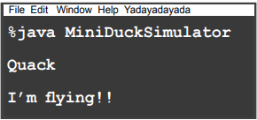

# Setting behavior dynamically

Duck'larımız da tüm bu dinamik yeteneklere sahip olup da bunları kullanamamak ne kadar yazık! Duck'ın behavior türünü,
Duck'ın constructor'ında instantiating etmek yerine Duck subclass'ında ki bir setter methodu aracılığıyla ayarlamak
istediğinizi düşünün.

1 - Duck class'ına 2 setter method ekleyelim:

```
public void setFlyBehavior(FlyBehavior fb){
    this.flyBehavior = fb;
}

public void setQuackBehavior(QuackBehavior qb){
    this.quackBehavior = qb;
}
```

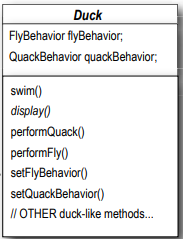

Bir Duck'ın behavior'unu anında değiştirmek istediğimiz zaman bu methodları çağırabiliriz.

2 - Yeni bir Duck type'ı yazalım (ModelDuck class'ı)

```
public class ModelDuck extends Duck{

    public ModelDuck() {
        /* ModelDuck hayata yere çakılmış olarak başlıyor... fly için bir yolu olmadan. */
        flyBehavior = new FlyNoWay();
        quackBehavior = new Quack();
    }

    @Override
    public void display() {
        System.out.println("i am a model duck");
    }
}
```

3 - Yeni bir FlyBehavior type'ı tanımlayalım

```
/* Sorun değil, roketle çalışan bir flying behavior yaratıyoruz. */
public class FlyRocketPowered implements FlyBehavior{
    @Override
    public void fly() {
        System.out.println("I am flying with a rocket");
    }
}
```

4 - ModelDuckTest isimli test class'ını create et

```
public class ModelDuckTest {
    public static void main(String[] args) {
        Duck modelDuck = new ModelDuck();

        /* performFly() methoduna yapılan ilk çağrı, bir FlyNoWay instance2i olan ModelDuck'ın constructor'ında 
        ayarlanan flyBehavior nesnesine delege eder. */
        modelDuck.performFly();
        modelDuck.performQuack();
        
        /* Bu, modelin inheritance alınan behavior setter methodunu çağırır ve...işte! Model aniden roket gücüyle flying 
        yeteneğine sahip oldu! */
        modelDuck.setFlyBehavior(new FlyRocketPowered());
        modelDuck.performFly();

        /* Eğer işe yararsa, ModelDuck dinamik olarak fly behavior'unu değiştirdi! Eğer implementasyon Duck sınıfının 
        içinde bulunuyorsa BUNU yapamazsınız.*/
    }
}
```

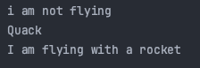

Bir Duck'ın behavior'unu runtime'da değiştirmek için, Duck'ın o behavior'a yönelik setter methodunu çağırmanız
yeterlidir.

# The Big Picture on encapsulated behaviors

Tamam, Duck simülatörünün tasarımını derinlemesine incelediğimize göre, şimdi tekrar havalanmanın ve büyük resme
bakmanın zamanı geldi.

Aşağıda elden geçirilmiş sınıf yapısının tamamı yer almaktadır. Beklediğiniz her şeye sahibiz: Duck'ı extend eden
Duck'lar, FlyBehavior'ı implement eden fly behavior'ları ve QuackBehavior'ı implemente eden quack behavior'ları.

Olayları biraz daha farklı tanımlamaya başladığımıza da dikkat edin. Duck behavior'larını bir dizi behavior olarak
düşünmek yerine, bunları bir algoritma ailesi olarak düşünmeye başlayacağız. Bir düşünün: SimUDuck tasarımında,
algoritmalar bir Duck'ın yapacağı şeyleri temsil eder (vaklamanın veya kanat çırpmanın farklı yolları), ancak aynı
teknikleri farklı eyaletlere göre eyalet satış vergisini hesaplama yollarını uygulayan bir dizi sınıf için de kolayca
kullanabiliriz.

Sınıflar arasındaki ilişkilere dikkat edin. Aslında, kaleminizi alın ve sınıf diyagramındaki her okun üzerine uygun
ilişkiyi (IS-A, HAS-A ve IMPLEMENTS) yazın.

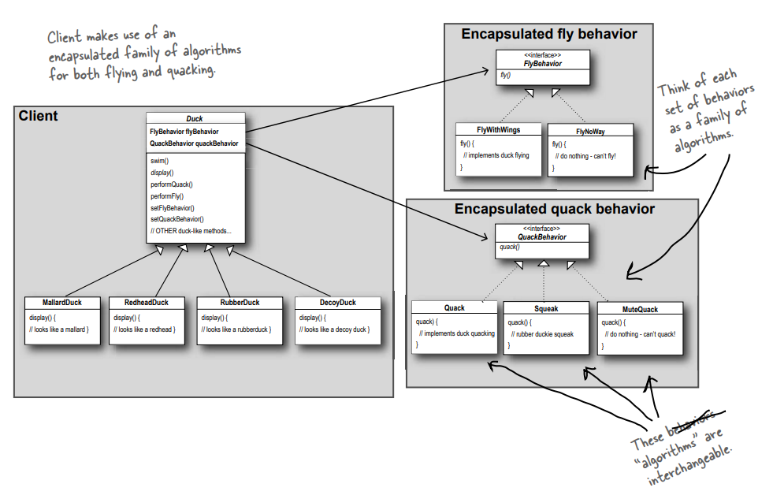

Client, hem flying hem de quacking için encapsulated bir algoritma ailesinden yararlanır.

Her bir behavior kümesini bir algoritma ailesi olarak düşünün.

Bu "algoritmalar" birbirinin yerine kullanılabilir

# HAS-A can be better than IS-A

HAS-A ilişkisi ilginç bir ilişkidir: her Duck'ın bir FlyBehavior ve bir QuackBehavior'ı vardır ve bu Duck'lara flying ve
quacking delege eder.

İki sınıfı bu şekilde bir araya getirdiğinizde **COMPOSITION** kullanmış olursunuz. Duck'lar, behavior'larını
inheritance almak yerine, doğru behavior nesnesiyle composed ederek behavior'larını alırlar.

Bu önemli bir tekniktir; aslında üçüncü tasarım ilkemizi kullanıyoruz:

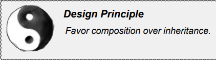

**Inheritance yerine composition'ı tercih edin**

Gördüğünüz gibi, composition kullanarak sistemler oluşturmak size çok daha fazla esneklik sağlar. Sadece bir algoritma
ailesini kendi sınıfları içinde encapsulate etmenize izin vermekle kalmaz, aynı zamanda oluşturduğunuz nesne doğru
behavior interface'ini implement ettiği sürece runtime'da behavior'ı değiştirmenize de izin verir.

Composition birçok design pattern'de kullanılır ve kitap boyunca avantajları ve dezavantajları hakkında çok daha fazla
şey göreceksiniz.

--**DIALOGS**--

Master : Bana Object Oriented (nesne yönelimli yaklaşım) hakkında ne öğrendiğini anlat.

Student : öğrendiğime göre nesne yönelimli yaklaşımın vaadi, reuse'dur

Master : Devam et...

Student : Inheritance yoluyla, tüm iyi şeyler yeniden kullanılabilir ve böylece geliştirme süresini adeta ormandaki
bambuyu keser gibi büyük ölçüde kısaltacağız.

Master : Geliştirme tamamlandıktan önce mi yoksa sonra mı daha fazla zaman kodla geçirilir?

Student : geliştirmenin ardından gelir. Her zaman yazılımı sürdürmeye ve değiştirmeye başlangıçta geliştirmekten daha
fazla zaman harcarız.

Master : çaba önce reuse'a mı yoksa sürdürülebilirliğe ve genişletilebilirliğe mi yönlendirilmeli?

Student : Bunda doğruluk payı olduğuna inanıyorum.

Master : Görüyorum ki hala öğrenmen gereken çok şey var. Inheritance konusunu daha fazla düşünmeni istiyorum. Gördüğün
gibi, inheritance'in kendine özgü sorunları var ve reuse'u sağlamanın başka yolları da bulunuyor.

Az önce ilk tasarım deseninizi uyguladınız - STRATEGY deseni. Doğru, SimUDuck uygulamasını yeniden düzenlemek için
Strategy Kalıbını kullandınız. Bu kalıp sayesinde simülatör, yöneticilerin Vegas'a yapacakları bir sonraki iş gezisinde
hazırlayabilecekleri her türlü değişikliğe hazır hale geldi.

**Strategy Kalıbı bir algoritma ailesi tanımlar, her birini encapsule eder ve değiştirilebilir hale getirir. Strategy,
algoritmanın onu kullanan client'lardan bağımsız olarak değişmesini sağlar.**

# Overhead at the local diner...

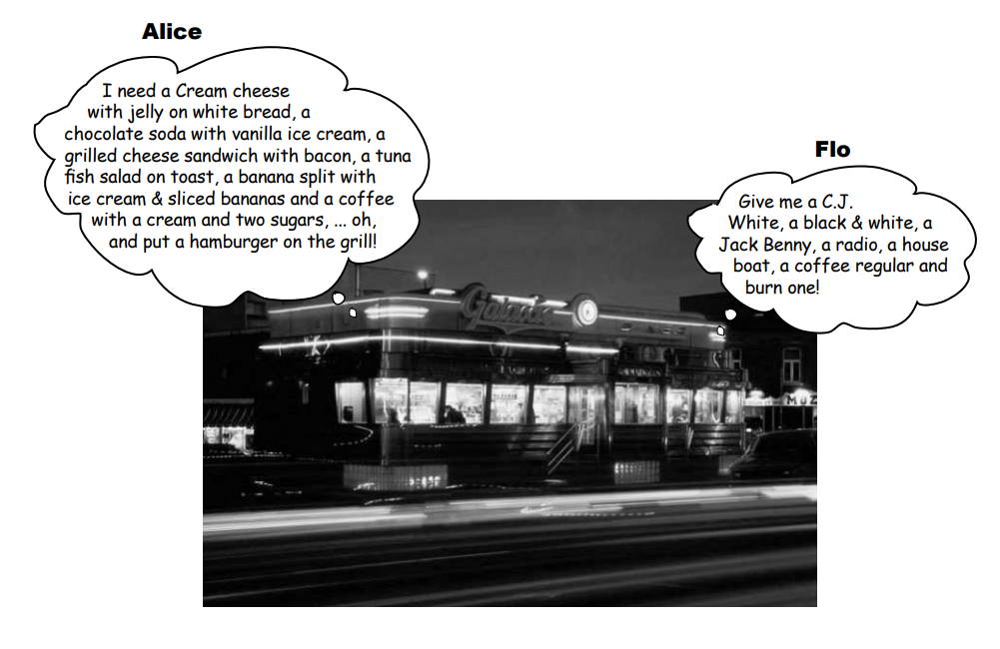

Alice : Beyaz ekmek üzerine jöleli krem peynir, vanilyalı dondurma ile çikolatalı soda, pastırmalı ızgara peynirli
sandviç, kızarmış ekmek üzerine ton balıklı salata, dondurma ve dilimlenmiş muz ile muzlu börek ve bir krema ve iki
şekerli bir kahveye ihtiyacım var... oh, ve ızgaraya bir hamburger koyun!

Flo : Bana bir C.J. White, bir siyah-beyaz, bir Jack Benny, bir radyo, bir ev teknesi, bir normal kahve verin ve bir
tane yakın!

Bu iki sipariş arasındaki fark nedir? Hiçbir şey! Alice'in iki kat fazla kelime kullanması ve huysuz bir aşçının sabrını
zorlaması dışında ikisi de aynı sipariş.

Flo'da olup da Alice'te olmayan ne var? Aşçıyla ortak bir kelime dağarcığı. Bu sadece aşçıyla iletişim kurmayı
kolaylaştırmakla kalmıyor, aynı zamanda aşçıya hatırlaması gereken daha az şey veriyor çünkü kafasında tüm lokanta
kalıpları var.

Tasarım Kalıpları size diğer geliştiricilerle ortak bir kelime dağarcığı sağlar. Bu kelime dağarcığına sahip olduğunuzda
diğer geliştiricilerle daha kolay iletişim kurabilir ve kalıpları bilmeyenlere öğrenmeye başlamaları için ilham
verebilirsiniz. Ayrıca, mimariler hakkındaki düşüncelerinizi de geliştirir ve nesne seviyesinde değil, kalıp seviyesinde
düşünmenizi sağlar.

# Tools for your Design Toolbox

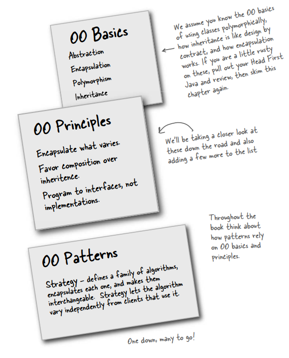

### OO Basics

Abstraction
Encapsulation
Polymorphism
Inheritance

### OO Principles

* Değişenleri encapsulate edin

* Inheritance yerine Composition'ı tercih edin.

* Program to interfaces, not implementations

--**BULLET POINTS**--

* Temel OO bilgisi sizi iyi bir OO tasarımcısı yapmaz.
* İyi OO tasarımlar, reusable, extensible (genişletilebilir) ve maintainable (bakımı kolaydır) olmalıdır
* Pattern'ler, iyi OO tasarım özellikleri olan sistemleri nasıl oluşturacağınızı gösterir.
* Pattern'ler, kanıtlanmış OO deneyimi temsil eder.
* Pattern'ler size kod vermez, tasarım sorunlarına genel çözümler sunar. Bu çözümleri spesifik uygulamanıza
  uygularsınız.
* Pattern'ler icat edilmez, keşfedilir.
* Çoğu pattern ve principle, yazılımdaki değişim sorunlarını ele alır.
* Çoğu pattern, bir sistemin bir bölümünün tüm diğer bölümlerden bağımsız olarak değişmesine izin verir.
* Sistem içinde değişen kısımları alıp bunları encapsule etmeye çalışırız.
* Pattern'ler, diğer geliştiricilerle iletişiminizin değerini en üst düzeye çıkarabilen paylaşılan bir dil sağlar.

