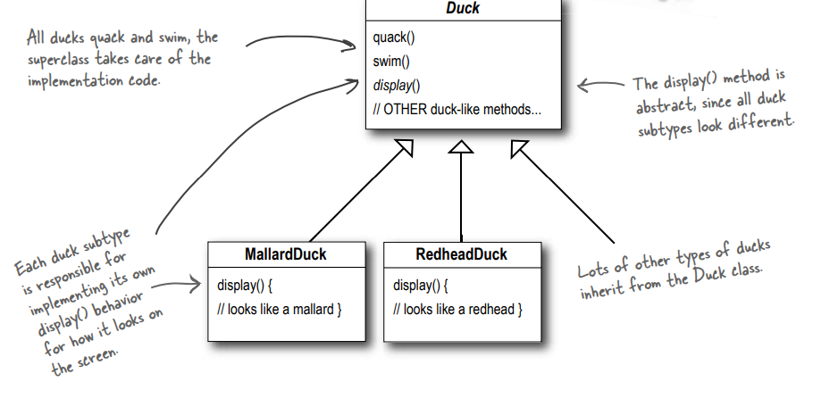
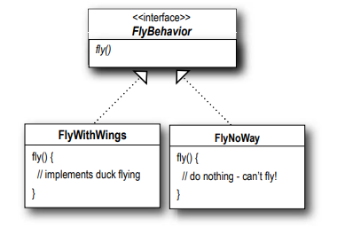

# It started with a simple SimUDuck app

Joe, son derece başarılı bir Duck göleti simülasyon oyunu olan "SimUDuck" adlı bir şirkette çalışıyor. Oyun, çeşitli
Duck türlerini yüzmelerini ve ötmelerini yaparak gösterebiliyor. Sistemin ilk tasarımcıları, standart Nesne Yönelimli
teknikleri kullandı ve diğer tüm Duck türlerinin miras aldığı tek bir Duck üst sınıfı oluşturdular.



Tüm Duck'lar quack (öter) ve swim (yüzer), üst sınıf bu implementation kodunu halleder.

display() methodu abstract olarak tanımlanmıştır, çünkü tüm Duck alt türleri farklı görünüme sahiptir.

Her Duck alt türü, ekranda nasıl göründüğü için kendi display() behavior'ını implementasyonuktan sorumludur.

Duck sınıfından çok sayıda farklı Duck türü miras alır.

Son bir yılda, şirket rakiplerden gelen artan baskı altında kalmıştır. Şirket yöneticileri büyük bir yenilik yapmanın
zamanının geldiğini düşünüyorlar. Gelecek hafta Maui'de yapılacak olan hissedarlar toplantısında göstermek için
gerçekten etkileyici bir şeye ihtiyaçları var.

# But now we need the ducks to FLY

Yöneticiler, uçan Duck'ların sadece diğer Duck simülasyonu rakiplerini alt üst etmek için ihtiyaç duyulan şey olduğuna
karar verdi. Ve elbette Joe'nun yöneticisi, Joe'nun sadece bir haftada hızla bir şeyler üretmesinin hiç de sorun
olmayacağını söyledi. Joe'nun patronu, "Sonuçta", dedi, "O bir Nesne Yönelimli programcı... bu ne kadar zor olabilir
ki?"


# But something went horribly wrong...

Ne oldu?

Joe, Duck alt sınıflarının hepsinin uçmaması gerektiğini fark etmedi. Joe, Duck üst sınıfına yeni behaviorlar
eklediğinde, bazı Duck alt sınıfları için uygun olmayan behaviorlar da ekliyordu. Şimdi SimUDuck programında uçan cansız
nesneleri var.

Kodun yerel olarak güncellenmesi, yerel olmayan bir yan etkiyi (uçan lastik Duckler) meydana getirdi! Düşündüğü gibi,
yeniden kullanım amacıyla kalıtımı harika bir şekilde kullandığına inandığı şey, bakım aşamasında pek iyi sonuç vermedi.


fly() methodunu üst sınıfa koymakla, uçma yeteneğini OLMAMASI gereken TÜM Duck'lara verdi.

Lastik Duck'lar quack (ötmez), bu yüzden quack() methodu "Squeak" olarak override edilmiştir.

# Joe thinks about inheritance...

Her zaman lastik Duck için fly() methodunu override edebilirim, quack() methoduyla yaptığım gibi...


Peki ya programımıza tahta taklit Duck'ları eklediğimizde ne olur? Onlar fly (uçmamalı) veya quack (ötmemeli)...


# How about an interface?

Joe, artık kalıtımın muhtemelen cevap olmadığını fark etti, çünkü yöneticilerin ürünü her altı ayda bir (henüz karar
vermedikleri şekillerde) güncellemek istediklerine dair bir not aldı. Joe, özelliklerin sürekli değişeceğini ve her yeni
Duck alt sınıfı için fly() ve quack() methodlarını incelemek ve gerektiğinde override etmek zorunda kalacağını
biliyor... sonsuza dek.

Bu nedenle, yalnızca bazı Duck türlerinin (ama tümü değil) fly (uçmasını) veya quack (ötmesini) sağlamak için daha temiz
bir methoda ihtiyaç duyar.

Duck üst sınıfından fly() methodunu çıkarabilir ve Flyable() adında bir interface oluşturabilir ve içinde bir fly()
methodu bulunabilir. Böylece yalnızca uçması gereken Ducklar bu interface'i implements eder ve bir fly() methoduna sahip
olur... ve aynı zamanda Quackable adında bir interface de oluşturabilirim, çünkü tüm Ducklar quack (ötmez).


Bu, söylediğin en saçma fikir. "Duplicate code" diyebilir misin? Eğer birkaç methodu override etmenin kötü olduğunu
düşündüysen, uçan 48 Duck alt sınıfının hepsinde uçma behaviorına küçük bir değişiklik yapman gerektiğinde nasıl
hissedeceksin?

# What would you do if you were Joe?

Biliyoruz ki tüm alt sınıfların uçma veya ötme behaviorına sahip olmaması gerekiyor, bu nedenle kalıtım doğru cevap
değil. Ancak alt sınıfların Flyable ve/veya Quackable'ı implementasyonunın sorunun bir kısmını çözdüğünü biliyoruz (
uygun
olmayan şekilde uçan lastik Duck'lar olmaması), ancak bu behaviorlar için kod yeniden kullanımını tamamen yok eder, bu
nedenle farklı bir bakım kabusu yaratır. Tabii ki uçan Duck'lar arasında uçma behaviorı için birden fazla tür
olabilir...

Bu noktada, günü kurtarmak için beyaz bir at üzerinde gelen bir Tasarım Deseni bekliyor olabilirsiniz. Ancak bu ne kadar
eğlenceli olurdu? Hayır, eski moda yolunu izleyerek iyi OO yazılım tasarım prensiplerini uygulayarak bir çözüm
bulacağız.

# The one constant in software development

Peki, yazılım geliştirmede her zaman güvenebileceğiniz şey nedir?

Nerede çalıştığınız, ne inşa ettiğiniz veya hangi programlama dilini kullandığınız fark etmeksizin, her zaman sizinle
olan tek gerçek CONSTANT (sabit) nedir?


Bir implementasyonuyı ne kadar iyi tasarlarsanız tasarlayın, zamanla bir implementasyonu büyümeli ve değişmelidir; aksi
takdirde
ölecektir.

# Zeroing in on the problem...

Görünüşe göre inheritance kullanmak pek iyi sonuç vermedi, çünkü Duck behaviorı alt sınıflar arasında sürekli değişiyor
ve tüm alt sınıfların bu behaviorlara sahip olması uygun değil. Flyable ve Quackable yapabilen interface başlangıçta
umut verici görünüyordu - sadece gerçekten uçan Duck'lar Uçabilir olacak, vb. - ancak Java interface'lerinin
implementasyon kodu içermediğini, dolayısıyla kod yeniden kullanımının mümkün olmadığını biliyoruz. Bu da demek oluyor
ki, bir behaviorı değiştirmeniz gerektiğinde, muhtemelen bu behaviorın tanımlandığı tüm farklı alt sınıflarda bunu
izlemek ve değiştirmek zorunda kalırsınız, bu da muhtemelen yeni hataların ortaya çıkmasına neden olur!

Neyse ki, tam da bu durum için bir tasarım ilkesi bulunuyor.


Uygulamanızdaki farklılık gösteren yönleri belirleyin ve bunları sabit olanlardan ayırın.

Başka bir deyişle, kodunuzun her yeni gereksinimle değişen bir yönü varsa, o zaman değişmesi gereken bir behaviorınız
olduğunu ve bu behaviorı değişmeyen diğer unsurlardan ayırmak gerektiğini anlarsınız. Bu prensibi başka bir şekilde
düşünmek gerekirse, değişen kısımları kapsülleyerek, daha sonra değişen kısımları değiştirebileceğiniz veya
genişletebileceğiniz ancak değişmeyen kısımlara etki etmeyeceğiniz bir yapı oluşturmuş olursunuz. Bu kavram ne kadar
basit olursa olsun, neredeyse her tasarım deseninin temelini oluşturur. Tüm desenler, bir sistemin bir bölümünün diğer
tüm bölümlerden bağımsız olarak değişmesine izin vermenin bir yolunu sağlar. Peki, şimdi Duck sınıflarından Duck
behaviorını çekme zamanı geldi!

Değişen kısmı alın ve onu "kapsülleyin", böylece kodun geri kalanını etkilemez. Sonuç? Kod değişikliklerinden
kaynaklanan istenmeyen sonuçların azalması ve sistemlerinizde daha fazla esneklik!

# Separating what changes from what stays the same

Nereden başlayacağız? Fly() ve Quack() sorunları dışında, Duck sınıfının iyi çalıştığını ve sıkça değişen veya
değişen başka kısımlarının görünmediğini söyleyebiliriz. Bu nedenle, küçük değişiklikler dışında, Duck sınıfına
neredeyse dokunmadan bırakacağız.

Şimdi, "değişen kısımları sabit kısımlardan ayırmak" için Duck'tan tamamen farklı olan iki küme sınıf oluşturacağız,
biri fly için diğeri quack için. Her sınıf kümesi, ilgili behaviorlarını tüm implementasyonlarını içerecektir. Örneğin,
quack(ötme) behaviorını implemente eden bir sınıfımız olabilir, başka bir sınıf squeaking (sıkma) behaviorını uygular ve
bir başkası silence (sessizliği) implements eder.

Biliyoruz ki, fly() ve quack() Duck sınıfının farklılık gösteren kısımlarıdır ve Duck'lar arasında değişirler.
Bu behaviorları Duck sınıfından ayırmak için, hem fly() hem de quack() metodlarını Duck sınıfından çekeceğiz ve her bir
behaviorı temsil etmek için yeni bir sınıf kümesi oluşturacağız.


Duck sınıfı hala tüm Duck'ların üst sınıfıdır, ancak fly ve quack behaviorlarını çıkarıyoruz ve onları başka bir sınıf
yapısına koyuyoruz.

Şimdi flying ve quaking behaviorları her biri kendi sınıf kümelerini alır. Çeşitli behavior implementasyonları burada
yer alacak.

# Designing the Duck Behaviors

Peki, fly ve quack behaviorlarını uygulayan sınıf kümesini nasıl tasarlayacağız?

Her şeyi esnek tutmak istiyoruz; sonuçta, öncelikle Duck behaviorlarındaki esnekliksizlik bizi zor duruma soktu. Ve
behaviorları Duck instances'larına atamak istediğimizi biliyoruz. Örneğin, yeni bir MallardDuck instance'i oluşturmak ve
onu belirli bir tür fly behaviorıyla başlatmak isteyebiliriz. Ve zaten oradayken, neden Duck'ın behaviorını dinamik
olarak değiştirebileceğimizden emin olmayalım? Diğer bir deyişle, Duck sınıflarına behavior setter methodları
eklemeliyiz, böylece örneğin MallardDuck'ın fly behaviorını çalışma zamanında değiştirebiliriz.

Bu hedeflere sahip olarak, ikinci tasarım ilkesimize göz atalım:


Her bir behaviorı temsil etmek için bir interface kullanacağız - örneğin, FlyBehavior ve QuackBehavior - ve bir
behaviorın her bir implementasyonu bu interface'lerden birini implemente edecektir.

Bu sefer fly ve quack interface'lerini implemente eden sınıflar Duck sınıfları olmayacak. Bunun yerine, bir behaviorı
temsil etmek için var olan bir sınıf kümesi oluşturacağız (örneğin, "squeaking" gibi) ve behavior sınıfı, Duck sınıfı
yerine behavior interface'ini implemente edecektir

Bu, daha önce yaptığımız şekle zıt bir yaklaşımdır, burada bir behavior ya super sınıf Duck'taki concrete bir
implementasyondan geliyordu veya alt sınıf kendisi özelleştirilmiş bir implementasyonu sağlıyordu. Her iki durumda da
bir implementasyona güveniyorduk. O belirli implementasyonu kullanmaya kilitlenmiştik ve behaviorı değiştirmek için yer
yoktu (daha fazla kod yazmadıkça).

Yeni tasarımımızla, Duck alt sınıfları, bir behaviorı temsil eden bir interface'i (FlyBehavior ve QuackBehavior)
kullanacak, böylece behaviorın gerçek implementasyonu (yani FlyBehavior veya QuackBehavior'i implemente eden sınıftaki
belirli concrete behavior) Duck alt sınıfına kilitlenmeyecektir.

Şimdi, Duck behavior'ları ayrı bir sınıfta yaşayacak - belirli bir behavior interface'ini implements eden bir sınıf.
Bu şekilde, Duck sınıfları kendi behavior'larının implementasyon ayrıntılarını bilmek zorunda kalmayacak.



Question : FlyBehavior için neden bir interface kullanmanız gerektiğini anlamıyorum. Aynı şeyi abstract bir üst sınıf
ile yapabilirsiniz. Nihai amaç çok polymorphism kullanmak değil mi?

"Program to an interface" gerçekte "Program to a supertype" anlamına gelir. Burada "interface" terimi overload
edilmiştir.

Interface kavramı olduğu gibi, Java yapısı olarak da bir interface vardır. Bir Java interface'ini gerçekten kullanmadan
bir interface'e programlama yapabilirsiniz. Özünde, kodu kilitlemeyen gerçek çalışma zamanı nesnesini kullanarak
polymorphism'i kullanmak amaçlanır. "Bir üst türe programlama" ifadesini "değişkenlerin bildirilen türü genellikle
abstact bir sınıf veya interface olmalıdır, böylece bu değişkenlere atanan nesneler üst türün herhangi bir concrete
implementasyonu olabilir, bu da onları bildiren sınıfın asıl nesne türlerini bilmek zorunda olmadığı anlamına gelir!"
şeklinde ifade edebiliriz.

Bu muhtemelen sizin için eski bir haber, ancak hepimizin aynı şeyi söylediğinden emin olmak için burada basit bir
polymorphic tür kullanım örneği vermek istiyorum - abstract bir Animal sınıfını hayal edin ve bunun iki concrete
implementasyonu olan Dog ve Cat.

"Programming to an implementation" şu şekilde olurdu:

```
Dog d = new Dog();
d.bark();
```

Değişkeni "d" olarak type'i Dog olarak (Animal'ın concrete bir implementasyonu) belirtmek, bizi concrete bir
implementasyon kodlamaya zorlar.

Ama "programming to an interface/supertype" şu şekilde olurdu:

```
Animal animal = new Dog();
animal.makeSound();
```

Biz biliyoruz ki bu bir Dog, ancak artık Animal referansını polymorphic olarak kullanabiliriz.

Daha da iyisi, alt türün (örneğin new Dog()) kod içine hard-coding yerine, "assign the concrete implementation object at
runtime":

```
a = getAnimal();
a.makeSound(); 
```

Gerçek Animal alt türünün NE olduğunu bilmiyoruz... İlgilendiğimiz tek şey, makeSound() methoduna nasıl yanıt
vereceğidir.


# Implementing the Duck Behaviors

İşte iki interface'imiz, FlyBehavior ve QuackBehavior, her bir concrete behavior'u implemente eden ilgili sınıflarla
birlikte:


FlyBehavior, tüm flying sınıflarının implment ettiği bir interface'dir. Tüm yeni flying sınıfları sadece fly() methodunu
implemente etmelidir.

**FlyWithWings** : İşte kanatları olan tüm Duck'ların flying implementasyonu:

**FlyNoWay** : Ve işte uçamayan tüm Duck'ların implementasyonu:


Quack (Ötme) behavior'u için de aynı durum geçerlidir; sadece bir quack() methodunu içeren bir interface'e sahibiz ve bu
methodun implementasyonu gerekmektedir.

**Quack** - Gerçekten quack(öten), quack(ötme)

**Squeak** - Ses çıkaran quack (ötme)

**MuteQuack** - Hiç ses çıkarmayan quack(ötme)

Bu tasarım ile diğer nesne türleri, fly ve quack behavior'larımızı yeniden kullanabilir, çünkü bu behaviorlar artık Duck
sınıflarımızda gizlenmemektedir!

Ayrıca, mevcut behavior sınıflarımızı değiştirmeden veya fly behaviorları kullanan Duck sınıflarına dokunmadan yeni
behaviorlar ekleyebiliriz

Bu sayede kalıtımın beraberinde getirdiği tüm zorlukları yaşamadan, REUSE avantajını elde ediyoruz.

--**DIALOGS**--

Q : Uygulamamı her zaman önce implemente etmeli miyim, nelerin değiştiğini görmeli ve ardından geri dönüp bunları
ayırmalı ve encapsulate etmeli miyim?

A : Her zaman değil; genellikle bir uygulama tasarlarken, değişebilecek alanları önceden tahmin edersiniz ve daha sonra
esneklikle başa çıkmak için kodunuza entegre edersiniz. Principles'ların (İlkelerin) ve pattern'lerin (desenlerin)
geliştirme yaşam döngüsünün herhangi bir aşamasında uygulanabileceğini göreceksiniz.

Q : Duck sınıfını da bir interface mi yapmalıyız?

A : Bu durumda değil. Her şeyi bir araya getirdiğimizde göreceğiniz gibi, Duck'ın bir interface olmamasının ve özellikle
MallardDuck gibi belirli Duck'ların ortak özellikleri ve methodları devralmasının faydasını elde ediyoruz. Duck
mirasından neyin değiştiğini kaldırdığımızda, bu yapıdan kaynaklanan sorunlar olmadan faydalarını elde ederiz.

Q : Sadece bir behavior'u temsil eden bir sınıfa sahip olmak biraz garip gelebilir. Sınıfların nesneleri temsil etmesi
gerektiği doğru mu? Sınıfların hem state'i HEM de behavior olması gerekmez mi?

A : Bir OO sistemde, evet, sınıflar genellikle hem state'i (instance variable'ları) hem de methodları temsil eden
şeyleri temsil eder. Ve bu durumda, şey rastlantısal olarak bir behavior'dur. Ancak bir behavior'ın bile state'i ve
methodları olabilir; fly behavior, fly'ın özelliklerini temsil eden instance variable'lara sahip olabilir (kanat
vuruşları dakikada, maksimum irtifa ve hız, vb.).

# Integrating the Duck Behavior

Anahtar nokta, Bir Duck'ın artık fly ve quack behavior'ını yetkilendirecek olmasıdır, bu da Duck sınıfında (veya alt
sınıfında) tanımlanan quack ve fly methodlarını kullanmak yerine.

İşte nasıl yapılacağı:

1 - İlk olarak, Duck sınıfına flyBehavior ve quackBehavior adında iki instance variable ekleyeceğiz. Bu variable'lar,
interface tipi olarak (concrete bir sınıf implementasyon tipi değil) tanımlanacaktır. Her Duck nesnesi, çalışma
zamanında istediği belirli behavior türüne referans oluşturmak için bu variable'ları polimorfik olarak ayarlayacaktır (
FlyWithWings, Squeak,vb.).

Ayrıca Duck sınıfından (ve alt sınıflarından) fly() ve quack() methodlarını kaldıracağız çünkü bu behavior'ları
FlyBehavior ve QuackBehavior sınıflarına taşıdık. Duck sınıfındaki fly() ve quack() methodlarını, performFly() ve
performQuack() adında iki benzer methodla değiştireceğiz; nasıl çalıştıklarını bir sonraki adımda göreceksiniz.


Behavior variable'ları behavior INTERFACE tipi olarak tanımlanır.

fly ve quack methodları yerine performQuack() ve performFly() methodları eklenir

Instance variable'lar, runtime'da belirli bir behavior'a referans tutar.

2 - performQuack'i implemente edelim:

```
public class Duck {
    QuackBehavior quackBehavior;
    
    public void performQuack() {
        quackBehavior.quack();
    }
}
```

Her Duck, QuackBehavior interface'ini implemente eden bir şeye referans tutar.

Duck nesnesi, qauck behavior'ını doğrudan ele almaktansa, bu behavior'ı quackBehavior tarafından referans alınan nesneye
devreder.

Oldukça basit, değil mi? Quack işlemini gerçekleştirmek için bir Duck, sadece quackBehavior tarafından referans alınan
nesnenin onun adına quack (ötmesine) izin verir.

Bu kodun bu bölümünde hangi türden bir nesne olduğunu umursamıyoruz, tek umurumuz da olan onun nasıl quack (öteceğini)
biliyor olması!

# More Integration

Peki, şimdi flyBehavior ve quackBehavior instance variable'larının nasıl ayarlandığıyla ilgilenme vakti geldi.
MallardDuck sınıfına bir göz atalım:

```
public class MallardDuck extends Duck {
    public MallardDuck() {
        quackBehavior = new Quack();
        flyBehavior = new FlyWithWings();
    }
    
    public void display() {
        System.out.println(“I’m a real Mallard duck”);
    }
}
```

Bir MallardDuck, quack (ötme) işlemini ele almak için Quack sınıfını kullanır. Bu nedenle performQuack çağrıldığında,
quack (ötme) sorumluluğu Quack nesnesine devredilir ve gerçek bir quack (ötüş) elde edilir.

Ve FlyWithWings'ı FlyBehavior type olarak kullanır.

Unutmayın, MallardDuck sınıfı quackBehavior ve flyBehavior instance variables'larını Duck sınıfından miras alır.

Bu durumda, MallardDuck'ın quack (ötüşü) gerçek bir canlı Duck quack (ötüşüdür), squeak değil ve mute quack (ötüş) de
değil. Burada ne olur? Bir MallardDuck instantiated edildiğinde, constructor metodu MallardDuck'ın miras
alınmış quackBehavior instance variable'ini Quack türünden yeni bir instance (QuackBehavior concrete bir implementation
sınıfı) ile başlatır. Ve aynı şey Duck'ın fly behavior'ı için de geçerlidir - MallardDuck'ın constructor metodu
flyBehavior instance variable'ini FlyWithWings türünden bir instance (FlyBehavior concrete bir implementasyon sınıfı)
ile başlatır.

Bir saniye bekleyin, bir implementasyonu programlamamamız gerektiğini söylememiş miydiniz? Peki, şu anda yapmakta
olduğumuz nedir? O constructor'da ne yapıyoruz? Yeni bir concrete "Quack" implementasyon sınıfının instance'ini mi
oluşturuyoruz?

İyi yakaladınız, tam olarak şu anda yapmakta olduğumuz bu...

Kitabın ilerleyen bölümlerinde, işi düzeltmemize yardımcı olabilecek daha fazla tasarım deseni olacak.

Yine de fark edin ki, behavior'ları concrete sınıflara ayarlıyoruz (Quack veya FlyWithWings gibi bir behavior sınıfını
instantiate ederek ve behavior referans değişkenimize atayarak), bunu kolayca çalışma zamanında değiştirebiliriz.
Bu yüzden hala burada çok fazla esnekliğe sahibiz, ancak instance variables'ları esnek bir şekilde başlatma konusunda
zayıf bir iş çıkarıyoruz. Ancak düşünün, quackBehavior instance variable'i bir interface türü olduğundan, (polimorfizmin
sihirli gücüyle) çalışma zamanında farklı bir QuackBehavior implementasyon sınıfını dinamik olarak atayabiliriz.
Bir an durun ve bir Duck'ı nasıl uygulardınız ki behavior'ı çalışma zamanında değiştirilebilir olsun. (Bunu yapan kodu
birkaç sayfa sonra göreceksiniz.)

1 - Aşağıdaki Duck sınıfını yazın:

```
public abstract class Duck {
    
    // İki referans variable'i bildiriyoruz behavior interface tipleri için. Bütün Duck alt sınıfları (aynı paket 
    // içinde) bunları miras alır.
    
    FlyBehavior flyBehavior;
    QuackBehavior quackBehavior;

    public Duck() {
    }

    public abstract void display();

    public void performFly(){
        flyBehavior.fly();
    }

    public void performQuack(){
        quackBehavior.quack();
    }

    public void swim(){
        System.out.println("all ducks float, even decoys!");
    }
}
```

2 - FlyBehavior interface'ini ve iki behavior implementasyon sınıfını (FlyWithWings ve FlyNoWay.java) yazın ve derleyin.

Bütün fly behavior sınıflarının implemente ettiği arayüz.

```
public interface FlyBehavior {
    void fly();
}
```

Uçabilen Duck'lar için fly behavior implementasyonu.

```
public class FlyWithWings implements FlyBehavior{
    @Override
    public void fly() {
        System.out.println("i am flying");
    }
}
```

Uçmayan Duck'lar için fly behavior implementasyonu (örneğin lastik ördekler ve sahte ördekler).

```
public class FlyNoWay implements FlyBehavior{
    @Override
    public void fly() {
        System.out.println("i am not flying");
    }
}
```

3 - QuackBehavior interface'ini ve üç behavior implementasyon sınıfını (Quack, MuteQuack ve Squeak) yazın ve derleyin.

```
public interface QuackBehavior {
    void quack();
}
```

```
public class Quack implements QuackBehavior{
    @Override
    public void quack() {
        System.out.println("Quack");
    }
}
```

```
public class MuteQuack implements QuackBehavior{
    @Override
    public void quack() {
        System.out.println("<Silence>");
    }
}
```

```
public class Squeak implements QuackBehavior{
    @Override
    public void quack() {
        System.out.println("Squeak");
    }
}
```

4 - MallardDuck class'ını yaz:

```
public class MallardDuck extends Duck{

    /* Tabii, MallardDuck sınıfı, quackBehavior ve flyBehavior instance variable'larını Duck sınıfından miras alır.*/

    public MallardDuck() {

        /* Bir MallardDuck, quack (ötüş) işlemini yönetmek için Quack sınıfını kullanır, bu nedenle performQuack
        çağrıldığında, quack (ötüş) sorumluluğu Quack nesnesine devredilir ve gerçek bir quack (ötüş) elde edilir.
        Ayrıca fly behavior türü olarak FlyWithWings kullanır.*/

        quackBehavior = new Quack();
        flyBehavior = new FlyWithWings();

    }

    @Override
    public void display() {
        System.out.println("I am real Mallard Duck");
    }
}
```

5 - Test class'ını yaz ve çalıştır:

```
public class MiniDuckSimulator {
    public static void main(String[] args) {
        Duck mallardDuck = new MallardDuck();
        mallardDuck.performFly();
        mallardDuck.performQuack();
    }
}
```


# Setting behavior dynamically

Duck'larımıza bu kadar dinamik yetenek eklememize rağmen bunları kullanmamak ne yazık. Duck alt sınıfında, Duck'ın
behavior türünü Duck'ın constructor metodunda oluşturmak yerine bir setter method aracılığıyla belirlemek istediğinizi
düşünün.

1 - Duck class'ına 2 setter method ekleyelim:

```
public void setFlyBehavior(FlyBehavior fb){
    this.flyBehavior = fb;
}

public void setQuackBehavior(QuackBehavior qb){
    this.quackBehavior = qb;
}
```

2 - Yeni bir Duck type'ı yazalım (ModelDuck class'ı)

```
public class ModelDuck extends Duck{

    public ModelDuck() {
        flyBehavior = new FlyNoWay();
        quackBehavior = new Quack();
    }

    @Override
    public void display() {
        System.out.println("i am a model duck");
    }
}
```

3 - Yeni bir FlyBehavior type'ı tanımlayalım

```
public class FlyRocketPowered implements FlyBehavior{
    @Override
    public void fly() {
        System.out.println("I am flying with a rocket");
    }
}
```

```
public class ModelDuckTest {
    public static void main(String[] args) {
        Duck modelDuck = new ModelDuck();

        /* performFly() metoduna yapılan ilk çağrı, ModelDuck'ın constructor metodunda ayarlanan flyBehavior nesnesine
        devreder, bu nesne bir FlyNoWay instance'idir.*/
        modelDuck.performFly();

        modelDuck.performQuack();

        /* Bu, modelin miras alınmış behavior setter methodunu çağırır ve... işte! Model aniden roketle güçlendirilmiş
        fly yeteneğine sahip olur!*/
        modelDuck.setFlyBehavior(new FlyRocketPowered());
        modelDuck.performFly();

        /* Eğer işe yararsa, model Duck dinamik olarak fly behavior'unu değiştirdi! Eğer implementasyon Duck sınıfının i
        çinde bulunuyorsa BUNU yapamazsınız.*/
    }
}
```


# The Big Picture on encapsulated behaviors

Tamam, öyleyse Duck simülatörü tasarımına derinlemesine bir dalış yaptıktan sonra, şimdi yüzeye çıkıp büyük resme bir
göz atma zamanı geldi.

İşte tamamen yeniden tasarlanmış sınıf yapısı. Beklediğiniz her şey var: Duck'lar Duck sınıfını extend ediyor, fly
behavior'ları FlyBehavior'ı implemente ediyorlar ve quack (ötme) behavior'ları QuackBehavior'ı implemente ediyor.

Ayrıca, şunu da fark etmelisiniz ki artık şeyleri biraz farklı bir şekilde açıklamaya başladık. Duck behaviorlarını bir
behavior kümesi olarak düşünmek yerine, onları bir algoritma ailesi olarak düşünmeye başlayacağız. Düşünün: SimUDuck
tasarımında algoritmalar, bir Duck'ın yapabileceği şeyleri temsil eder (farklı quack veya fly biçimleri), ancak
aynı teknikleri tamamen farklı eyaletlerin devlet satış vergisi hesaplama methodlarını uygulayan bir sınıf seti için de
kullanabiliriz.

Sınıflar arasındaki ilişkilere dikkatlice bakmayı unutmayın. Aslında, kalemizi alıp sınıf diyagramındaki her ok üzerine
uygun ilişkiyi (IS-A, HAS-A ve IMPLEMENTENTS) yazabilirsiniz.


Client, fly ve quack için encapsulated bir algoritma ailesini kullanır.

Her behavior kümesini bir algoritma ailesi olarak düşünün.

# HAS-A can be better than IS-A

HAS-A ilişkisi ilginç bir ilişkidir: Her Duck, flying ve quack'ingi devrettiği bir FlyBehavior ve QuackBehavior'a sahip
olması gerekmektedir.

İki sınıfı böyle bir araya getirdiğinizde **composition** kullanıyorsunuz demektir. Behavior'larını miras almak yerine,
Duck'lar doğru behavior nesnesi ile composed(birleştirilerek) edilerek behaviorlarını elde eder. Bu önemli bir
tekniktir;

aslında üçüncü tasarım ilkesini kullanıyoruz:


**Inheritance yerine composition'ı tercih edin**

Gördüğünüz gibi, composition kullanarak sistemler oluşturmak daha fazla esneklik sağlar. Sadece algoritmaları kendi
sınıf setlerine encapsulate etmenizi sağlamakla kalmaz, aynı zamanda nesneyi doğru behavior interface'ini implement
ederse behavior'ı runtime'da değiştirmenize olanak tanır. Composition, birçok tasarım deseninde kullanılır ve bu
avantajları ve dezavantajları kitap boyunca daha fazla göreceksiniz.

--**DIALOGS**--

Master : Bana nesne yönelimli yaklaşımın hakkında ne öğrendiğini anlat.

Student : öğrendiğime göre nesne yönelimli yaklaşımın vaadi, reuse'dur

Master : Devam et...

Student : Inheritance yoluyla, tüm iyi şeyler yeniden kullanılabilir ve böylece geliştirme süresini adeta ormandaki
bambuyu keser gibi büyük ölçüde kısaltacağız.

Master : Geliştirme tamamlandıktan önce mi yoksa sonra mı daha fazla zaman kodla geçirilir?

Student : geliştirmenin ardından gelir. Her zaman yazılımı sürdürmeye ve değiştirmeye başlangıçta geliştirmekten daha
fazla zaman harcarız.

Master : çaba önce reuse'a mı yoksa sürdürülebilirliğe ve genişletilebilirliğe mi yönlendirilmeli?

Student : Buna inandığımı düşünüyorum.

Master : Görüyorum ki hala öğrenmen gereken çok şey var. Inheritance konusunu daha fazla düşünmeni istiyorum. Gördüğün
gibi, inheritance'in kendine özgü sorunları var ve reuse'u sağlamanın başka yolları da bulunuyor.

İşte şimdi ilk tasarım desenini uyguladınız - STRATEJİ desenini. Evet, SimUDuck uygulamasını yeniden düzenlemek için
Strateji Deseni'ni kullandınız. Bu desen sayesinde simülatör, yöneticilerin gelecek iş gezilerinde Las Vegas'a
getirebileceği tüm değişikliklere hazır durumda. Şimdi uzun yolu takip etmenizi sağladık ve işte bu desenin resmi
tanımı:

**Strateji Deseni, bir algoritma ailesini tanımlar, her birini kapsüller ve onları birbiriyle değiştirilebilir hale
getirir. Strateji, algoritmayı kullanan client'lardan bağımsız olarak değişebilmesini sağlar.**

# Tools for your Design Toolbox


--**BULLET POINTS**--

* Temel OO bilgisi sizi iyi bir OO tasarımcısı yapmaz.
* İyi OO tasarımlar, reusable, extensible (genişletilebilir) ve maintainable (bakımı kolaydır)
* Pattern'ler, iyi OO tasarım özellikleri olan sistemleri nasıl oluşturacağınızı gösterir.
* Pattern'ler, kanıtlanmış OO deneyimi temsil eder.
* Pattern'ler size kod vermez, tasarım sorunlarına genel çözümler sunar. Bu çözümleri spesifik uygulamanıza
  uygularsınız.
* Pattern'ler icat edilmez, keşfedilir.
* Çoğu pattern ve principle, yazılımdaki değişim sorunlarını ele alır.
* Çoğu pattern, bir sistemin bir bölümünün tüm diğer bölümlerden bağımsız olarak değişmesine izin verir.
* Sistem içinde değişen kısımları alıp bunları kapsülmeye çalışırız.
* Pattern'ler, diğer geliştiricilerle iletişiminizin değerini en üst düzeye çıkarabilen paylaşılan bir dil sağlar.

