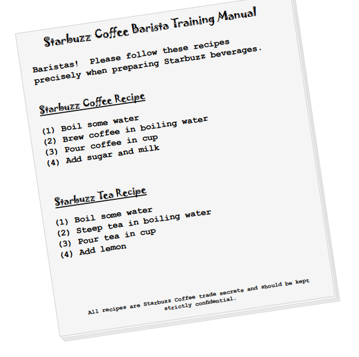
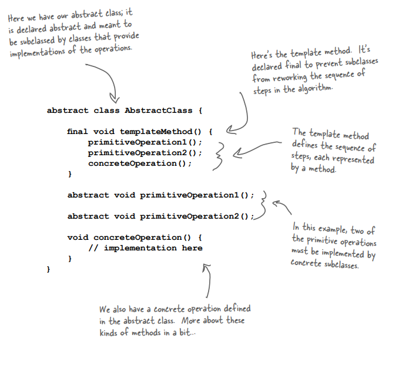

# Template Design Pattern

Encapsulation konusunda ilerleme kaydediyoruz; nesne oluşturmayı, method çağırmayı, complex interface'leri, Duck'ları,
Pizzaları encapsule ettik... sırada ne olabilir? Algoritma parçalarını encapsule etmeye başlayacağız, böylece
subclass'lar istedikleri zaman kendilerini doğrudan bir hesaplamaya bağlayabilecekler. Hatta Hollywood'dan esinlenen bir
tasarım ilkesini bile öğreneceğiz.

# It’s time for some more caffeine (Biraz daha kafein zamanı)

Bazı insanlar kahvesiz, bazıları çaysız yaşayamaz. Ortak içerik? Elbette kafein! Ama dahası var; çay ve kahve çok benzer
şekillerde yapılır. Hadi bir bakalım:



Kahve tarifi çay tarifine çok benziyor, değil mi?

# Whipping up some coffee and tea classes (in Java) (Kahve ve çay dersleri)

Hadi "coding baristası" oynayalım ve kahve ve çay oluşturmak için biraz kod yazalım. İşte kahve:

```
public class Coffee {

    /* İşte kahve tarifimiz, doğrudan eğitim kılavuzundan */
    void prepareReceipe(){
        /* Adımların her biri ayrı bir method olarak implement edilir */
        boilWater();
        brewCoffeeGrinds();
        pourInCup();
        addSugarAndMilk();
    }

    /* Bu methodların her biri algoritmanın bir adımını implement eder. Suyu kaynatmak, kahveyi demlemek, kahveyi bir 
    fincana dökmek, şeker ve süt eklemek için bir method vardır */
    private void boilWater() {
        System.out.println("Boiling water");
    }

    private void brewCoffeeGrinds() {
        System.out.println("Dripping Coffee through filter");
    }

    private void pourInCup() {
        System.out.println("Pouring into cup");
    }

    private void addSugarAndMilk() {
        System.out.println("Adding sugar and milk");
    }
}
```

# and now the Tea... (Ve şimdi çay..)

```
public class Tea {
    void prepareReceipe(){
    
        /* Bu, az önce Coffee'de implement ettiğimize çok benziyor; ikinci ve dördüncü adımlar farklı, ancak temelde 
        aynı tarif */
        boilWater();
        /* steepToBag() Tea'ye özgü methoddur */
        steepTeaBag();
        pourInCup();
        /* addLemon() methodu Tea'ye özgü methoddur */
        addLemon();
    }
    
    /* boilWater() ve pourInCup() Bu iki methodun Coffee'de olduğu gibi tamamen aynı olduğuna dikkat edin! Yani
    burada kesinlikle bazı code duplication söz konusu.*/

    private void boilWater() {
        System.out.println("Boiling water");
    }

    private void steepTeaBag() {
        System.out.println("Steeping the tea");
    }

    private void pourInCup() {
        System.out.println("Pouring into cup");
    }

    private void addLemon() {
        System.out.println("Adding lemon");
    }
}
```

Kod tekrarları olduğunda, bu tasarımı temizlememiz gerektiğine dair iyi bir işarettir. Coffee ve Tea birbirine çok
benzediği için burada ortaklığı bir base class'a abstract'lamamız gerekiyor gibi görünüyor?

# Sir, may I abstract your Coffee, Tea? (Efendim, kahvenizi ya da çayınızı soyutlamama izin verir misiniz?)

Görünüşe göre Kahve ve Çay sınıfları ile elimizde oldukça basit bir tasarım alıştırması var. İlk kesiminiz buna benzer
bir şey olabilir:


**prepareRecipe()** : methodu her subclass'da farklılık gösterir, bu nedenle Abstract olarak tanımlanmıştır.

**boilWater()** ve **pourInCup()** methodları her iki subclass tarafından paylaşılır, bu nedenle superclass'da
tanımlanırlar.

**Coffee - Tea** : Her subclass kendi tarifini implement eder. Her subclass prepareRecipe() methodunu override ve kendi
tarifini implemente eder

Coffee ve Tea'ye özgü methodlar subclasslarda kalır (brewCoffeeGrinds(),addSugarAndMilk(),steepTeaBag(),addLemon())

# Taking the design further... (Tasarımı daha da ileri götürerek...)

Peki Coffee ve Tea'nin başka ne gibi ortak noktaları var? Recipe'ler ile başlayalım.


Her iki tarifin de aynı algoritmayı izlediğine dikkat edin:

1 - Boil some water. (Biraz su kaynatın)

2 - Use the hot water to extract the coffee or tea. (Coffee veya Tea'yi çıkarmak için sıcak suyu kullanın)

3 - Pour the resulting beverage into a cup. (Elde edilen içeceği bir bardağa dökün)

4 - Add the appropriate condiments to the beverage. (İçeceğe uygun çeşnileri ekleyin)

1 ve 3. maddeler Bu ikisi zaten base class'ta abstracted hale getirilmiştir

2 ve 4. maddeler Bunlar abstracted değildir, aynıdır, sadece farklı içecekler için geçerlidir.

Peki, prepareRecipe() işlevini de abstract etmenin bir yolunu bulabilir miyiz? Evet, hadi öğrenelim...

# Abstracting prepareRecipe() (prepareRecipe() methodunu soyutlama)

Her subclass'dan (yani, Coffee ve Tea sınıflarından) prepareRecipe() methodunu abstracting adına adımları takip
edelim..."

1 - İlk sorunumuz Coffee'nin brewCoffeeGrinds() ve addSugarAndMilk() methodlarını kullanırken Tea'nin steepTeaBag() ve
addLemon() methodlarını kullanmasıdır.


Şöyle düşünelim: steeping ve brewing çok farklı değildir; oldukça benzerdirler. O halde yeni bir metot adı belirleyelim,
örneğin brew(), ve ister Coffee demliyor ister Tea demliyor olalım aynı adı kullanacağız. Aynı şekilde, şeker ve süt
eklemek de limon eklemekle hemen hemen aynıdır: her ikisi de içeceğe çeşni eklemektir. Ayrıca bu işlemi gerçekleştirmek
için addCondiments() adında yeni bir yöntem oluşturalım. Böylece, yeni prepareRecipe() metodumuz şu şekilde
görünecektir:

```
void prepareReceipe(){
    boilWater();
    brew();
    pourInCup();
    addCondiments();
}
```

2 - Artık yeni bir prepareRecipe() methodumuz var, ancak bunu koda sığdırmamız gerekiyor. Bunu yapmak için
CaffeineBeverage superclass'ı ile başlayacağız:

```
/* CaffeineBeverage, tıpkı sınıf tasarımında olduğu gibi abstract'dır */
public abstract class CaffeineBeverage {

    /*Şimdi, hem Tea hem de Coffee yapmak için aynı prepareRecipe() methodu kullanılacaktır. prepareRecipe() final 
    olarak bildirilmiştir çünkü subclass'larımızın bu methodu override etmesini ve tarifi değiştirmesini istemiyoruz! 
    brew() ve addCondiments() için 2. ve 4. adımları genelleştirdik */
    final void prepareReceipe(){
        boilWater();
        brew();
        pourInCup();
        addCondiments();
    }

    /* Coffee ve Tea bu methodları farklı şekillerde ele aldığından, abstract olarak bildirilmeleri gerekecektir.
    Bırakın bu konuda subclasslar endişelensin!*/
    protected abstract void brew();

    /* Coffee ve Tea bu methodları farklı şekillerde ele aldığından, abstract olarak bildirilmeleri gerekecektir.
    Bırakın bu konuda subclasslar endişelensin!*/
    protected abstract void addCondiments();

    /* Bunları CaffeineBeverage sınıfına taşıdığımızı hatırlayın (sınıf diyagramımızda). */
    private void boilWater() {
        System.out.println("Boiling water");
    }

    /* Bunları CaffeineBeverage sınıfına taşıdığımızı hatırlayın (sınıf diyagramımızda). */
    private void pourInCup() {
        System.out.println("Pouring into cup");
    }
}
```

3 - Son olarak Coffee ve Tea sınıflarıyla ilgilenmemiz gerekiyor. Artık tarifi işlemek için CaffeineBeverage'a
güveniyorlar, bu yüzden sadece brewing ve condiments'leri işlemeleri gerekiyor:

```
/* Tasarımımızda olduğu gibi, Tea ve Coffee artık CaffeinBeverage'i extend ediyor .*/
public class Tea extends CaffeineBeverage {

    /* Tea öğesinin, CaffeineBeverage öğesinin iki abstract methodu olan brew() ve addCondiments() öğelerini tanımlaması
    gerekir.*/
    @Override
    protected void brew() {
        System.out.println("Steeping the tea");
    }

    @Override
    protected void addCondiments() {
        System.out.println("Adding lemon");
    }
}
```

Coffee Class;

```
public class Coffee extends CaffeineBeverage{

    /* Coffee için de aynı şey geçerlidir, ancak Coffee, Tea Bags ve Lemon yerine coffee, sugar ve milk ile ilgilenir.*/
    @Override
    protected void brew() {
        System.out.println("Dripping Coffee through filter");
    }

    @Override
    protected void addCondiments() {
        System.out.println("Adding sugar and milk");
    }
}
```

# What have we done? (Biz ne yaptık?)


Bazı adımlar farklı implementasyonlar gerektirse de iki tarifin temelde aynı olduğunu fark ettik. Bu yüzden tarifi
genelleştirdik (generalized) ve Base Class'a yerleştirdik.

CaffeineBeverage tarifin adımlarını bilir ve kontrol eder ve 1. ve 3. adımları kendisi gerçekleştirir, ancak 2. ve 4.
adımları gerçekleştirmek için Tea veya Coffee'ye güvenir.

# Meet the Template Method (Template Yöntemiyle Tanışın)

Temel olarak Template Method Modelini implemente ettik. Nedir o? CaffeineBeverage sınıfının yapısına bakalım; gerçek
"template metodu" içeriyor:"


**prepareRecipe()** : bizim **template methodumuzdur**. Neden?

1 - Sonuçta bu bir method.

2 - Bir algoritma için, bu durumda kafeinli içecekler yapmak için, bir algoritma için bir template görevi görür.

Template'de, algoritmanın her adımı bir methodla temsil edilir.

Bazı methodlar bu sınıf tarafından ele alınır...

...ve bazıları subclass tarafından ele alınır.

Bir subclass tarafından sağlanması gereken methodlar abstract olarak bildirilir

```
abstract void brew();
abstract void addCondiments();
```

Template Method bir algoritmanın adımlarını tanımlar ve subclass'ların bir veya daha fazla adım için implementasyon
sağlamasına izin verir.

# Let’s make some tea... (Hadi biraz çay yapalım.)

Bir çay yaparak şablon yönteminin nasıl çalıştığını izleyelim. Şablon yönteminin algoritmayı kontrol ettiğini
göreceksiniz; algoritmanın belirli noktalarında, alt sınıfın adımların uygulanmasını sağlamasına izin verir...

Bir Tea yaparak template methodunun nasıl çalıştığını izleyelim. Template Methodunun algoritmayı kontrol ettiğini
göreceksiniz; algoritmanın belirli noktalarında, subclass'ın adımların implementasyonu sağlamasına izin verir...

1 - İlk olarak Tea Object'ine ihtiyacımız var

```
public class App {
    public static void main(String[] args) {
        Tea tea = new Tea();
    }
}
```

2 - Ardından template methodunu çağırıyoruz:

```
tea.prepareReceipe();
```


Kafeinli içecekler yapmak için kullanılan algoritmayı takip eden...

prepareRecipe() methodu algoritmayı kontrol eder, kimse bunu değiştiremez ve implementasyonun bir kısmını veya tamamını
sağlamak için subclass'lara güvenir.

3 - Önce suyu kaynatıyoruz:

```
boilWater();
```

CaffeineBeverage'de olur.


4 - Daha sonra Tea'yi demlememiz(brew) gerekiyor ki bunu da sadece subclass biliyor:

```
brew();
```


5 - Şimdi Tea'yi bardağa döküyoruz; bu tüm içecekler için aynıdır, bu yüzden CaffeineBeverage'de gerçekleşir:

```
pourInCup();
```


6 - Son olarak, her içeceğe özel olan condiments'leri ekliyoruz, bu yüzden subclass bunu implement ediyor:

```
addCondiments();
```


# What did the Template Method get us? (Template Methodu bize ne kazandırdı?)

### Yetersiz Tea & Coffee Implementasyonu

* Gösteriyi Tea ve Coffee yönetiyor; algoritmayı onlar kontrol ediyor.

* Kod, Coffee ve Tea'de duplicated'dır

* Algoritmada yapılan kod değişiklikleri, subclass'ların açılmasını ve birden fazla değişiklik yapılmasını gerektirir.

* Sınıflar, yeni bir Caffeine Beverage eklemek için çok fazla çalışma gerektiren bir yapıda düzenlenmiştir.

* Algoritma ve bunun nasıl implemente edileceği bilgisi birçok sınıfa dağıtılmıştır.

### Template Method tarafından desteklenen yeni CoffeineBeverage

* CaffeineBeverage sınıfı gösteriyi yönetir; algoritmaya sahiptir ve onu korur.

* CaffeineBeverage sınıfı, subclass'lar arasında reuse'u en üst düzeye çıkarır.

* Algoritma tek bir yerde bulunur ve kod değişikliklerinin yalnızca orada yapılması gerekir.

* Template Method versiyonu, diğer Caffeine içeceklerin plugged edilebileceği bir framework sağlar. Yeni Caffeine'li
  içeceklerin yalnızca birkaç methodu implement etmesi gerekir.

* CaffeineBeverage sınıfı algoritma hakkındaki bilgiyi yoğunlaştırır ve eksiksiz implementasyonlar sağlamak için
  subclass'lara güvenir.

# Template Method Pattern defined (Template Method Pattern açıklaması)

Tea ve Coffee örneğimizde Template Method Pattern'in nasıl çalıştığını gördünüz; şimdi resmi tanımına göz atın ve tüm
ayrıntıları öğrenin:


Template Method Pattern, bir algoritmanın iskeletini bir methodda tanımlar ve bazı adımları subclass'lara devreder.
Template Method, subclass'ların algoritmanın yapısını değiştirmeden algoritmanın belirli adımlarını yeniden
tanımlamasına olanak tanır.

Bu model tamamen bir algoritma için şablon oluşturmakla ilgilidir. Şablon nedir? Gördüğünüz gibi sadece bir yöntemdir;
daha spesifik olarak, bir algoritmayı bir dizi adım olarak tanımlayan bir yöntemdir. Bu adımlardan biri veya daha
fazlası soyut olarak tanımlanır ve bir alt sınıf tarafından uygulanır. Bu, alt sınıflar uygulamanın bir kısmını
sağlarken algoritmanın yapısının değişmeden kalmasını sağlar. Sınıf diyagramına göz atalım:


**AbstractClass** : template methodu içerir. ...ve template methodunda kullanılan operation'ların abstract sürümlerini
içerir.

**primitiveOperation()** : Template method, bir algoritmayı implement etmek için primitiveOperations'ı kullanır. Bu
operations'ların gerçek implementasyonundan ayrılmıştır. ConcreteClass abstract operation'ları implemente eder ve
templateMethod() bunlara ihtiyaç duyduğunda çağrılır.

**ConcreteClass** : Her biri template method'un gerektirdiği tüm operation'ları implement eden çok sayıda ConcreteClass
olabilir

# Code up close...

Template methodu ve primitive operation'lar da dahil olmak üzere AbstractClass'ın nasıl tanımlandığına daha yakından
bakalım.



Burada abstract sınıfımız var; abstract olarak bildirilmiştir ve operation'ların implementasyonlarını sağlayan sınıflar
tarafından subclass'lara ayrılması amaçlanmıştır.

Template method. Subclass'ların algoritmadaki adımlar dizisini yeniden işlemesini önlemek için final olarak
bildirilmiştir.

```final void templateMethod()```

Template method, her biri bir methodla temsil edilen adımlar dizisini tanımlar.

Bu örnekte, primitive operation'lardan ikisi concrete subclass'lar tarafından implement edilmelidir.

Ayrıca abstract sınıfta tanımlanmış concrete bir operation'da var

# Code Way Up Close (Kodu yakından inceleyelim)

Şimdi Abstract sınıfa girebilecek method türlerine daha da yakından bakacağız:


templateMethod() işlevini yeni bir method çağrısı içerecek şekilde değiştirdik.

Hala primitive methodlarımız var; bunlar abstract'dır ve concrete subclass'lar tarafından implemente edilirler

```
primitiveOperation1();
primitiveOperation2();
```

Abstract sınıfta concrete bir işlem tanımlanmıştır. Bu, subclass'ların override edememesi için final olarak bildirilir.
Template methodda doğrudan kullanılabilir veya subclasslar tarafından kullanılabilir.

```final void concreteOperation()```

Varsayılan olarak hiçbir şey yapmayan concrete methodlarımız da olabilir; bunlara "hooks" diyoruz. Subclass'lar bunları
override etmekte özgürdür ancak bunu yapmak zorunda değildir. Bir sonraki sayfada bunların nasıl yararlı olduğunu
göreceğiz.

```void hook() {}``` Concrete bir method, ancak hiçbir şey yapmıyor

# Hooked on Template Method...

Kanca, varsayılan bir implementasyon sağlayan abstract sınıfta bildirilen, ancak yalnızca boş veya varsayılan bir
implementasyon verilen bir methoddur. Bu, subclass'lara isterlerse algoritmaya çeşitli noktalarda "hook into (bağlanma)"
olanağı verir; bir subclass hook'u yok saymakta da özgürdür. Hookların çeşitli kullanımları vardır; şimdi bir tanesine
göz atalım. Diğer birkaç kullanımdan daha sonra bahsedeceğiz:

```
public abstract class CoffeineBeverageWithHook {
    final void prepareReceipe(){
        boilWater();
        brew();
        pourInCup();

        /* Başarısını concrete bir metot olan customerWantsCondiments() methoduna dayandıran küçük bir koşullu ifade
        ekledik. Müşteri condiments isterse, ancak o zaman addCondiments() methodunu çağırıyoruz.*/
        if (customerWantsCondiments()){
            addCondiments();
        }
    }

    void boilWater(){
        System.out.println("Boiling Water");
    }

    abstract void brew();

    void pourInCup(){
        System.out.println("Pouring into cup");
    }

    abstract void addCondiments();

    /* Burada (çoğunlukla) boş bir varsayılan implementasyona sahip bir method tanımladık. Bu method sadece true
    değerini döndürür ve başka hiçbir şey yapmaz. Bu bir hook'dur çünkü subclass bu methodu override edebilir ancak
    bunu yapmak zorunda değildir */
    boolean customerWantsCondiments(){
        return true;
    }
}
```

# Using the hook (Hook kullanma)

Hook'u kullanmak için, subclass'ımızda onu override ederiz. Burada hook, CaffeineBeverage'ın algoritmanın belirli bir
bölümünü değerlendirip değerlendirmediğini, yani içeceğe condiment ekleyip eklemediğini kontrol eder. Müşterinin
condiment isteyip istemediğini nasıl bileceğiz? Sadece sor !

```
public class CoffeeWithHook extends CoffeineBeverageWithHook{
    @Override
    void brew() {
        System.out.println("Dripping coffee through filter");
    }

    @Override
    void addCondiments() {
        System.out.println("Adding Sugar and Milk");
    }

    /* Burada hook'u override eder ve kendi functionality'sini sağlarsınız. */
    @Override
    boolean customerWantsCondiments() {
        /* Kullanıcının condiment kararına ilişkin inputunu alın ve input'a bağlı olarak true veya false döndürün.*/
        String answer = getUserInput();
        return answer.toLowerCase().startsWith("y");
    }

    private String getUserInput() {
        String answer = null;
        System.out.println("Would you like milk and sugar with your coffee (y/n) ?");

        /* Bu kod kullanıcıya milk ve sugar isteyip istemediğini sorar ve command line'dan inputunu alır.*/
        BufferedReader in = new BufferedReader(new InputStreamReader(System.in));
        try {
            answer = in.readLine();
        } catch (IOException exception){
            System.err.println("IO error trying to read your answer");
        }

        if (answer==null){
            return "no";
        }

        return answer;
    }
}
```

# Let's run the TestDrive

Tamam, su kaynıyor... İşte sıcak bir çay ve sıcak bir kahve oluşturduğumuz test kodu

```
public class BeverageTestDrive {
    public static void main(String[] args) {
        CoffeeWithHook coffeeHook = new CoffeeWithHook();

        System.out.println("Making coffee");
        coffeeHook.prepareReceipe();
    }
}
```

Şimdi, müşteriye sormak gibi işlevlerin tüm subclass'lar tarafından kullanılabileceğini düşünebilirdim?

Ne var biliyor musunuz? Size katılıyoruz. Ancak bunu düşünmeden önce bunun, abstract sınıftaki algoritmanın flow'unu
koşullu olarak kontrol etmek için bir hook'un nasıl kullanılabileceğine dair oldukça güzel bir örnek olduğunu kabul
etmelisiniz. Değil mi? Kendi kodunuzda template methodunu ve hook'ları kullanabileceğiniz daha birçok gerçekçi senaryo
düşünebileceğinizden eminiz.

--**QUESTIONS & ANSWERS**--

Q : Bir template methodu oluştururken, ne zaman abstract methodlar kullanacağımı ve ne zaman hook kullanacağımı nasıl
bilebilirim?

A : Subclass'ınızın algoritmadaki methodun veya adımın bir implementasyonu sağlaması ZORUNLU olduğunda abstract
methodlar kullanın. Algoritmanın bu kısmı isteğe bağlı olduğunda hook'ları kullanın. Hook'lar ile, bir subclass o hook'u
implements etmeyi seçebilir, ancak implemente etmek zorunda değildir.

Q : Hook'ların gerçekten ne için kullanılması gerekiyor?

A : Hook'ların birkaç kullanım alanı vardır. Az önce söylediğimiz gibi, bir hook bir subclass'ın bir algoritmanın
isteğe bağlı bir bölümünün implementasyonu için bir yol sağlayabilir veya subclass'ın implementasyonu için önemli
değilse, bunu atlayabilir. Bir başka kullanım şekli de subclass'a template methodda gerçekleşmek üzere olan veya henüz
gerçekleşmiş olan bir adıma tepki verme şansı vermektir. Örneğin, justReOrderedList() gibi bir hook methodu, dahili bir
liste yeniden sıralandıktan sonra subclass'ın bazı etkinlikleri (ekrandaki bir gösterimi yeniden görüntülemek gibi)
gerçekleştirmesine olanak tanır. Gördüğünüz gibi bir hook, bir subclass'a abstract sınıf için bir karar verme yeteneği
de sağlayabilir.

Q : Bir subclass, AbstractClass'taki tüm abstract methodları implement etmek zorunda mıdır?

A : Evet, her concrete subclass tüm abstract methodlar kümesini tanımlar ve template methodun algoritmasının
tanımlanmamış adımlarının eksiksiz bir implementasyonunu sağlar.

Q : Abstract methodlarımın sayısını az tutmam gerekiyor gibi görünüyor, aksi takdirde bunları subclass'ta implements
etmek büyük bir iş olacaktır.

A : Template methodları yazarken bunu akılda tutmak iyi bir şeydir. Bazen bu, algoritmanızın adımlarını çok ayrıntılı
hale getirmeyerek yapılabilir. Ancak bunun bir değiş tokuş olduğu açıktır: ne kadar az ayrıntı, o kadar az esneklik.
Bazı adımların isteğe bağlı olacağını da unutmayın; bu nedenle bunları abstract methodlar yerine hook'lar olarak
implemente edebilir ve abstract sınıfınızın subclass'ları üzerindeki yükü hafifletebilirsiniz.

# The Hollywood Principle

Sizin için başka bir tasarım prensibimiz daha var; buna Hollywood Principle deniyor:


Siz bizi aramayın, biz sizi ararız.

Hatırlaması kolay, değil mi? Ama bunun OO tasarımıyla ne ilgisi var? Hollywood principle bize "dependency rot (
bağımlılık çürümesini)" önlemenin bir yolunu sunar. Dependency rot, low-level componentlere bağlı yan componentlere
bağlı high-level componentlere bağlı low-level componentlere bağlı high-level componentlere sahip olduğunuzda meydana
gelir ve bu böyle devam eder. Rots başladığında, hiç kimse bir sistemin nasıl tasarlandığını kolayca anlayamaz.
Hollywood Principle ile low-level componentlerin kendilerini bir sisteme bağlamalarına izin veririz, ancak ne zaman ve
nasıl ihtiyaç duyulacaklarını high-level componentler belirler. Başka bir deyişle, high-level componentler low-level
componentlere "don't call us, we'll call you (siz bizi aramayın, biz sizi ararız)" muamelesi yapar.


Ancak high-level componentler ne zaman ve nasıl yapılacağını kontrol eder.

Low-level bir component asla high-level bir componenti doğrudan çağırmaz

Low-level componentler hesaplamaya katılabilir

# The Hollywood Principle and Template Method

Hollywood Principle ile Template Method Kalıbı arasındaki bağlantı muhtemelen biraz açıktır: Template Method Kalıbı ile
tasarım yaptığımızda, subclass'lara "don't call us, we'll call you" demiş oluruz. Nasıl mı? CaffeineBeverage
tasarımımıza bir kez daha göz atalım:


CaffeineBeverage bizim high-level componentimizdir. Recipe'in algoritması üzerinde kontrol sahibidir ve subclass'ları
yalnızca bir methodun implementasyonu için gerekli olduklarında çağırır. Beverages client'ları, concrete bir Tea veya
Coffee yerine CaffeineBeverage abstraction'ına bağlı olacak ve bu da genel sistemdeki bağımlılıkları azaltacaktır.

Coffee - Tea Subclass'ları sadece implementasyon detaylarını sağlamak için kullanılır. Tea ve Coffee, önce "called (
çağrılmadan)" abstract sınıfı asla doğrudan çağırmaz

--**QUESTIONS & ANSWERS**--

Q : Hollywood Principle'in birkaç bölüm önce öğrendiğimiz Dependency Inversion Principle ile nasıl bir ilişkisi var?

A : Dependency Inversion Principle bize concrete sınıfların kullanımından kaçınmayı ve bunun yerine mümkün olduğunca
abstraction'lar ile çalışmayı öğretir. Hollywood Principle, low-level componentlerin hesaplamaya bağlanabilmesi, ancak
lower-level componentler ile higher-level layer'lar arasında bağımlılık yaratmaması için framework'ler veya componentler
oluşturmaya yönelik bir tekniktir. Yani her ikisi de ayrıştırma hedefine sahiptir, ancak Dependency Inversion Principle
tasarımda bağımlılıklardan nasıl kaçınılacağı konusunda çok daha güçlü ve genel bir açıklama yapar. Hollywood Principle
bize, low-level yapıların birlikte çalışmasına izin verirken diğer sınıfların bunlara çok fazla bağımlı olmasını önleyen
tasarımlar oluşturmak için bir teknik sunar.

Q : Low-level bir component'in daha higher-level bir component'deki bir methodu çağırmasına izin verilmez mi?

A : Pek sayılmaz. Aslında, low-level bir component genellikle sadece inheritance yoluyla inheritance hiyerarşisinde
üzerinde tanımlanan bir methodu çağıracaktır. Ancak low-level componentler ile high-level componentler arasında açık
circular dependencies yaratmaktan kaçınmak istiyoruz.

# Template Methods in the Wild (Doğada template method)

Template Method Kalıbı çok yaygın bir kalıptır ve vahşi doğada çok sayıda bulabilirsiniz. Yine de keskin bir göze sahip
olmanız gerekir, çünkü template methodlarının, template'in ders kitabı tasarımına pek benzemeyen birçok implementasyonu
vardır.Bu modelin bu kadar sık ortaya çıkmasının nedeni, framework'ün bir şeyin nasıl yapılacağını kontrol ettiği, ancak
framework'ün algoritmasının her adımında gerçekte neler olduğuna dair kendi ayrıntılarınızı belirtmek için size (
framework'ü kullanan kişi) bıraktığı framework'ler oluşturmak için harika bir tasarım aracı olmasıdır. Vahşi doğada (
tamam, Java API'sinde) birkaç kullanımda küçük bir safariye çıkalım... Eğitimde klasik pattern'ler üzerinde çalışırız.
Ancak, gerçek dünyaya çıktığımızda, pattern'lerı context dışında tanımayı öğrenmeliyiz. Ayrıca pattern'lerin
varyasyonlarını tanımayı da öğrenmeliyiz, çünkü gerçek dünyada kare bir delik her zaman gerçekten kare değildir.

# Sorting with Template Method (Template Yöntemi ile Sıralama)

Dizilerle sık sık yapmamız gereken şey nedir? Onları sıralamak! Bunun farkında olan Java Arrays sınıfının tasarımcıları
bize sıralama için kullanışlı bir template methodu sağlamışlardır. Şimdi bu methodun nasıl çalıştığına bir göz atalım:

Aslında burada iki methodumuz var ve sort functionality'sini sağlamak için birlikte hareket ediyorlar.

```
/* İlk method olan sort(), array'in bir kopyasını oluşturan ve bunu mergeSort() methoduna hedef dizi olarak aktaran bir 
helper methoddur. Ayrıca array'in uzunluğunu da aktarır ve sıralamanın ilk elemandan başlamasını söyler */
public static void sort(Object[] obj) {
    Object[] aux = obj.clone();
    mergeSort(aux, obj, 0, obj.length, 0);
}

/* mergeSort() methodu sıralama algoritmasını içerir ve algoritmayı tamamlamak için compareTo() methodunun bir 
implementasyonuna dayanır. Bunu Template method olarak düşünün. */
private static void mergeSort(Object[] src, Object[] dest, int low, int high, int off) {
    for (int i = low; i < high; i++) {
        for (int j = i; j > low &&
                /* compareTo(), template methodunu "fill out (doldurmak)" için implement etmemiz gereken methoddur */
                ((Comparable)dest[j-1]).compareTo(dest[j])>0; j--)
        {
            /* Bu, Arrays sınıfında zaten tanımlanmış olan concrete bir methoddur */
            swap(dest, j, j-1);
        }
    }
}
```

# We’ve got some ducks to sort... (ördekleri sıralamamız gerekiyor )

Diyelim ki sort etmek istediğiniz bir Duck Array'iniz var. Bunu nasıl yapacaksınız? Array'deki sort template methodu
bize algoritmayı verir, ancak Duck'ları nasıl compare edeceğiniz söylemeniz gerekir, bunu da compareTo() methodunu
implement ederek yaparsınız... Mantıklı mı?

Hayır, öyle değil. Bir şeyi subclassing yapmamız gerekmiyor mu? Template Method'un amacının bu olduğunu sanıyordum. Bir
array hiçbir şeyin subclass'ı değildir, bu yüzden sort() işlevini nasıl kullanacağımızı anlamıyorum.

İyi bir noktaya değindin. Olay şu: sort() methodunu tasarlayanlar bunun tüm array'ler için kullanışlı olmasını
istediler, bu yüzden sort() methodunu her yerden kullanılabilen statik bir method yapmak zorunda kaldılar. Ama sorun
değil, neredeyse bir superclass'ta olduğu gibi çalışır. Şimdi, burada bir ayrıntı daha var: sort() gerçekten
superclass'da tanımlanmadığı için, sort() methodunun compareTo() methodunu implemente ettiğinizi bilmesi gerekir, aksi
takdirde sort algoritmasını tamamlamak için gereken parçaya sahip olamazsınız.

Tasarımcılar bunun üstesinden gelmek için Comparable interface'ini kullanmışlardır. Tek yapmanız gereken, tek bir
methodu (sürpriz) olan bu interface'i uygulamaktır: compareTo().

# What is compareTo()?

compareTo() methodu iki nesneyi karşılaştırır ve birinin diğerinden küçük, büyük veya eşit olup olmadığını döndürür.
sort() methodu bunu array'de ki nesneleri karşılaştırırken temel olarak kullanır

# Comparing Ducks and Ducks

Tamam, Duck'ları sıralamak istiyorsanız, bu compareTo() methodunu implemente etmeniz gerektiğini biliyorsunuz; bunu
yaparak Arrays sınıfına algoritmayı tamamlamak ve ördeklerinizi sıralamak için ihtiyaç duyduğu şeyi vereceksiniz. İşte
duck implementasyonu:

```
/* Unutmayın, gerçekten subclass olmadığımız için Comparable interface'ini implement etmemiz gerekiyor*/
public class Duck implements Comparable<Object>{
    /* Bir Duck nesnesinin ismi ve ağırlığı olur */
    String name;
    int weight;

    public Duck(String name, int weight) {
        this.name = name;
        this.weight = weight;
    }

    /* İşi basit tutuyoruz; Duck'ların tek yapması gereken isimlerini ve ağırlıklarını yazdırmak */
    @Override
    public String toString() {
        return "Duck{" +
                "name='" + name + '\'' +
                ", weight=" + weight +
                '}';
    }

    /* Tamam, işte sıralamanın gereksinimleri */
    @Override
    public int compareTo(Object o) {
        /* compareTo() methodu THIS Duck karşılaştırmak için başka bir Duck alır.
        Duck otherDuck = (Duck) o;
        
        /* Duck'ların nasıl compare edileceğini burada belirleriz. Eğer THIS Duck diğer Duck'tan daha hafifse -1 
        döndürürüz; eğer eşitlerse 0 döndürürüz; ve eğer THIS Duck daha ağırsa 1 döndürürüz */
        return Integer.compare(this.weight, otherDuck.weight);
    }
}
```

# Let's sort some Ducks (Hadi Duck'ları sıralayalım)

```
public class DuckTestDrive {
    public static void main(String[] args) {
        
        /* Bir Array Duck'a ihtiyacımız var; bunlar iyi görünüyor */
        Duck[] ducks = {
          new Duck("Daffy",8),
          new Duck("Dewey",2),
          new Duck("Howard",7),
          new Duck("Louie",2),
          new Duck("Donald",10),
          new Duck("Huey",2),
        };
        
        /* İsimlerini ve ağırlıklarını görmek için yazdıralım */
        System.out.println("Before sorting...\n");
        displayDuck(ducks);

        /* Arrays'in static metodunu sort olarak çağırdığımıza ve Ducks'ımızı ona aktardığımıza dikkat edin */
        Arrays.sort(ducks);

        System.out.println("After sorting\n");
        
        /* İsimlerini ve ağırlıklarını görmek için (tekrar) yazdıralım */
        displayDuck(ducks);
    }

    private static void displayDuck(Duck[] ducks) {
        for (Duck duck : ducks) {
            System.out.println(duck);
        }
    }
}
```


# The making of the sorting duck machine (Sıralama Duck makinesinin yapımı)

Arrays sort() template methodunun nasıl çalıştığını izleyelim. Template methodunun algoritmayı nasıl kontrol ettiğini ve
algoritmanın belirli noktalarında Duck'larımızın bir adımın implementasyonunu nasıl istediğini kontrol edeceğiz...

1 - İlk olarak, bir Ducks array'ine ihtiyacımız var:

```
Duck[] ducks = {
  new Duck("Daffy",8),
  new Duck("Dewey",2),
  new Duck("Howard",7),
  new Duck("Louie",2),
  new Duck("Donald",10),
  new Duck("Huey",2),
};
```

2 - Ardından Array sınıfındaki sort() template methodunu çağırıyoruz ve Duck'larımızı ona aktarıyoruz:

``Àrrays.sort(ducks);``


sort() methodu algoritmayı kontrol eder, hiçbir sınıf bunu değiştiremez. sort(), compareTo() implementasyonunu sağlamak
için bir Comparable sınıfına güvenir

sort() methodu (ve helper mergeSort()) sort prosedürünü kontrol eder.

3 - Bir array sıralamak için, tüm liste sıralanana kadar iki öğeyi teker teker karşılaştırmanız gerekir. İki Duck'ı
karşılaştırmak söz konusu olduğunda, sort methodu bunu nasıl yapacağını bilmek için Duck'ın compareTo() methoduna
güvenir. compareTo() methodu ilk Duck üzerinde çağrılır ve karşılaştırılacak Duck aktarılır:


Tipik bir template methodunun aksine inheritance yoktur.

4 - Duck'lar sıralı değilse, Arrays'deki concrete swap() methodu ile değiştokuş edilirler:

```swap()```

5 - Sort methodu, array doğru sırada olana kadar Duck'ları karşılaştırmaya ve değiştokuş yapmaya devam eder!

--**QUESTION & ANSWERS**--

Q : Bu gerçekten Template Method Pattern'mi, yoksa çok mu zorluyorsunuz?

A : Pattern, bir algoritmanın implementasyonunu ve subclass'ların adımların implementasyonunu sağlamasını gerektirir -
ve Arrays sort açıkça bunu yapmıyor! Ancak bildiğimiz gibi, doğadaki kalıplar her zaman ders kitaplarındaki kalıplar
gibi değildir. Context ve Implementation sınırlamalarına uyacak şekilde değiştirilmeleri gerekir. Arrays sort() metodunu
tasarlayanların birkaç kısıtlaması vardı. Genel olarak, bir Java array'i subclass'a ayıramazsınız ve sıralamanın tüm
array'lerde kullanılmasını istediler (ve her array farklı bir sınıftır). Bu yüzden static bir method tanımladılar ve
algoritmanın comparison (karşılaştırma) kısmını sıralanan öğelere deferred ettiler. Dolayısıyla, bir ders kitabı
template method olmasa da, bu implementasyon hala Template Method Pattern'in ruhuna uygundur. Ayrıca, bu algoritmayı
kullanmak için Array'leri subclass'lara ayırma zorunluluğunu ortadan kaldırarak, sıralamayı bazı yönlerden daha esnek ve
kullanışlı hale getirmişlerdir.

Q : Bu sorting implementasyonu aslında Template Method Pattern'den çok Strategy Pattern'e benziyor. Neden bunu Template
Method olarak değerlendiriyoruz?

A : Muhtemelen Strategy Deseni object composition kullandığı için böyle düşünüyorsunuz. Bir bakıma haklısınız - Array'i
sıralamak için Arrays nesnesini kullanıyoruz, yani bu Strategy'ye benzer. Ancak unutmayın, Strategy'de tüm algoritmayı
birlikte oluşturduğunuz sınıf implement eder. Arrays'in sıralama için uyguladığı algoritma eksiktir; eksik compareTo()
methodunu doldurmak için bir sınıfa ihtiyaç duyar. Yani, bu şekilde, daha çok Template Method'a benzer.

Q : Java API'de başka template method örnekleri var mı?

A : Evet, bunları birkaç yerde bulabilirsiniz. Örneğin, java.io, InputStream'de subclass'ların implements gereken
read(byte b[], int off, int len) template methodu tarafından kullanılan bir read() methoduna sahiptir

# Swingin’ with Frames

Template Methodu safarimizde sırada... sallanan JFrame'lere dikkat edin! Eğer JFrame ile karşılaşmadıysanız, en temel
Swing konteyneridir ve bir paint() methodu miras alır. Varsayılan olarak, paint() hiçbir şey yapmaz çünkü o bir
hook'dur! paint() methodunu override ederek, JFrame'in ekran alanını görüntüleme algoritmasına kendinizi dahil edebilir
ve kendi grafik çıktınızın JFrame'e dahil edilmesini sağlayabilirsiniz. İşte paint() hook yöntemini override etmek için
bir JFrame kullanmanın utanç verici derecede basit bir örneği:

```
/* Ekranı güncellemek için algoritmayı kontrol eden bir update() methodu içeren JFrame'i extends ediyoruz.
paint() hook methodunu override ederek bu algoritmaya bağlanabiliyoruz.*/
public class MyFrame extends JFrame {

    public static void main(String[] args) {
        MyFrame myFrame = new MyFrame("Head First Desing Patterns");
    }

    /* Burada sadece bazı başlangıçlar var */
    public MyFrame(String title) throws HeadlessException {
        super(title);
        this.setDefaultCloseOperation(JFrame.EXIT_ON_CLOSE);

        this.setSize(300,300);
        this.setVisible(true);
    }

    /* JFrame'in update algoritması paint() işlevini çağırır. Varsayılan olarak, paint() hiçbir şey yapmaz...
    bu bir hook'dur. paint() işlevini override ediyoruz ve JFrame'e pencereye bir mesaj çizmesini söylüyoruz.*/
    @Override
    public void paint(Graphics g) {
        super.paint(g);
        String message = "I Rule";
        g.drawString(message,150,150);
    }
}
```

# Template Method and Strategy compare methods

Template Method : Hey Strategy, benim bölümümde ne işin var? Factory Method gibi sıkıcı biriyle takılacağımı
düşünmüştüm.

Strategy : Hayır, benim, yine de dikkatli olun - siz ve Factory Method akrabasınız, değil mi? Pek çok ortak noktamız
var, bu yüzden yardımcı olabileceğimi düşündüm...

Template Method : Çok uzun zaman geçtiği için okuyucuya ne hakkında olduğunuzu hatırlatmak isteyebilirsiniz

Strategy : Bir algoritma ailesi tanımlıyorum ve onları birbirinin yerine kullanılabilir hale getiriyorum. Her algoritma
encapsulated edildiği için client farklı algoritmaları kolayca kullanabilir.

Template Method : bu benim yaptığıma çok benziyor. Ancak benim amacım sizinkinden biraz farklı; benim işim bir
algoritmanın ana hatlarını tanımlamak, ancak işin bir kısmını subclass'larımın yapmasına izin vermek. Bu şekilde, bir
algoritmanın bireysel adımlarının farklı implementasyonlarına sahip olabilirim, ancak algoritmanın yapısı üzerinde
kontrolü elimde tutabilirim. Görünüşe göre algoritmalarınızın kontrolünden vazgeçmeniz gerekiyor.

Strategy : Tam olarak bu şekilde ifade edeceğimden emin değilim... ve her neyse, algoritma implementasyonları için
inheritance kullanmaya takılıp kalmadım. Client'lara object composition yoluyla algoritma implementasyonu seçeneği
sunuyorum.

Template Method : Bunu hatırlıyorum. Ancak algoritmam üzerinde daha fazla kontrole sahibim ve kodu duplicate etmiyorum.
Aslında, algoritmamın her parçası, diyelim ki bir satır dışında aynıysa, benim sınıflarım sizinkilerden çok daha
verimlidir. Duplicated tüm kodlarım superclass'a konur, böylece tüm subclass'lar bunları paylaşabilir.

Strategy : Biraz daha verimli olabilirsiniz (sadece biraz) ve daha az nesne gerektirebilirsiniz. Ayrıca benim delegation
modelime kıyasla biraz daha az complex olabilirsiniz, ancak ben daha esnekim çünkü object composition kullanıyorum.
Benimle, client'lar sadece farklı bir strateji nesnesi kullanarak runtime'da algoritmalarını değiştirebilirler.
Hadi ama, Bölüm 1 için beni boşuna seçmediler!

Template Method : Evet, senin adına çok sevindim ama unutma ki en çok kullanılan kalıp benim. Neden mi? Çünkü kodun
reuse'u için subclass'ların behavior belirlemesine olanak tanıyan temel bir yöntem sunuyorum. Eminim bunun
framework oluşturmak için mükemmel olduğunu görebiliyorsunuzdur.

Strategy : Evet, sanırım... ama dependency ne olacak? Sen benden çok daha dependent'sin.

Template Method : Nasıl yani? Benim superclass'ım abstract.

Strategy : Ancak algoritmanızın bir parçası olan superclass'da implement edilen methodlara bağımlı olmak zorundasınız.
Ben kimseye depend (bağımlı) değilim; tüm algoritmayı kendim yapabilirim!

# Tools for your Design Toolbox

Template Method ile algoritmalarınızın kontrolünü elinizde tutarken kodu bir profesyonel gibi yeniden kullanabilirsiniz.


Bir algoritmanın iskeletini, bazı adımları subclass'lara erteleyerek bir işlemde tanımlayın. Template method, alt
sınıfların algoritmanın yapısını değiştirmeden bir algoritmanın belirli adımlarını yeniden tanımlamasına olanak tanır

--**BULLET POINTS**--

* Bir "template method", bir algoritmanın adımlarını tanımlar ve bu adımların implementasyonu için subclass'lara
  deferring (yönlendirme) yapar.

* Template Method Kalıbı bize kodun reuse (yeniden kullanımı) için önemli bir teknik sunar.

* Template methodun abstract sınıfı concrete methodlar, abstract methodlar ve hook'lar tanımlayabilir.

* Abstract methodlar subclass'lar tarafından implement edilir.

* Hook'lar, abstract sınıfta hiçbir şey yapmayan veya varsayılan davranışta bulunan ancak subclass'da override
  edilebilen methodlardır.

* Subclass'ların template methodunda ki algoritmayı değiştirmesini önlemek için template methodunu final olarak
  bildirin.

* Hollywood Principle, low-level modules'lerin nasıl ve ne zaman çağrılacağına karar verebilecek high-level
  modules'lere karar verme yetkisi vermemiz için bize yol gösterir.

* Gerçek dünya kodunda Template Method Kalıbının pek çok kullanımını göreceksiniz, ancak bunların hepsinin (her kalıp
  gibi) "kitaba göre" tasarlanmasını beklemeyin.

* Strategy ve Template Method Kalıplarının her ikisi de algoritmaları biri inheritance diğeri de composition yoluyla
  encapsule eder.

* Factory Method, Template Method'un bir uzmanlık alanıdır.