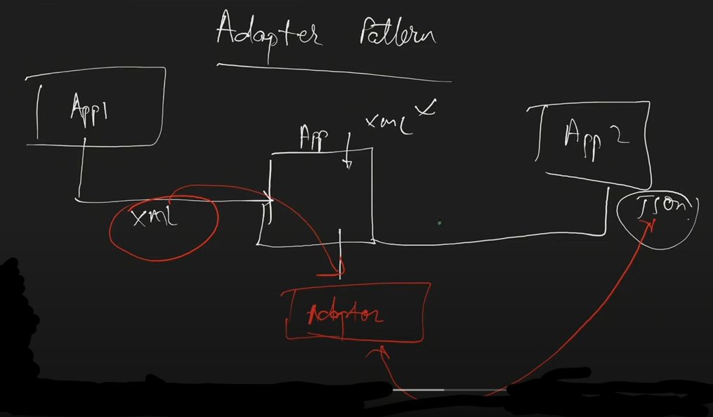

App1 XML formatında datayı App'e gönderir. App XML ile çalışır. App2 JSON ile çalışır.

App1, App2'ye data göndermek isterse; App2 sadece JSON kabul etmektedir.

Bunu sağlayabilmek için araya bir adapter yazılır