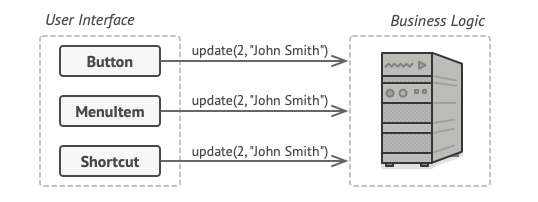

# Command Design Pattern

Command, bir request, request ilgili tüm bilgileri içeren tek başına bir nesneye dönüştüren davranışsal bir tasarım
modelidir. Bu dönüşüm, requestleri bir method argümanı olarak aktarmanıza, bir request'in yürütülmesini geciktirmenize
veya sıraya koymanıza ve geri alınabilir işlemleri desteklemenize olanak tanır.

# Problem

Yeni bir metin editörü uygulaması üzerinde çalıştığınızı düşünün. Şu anki göreviniz, düzenleyicinin çeşitli işlemleri
için bir grup button içeren bir araç çubuğu oluşturmak. Araç çubuğundaki button'ların yanı sıra çeşitli dialog
kutularındaki genel button'lar için de kullanılabilecek çok düzgün bir Button sınıfı oluşturdunuz.

Uygulamanın tüm buttonları aynı sınıftan türetilmiştir.

Bu button'ların hepsi benzer görünse de, hepsinin farklı şeyler yapması gerekiyor. Bu button'ların çeşitli click
handler'ları için kodu nereye koyarsınız? En basit çözüm, button'ın kullanıldığı her yer için tonlarca alt sınıf
oluşturmaktır. Bu alt sınıflar, bir button'a tıklandığında çalıştırılması gereken kodu içerecektir.

Çok sayıda button subclass'ı. Ne yanlış gidebilir ki?

Çok geçmeden bu yaklaşımın son derece hatalı olduğunu fark edersiniz. Öncelikle, çok sayıda subclass'ınız var ve Base
Button sınıfını her değiştirdiğinizde bu subclass'larda ki kodu bozma riskiniz olmasaydı bu sorun olmazdı. Basitçe
söylemek gerekirse, GUI kodunuz business logic'in uçucu koduna garip bir şekilde bağımlı hale gelmiştir.

Birkaç sınıf aynı functionality'i implemente ederler.

Ve işte en çirkin kısmı. Metin kopyalama/yapıştırma gibi bazı işlemlerin birden fazla yerden çağrılması gerekecektir.
Örneğin, bir kullanıcı araç çubuğundaki küçük bir "Kopyala" button'una tıklayabilir veya içerik menüsünden bir şey
kopyalayabilir ya da klavyede Ctrl+C tuşlarına basabilir.

Başlangıçta, uygulamamız yalnızca araç çubuğuna sahipken, çeşitli işlemlerin implementasyonunu button subclass'larına
yerleştirmek sorun değildi. Başka bir deyişle, CopyButton subclass'ının içinde metin kopyalama kodunun bulunması sorun
yaratmıyordu. Ancak daha sonra context menuleri, kısayolları ve diğer şeyleri uyguladığınızda, ya işlemin kodunu birçok
sınıfta çoğaltmanız ya da menüleri button'lara bağımlı hale getirmeniz gerekir ki bu daha da kötü bir seçenektir.

# Solution

İyi bir yazılım tasarımı, genellikle bir uygulamanın katmanlara ayrılmasıyla sonuçlanan "principle of seperation of
concerns" presibine dayanır.

En yaygın örnek: graphical user interface için bir katman ve business logic için başka bir katman. GUI katmanı,
ekranda güzel bir resim oluşturmaktan, herhangi bir inputu yakalamaktan ve kullanıcının ve uygulamanın ne yaptığının
sonuçlarını göstermekten sorumludur. Ancak, iş ayın yörüngesini hesaplamak veya yıllık bir rapor oluşturmak gibi önemli
bir şey yapmaya geldiğinde, GUI katmanı işi altta yatan business logic katmanına devreder.

Kodda şöyle görünebilir: bir GUI nesnesi, bir business logic nesnesinin bir methodunu çağırır ve ona bazı argümanlar
iletir. Bu işlem genellikle bir nesnenin diğerine bir istek göndermesi olarak tanımlanır.

GUI nesneleri business logic nesnelerine doğrudan erişebilir.

Command Pattern, GUI nesnelerinin bu request'leri doğrudan göndermemesini önerir. Bunun yerine, çağrılan nesne, methodun
adı ve argümanların listesi gibi tüm request ayrıntılarını, bu request'i tetikleyen tek bir methodla ayrı bir command
sınıfına çıkarmalısınız.

Command nesneleri, çeşitli GUI ve business logic nesneleri arasında bağlantı görevi görür. Şu andan itibaren, GUI
nesnesinin request'i hangi business logic nesnesinin alacağını ve nasıl işleneceğini bilmesi gerekmez. GUI nesnesi
sadece tüm ayrıntıları ele alan Command'i tetikler.

Bir Command aracılığıyla business logic katmanına erişim.

Bir sonraki adım, command'lerinizin aynı interface'i implement etmesini sağlamaktır. Genellikle parametre almayan tek
bir execution methodu vardır. Bu interface, concrete command sınıflarına coupling olmadan aynı request sender'i ile
çeşitli command'leri kullanmanıza olanak tanır. Bonus olarak, artık sender'a bağlı command nesnelerini değiştirebilir ve
çalışma zamanında sender'in davranışını etkili bir şekilde değiştirebilirsiniz.

Bulmacanın eksik bir parçasını fark etmiş olabilirsiniz, o da request parametreleridir. Bir GUI nesnesi, business logic
nesnesine bazı parametreler sağlamış olabilir. Command execution methodunun herhangi bir parametresi olmadığına göre,
request ayrıntılarını receiver'a nasıl aktaracağız? Command'in ya bu verilerle önceden yapılandırılmış olması ya da bu
verileri kendi başına alabilmesi gerektiği ortaya çıktı.

GUI nesneleri işi command'lere devreder.

Metin editörümüze geri dönelim. Command modelini uyguladıktan sonra, çeşitli click davranışlarını implement etmek için
artık tüm bu button subclass'larına ihtiyacımız kalmadı. Base Button sınıfına bir command nesnesine referans depolayan
tek bir field koymak ve button tıklandığında bu command'i çalıştırmasını sağlamak yeterlidir.

Olası her işlem için bir dizi command sınıfı implement edecek ve button'ların amaçlanan davranışına bağlı olarak bunları
belirli button'lar ile ilişkilendireceksiniz.

Menüler, kısayollar veya tüm diyaloglar gibi diğer GUI öğeleri de aynı şekilde implement edilebilir. Bunlar, kullanıcı
GUI öğesiyle etkileşime girdiğinde çalıştırılacak bir command'e bağlanacaktır. Muhtemelen şimdiye kadar tahmin ettiğiniz
gibi, aynı işlemlerle ilgili öğeler aynı command'lere bağlanacak ve herhangi bir kod tekrarını önleyecektir.

Sonuç olarak, command'ler GUI ve business logic katmanları arasındaki bağlantıyı azaltan kullanışlı bir ara katman
haline gelir. Ve bu, Command modelinin sunabileceği faydaların yalnızca bir kısmı!

# Real-World Analogy

Şehirde uzun bir yürüyüşten sonra güzel bir restorana varıyorsunuz ve pencere kenarındaki masaya oturuyorsunuz. Güler
yüzlü bir garson yanınıza yaklaşıyor ve siparişinizi bir kağıda yazarak hızlıca alıyor. Garson mutfağa gider ve siparişi
duvara yapıştırır. Bir süre sonra sipariş şefe ulaşır, şef siparişi okur ve yemeği ona göre pişirir. Aşçı yemeği
siparişle birlikte bir tepsiye yerleştirir. Garson tepsiyi bulur, her şeyin istediğiniz gibi olduğundan emin olmak için
siparişi kontrol eder ve her şeyi masanıza getirir.

Kağıt sipariş bir Command görevi görür. Şef servis yapmaya hazır olana kadar kuyrukta bekler. Sipariş, yemeği pişirmek
için gereken tüm ilgili bilgileri içerir. Şefin sipariş ayrıntılarını doğrudan sizden öğrenmek için koşuşturmak yerine
hemen pişirmeye başlamasını sağlar.

# Structure

1 - **Sender** sınıfı (diğer adıyla **Invoker**) request'leri başlatmaktan sorumludur. Bu sınıf, bir Command nesnesine
başvuruyu saklamak için bir field'e sahip olmalıdır. Sender, request'i doğrudan Receiver'a göndermek yerine bu Command'i
tetikler. Sender'in Command nesnesini oluşturmaktan sorumlu olmadığını unutmayın. Genellikle, constructor aracılığıyla
client'dan önceden oluşturulmuş bir Command alır.

2 - **Command** interface'i genellikle Command'i çalıştırmak için sadece tek bir method bildirir.

3 - **Concrete Commands** çeşitli request türlerini uygular. Concrete bir command'in işi kendi başına gerçekleştirmesi
değil, çağrıyı business logic nesnelerinden birine iletmesi beklenir. Ancak, kodu basitleştirmek adına bu sınıflar
birleştirilebilir. Bir receiving nesne üzerinde bir methodu çalıştırmak için gereken parametreler, concrete command'de
field'ler olarak bildirilebilir. Bu field'lerin yalnızca constructor aracılığıyla başlatılmasına izin vererek command
nesnelerini değişmez hale getirebilirsiniz.

4 - **Receiver** sınıfı bazı business logic'leri içerir. Hemen hemen her nesne bir Receiver olarak hareket edebilir.
Çoğu command yalnızca bir request'in Receiver'a nasıl iletileceğinin ayrıntılarını ele alırken, asıl işi Receiver'in
kendisi yapar.

5 - **Client** concrete command nesneleri oluşturur ve yapılandırır. Client, bir Receiver instance'i da dahil olmak
üzere tüm request parametrelerini command'in constructor'ına iletmelidir. Bundan sonra, ortaya çıkan command bir veya
birden fazla Sender ile ilişkilendirilebilir.

# Applicability

* Nesneleri işlemlerle parametrize etmek istediğinizde Command kalıbını kullanın.

* Command kalıbı, belirli bir method çağrısını tek başına bir nesneye dönüştürebilir. Bu değişiklik birçok ilginç
  kullanıma olanak sağlar: Command'leri method argümanları olarak aktarabilir, diğer nesnelerin içinde saklayabilir,
  çalışma zamanında bağlantılı command'leri değiştirebilir vb.

* İşte bir örnek: İçerik menüsü gibi bir GUI component'i geliştiriyorsunuz ve kullanıcılarınızın, son kullanıcı bir
  öğeye tıkladığında işlemleri tetikleyen menü öğelerini yapılandırabilmesini istiyorsunuz.

* İşlemleri sıraya koymak, yürütülmelerini zamanlamak veya uzaktan yürütmek istediğinizde Command kalıbını kullanın.

* Diğer nesnelerde olduğu gibi, bir command serialized edilebilir, yani bir dosyaya veya veritabanına kolayca
  yazılabilen bir dizeye dönüştürülebilir. Daha sonra, dize ilk command nesnesi olarak geri yüklenebilir. Böylece,
  command'ın yürütülmesini geciktirebilir ve zamanlayabilirsiniz. Ama dahası da var! Aynı şekilde, commandları sıraya
  koyabilir, günlüğe kaydedebilir veya ağ üzerinden gönderebilirsiniz.

* Reversible (Tersine) çevrilebilir işlemler uygulamak istediğinizde Command modelini kullanın.

* Undo/ReUndo implement etmenin birçok yolu olmasına rağmen, Command kalıbı belki de en popüler olanıdır.

* İşlemleri geri döndürebilmek için, gerçekleştirilen işlemlerin geçmişini implement etmeniz gerekir. Command geçmişi,
  uygulamanın durumunun ilgili yedekleriyle birlikte yürütülen tüm command nesnelerini içeren bir stack'dir.

* Bu methodun iki dezavantajı vardır. Birincisi, bir uygulamanın state'ini kaydetmek o kadar kolay değildir çünkü
  bazıları private olabilir. Bu sorun Memento kalıbı ile hafifletilebilir.

* İkinci olarak, state yedeklemeleri oldukça fazla RAM tüketebilir. Bu nedenle, bazen alternatif bir implementasyona
  başvurabilirsiniz: geçmiş state'i geri yüklemek yerine, command inverse(ters işlemi) gerçekleştirir. Reverse'un de
  bir bedeli vardır: implementasyonu zor hatta imkansız olabilir.

# How to implement

1 - Command interface'ini tek bir execution() methodu ile beyan edin.

2 - Request'leri, command interface'ini implement eden concrete command sınıflarına çıkarmaya başlayın. Her sınıf,
gerçek Receiver nesnesine bir referansla birlikte request argümanlarını saklamak için bir dizi field'e sahip olmalıdır.
Tüm bu değerler command'ın constructor'ı aracılığıyla başlatılmalıdır.

3 - Sender olarak hareket edecek sınıfları belirleyin. Bu sınıflara command'leri saklamak için field'ler ekleyin.
Sender'lar command'larıyla yalnızca command interface'i üzerinden iletişim kurmalıdır. Sender'lar genellikle kendi
başlarına command nesneleri oluşturmazlar, bunun yerine bunları client kodundan alırlar.

4 - Receiver'a doğrudan bir request göndermek yerine command'ı execute etmeleri için Sender'ları değiştirin.

5 - Client nesneleri aşağıdaki sırayla başlatmalıdır:

* Receiver'ları oluşturun
* Command'ler oluşturun ve gerekirse bunları receiver'lar ile ilişkilendirin.
* Sender'lar oluşturun ve bunları belirli command'lerle ilişkilendirin.

# Example

Bu örnekteki metin düzenleyici, kullanıcı onunla her etkileşime girdiğinde yeni command nesneleri oluşturur. Eylemlerini
yürüttükten sonra, bir command history stack'ine push edilir.

Şimdi, undo işlemini gerçekleştirmek için, uygulama geçmişten son çalıştırılan command'i alır ve ya inverse bir eylem
gerçekleştirir ya da bu command tarafından kaydedilen editörün past state'ini geri yükler.