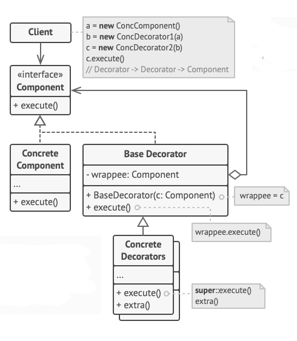

Decorator, nesneleri Decorator adı verilen özel wrapper nesnelerin içine yerleştirerek nesnelere dinamik olarak yeni
behavior'lar eklenmesini sağlayan structural bir modeldir.

Hem hedef nesneler hem de Decorator'lar aynı interface'i takip ettiğinden, Decorator'ları kullanarak nesneleri sayısız
kez wrap edebilirsiniz. Ortaya çıkan nesne, tüm wrapper'ların bir stacking behavior'unu alacaktır.

# PROBLEM

Diğer programların kullanıcılarını önemli olaylar hakkında bilgilendirmesini sağlayan bir notification library'si
üzerinde çalıştığınızı düşünün.

Library'nin ilk versiyonu, yalnızca birkaç field'e, bir constructor'a ve tek bir send methoduna sahip olan Notifier
sınıfına dayanıyordu. Method, bir client'dan bir message argument kabul edebiliyor ve message, constructor aracılığıyla
notifier'a aktarılan bir e-posta listesine gönderebiliyordu. Client olarak hareket eden third partybir uygulamanın
notifier nesnesini bir kez oluşturup yapılandırması ve ardından önemli bir şey olduğunda onu kullanması gerekiyordu.

Bu program, önceden tanımlanmış bir e-posta kümesine önemli olaylar hakkında notification göndermek için notifier
sınıfını kullanabilir.

Bir noktada, library kullanıcılarının e-posta notification'larından daha fazlasını beklediğini fark edersiniz. Birçoğu
kritik sorunlar hakkında SMS almak istiyor. Diğerleri Facebook üzerinden bilgilendirilmek istiyor ve tabii ki kurumsal
kullanıcılar Slack notification'ları almak istiyor.

Bu ne kadar zor olabilir ki? Notifier sınıfını extend ettiniz ve ek notification methodlarını yeni alt sınıflara
yerleştirdiniz. Artık client'in istediği notification sınıfını instantiate etmesi ve diğer tüm notification'lar için
bunu kullanması gerekiyor.

Ama sonra birisi size makul bir şekilde sordu, "Neden aynı anda birden fazla notification türü kullanamıyorsunuz? Eviniz
yanıyorsa, muhtemelen her kanaldan bilgilendirilmek istersiniz.

Bu sorunu, çeşitli notification methodlarını tek bir sınıfta birleştiren özel alt sınıflar oluşturarak çözmeye
çalıştınız. Ancak, bu yaklaşımın yalnızca library kodunu değil, client kodunu da aşırı derecede şişireceği kısa sürede
anlaşıldı.

Alt sınıfların Combinatorial patlaması. Notification sınıflarını yapılandırmak için başka bir yol bulmalısınız ki
sayıları yanlışlıkla Guinness rekoru kırmasın.

# SOLUTION

Bir nesnenin behavior'unu değiştirmeniz gerektiğinde aklınıza gelen ilk şey bir sınıfı extend etmektir. Ancak,
inheritance'in farkında olmanız gereken bazı ciddi uyarıları vardır.

- Inheritance statiktir. Runtime'da mevcut bir nesnenin behavior'unu değiştiremezsiniz. Yalnızca tüm nesneyi farklı
  bir alt sınıftan oluşturulan başka bir nesneyle değiştirebilirsiniz.

- Subclass'ların yalnızca bir Parent sınıfı olabilir. Çoğu dilde inheritance, bir sınıfın aynı anda birden fazla sınıfın
  behavior'larını inherit etmesine izin vermez.

Bu uyarıların üstesinden gelmenin yollarından biri, Inheritance yerine Aggregation veya Composition kullanmaktır. Her
iki alternatif de hemen hemen aynı şekilde çalışır: bir nesne diğerine referans verir ve bazı işleri ona devreder, oysa
inheritance'da nesnenin kendisi bu işi yapabilir, behavior'u üst sınıfından inherit eder

Bu yeni yaklaşımla, linked "helper" nesneyi kolayca bir başkasıyla değiştirebilir ve runtime'da konteynerin
davranışını değiştirebilirsiniz. Bir nesne çeşitli sınıfların behavior'larını kullanabilir, birden fazla nesneye
referans verebilir ve onlara her türlü işi devredebilir. Aggregation/Composition, Decorator da dahil olmak üzere birçok
tasarım modelinin arkasındaki temel ilkedir. Bu nottan sonra, kalıp tartışmasına geri dönelim.

"Wrapper", Decorator kalıbı için kalıbın ana fikrini açıkça ifade eden alternatif bir takma addır. Wrapper, bir
hedef nesne ile bağlantılı olabilen bir nesnedir. Wrapper, hedefle aynı method kümesini içerir ve aldığı tüm
request'leri ona devreder. Ancak wrapper, request'i hedefe iletmeden önce ya da sonra bir şeyler yaparak sonucu
değiştirebilir.

Basit bir Wrapper ne zaman gerçek decorator haline gelir? Bahsettiğim gibi, Wrapper, wrapped nesne ile aynı
interface'i implemente eder. Bu yüzden client'in bakış açısından bu nesneler aynıdır. Wrapper'in referans field'inin
bu interface'i takip eden herhangi bir nesneyi kabul etmesini sağlayın. Bu, bir nesneyi birden fazla Wrapper'da
wrap etmenize ve tüm Wrapper'ların combined behavior'unu ona eklemenize olanak tanır.

Notification örneğimizde, basit e-posta notification behavior'unu base Notifier sınıfının içinde bırakalım, ancak diğer
tüm notification methodlarını decorator'lara dönüştürelim.

Client kodunun, basic bir notifier nesnesini client'in tercihlerine uyan bir dizi decorator'a wrap etmesi gerekir.
Ortaya çıkan nesneler bir stack olarak yapılandırılacaktır.

Stack'de ki son decorator, client'in gerçekten çalıştığı nesne olacaktır. Tüm decorator'lar basic notifier ile aynı
interface'i implement ettiğinden, client kodunun geri kalanı "pure" notifier nesnesiyle mi yoksa decorated edilmiş
olanla mı çalıştığını önemsemeyecektir.

Aynı yaklaşımı message'ları formatlama veya recipient listesini oluşturma gibi diğer behavior'lara da uygulayabiliriz.
Client, diğerleriyle aynı interface'i takip ettikleri sürece nesneyi herhangi bir özel decorator ile decore edebilir.

Giysi giymek decorator kullanımına bir örnektir. Üşüdüğünüzde kendinizi bir kazağa sararsınız. Kazakla hala üşüyorsanız,
üstüne bir ceket giyebilirsiniz. Yağmur yağıyorsa, yağmurluk giyebilirsiniz. Tüm bu giysiler temel davranışınızı "
extend ederler" ancak sizin bir parçanız değildir ve ihtiyacınız olmadığında herhangi bir giysiyi kolayca
çıkarabilirsiniz.

# STRUCTURE

1 - **Component**, hem wrapper'lar hem de wrapped nesneler için common interface'i bildirir.

2 - **Concrete Component** wrapped nesnelerin bir sınıfıdır. Decorator'lar tarafından değiştirilebilen basic behavior'u
tanımlar.

3 - **Base Decorator** sınıfı, wrapped bir nesneye referans vermek için bir field'e sahiptir. Field'in türü Component
Interface olarak bildirilmelidir, böylece hem concrete component'ler hem de decorator'lar içerebilir. Base Decorator
tüm işlemleri wrapped nesneye devreder.

4 - **Concrete Decorators**, component'lere dinamik olarak eklenebilecek ekstra behavior'lar tanımlar. Concrete
Decorators,
Base Decorator'ın methodlarını override eder ve behavior'larını parent methodu çağırmadan önce veya sonra yürütür.

5 - **Client**, Component interface'i aracılığıyla tüm nesnelerle çalıştığı sürece component'leri birden fazla decorator
katmanına wrap edebilir.

# EXAMPLE

Bu örnek, bir nesnenin behavior'ını kodunu değiştirmeden nasıl ayarlayabileceğinizi gösterir.

Başlangıçta, business logic sınıfı yalnızca plain text olarak veri okuyabiliyor ve yazabiliyordu. Daha sonra,
wrapped bir nesnede standart işlemleri yürüttükten sonra yeni behavior'lar ekleyen birkaç küçük wrapper sınıf
oluşturduk.

İlk wrapper verileri şifreler ve şifrelerini çözer, ikincisi ise verileri sıkıştırır ve çıkarır.

Hatta bir decorator'ı diğeriyle wrap ederek bu wrapper'ları combine edebilirsiniz.