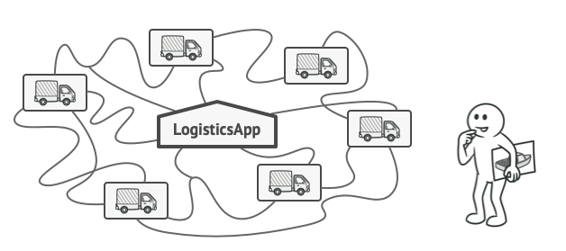
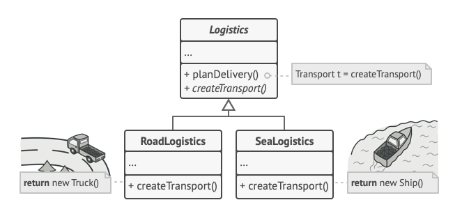
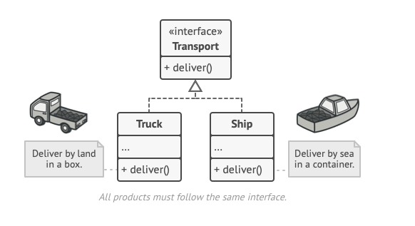
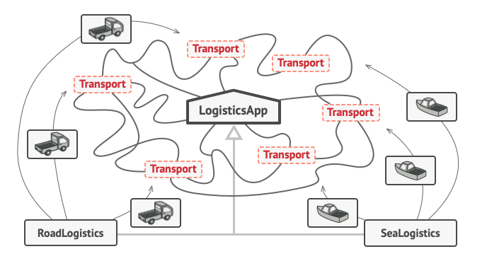
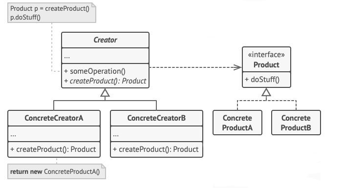

# Factory Method

Factory Method, superclass'da nesneler oluşturmak için bir interface sağlayan, ancak subclass'ların oluşturulacak
nesnelerin türünü değiştirmesine izin veren bir Creational tasarım modelidir.

# Problem

Bir lojistik yönetim uygulaması oluşturduğunuzu düşünün. Uygulamanızın ilk sürümü yalnızca Truck'lar ile taşımacılık
yapabiliyor, bu nedenle kodunuzun büyük kısmı Truck sınıfının içinde yer alıyor.

Bir süre sonra uygulamanız oldukça popüler hale geliyor. Her gün deniz taşımacılığı şirketlerinden deniz lojistiğini
uygulamaya dahil etmek için düzinelerce talep alıyorsunuz.

Kodun geri kalanı zaten mevcut sınıflara bağlıysa, programa yeni bir sınıf eklemek o kadar da kolay değildir.

Harika bir haber, değil mi? Peki ya kod ne olacak? Şu anda kodunuzun çoğu Truck sınıfına bağlı. Uygulamaya Ship
eklemek, tüm kod tabanında değişiklik yapmayı gerektirecektir. Dahası, daha sonra uygulamaya başka bir ulaşım türü
eklemeye karar verirseniz, muhtemelen tüm bu değişiklikleri yeniden yapmanız gerekecektir.

Sonuç olarak, ulaşım nesnelerinin sınıfına bağlı olarak uygulamanın davranışını değiştiren koşullarla dolu oldukça kötü
bir kod elde edersiniz.

# Solution

Factory Method kalıbı, doğrudan nesne oluşturma çağrılarını (new operatörünü kullanarak) özel bir factory method'una
yapılan çağrılarla değiştirmenizi önerir. Endişelenmeyin: nesneler hala new operatörü aracılığıyla oluşturulur, ancak bu
operatör factory method'unun içinden çağrılır. Bir factory methodu tarafından döndürülen nesneler genellikle product
olarak adlandırılır.

Subclass'lar, factory methodu tarafından döndürülen nesnelerin sınıfını değiştirebilir.

İlk bakışta bu değişiklik anlamsız görünebilir: sadece constructor çağrısını programın bir bölümünden diğerine taşıdık.
Ancak şunu düşünün: artık bir subclass'ta ki factory methodunu override edebilir ve method tarafından oluşturulan
product'ların sınıfını değiştirebilirsiniz.

Yine de küçük bir sınırlama vardır: subclass'lar, yalnızca bu product'lar ortak bir base class'a veya interface'e
sahipse farklı product türleri döndürebilir. Ayrıca, base class'ta ki factory methodunun dönüş türünün bu interface
olarak bildirilmiş olması gerekir.

Tüm product'lar aynı interface'i takip etmelidir.

Örneğin, hem Truck hem de Ship sınıfları, deliver adında bir method bildiren Transport interface'ini implemente
etmelidir. Her sınıf bu methodu farklı şekilde implemente eder: Truck'lar kargoyu karadan, Ship'ler kargoyu denizden
teslim eder. RoadLogistics sınıfındaki factory method Truck nesneleri döndürürken, SeaLogistics sınıfındaki factory
method Ship döndürür.

Tüm Product sınıfları ortak bir interface implemente ettiği sürece, nesnelerini client koduna bozmadan aktarabilirsiniz

Factory methodunu kullanan kod (genellikle client kodu olarak adlandırılır), çeşitli alt sınıflar tarafından döndürülen
gerçek Product'lar arasında bir fark görmez. Client tüm Product'ları abstract Transport olarak ele alır. Client, tüm
taşıma nesnelerinin deliver methoduna sahip olması gerektiğini bilir, ancak bunun tam olarak nasıl çalıştığı client için
önemli değildir.

# Structure

1 - **Product**, creator ve subclass'ları tarafından üretilebilecek tüm nesneler için ortak olan interface'i bildirir.

2 - **Concrete Products** Product interface'inin farklı implementasyonlarıdır

3 - **Creator** sınıfı, yeni Product nesneleri döndüren factory methodunu bildirir. Bu methodun dönüş türünün Product
interface'i ile eşleşmesi önemlidir. Tüm subclass'ları methodun kendi sürümlerini implement etmeye zorlamak için factory
methodunu abstract olarak bildirebilirsiniz. Alternatif olarak, base factory methodu varsayılan bir Product türü
döndürebilir. Büyük bir yazılım geliştirme şirketinin programcılar için bir eğitim departmanı olabilir. Ancak, şirketin
bir bütün olarak birincil işlevi hala kod yazmaktır, programcı üretmek değil.

4 - **Concrete Creator'lar** base factory methodunu override ederek farklı bir Product türü döndürür. Factory methodunun
her zaman yeni instance2lar oluşturmak zorunda olmadığını unutmayın. Bir önbellekten, nesne havuzundan veya başka bir
kaynaktan mevcut nesneleri de döndürebilir.

# Example

Bu örnekte, Button'lar bir Product rolü oynar ve dialog'lar Creators olarak hareket eder.

Farklı dialog türleri kendi öğe türlerini gerektirir. Bu nedenle her dialog türü için bir subclass oluşturur ve
bunların factory methodlarını override ederiz.

Şimdi, her dialog türü uygun button sınıflarını instantiate edecektir. Temel iletişim kutusu, ortak interface'lerini
kullanarak Product'lar ile çalışır, bu nedenle kodu tüm değişikliklerden sonra işlevsel kalır.
