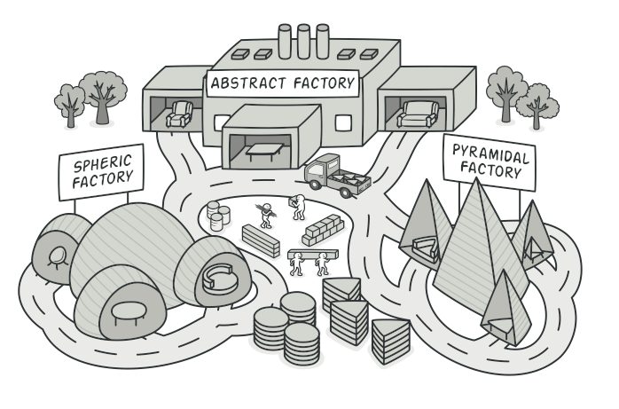
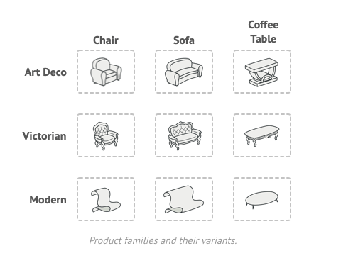
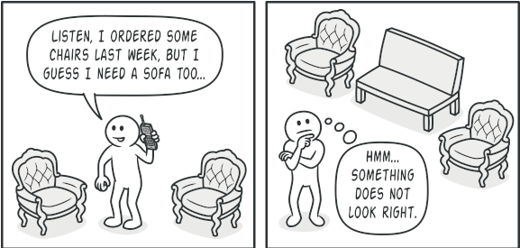
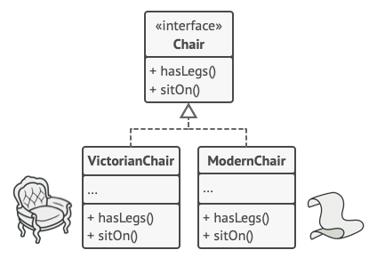
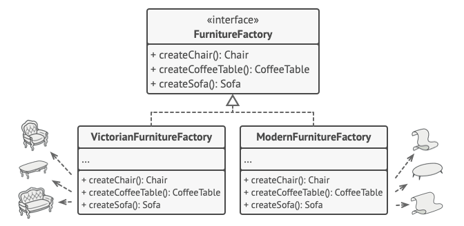
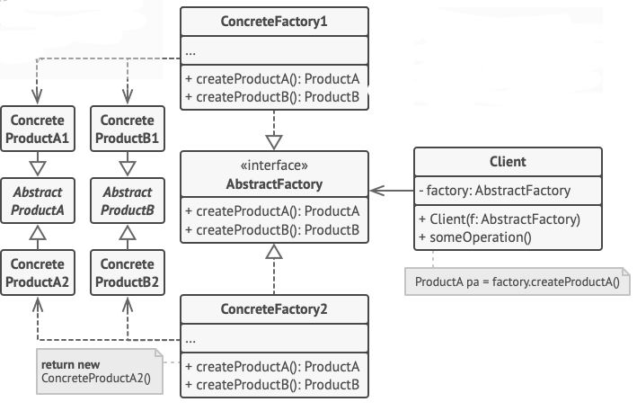

# Abstract Factory Design Pattern

Abstract Factory, concrete sınıflarını belirtmeden birbiriyle ilişkili nesne aileleri üretmenizi sağlayan bir tasarım
modelidir.

# Problem

Hayal edin ki bir mobilya mağazası simülatörü oluşturuyorsunuz. Kodunuz, aşağıdaki sınıfları temsil eden
sınıflardan oluşuyor:

1 - Birbiriyle ilişkili Product'lardan oluşan bir aile, örneğin : Chair + Sofa + CoffeeTable

2 - Bu ailenin çeşitli varyantları. Örneğin, Chair + Sofa + CoffeeTable Product'ları bu varyantlarda mevcuttur: Modern,
Victorian, Art Deco

Yukarıda ki resimde Product aileleri ve bunların varyantları bulunmaktadır

Aynı aileden diğer nesnelerle eşleşmeleri için tek tek mobilya nesneleri oluşturmanın bir yoluna ihtiyacınız var.
Müşteriler eşleşmeyen mobilyalar aldıklarında oldukça sinirleniyorlar.

Ayrıca, programa yeni Product'lar veya Product aileleri eklerken mevcut kodu değiştirmek istemezsiniz. Mobilya
satıcıları kataloglarını çok sık günceller ve bu her gerçekleştiğinde core kodu'u değiştirmek istemezsiniz.

# Solution

Abstract Factory modelinin önerdiği ilk şey, Product ailesinin her bir farklı Product'ı (örneğin, chair, sofa veya
coffee table) için interface'leri açıkça beyan etmektir. Daha sonra tüm product çeşitlerinin bu interface'leri takip
etmesini sağlayabilirsiniz.

Örneğin, tüm chair varyantları Chair interface'ini implement edebilir; tüm coffee table varyantları CoffeeTable
interface'ini implement edebilir vb.

Aynı nesnenin tüm varyantları tek bir sınıf hiyerarşisine taşınmalıdır.

Bir sonraki adım, Product ailesinin parçası olan tüm Product'lar için (örneğin, createChair, createSofa ve
createCoffeeTable) oluşturma methodlarının bir listesini içeren bir interface olan Abstract Factory'i beyan etmektir. Bu
methodlar, daha önce çıkardığımız interface'ler tarafından temsil edilen Abstract Product türlerini döndürmelidir:
Chair, Sofa, CoffeeTable vb.

Her concrete factory belirli bir Product varyantına karşılık gelir.

Peki ya Product varyantları? Bir Product ailesinin her bir varyantı için AbstractFactory interface'ini temel alan ayrı
bir factory sınıfı oluşturuyoruz. Factory, belirli bir türdeki Product'ları döndüren bir sınıftır. Örneğin,
ModernFurnitureFactory yalnızca ModernChair, ModernSofa ve ModernCoffeeTable nesnelerini oluşturabilir.

Client kodu hem factory'lerle hem de Product'larla kendi abstract interface'leri üzerinden çalışmak zorundadır. Bu,
client koduna aktardığınız factory'nin çeşidini ve client kodunun aldığı Product çeşidini, asıl client kodunu bozmadan
değiştirmenize olanak tanır.

Diyelim ki client bir factory'nin bir Chair üretmesini istiyor. Client'in factory'nin sınıfından haberdar olması
gerekmediği gibi ne tür bir Chair alacağı da önemli değildir. İster Modern model ister Victoria tarzı bir Chair
olsun, client Abstract Chair interface'ini kullanarak tüm Chair'lere aynı şekilde davranmalıdır. Bu yaklaşımla,
client'in Chair hakkında bildiği tek şey, bir şekilde sitOn methodunu uyguladığıdır. Ayrıca, Chair'in hangi çeşidi
döndürülürse döndürülsün, her zaman aynı factory nesnesi tarafından üretilen sofa veya coffee table türüyle
eşleşecektir.

Açıklığa kavuşturulması gereken bir şey daha var: client yalnızca abstract interface'lere maruz kalıyorsa, gerçek
factory nesnelerini ne oluşturur? Genellikle uygulama, başlatma aşamasında concrete bir factory nesnesi oluşturur.
Bundan hemen önce, uygulama yapılandırmaya veya ortam ayarlarına bağlı olarak factory çeşidini seçmelidir.

# Structure

1 - Abstract Products, bir Product ailesini oluşturan bir dizi farklı ancak ilgili Product için interface bildirir.

2 - **Concrete Product'lar**, abstract product'ların varyantlara göre gruplandırılmış çeşitli implementasyonlarıdır. Her
abstract product (Chair/Sofa) verilen tüm varyantlarda (Victoria Dönemi/Modern) implemente edilmelidir.

3 - **AbstractFactory** interface'i, abstract product'ların her birini oluşturmak için bir dizi method bildirir.

4 - **Concrete Factories**, Abstract Factory'nin creation methodlarını implement eder. Her concrete factory belirli bir
Product çeşidine karşılık gelir ve yalnızca bu Product çeşitlerini oluşturur.

5 - Concrete factory'ler concrete Product'ları instantiate etse de, creation methodlarının imzaları karşılık gelen
Abstract Product'ları döndürmelidir. Bu şekilde, bir factory kullanan client kodu, factory'den aldığı Product'ın belirli
bir varyantına bağlanmaz. Client, nesneleriyle abstract interface'ler aracılığıyla iletişim kurduğu sürece herhangi bir
Concrete Factory/Product çeşidiyle çalışabilir.

# Example

Bu örnekte, Button'lar ve Checkbox'lar Product olarak işlev görecektir. Bunların iki çeşidi vardır: macOS ve Windows.

AbstractFactory, Button'lar ve CheckBox'lar oluşturmak için bir interface tanımlar. Her iki Product'ı da tek bir
varyantta döndüren iki concrete factory vardır.

Client kodu, abstract interface'leri kullanarak factory'ler ve product'lar ile çalışır. Factory nesnesinin türüne bağlı
olarak aynı client kodunun birçok Product çeşidiyle çalışmasını sağlar.

