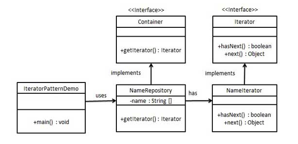

Iterator kalıbı Java ve .Net programlama ortamında çok yaygın olarak kullanılan bir tasarım kalıbıdır. Bu desen, bir
koleksiyon nesnesinin elemanlarına, altta yatan gösterimini bilmeye gerek kalmadan sıralı bir şekilde erişmenin bir
yolunu elde etmek için kullanılır.

Gezinme yöntemini anlatan bir Iterator interface'i ve iteratörü yeniden çalıştıran bir Container interface'i
oluşturacağız. Container interface'ini implement eden concrete sınıflar Iterator interface'ini implemente etmekten ve
kullanmaktan sorumlu olacaktır

IteratorPatternDemo, demo sınıfımız NameRepository'de bir koleksiyon olarak saklanan bir İsmi yazdırmak için concrete
bir sınıf implementasyonu olan NamesRepository'yi kullanacaktır.



> Create interfaces

```
public interface Iterator {
    boolean hasNext();
    Object next();
}
```

```
public interface Container {
    Iterator getIterator();
}
```

> Container interface'ini implement eden concrete sınıf oluşturun. Bu sınıf, Iterator interface'ini implement eden
> NameIterator inner class'ına sahiptir.

```
public class NameRepository implements Container {
    public String[] names = {"Robert", "John", "Julie", "Lora"};

    @Override
    public Iterator getIterator() {
        return new NameIterator();
    }

    private class NameIterator implements Iterator {
        int index;

        @Override
        public boolean hasNext() {
            return index < names.length;
        }

        @Override
        public Object next() {
            if (this.hasNext()){
                return names[index++];
            }
            return null;
        }
    }
}
```

> NameRepository'i kullanarak iterator'ı get edelim

```
public class Main {
    public static void main(String[] args) {
        NameRepository nameRepository = new NameRepository();
        for (Iterator iter = nameRepository.getIterator();iter.hasNext();){
            System.out.println("Name : " + iter.next());
        }
    }
}
```