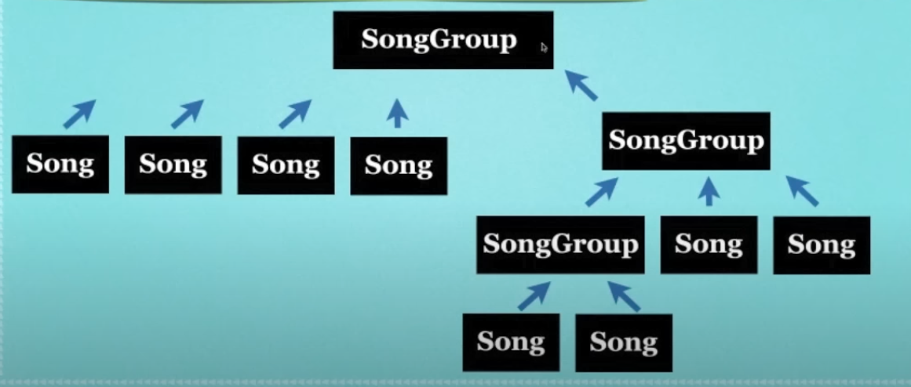
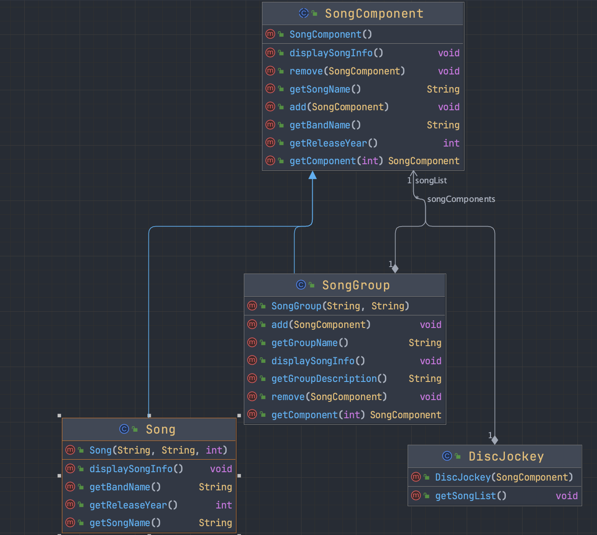

# SongComponent (Component)

```
public abstract class SongComponent {
    public void add(SongComponent songComponent) {
        throw new UnsupportedOperationException();
    }

    public void remove(SongComponent songComponent) {
        throw new UnsupportedOperationException();
    }

    public SongComponent getComponent(int componentIndex) {
        throw new UnsupportedOperationException();
    }

    public String getSongName(){
        throw new UnsupportedOperationException();
    }

    public String getBandName(){
        throw new UnsupportedOperationException();
    }

    public int getReleaseYear(){
        throw new UnsupportedOperationException();
    }

    public void displaySongInfo(){
        throw new UnsupportedOperationException();
    }
}
```

# SongGroup

```
public class SongGroup extends SongComponent {
    ArrayList<SongComponent> songComponents = new ArrayList<>();
    String groupName;
    String groupDescription;

    public SongGroup(String groupName, String groupDescription) {
        this.groupName = groupName;
        this.groupDescription = groupDescription;
    }

    public String getGroupName() {
        return groupName;
    }

    public String getGroupDescription() {
        return groupDescription;
    }

    @Override
    public void add(SongComponent songComponent) {
        songComponents.add(songComponent);
    }

    @Override
    public void remove(SongComponent songComponent) {
        songComponents.remove(songComponent);
    }

    public SongComponent getComponent(int componentIndex) {
        return songComponents.get(componentIndex);
    }

    public void displaySongInfo() {
        System.out.println(getGroupName() + " " + getGroupDescription() + "\n");
        for (SongComponent songInfo : songComponents) {
            songInfo.displaySongInfo();
        }
    }
}
```

# Song

```
public class Song extends SongComponent{
    String songName;
    String bandName;
    int releaseYear;

    public Song(String songName, String bandName, int releaseYear) {
        this.songName = songName;
        this.bandName = bandName;
        this.releaseYear = releaseYear;
    }

    @Override
    public String getSongName() {
        return songName;
    }

    @Override
    public String getBandName() {
        return bandName;
    }

    @Override
    public int getReleaseYear() {
        return releaseYear;
    }

    @Override
    public void displaySongInfo() {
        System.out.println(getSongName() + " was recorded by " + getBandName() + " in " + getReleaseYear());
    }
}
```

# DiscJockey

```
public class DiscJockey {
    SongComponent songList;

    public DiscJockey(SongComponent songList) {
        this.songList = songList;
    }

    public void getSongList(){
        songList.displaySongInfo();
    }
}
```

# Main

```
public class Main {
    public static void main(String[] args) {
        SongComponent industricalMusic = new SongGroup("Industrial", "transgressive and provocative");
        SongComponent heavyMetalMusic = new SongGroup("Heavy Metal", "genre of rock");
        SongComponent dubStepMusic = new SongGroup("DubStep", "electronic dance music");

        SongComponent everySong = new SongGroup("Song List", "Every Song Available");
        everySong.add(industricalMusic);

        industricalMusic.add(new Song("Head Like A Hole", "NIN", 1990));
        industricalMusic.add(new Song("Head Hunter", "Front 242", 1988));

        industricalMusic.add(dubStepMusic);

        dubStepMusic.add(new Song("Centipede", "Knife Party", 2012));
        dubStepMusic.add(new Song("Tetris", "Doctor P", 2011));

        everySong.add(heavyMetalMusic);

        heavyMetalMusic.add(new Song("War Pigs", "Black Sabbath", 1970));
        heavyMetalMusic.add(new Song("Ace Of Spades", "Motorhead", 1980));

        DiscJockey discJockey = new DiscJockey(everySong);
        discJockey.getSongList();
    }
}
```





