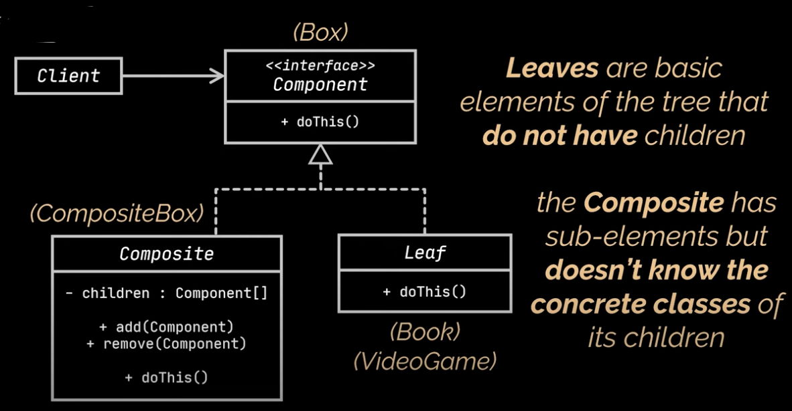

# Box

```
public interface Box {
    double calculatePrice();
}
```

# Product

```
public abstract class Product implements Box{
   protected final String title;
   protected final double price;

    public Product(String title, double price) {
        this.title = title;
        this.price = price;
    }

    public String getTitle() {
        return title;
    }

    public double getPrice() {
        return price;
    }
}
```

# Book

```
public class Book extends Product{
    public Book(String title, double price) {
        super(title, price);
    }

    @Override
    public double calculatePrice() {
        return getPrice();
    }
}
```

# VideoGame

```
public class VideoGame extends Product{
    public VideoGame(String title, double price) {
        super(title, price);
    }

    @Override
    public double calculatePrice() {
        return getPrice();
    }
}
```

# CompositeBox

```
public class CompositeBox implements Box{
    private final List<Box> childrens = new ArrayList<>();

    public CompositeBox(Box... boxes){
        childrens.addAll(Arrays.asList(boxes));
    }
    @Override
    public double calculatePrice() {
        return childrens.stream()
                .mapToDouble(Box::calculatePrice)
                .sum();
    }
}
```

# DeliveryService

```
public class DeliveryService {
    private Box box;

    public void setupOrder(Box... boxes){
        this.box = new CompositeBox(boxes);
    }

    public double calculateOrderPrice(){
        return box.calculatePrice();
    }
}
```

# Main

```
public class Main {
    public static void main(String[] args) {
        DeliveryService deliveryService = new DeliveryService();

        deliveryService.setupOrder(
                new CompositeBox(new VideoGame("1",100)),
                new CompositeBox(
                        new CompositeBox(
                                new Book("2",200),
                                new Book("3",400)
                        ),
                        new VideoGame("4",500),
                        new VideoGame("5",100)
                )
        );

        double price = deliveryService.calculateOrderPrice();
        System.out.println(price);
    }
}
```

