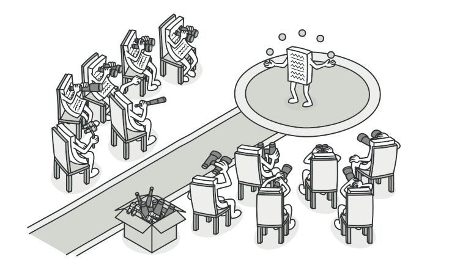
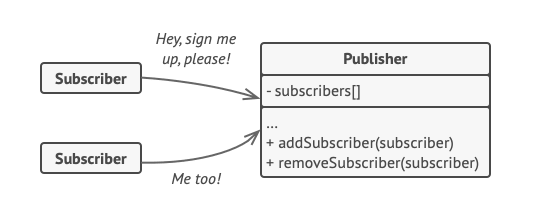
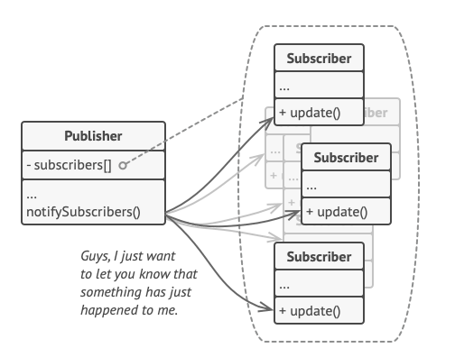
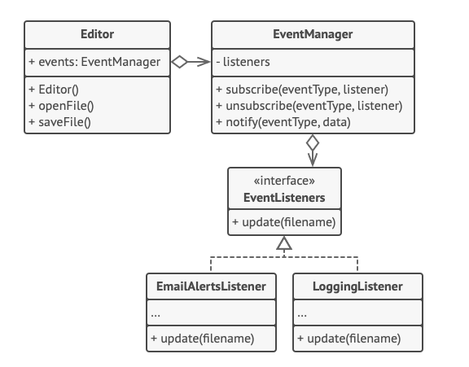
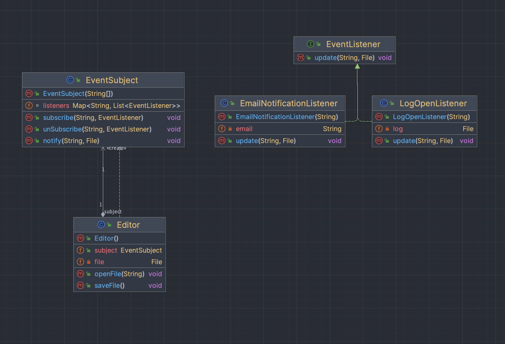

Observer, gözlemledikleri nesnede meydana gelen herhangi bir olay hakkında birden fazla nesneyi bilgilendirmek için bir
subscription mekanizması tanımlamanıza olanak tanıyan behavioral bir tasarım modelidir.

Hayal edin ki iki tür nesneniz var: Customer ve Store. Customer, özellikle belirli bir ürün markasına (örneğin, yeni bir
iPhone modeli) büyük ilgi gösteriyor ve bu ürünün store'da çok yakın bir zamanda satışa sunulması gerekiyor.

Customer, her gün store'u ziyaret edebilir ve ürünün stok durumunu kontrol edebilir. Ancak ürün hâlâ yolda olduğunda,
bu ziyaretlerin çoğu amaçsız olacaktır.

Öte yandan, store, her yeni ürün piyasaya sürüldüğünde tüm customer'lara (bu, spam olarak kabul edilebilecek) tonlarca
e-posta gönderebilirdi. Bu, bazı customer'ları sürekli store ziyaretlerinden kurtarabilir. Ancak aynı zamanda, yeni
ürünlerle ilgilenmeyen diğer customer'ları rahatsız edebilirdi.

Görünüşe göre bir çatışma var. Ya customer ürünün stok durumunu kontrol etmek için zaman kaybeder ya da store yanlış
customer'lara notification'da bulunarak kaynaklarını israf eder.

İlginç bir state'e sahip olan nesne genellikle subject olarak adlandırılır, ancak durumundaki değişiklikleri diğer
nesnelere de bildireceği için biz ona publisher diyeceğiz. Publisher'ın durumundaki değişiklikleri takip etmek isteyen
diğer tüm nesnelere Subscriber denir.

Observer pattern, publisher sınıfına bir subscription mekanizması eklemenizi önerir, böylece tek tek nesneler bu
publisherdan gelen event akışına subscribe olabilir veya unsubscribe olabilir. Korkmayın! Her şey göründüğü kadar
karmaşık değildir. Gerçekte, bu mekanizma;

1 - Subscriber nesnelerine referansların bir listesini saklamak için bir array field ve

2 - Subscriber'ların bu listeye eklenmesine ve listeden çıkarılmasına izin veren birkaç genel methoddan oluşur.

Şimdi, Publisher'da önemli bir event meydana geldiğinde, Subscriber'lara gider ve nesnelerinde belirli notification
methodunu çağırır.

Gerçek uygulamalarda, aynı publisher sınıfının eventlerini izlemekle ilgilenen düzinelerce farklı subscriber sınıfı
olabilir. Publisher'ı tüm bu sınıflarla eşleştirmek istemezsiniz. Ayrıca, publisher sınıfınızın başkaları tarafından
kullanılması gerekiyorsa bazılarından önceden haberiniz bile olmayabilir.

Uygulamanızda birkaç farklı türde publisher varsa ve subscriber'larınızı hepsiyle uyumlu hale getirmek istiyorsanız,
daha da ileri gidebilir ve tüm publisher'ların aynı interface'i takip etmesini sağlayabilirsiniz. Bu interface'in
yalnızca birkaç subscription methodunu tanımlaması gerekecektir. Interface, subscriberlerin publisherların durumlarını
concrete sınıflarına bağlanmadan gözlemlemelerine olanak tanıyacaktır.

--**Examples :**--

Bu örnekte, Observer pattern'i bir text editörünün nesneleri arasında dolaylı işbirliği kurar. Editor nesnesi her
değiştiğinde, observer'lar bilgilendirir. EmailNotificationListener ve LogOpenListener, primary behavior'larını
yürüterek bu notification'lara tepki verir.

Observer sınıfları editör sınıfına bağlı değildir ve gerektiğinde diğer uygulamalarda yeniden kullanılabilir. Editör
sınıfı yalnızca abstract Observer interface'ine bağlıdır. Bu, editörün kodunu değiştirmeden yeni Observer türlerinin
eklenmesine olanak tanır.

