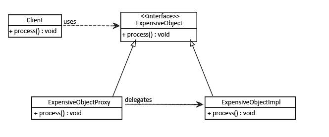

Bazı başlangıç yapılandırmaları gerektiren heavy-weight bir Java nesnesi (JDBC bağlantısı veya SessionFactory gibi)
düşünün.

Bu tür nesnelerin yalnızca request üzerine başlatılmasını ve bir kez başlatıldıktan sonra tüm call'lar için yeniden
kullanılmasını isteriz:



Şimdi bu nesne için basit bir interface ve configuration oluşturalım:

```
public interface ExpensiveObject {
    void process();
}
```

Bu interface'in implementasyonu;

```
public class ExpensiveObjectImpl implements ExpensiveObject {

    public ExpensiveObjectImpl(){
        heavyInitialConfiguration();
    }

    private void heavyInitialConfiguration() {
        System.out.println("Loading initial configuration");
    }

    @Override
    public void process() {
        System.out.println("processing complete...");
    }
}
```

Şimdi Proxy modelini kullanacağız ve nesnemizi request üzerine başlatacağız:

```
public class ExpensiveObjectProxy implements ExpensiveObject{

    private static ExpensiveObject expensiveObject;

    @Override
    public void process() {
        if (expensiveObject == null){
            expensiveObject = new ExpensiveObjectImpl();
        }
        expensiveObject.process();
    }
}
```

Client'imiz process() methodunu her çağırdığında, sadece processing'i görecek ve configuration her zaman gizli
kalacaktır:

```
public class App {
    public static void main(String[] args) {
        ExpensiveObject expensiveObject = new ExpensiveObjectProxy();
        expensiveObject.process();
        expensiveObject.process();
    }
}
```

process() methodunu iki kez çağırdığımıza dikkat edin. Sahne arkasında, configuration kısmı yalnızca bir kez
gerçekleşecektir - nesne ilk kez initialize edildiğinde.

Sonraki her call için bu model ilk configuration'i atlayacak ve yalnızca process() gerçekleşecektir:

Proxy Design Pattern ne zaman kullanılır;

Complex veya heavey-weight bir nesnenin basitleştirilmiş bir versiyonunu istediğimizde. Bu durumda, lazy loading olarak
da adlandırılan, orijinal nesneyi request üzerine yükleyen bir skeleton nesnesiyle temsil edebiliriz. Bu Virtual Proxy
olarak bilinir

Orijinal nesne farklı bir adres alanında mevcut olduğunda ve biz onu local olarak temsil etmek istediğimizde. client
nesneye kendi local adres alanında olduğu gibi erişirken, bağlantıyı oluşturma ve sürdürme, encoding, decoding vb. gibi
tüm gerekli şeyleri yapan bir proxy oluşturabiliriz. Buna Remote Proxy denir

Client'in erişim haklarına dayalı olarak kontrollü erişim sağlamak için orijinal temel nesneye bir güvenlik katmanı
eklemek istediğimizde. Buna Protection Proxy'si denir
