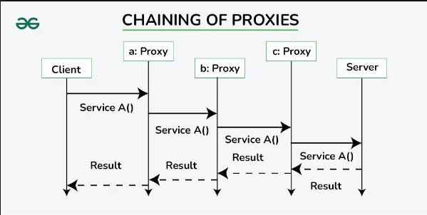
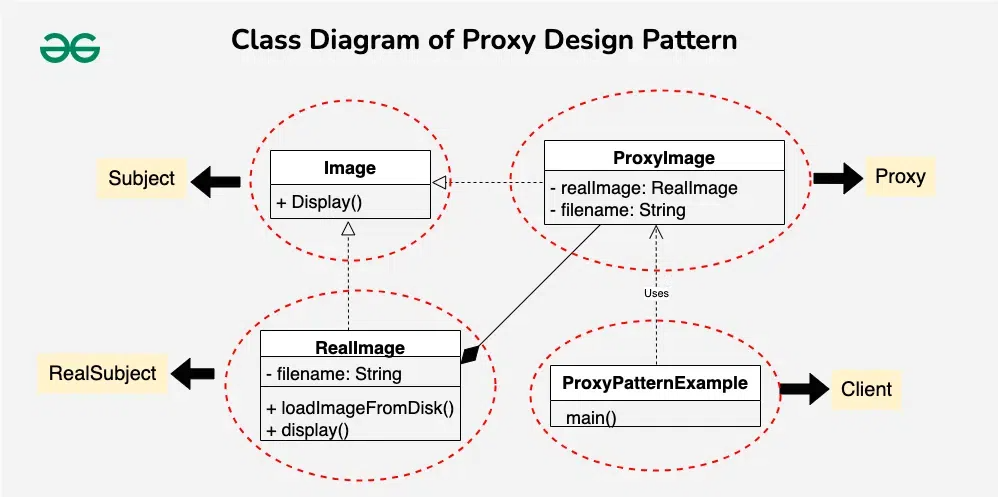
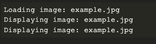

Proxy Tasarım Deseninde proxy'lerin chain edilmesi, her proxy'nin request'i bir sonraki proxy'ye veya real nesneye
iletmeden önce behavior'unu veya kontrollerini eklediği bir sırayla bağlanması anlamına gelir. Bu, her biri belirli bir
görevden sorumlu olan bir muhafız zinciri oluşturmak gibidir.



## Proxy Pattern'in Component'leri

1 - Subject

Subject, RealSubject ve Proxy sınıfları tarafından paylaşılan common interface'i tanımlayan bir interface veya abstract
bir sınıftır. Proxy'nin RealSubject'e erişimi kontrol etmek için kullandığı methodları bildirir.

* Hem RealSubject hem de Proxy için common interface'i bildirir.

* Genellikle client kodunun RealSubject ve Proxy üzerinde çağırabileceği methodları içerir.

2 - Real Subject

RealSubject, Proxy'nin temsil ettiği gerçek nesnedir. Business logic'in gerçek implementasyonunu veya client kodunun
erişmek istediği kaynağı içerir.

* Subject interface'i tarafından declare edilen operation'ları implement eder

* Proxy'nin erişimini kontrol ettiği gerçek kaynağı veya nesneyi temsil eder.

3 - Proxy

Proxy, RealSubject için bir placeholder veya surrogate görevi görür. Gerçek nesneye erişimi kontrol eder ve lazy
loading, erişim kontrolü veya log gibi ek operation'lar sağlayabilir.

* RealSubject (Subject) ile aynı interface'i implement eder

* RealSubject için bir referans tutar

* Gerekirse ek logic ekleyerek RealSubject'e erişimi kontrol eder.

## Example

Uygulamanızın görüntüleri yüklemesi ve görüntülemesi gereken bir senaryo düşünün ve görüntü yükleme sürecini optimize
etmek istiyorsunuz. Görüntüleri diskten veya diğer harici kaynaklardan yüklemek, özellikle görüntüler büyükse veya
uzakta depolanmışsa, yoğun kaynak kullanımı gerektirebilir.

Bu sorunu çözmek için, görüntülerin erişimini ve yüklenmesini kontrol etmek üzere Proxy Tasarım Modelini implement
etmemiz gerekir.



1 - Subject (Image Interface)

Image Interface'i, görüntüleri görüntülemek için common methodları bildirir ve hem Real hem de proxy nesneleri için bir
blueprint (plan) görevi görür. Bu tasarımda, hem RealImage hem de ProxyImage'ın implement etmesi gereken display()
methodunu tanımlar. Bu, görüntü nesneleriyle etkileşime giren client'lar için tek tip bir interface sağlar.

```
public interface Image {
    void display();
}
```

2 - RealSubject (RealImage class)

RealImage sınıfı, proxy'nin erişimi kontrol edeceği gerçek nesneyi temsil eder

* Diskten görüntü yüklemek ve görüntülemek için concrete implementasyonlar sağlayan Image interface'ini implement eder

* Constructor, image dosyası name'ini initialize eder ve display() methodu, önceden yüklenmemişse görüntüyü yüklemekten
  ve ardından görüntülemekten sorumludur

```
public class RealImage implements Image{

    private final String fileName;

    public RealImage(String fileName) {
        this.fileName = fileName;
        loadingImageFromDisk();
    }

    private void loadingImageFromDisk(){
        System.out.println("Loading image : " + fileName);
    }
    
    @Override
    public void display() {
        System.out.println("Displaying image : " + fileName);
    }
}
```

3 - Proxy (ProxyImage) class

ProxyImage sınıfı, RealImage için bir surrogate (vekil) görevi görür. Ayrıca Image interface'ini implement ederek Real
image nesnesine bir referans sağlar.

* Proxy'deki display() methodu Real Image'in yüklenip yüklenmediğini kontrol eder; yüklenmemişse yeni bir RealImage
  instance'i oluşturur ve display() call'unu ona delege eder.

* Bu lazy loading mekanizması, real image'in yalnızca gerekli olduğunda yüklenmesini sağlar

```
public class ProxyImage implements Image{
    private RealImage realImage;
    private final String fileName;

    public ProxyImage(String fileName) {
        this.fileName = fileName;
    }

    @Override
    public void display() {
        if (realImage == null){
            realImage = new RealImage(fileName);
        }
        realImage.display();
    }
}
```

4 - Client Code

Client kodu (ProxyPatternExample) Proxy Tasarım Deseninin kullanımını göstermektedir. Aslında bir ProxyImage instance'i
olan bir Image nesnesi oluşturur.

* Client, proxy üzerinde display() methodunu çağırır

* Proxy ise real image'e erişimi kontrol ederek sadece ihtiyaç duyulduğunda diskten yüklenmesini sağlar.

* Daha sonraki display() call'ları proxy'deki cache'e alınmış image'i kullanarak gereksiz yüklemeyi önler ve performansı
  artırır.

```
public class ProxyPatternExample {
    public static void main(String[] args) {
        Image image = new ProxyImage("Image.jpg");
        image.display();
        image.display();
    }
}
```



## Proxy Design Pattern'e neden ihtiyaç duyarız?

Proxy Tasarım Modeli, nesnelere erişimi kontrol etmek, işlevsellik eklemek veya performansı optimize etmek için bir yol
sağlayarak yazılım geliştirmedeki çeşitli endişeleri ve senaryoları ele almak için kullanılır.

* Lazy Loading

Proxy'lerin birincil kullanım alanlarından biri lazy loading'dir. Bir nesneyi creating veya initializing'i yoğun kaynak
gerektirdiği durumlarda, proxy gerçek nesnenin oluşturulmasını gerçekten ihtiyaç duyulana kadar erteler.

Bu, gereksiz kaynak tahsisinden kaçınarak performansın artmasını sağlayabilir.

* Access Control

Proxy'ler erişim kontrol politikalarını uygulayabilir.

Proxy'ler, gerçek nesneye bir bekçi gibi davranarak, belirli koşullara göre erişimi kısıtlayabilir, güvenlik veya izin
kontrolleri sağlayabilir.

* Protection Proxy

Protection proxy'leri, ek bir güvenlik kontrolleri katmanı ekleyerek gerçek bir nesneye erişimi kontrol eder

Gerçek nesneye erişime izin vermeden önce client kodunun gerekli izinlere sahip olduğundan emin olabilirler

* Caching

Proxy'ler sonuçları veya kaynakları saklamak için caching mekanizmaları implement edebilir

Bu, özellikle real bir nesne üzerinde tekrarlanan işlemler önceki sonuçları cache'e alarak optimize edilebildiğinde,
gereksiz hesaplamalardan veya veri getirmeden kaçınıldığında kullanışlıdır

* Logging and Monitoring

Proxy'ler, Logging veya Monitoring işlevleri eklemek için uygun bir nokta sağlar.

Proxy'ler, real nesneye yapılan method çağrılarına müdahale ederek, real nesneyi değiştirmeden bilgileri loga
kaydedebilir, kullanımı monitor edebilir veya performansı ölçebilir.