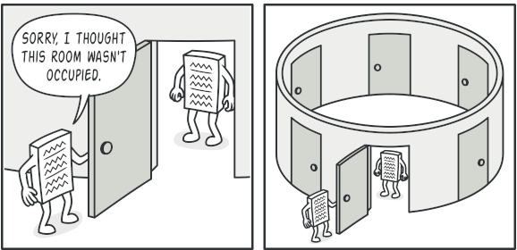
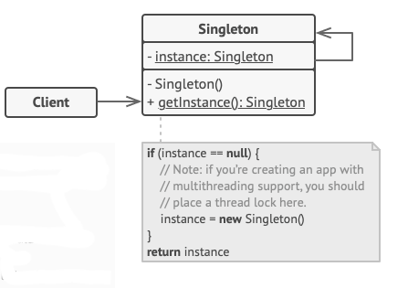

# Singleton Design Pattern

Singleton, bir sınıfın yalnızca bir instance'a sahip olmasını sağlarken bu instance'a global bir erişim noktası sağlayan
bir tasarım modelidir.

# Problem

Singleton kalıbı aynı anda iki sorunu çözerek Single Responsibility İlkesini ihlal eder:

1 - Bir sınıfın sadece tek bir instance'a sahip olmasını sağlayın. Bir sınıfın kaç instance'i olduğunu neden kontrol
etmek isteyelim ki? Bunun en yaygın nedeni, paylaşılan bazı kaynaklara (örneğin, bir veritabanı veya bir dosya) erişimi
kontrol etmektir.

Şöyle çalışır: bir nesne yarattığınızı, ancak bir süre sonra yeni bir nesne yaratmaya karar verdiğinizi düşünün. Yeni
bir nesne almak yerine, daha önce oluşturduğunuz nesneyi alırsınız.

Bu davranışın normal bir constructor ile uygulanmasının imkansız olduğunu unutmayın, çünkü bir constructor çağrısı
tasarım gereği her zaman yeni bir nesne döndürmelidir.

Client'lar her zaman aynı nesne ile çalıştıklarının farkında bile olmayabilirler.

2 - Bu instance'a global bir erişim noktası sağlayın. Bazı temel nesneleri saklamak için kullandığınız global
variable'ları hatırlıyor musunuz? Çok kullanışlı olsalar da, herhangi bir kod potansiyel olarak bu variable'ların
içeriğinin üzerine yazıp uygulamayı çökertebileceğinden aynı zamanda çok güvensizdirler.

Tıpkı global bir değişken gibi, Singleton kalıbı da programın herhangi bir yerinden bir nesneye erişmenizi sağlar.
Bununla birlikte, bu instance'i diğer kodlar tarafından üzerine yazılmaktan da korur.

Bu sorunun başka bir yönü daha var: 1 numaralı sorunu çözen kodun programınızın her yerine dağılmasını istemezsiniz.
Özellikle kodunuzun geri kalanı zaten ona bağlıysa, tek bir sınıf içinde olması çok daha iyidir.

Günümüzde, Singleton kalıbı o kadar popüler hale geldi ki, insanlar listelenen sorunlardan yalnızca birini çözse bile
bir şeyi singleton olarak adlandırabilir.

# Solution

Singleton'ın tüm implementasyonlarında bu iki adım ortaktır:

* Diğer nesnelerin Singleton sınıfı ile new operatörünü kullanmasını önlemek için varsayılan constructor'i private
  yapın.

* Constructor görevi gören statik bir creation methodu oluşturun. Kaputun altında, bu method bir nesne oluşturmak için
  private constructor'i çağırır ve onu statik bir alana kaydeder. Bu methoda yapılan tüm sonraki çağrılar önbelleğe
  alınan nesneyi döndürür.

Kodunuz Singleton sınıfına erişebiliyorsa, Singleton'ın statik methodunu çağırabilir. Böylece bu method her
çağrıldığında, her zaman aynı nesne döndürülür.

# Real World Analogy

Hükümet, Singleton modelinin mükemmel bir örneğidir. Bir ülkenin yalnızca tek bir resmi hükümeti olabilir. Hükümetleri
oluşturan bireylerin kişisel kimlikleri ne olursa olsun, "X Hükümeti" başlığı, sorumlu insan grubunu tanımlayan küresel
bir erişim noktasıdır.

# Structure

1 - Singleton sınıfı, kendi sınıfının aynı instance'ini döndüren getInstance statik methodunu bildirir.

Singleton'ın constructor'i client kodundan gizlenmelidir. Singleton nesnesini almanın tek yolu getInstance methodunu
çağırmak olmalıdır.

# Applicability

Programınızdaki bir sınıfın tüm client'lar tarafından kullanılabilen tek bir instance'i olması gerektiğinde Singleton
kalıbını kullanın; örneğin, programın farklı bölümleri tarafından paylaşılan tek bir veritabanı nesnesi.

Singleton kalıbı, special creation method dışında bir sınıfın nesnelerini oluşturmanın diğer tüm yollarını devre dışı
bırakır. Bu method ya yeni bir nesne oluşturur ya da zaten oluşturulmuşsa mevcut bir nesneyi döndürür.

Global değişkenler üzerinde daha sıkı kontrole ihtiyaç duyduğunuzda Singleton modelini kullanın.

