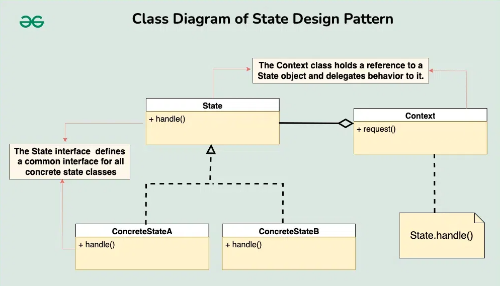
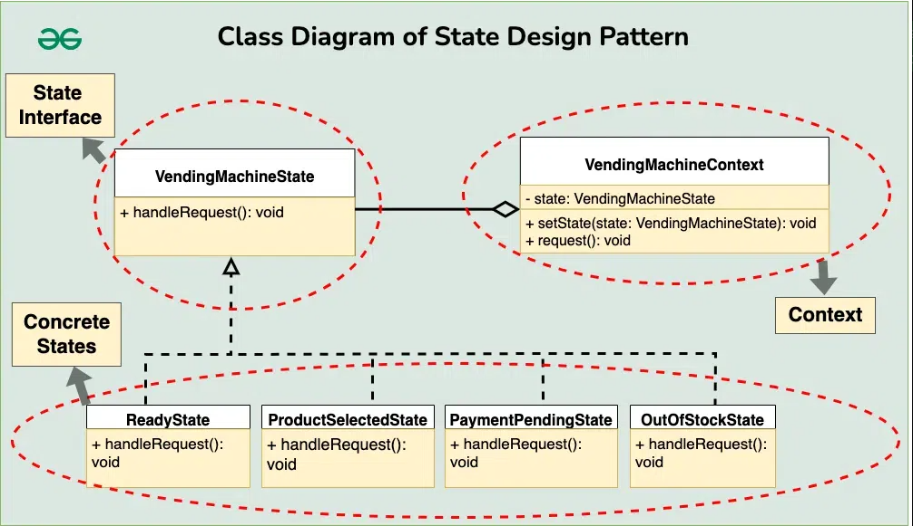

# State Design Pattern Component'leri

1 - Context

Context, internal state'ine bağlı olarak behavior'u değişen nesneyi içeren sınıftır. Context'in geçerli state'ini temsil
eden geçerli state nesnesine bir referans tutar. Context, client'ların etkileşime girmesi için bir interface sağlar ve
genellikle state'e özgü davranışı geçerli state nesnesine delege eder.

2 - State Interface yada Base Class

State interface'i veya Base class, tüm concrete state sınıfları için ortak bir interface tanımlar. Bu interface tipik
olarak Context'in sergileyebileceği state'e özgü behavior'u temsil eden methodları bildirir. Context'in concrete
türlerini bilmeden state nesneleriyle etkileşime girmesine olanak tanır.

3 - Concrete States

Concrete State sınıfları State interface'ini implement eder veya base class'ı extends eder. Her concrete state sınıfı,
Context'in belirli bir state'i ile ilişkili behavior'u kapsüller. Bu sınıflar, Context'in kendi state'lerindeyken nasıl
davranacağını tanımlar.



# Component'ler arasında ki iletişim

State tasarım modelinde, componentler arasındaki iletişim tipik olarak şu adımları izler:

1 - Client etkileşimi

Client, Context nesnesiyle doğrudan veya dolaylı olarak, üzerindeki methodları çağırarak etkileşime girer.

2 - Behavior Delegation

Client bir action'ı trigger ettiğinde veya Context'ten bir behavior talep ettiğinde, Context sorumluluğu geçerli State
nesnesine delege eder.

3 - State'e Özel Behavior Execute etmek

Geçerli State nesnesi delegated request'ini alır ve kendi özel state'i ile ilişkili behavior'u yürütür.

4 - Olası State Transition (Geçişi)

State nesnesi içinde implement edilen veya Context tarafından kontrol edilen logic'e bağlı olarak, bir state
transition'ı (geçişi) meydana gelebilir.

5 - Mevcut State Güncellemesi

Bir state transition (geçişi) meydana gelirse Context, internal state'inde ki değişikliği yansıtacak şekilde referansını
yeni state nesnesine günceller.

6 - Devam Eden Etkileşim

Client gerektiğinde Context ile etkileşime girmeye devam eder ve Context'in mevcut state'ine bağlı olarak uygun State
nesnesine behavior delegasyonu ile süreç tekrarlanır.

```
Bu iletişim akışı, Context'in internal state'ine bağlı olarak dinamik behavior değişiklikleri elde etmek için Context ve 
State nesnelerinin sorunsuz bir şekilde birlikte çalışmasını sağlar. Context state'i yönetir ve behavior'u geçerli State 
nesnesine delege eder, State nesneleri ise state'e özgü behavior'u kapsüller ve gerektiğinde state'ler arasındaki 
geçişleri idare eder
```

# State Tasarım Deseninin Gerçek Dünya Benzetmesi

Bir trafik lambasını robot olarak hayal edin. "Dur" (Kırmızı), "Hazır Ol" (Sarı) ve "Git" (Yeşil) gibi farklı ruh
hallerine sahiptir.

* Robot, zamana veya arabaların bekleyip beklemediğine göre ruh halini değiştiriyor.

* "STOP" dendiğinde, arabalar durur ve insanlar yürüyebilir. "Get Ready" olduğunda, her şey değişmek üzeredir. Ve "GO"
  olduğunda, arabalar devam edebilir.

* Bu kurulum, yeni ruh halleri eklemeyi veya robotun diğer her şeyi bozmadan nasıl davrandığını değiştirmeyi
  kolaylaştırır. Yani, ne zaman duracağını, hazırlanacağını veya gideceğini bilen bir robot trafik ışığına sahip olmak
  gibi!

# State Design Pattern Örneği

Çeşitli ürünler satan bir otomat düşünün. Otomatın hizmete hazır olma, ürün seçimini bekleme, ödemeyi işleme koyma ve
stokta bulunmama gibi farklı durumları yönetmesi gerekiyor. Bu otomatın davranışını verimli bir şekilde modelleyen bir
sistem tasarlayın.

### State Pattern bu sistemi oluştururken nasıl yardımcı olacaktır:

* Farklı State'lerin Modellenmesi:
    * State tasarım deseni, otomatın her bir state'ini (örneğin, ready, product selected, payment pending, out of stock)
      ayrı bir sınıf olarak modellememize olanak tanır.
    * Sorunların bu şekilde ayrılması kod tabanının daha düzenli ve sürdürülebilir olmasını sağlar.

* State'e Özgü Behavior'un Encapsulation'ı
    * Her state sınıfı kendine özgü behavior'u kapsüller. Örneğin, ReadyState sınıfı makine ürün seçimi için hazır
      olduğunda behavior'unu ele alırken, PaymentPendingState sınıfı ödemelerin işlenmesiyle ilgili behavior'u ele alır
    * Bu kapsülleme, complex state'e bağlı logic'in yönetilmesine yardımcı olur ve daha iyi kod okunabilirliğini
      destekler.

* Dynamic State Transition (Geçişleri)
    * State pattern dinamik state transition'larını (geçişlerini) kolaylaştırır. Örneğin, bir kullanıcı bir ürün
      seçtiğinde, otomat ReadyState'ten ProductSelectedState'e geçer ve kullanıcının action'larına bağlı olarak başka
      geçişler de gerçekleşir.
    * Bu dynamic behavior, otomatın farklı senaryolara uyum sağlamasına ve state değişikliklerini sorunsuz bir şekilde
      ele almasına olanak tanır.

* Code Reusability
    * State'leri ayrı sınıflar olarak implemente ederek, State pattern kodun yeniden kullanılabilirliğini teşvik eder.
      State'ler, farklı context'lerde veya otomat implementasyonlarında değişiklik yapılmadan yeniden kullanılabilir.
    * Bu yeniden kullanılabilirlik, kod tekrarını azaltır ve daha modüler ve ölçeklenebilir bir tasarımı teşvik eder.

* Maintainability and Flexibility
    * Otomat gereksinimleri geliştikçe veya yeni state'lerin eklenmesi gerektiğinde, State Pattern sistemi genişletmeyi
      kolaylaştırır.
    * State'e özgü behavior'da yapılan değişiklikler veya eklemeler kod tabanının diğer kısımlarını etkilemeden
      yapılabilir, bu da bakım kolaylığı ve esnekliğin artmasını sağlar.

# Sistem ile Kullanıcı Etkileşimi

Otomat ile kullanıcı etkileşimleri state transition'larını (geçişlerini) trigger eder. Örneğin, bir kullanıcı para
eklediğinde, otomat "ReadyState" state'inden "PaymentPendingState" state'ine geçer. Benzer şekilde, bir ürün
seçildiğinde, otomat "ProductSelectedState" state'ine geçer. Eğer bir ürün stokta yoksa, otomat "OutOfStockState"
state'ine geçer.



1. Context(VendingMachineContext)

```
public class VendingMachineContext {
    private VendingMachineState state;

    public void setState(VendingMachineState state){
        this.state = state;
    }

    public void request(){
        this.state.handleRequest();
    }
}
```

2 - State Interface (VendingMachineState)

```
public interface VendingMachineState {
    void handleRequest();
}
```

3 - Concrete States (Specific Vending Machine States)

Concrete state sınıfları otomatın "ReadyState", "ProductSelectedState" ve "OutOfStockState" gibi belirli state'lerini
temsil eder. Her concrete state sınıfı, ürün seçimine izin vermek, ödemeyi işlemek veya stokta yok mesajı görüntülemek
gibi ilgili state ile ilişkili behavior'u implemente eder.

### ReadyState

```
public class ReadyState implements VendingMachineState{
    @Override
    public void handleRequest() {
        System.out.println("Please select a product");
    }
}
```

### ProductSelectedState

```
public class ProductSelectedState implements VendingMachineState{
    @Override
    public void handleRequest() {
        System.out.println("Product selected state : Processing Payment");
    }
}
```

### PaymentPendingState

```
public class PaymentPendingState implements VendingMachineState{
    @Override
    public void handleRequest() {
        System.out.println("Payment pending state: Dispensing product.");
    }
}
```

### OutOfStockState

```
public class OutOfStockState implements VendingMachineState{
    @Override
    public void handleRequest() {
        System.out.println("Out of stock state: Product unavailable. Please select another product.");
    }
}
```

### Main

```
public class Main {
    public static void main(String[] args) {
        VendingMachineContext vendingMachineContext = new VendingMachineContext();
        vendingMachineContext.setState(new ReadyState());
        vendingMachineContext.request();

        vendingMachineContext.setState(new ProductSelectedState());
        vendingMachineContext.request();

        vendingMachineContext.setState(new PaymentPendingState());
        vendingMachineContext.request();

        vendingMachineContext.setState(new OutOfStockState());
        vendingMachineContext.request();
    }
}
```

Yukarıdaki örnekte Component'ler arasındaki iletişim:

* Bir kullanıcı otomatla (Context) etkileşime girdiğinde, örneğin para yerleştirdiğinde veya bir ürün seçtiğinde, otomat
  etkileşimi ele alma sorumluluğunu mevcut state nesnesine delege eder.

* Geçerli state nesnesi (örneğin, "ReadyState" veya "ProductSelectedState"), ödemenin işlenmesi veya seçilen ürünün
  dağıtılması gibi bu durumla ilişkili behavior'u yürütür.

* Etkileşimin sonucuna ve mevcut state nesnesi içinde uygulanan logic'e bağlı olarak, otomat farklı bir state'e
  geçebilir.

* Kullanıcı otomatla daha fazla etkileşime girdikçe, otomatın mevcut state'ine göre uygun state nesnesine devredilen
  behavior ile süreç devam eder.

# State Pattern ne zaman kullanılır?

State tasarım deseni, behavior'ları internal state'lerine göre dinamik olarak değişen nesnelerle karşılaştığınızda
faydalıdır. İşte bazı temel göstergeler:

* Farklı behavior'lara sahip birden fazla state: Nesneniz birkaç state'de bulunuyorsa (örneğin, On/Off, Open/Close,
  Started/Stoped) ve her state benzersiz behavior'lar gerektiriyorsa, State pattern bu logic'i etkili bir şekilde
  kapsülleyebilir.

* Complex conditional logic: Nesnenizde koşullu ifadeler (if-else veya switch-case) kapsamlı ve karmaşık hale
  geldiğinde, State pattern state'e özgü behavior'u ayrı sınıflar halinde düzenlemeye ve ayırmaya yardımcı olarak
  okunabilirliği ve sürdürülebilirliği artırır.

* Sık state değişiklikleri: Nesneniz sık sık state'ler arasında geçiş yapıyorsa, State deseni bu geçişleri ve ilgili
  action'ları yönetmek için net bir mekanizma sağlar.

* Yeni state'leri kolayca ekleme: Gelecekte yeni state'leri eklemeyi düşünüyorsanız, State kalıbı mevcut state'leri
  etkilemeden yeni state sınıfları oluşturmanıza izin vererek bunu kolaylaştırır.

# State Pattern ne zaman kullanılmaz

* Basit behavior'a sahip az sayıda state: Nesnenizde minimum davranışsal farklılıklara sahip yalnızca birkaç basit state
  varsa, State modelinin ek yükü faydalarından daha ağır basar. Bu gibi durumlarda, nesnenin kendi içindeki daha basit
  koşullu mantık yeterli olabilir.

* Performans açısından kritik senaryolar: Bu model, ek nesne oluşturma ve method çağrıları getirerek performansı
  etkileyebilir. Performans çok önemliyse, farklı bir yaklaşım daha uygun olabilir.