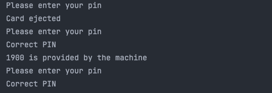

# ATMState

```
public interface ATMState {
    void insertCard();
    void ejectCard();
    void insertPin(int pinNumber);
    void requestCash(int cashToWithdraw);
}
```

# Context - ATMMachine

```
public class ATMMachine {
    ATMState hasCard;
    ATMState noCard;
    ATMState hasCorrectPin;
    ATMState outOfMoney;
    ATMState state;

    int cashInMachine = 2000;
    boolean correctPinEntered = false;

    public ATMMachine() {
        this.hasCard = new HasCard(this);
        this.noCard = new NoCard(this);
        this.hasCorrectPin = new HasCorrectPin(this);
        this.outOfMoney = new OutOfMoney(this);

        state = noCard;

        if (cashInMachine < 0) {
            state = outOfMoney;
        }
    }

    public void setState(ATMState state) {
        this.state = state;
    }

    public void setCashInMachine(int cash) {
        cashInMachine = cash;
    }

    public void insertCard(){
        state.insertCard();
    }

    public void ejectCard(){
        state.ejectCard();
    }

    public void insertPin(int pin){
        state.insertPin(pin);
    }

    public void requestCash(int cashToWithdraw){
        state.requestCash(cashToWithdraw);
    }

    public ATMState getState(){
        return this.state;
    }

    public ATMState getHasCardState(){
        return this.hasCard;
    }

    public ATMState getNoCardState(){
        return this.noCard;
    }

    public ATMState getHasCorrectPinState(){
        return this.hasCorrectPin;
    }

    public ATMState getOutOfMoneyState(){
        return this.outOfMoney;
    }
}
```

# Concrete ATM States

### HasCard State

```
public class HasCard implements ATMState{
    ATMMachine atmMachine;

    public HasCard(ATMMachine atmMachine) {
        this.atmMachine = atmMachine;
    }

    @Override
    public void insertCard() {
        System.out.println("You can't insert more than one card");
    }

    @Override
    public void ejectCard() {
        System.out.println("Card ejected");
        atmMachine.setState(atmMachine.getNoCardState());
    }

    @Override
    public void insertPin(int pinNumber) {
        if (pinNumber == 1234){
            System.out.println("Correct PIN");
            atmMachine.correctPinEntered = true;
            atmMachine.setState(atmMachine.getHasCorrectPinState());
        } else {
            System.out.println("Wrong PIN");
            atmMachine.correctPinEntered = false;
            System.out.println("Card Ejected");
            atmMachine.setState(atmMachine.getNoCardState());
        }
    }

    @Override
    public void requestCash(int cashToWithdraw) {
        System.out.println("Enter PIN First");
    }
}
```

### NoCard State

```
public class NoCard implements ATMState{
    ATMMachine atmMachine;

    public NoCard(ATMMachine atmMachine) {
        this.atmMachine = atmMachine;
    }

    @Override
    public void insertCard() {
        System.out.println("Please enter your pin");
        atmMachine.setState(atmMachine.getHasCardState());
    }

    @Override
    public void ejectCard() {
        System.out.println("You didn't enter a card");
    }

    @Override
    public void insertPin(int pinNumber) {
        System.out.println("You have not entered your card");
    }

    @Override
    public void requestCash(int cashToWithdraw) {
        System.out.println("You have not entered your card");
    }
}
```

### HasCorrectPin State

```
public class HasCorrectPin implements ATMState{
    ATMMachine atmMachine;

    public HasCorrectPin(ATMMachine atmMachine) {
        this.atmMachine = atmMachine;
    }

    @Override
    public void insertCard() {
        System.out.println("You already entered a card");
    }

    @Override
    public void ejectCard() {
        System.out.println("Your card is ejected");
        atmMachine.setState(atmMachine.getNoCardState());
    }

    @Override
    public void insertPin(int pinNumber) {
        System.out.println("You already entered a PIN");
    }

    @Override
    public void requestCash(int cashToWithdraw) {
        if (cashToWithdraw > atmMachine.cashInMachine){
            System.out.println("You don't have much cash available");
            System.out.println("Your card is ejected");
            atmMachine.setState(atmMachine.getNoCardState());
        } else {
            System.out.println(cashToWithdraw + " is provided by the machine");
            atmMachine.setState(atmMachine.getNoCardState());
            if (atmMachine.cashInMachine <= 0){
                atmMachine.setState(atmMachine.getOutOfMoneyState());
            }
        }
    }
}
```

### OutOfMoney State

```
public class OutOfMoney implements ATMState{
    ATMMachine atmMachine;

    public OutOfMoney(ATMMachine atmMachine) {
        this.atmMachine = atmMachine;
    }

    @Override
    public void insertCard() {
        System.out.println("We don't have any money");
        System.out.println("Your card is ejected");
    }

    @Override
    public void ejectCard() {
        System.out.println("We don't have any money");
        System.out.println("There is no card to eject");
    }

    @Override
    public void insertPin(int pinNumber) {
        System.out.println("We don't have any money");
    }

    @Override
    public void requestCash(int cashToWithdraw) {
        System.out.println("We don't have any money");
    }
}
```

### Main

```
public class Main {
    public static void main(String[] args) {
        ATMMachine atmMachine = new ATMMachine();

        atmMachine.insertCard();
        atmMachine.ejectCard();

        atmMachine.insertCard();
        atmMachine.insertPin(1234);
        atmMachine.requestCash(1900);

        atmMachine.insertCard();
        atmMachine.insertPin(1234);
    }
}
```


